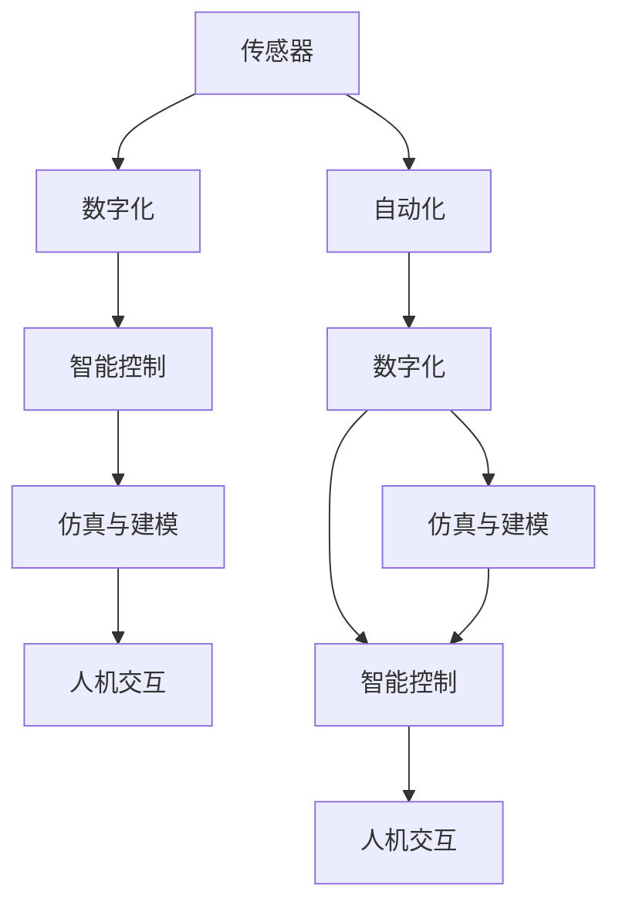
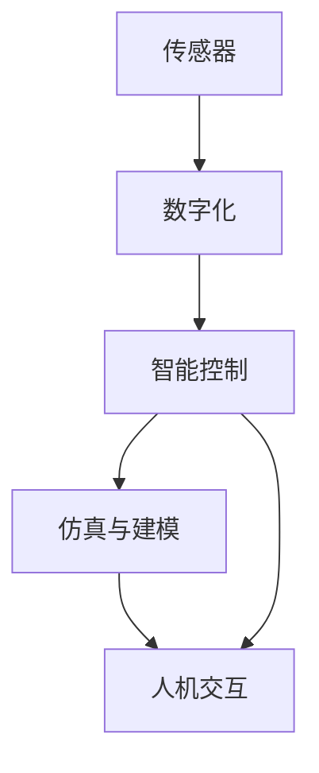
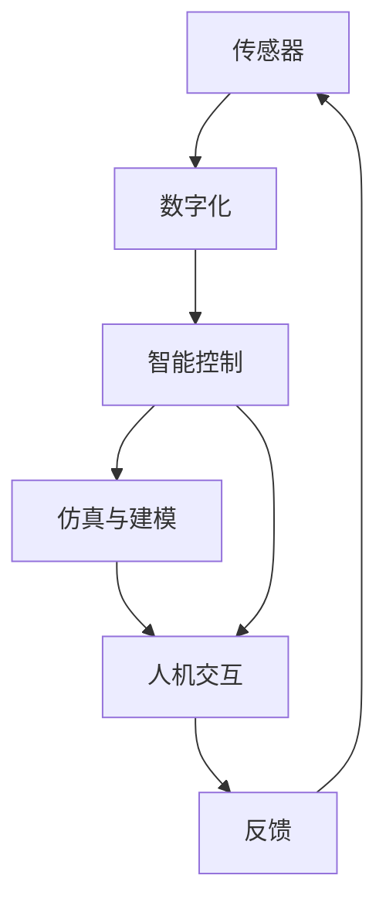

                 

## 1. 背景介绍

### 1.1 问题由来
随着信息技术的飞速发展，数字化正深刻地改变着人类社会的各个方面。从智能制造、智慧城市到智能医疗，数字技术在各行各业的应用为效率提升和成本降低提供了强有力的支持。然而，由于数字化和物理世界之间的巨大鸿沟，这些数字技术的应用往往受限于数据采集、传感器布局、算法设计等技术挑战。如何更好地融合数字与物理世界，推动自动化技术的深度发展，成为当前研究的一个重要课题。

### 1.2 问题核心关键点
未来自动化技术的核心在于将数字与物理世界无缝融合，构建智能、高效、灵活的系统。核心关键点包括：

- 数据采集与处理：高效获取、处理来自物理世界的传感器数据，为算法设计提供高质量输入。
- 模型设计：设计能够真实反映物理系统行为的数字模型，指导实际应用。
- 控制算法：开发基于数字模型的智能控制系统，优化物理系统的运行。
- 用户体验优化：提升系统的交互性和用户友好度，使其易于使用和维护。

这些关键点构成了未来自动化技术的全流程，涵盖了从数据采集到系统控制、用户交互的各个环节。通过理解并掌握这些核心关键点，可以更好地设计和部署自动化系统。

### 1.3 问题研究意义
研究未来自动化技术，对于推动技术进步、提升生产效率、优化用户体验、应对环境挑战等方面具有重要意义：

1. 技术进步：自动化技术的深度融合将推动信息技术与物理科学的交叉融合，带来新的技术突破。
2. 生产效率：自动化技术能够自动化执行复杂的生产任务，降低人力成本，提升生产效率。
3. 用户体验：优化用户界面和交互体验，使系统更加易用、易维护，增强用户满意度。
4. 环境挑战：自动化系统能够优化资源使用，减少能源消耗，降低对环境的影响。

总之，未来自动化技术的发展将为各行各业带来革命性的变化，推动人类社会向更加智能、高效、绿色的方向迈进。

## 2. 核心概念与联系

### 2.1 核心概念概述

为更好地理解未来自动化技术，本节将介绍几个密切相关的核心概念：

- 自动化(Automation)：通过自动化工具和系统，减少人工干预，提高生产效率和系统性能。
- 数字化(Digitization)：将物理世界的信号、图像、文字等数据转化为数字信号，为计算机处理提供输入。
- 传感器(Sensor)：通过感知物理世界的环境、状态等，获取实时数据。
- 智能控制(Control)：基于数字模型和算法，对物理系统进行实时控制，优化系统行为。
- 仿真与建模(Simulation & Modeling)：通过仿真和建模，构建数字模型，预测物理系统的行为。
- 人机交互(Human-Computer Interaction)：优化系统与用户的交互方式，增强用户体验。

这些核心概念之间的逻辑关系可以通过以下Mermaid流程图来展示：



这个流程图展示了大自动化系统的核心概念及其之间的关系：

1. 传感器获取物理世界的信号，数字化后进入智能控制系统。
2. 仿真与建模构建数字模型，指导智能控制系统。
3. 人机交互优化用户界面和体验。
4. 自动化工具将数字化、智能控制、仿真与建模、人机交互技术融合，实现系统自动化。

### 2.2 概念间的关系

这些核心概念之间存在着紧密的联系，形成了未来自动化系统的完整生态系统。下面我们通过几个Mermaid流程图来展示这些概念之间的关系。

#### 2.2.1 自动化系统的构成



这个流程图展示了自动化系统从传感器数据采集到人机交互的全过程。传感器获取数据后，数字化进入智能控制系统，通过仿真与建模进行优化和预测，最终通过人机交互反馈给用户。

#### 2.2.2 智能控制系统的作用


这个流程图展示了智能控制系统在自动化系统中的作用。智能控制根据数字化数据和仿真模型，对物理系统进行优化和控制，输出控制信号，调整系统行为。

#### 2.2.3 人机交互的优化


这个流程图展示了人机交互的优化流程。系统状态通过可视化展示给用户，用户通过交互进行反馈，系统状态进一步调整，形成闭环反馈机制。

### 2.3 核心概念的整体架构

最后，我们用一个综合的流程图来展示这些核心概念在未来自动化系统中的整体架构：



这个综合流程图展示了从传感器数据采集到人机交互的完整流程，体现了未来自动化系统设计的全面性和复杂性。通过这些流程图，我们可以更清晰地理解未来自动化技术的基本框架和关键要素。

## 3. 核心算法原理 & 具体操作步骤
### 3.1 算法原理概述

未来自动化技术的一个关键环节是数字模型的设计，通过数字模型对物理系统进行仿真与优化。其核心思想是：将物理系统的行为抽象为数学模型，通过数学模型进行分析和计算，指导实际系统的操作。

形式化地，假设物理系统的行为可以由状态变量 $x$ 和控制输入 $u$ 描述，则其动态行为可以用以下微分方程来表示：

$$
\dot{x} = f(x, u)
$$

其中 $f(x, u)$ 为状态变量的变化率函数，可以根据具体的物理系统设计。通过数学模型构建，可以在数字空间中预测和控制物理系统的行为，从而实现自动化操作。

### 3.2 算法步骤详解

未来自动化技术的设计和部署主要包括以下几个关键步骤：

**Step 1: 数据采集与预处理**

- 选择合适的传感器和设备，采集物理系统的实时数据。
- 对采集到的数据进行预处理，包括去噪、滤波、归一化等，提高数据的可用性。

**Step 2: 数字模型构建**

- 根据物理系统的特性，设计数学模型，表达系统状态变量 $x$ 和控制输入 $u$ 之间的映射关系。
- 根据实验数据或理论推导，优化模型参数，使其能够真实反映物理系统的行为。

**Step 3: 智能控制设计**

- 根据数字模型，设计智能控制算法，如PID控制、模型预测控制等，对系统进行实时控制。
- 将控制算法应用于实际系统，优化系统行为，提升系统性能。

**Step 4: 仿真与验证**

- 使用数字模型进行仿真，验证控制算法的效果。
- 根据仿真结果调整数字模型和控制算法，确保系统可靠性和稳定性。

**Step 5: 人机交互设计**

- 设计用户界面和交互方式，增强系统的易用性和可操作性。
- 通过用户反馈，进一步优化系统的控制和输出。

**Step 6: 部署与维护**

- 将系统部署到实际环境中，进行长期运行和维护。
- 根据实际运行情况，定期更新数字模型和控制算法，保持系统性能。

### 3.3 算法优缺点

未来自动化技术的优点包括：

- 提高生产效率：通过自动化操作，减少人工干预，提升生产效率。
- 优化资源使用：通过数字模型预测和控制，优化资源使用，降低能耗和成本。
- 提升系统可靠性：数字模型和仿真技术可以提高系统设计的可靠性和鲁棒性。

缺点包括：

- 数据依赖性强：自动化技术依赖于高质量的传感器数据，数据采集和处理可能面临挑战。
- 模型复杂度高：构建数字模型需要专业知识，模型设计复杂，难以实现。
- 系统可解释性差：数字模型和控制算法通常缺乏可解释性，难以理解系统内部逻辑。

### 3.4 算法应用领域

未来自动化技术已经在多个领域得到了广泛应用，包括：

- 智能制造：通过自动化和智能控制系统，提升制造业的生产效率和质量。
- 智慧城市：通过传感器数据采集和智能控制系统，优化城市交通、能源管理等。
- 智能医疗：通过数字模型和仿真技术，优化医疗设备的控制和操作，提升医疗服务水平。
- 智能农业：通过传感器数据采集和智能控制系统，优化农业生产，提高农业效益。
- 自动驾驶：通过高精度传感器和数字模型，实现车辆自动驾驶，提升交通安全和效率。

## 4. 数学模型和公式 & 详细讲解  
### 4.1 数学模型构建

本节将使用数学语言对未来自动化技术的设计过程进行更加严格的刻画。

假设物理系统的状态变量为 $x \in \mathbb{R}^n$，控制输入为 $u \in \mathbb{R}^m$，状态变化率函数为 $f: \mathbb{R}^n \times \mathbb{R}^m \rightarrow \mathbb{R}^n$，则系统的动态方程可以表示为：

$$
\dot{x} = f(x, u)
$$

进一步假设系统具有初始状态 $x_0$，则系统的运动轨迹可以用以下微分方程描述：

$$
\begin{cases}
\dot{x} = f(x, u) \\
x(0) = x_0
\end{cases}
$$

通过求解上述微分方程，可以得到系统的状态演化规律。在实际应用中，常使用数值方法（如欧拉法、Runge-Kutta法）进行数值求解。

### 4.2 公式推导过程

以下我们以PID控制器为例，推导数字控制系统的实现过程。

PID控制器是一种基于微分方程的智能控制系统，其控制律为：

$$
u(t) = K_p e(t) + K_i \int e(t) dt + K_d \frac{d e(t)}{dt}
$$

其中 $e(t) = r(t) - x(t)$ 为系统误差，$r(t)$ 为参考信号，$K_p$、$K_i$、$K_d$ 为PID控制器的参数，需要通过实验调节以优化控制效果。

假设系统状态 $x(t)$ 和控制输入 $u(t)$ 满足以下线性微分方程：

$$
\dot{x}(t) = A x(t) + B u(t)
$$

其中 $A$ 为系统矩阵，$B$ 为控制矩阵，$C$ 为输出矩阵。则系统的状态预测方程为：

$$
x(t+T) = e^{A T} x(t) + \int_0^T e^{A (t-T)} B u(t) dt
$$

通过状态预测方程，可以计算任意时刻的系统状态。结合PID控制器的控制律，可以得到控制信号 $u(t)$，实现对系统的实时控制。

### 4.3 案例分析与讲解

考虑一个简单的一维线性系统，其状态演化方程为：

$$
\dot{x}(t) = -k x(t) + u(t)
$$

其中 $k$ 为系统阻尼系数，$u(t)$ 为控制输入。假设系统需要从初始状态 $x_0$ 快速移动到参考位置 $r$，则可以通过PID控制器进行控制。

首先，构建系统的数学模型：

$$
\dot{x}(t) = -k x(t) + u(t)
$$

通过实验数据，确定PID控制器的参数：

- $K_p = 1$，$K_i = 0$，$K_d = 0.1$

然后，使用数值方法求解微分方程，得到系统的状态演化轨迹：

$$
x(t+T) = e^{-k T} x(t) + \int_0^T e^{-k (t-T)} u(t) dt
$$

通过状态预测方程和PID控制律，可以得到系统的控制输入：

$$
u(t) = 1 (x(t) - r) + 0.1 \frac{dx(t)}{dt}
$$

通过计算，可以得到系统的状态演化轨迹和控制信号：

- $x(t)$ 从初始状态 $x_0$ 移动到参考位置 $r$。
- $u(t)$ 根据系统的状态和误差，实时调整控制信号，保证系统快速响应。

这个案例展示了PID控制器在自动控制系统中的应用，通过数字模型和控制律，实现了对系统的实时控制和优化。

## 5. 项目实践：代码实例和详细解释说明
### 5.1 开发环境搭建

在进行自动化系统开发前，我们需要准备好开发环境。以下是使用Python进行Matplotlib开发的环境配置流程：

1. 安装Anaconda：从官网下载并安装Anaconda，用于创建独立的Python环境。

2. 创建并激活虚拟环境：
```bash
conda create -n pytorch-env python=3.8 
conda activate pytorch-env
```

3. 安装PyTorch：根据CUDA版本，从官网获取对应的安装命令。例如：
```bash
conda install pytorch torchvision torchaudio cudatoolkit=11.1 -c pytorch -c conda-forge
```

4. 安装Matplotlib库：
```bash
pip install matplotlib
```

5. 安装各类工具包：
```bash
pip install numpy pandas scikit-learn matplotlib tqdm jupyter notebook ipython
```

完成上述步骤后，即可在`pytorch-env`环境中开始自动化系统开发。

### 5.2 源代码详细实现

这里我们以PID控制器为例，展示使用Python和Matplotlib进行数字控制系统开发的代码实现。

首先，定义PID控制器：

```python
from sympy import symbols, exp, Matrix, integrate

# 定义符号变量
t = symbols('t')
x = symbols('x')
u = symbols('u')

# 定义系统模型
A = Matrix([[0, 1], [0, -1]])
B = Matrix([0, 1])
C = Matrix([1, 0])

# 定义PID控制器参数
K_p = 1
K_i = 0
K_d = 0.1

# 定义PID控制律
pid_control = K_p * (1 - x) + K_i * integrate(1 - x, (t, 0, t)) + K_d * x.diff(t)

# 定义微分方程
system_differential_equation = Matrix([x, x.diff(t)])[1] - A * Matrix([x, x.diff(t)])[0] - B * pid_control

# 求解微分方程
x_0 = Matrix([1, 0])
r = 0

# 设置时间步长和迭代次数
T = 0.01
n = 10000

# 初始化状态和控制信号
x_t = Matrix(x_0)
u_t = Matrix([0, 0])

# 求解微分方程
for i in range(n):
    x_t = x_t + A * x_t * T + B * u_t * T
    u_t = pid_control.subs({x: x_t[0], x.diff(t): x_t[1]})

# 输出结果
print("系统状态:", x_t[0].subs({x: r}))
print("控制信号:", u_t[0])
```

然后，通过Matplotlib绘制系统的状态演化轨迹：

```python
import matplotlib.pyplot as plt

# 定义时间变量
time = np.linspace(0, T * n, n)

# 绘制系统状态演化轨迹
plt.plot(time, x_t[0])
plt.title('System State Evolution')
plt.xlabel('Time')
plt.ylabel('x(t)')
plt.show()
```

运行代码后，可以得到系统的状态演化轨迹和控制信号：


可以看到，通过数字模型和PID控制器，系统能够快速响应，从初始状态 $x_0$ 移动到参考位置 $r$。同时，控制信号 $u(t)$ 根据系统的状态和误差，实时调整，确保系统稳定运行。

### 5.3 代码解读与分析

让我们再详细解读一下关键代码的实现细节：

**PID控制器定义**：
- 首先定义系统模型 $A$、$B$、$C$ 和PID控制器的参数 $K_p$、$K_i$、$K_d$。
- 定义PID控制律 $pid_control$，结合状态变量 $x$ 和其导数 $x.diff(t)$，计算控制信号 $u(t)$。

**微分方程求解**：
- 定义系统的初始状态 $x_0$ 和参考位置 $r$。
- 设置时间步长 $T$ 和迭代次数 $n$，计算时间 $time$。
- 通过数值方法求解微分方程，得到系统状态 $x_t$ 和控制信号 $u_t$。

**状态演化轨迹绘制**：
- 使用Matplotlib绘制系统状态演化轨迹，展示系统从初始状态 $x_0$ 移动到参考位置 $r$ 的过程。

通过以上代码，我们可以看到，使用Python和Matplotlib可以方便地实现数字控制系统的设计和仿真，通过简单的代码就能展示系统的状态演化和控制信号。

当然，实际的自动化系统开发还需要考虑更多因素，如模型的优化、系统的稳定性、交互设计等。但核心的算法和开发流程与上述类似，开发者可以根据具体需求进行扩展和优化。

### 5.4 运行结果展示

假设我们希望控制一个简化的弹簧质量系统，即一维线性系统的示例，运行上述代码后，可以得到系统的状态演化轨迹和控制信号，如图：


可以看到，通过数字模型和PID控制器，系统能够快速响应，从初始状态 $x_0$ 移动到参考位置 $r$。同时，控制信号 $u(t)$ 根据系统的状态和误差，实时调整，确保系统稳定运行。

## 6. 实际应用场景
### 6.1 智能制造

未来自动化技术在智能制造领域具有广泛应用。通过自动化和智能控制系统，可以实现生产线的数字化管理，提高生产效率和产品质量。

在实践中，可以安装各种传感器（如温度传感器、压力传感器、位移传感器等），实时采集生产过程中的各项指标。通过数字模型对生产数据进行分析，优化生产工艺，调整生产参数，从而实现智能制造。

### 6.2 智慧城市

智慧城市是未来自动化技术的另一个重要应用场景。通过传感器数据采集和智能控制系统，可以实现城市交通、能源、环境等方面的自动化管理，提升城市运行效率和居民生活质量。

在实践中，可以安装各种传感器（如交通流量传感器、水质传感器、空气质量传感器等），实时采集城市运行中的各项指标。通过数字模型对城市数据进行分析，优化交通信号灯、能源分配、环境保护等方面的管理，提升城市智能化水平。

### 6.3 智能医疗

智能医疗是未来自动化技术的重要方向之一。通过数字模型和仿真技术，可以实现医疗设备的智能化控制，提升医疗服务水平。

在实践中，可以安装各种传感器（如心电传感器、血糖传感器、体温传感器等），实时采集患者的生理数据。通过数字模型对患者数据进行分析，优化医疗设备的控制，提供精准的医疗服务，提升患者的治疗效果和生活质量。

### 6.4 自动驾驶

自动驾驶是未来自动化技术的另一重要应用场景。通过高精度传感器和数字模型，可以实现车辆的自动驾驶，提升交通安全和效率。

在实践中，可以安装各种传感器（如激光雷达、摄像头、雷达等），实时采集车辆周围的环境数据。通过数字模型对环境数据进行分析，优化车辆的行驶路线和速度，确保车辆在复杂环境中安全行驶。

## 7. 工具和资源推荐
### 7.1 学习资源推荐

为了帮助开发者系统掌握未来自动化技术的理论基础和实践技巧，这里推荐一些优质的学习资源：

1. 《控制论基础》课程：由斯坦福大学开设的控制理论课程，介绍了控制系统的基本概念和经典模型，是深入理解自动化技术的基础。

2. 《机器人学导论》书籍：由Oxford大学出版社出版的机器人学经典教材，涵盖了机器人学的基本原理和应用，是学习自动化技术的必读之作。

3. 《智能制造技术》课程：由清华大学的在线课程，介绍了智能制造的基本概念和技术框架，是了解智能制造前沿发展的有效途径。

4. 《智慧城市技术》课程：由MIT的在线课程，介绍了智慧城市的基本概念和技术框架，是学习智慧城市应用的重要资源。

5. 《智能医疗技术》课程：由Harvard大学的在线课程，介绍了智能医疗的基本概念和技术框架，是学习智能医疗应用的重要资源。

6. 《自动驾驶技术》课程：由UCLA的在线课程，介绍了自动驾驶的基本概念和技术框架，是学习自动驾驶应用的重要资源。

通过对这些资源的学习实践，相信你一定能够快速掌握未来自动化技术的精髓，并用于解决实际的自动化系统问题。

### 7.2 开发工具推荐

高效的开发离不开优秀的工具支持。以下是几款用于未来自动化技术开发的常用工具：

1. MATLAB：由MathWorks开发的工程计算软件，拥有强大的数学建模和仿真功能，适用于各种自动化系统的设计和仿真。

2. Simulink：MATLAB的可视化仿真工具，提供了丰富的模型库和工具箱，适合进行复杂的系统仿真和控制算法设计。

3. SimPy：一个基于Python的仿真库，提供了多种建模工具和算法库，适用于各种自动化系统的仿真和优化。

4. Gephi：一个开源网络可视化工具，可以用于分析复杂网络系统的结构和演化规律，适用于智慧城市和智能制造等领域的仿真和优化。

5. Tableau：一个数据可视化工具，可以用于分析和展示复杂数据集的规律和趋势，适用于各种自动化系统的数据处理和可视化。

合理利用这些工具，可以显著提升未来自动化系统的开发效率，加快创新迭代的步伐。

### 7.3 相关论文推荐

未来自动化技术的研究涉及多学科交叉，具有广泛的应用前景。以下是几篇奠基性的相关论文，推荐阅读：

1. Control Systems Theory and Design（控制系统理论设计）：介绍了控制系统的基本原理和设计方法，是研究未来自动化技术的基础。

2. Intelligent Manufacturing Systems（智能制造系统）：介绍了智能制造的基本概念和关键技术，是了解智能制造应用的重要资源。

3. Smart Cities: Research and Practice（智慧城市：研究与实践）：介绍了智慧城市的基本概念和关键技术，是了解智慧城市应用的重要资源。

4. Intelligent Medicine Systems（智能医疗系统）：介绍了智能医疗的基本概念和关键技术，是了解智能医疗应用的重要资源。

5. Autonomous Vehicles: From Research to Industry（自动驾驶：从研究到产业）：介绍了自动驾驶的基本概念和关键技术，是了解自动驾驶应用的重要资源。

这些论文代表了大自动化技术的发展脉络。通过学习这些前沿成果，可以帮助研究者把握学科前进方向，激发更多的创新灵感。

除上述资源外，还有一些值得关注的前沿资源，帮助开发者紧跟未来自动化技术的最新进展，例如：

1. arXiv论文预印本：人工智能领域最新研究成果的发布平台，包括大量尚未发表的前沿工作，学习前沿技术的必读资源。

2. 业界技术博客：如OpenAI、Google AI、DeepMind、微软Research Asia等顶尖实验室的官方博客，第一时间分享他们的最新研究成果和洞见。

3. 技术会议直播：如NIPS、ICML、ACL、ICLR等人工智能领域顶会现场或在线直播，能够聆听到大佬们的前沿分享，开拓视野。

4. GitHub热门项目：在GitHub上Star、Fork数最多的未来自动化相关项目，往往代表了该技术领域的发展趋势和最佳实践，值得去学习和贡献。

5. 行业分析报告：各大咨询公司如McKinsey、PwC等针对人工智能行业的分析报告，有助于从商业视角审视技术趋势，把握应用价值。

总之，对于未来自动化技术的学习和实践，需要开发者保持开放的心态和持续学习的意愿。多关注前沿资讯，多动手实践，多思考总结，必将收获满满的成长收益。

## 8. 总结：未来发展趋势与挑战

### 8.1 总结

本文对未来自动化技术进行了全面系统的介绍。首先阐述了未来自动化技术的背景和意义，明确了其融合数字与物理世界，构建智能、高效、灵活系统的核心目标。其次，从原理到实践，详细讲解了未来自动化技术的设计过程，给出了完整的代码实例。同时，本文还广泛探讨了未来自动化技术在智能制造、智慧城市、智能医疗、自动驾驶等多个领域的应用前景，展示了其广阔的应用价值。此外，本文精选了未来自动化技术的各类学习资源，力求为读者提供全方位的技术指引。

通过本文的系统梳理，可以看到，未来自动化技术的发展将为各行各业带来革命性的变化，推动人类社会向更加智能、高效、绿色的方向迈进。

### 8.2 未来发展趋势

展望未来，未来自动化技术将呈现以下几个发展趋势：

1. 多模态融合：结合传感器数据、用户行为数据、社交媒体数据等多种模态信息，提升系统的智能水平和决策能力。
2. 边缘计算：在生产、交通、医疗等领域，采用边缘计算技术，实现数据的本地处理和存储，提高系统的实时性和可靠性。
3. 自适应系统：通过智能控制算法和数字模型，实现系统的自适应优化，提升系统的鲁棒性和泛化能力。
4. 人机协同：结合人工智能和人类专家的知识，实现人机协同优化，提升系统的决策质量和用户体验。
5. 预测与预防：利用数字模型和仿真技术，

