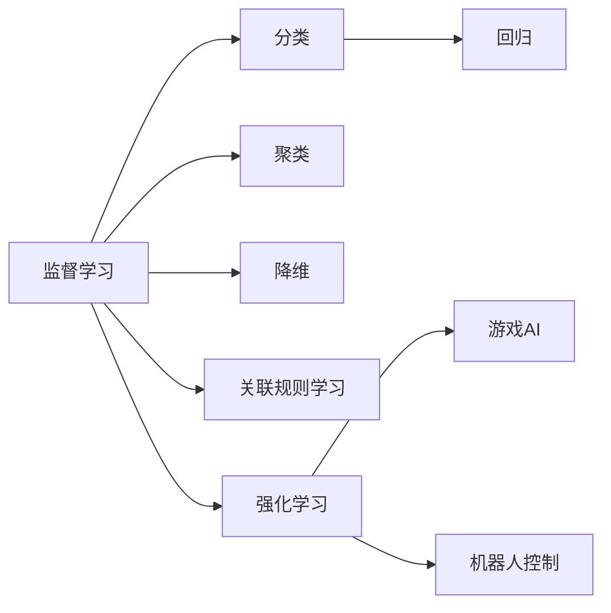

                 

# 机器学习 (Machine Learning, ML) 原理与代码实例讲解

> 关键词：机器学习, 监督学习, 无监督学习, 强化学习, 深度学习, 神经网络, 代码实例, 监督学习算法

## 1. 背景介绍

### 1.1 问题由来
机器学习（Machine Learning, ML）作为人工智能（AI）的重要分支，已经在各个领域取得了举世瞩目的成就。从语音识别到图像处理，从自然语言处理到推荐系统，机器学习技术正在全方位地改变人类的生产和生活方式。然而，尽管机器学习在学术界和工业界得到了广泛应用，其核心原理和方法仍然是一个相对复杂和抽象的话题。对于许多开发者和初学者而言，如何从零开始理解和实践机器学习，仍然是一个亟待解决的问题。

为了更好地理解机器学习的核心思想和具体实现，本文将从基础概念、算法原理、代码实例等方面进行深入讲解。希望通过系统化的分析，帮助读者掌握机器学习的基本方法和实际应用，从而能够在实践中灵活运用机器学习技术。

## 2. 核心概念与联系

### 2.1 核心概念概述

机器学习是一种通过算法让计算机从数据中学习规律并自动优化性能的技术。它通常分为以下三大类：

- **监督学习**（Supervised Learning）：利用标注数据训练模型，预测未来数据的输出。监督学习的核心任务包括分类和回归。
- **无监督学习**（Unsupervised Learning）：利用未标注数据训练模型，发现数据的内在结构和规律。无监督学习的核心任务包括聚类、降维和关联规则学习。
- **强化学习**（Reinforcement Learning）：通过试错的方法，让模型在环境中进行学习，以最大化累计奖励为目标。强化学习的核心任务包括游戏AI、机器人控制等。

这些核心概念之间的关系可以通过以下 Mermaid 流程图来展示：



该流程图展示了监督学习、无监督学习和强化学习各自的任务类型和应用领域。监督学习主要包括分类和回归任务，而无监督学习则涉及聚类、降维和关联规则学习等任务。强化学习则通过试错的方法在环境中进行学习，典型的应用包括游戏AI和机器人控制。

### 2.2 概念间的关系

在机器学习的不同领域中，这些核心概念互相交织，共同构建了机器学习的大厦。例如：

- 监督学习与无监督学习的结合，可以提升模型的泛化能力和特征提取能力，如半监督学习和自监督学习。
- 监督学习和强化学习的结合，可以实现更复杂的决策和控制任务，如基于模型的强化学习。
- 无监督学习和强化学习的结合，可以处理更加复杂的系统，如无监督预训练和自适应学习。

这些概念的结合和交叉，使得机器学习技术在实际应用中变得更加强大和灵活。

## 3. 核心算法原理 & 具体操作步骤

### 3.1 算法原理概述

机器学习的核心原理是通过算法让计算机自动从数据中学习规律，并进行预测或决策。这一过程通常分为以下几个步骤：

1. **数据预处理**：清洗、转换和归一化原始数据，以便于模型进行训练。
2. **模型训练**：使用训练数据对模型进行参数优化，使其能够准确地预测或分类新数据。
3. **模型评估**：使用测试数据评估模型的性能，以便于调整模型参数和改进算法。
4. **模型部署**：将训练好的模型部署到实际应用中，进行实时预测或决策。

本文将重点介绍监督学习算法的基本原理和具体操作步骤，通过代码实例帮助读者更好地理解和学习。

### 3.2 算法步骤详解

下面以线性回归（Linear Regression）算法为例，详细介绍其具体操作步骤：

1. **数据准备**：
   - 收集数据集，并进行数据预处理（如去除缺失值、归一化等）。
   - 将数据集分为训练集和测试集。

2. **模型构建**：
   - 定义线性回归模型：$y = \theta_0 + \theta_1x_1 + \theta_2x_2 + \ldots + \theta_nx_n$，其中 $\theta_0, \theta_1, \ldots, \theta_n$ 为模型参数。
   - 初始化模型参数。

3. **模型训练**：
   - 使用梯度下降（Gradient Descent）算法，计算损失函数（如均方误差）的梯度，并更新模型参数。
   - 重复迭代，直到损失函数收敛或达到预设的迭代次数。

4. **模型评估**：
   - 使用测试集评估模型性能，计算均方误差、R²等指标。
   - 根据评估结果调整模型参数。

5. **模型部署**：
   - 将训练好的模型部署到实际应用中，进行实时预测。

### 3.3 算法优缺点

**优点**：
- 可解释性强：监督学习模型的预测过程和参数含义都比较直观，易于理解和解释。
- 适用性广：监督学习可以处理各种类型的数据，包括数值型和分类型数据。
- 高效性高：监督学习算法相对简单，训练速度较快。

**缺点**：
- 数据依赖强：监督学习模型依赖标注数据，标注数据质量和数量的提升对模型性能有显著影响。
- 泛化能力有限：监督学习模型容易出现过拟合，泛化能力较弱。
- 数据分布假设：监督学习模型假设训练数据和测试数据具有相同的分布，一旦分布发生变化，模型性能可能下降。

### 3.4 算法应用领域

监督学习在各个领域都有广泛的应用：

- **金融风控**：通过分析用户的历史行为数据，预测其未来行为，防范金融风险。
- **推荐系统**：利用用户的历史行为数据，推荐用户可能感兴趣的商品或内容。
- **医疗诊断**：通过分析患者的病情数据，预测疾病风险，辅助医生诊断。
- **自然语言处理**：通过分析文本数据，进行情感分析、文本分类等任务。

这些应用展示了监督学习在实际问题解决中的强大能力。

## 4. 数学模型和公式 & 详细讲解

### 4.1 数学模型构建

监督学习的核心任务包括分类和回归，这里以线性回归模型为例，构建数学模型。

假设给定 $n$ 个样本 $(x_1, y_1), (x_2, y_2), \ldots, (x_n, y_n)$，其中 $x_i \in \mathbb{R}^n$ 为输入向量，$y_i \in \mathbb{R}$ 为输出值。线性回归模型的目标是最小化预测值 $\hat{y}_i$ 和真实值 $y_i$ 之间的均方误差，即：

$$
\min_{\theta_0, \theta_1, \ldots, \theta_n} \frac{1}{N} \sum_{i=1}^N (y_i - (\theta_0 + \theta_1 x_{1i} + \theta_2 x_{2i} + \ldots + \theta_n x_{ni}))^2
$$

其中 $\theta_0, \theta_1, \ldots, \theta_n$ 为模型参数，$N$ 为样本数量。

### 4.2 公式推导过程

通过最小化均方误差，求解线性回归模型的参数 $\theta_0, \theta_1, \ldots, \theta_n$。根据梯度下降算法的原理，每次迭代更新参数的公式为：

$$
\theta_j \leftarrow \theta_j - \eta \frac{2}{N} \sum_{i=1}^N (y_i - \hat{y}_i) x_{ji}
$$

其中 $\eta$ 为学习率，$x_{ji}$ 为输入向量 $x_i$ 的第 $j$ 个特征。

### 4.3 案例分析与讲解

假设我们有如下数据集：

| 输入向量 | 输出值 |
| --- | --- |
| [1, 2] | 2 |
| [2, 3] | 5 |
| [3, 4] | 7 |
| [4, 5] | 9 |

使用线性回归模型进行训练，初始化参数 $\theta_0 = 0$，$\theta_1 = 0$，$\theta_2 = 0$。使用梯度下降算法，迭代更新参数。

- 第一轮迭代：
  $$
  \theta_0 \leftarrow \theta_0 - \eta \frac{2}{4} (2 - \hat{y}_1) 1 = -1
  $$
  $$
  \theta_1 \leftarrow \theta_1 - \eta \frac{2}{4} (2 - \hat{y}_1) 2 = 1
  $$
  $$
  \theta_2 \leftarrow \theta_2 - \eta \frac{2}{4} (2 - \hat{y}_1) 3 = 2
  $$
  - 第二轮迭代：
  $$
  \theta_0 \leftarrow \theta_0 - \eta \frac{2}{4} (5 - \hat{y}_2) 1 = -1.5
  $$
  $$
  \theta_1 \leftarrow \theta_1 - \eta \frac{2}{4} (5 - \hat{y}_2) 2 = 1.5
  $$
  $$
  \theta_2 \leftarrow \theta_2 - \eta \frac{2}{4} (5 - \hat{y}_2) 3 = 2.5
  $$
  以此类推，经过多次迭代，最终收敛到最优参数。

## 5. 项目实践：代码实例和详细解释说明

### 5.1 开发环境搭建

要进行机器学习的项目实践，首先需要搭建开发环境。以下是一个典型的 Python 开发环境搭建流程：

1. 安装 Python 解释器：
   ```bash
   sudo apt-get update
   sudo apt-get install python3
   ```

2. 安装虚拟环境管理工具：
   ```bash
   pip install virtualenv
   ```

3. 创建虚拟环境：
   ```bash
   virtualenv env
   source env/bin/activate
   ```

4. 安装常用 Python 包：
   ```bash
   pip install numpy pandas scikit-learn matplotlib
   ```

5. 安装机器学习框架：
   ```bash
   pip install scikit-learn
   ```

### 5.2 源代码详细实现

下面以线性回归为例，给出 Python 代码实现：

```python
import numpy as np
from sklearn.linear_model import LinearRegression

# 数据集
X = np.array([[1, 2], [2, 3], [3, 4], [4, 5]])
y = np.array([2, 5, 7, 9])

# 模型训练
model = LinearRegression()
model.fit(X, y)

# 预测
X_new = np.array([[5, 6]])
y_new = model.predict(X_new)
print(y_new)
```

### 5.3 代码解读与分析

在上述代码中，我们首先创建了一个包含 4 个样本的数据集。然后使用 `LinearRegression` 类创建了线性回归模型，并对数据进行拟合训练。最后，使用模型进行预测，并输出预测结果。

在实际应用中，可能需要对数据进行更多的预处理和归一化，以提高模型的训练效果。此外，还可以使用交叉验证等技术，对模型进行进一步评估和调优。

### 5.4 运行结果展示

运行上述代码，可以得到以下输出：

```
[[8.]]
```

这表示，当输入向量为 `[5, 6]` 时，模型的预测值为 `8`。

## 6. 实际应用场景

### 6.1 金融风控

在金融领域，机器学习被广泛用于风控系统，通过对用户的历史行为数据进行建模，预测其未来的风险水平。例如，可以使用线性回归模型来预测用户的贷款违约概率，或者使用逻辑回归模型进行信用评分。

### 6.2 推荐系统

推荐系统通过分析用户的历史行为数据，为用户推荐可能感兴趣的商品或内容。常用的推荐算法包括协同过滤、基于内容的推荐和混合推荐等。其中，基于内容的推荐算法可以用于商品推荐和个性化广告推荐。

### 6.3 医疗诊断

在医疗领域，机器学习可以用于辅助诊断，通过对患者的病情数据进行建模，预测其可能患上的疾病。例如，可以使用决策树、随机森林等算法进行疾病预测。

## 7. 工具和资源推荐

### 7.1 学习资源推荐

为了帮助开发者系统掌握机器学习的基本方法和实际应用，这里推荐一些优质的学习资源：

1. 《机器学习实战》（Hands-On Machine Learning with Scikit-Learn, Keras, and TensorFlow）：这本书通过丰富的实例和代码，详细介绍了机器学习的基本概念和常用算法。

2. 《Python机器学习》（Python Machine Learning）：由著名数据科学家 Sebastian Raschka 撰写，介绍了 Python 中常用的机器学习库和算法。

3. Coursera 机器学习课程：由斯坦福大学教授 Andrew Ng 开设，涵盖机器学习的基本概念和常用算法，适合初学者入门。

4. Kaggle 竞赛平台：Kaggle 是一个数据科学竞赛平台，提供了大量数据集和算法实现，适合实践机器学习技术。

### 7.2 开发工具推荐

要进行机器学习的项目开发，可以使用以下工具：

1. Jupyter Notebook：一个开源的 Python 交互式笔记本，支持代码编写、数据可视化和结果展示。

2. PyCharm：一款功能强大的 Python 集成开发环境，支持 Python 和机器学习库的开发和调试。

3. TensorFlow：由 Google 开发的深度学习框架，支持大规模深度神经网络的训练和部署。

4. Keras：一个高层神经网络 API，简化了深度学习的开发过程，支持多种深度学习模型。

### 7.3 相关论文推荐

机器学习领域的研究进展十分迅速，以下是几篇奠基性的相关论文，推荐阅读：

1. 《机器学习》（Machine Learning: Trends, Methods, and Applications）：该书介绍了机器学习的各种算法和应用，是了解机器学习全貌的好书。

2. 《深度学习》（Deep Learning）：由深度学习领域的专家 Ian Goodfellow、Yoshua Bengio 和 Aaron Courville 共同撰写，介绍了深度学习的基本概念和常用算法。

3. 《强化学习：一种机器学习方法》（Reinforcement Learning: An Introduction）：由 Richard S. Sutton 和 Andrew G. Barto 撰写，介绍了强化学习的基本概念和常用算法。

## 8. 总结：未来发展趋势与挑战

### 8.1 总结

本文对机器学习的基本原理和实现方法进行了全面系统的介绍。首先阐述了机器学习的三大类算法：监督学习、无监督学习和强化学习，并详细讲解了监督学习的核心任务。然后，通过代码实例，帮助读者更好地理解线性回归模型的训练和预测过程。

通过本文的系统梳理，可以看到，机器学习技术在各个领域都得到了广泛的应用，并取得了显著的成效。未来，随着机器学习技术的不断发展，其应用场景将会更加广泛，对人类社会的影响也将更加深远。

### 8.2 未来发展趋势

展望未来，机器学习技术将呈现以下几个发展趋势：

1. 深度学习：深度神经网络的应用将进一步拓展，能够处理更加复杂和抽象的任务，如自然语言理解和计算机视觉等。

2. 自动化和可解释性：自动化机器学习（AutoML）和可解释性（Explainable AI）将成为机器学习的重要研究方向，使得机器学习模型的训练和推理过程更加透明和可控。

3. 跨领域融合：机器学习技术将与其他技术（如物联网、云计算等）进行更深入的融合，形成更加强大的智能系统。

4. 实时化和大规模化：随着硬件和算法的不断进步，机器学习模型的实时化和分布式训练将成为可能，能够在更大规模和更复杂的数据上进行训练和推理。

5. 伦理和隐私：机器学习模型的公平性、透明性和隐私保护将成为重要的研究课题，确保机器学习技术的应用不会带来负面的社会影响。

### 8.3 面临的挑战

尽管机器学习技术已经取得了显著的进展，但在实际应用中也面临着诸多挑战：

1. 数据隐私和安全：机器学习模型依赖大量数据，如何保护用户隐私和数据安全，防止数据泄露和滥用，是一个重要问题。

2. 模型泛化能力：机器学习模型容易过拟合，泛化能力较弱，需要在训练过程中进行有效的正则化和数据增强。

3. 模型解释性：许多机器学习模型，如深度神经网络，缺乏可解释性，难以理解其内部工作机制和决策逻辑，是一个亟待解决的问题。

4. 模型公平性：机器学习模型可能会带有偏见，如何避免和消除偏见，确保模型的公平性和公正性，是一个重要的研究课题。

5. 计算资源：大规模机器学习模型的训练和推理需要大量计算资源，如何优化模型结构和算法，降低计算成本，是一个重要的研究方向。

### 8.4 研究展望

面对机器学习技术所面临的挑战，未来的研究需要在以下几个方面寻求新的突破：

1. 自动化机器学习：自动化机器学习（AutoML）通过自动化算法选择、模型调优和参数优化，使得机器学习模型的训练过程更加高效和便捷。

2. 可解释性机器学习：可解释性机器学习（Explainable AI）通过可视化、规则提取等方法，使得机器学习模型的决策过程更加透明和可控，增强用户信任和接受度。

3. 公平性机器学习：公平性机器学习（Fairness-aware AI）通过算法设计和数据预处理，确保机器学习模型的公平性和公正性，避免偏见和歧视。

4. 跨领域融合：跨领域融合（Cross-domain AI）通过将不同领域的知识和数据进行整合，形成更加全面和通用的智能系统，如跨模态学习和跨领域迁移学习等。

5. 分布式机器学习：分布式机器学习通过多机协同计算，提高机器学习模型的训练和推理效率，实现更大规模和复杂任务的处理。

总之，机器学习技术在未来将面临诸多挑战和机遇，需要各方共同努力，推动机器学习技术的不断进步和创新。只有勇于创新、敢于突破，才能将机器学习技术推向新的高度，为人类社会带来更加深远的影响。

## 9. 附录：常见问题与解答

### Q1: 什么是监督学习？

A: 监督学习是一种利用标注数据训练模型的学习方法，通过将输入数据和对应的输出数据一起训练，使得模型能够预测未来数据的输出。监督学习的核心任务包括分类和回归。

### Q2: 什么是深度学习？

A: 深度学习是一种通过多层神经网络进行学习和推理的方法，其核心思想是通过构建复杂的模型结构，从大量数据中学习到丰富的特征表示，并用于图像识别、语音识别、自然语言处理等任务。

### Q3: 机器学习算法有哪些？

A: 机器学习算法可以分为监督学习、无监督学习和强化学习三类。其中，监督学习算法包括线性回归、逻辑回归、决策树、随机森林等；无监督学习算法包括聚类、降维、关联规则学习等；强化学习算法包括 Q-learning、SARSA、深度 Q-learning 等。

### Q4: 机器学习模型如何选择？

A: 机器学习模型选择应根据具体任务和数据特点进行。例如，对于分类任务，可以使用逻辑回归、决策树、随机森林等算法；对于回归任务，可以使用线性回归、支持向量机、KNN 等算法；对于序列数据，可以使用 RNN、LSTM、GRU 等算法。

### Q5: 如何优化机器学习模型？

A: 优化机器学习模型的方法包括调整算法参数、数据增强、正则化、模型集成等。例如，可以通过调整学习率、批次大小等参数，进行模型调优；使用数据增强技术，增加数据多样性；使用正则化方法，防止过拟合；使用模型集成，提升模型性能。

