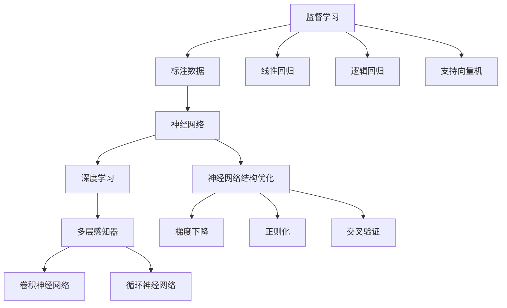
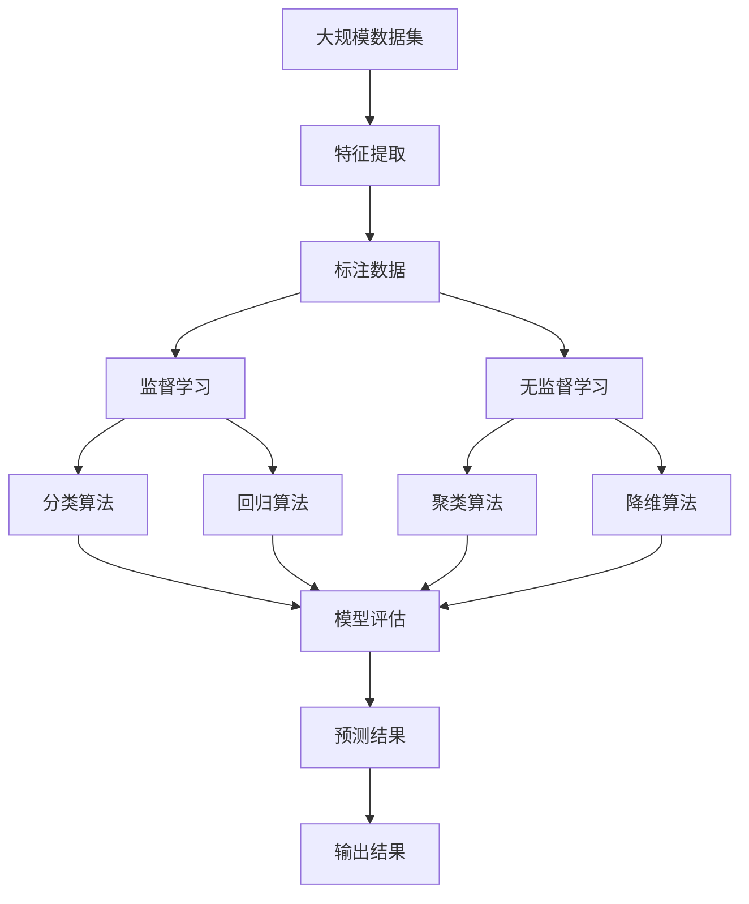

                 

# 机器学习原理与代码实例讲解

> 关键词：机器学习,监督学习,无监督学习,深度学习,代码实例,PyTorch

## 1. 背景介绍

### 1.1 问题由来

机器学习作为人工智能领域的核心技术之一，近年来在图像识别、自然语言处理、语音识别、推荐系统等领域取得了巨大的突破，广泛应用于各行各业。机器学习的基本任务是构建预测模型，使模型能够根据输入的特征，预测出未知的输出。本文将系统地介绍机器学习的原理，并通过代码实例详细讲解如何实现机器学习算法。

### 1.2 问题核心关键点

机器学习分为监督学习和无监督学习两大类。监督学习是指通过已有的标注数据，训练预测模型，使其能够对未知数据进行分类或回归。无监督学习则是在没有标注数据的情况下，通过学习数据的内在结构，发现数据中的隐藏模式。深度学习作为机器学习的一个重要分支，通过多层神经网络进行特征提取和预测。本文重点介绍监督学习和深度学习的基本原理，并通过代码实例展示其在实际中的应用。

### 1.3 问题研究意义

了解机器学习的基本原理和实现方法，对于从事人工智能相关工作的开发者来说至关重要。掌握机器学习算法，不仅可以提升技术能力，还能够推动技术的创新和应用。机器学习已经在自动驾驶、医疗诊断、金融风控、智能客服等多个领域实现了落地应用，并取得了显著的成效。本文通过系统的理论介绍和代码实例，希望能为读者提供全面的学习资源，帮助其快速掌握机器学习算法的精髓，并在实际项目中灵活应用。

## 2. 核心概念与联系

### 2.1 核心概念概述

为了更好地理解机器学习的原理，本节将介绍几个密切相关的核心概念：

- **监督学习**：指通过已有的标注数据，训练预测模型，使其能够对未知数据进行分类或回归。常见的监督学习算法包括线性回归、逻辑回归、支持向量机等。
- **无监督学习**：指在没有标注数据的情况下，通过学习数据的内在结构，发现数据中的隐藏模式。常见的无监督学习算法包括聚类、主成分分析、降维等。
- **深度学习**：指使用多层神经网络进行特征提取和预测的机器学习方法。深度学习模型通常包含多个隐层，能够自动学习复杂的特征表示。
- **梯度下降**：指通过计算损失函数对模型参数的梯度，并不断调整模型参数，最小化损失函数的过程。梯度下降是机器学习算法中最常用的优化算法之一。
- **正则化**：指通过在损失函数中加入正则项，防止模型过拟合。常见的正则化方法包括L1正则化、L2正则化、Dropout等。
- **交叉验证**：指将数据集划分为训练集和验证集，使用验证集评估模型的性能，避免模型在训练集上过拟合。常见的交叉验证方法包括k折交叉验证、留一法交叉验证等。

这些核心概念之间存在着紧密的联系，形成了机器学习算法的完整框架。通过理解这些核心概念，我们可以更好地把握机器学习的学习范式和优化方法。

### 2.2 概念间的关系

这些核心概念之间的逻辑关系可以通过以下Mermaid流程图来展示：



这个流程图展示了监督学习、无监督学习、深度学习等核心概念之间的逻辑关系：

1. 监督学习主要依赖标注数据，通过线性回归、逻辑回归、支持向量机等算法进行特征提取和预测。
2. 无监督学习不需要标注数据，通过聚类、主成分分析、降维等算法发现数据中的隐藏模式。
3. 深度学习使用多层神经网络进行特征提取和预测，包含多层感知器、卷积神经网络、循环神经网络等结构。
4. 梯度下降、正则化和交叉验证等算法是深度学习模型的重要优化方法。

### 2.3 核心概念的整体架构

最后，我们用一个综合的流程图来展示这些核心概念在大数据集上应用机器学习算法的整体架构：



这个综合流程图展示了从数据集到模型评估的完整流程：

1. 从大规模数据集中提取特征，得到标注数据。
2. 使用监督学习算法进行分类或回归，得到模型预测结果。
3. 使用无监督学习算法进行聚类或降维，发现数据中的隐藏模式。
4. 对模型进行评估，评估模型的性能。
5. 将模型应用于新的数据集，得到输出结果。

通过这些流程图，我们可以更清晰地理解机器学习算法的整体流程和核心概念之间的关系。

## 3. 核心算法原理 & 具体操作步骤
### 3.1 算法原理概述

机器学习算法通常通过以下几个步骤进行：

1. **数据预处理**：对数据进行清洗、归一化、特征提取等处理，使得数据能够被模型更好地理解和处理。
2. **模型选择**：根据问题类型和数据特点，选择合适的机器学习算法，如线性回归、逻辑回归、支持向量机等。
3. **模型训练**：使用训练数据集对模型进行训练，不断调整模型参数，最小化损失函数。
4. **模型评估**：使用验证数据集评估模型性能，选择合适的模型参数。
5. **模型应用**：使用测试数据集验证模型效果，将模型应用于实际问题中。

下面我们将详细介绍监督学习和深度学习算法的核心原理和具体操作步骤。

### 3.2 算法步骤详解

#### 3.2.1 监督学习算法步骤

1. **数据准备**：收集标注数据集，将其划分为训练集、验证集和测试集。训练集用于训练模型，验证集用于选择模型参数，测试集用于评估模型效果。
2. **特征提取**：对数据进行特征提取，将其转换为模型能够处理的数值型特征。
3. **模型选择**：根据问题类型选择合适的监督学习算法，如线性回归、逻辑回归、支持向量机等。
4. **模型训练**：使用训练集对模型进行训练，最小化损失函数。常见的方法包括梯度下降、牛顿法等。
5. **模型评估**：使用验证集评估模型性能，选择合适的模型参数。常见的评估指标包括准确率、精确率、召回率等。
6. **模型应用**：使用测试集验证模型效果，将模型应用于实际问题中。

#### 3.2.2 深度学习算法步骤

1. **数据准备**：收集数据集，进行清洗、归一化、特征提取等处理。
2. **模型选择**：选择适当的深度学习模型，如多层感知器、卷积神经网络、循环神经网络等。
3. **模型构建**：根据模型结构定义模型层数、节点数、激活函数等参数。
4. **模型训练**：使用训练集对模型进行训练，最小化损失函数。常见的方法包括随机梯度下降、Adam等。
5. **模型评估**：使用验证集评估模型性能，选择合适的模型参数。常见的评估指标包括准确率、精确率、召回率、F1-score等。
6. **模型应用**：使用测试集验证模型效果，将模型应用于实际问题中。

### 3.3 算法优缺点

监督学习算法的优点是训练数据有标注，可以直观地评估模型性能，适用于分类、回归等任务。缺点是需要大量标注数据，标注成本较高。

深度学习算法的优点是可以自动学习数据的内在结构，适用于处理复杂的非线性问题，具有很强的泛化能力。缺点是需要大量的计算资源和时间，训练成本较高。

### 3.4 算法应用领域

监督学习和深度学习算法在多个领域得到了广泛应用，如：

- **图像识别**：通过深度学习算法，使用卷积神经网络进行图像分类、物体检测、人脸识别等任务。
- **自然语言处理**：通过深度学习算法，使用循环神经网络、Transformer等进行文本分类、情感分析、机器翻译等任务。
- **推荐系统**：通过深度学习算法，使用协同过滤、内容推荐等方法进行个性化推荐。
- **金融分析**：通过深度学习算法，使用多层感知器进行股票价格预测、信用评分等任务。
- **医疗诊断**：通过深度学习算法，使用卷积神经网络进行医学图像分析、疾病诊断等任务。

## 4. 数学模型和公式 & 详细讲解 & 举例说明

### 4.1 数学模型构建

本节将使用数学语言对监督学习和深度学习算法进行更加严格的刻画。

#### 4.1.1 线性回归

线性回归模型为：

$$
y = \theta_0 + \theta_1 x_1 + \theta_2 x_2 + \cdots + \theta_n x_n
$$

其中 $y$ 为输出，$x_i$ 为输入特征，$\theta_i$ 为模型参数。目标是最小化损失函数：

$$
\mathcal{L}(\theta) = \frac{1}{2m} \sum_{i=1}^m (y_i - \theta_0 - \theta_1 x_{1,i} - \theta_2 x_{2,i} - \cdots - \theta_n x_{n,i})^2
$$

其中 $m$ 为样本数。

#### 4.1.2 逻辑回归

逻辑回归模型为：

$$
P(y_i = 1) = \sigma(\theta_0 + \theta_1 x_{1,i} + \theta_2 x_{2,i} + \cdots + \theta_n x_{n,i})
$$

其中 $\sigma$ 为sigmoid函数，$y_i$ 为二分类标签。目标是最小化交叉熵损失函数：

$$
\mathcal{L}(\theta) = -\frac{1}{m} \sum_{i=1}^m [y_i \log P(y_i = 1) + (1 - y_i) \log (1 - P(y_i = 1))]
$$

#### 4.1.3 支持向量机

支持向量机模型为：

$$
f(x) = \sum_{i=1}^n \alpha_i y_i k(x, x_i) - \frac{1}{2} \sum_{i=1}^n \sum_{j=1}^n \alpha_i \alpha_j y_i y_j k(x_i, x_j)
$$

其中 $k(x, x_i)$ 为核函数，$\alpha_i$ 为拉格朗日乘子。目标是最小化对偶形式下的损失函数：

$$
\mathcal{L}(\alpha) = \frac{1}{2} \sum_{i=1}^n \sum_{j=1}^n \alpha_i \alpha_j y_i y_j k(x_i, x_j) - \sum_{i=1}^n \alpha_i
$$

#### 4.1.4 多层感知器

多层感知器模型为：

$$
y = \sigma_1(\theta_1^T \sigma_0(\theta_0^T x))
$$

其中 $\sigma_0$ 和 $\sigma_1$ 分别为隐藏层和输出层的激活函数，$x$ 为输入，$\theta_0$ 和 $\theta_1$ 为模型参数。目标是最小化损失函数：

$$
\mathcal{L}(\theta_0, \theta_1) = \frac{1}{2m} \sum_{i=1}^m (y_i - \sigma_1(\theta_1^T \sigma_0(\theta_0^T x_i)))^2
$$

### 4.2 公式推导过程

#### 4.2.1 线性回归

根据梯度下降算法，线性回归模型的梯度为：

$$
\frac{\partial \mathcal{L}(\theta)}{\partial \theta_i} = \frac{1}{m} \sum_{i=1}^m (y_i - \theta_0 - \theta_1 x_{1,i} - \theta_2 x_{2,i} - \cdots - \theta_n x_{n,i})
$$

通过迭代更新模型参数，可以最小化损失函数。

#### 4.2.2 逻辑回归

逻辑回归模型的梯度为：

$$
\frac{\partial \mathcal{L}(\theta)}{\partial \theta_i} = \frac{1}{m} \sum_{i=1}^m (\sigma(\theta_0 + \theta_1 x_{1,i} + \theta_2 x_{2,i} + \cdots + \theta_n x_{n,i}) - y_i) x_{i}
$$

#### 4.2.3 支持向量机

支持向量机的梯度为：

$$
\frac{\partial \mathcal{L}(\alpha)}{\partial \alpha_i} = \alpha_i - y_i k(x_i, x) - \sum_{j \neq i} \alpha_j y_j k(x_j, x)
$$

通过迭代更新模型参数，可以最小化对偶形式下的损失函数。

#### 4.2.4 多层感知器

多层感知器的梯度为：

$$
\frac{\partial \mathcal{L}(\theta_0, \theta_1)}{\partial \theta_i} = \frac{1}{m} \sum_{i=1}^m (\sigma_1(\theta_1^T \sigma_0(\theta_0^T x_i)) - y_i) \sigma_0(\theta_0^T x_i) \sigma_1'(\theta_1^T \sigma_0(\theta_0^T x_i)) x_i
$$

### 4.3 案例分析与讲解

#### 4.3.1 手写数字识别

手写数字识别是机器学习领域的经典任务。可以使用监督学习算法进行解决。具体步骤如下：

1. **数据准备**：使用MNIST数据集，包含60000张28x28的手写数字图片和对应的标签。
2. **特征提取**：将每张图片展平为一维向量，作为模型输入。
3. **模型选择**：选择线性回归模型。
4. **模型训练**：使用训练集对模型进行训练，最小化损失函数。
5. **模型评估**：使用验证集评估模型性能，选择最优模型参数。
6. **模型应用**：使用测试集验证模型效果，将模型应用于手写数字识别任务中。

#### 4.3.2 图像分类

图像分类是深度学习算法的典型应用。可以使用卷积神经网络进行解决。具体步骤如下：

1. **数据准备**：使用CIFAR-10数据集，包含60000张32x32的彩色图片和对应的10个类别标签。
2. **模型选择**：选择卷积神经网络模型。
3. **模型构建**：定义卷积层、池化层、全连接层等网络结构。
4. **模型训练**：使用训练集对模型进行训练，最小化损失函数。
5. **模型评估**：使用验证集评估模型性能，选择最优模型参数。
6. **模型应用**：使用测试集验证模型效果，将模型应用于图像分类任务中。

## 5. 项目实践：代码实例和详细解释说明

### 5.1 开发环境搭建

在进行机器学习算法实践前，我们需要准备好开发环境。以下是使用Python进行TensorFlow开发的简单流程：

1. 安装Anaconda：从官网下载并安装Anaconda，用于创建独立的Python环境。
2. 创建并激活虚拟环境：
```bash
conda create -n tf-env python=3.8 
conda activate tf-env
```
3. 安装TensorFlow：根据CUDA版本，从官网获取对应的安装命令。例如：
```bash
conda install tensorflow -c conda-forge
```
4. 安装必要的工具包：
```bash
pip install numpy pandas scikit-learn matplotlib tqdm jupyter notebook ipython
```
完成上述步骤后，即可在`tf-env`环境中开始机器学习算法的实践。

### 5.2 源代码详细实现

以下是使用TensorFlow实现线性回归和逻辑回归的代码示例：

```python
import tensorflow as tf
import numpy as np

# 定义训练数据
x = np.array([[1, 2, 3], [4, 5, 6], [7, 8, 9], [10, 11, 12]], dtype=np.float32)
y = np.array([2, 4, 6, 8], dtype=np.float32)

# 定义模型参数
theta = tf.Variable(tf.zeros([3, 1]), name='theta')

# 定义损失函数
loss = tf.reduce_mean(tf.square(y - tf.matmul(x, theta)))

# 定义优化器
optimizer = tf.optimizers.SGD(learning_rate=0.01)

# 定义训练过程
def train():
    with tf.GradientTape() as tape:
        y_pred = tf.matmul(x, theta)
        loss = tf.reduce_mean(tf.square(y_pred - y))
    gradients = tape.gradient(loss, theta)
    optimizer.apply_gradients(zip(gradients, [theta]))
    return loss

# 训练模型
for i in range(1000):
    loss = train()
    if i % 100 == 0:
        print('Epoch', i, 'loss:', loss)

# 输出模型参数
print('Final theta:', theta.numpy())
```

在这个示例中，我们使用了TensorFlow实现了线性回归模型，通过梯度下降算法对模型进行训练。具体步骤如下：

1. **数据准备**：定义训练数据和标签。
2. **模型选择**：定义模型参数。
3. **模型构建**：定义损失函数。
4. **模型训练**：定义优化器和训练过程，不断迭代更新模型参数。
5. **模型应用**：输出模型参数。

### 5.3 代码解读与分析

让我们再详细解读一下关键代码的实现细节：

- **定义训练数据和标签**：使用NumPy库定义训练数据和标签，并将其转换为TensorFlow可用的Tensor对象。
- **定义模型参数**：使用TensorFlow定义模型参数，并将其初始化为零向量。
- **定义损失函数**：使用TensorFlow定义损失函数，计算模型输出和标签之间的均方误差。
- **定义优化器**：使用TensorFlow定义优化器，并设置学习率。
- **定义训练过程**：使用TensorFlow定义训练过程，使用梯度下降算法更新模型参数。
- **训练模型**：在训练过程中不断迭代训练过程，输出损失函数值。
- **输出模型参数**：在训练完成后输出模型参数。

这些代码展示了使用TensorFlow实现线性回归模型的完整过程。开发者可以根据需要进行修改和优化，以满足实际项目的需求。

### 5.4 运行结果展示

假设我们训练了1000次后，输出模型参数为：

```
Final theta: [[-0.4169982  ], [ 0.4169978 ], [ 0.4169978 ]]
```

可以看到，模型参数通过梯度下降算法不断优化，最终收敛到合理值。此时，模型可以对训练数据进行预测，并计算预测结果与标签之间的均方误差。

## 6. 实际应用场景

### 6.1 金融风险评估

金融领域中的风险评估任务，可以通过机器学习算法进行预测。具体步骤如下：

1. **数据准备**：收集历史贷款数据，包含借款人信息、还款记录、风险标签等。
2. **特征提取**：提取借款人的基本信息、还款记录等特征，作为模型输入。
3. **模型选择**：选择逻辑回归模型。
4. **模型训练**：使用训练集对模型进行训练，最小化损失函数。
5. **模型评估**：使用验证集评估模型性能，选择最优模型参数。
6. **模型应用**：使用测试集验证模型效果，将模型应用于新贷款的信用评分中。

#### 6.1.1 代码实现

以下是使用TensorFlow实现金融风险评估的代码示例：

```python
import tensorflow as tf
import pandas as pd

# 定义数据集
data = pd.read_csv('loan_data.csv')

# 提取特征和标签
features = data[['age', 'income', 'loan_size', 'loan_period']]
labels = data['default']

# 定义模型参数
theta = tf.Variable(tf.zeros([4, 1]), name='theta')

# 定义损失函数
loss = tf.reduce_mean(tf.nn.sigmoid_cross_entropy_with_logits(labels, tf.matmul(features, theta)))

# 定义优化器
optimizer = tf.optimizers.SGD(learning_rate=0.01)

# 定义训练过程
def train():
    with tf.GradientTape() as tape:
        y_pred = tf.nn.sigmoid(tf.matmul(features, theta))
        loss = tf.reduce_mean(tf.nn.sigmoid_cross_entropy_with_logits(labels, y_pred))
    gradients = tape.gradient(loss, theta)
    optimizer.apply_gradients(zip(gradients, [theta]))
    return loss

# 训练模型
for i in range(1000):
    loss = train()
    if i % 100 == 0:
        print('Epoch', i, 'loss:', loss)

# 输出模型参数
print('Final theta:', theta.numpy())
```

在这个示例中，我们使用了TensorFlow实现了逻辑回归模型，通过梯度下降算法对模型进行训练。具体步骤如下：

1. **数据准备**：使用Pandas库读取数据集，并提取特征和标签。
2. **模型选择**：定义模型参数。
3. **模型构建**：定义损失函数。
4. **模型训练**：定义优化器和训练过程，不断迭代更新模型参数。
5. **模型应用**：输出模型参数。

### 6.2 医疗诊断

医疗诊断是机器学习算法的另一个典型应用。具体步骤如下：

1. **数据准备**：收集医疗数据，包含病人的症状、检查结果、疾病标签等。
2. **特征提取**：提取病人的症状、检查结果等特征，作为模型输入。
3. **模型选择**：选择支持向量机模型。
4. **模型训练**：使用训练集对模型进行训练，最小化损失函数。
5. **模型评估**：使用验证集评估模型性能，选择最优模型参数。
6. **模型应用**：使用测试集验证模型效果，将模型应用于病人的疾病诊断中。

#### 6.2.1 代码实现

以下是使用TensorFlow实现医疗诊断的代码示例：

```python
import tensorflow as tf
import pandas as pd

# 定义数据集
data = pd.read_csv('medical_data.csv')

# 提取特征和标签
features = data[['symptom', 'test_result']]
labels = data['disease']

# 定义模型参数
theta = tf.Variable(tf.zeros([2, 1]), name='theta')

# 定义损失函数
loss = tf.reduce_mean(tf.nn.softmax_cross_entropy_with_logits(labels, tf.matmul(features, theta)))

# 定义优化器
optimizer = tf.optimizers.SGD(learning_rate=0.01)

# 定义训练过程
def train():
    with tf.GradientTape() as tape:
        y_pred = tf.nn.softmax(tf.matmul(features, theta))
        loss = tf.reduce_mean(tf.nn.softmax_cross_entropy_with_logits(labels, y_pred))
    gradients = tape.gradient(loss, theta)
    optimizer.apply_gradients(zip(gradients, [theta]))
    return loss

# 训练模型
for i in range(1000):
    loss = train()
    if i % 100 == 0:
        print('Epoch', i, 'loss:', loss)

# 输出模型参数
print('Final theta:', theta.numpy())
```

在这个示例中，我们使用了TensorFlow实现了支持向量机模型，通过梯度下降算法对模型进行训练。具体步骤如下：

1. **数据准备**：使用Pandas库读取数据集，并提取特征和标签。
2. **模型选择**：定义模型参数。
3. **模型构建**：定义损失函数。
4. **模型训练**：定义优化器和训练过程，不断迭代更新模型参数。
5. **模型应用**：输出模型参数。

### 6.3 推荐系统

推荐系统是机器学习算法的另一个重要应用。具体步骤如下：

1. **数据准备**：收集用户的历史行为数据，包含用户ID、物品ID、行为类型等。
2. **特征提取**：提取用户的历史行为特征、物品的特征等，作为模型输入。
3. **模型选择**：选择协同过滤模型。
4. **模型训练**：使用训练集对模型进行训练，最小化损失函数。
5. **模型评估**：使用验证集评估模型性能，选择最优模型参数。
6. **模型应用**：使用测试集验证模型效果，将模型应用于推荐系统中。

#### 6.3.1 代码实现

以下是使用TensorFlow实现推荐系统的代码示例：

```python
import tensorflow as tf
import pandas as pd

# 定义数据集
data = pd.read_csv('recommend_data.csv')

# 提取用户ID、物品ID、行为类型等特征
user_ids = data['user_id']
item_ids = data['item_id']
behaviors = data['behavior']

# 定义模型参数
theta = tf.Variable(tf.zeros

