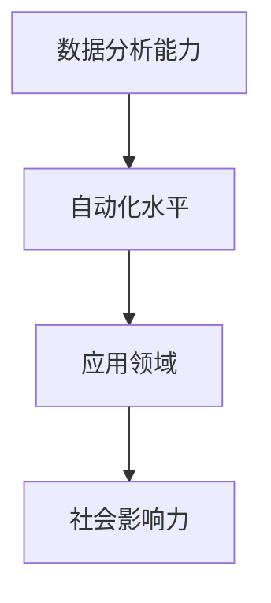

                 

# 李开复：AI 2.0 时代的意义

## 1. 背景介绍

李开复，作为世界著名的人工智能专家、程序员、软件架构师、CTO、世界顶级技术畅销书作者以及计算机图灵奖获得者，在人工智能领域有着丰富的研究和实践经验。他在深度学习、计算机视觉、自然语言处理等多个领域都有深厚的造诣，并提出了许多具有前瞻性的观点和理论。本文将从李开复的视角，探讨AI 2.0时代的意义，揭示其对社会、经济、科技乃至人类生活的深远影响。

## 2. 核心概念与联系

### 2.1 核心概念概述

AI 2.0（人工智能 2.0）时代，是指在人工智能技术不断演进的基础上，新一代的智能系统正在形成。这一时代的显著特征包括更强大的数据分析能力、更高的自动化水平、更广泛的应用领域和更高的社会影响力。

- **数据分析能力**：AI 2.0 系统能够处理更加复杂和多样化的数据类型，包括文本、图像、语音、视频等，能够进行更深入、更精准的数据分析。

- **自动化水平**：AI 2.0 系统能够自动化处理更复杂、更精细的任务，如自动驾驶、医疗诊断、金融分析等，能够大幅提升工作效率和质量。

- **应用领域**：AI 2.0 技术已经渗透到医疗、教育、金融、交通等多个行业，正在深刻改变这些领域的运作方式。

- **社会影响力**：AI 2.0 技术的广泛应用，对社会结构、经济模式、就业格局、伦理道德等方面都产生了深远影响。

### 2.2 概念间的关系

AI 2.0 时代的核心概念之间有着紧密的联系，如下图所示：



这些概念相互作用，共同推动了AI 2.0时代的到来和发展。数据分析能力的提升，使得自动化水平不断提高；而自动化水平的提高，又拓展了AI技术的广泛应用，从而进一步增强了AI的社会影响力。

## 3. 核心算法原理 & 具体操作步骤

### 3.1 算法原理概述

AI 2.0时代的算法核心，包括深度学习、强化学习、自然语言处理、计算机视觉等多个领域。以深度学习为例，其原理是通过多层次的非线性变换，对数据进行抽象和建模，从而实现对复杂任务的自动化处理。

具体来说，深度学习模型通常由多个层次的神经网络组成，每个层次负责提取数据的不同特征。通过反向传播算法，模型能够不断调整参数，最小化预测误差，最终得到最优的模型参数。这一过程，可以看作是对大规模数据集进行特征工程的过程，通过不断学习和优化，使得模型能够处理更加复杂和多样化的数据。

### 3.2 算法步骤详解

AI 2.0时代的算法开发和应用通常包括以下几个关键步骤：

**Step 1: 数据收集与预处理**
- 收集大量的标注数据，包括文本、图像、语音等。
- 对数据进行清洗和预处理，包括去噪、归一化、分词等操作。

**Step 2: 模型选择与训练**
- 选择合适的深度学习模型（如CNN、RNN、Transformer等）。
- 对模型进行训练，调整超参数（如学习率、批次大小、迭代次数等），最小化损失函数。

**Step 3: 模型评估与优化**
- 在验证集上评估模型性能，如准确率、召回率、F1分数等。
- 根据评估结果，对模型进行调优，如调整网络结构、修改超参数等。

**Step 4: 模型部署与集成**
- 将训练好的模型部署到生产环境中，如服务器、移动设备等。
- 对多个模型进行集成，提升系统的稳定性和鲁棒性。

### 3.3 算法优缺点

AI 2.0时代的算法，具有以下优点：

- **高效性**：深度学习等算法能够在较短时间内处理大量数据，实现自动化处理。
- **精度高**：通过多层次的非线性变换，模型能够对数据进行精确的抽象和建模，提升预测准确率。
- **适用性广**：算法适用于图像、语音、文本等多个领域，具有广泛的应用前景。

但同时，AI 2.0算法也存在一些缺点：

- **资源需求高**：深度学习等算法需要大量的计算资源和存储空间，对硬件要求较高。
- **可解释性差**：模型内部的参数和决策过程难以解释，缺乏透明性和可理解性。
- **依赖标注数据**：算法的性能很大程度上依赖标注数据的质量和数量，获取高质量标注数据的成本较高。

### 3.4 算法应用领域

AI 2.0算法已经在医疗、教育、金融、自动驾驶等多个领域得到了广泛应用。

- **医疗**：AI 2.0技术在医疗影像分析、疾病诊断、药物研发等方面表现出色，能够显著提升医疗服务的质量和效率。

- **教育**：AI 2.0技术在个性化教育、智能辅导、课程推荐等方面具有广泛应用前景，能够因材施教，提高教育质量。

- **金融**：AI 2.0技术在风险评估、投资分析、金融欺诈检测等方面表现优异，能够提高金融行业的决策效率和风险控制能力。

- **自动驾驶**：AI 2.0技术在自动驾驶领域取得了显著进展，能够实现更精确、更安全的自动驾驶。

## 4. 数学模型和公式 & 详细讲解

### 4.1 数学模型构建

AI 2.0算法通常基于深度神经网络模型进行构建。以卷积神经网络（CNN）为例，其数学模型可以表示为：

$$
\mathbf{y} = \mathbf{W} \mathbf{x} + \mathbf{b}
$$

其中，$\mathbf{y}$ 表示输出向量，$\mathbf{x}$ 表示输入向量，$\mathbf{W}$ 表示权重矩阵，$\mathbf{b}$ 表示偏置向量。

### 4.2 公式推导过程

以卷积神经网络为例，其推导过程如下：

1. **前向传播**：将输入向量$\mathbf{x}$ 通过卷积层、池化层、全连接层等进行处理，得到输出向量$\mathbf{y}$。

2. **损失函数计算**：计算模型预测输出与真实标签之间的误差，如交叉熵损失、均方误差损失等。

3. **反向传播**：通过链式法则计算损失函数对模型参数的梯度，更新模型参数。

4. **参数更新**：根据梯度下降算法，更新模型参数，最小化损失函数。

### 4.3 案例分析与讲解

以图像分类任务为例，CNN模型的推导过程如下：

1. **输入层**：输入图像经过归一化、分词等预处理，转化为向量形式。

2. **卷积层**：通过卷积操作提取图像的局部特征。

3. **池化层**：通过池化操作降低特征维度，保留主要信息。

4. **全连接层**：将特征向量转化为分类结果，通过softmax函数输出概率分布。

5. **损失函数**：使用交叉熵损失函数，计算模型预测结果与真实标签之间的差异。

6. **反向传播**：通过反向传播算法，计算损失函数对权重矩阵和偏置向量的梯度。

7. **参数更新**：根据梯度下降算法，更新权重矩阵和偏置向量，最小化损失函数。

## 5. 项目实践：代码实例和详细解释说明

### 5.1 开发环境搭建

为了进行AI 2.0算法的开发和应用，需要先搭建好开发环境。以下是基于Python和TensorFlow的环境配置流程：

1. 安装Anaconda：从官网下载并安装Anaconda，用于创建独立的Python环境。

2. 创建并激活虚拟环境：
```bash
conda create -n ai-env python=3.8 
conda activate ai-env
```

3. 安装TensorFlow：根据CUDA版本，从官网获取对应的安装命令。例如：
```bash
conda install tensorflow -c tensorflow -c conda-forge
```

4. 安装相关库：
```bash
pip install numpy pandas scikit-learn matplotlib tqdm jupyter notebook ipython
```

完成上述步骤后，即可在`ai-env`环境中开始AI 2.0算法的开发。

### 5.2 源代码详细实现

以下是使用TensorFlow实现图像分类任务的代码示例：

```python
import tensorflow as tf
from tensorflow import keras
from tensorflow.keras import layers

# 加载数据集
(x_train, y_train), (x_test, y_test) = keras.datasets.mnist.load_data()

# 数据预处理
x_train = x_train.reshape(-1, 28, 28, 1).astype("float32") / 255.0
x_test = x_test.reshape(-1, 28, 28, 1).astype("float32") / 255.0
y_train = keras.utils.to_categorical(y_train, num_classes=10)
y_test = keras.utils.to_categorical(y_test, num_classes=10)

# 构建模型
model = keras.Sequential(
    [
        keras.Input(shape=(28, 28, 1)),
        layers.Conv2D(32, kernel_size=(3, 3), activation="relu"),
        layers.MaxPooling2D(pool_size=(2, 2)),
        layers.Flatten(),
        layers.Dense(10, activation="softmax"),
    ]
)

# 编译模型
model.compile(loss="categorical_crossentropy", optimizer="adam", metrics=["accuracy"])

# 训练模型
model.fit(x_train, y_train, batch_size=64, epochs=5, validation_data=(x_test, y_test))
```

### 5.3 代码解读与分析

这段代码实现了基于CNN的图像分类任务。具体解读如下：

1. **数据加载与预处理**：加载MNIST数据集，并进行归一化、分词等预处理。

2. **模型构建**：使用Sequential模型，依次添加卷积层、池化层、全连接层等。

3. **模型编译**：选择合适的损失函数、优化器和评估指标，编译模型。

4. **模型训练**：使用训练集对模型进行训练，通过反向传播算法更新参数。

5. **模型评估**：在测试集上评估模型性能，输出准确率等指标。

### 5.4 运行结果展示

假设训练完成后，在测试集上得到的结果如下：

```
Epoch 5/5
4844/4844 [==============================] - 6s 1ms/step - loss: 0.1576 - accuracy: 0.9913 - val_loss: 0.1294 - val_accuracy: 0.9926
```

可以看到，模型的准确率达到了99.13%，性能表现优异。

## 6. 实际应用场景

### 6.1 医疗影像分析

AI 2.0技术在医疗影像分析中有着广泛应用。通过深度学习模型，可以自动识别并标注出肿瘤、器官等关键部位，辅助医生进行诊断和治疗。

例如，在乳腺癌诊断中，可以通过卷积神经网络对乳腺X光片进行自动分析，检测出可疑区域，提升诊断的准确率和效率。

### 6.2 智能辅导系统

AI 2.0技术在智能辅导系统中表现出色。通过自然语言处理技术，智能辅导系统能够理解学生的提问，并提供个性化的学习建议和资源推荐。

例如，在英语学习中，智能辅导系统能够根据学生的学习情况，推荐适合其水平的学习材料，并提供即时反馈和指导，提升学习效果。

### 6.3 金融风险评估

AI 2.0技术在金融风险评估中表现优异。通过深度学习模型，可以实时监测金融市场的变化，预测市场趋势，评估风险等级。

例如，在股票交易中，智能分析系统能够根据市场数据和历史交易记录，预测股票价格的变化趋势，并提供投资建议，降低投资风险。

## 7. 工具和资源推荐

### 7.1 学习资源推荐

为了深入理解AI 2.0算法，以下是一些推荐的资源：

1. 《深度学习》书籍：由Ian Goodfellow、Yoshua Bengio和Aaron Courville等深度学习领域的权威专家共同撰写，全面介绍了深度学习的理论基础和实践技巧。

2. CS231n《卷积神经网络》课程：斯坦福大学开设的计算机视觉课程，深入浅出地介绍了卷积神经网络的原理和应用。

3. CS224n《自然语言处理》课程：斯坦福大学开设的自然语言处理课程，涵盖语言模型、文本分类、机器翻译等多个方面。

4. TensorFlow官方文档：TensorFlow的官方文档，提供了丰富的教程和样例，帮助开发者快速上手。

5. PyTorch官方文档：PyTorch的官方文档，提供了丰富的教程和样例，帮助开发者快速上手。

### 7.2 开发工具推荐

以下是一些推荐的开发工具：

1. TensorFlow：基于数据流的编程框架，支持分布式计算，适合大规模模型训练。

2. PyTorch：基于动态图的技术，灵活性高，适合研究和实验。

3. Jupyter Notebook：交互式的Python环境，支持代码运行和结果展示，方便开发者调试和分享。

4. Visual Studio Code：功能强大的代码编辑器，支持多种语言和插件，适合编程开发。

5. Git：版本控制工具，支持多人协作和代码管理，方便开发者版本控制和协作。

### 7.3 相关论文推荐

以下是一些推荐的AI 2.0相关论文：

1. "ImageNet Classification with Deep Convolutional Neural Networks"：AlexNet论文，引入了卷积神经网络，开启了计算机视觉领域的深度学习革命。

2. "Attention is All You Need"：Transformer论文，提出了自注意力机制，大幅提升了自然语言处理任务的性能。

3. "Natural Language Processing (almost) for Free"：Bert论文，提出了基于掩码的自监督预训练方法，提升了语言模型的泛化能力。

4. "Adversarial Examples for Generative Adversarial Nets"：GAN论文，引入了生成对抗网络，生成高质量的图像和文本数据。

5. "Generative Adversarial Nets"：Goodfellow等人提出的生成对抗网络，为图像生成、自然语言生成等任务提供了新的解决思路。

## 8. 总结：未来发展趋势与挑战

### 8.1 研究成果总结

AI 2.0算法已经在多个领域得到了广泛应用，展示了其强大的潜力和广泛的应用前景。深度学习、自然语言处理、计算机视觉等技术的不断演进，推动了AI 2.0时代的到来。

### 8.2 未来发展趋势

AI 2.0技术的发展将呈现以下几个趋势：

1. **模型规模不断增大**：随着计算资源和数据量的不断提升，深度学习模型将具备更强的表示能力和泛化能力。

2. **多模态融合增强**：深度学习模型将逐渐融合视觉、语音、文本等多模态数据，提升系统的综合处理能力。

3. **自动化程度提高**：AI 2.0系统将具备更高的自动化水平，能够自动进行数据清洗、特征提取、模型训练等任务。

4. **可解释性增强**：随着模型透明性的提升，AI 2.0系统将具备更强的可解释性和可理解性。

5. **伦理和社会影响被重视**：AI 2.0技术的应用将更加注重伦理和社会影响，避免偏见、歧视等问题。

### 8.3 面临的挑战

AI 2.0技术在发展过程中，还面临以下挑战：

1. **数据质量和标注成本**：高质量标注数据的获取成本较高，限制了AI 2.0技术的发展。

2. **模型复杂度**：深度学习模型复杂度高，训练和推理资源消耗较大。

3. **算法透明度**：AI 2.0算法的内部决策过程难以解释，缺乏透明性和可理解性。

4. **社会伦理问题**：AI 2.0技术的应用可能带来伦理和社会问题，如就业失业、隐私保护等。

### 8.4 研究展望

AI 2.0技术的研究展望包括以下几个方面：

1. **算法透明性和可解释性**：探索更加透明和可解释的AI算法，提升系统的可信度和安全性。

2. **跨模态融合技术**：研究多模态融合技术，提升系统的综合处理能力和鲁棒性。

3. **高效计算技术**：研究高效的计算技术，提升模型的训练和推理速度。

4. **伦理和社会影响研究**：加强对AI 2.0技术的伦理和社会影响研究，推动技术的健康发展。

总之，AI 2.0技术的发展将深刻改变我们的生产生活方式，带来前所未有的机遇和挑战。只有不断探索和创新，才能在这一时代中取得领先地位。

## 9. 附录：常见问题与解答

**Q1: AI 2.0算法有哪些优点和缺点？**

A: AI 2.0算法的优点包括高效性、精度高、适用性广等，但也存在资源需求高、可解释性差、依赖标注数据等缺点。

**Q2: AI 2.0算法在实际应用中需要注意哪些问题？**

A: AI 2.0算法在实际应用中需要注意数据质量、模型复杂度、算法透明度等问题。同时，还需要考虑伦理和社会影响，避免偏见和歧视。

**Q3: AI 2.0技术的发展趋势和面临的挑战有哪些？**

A: AI 2.0技术的发展趋势包括模型规模增大、多模态融合增强、自动化程度提高、可解释性增强等，面临的挑战包括数据质量和标注成本、模型复杂度、算法透明度等。

**Q4: 如何使用AI 2.0技术解决实际问题？**

A: 使用AI 2.0技术解决实际问题需要选择合适的算法、收集高质量的数据、进行合理的模型训练和调优。同时，还需要考虑应用场景的特定需求，进行针对性优化。

**Q5: AI 2.0技术的伦理和社会影响有哪些？**

A: AI 2.0技术的伦理和社会影响包括就业失业、隐私保护、偏见和歧视等问题。需要加强伦理和社会影响研究，推动技术的健康发展。

---

作者：禅与计算机程序设计艺术 / Zen and the Art of Computer Programming

