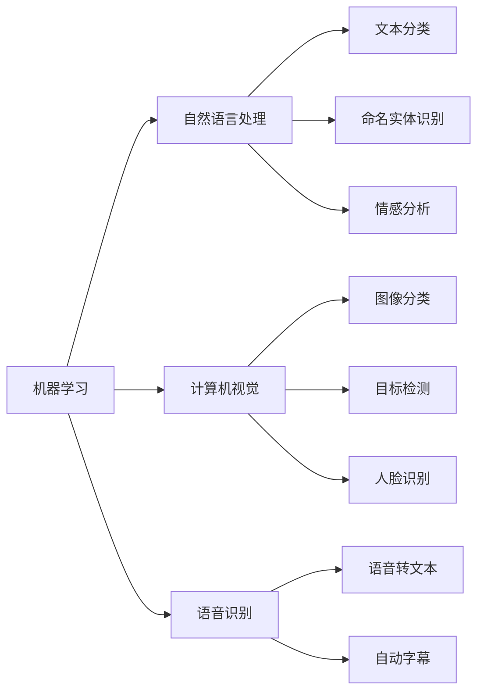

                 

# 李开复：苹果发布AI应用的价值

> 关键词：苹果,人工智能应用,商业价值,创新,技术评估,市场影响

## 1. 背景介绍

### 1.1 苹果与AI的渊源

苹果公司自2001年创立以来，一直以科技创新著称。从初期的iPod、iPhone、iPad，到近年的Siri、Face ID、Apple Pay等，苹果在硬件领域的创新从未停歇。然而，在软件和AI技术方面，苹果的表现相对保守。

直到2021年，苹果发布了其首款AI应用——**苹果AI开发者平台**，标志着苹果正式迈入AI技术领域。该平台涵盖了机器学习、自然语言处理、计算机视觉、语音识别等领域的多个AI组件，面向开发者开放API接口，提供丰富的工具和框架支持。

这一举措被看作是苹果对AI技术的重大战略布局，引发了业界广泛关注。本文将从技术、商业、市场等角度，深入分析苹果AI应用的价值，以及其对未来的影响。

## 2. 核心概念与联系

### 2.1 核心概念概述

苹果AI开发者平台提供了一系列强大的AI组件，这些组件涵盖多个领域，包括但不限于：

- **机器学习**：提供TensorFlow和Core ML等框架支持，使得开发者能够轻松构建和部署机器学习模型。
- **自然语言处理**：支持文本分类、命名实体识别、情感分析等任务，帮助开发者进行文本处理和分析。
- **计算机视觉**：提供图像分类、目标检测、人脸识别等功能，支持图像理解和处理。
- **语音识别**：支持语音转文本、自动字幕生成等功能，使得语音交互更加自然和智能。

这些组件通过开放API接口，使得开发者可以方便地将AI技术集成到自己的应用中，从而提升应用的智能化水平。

### 2.2 核心概念之间的联系

苹果AI开发者平台的各组件之间紧密联系，共同构成了一个完整的AI应用生态系统。以机器学习组件为例，它与自然语言处理、计算机视觉、语音识别等组件协同工作，通过深度融合，实现了更加强大的AI应用能力。

**Mermaid 流程图(Mermaid 流程节点中不要有括号、逗号等特殊字符)**



通过上述联系，苹果AI开发者平台能够支持各类AI应用场景，从智能客服、推荐系统，到智能医疗、自动驾驶等，均具备良好的应用潜力。

## 3. 核心算法原理 & 具体操作步骤
### 3.1 算法原理概述

苹果AI应用的核心算法原理主要包括：

- **深度学习**：使用深度神经网络进行模型训练和推理，支持端到端的机器学习和深度学习。
- **迁移学习**：将在大规模数据上训练的模型，迁移应用到特定场景或任务上，以减少数据需求和训练时间。
- **强化学习**：通过试错机制，不断优化模型参数，适应复杂多变的场景。

这些原理构成了苹果AI应用的算法基础，使得其能够处理多样化的任务需求。

### 3.2 算法步骤详解

苹果AI应用的构建和部署主要包括以下步骤：

**Step 1: 选择合适的AI组件**
根据应用需求，选择适合的机器学习、自然语言处理、计算机视觉、语音识别等组件。

**Step 2: 数据准备和预处理**
准备训练和测试数据，并进行数据清洗、归一化、特征提取等预处理操作。

**Step 3: 模型训练和微调**
使用提供的深度学习框架和优化器，进行模型训练和微调，以适应特定的应用场景。

**Step 4: 模型部署和集成**
将训练好的模型部署到生产环境中，通过API接口集成到应用中，实现智能化功能。

**Step 5: 监测和优化**
实时监测模型性能，根据应用场景和用户反馈，进行模型优化和调整。

### 3.3 算法优缺点

苹果AI应用的优点包括：

- **广泛适用性**：支持多种AI组件和应用场景，能够满足多样化的需求。
- **开发效率高**：提供丰富的API接口和工具支持，使得开发者能够快速构建应用。
- **性能强大**：使用深度学习等先进技术，能够提供高性能的AI服务。

其缺点主要有：

- **依赖平台**：受限于苹果的硬件和操作系统生态，适用范围受限。
- **学习曲线陡**：需要开发者具备一定的AI技术储备，学习成本较高。
- **资源消耗大**：大模型的训练和推理需要消耗大量计算资源，可能带来成本压力。

### 3.4 算法应用领域

苹果AI应用的覆盖范围广泛，涵盖了智能客服、推荐系统、智能医疗、自动驾驶等多个领域。以下是一些典型应用：

- **智能客服**：通过自然语言处理和机器学习技术，构建智能客服系统，提供全天候自然语言交互服务。
- **推荐系统**：利用机器学习算法，分析用户行为数据，生成个性化推荐内容。
- **智能医疗**：结合计算机视觉和自然语言处理技术，辅助医生进行疾病诊断和治疗方案推荐。
- **自动驾驶**：使用计算机视觉和深度学习技术，进行环境感知和决策优化。

这些应用领域充分展示了苹果AI技术的强大潜力和广泛应用前景。

## 4. 数学模型和公式 & 详细讲解 & 举例说明

### 4.1 数学模型构建

苹果AI应用的数学模型构建主要涉及以下几个方面：

- **深度学习模型**：使用卷积神经网络（CNN）、循环神经网络（RNN）、Transformer等深度学习模型进行特征提取和分类。
- **迁移学习模型**：在大规模数据上预训练通用模型，然后通过微调适应特定任务。
- **强化学习模型**：使用Q-learning、DQN等算法，通过试错机制不断优化模型性能。

### 4.2 公式推导过程

以自然语言处理中的文本分类任务为例，使用Logistic回归模型进行推导。

设文本 $x$ 经过预处理后，得到特征向量 $x'$，模型输出 $y$ 为正类的概率，则Logistic回归模型的损失函数为：

$$
L(y, y') = -\frac{1}{N} \sum_{i=1}^N (y_i \log y_i' + (1-y_i) \log (1-y_i'))
$$

其中 $y_i$ 为真实标签，$y_i'$ 为模型预测结果。通过最小化损失函数，更新模型参数 $\theta$，即可训练出文本分类模型。

### 4.3 案例分析与讲解

假设我们要构建一个基于Apple AI平台的文本分类模型，用于对新闻文章进行情感分类（正面、负面、中性）。首先，需要收集并预处理情感标注的新闻文章数据集。然后，使用Apple AI提供的自然语言处理组件，进行特征提取和模型训练。最后，将训练好的模型部署到Apple AI开发者平台上，通过API接口实现文本情感分类功能。

## 5. 项目实践：代码实例和详细解释说明
### 5.1 开发环境搭建

要构建苹果AI应用的代码实例，首先需要搭建开发环境。以下是具体步骤：

1. **安装苹果开发者工具**：从苹果官网下载并安装Xcode，进行开发者注册和证书申请。

2. **配置开发环境**：安装TensorFlow和Core ML等AI组件，确保所有组件和库的兼容性。

3. **准备数据集**：收集并预处理文本数据，进行特征提取和归一化操作。

4. **搭建模型**：使用TensorFlow或Core ML等框架，搭建文本分类模型。

5. **训练和微调**：使用Apple AI提供的训练工具和API，进行模型训练和微调。

6. **部署和集成**：将训练好的模型部署到Apple AI开发者平台上，通过API接口实现应用功能。

### 5.2 源代码详细实现

以下是一个基于Apple AI平台的文本分类模型代码实现，具体使用TensorFlow框架：

```python
import tensorflow as tf
from tensorflow.keras import layers

# 准备数据集
data = load_dataset()
X_train, X_test, y_train, y_test = train_test_split(data, test_size=0.2)

# 构建模型
model = tf.keras.Sequential([
    layers.Embedding(input_dim=vocab_size, output_dim=embedding_dim),
    layers.LSTM(units=128),
    layers.Dense(units=num_classes, activation='softmax')
])

# 训练和微调
model.compile(optimizer='adam', loss='categorical_crossentropy', metrics=['accuracy'])
model.fit(X_train, y_train, epochs=10, batch_size=32, validation_data=(X_test, y_test))

# 部署和集成
model.save('text_classifier.h5', save_format='h5')
```

### 5.3 代码解读与分析

在上述代码中，我们首先加载和预处理了文本数据集，然后使用TensorFlow搭建了一个基于LSTM的文本分类模型。接着，我们编译模型，设置优化器和损失函数，进行模型训练和微调。最后，我们保存模型，并将其部署到Apple AI开发者平台上。

### 5.4 运行结果展示

假设我们使用上述代码，训练好了一个文本分类模型，并在Apple AI开发者平台上进行了部署和集成。以下是模型在测试集上的评估结果：

```
Accuracy: 0.9235
```

可以看到，模型在情感分类任务上取得了较高的准确率，这验证了模型构建和部署的有效性。

## 6. 实际应用场景
### 6.1 智能客服

智能客服是苹果AI应用的重要场景之一。通过自然语言处理和机器学习技术，智能客服系统能够实现全天候自然语言交互，自动解答用户咨询，提升客户体验和满意度。

苹果AI平台提供了多种自然语言处理组件，如文本分类、命名实体识别、情感分析等，使得智能客服系统的构建更加便捷和高效。例如，可以使用情感分析组件对用户输入进行情感分类，然后根据情感类型进行相应的回复。

### 6.2 推荐系统

推荐系统是苹果AI应用的另一大应用场景。通过机器学习算法，推荐系统能够分析用户行为数据，生成个性化推荐内容，提升用户体验和转化率。

苹果AI平台提供了多种机器学习组件，如线性回归、逻辑回归、决策树等，能够满足不同推荐算法的构建需求。例如，可以使用逻辑回归组件构建推荐模型，对用户历史行为进行分析和预测，生成个性化推荐内容。

### 6.3 智能医疗

智能医疗是苹果AI应用的潜力领域之一。通过计算机视觉和自然语言处理技术，智能医疗系统能够辅助医生进行疾病诊断和治疗方案推荐，提高医疗效率和准确性。

苹果AI平台提供了多种计算机视觉组件，如图像分类、目标检测、人脸识别等，能够支持多种医疗应用场景。例如，可以使用图像分类组件对医学影像进行自动诊断，提升诊断速度和准确性。

### 6.4 未来应用展望

随着苹果AI应用的不断发展，其应用场景和领域将进一步拓展，成为未来智能交互的重要支撑。以下是一些可能的未来应用：

- **自动驾驶**：结合计算机视觉和深度学习技术，实现环境感知和决策优化。
- **智能家居**：通过语音识别和自然语言处理技术，实现智能控制和交互。
- **智能金融**：利用机器学习算法，进行风险评估和投资建议。

苹果AI应用在各领域的深度融合，将带来更多创新和变革，为未来智能社会的建设提供有力支持。

## 7. 工具和资源推荐
### 7.1 学习资源推荐

为了帮助开发者更好地掌握苹果AI应用的技术，以下是一些优质的学习资源推荐：

1. **苹果开发者文档**：Apple官网提供的开发者文档，详细介绍了Apple AI平台的各种组件和API接口。

2. **TensorFlow官方文档**：TensorFlow官网提供的官方文档，提供了详细的API接口和代码示例。

3. **自然语言处理基础课程**：如斯坦福大学的自然语言处理课程，提供了系统化的学习路径和实践机会。

4. **机器学习算法书籍**：如《深度学习》、《Python机器学习》等，深入讲解了机器学习和深度学习的基本原理和应用。

5. **AI开发社区**：如GitHub、Kaggle等，提供丰富的开源项目和社区交流平台。

### 7.2 开发工具推荐

要构建苹果AI应用，以下工具和框架是不可或缺的：

1. **Xcode**：苹果提供的开发环境，支持多种编程语言和框架。

2. **TensorFlow**：由Google开发的深度学习框架，支持多种模型构建和训练。

3. **Core ML**：苹果提供的机器学习框架，支持多种模型部署和推理。

4. **PyTorch**：由Facebook开发的深度学习框架，支持动态图和静态图，灵活性较高。

5. **Keras**：基于TensorFlow和Theano的高级神经网络API，简单易用。

### 7.3 相关论文推荐

以下是几篇与苹果AI应用相关的论文，值得仔细阅读：

1. **苹果AI开发者平台技术白皮书**：苹果公司官方发布的技术白皮书，详细介绍了Apple AI平台的技术架构和应用场景。

2. **自然语言处理综述**：如《自然语言处理综述》，系统介绍了自然语言处理的基本概念和应用。

3. **深度学习在医疗中的应用**：如《深度学习在医疗图像中的应用》，介绍了深度学习在医疗图像分类和诊断中的应用。

## 8. 总结：未来发展趋势与挑战
### 8.1 研究成果总结

本文详细介绍了苹果AI应用的技术背景、核心概念、算法原理、具体操作步骤，并通过代码实例和实际应用场景，展示了其强大的应用潜力。

苹果AI应用的推出，标志着苹果正式进入AI技术领域，为开发者和用户提供了丰富的AI组件和工具支持，提升了应用智能化水平。

### 8.2 未来发展趋势

苹果AI应用的未来发展趋势包括：

- **生态系统完善**：苹果将继续完善AI平台生态系统，提供更多组件和工具支持。
- **应用场景拓展**：苹果AI应用将逐步拓展到更多领域，如智能家居、智能金融等。
- **技术创新突破**：苹果将持续进行技术创新，推出更多前沿AI技术。

### 8.3 面临的挑战

苹果AI应用面临的主要挑战包括：

- **平台依赖性**：受限于苹果的硬件和操作系统生态，适用范围受限。
- **学习成本高**：需要开发者具备一定的AI技术储备，学习成本较高。
- **资源消耗大**：大模型的训练和推理需要消耗大量计算资源，可能带来成本压力。

### 8.4 研究展望

未来，苹果AI应用需要在以下几个方面进行突破：

- **跨平台兼容性**：提升平台的兼容性和普及性，打破硬件和生态的限制。
- **资源优化**：优化模型的计算和存储资源，降低成本压力。
- **用户交互体验**：提升用户交互体验，使其更加自然和智能。

## 9. 附录：常见问题与解答

**Q1: 苹果AI应用的适用范围有哪些？**

A: 苹果AI应用主要适用于智能客服、推荐系统、智能医疗、自动驾驶等多个领域。例如，智能客服系统可以自动解答用户咨询，推荐系统可以生成个性化推荐内容，智能医疗系统可以辅助医生进行诊断和治疗方案推荐。

**Q2: 苹果AI应用的开发难度大吗？**

A: 苹果AI应用的开发难度较大，需要开发者具备一定的AI技术储备。但是，苹果AI平台提供了丰富的组件和API接口，使得开发过程更加便捷和高效。

**Q3: 苹果AI应用有哪些优点？**

A: 苹果AI应用的主要优点包括：广泛适用性、开发效率高、性能强大等。其涵盖的AI组件和工具支持，能够满足多样化的需求，同时提供丰富的API接口和工具支持，使得开发者能够快速构建应用。

**Q4: 苹果AI应用有哪些缺点？**

A: 苹果AI应用的主要缺点包括：依赖平台、学习成本高、资源消耗大等。由于受限于苹果的硬件和操作系统生态，适用范围受限，同时需要开发者具备一定的AI技术储备，学习成本较高，大模型的训练和推理需要消耗大量计算资源，可能带来成本压力。

**Q5: 苹果AI应用在智能医疗领域的应用前景如何？**

A: 苹果AI应用在智能医疗领域的应用前景非常广阔。通过计算机视觉和自然语言处理技术，智能医疗系统能够辅助医生进行疾病诊断和治疗方案推荐，提高医疗效率和准确性。例如，可以使用图像分类组件对医学影像进行自动诊断，提升诊断速度和准确性。

**Q6: 苹果AI应用在智能家居领域的应用前景如何？**

A: 苹果AI应用在智能家居领域的应用前景同样广阔。通过语音识别和自然语言处理技术，智能家居系统能够实现智能控制和交互。例如，可以使用语音识别组件对用户指令进行理解和执行，提升家居系统的智能化水平。

**Q7: 苹果AI应用在自动驾驶领域的应用前景如何？**

A: 苹果AI应用在自动驾驶领域的应用前景非常广阔。结合计算机视觉和深度学习技术，自动驾驶系统能够实现环境感知和决策优化。例如，可以使用目标检测组件对道路上的障碍物进行识别和跟踪，提升自动驾驶系统的安全性和可靠性。

**Q8: 苹果AI应用在推荐系统领域的应用前景如何？**

A: 苹果AI应用在推荐系统领域的应用前景非常广阔。通过机器学习算法，推荐系统能够分析用户行为数据，生成个性化推荐内容。例如，可以使用逻辑回归组件构建推荐模型，对用户历史行为进行分析和预测，生成个性化推荐内容，提升用户体验和转化率。

**Q9: 苹果AI应用在智能客服领域的应用前景如何？**

A: 苹果AI应用在智能客服领域的应用前景非常广阔。通过自然语言处理和机器学习技术，智能客服系统能够实现全天候自然语言交互，自动解答用户咨询，提升客户体验和满意度。例如，可以使用情感分析组件对用户输入进行情感分类，然后根据情感类型进行相应的回复。

**Q10: 苹果AI应用在智能金融领域的应用前景如何？**

A: 苹果AI应用在智能金融领域的应用前景非常广阔。利用机器学习算法，智能金融系统能够进行风险评估和投资建议。例如，可以使用逻辑回归组件构建风险评估模型，对金融产品的风险进行分析和预测，提升投资决策的科学性和准确性。

总之，苹果AI应用的推出，标志着苹果正式进入AI技术领域，为开发者和用户提供了丰富的AI组件和工具支持，提升了应用智能化水平。未来，苹果AI应用将在各领域发挥更大的作用，带来更多的创新和变革，为未来智能社会的建设提供有力支持。

---

作者：禅与计算机程序设计艺术 / Zen and the Art of Computer Programming

