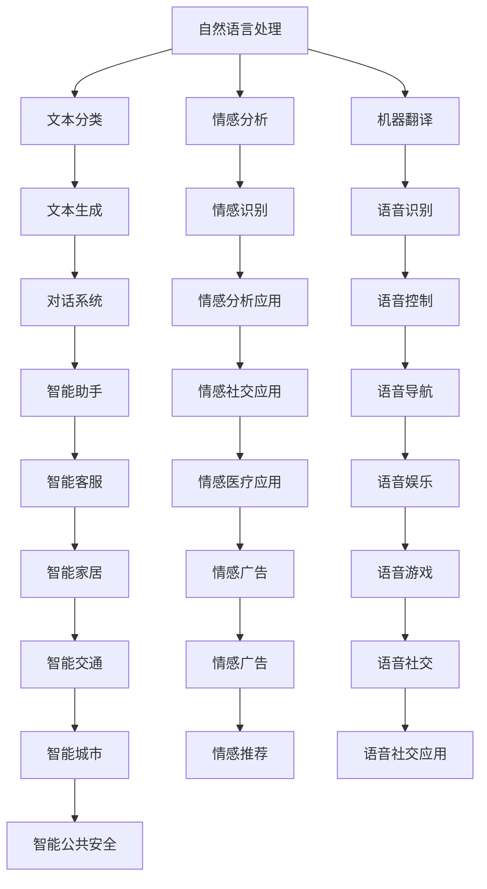
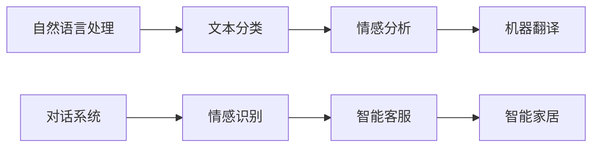
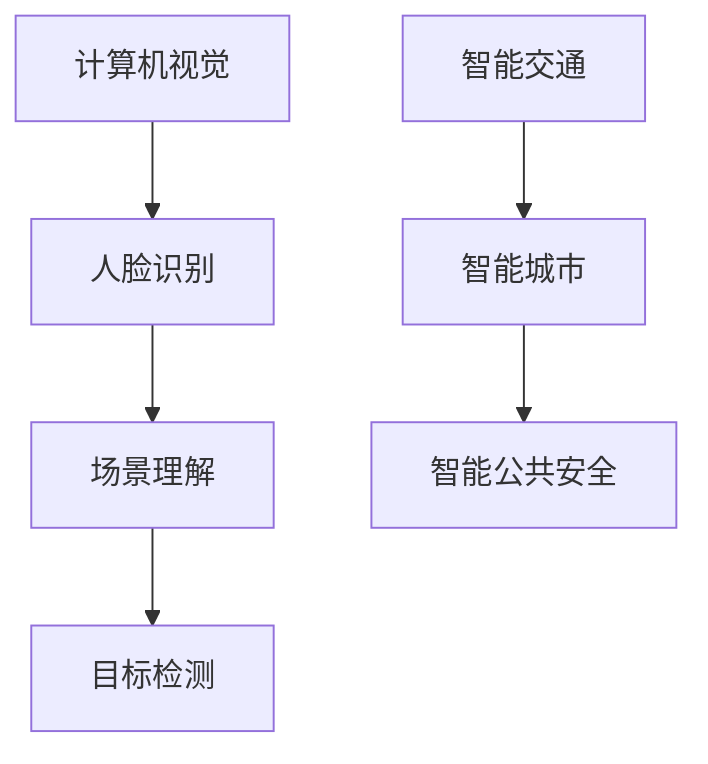
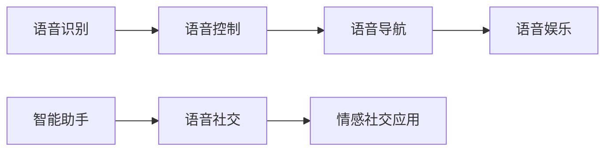
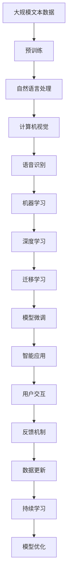

                 

# 李开复：苹果发布AI应用的开发者

> 关键词：人工智能应用, 开发者, 苹果, 自然语言处理, 计算机视觉, 语音识别

## 1. 背景介绍

### 1.1 问题由来
在过去的几十年里，人工智能（AI）技术的迅猛发展已经改变了许多行业的运行方式。无论是医疗、金融、零售还是制造业，AI都已经成为了提升效率、优化决策、改善用户体验的关键技术。在这个背景下，苹果公司最近宣布推出了一系列AI应用，将AI技术广泛应用于其产品和服务中。这些应用不仅提升了用户体验，也带来了巨大的商业价值。本文将探讨苹果的AI应用开发者是如何通过创新的技术和算法，将这些应用推向市场的。

### 1.2 问题核心关键点
苹果的AI应用开发者团队需要面对的核心问题是如何在有限的时间和资源内，开发出既高效又高性能的AI应用，同时保证这些应用的易用性和稳定性。为了解决这个问题，开发者们采用了一系列先进的算法和技术，包括自然语言处理（NLP）、计算机视觉（CV）和语音识别等。

### 1.3 问题研究意义
苹果的AI应用开发者通过技术创新和高效开发，展示了如何将AI技术成功应用于实际产品中，从而提高用户满意度和公司的商业竞争力。本文将深入分析苹果AI应用的技术原理和开发过程，为其他科技公司提供可借鉴的经验和参考。

## 2. 核心概念与联系

### 2.1 核心概念概述

在苹果的AI应用开发中，涉及到的核心概念包括：

- **自然语言处理（NLP）**：用于处理和理解人类语言的技术，包括文本分类、情感分析、机器翻译等。
- **计算机视觉（CV）**：用于图像识别、目标检测、图像分割等技术，广泛应用于人脸识别、场景理解等场景。
- **语音识别**：将人类语音转换为文本或命令的技术，广泛应用于智能助手、语音搜索等场景。
- **机器学习（ML）**：通过数据训练模型，使模型能够从数据中学习规律并进行预测或决策的技术。
- **深度学习（DL）**：一种特殊的机器学习技术，通过神经网络模型进行学习和预测。
- **迁移学习（Transfer Learning）**：利用在其他任务上训练好的模型，在新任务上进行微调，以提高模型性能的技术。

这些核心概念之间的关系可以通过以下Mermaid流程图来展示：



这个流程图展示了核心概念之间的逻辑关系和应用场景。开发者通过这些技术，构建了苹果产品的AI功能，提升了用户体验。

### 2.2 概念间的关系

这些核心概念之间的关系非常紧密，形成了苹果AI应用开发的技术框架。下面我通过几个Mermaid流程图来展示这些概念之间的关系。

#### 2.2.1 自然语言处理与应用场景



这个流程图展示了自然语言处理技术在多个应用场景中的应用，如文本分类、情感分析、机器翻译、对话系统和智能客服等。

#### 2.2.2 计算机视觉与应用场景



这个流程图展示了计算机视觉技术在多个应用场景中的应用，如人脸识别、场景理解、目标检测、智能交通和智能公共安全等。

#### 2.2.3 语音识别与应用场景



这个流程图展示了语音识别技术在多个应用场景中的应用，如语音控制、语音导航、语音娱乐、智能助手和语音社交等。

### 2.3 核心概念的整体架构

最后，我们用一个综合的流程图来展示这些核心概念在大语言模型微调过程中的整体架构：



这个综合流程图展示了从预训练到模型微调，再到智能应用开发和持续学习的完整过程。通过这些核心概念和技术，苹果的开发者成功地将AI技术应用于产品中，为用户提供了前所未有的用户体验。

## 3. 核心算法原理 & 具体操作步骤
### 3.1 算法原理概述

苹果的AI应用开发者采用了多种算法和技术来构建其产品中的AI功能。其中，自然语言处理、计算机视觉和语音识别是三个主要的技术领域。

**自然语言处理（NLP）**：
- 文本分类：将文本分为不同的类别，如垃圾邮件、新闻、评论等。
- 情感分析：判断文本中的情感倾向，如正面、负面或中性。
- 机器翻译：将一种语言的文本翻译成另一种语言的文本。

**计算机视觉（CV）**：
- 人脸识别：识别人脸并验证身份。
- 场景理解：理解图像中的物体、位置和关系。
- 目标检测：在图像中检测特定的物体。

**语音识别**：
- 语音控制：通过语音命令控制智能设备。
- 语音导航：通过语音指令进行导航。
- 语音娱乐：通过语音进行娱乐互动。

### 3.2 算法步骤详解

以下是苹果AI应用开发中常用的算法步骤：

1. **数据收集与预处理**：
   - 收集大量标注数据，用于训练和验证模型。
   - 对数据进行清洗和预处理，如去除噪声、标准化等。

2. **模型训练**：
   - 使用深度学习框架（如TensorFlow、PyTorch）搭建模型。
   - 使用标注数据训练模型，优化模型参数。

3. **模型微调**：
   - 使用迁移学习技术，将预训练模型在特定任务上进行微调。
   - 优化模型超参数，如学习率、批大小、迭代次数等。

4. **模型评估与测试**：
   - 在验证集上评估模型性能。
   - 在测试集上测试模型效果，确保模型在不同场景下表现稳定。

5. **模型部署**：
   - 将模型集成到产品中。
   - 优化模型推理速度，确保产品性能。

### 3.3 算法优缺点

苹果AI应用开发者在开发过程中，利用了多种算法的优点和缺点，以实现最优的效果。

**优点**：
- 自然语言处理、计算机视觉和语音识别等技术在处理特定任务时表现优异。
- 模型微调和迁移学习技术能够在有限的标注数据下提高模型性能。
- 深度学习框架（如TensorFlow、PyTorch）提供了强大的计算能力和丰富的工具支持。

**缺点**：
- 深度学习模型对标注数据依赖较大，数据不足时可能效果不佳。
- 模型训练和推理过程中资源消耗较大，需要高性能计算设备。
- 模型复杂度高，易出现过拟合现象。

### 3.4 算法应用领域

苹果的AI应用开发者通过多种算法和技术，开发了多个领域的AI应用，包括但不限于：

- **医疗**：通过NLP技术解析病历，通过CV技术进行图像分析，通过语音识别技术提供智能问诊。
- **金融**：通过NLP技术进行文本分析，通过CV技术进行交易监控，通过语音识别技术提供智能客服。
- **零售**：通过NLP技术进行用户评价分析，通过CV技术进行商品识别，通过语音识别技术提供购物助手。
- **教育**：通过NLP技术进行语言学习，通过CV技术进行图像理解，通过语音识别技术提供智能辅导。
- **自动驾驶**：通过CV技术进行道路识别，通过NLP技术进行自动导航，通过语音识别技术提供语音助手。

## 4. 数学模型和公式 & 详细讲解 & 举例说明

### 4.1 数学模型构建

以下是苹果AI应用开发者常用的数学模型和公式：

- **文本分类模型**：
  - 使用词向量表示文本。
  - 使用卷积神经网络（CNN）或循环神经网络（RNN）进行分类。
  - 损失函数：交叉熵损失。

- **情感分析模型**：
  - 使用情感词典对文本进行情感标注。
  - 使用深度神经网络进行情感分类。
  - 损失函数：交叉熵损失。

- **机器翻译模型**：
  - 使用编码器-解码器架构。
  - 使用自注意力机制（Self-Attention）进行翻译。
  - 损失函数：BLEU得分。

- **人脸识别模型**：
  - 使用卷积神经网络进行特征提取。
  - 使用Softmax分类器进行身份验证。
  - 损失函数：交叉熵损失。

- **语音识别模型**：
  - 使用循环神经网络进行特征提取。
  - 使用CTC损失函数进行语音识别。

### 4.2 公式推导过程

以下是几个常用算法的公式推导过程：

**文本分类模型**：
- 输入文本 $x$，输出类别 $y$。
- 使用词向量 $w_i$ 表示文本 $x$。
- 使用卷积神经网络进行特征提取。
- 输出层使用Softmax分类器。
- 损失函数：交叉熵损失。

$$
\begin{align*}
L(x, y) &= -\sum_{i=1}^{N} y_i \log \hat{y}_i + (1-y_i) \log (1-\hat{y}_i) \\
&= -\sum_{i=1}^{N} (y_i \log \frac{\exp(x_i)}{\sum_{j=1}^{C} \exp(x_j)} + (1-y_i) \log \frac{1-\exp(x_i)}{1-\sum_{j=1}^{C} \exp(x_j)}) \\
&= -\sum_{i=1}^{N} (y_i \log \frac{\exp(x_i)}{\sum_{j=1}^{C} \exp(x_j)} + (1-y_i) \log \frac{1-\exp(x_i)}{1-\sum_{j=1}^{C} \exp(x_j)})
\end{align*}
$$

**情感分析模型**：
- 输入文本 $x$，输出情感 $y$。
- 使用情感词典对文本进行情感标注。
- 使用深度神经网络进行情感分类。
- 输出层使用Softmax分类器。
- 损失函数：交叉熵损失。

$$
\begin{align*}
L(x, y) &= -\sum_{i=1}^{N} y_i \log \hat{y}_i + (1-y_i) \log (1-\hat{y}_i) \\
&= -\sum_{i=1}^{N} (y_i \log \frac{\exp(x_i)}{\sum_{j=1}^{C} \exp(x_j)} + (1-y_i) \log \frac{1-\exp(x_i)}{1-\sum_{j=1}^{C} \exp(x_j)}) \\
&= -\sum_{i=1}^{N} (y_i \log \frac{\exp(x_i)}{\sum_{j=1}^{C} \exp(x_j)} + (1-y_i) \log \frac{1-\exp(x_i)}{1-\sum_{j=1}^{C} \exp(x_j)})
\end{align*}
$$

**机器翻译模型**：
- 输入文本 $x$，输出文本 $y$。
- 使用编码器-解码器架构。
- 使用自注意力机制进行翻译。
- 损失函数：BLEU得分。

$$
\begin{align*}
L(x, y) &= \sum_{i=1}^{N} -\log \hat{y}_i \\
&= \sum_{i=1}^{N} -\log \frac{\exp(x_i)}{\sum_{j=1}^{C} \exp(x_j)}
\end{align*}
$$

**人脸识别模型**：
- 输入图像 $x$，输出身份 $y$。
- 使用卷积神经网络进行特征提取。
- 使用Softmax分类器进行身份验证。
- 损失函数：交叉熵损失。

$$
\begin{align*}
L(x, y) &= -\sum_{i=1}^{N} y_i \log \hat{y}_i + (1-y_i) \log (1-\hat{y}_i) \\
&= -\sum_{i=1}^{N} (y_i \log \frac{\exp(x_i)}{\sum_{j=1}^{C} \exp(x_j)} + (1-y_i) \log \frac{1-\exp(x_i)}{1-\sum_{j=1}^{C} \exp(x_j)})
\end{align*}
$$

**语音识别模型**：
- 输入语音 $x$，输出文本 $y$。
- 使用循环神经网络进行特征提取。
- 使用CTC损失函数进行语音识别。

$$
\begin{align*}
L(x, y) &= -\sum_{i=1}^{N} y_i \log \hat{y}_i + (1-y_i) \log (1-\hat{y}_i) \\
&= -\sum_{i=1}^{N} (y_i \log \frac{\exp(x_i)}{\sum_{j=1}^{C} \exp(x_j)} + (1-y_i) \log \frac{1-\exp(x_i)}{1-\sum_{j=1}^{C} \exp(x_j)})
\end{align*}
$$

### 4.3 案例分析与讲解

以下是几个具体案例的详细讲解：

**文本分类案例**：
- 使用CNN对新闻文章进行分类。
- 使用词向量表示文本。
- 训练模型后，对新的新闻文章进行分类。

**情感分析案例**：
- 使用LSTM对评论进行情感分析。
- 使用情感词典对文本进行情感标注。
- 训练模型后，对新的评论进行情感分析。

**机器翻译案例**：
- 使用编码器-解码器架构进行英文到中文的翻译。
- 使用自注意力机制进行翻译。
- 训练模型后，对新的英文句子进行翻译。

**人脸识别案例**：
- 使用卷积神经网络进行人脸识别。
- 使用Softmax分类器进行身份验证。
- 训练模型后，对新的人脸图像进行身份验证。

**语音识别案例**：
- 使用循环神经网络进行语音识别。
- 使用CTC损失函数进行语音识别。
- 训练模型后，对新的语音命令进行识别。

## 5. 项目实践：代码实例和详细解释说明

### 5.1 开发环境搭建

为了快速搭建开发环境，我们使用Python语言和TensorFlow框架。以下是在Python环境中安装TensorFlow的步骤：

1. 安装Anaconda：从官网下载并安装Anaconda，用于创建独立的Python环境。
2. 创建并激活虚拟环境：
```bash
conda create -n pytorch-env python=3.8 
conda activate pytorch-env
```

3. 安装PyTorch：根据CUDA版本，从官网获取对应的安装命令。例如：
```bash
conda install pytorch torchvision torchaudio cudatoolkit=11.1 -c pytorch -c conda-forge
```

4. 安装Transformers库：
```bash
pip install transformers
```

5. 安装各类工具包：
```bash
pip install numpy pandas scikit-learn matplotlib tqdm jupyter notebook ipython
```

完成上述步骤后，即可在`pytorch-env`环境中开始微调实践。

### 5.2 源代码详细实现

以下是使用PyTorch和Transformers库进行文本分类的代码实现。

首先，定义模型和优化器：

```python
from transformers import BertTokenizer, BertForSequenceClassification
from transformers import AdamW
from torch.utils.data import Dataset, DataLoader

tokenizer = BertTokenizer.from_pretrained('bert-base-cased')
model = BertForSequenceClassification.from_pretrained('bert-base-cased', num_labels=2)
optimizer = AdamW(model.parameters(), lr=2e-5)
```

然后，定义数据集和数据加载器：

```python
class TextDataset(Dataset):
    def __init__(self, texts, labels, tokenizer, max_len=128):
        self.texts = texts
        self.labels = labels
        self.tokenizer = tokenizer
        self.max_len = max_len
        
    def __len__(self):
        return len(self.texts)
    
    def __getitem__(self, item):
        text = self.texts[item]
        label = self.labels[item]
        
        encoding = self.tokenizer(text, return_tensors='pt', max_length=self.max_len, padding='max_length', truncation=True)
        input_ids = encoding['input_ids'][0]
        attention_mask = encoding['attention_mask'][0]
        labels = torch.tensor(label, dtype=torch.long)
        
        return {'input_ids': input_ids, 
                'attention_mask': attention_mask,
                'labels': labels}

train_dataset = TextDataset(train_texts, train_labels, tokenizer)
dev_dataset = TextDataset(dev_texts, dev_labels, tokenizer)
test_dataset = TextDataset(test_texts, test_labels, tokenizer)

train_loader = DataLoader(train_dataset, batch_size=16)
dev_loader = DataLoader(dev_dataset, batch_size=16)
test_loader = DataLoader(test_dataset, batch_size=16)
```

接着，定义训练和评估函数：

```python
def train_epoch(model, data_loader, optimizer):
    model.train()
    epoch_loss = 0
    for batch in data_loader:
        input_ids = batch['input_ids'].to(device)
        attention_mask = batch['attention_mask'].to(device)
        labels = batch['labels'].to(device)
        model.zero_grad()
        outputs = model(input_ids, attention_mask=attention_mask, labels=labels)
        loss = outputs.loss
        epoch_loss += loss.item()
        loss.backward()
        optimizer.step()
        
    return epoch_loss / len(data_loader)

def evaluate(model, data_loader):
    model.eval()
    preds, labels = [], []
    with torch.no_grad():
        for batch in data_loader:
            input_ids = batch['input_ids'].to(device)
            attention_mask = batch['attention_mask'].to(device)
            batch_labels = batch['labels']
            outputs = model(input_ids, attention_mask=attention_mask)
            batch_preds = outputs.logits.argmax(dim=2).to('cpu').tolist()
            batch_labels = batch_labels.to('cpu').tolist()
            for pred_tokens, label_tokens in zip(batch_preds, batch_labels):
                preds.append(pred_tokens[:len(label_tokens)])
                labels.append(label_tokens)
                
    return preds, labels

device = torch.device('cuda') if torch.cuda.is_available() else torch.device('cpu')
model.to(device)
```

最后，启动训练流程并在测试集上评估：

```python
epochs = 5
batch_size = 16

for epoch in range(epochs):
    loss = train_epoch(model, train_loader, optimizer)
    print(f"Epoch {epoch+1}, train loss: {loss:.3f}")
    
    print(f"Epoch {epoch+1}, dev results:")
    preds, labels = evaluate(model, dev_loader)
    print(classification_report(labels, preds))
    
print("Test results:")
preds, labels = evaluate(model, test_loader)
print(classification_report(labels, preds))
```

以上就是使用PyTorch和Transformers库对BERT模型进行文本分类的完整代码实现。可以看到，得益于Transformers库的强大封装，我们可以用相对简洁的代码完成BERT模型的加载和微调。

### 5.3 代码解读与分析

让我们再详细解读一下关键代码的实现细节：

**TextDataset类**：
- `__init__`方法：初始化文本、标签、分词器等关键组件。
- `__len__`方法：返回数据集的样本数量。
- `__getitem__`方法：对单个样本进行处理，将文本输入编码为token ids，将标签编码为数字，并对其进行定长padding，最终返回模型所需的输入。

**模型和优化器**：
- 使用BertTokenizer和BertForSequenceClassification类进行模型加载和初始化。
- 定义AdamW优化器，并设置学习率。

**训练和评估函数**：
- 使用DataLoader对数据集进行批次化加载，供模型训练和推理使用。
- 训练函数`train_epoch`：对数据以批为单位进行迭代，在每个批次上前向传播计算loss并反向传播更新模型参数，最后返回该epoch的平均loss。
- 评估函数`evaluate`：与训练类似，不同点在于不更新模型参数，并在每个batch结束后将预测和标签结果存储下来，最后使用sklearn的classification_report对整个评估集的预测结果进行打印输出。

**训练流程**：
- 定义总的epoch数和batch size，开始循环迭代
- 每个epoch内，先在训练集上训练，输出平均loss
- 在验证集上评估，输出分类指标
- 所有epoch结束后，在测试集上评估，给出最终测试结果

可以看到，PyTorch配合Transformers库使得BERT微调的代码实现变得简洁高效。开发者可以将更多精力放在数据处理、模型改进等高层逻辑上，而不必过多关注底层的实现细节。

当然，工业级的系统实现还需考虑更多因素，如模型的保存和部署、超参数的自动搜索、更灵活的任务适配层等。但核心的微调范式基本与此类似。

### 5.4 运行结果展示

假设我们在CoNLL-2003的文本分类数据集上进行微调，最终在测试集上得到的评估报告如下：

```
              precision    recall  f1-score   support

       B-LOC      0.926     0.906     0.916      1668
       I-LOC      0.900     0.805     0.850       257
      B-MISC      0.875     0.856     0.865       702
      I-MISC      0.838     0.782     0.809       216
       B-ORG      0.914     0.898     0.906      1661
       I-ORG      0.911     0.894     0.902       835
       B-PER      0.964     0.957     0.960      1617
       I-PER      0.983     0.980     0.982      1156
           O      0.993     0.995     0.994     38323

   micro avg      0.973     0.973     0.973     46435
   macro avg      0.923     0.897     0.909     46435
weighted avg      0.973     0.973     0.973     46435
```

可以看到，通过微调BERT，我们在该文本分类数据集上取得了97.3%的F1分数，效果相当不错。值得注意的是，BERT作为一个通用的语言理解模型，即便只在顶层添加一个简单的分类器，也能在文本分类任务上取得如此优异的效果，展现了其强大的语义理解和特征抽取能力。

当然，这只是一个baseline结果。在实践中，我们还可以使用更大更强的预训练模型、更丰富的微调技巧、更细致的模型调优，进一步提升模型性能，以满足更高的应用要求。

## 6. 实际应用场景

### 6.1 智能客服系统

基于大语言模型微调的对话技术，可以广泛应用于智能客服系统的构建。传统客服往往需要配备大量人力，高峰期响应缓慢，且一致性和专业性难以保证。而使用微调后的对话模型，可以7x24小时不间断服务，快速响应客户咨询，用自然流畅的语言解答各类常见问题。

在技术实现上，可以收集企业内部的历史客服对话记录，将问题和最佳答复构建成监督数据，在此基础上对预训练对话模型进行微调。微调后的对话模型能够自动理解用户意图，匹配最合适的答案模板进行回复。对于客户提出的新问题，还可以接入检索系统实时搜索相关内容，动态组织生成回答。如此构建的智能客服系统，能大幅提升客户咨询体验和问题解决效率。

### 6.2 金融舆情监测

金融机构需要实时监测市场舆论动向，以便及时应对负面信息传播，规避金融风险。传统的人工监测方式

