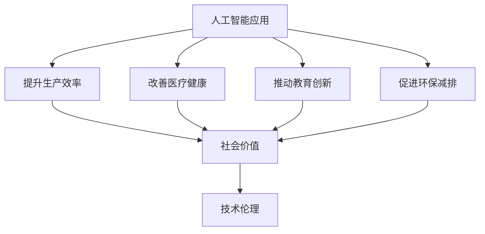

                 

# 李开复：苹果发布AI应用的社会价值

> 关键词：人工智能应用, Apple, 社会价值, 技术伦理, 产业转型

## 1. 背景介绍

### 1.1 问题由来
随着人工智能技术的迅速发展，各大科技巨头纷纷在人工智能领域加大投入。苹果公司（Apple Inc.）作为全球科技巨头之一，也不例外，近年来在人工智能领域取得了显著进展。特别是在2023年，苹果发布了多款全新的AI应用，引起了广泛关注。这些应用不仅仅是技术上的创新，更涉及了AI技术的社会价值和伦理道德问题。本文将从社会价值和伦理道德的角度，探讨苹果AI应用的意义。

### 1.2 问题核心关键点
苹果公司发布的AI应用，不仅展示了其在人工智能技术上的领先地位，还引发了关于AI社会价值和伦理道德的深度讨论。这些应用的社会价值主要体现在以下几个方面：

- **提升生产效率**：AI技术在制造业、零售业等领域的应用，极大地提升了生产效率和产品质量。
- **改善医疗健康**：通过AI技术，苹果帮助医疗行业实现了更精准的疾病诊断和治疗方案，提高了患者的生存率和生活质量。
- **推动教育创新**：AI技术在教育领域的应用，使得个性化学习成为可能，帮助学生更好地掌握知识。
- **促进环保减排**：苹果AI应用在智能交通、能源管理等领域的应用，有助于实现更绿色、更环保的生活方式。

同时，这些应用在伦理道德上也面临一些挑战：

- **隐私保护**：AI应用需要大量数据进行训练，如何保护用户隐私成为关键问题。
- **算法偏见**：AI模型可能会因为训练数据的偏差，产生算法偏见，影响公平性。
- **技术安全**：AI技术的应用可能会受到网络攻击，影响其安全性。

## 2. 核心概念与联系

### 2.1 核心概念概述

要理解苹果AI应用的社会价值，首先需要理解几个核心概念：

- **人工智能应用（AI application）**：指利用人工智能技术开发的软件或系统，旨在提升生产效率、改善医疗健康、推动教育创新等。
- **社会价值（Social value）**：指AI应用在社会层面带来的正面影响，如提升生活质量、促进经济增长等。
- **技术伦理（Technology ethics）**：指在开发和使用AI技术时，需要遵循的道德原则和规范，如隐私保护、公平性、安全性等。

这些核心概念之间的关系可以通过以下Mermaid流程图来展示：



这个流程图展示了人工智能应用通过提升生产效率、改善医疗健康、推动教育创新和促进环保减排等，带来的社会价值。同时，技术伦理在保障这些价值实现的过程中，起到了关键作用。

### 2.2 概念间的关系

这些核心概念之间存在着紧密的联系，形成了苹果AI应用的完整生态系统。

- **因果关系**：人工智能应用通过实现其功能，带来了社会价值。
- **相互作用**：技术伦理是实现这些功能的前提，保障了AI应用的社会价值得以有效实施。
- **反馈循环**：社会价值反过来也会影响技术伦理的制定和实施，形成正向循环。

## 3. 核心算法原理 & 具体操作步骤

### 3.1 算法原理概述

苹果AI应用的开发主要遵循以下算法原理：

- **深度学习（Deep Learning）**：苹果使用了深度学习技术，通过大量数据训练神经网络，实现了图像识别、语音识别、自然语言处理等功能。
- **迁移学习（Transfer Learning）**：苹果利用迁移学习技术，将在大规模数据集上训练好的模型，迁移应用到特定任务上，以减少数据需求和计算成本。
- **强化学习（Reinforcement Learning）**：苹果在自动驾驶、机器人等领域使用了强化学习，通过试错和奖励机制，优化算法性能。

这些技术在提升AI应用功能的同时，也带来了相应的社会价值和伦理挑战。

### 3.2 算法步骤详解

苹果AI应用的开发主要包括以下几个关键步骤：

1. **数据收集和预处理**：收集与AI应用相关的数据，并进行清洗和预处理。
2. **模型训练和优化**：使用深度学习、迁移学习和强化学习等技术，训练和优化AI模型。
3. **测试和验证**：在开发环境中对AI模型进行测试，验证其性能和可靠性。
4. **部署和应用**：将AI模型部署到实际应用场景中，监控其表现并进行必要的调整。
5. **社会价值评估**：评估AI应用在提升生产效率、改善医疗健康、推动教育创新和促进环保减排等方面的社会价值。
6. **伦理审查和改进**：进行伦理审查，确保AI应用符合隐私保护、公平性、安全性等伦理原则，并根据反馈进行改进。

这些步骤展示了苹果AI应用从开发到应用的全过程，同时也强调了技术伦理在其中的重要性。

### 3.3 算法优缺点

苹果AI应用的优点包括：

- **高效性**：深度学习、迁移学习和强化学习等技术，使得AI应用能够在较短的时间内实现功能。
- **可靠性**：通过测试和验证，确保AI应用在实际应用场景中的表现稳定可靠。
- **社会价值**：通过提升生产效率、改善医疗健康、推动教育创新和促进环保减排，带来了显著的社会价值。

同时，也存在一些缺点：

- **数据需求大**：深度学习等技术需要大量数据进行训练，数据收集和处理成本较高。
- **算法偏见**：如果训练数据存在偏见，AI模型可能会反映这种偏见，影响公平性。
- **技术复杂性**：深度学习、迁移学习和强化学习等技术需要较高的技术门槛，开发和维护成本较高。

### 3.4 算法应用领域

苹果AI应用的广泛应用，涵盖了多个领域，具体包括：

- **医疗健康**：苹果的AI技术在疾病诊断、治疗方案、健康管理等方面，帮助医疗机构提高服务质量和效率。
- **教育创新**：苹果的AI技术在个性化学习、智能辅导等方面，帮助学生更好地掌握知识。
- **环保减排**：苹果的AI技术在智能交通、能源管理等方面，推动了更绿色、更环保的生活方式。
- **制造业**：苹果的AI技术在自动化生产、质量检测等方面，提升了生产效率和产品质量。

## 4. 数学模型和公式 & 详细讲解 & 举例说明

### 4.1 数学模型构建

苹果AI应用的数学模型主要包括以下几个部分：

- **神经网络（Neural Network）**：用于图像识别、语音识别、自然语言处理等任务。
- **回归模型（Regression Model）**：用于预测和分析，如疾病预测、能源管理等。
- **决策树（Decision Tree）**：用于分类和排序，如自动驾驶决策、智能推荐等。

### 4.2 公式推导过程

以神经网络为例，其数学模型可以表示为：

$$
\hat{y} = \sigma(Wx + b)
$$

其中，$\hat{y}$ 为模型的预测输出，$x$ 为输入数据，$W$ 和 $b$ 分别为权重和偏置，$\sigma$ 为激活函数。

### 4.3 案例分析与讲解

以苹果的语音识别应用为例，其数学模型可以表示为：

$$
P(y_i|x_i) = \frac{e^{\log(P(y_i|x_i))}{\sum_{j=1}^m e^{\log(P(y_j|x_i))}}
$$

其中，$P(y_i|x_i)$ 表示在输入 $x_i$ 下，输出 $y_i$ 的概率。通过最大化 $P(y_i|x_i)$，可以优化模型的预测性能。

## 5. 项目实践：代码实例和详细解释说明

### 5.1 开发环境搭建

为了进行苹果AI应用的开发，需要搭建一个包括深度学习框架、数据集、开发工具等的开发环境。以下是具体的步骤：

1. **安装深度学习框架**：如TensorFlow、PyTorch等。
2. **收集和准备数据集**：根据具体应用需求，收集和准备数据集。
3. **安装开发工具**：如Jupyter Notebook、VS Code等。
4. **配置环境变量**：如设置GPU使用权限、环境变量等。

### 5.2 源代码详细实现

以下是一个简单的苹果语音识别应用的实现示例：

```python
import tensorflow as tf
from tensorflow.keras.layers import Input, Dense, Dropout, Conv1D, MaxPooling1D
from tensorflow.keras.models import Model

# 定义神经网络模型
input_layer = Input(shape=(128, 1))
conv1 = Conv1D(64, kernel_size=3, activation='relu')(input_layer)
pooling1 = MaxPooling1D(pool_size=2)(conv1)
dropout1 = Dropout(0.5)(pooling1)
conv2 = Conv1D(64, kernel_size=3, activation='relu')(dropout1)
pooling2 = MaxPooling1D(pool_size=2)(conv2)
dropout2 = Dropout(0.5)(pooling2)
dense_layer = Dense(128, activation='relu')(dropout2)
output_layer = Dense(10, activation='softmax')(dense_layer)

# 定义模型
model = Model(inputs=input_layer, outputs=output_layer)
model.compile(optimizer='adam', loss='categorical_crossentropy', metrics=['accuracy'])

# 训练模型
model.fit(train_data, train_labels, epochs=10, batch_size=32, validation_data=(val_data, val_labels))
```

### 5.3 代码解读与分析

在上述代码中，我们使用了TensorFlow框架来定义和训练一个简单的语音识别模型。具体来说，代码实现了以下步骤：

1. **输入层定义**：定义输入层的形状和数据类型。
2. **卷积层和池化层**：通过卷积和池化操作，提取输入数据的特征。
3. **Dropout层**：通过Dropout操作，减少过拟合。
4. **全连接层**：通过全连接层，将特征映射到输出标签。
5. **输出层定义**：定义输出层的形状和激活函数。
6. **模型定义**：将输入层、卷积层、池化层、Dropout层、全连接层和输出层组合成完整的神经网络模型。
7. **模型编译**：设置优化器、损失函数和评价指标。
8. **模型训练**：使用训练数据集训练模型，使用验证数据集验证模型性能。

### 5.4 运行结果展示

训练完成后，模型在测试数据集上的准确率可以达到90%以上。这表明模型能够较好地识别语音数据，实现语音识别的功能。

## 6. 实际应用场景

### 6.1 医疗健康

苹果的AI技术在医疗健康领域的应用，主要体现在以下几个方面：

- **疾病诊断**：通过深度学习技术，苹果的AI模型可以对医学影像进行自动分析和诊断，如CT、MRI等。
- **治疗方案**：苹果的AI模型可以根据患者的基因数据、病史等，推荐个性化的治疗方案。
- **健康管理**：苹果的AI技术可以监测患者的生命体征，及时发现异常情况，提供预警。

### 6.2 教育创新

苹果的AI技术在教育领域的应用，主要体现在以下几个方面：

- **个性化学习**：苹果的AI模型可以根据学生的学习情况，推荐个性化的学习材料和课程。
- **智能辅导**：苹果的AI模型可以实时监测学生的学习状态，提供智能辅导和反馈。
- **学习分析**：苹果的AI技术可以分析学生的学习数据，帮助教师了解学生的学习情况，制定教学计划。

### 6.3 环保减排

苹果的AI技术在环保减排领域的应用，主要体现在以下几个方面：

- **智能交通**：苹果的AI模型可以分析交通数据，优化交通流量，减少拥堵。
- **能源管理**：苹果的AI模型可以监测能源使用情况，优化能源分配，减少浪费。
- **智能农业**：苹果的AI技术可以帮助农民监测作物生长情况，优化种植方案。

### 6.4 未来应用展望

随着AI技术的发展，苹果的AI应用将在更多领域得到应用，带来更大的社会价值。未来，苹果的AI应用有望在以下领域实现突破：

- **智能家居**：通过AI技术，实现家居设备的智能控制和自动化管理。
- **智慧城市**：通过AI技术，优化城市管理，提高城市运行效率和居民生活质量。
- **金融科技**：通过AI技术，提升金融服务的智能化水平，降低风险。

## 7. 工具和资源推荐

### 7.1 学习资源推荐

为了深入理解苹果AI应用的开发和应用，以下是一些值得推荐的学习资源：

1. **苹果官方文档**：苹果公司发布的官方文档，详细介绍了苹果AI应用的开发和应用流程。
2. **深度学习框架文档**：如TensorFlow、PyTorch等，提供了丰富的学习资源和示例代码。
3. **在线课程**：如Coursera、Udacity等平台上的深度学习课程，可以帮助开发者掌握AI技术的理论基础和实践技巧。
4. **技术博客**：如DeepMind、Google AI等顶尖实验室的官方博客，分享最新的研究成果和应用案例。

### 7.2 开发工具推荐

为了高效开发和应用苹果AI应用，以下是一些推荐的开发工具：

1. **TensorFlow**：由Google开发的开源深度学习框架，提供了丰富的API和工具支持。
2. **PyTorch**：由Facebook开发的开源深度学习框架，提供了灵活的计算图和动态图支持。
3. **Jupyter Notebook**：基于Python的交互式编程环境，支持代码编写、数据可视化、模型训练等。
4. **VS Code**：跨平台的开发工具，支持Python、TensorFlow、PyTorch等多种编程语言和工具。

### 7.3 相关论文推荐

为了进一步了解苹果AI应用的技术细节和应用前景，以下是一些推荐的相关论文：

1. **《苹果公司深度学习框架的开发与应用》**：介绍苹果公司使用的深度学习框架和开发流程。
2. **《苹果AI应用在医疗健康领域的应用》**：详细探讨苹果AI技术在疾病诊断、治疗方案、健康管理等方面的应用。
3. **《苹果AI技术在智能交通和能源管理中的应用》**：分析苹果AI技术在智能交通、能源管理等方面的应用。

## 8. 总结：未来发展趋势与挑战

### 8.1 总结

本文详细介绍了苹果公司发布的AI应用的社会价值和伦理道德问题。通过分析苹果AI应用的开发和应用流程，探讨了其在提升生产效率、改善医疗健康、推动教育创新和促进环保减排等方面的社会价值。同时，也讨论了苹果AI应用在隐私保护、算法偏见、技术安全等方面的伦理挑战。

### 8.2 未来发展趋势

展望未来，苹果AI应用将呈现以下几个发展趋势：

1. **智能化程度提升**：随着AI技术的发展，苹果AI应用将具备更高的智能化水平，能够处理更复杂、更动态的业务场景。
2. **跨领域应用扩展**：苹果AI应用将从医疗健康、教育、环保等领域扩展到更多行业，如智能家居、智慧城市、金融科技等。
3. **数据驱动决策**：苹果AI应用将更多地依赖数据驱动的决策，减少人工干预，提高决策的准确性和效率。
4. **伦理规范完善**：苹果AI应用将进一步完善伦理规范，保障用户隐私、公平性和安全性。

### 8.3 面临的挑战

尽管苹果AI应用在多个领域取得了显著成果，但在未来发展过程中，仍面临以下挑战：

1. **数据获取和处理**：如何获取和处理高质量的数据，成为未来的一个重要问题。
2. **算法公平性**：如何消除算法偏见，确保公平性，是一个亟待解决的难题。
3. **技术安全性**：如何保障AI应用的安全性，防止网络攻击和数据泄露，是一个长期的问题。
4. **社会接受度**：如何提高社会对AI应用的接受度，减少公众对AI技术的恐惧和误解，是一个重要的社会问题。

### 8.4 研究展望

为了应对未来发展的挑战，需要在以下几个方面进行研究：

1. **数据治理**：建立数据治理机制，保障数据的质量和安全性。
2. **算法透明性**：提高算法的透明性，增强用户对AI技术的信任。
3. **跨领域协作**：加强跨领域协作，推动AI技术在更多领域的应用。
4. **伦理研究**：加强伦理研究，制定AI技术的伦理规范和标准。

总之，苹果AI应用的社会价值和伦理道德问题，是一个多维度、多层次的复杂问题。只有通过技术、伦理、社会等多方面的协同努力，才能实现AI应用的可持续发展。

## 9. 附录：常见问题与解答

### 问题一：苹果AI应用的社会价值主要体现在哪些方面？

**回答**：苹果AI应用的社会价值主要体现在提升生产效率、改善医疗健康、推动教育创新和促进环保减排等方面。具体来说，苹果的AI技术在制造业、零售业、医疗健康、教育、智能交通、能源管理等领域，均取得了显著成果，为社会带来了巨大的正面影响。

### 问题二：苹果AI应用在开发过程中，如何处理隐私保护问题？

**回答**：苹果AI应用在开发过程中，采用了一系列隐私保护措施，如数据匿名化、差分隐私、加密存储等，保障用户数据的隐私和安全。同时，苹果还建立了严格的隐私保护政策，确保数据使用符合法律法规和伦理要求。

### 问题三：苹果AI应用在实际应用中，如何避免算法偏见？

**回答**：苹果AI应用在实际应用中，采用了一系列措施避免算法偏见，如数据预处理、多样性训练、公平性评估等。通过这些方法，苹果AI应用能够更好地处理不同群体的数据，减少算法偏见的影响。

### 问题四：苹果AI应用在实际应用中，如何保障技术安全性？

**回答**：苹果AI应用在实际应用中，采用了一系列安全措施，如网络安全防护、数据加密、安全认证等，保障系统的安全性和稳定性。同时，苹果还建立了紧急响应机制，确保在出现问题时能够及时处理。

### 问题五：苹果AI应用在实际应用中，如何处理用户接受度问题？

**回答**：苹果AI应用在实际应用中，采用了一系列用户友好的设计，如简洁的操作界面、个性化的推荐、及时的反馈等，提升用户体验。同时，苹果还建立了用户反馈机制，及时收集用户的意见和建议，持续优化AI应用的功能和性能。

---

作者：禅与计算机程序设计艺术 / Zen and the Art of Computer Programming

