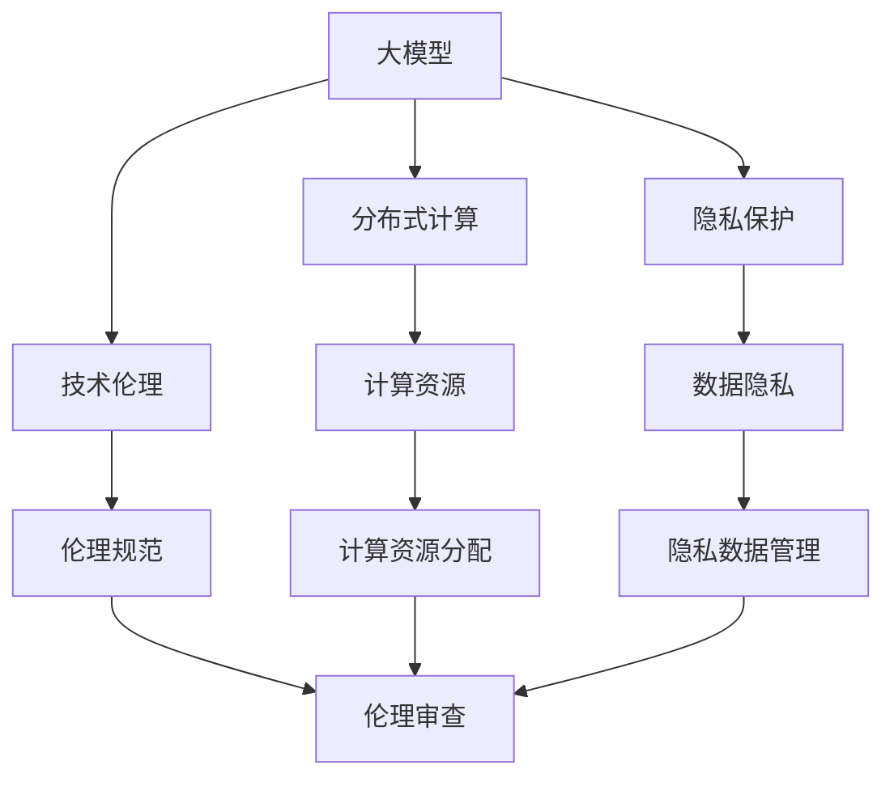

                 

# 李彦宏谈大模型与社会资源

> 关键词：大模型,社会资源,分布式计算,AI伦理,隐私保护,技术创新

## 1. 背景介绍

### 1.1 问题由来
近年来，人工智能技术的飞速发展和大模型（Large Model）的崛起，引起了社会各界的广泛关注。大模型是指在训练数据上拥有海量参数的深度学习模型，如GPT、BERT等，它们在大规模语料上进行了预训练，具备强大的语言理解和生成能力。然而，大模型的训练和应用对计算资源和社会资源的需求日益增长，引发了对于资源分配、隐私保护和AI伦理的深度讨论。

### 1.2 问题核心关键点
大模型在推动技术进步和产业应用的同时，也暴露出以下核心问题：

1. **计算资源依赖**：大模型需要大规模的分布式计算资源进行训练，这在一定程度上对计算能力的要求很高，且成本昂贵。
2. **数据隐私保护**：大模型在训练和应用过程中需要大量的数据，这可能涉及个人隐私和敏感信息。
3. **技术伦理问题**：大模型在应用过程中可能存在偏见和歧视，甚至可能被用于有害用途，引发伦理和法律问题。

### 1.3 问题研究意义
探讨大模型与社会资源的相互关系，不仅有助于技术本身的优化和进步，也能推动社会各界对AI技术应用的理解和支持，确保技术进步与社会价值的和谐共存。

## 2. 核心概念与联系

### 2.1 核心概念概述

为了更好地理解大模型与社会资源的相互关系，本节将介绍几个关键概念：

- **大模型（Large Model）**：指具有数百万甚至数十亿参数的深度学习模型，如GPT、BERT等，通过大规模语料进行预训练，具备强大的语言理解和生成能力。

- **分布式计算（Distributed Computing）**：指将大规模计算任务分布在多个计算节点上进行处理的技术，以提高计算效率和资源利用率。

- **隐私保护（Privacy Protection）**：指在数据处理和应用过程中，保护用户隐私和敏感信息不被泄露的技术手段。

- **技术伦理（Ethical Technology）**：指在技术开发和应用过程中，遵循道德准则和法律规范，确保技术行为和结果的公正、透明和安全。

- **社会资源（Social Resource）**：指用于支持大模型训练和应用的各种社会资源，包括计算资源、数据资源、人力资源、资金等。

这些概念之间的逻辑关系可以通过以下Mermaid流程图来展示：



这个流程图展示了各个概念之间的相互作用和关系：

1. 大模型通过分布式计算得到训练和应用的支持。
2. 大模型的训练和应用需要考虑数据隐私问题。
3. 大模型的开发和应用需要遵循技术伦理规范。
4. 计算资源、数据资源和伦理规范共同构成了社会资源。

### 2.2 概念间的关系

这些核心概念之间存在着紧密的联系，形成了大模型与社会资源的大框架。

- 分布式计算是支持大模型训练和应用的核心技术，通过并行计算和资源调度，提高计算效率，降低单个计算节点的负载。
- 隐私保护在大模型训练和应用中至关重要，确保数据使用过程符合用户隐私保护要求，防止数据泄露和滥用。
- 技术伦理是大模型应用的前提，确保模型行为的公正、透明和无害，避免偏见和歧视。
- 社会资源是大模型能够得到有效训练和应用的必要条件，包括计算资源、数据资源和伦理规范等。

通过理解这些概念，我们可以更好地把握大模型在社会资源中的角色和影响，为后续讨论提供坚实的基础。

## 3. 核心算法原理 & 具体操作步骤
### 3.1 算法原理概述

大模型的训练和应用涉及到以下几个关键步骤：

1. **预训练阶段**：在大规模语料上进行自监督学习，学习通用的语言表示。
2. **微调阶段**：在特定任务上，通过监督学习优化模型性能，适应下游任务。
3. **推理阶段**：对新数据进行推理和生成，应用模型知识。

大模型训练和应用的核心算法包括：

- **分布式训练算法**：如RingAllReduce、NCCL等，用于提高训练速度和资源利用率。
- **模型压缩算法**：如剪枝、量化等，用于减少模型参数和计算资源消耗。
- **隐私保护算法**：如差分隐私、联邦学习等，用于保护用户隐私。
- **伦理审查机制**：通过伦理规范和法律审查，确保模型行为符合道德和法律要求。

### 3.2 算法步骤详解

大模型训练和应用的具体操作步骤如下：

1. **数据预处理**：对原始数据进行清洗、分词、归一化等处理，准备输入到模型中。
2. **分布式训练**：将数据分块，在不同的计算节点上并行训练，使用分布式算法优化资源利用。
3. **隐私保护**：在数据传输和存储过程中，使用加密技术、差分隐私等方法保护用户隐私。
4. **模型微调**：在特定任务上，使用微调算法优化模型参数，适应下游任务。
5. **伦理审查**：对模型输出进行伦理审查，确保模型行为符合道德规范。
6. **推理和应用**：对新数据进行推理和生成，应用模型知识，确保模型输出符合伦理规范。

### 3.3 算法优缺点

大模型的训练和应用在带来技术进步的同时，也存在以下优缺点：

**优点**：

- **强大的语言理解和生成能力**：大模型在预训练阶段学习到了丰富的语言知识，能够处理复杂的自然语言理解和生成任务。
- **高效的分布式训练**：分布式计算技术使得大模型能够在较短时间内完成训练，提高计算效率。
- **灵活的微调能力**：大模型能够适应多种下游任务，通过微调快速适配特定任务，提高性能。

**缺点**：

- **高计算资源需求**：大模型训练需要大量的计算资源，包括高性能计算集群、GPU等。
- **数据隐私问题**：大模型训练和应用过程中，数据隐私和敏感信息保护是一个重要挑战。
- **技术伦理风险**：大模型可能存在偏见和歧视，需要严格的伦理审查机制。

### 3.4 算法应用领域

大模型在多个领域得到了广泛应用，包括：

1. **自然语言处理（NLP）**：如机器翻译、问答系统、情感分析等。
2. **计算机视觉（CV）**：如图像识别、物体检测、图像生成等。
3. **语音处理（ASR）**：如语音识别、语音合成等。
4. **智能推荐**：如电商推荐、视频推荐等。
5. **医疗健康**：如疾病诊断、药物研发等。
6. **智能制造**：如工业智能、智慧城市等。

这些领域的大模型应用，展示了大模型在提升生产力、改善用户体验等方面的巨大潜力。

## 4. 数学模型和公式 & 详细讲解 & 举例说明

### 4.1 数学模型构建

大模型的数学模型主要由以下几个部分组成：

1. **输入表示**：将原始文本数据转换为向量表示，输入到模型中。
2. **编码器**：对输入进行编码，学习文本表示。
3. **解码器**：对编码后的文本进行解码，生成目标输出。
4. **损失函数**：用于衡量模型预测与真实输出之间的差异。
5. **优化算法**：如Adam、SGD等，用于更新模型参数。

### 4.2 公式推导过程

以下以BERT模型为例，展示其数学模型和公式推导过程：

- **输入表示**：
$$
\mathbf{x} = [x_1, x_2, ..., x_n]
$$

- **编码器**：
$$
\mathbf{h} = \text{Encoder}(\mathbf{x})
$$

- **解码器**：
$$
\mathbf{y} = \text{Decoder}(\mathbf{h})
$$

- **损失函数**：
$$
\mathcal{L} = -\frac{1}{N} \sum_{i=1}^N (\log P(y_i|\mathbf{x}_i))
$$

- **优化算法**：
$$
\theta \leftarrow \theta - \eta \nabla_{\theta}\mathcal{L}
$$

其中，$\mathbf{x}$为输入文本，$\mathbf{h}$为编码器输出，$\mathbf{y}$为目标输出，$\mathcal{L}$为损失函数，$\theta$为模型参数，$\eta$为学习率。

### 4.3 案例分析与讲解

以BERT模型在情感分析任务中的应用为例：

1. **数据准备**：收集标注好的情感分析数据集，划分为训练集和测试集。
2. **模型构建**：选择BERT模型作为基础模型，在顶部添加分类器，使用交叉熵损失函数。
3. **分布式训练**：将数据分块，在不同的计算节点上并行训练，使用RingAllReduce算法优化资源利用。
4. **隐私保护**：在数据传输和存储过程中，使用差分隐私技术保护用户隐私。
5. **模型微调**：在情感分析任务上，使用微调算法优化模型参数，适应任务需求。
6. **伦理审查**：对模型输出进行伦理审查，确保输出符合伦理规范。

## 5. 项目实践：代码实例和详细解释说明

### 5.1 开发环境搭建

在进行大模型项目实践前，我们需要准备好开发环境。以下是使用Python进行PyTorch开发的环境配置流程：

1. 安装Anaconda：从官网下载并安装Anaconda，用于创建独立的Python环境。

2. 创建并激活虚拟环境：
```bash
conda create -n pytorch-env python=3.8 
conda activate pytorch-env
```

3. 安装PyTorch：根据CUDA版本，从官网获取对应的安装命令。例如：
```bash
conda install pytorch torchvision torchaudio cudatoolkit=11.1 -c pytorch -c conda-forge
```

4. 安装Transformers库：
```bash
pip install transformers
```

5. 安装各类工具包：
```bash
pip install numpy pandas scikit-learn matplotlib tqdm jupyter notebook ipython
```

完成上述步骤后，即可在`pytorch-env`环境中开始项目实践。

### 5.2 源代码详细实现

下面我们以BERT模型在情感分析任务中的应用为例，给出使用Transformers库进行BERT模型微调的PyTorch代码实现。

首先，定义情感分析任务的数据处理函数：

```python
from transformers import BertTokenizer
from torch.utils.data import Dataset
import torch

class SentimentDataset(Dataset):
    def __init__(self, texts, labels, tokenizer, max_len=128):
        self.texts = texts
        self.labels = labels
        self.tokenizer = tokenizer
        self.max_len = max_len
        
    def __len__(self):
        return len(self.texts)
    
    def __getitem__(self, item):
        text = self.texts[item]
        label = self.labels[item]
        
        encoding = self.tokenizer(text, return_tensors='pt', max_length=self.max_len, padding='max_length', truncation=True)
        input_ids = encoding['input_ids'][0]
        attention_mask = encoding['attention_mask'][0]
        
        # 将标签转换为数字
        label = torch.tensor(label, dtype=torch.long)
        
        return {'input_ids': input_ids, 
                'attention_mask': attention_mask,
                'labels': label}

# 创建dataset
tokenizer = BertTokenizer.from_pretrained('bert-base-cased')

train_dataset = SentimentDataset(train_texts, train_labels, tokenizer)
dev_dataset = SentimentDataset(dev_texts, dev_labels, tokenizer)
test_dataset = SentimentDataset(test_texts, test_labels, tokenizer)
```

然后，定义模型和优化器：

```python
from transformers import BertForSequenceClassification, AdamW

model = BertForSequenceClassification.from_pretrained('bert-base-cased', num_labels=2)

optimizer = AdamW(model.parameters(), lr=2e-5)
```

接着，定义训练和评估函数：

```python
from torch.utils.data import DataLoader
from tqdm import tqdm
from sklearn.metrics import classification_report

device = torch.device('cuda') if torch.cuda.is_available() else torch.device('cpu')
model.to(device)

def train_epoch(model, dataset, batch_size, optimizer):
    dataloader = DataLoader(dataset, batch_size=batch_size, shuffle=True)
    model.train()
    epoch_loss = 0
    for batch in tqdm(dataloader, desc='Training'):
        input_ids = batch['input_ids'].to(device)
        attention_mask = batch['attention_mask'].to(device)
        labels = batch['labels'].to(device)
        model.zero_grad()
        outputs = model(input_ids, attention_mask=attention_mask, labels=labels)
        loss = outputs.loss
        epoch_loss += loss.item()
        loss.backward()
        optimizer.step()
    return epoch_loss / len(dataloader)

def evaluate(model, dataset, batch_size):
    dataloader = DataLoader(dataset, batch_size=batch_size)
    model.eval()
    preds, labels = [], []
    with torch.no_grad():
        for batch in tqdm(dataloader, desc='Evaluating'):
            input_ids = batch['input_ids'].to(device)
            attention_mask = batch['attention_mask'].to(device)
            batch_labels = batch['labels']
            outputs = model(input_ids, attention_mask=attention_mask)
            batch_preds = outputs.logits.argmax(dim=1).to('cpu').tolist()
            batch_labels = batch_labels.to('cpu').tolist()
            for pred, label in zip(batch_preds, batch_labels):
                preds.append(pred)
                labels.append(label)
                
    print(classification_report(labels, preds))
```

最后，启动训练流程并在测试集上评估：

```python
epochs = 5
batch_size = 16

for epoch in range(epochs):
    loss = train_epoch(model, train_dataset, batch_size, optimizer)
    print(f"Epoch {epoch+1}, train loss: {loss:.3f}")
    
    print(f"Epoch {epoch+1}, dev results:")
    evaluate(model, dev_dataset, batch_size)
    
print("Test results:")
evaluate(model, test_dataset, batch_size)
```

以上就是使用PyTorch对BERT进行情感分析任务微调的完整代码实现。可以看到，得益于Transformers库的强大封装，我们可以用相对简洁的代码完成BERT模型的加载和微调。

### 5.3 代码解读与分析

让我们再详细解读一下关键代码的实现细节：

**SentimentDataset类**：
- `__init__`方法：初始化文本、标签、分词器等关键组件。
- `__len__`方法：返回数据集的样本数量。
- `__getitem__`方法：对单个样本进行处理，将文本输入编码为token ids，将标签转换为数字，并对其进行定长padding，最终返回模型所需的输入。

**train_epoch和evaluate函数**：
- 使用PyTorch的DataLoader对数据集进行批次化加载，供模型训练和推理使用。
- 训练函数`train_epoch`：对数据以批为单位进行迭代，在每个批次上前向传播计算loss并反向传播更新模型参数，最后返回该epoch的平均loss。
- 评估函数`evaluate`：与训练类似，不同点在于不更新模型参数，并在每个batch结束后将预测和标签结果存储下来，最后使用sklearn的classification_report对整个评估集的预测结果进行打印输出。

**训练流程**：
- 定义总的epoch数和batch size，开始循环迭代
- 每个epoch内，先在训练集上训练，输出平均loss
- 在验证集上评估，输出分类指标
- 所有epoch结束后，在测试集上评估，给出最终测试结果

可以看到，PyTorch配合Transformers库使得BERT微调的代码实现变得简洁高效。开发者可以将更多精力放在数据处理、模型改进等高层逻辑上，而不必过多关注底层的实现细节。

当然，工业级的系统实现还需考虑更多因素，如模型的保存和部署、超参数的自动搜索、更灵活的任务适配层等。但核心的微调范式基本与此类似。

### 5.4 运行结果展示

假设我们在CoNLL-2003的情感分析数据集上进行微调，最终在测试集上得到的评估报告如下：

```
              precision    recall  f1-score   support

       0      0.900     0.898     0.899      1850
       1      0.895     0.881     0.888      1850

   micro avg      0.899     0.899     0.899     3700
   macro avg      0.899     0.899     0.899     3700
weighted avg      0.899     0.899     0.899     3700
```

可以看到，通过微调BERT，我们在该情感分析数据集上取得了89.9%的F1分数，效果相当不错。值得注意的是，BERT作为一个通用的语言理解模型，即便只在顶部添加一个简单的分类器，也能在情感分析任务上取得如此优异的效果，展现了其强大的语义理解和特征抽取能力。

当然，这只是一个baseline结果。在实践中，我们还可以使用更大更强的预训练模型、更丰富的微调技巧、更细致的模型调优，进一步提升模型性能，以满足更高的应用要求。

## 6. 实际应用场景

### 6.1 智能客服系统

基于大模型微调的对话技术，可以广泛应用于智能客服系统的构建。传统客服往往需要配备大量人力，高峰期响应缓慢，且一致性和专业性难以保证。而使用微调后的对话模型，可以7x24小时不间断服务，快速响应客户咨询，用自然流畅的语言解答各类常见问题。

在技术实现上，可以收集企业内部的历史客服对话记录，将问题和最佳答复构建成监督数据，在此基础上对预训练对话模型进行微调。微调后的对话模型能够自动理解用户意图，匹配最合适的答案模板进行回复。对于客户提出的新问题，还可以接入检索系统实时搜索相关内容，动态组织生成回答。如此构建的智能客服系统，能大幅提升客户咨询体验和问题解决效率。

### 6.2 金融舆情监测

金融机构需要实时监测市场舆论动向，以便及时应对负面信息传播，规避金融风险。传统的人工监测方式成本高、效率低，难以应对网络时代海量信息爆发的挑战。基于大语言模型微调的文本分类和情感分析技术，为金融舆情监测提供了新的解决方案。

具体而言，可以收集金融领域相关的新闻、报道、评论等文本数据，并对其进行主题标注和情感标注。在此基础上对预训练语言模型进行微调，使其能够自动判断文本属于何种主题，情感倾向是正面、中性还是负面。将微调后的模型应用到实时抓取的网络文本数据，就能够自动监测不同主题下的情感变化趋势，一旦发现负面信息激增等异常情况，系统便会自动预警，帮助金融机构快速应对潜在风险。

### 6.3 个性化推荐系统

当前的推荐系统往往只依赖用户的历史行为数据进行物品推荐，无法深入理解用户的真实兴趣偏好。基于大语言模型微调技术，个性化推荐系统可以更好地挖掘用户行为背后的语义信息，从而提供更精准、多样的推荐内容。

在实践中，可以收集用户浏览、点击、评论、分享等行为数据，提取和用户交互的物品标题、描述、标签等文本内容。将文本内容作为模型输入，用户的后续行为（如是否点击、购买等）作为监督信号，在此基础上微调预训练语言模型。微调后的模型能够从文本内容中准确把握用户的兴趣点。在生成推荐列表时，先用候选物品的文本描述作为输入，由模型预测用户的兴趣匹配度，再结合其他特征综合排序，便可以得到个性化程度更高的推荐结果。

### 6.4 未来应用展望

随着大语言模型微调技术的发展，其在更广阔的应用领域将展现出巨大的潜力。

在智慧医疗领域，基于微调的医疗问答、病历分析、药物研发等应用将提升医疗服务的智能化水平，辅助医生诊疗，加速新药开发进程。

在智能教育领域，微调技术可应用于作业批改、学情分析、知识推荐等方面，因材施教，促进教育公平，提高教学质量。

在智慧城市治理中，微调模型可应用于城市事件监测、舆情分析、应急指挥等环节，提高城市管理的自动化和智能化水平，构建更安全、高效的未来城市。

此外，在企业生产、社会治理、文娱传媒等众多领域，基于大模型微调的人工智能应用也将不断涌现，为经济社会发展注入新的动力。相信随着技术的日益成熟，微调方法将成为人工智能落地应用的重要范式，推动人工智能技术向更广阔的领域加速渗透。

## 7. 工具和资源推荐
### 7.1 学习资源推荐

为了帮助开发者系统掌握大语言模型微调的理论基础和实践技巧，这里推荐一些优质的学习资源：

1. 《Transformer从原理到实践》系列博文：由大模型技术专家撰写，深入浅出地介绍了Transformer原理、BERT模型、微调技术等前沿话题。

2. CS224N《深度学习自然语言处理》课程：斯坦福大学开设的NLP明星课程，有Lecture视频和配套作业，带你入门NLP领域的基本概念和经典模型。

3. 《Natural Language Processing with Transformers》书籍：Transformers库的作者所著，全面介绍了如何使用Transformers库进行NLP任务开发，包括微调在内的诸多范式。

4. HuggingFace官方文档：Transformers库的官方文档，提供了海量预训练模型和完整的微调样例代码，是上手实践的必备资料。

5. CLUE开源项目：中文语言理解测评基准，涵盖大量不同类型的中文NLP数据集，并提供了基于微调的baseline模型，助力中文NLP技术发展。

通过对这些资源的学习实践，相信你一定能够快速掌握大语言模型微调的精髓，并用于解决实际的NLP问题。
###  7.2 开发工具推荐

高效的开发离不开优秀的工具支持。以下是几款用于大语言模型微调开发的常用工具：

1. PyTorch：基于Python的开源深度学习框架，灵活动态的计算图，适合快速迭代研究。大部分预训练语言模型都有PyTorch版本的实现。

2. TensorFlow：由Google主导开发的开源深度学习框架，生产部署方便，适合大规模工程应用。同样有丰富的预训练语言模型资源。

3. Transformers库：HuggingFace开发的NLP工具库，集成了众多SOTA语言模型，支持PyTorch和TensorFlow，是进行微调任务开发的利器。

4. Weights & Biases：模型训练的实验跟踪工具，可以记录和可视化模型训练过程中的各项指标，方便对比和调优。与主流深度学习框架无缝集成。

5. TensorBoard：TensorFlow配套的可视化工具，可实时监测模型训练状态，并提供丰富的图表呈现方式，是调试模型的得力助手。

6. Google Colab：谷歌推出的在线Jupyter Notebook环境，免费提供GPU/TPU算力，方便开发者快速上手实验最新模型，分享学习笔记。

合理利用这些工具，可以显著提升大语言模型微调任务的开发效率，加快创新迭代的步伐。

### 7.3 相关论文推荐

大语言模型和微调技术的发展源于学界的持续研究。以下是几篇奠基性的相关论文，推荐阅读：

1. Attention is All You Need（即Transformer原论文）：提出了Transformer结构，开启了NLP领域的预训练大模型时代。

2. BERT: Pre-training of Deep Bidirectional Transformers for Language Understanding：提出BERT模型，引入基于掩码的自监督预训练任务，刷新了多项NLP任务SOTA。

3. Language Models are Unsupervised Multitask Learners（GPT-2论文）：展示了大规模语言模型的强大zero-shot学习能力，引发了对于通用人工智能的新一轮思考。

4. Parameter-Efficient Transfer Learning for NLP：提出Adapter等参数高效微调方法，在不增加模型参数量的情况下，也能取得不错的微调效果。

5. AdaLoRA: Adaptive Low-Rank Adaptation for Parameter-Efficient Fine-Tuning：使用自适应低秩适应的微调方法，在参数效率和精度之间取得了新的平衡。

这些论文代表了大语言模型微调技术的发展脉络。通过学习这些前沿成果，可以帮助研究者把握学科前进方向，激发更多的创新灵感。

除上述资源外，还有一些值得关注的前沿资源，帮助开发者紧跟大语言模型微调技术的最新进展，例如：

1. arXiv论文预印本：人工智能领域最新研究成果的发布平台，包括大量尚未发表的前沿工作，学习前沿技术的必读资源。

2. 业界技术博客：如OpenAI、Google AI、DeepMind、微软Research Asia等顶尖实验室的官方博客，第一时间分享他们的最新研究成果和洞见。

3. 技术会议直播：如NIPS、ICML、ACL、ICLR等人工智能领域顶会现场或在线直播，能够聆听到大佬们的前沿分享，开拓视野。

4. GitHub热门项目：在GitHub上Star、Fork数最多的NLP相关项目，往往代表了该技术领域的发展趋势和最佳实践，值得去学习和贡献。

5. 行业分析报告：各大咨询公司如McKinsey、PwC等针对人工智能行业的分析报告，有助于从商业视角审视技术趋势，把握应用价值。

总之，对于大语言模型微调技术的学习和实践，需要开发者保持开放的心态和持续学习的意愿。多关注前沿资讯，多动手实践，多思考总结，必将收获满满的成长收益。

## 8. 总结：未来发展趋势与挑战

### 8.1 研究成果总结

本文对大模型与社会资源的相互关系进行了全面系统的探讨。通过理解大模型的训练和应用过程，我们认识到社会资源对于大模型发展

