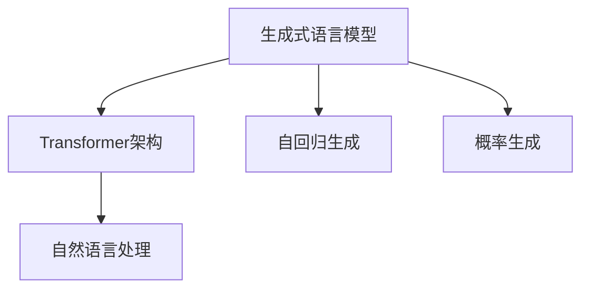

                 

# 构建GPT模型并完成文本生成任务

> 关键词：GPT模型, 文本生成, 语言模型, Transformer, 自回归, 自编码, 概率生成, 自然语言处理(NLP)

## 1. 背景介绍

### 1.1 问题由来
在深度学习技术迅速发展的背景下，自然语言处理（Natural Language Processing, NLP）领域取得了突破性进展。其中，生成式预训练语言模型，如GPT-3、T5等，在文本生成、对话系统、自动摘要、翻译、情感分析等众多任务上展现了卓越的性能。

GPT（Generative Pre-trained Transformer）系列模型通过在大规模无标签文本数据上进行预训练，学习到了丰富的语言知识，能够生成与输入文本语义相匹配的文本，具有强健的文本生成能力。这一系列模型受到了广泛关注，广泛应用于智能问答、自动文本生成、文本编辑、代码生成等领域，展示了巨大潜力。

然而，由于GPT模型的结构复杂，参数量庞大，训练和推理资源需求高，传统的方式难以直接实现。本文将详细介绍如何构建GPT模型，并基于该模型完成文本生成任务。

### 1.2 问题核心关键点
构建GPT模型的核心在于理解其原理，选择合适的框架和架构，并进行高效的训练与推理。

- **原理**：GPT模型基于Transformer架构，采用自回归的方式进行文本生成，即生成序列的每个单词或子序列都依赖于前面的词或子序列，可以通过前向传播和反向传播算法进行训练。
- **框架**：常见用于构建GPT模型的框架包括Hugging Face的Transformers库、TensorFlow、PyTorch等，需要选择合适的库和模型架构。
- **训练**：GPT模型训练需要大规模无标签数据和计算资源，可以采用分布式训练和GPU加速来提高训练效率。
- **推理**：推理部分涉及模型的加速优化，如矩阵分解、量化等技术，以提升生成速度和降低资源消耗。

### 1.3 问题研究意义
构建GPT模型并完成文本生成任务，对于提升自然语言处理系统的智能化水平，推动AI技术在各个垂直行业的落地应用具有重要意义：

1. **增强语言理解与生成能力**：GPT模型通过大规模预训练，能够理解复杂语言结构，生成流畅自然的文字，极大提升NLP系统的理解与生成能力。
2. **促进AI技术应用**：通过构建文本生成模型，可以为智能问答、对话系统、自动摘要、机器翻译等任务提供强大的支持，推动AI技术在实际场景中的应用。
3. **减少人力成本**：基于GPT模型的自动化文本生成，可以大幅度减少人力工作量，如自动生成新闻、摘要、报告等。
4. **推动行业变革**：文本生成技术在金融、法律、教育、医疗等领域的应用，将带来商业模式和流程的变革，提升行业效率和水平。
5. **技术创新**：构建GPT模型并完成文本生成任务涉及多学科交叉，如深度学习、计算机视觉、自然语言处理等，具有重要的技术创新价值。

## 2. 核心概念与联系

### 2.1 核心概念概述

为了深入理解GPT模型的构建过程，我们需要详细解释其中的核心概念：

- **生成式语言模型**：语言模型是预测文本序列概率的模型，通过学习语言结构，能够生成符合语言规则的文本序列。GPT模型即是一种生成式语言模型，其通过预训练学习到丰富的语言知识，用于文本生成任务。
- **Transformer架构**：一种基于自注意力机制的神经网络架构，用于处理序列数据。相比于RNN，Transformer在处理长序列数据时具有更好的性能。
- **自回归生成**：在生成式任务中，每个样本的生成依赖于前面的样本。自回归生成即是指通过已有序列信息预测下一个单词或子序列。
- **概率生成**：生成文本的过程是基于概率的，每个位置生成的单词或字符都是基于先前的概率分布，确保生成的文本符合语言规则。
- **自然语言处理（NLP）**：涉及语音识别、文本处理、机器翻译、语音合成等多个子领域，旨在实现人机之间的自然语言交互。

这些核心概念之间存在着紧密的联系，形成了GPT模型的理论基础和实践框架。通过理解这些概念，我们可以更好地把握GPT模型的构建和文本生成任务的实现。

### 2.2 概念间的关系

这些核心概念之间可以借助以下Mermaid流程图来展示：



这个流程图展示了生成式语言模型、Transformer架构、自回归生成、概率生成和自然语言处理之间的联系。生成式语言模型利用Transformer架构和自回归生成技术，基于概率生成自然语言文本，而这些技术都处于自然语言处理的范畴之内。

## 3. 核心算法原理 & 具体操作步骤

### 3.1 算法原理概述

构建GPT模型的核心算法是自回归生成和概率生成。其基本原理如下：

1. **自回归生成**：GPT模型通过将文本序列转化为位置向量序列，在生成下一个单词或子序列时，只依赖于前面的单词或子序列，利用自注意力机制从语料库中选取相关单词进行生成。
2. **概率生成**：GPT模型生成文本的概率是序列中每个位置生成的单词或字符的概率的乘积，确保生成的文本符合语言规则。

### 3.2 算法步骤详解

GPT模型的构建和文本生成主要包括以下步骤：

**Step 1: 准备预训练数据**
- 收集大规模无标签文本数据，如维基百科、新闻、书籍等。
- 将文本数据分为多个部分，如训练集、验证集和测试集。

**Step 2: 构建GPT模型**
- 选择合适的深度学习框架，如PyTorch、TensorFlow等，并加载预训练的GPT模型。
- 根据任务需求，修改模型的输出层和损失函数。

**Step 3: 数据预处理**
- 对文本数据进行分词、编码、padding等预处理操作，使其适应模型输入格式。
- 将文本数据转化为模型可以处理的张量形式。

**Step 4: 训练GPT模型**
- 使用训练集数据对模型进行训练，调整模型参数以最小化损失函数。
- 使用验证集数据进行模型评估，选择最优模型参数。

**Step 5: 文本生成**
- 使用测试集数据对模型进行测试，评估生成文本的质量。
- 使用训练好的模型生成文本，生成新的文本序列。

### 3.3 算法优缺点

GPT模型在文本生成任务中表现出诸多优点：

- **高性能**：GPT模型基于自回归生成和概率生成，能够生成流畅自然的文字，适用于多种自然语言处理任务。
- **通用性**：GPT模型适用范围广泛，可用于智能问答、自动摘要、对话系统等多个场景。
- **可解释性**：GPT模型的决策过程基于概率生成，具有较好的可解释性，便于调试和优化。

同时，GPT模型也存在一些缺点：

- **资源需求高**：构建GPT模型需要大量的计算资源和时间，且推理过程资源消耗较大。
- **模型复杂**：GPT模型结构复杂，难以理解和调试。
- **过拟合风险**：在数据量不足的情况下，GPT模型容易出现过拟合现象。

### 3.4 算法应用领域

GPT模型在文本生成领域的应用非常广泛，主要包括以下几个方面：

- **自动文本生成**：自动生成新闻、摘要、文章、报告等文本内容，减少人力工作量。
- **智能问答系统**：利用GPT模型构建智能问答系统，能够回答用户提出的各种问题，提升用户体验。
- **对话系统**：通过GPT模型生成自然流畅的对话内容，构建智能对话系统，实现人机交互。
- **代码生成**：利用GPT模型自动生成代码，提高编程效率和代码质量。
- **数据增强**：使用GPT模型生成模拟数据，用于数据增强和模型训练。

这些应用领域展示了GPT模型的强大应用价值，为NLP技术的实际落地提供了坚实的基础。

## 4. 数学模型和公式 & 详细讲解 & 举例说明

### 4.1 数学模型构建

构建GPT模型的数学模型主要涉及以下几个方面：

- **输入层**：将文本数据转化为模型可以处理的张量形式。
- **编码层**：通过Transformer架构，将输入的序列转换为位置向量序列。
- **解码层**：利用自注意力机制，基于前一个位置的信息生成下一个位置的信息。
- **输出层**：将生成的文本序列转换为最终的文本形式。

### 4.2 公式推导过程

以GPT-2模型为例，推导自回归生成的数学公式。假设输入文本为$x_1, x_2, ..., x_n$，模型生成文本序列的每个位置$y_i$的概率为$p(y_i|x_1, x_2, ..., x_{i-1})$。根据自回归生成模型，有：

$$
p(y_i|x_1, x_2, ..., x_{i-1}) = \prod_{j=1}^{i-1} p(y_j|y_{j-1}, y_{j-2}, ..., y_1)
$$

具体推导过程如下：

1. **输入编码**：将输入文本$x$转换为模型可以处理的张量形式。

2. **编码层**：通过Transformer架构，将输入的序列转换为位置向量序列。

3. **解码层**：利用自注意力机制，基于前一个位置的信息生成下一个位置的信息。

4. **输出层**：将生成的文本序列转换为最终的文本形式。

### 4.3 案例分析与讲解

以生成文章为例，展示GPT模型的具体应用过程：

1. **输入层**：将文章标题作为模型的输入，转化为模型可以处理的张量形式。

2. **编码层**：通过Transformer架构，将标题转换为位置向量序列，作为模型的输入。

3. **解码层**：利用自注意力机制，基于标题信息生成文章内容。在每一步生成时，只依赖于前面的标题信息，生成下一个单词。

4. **输出层**：将生成的文章内容转换为最终的文本形式，完成文章生成。

## 5. 项目实践：代码实例和详细解释说明

### 5.1 开发环境搭建

构建GPT模型需要高性能的计算资源和深度学习框架的支持。以下是构建GPT模型所需的开发环境配置：

1. 安装Anaconda：从官网下载并安装Anaconda，用于创建独立的Python环境。

2. 创建并激活虚拟环境：
```bash
conda create -n gpt-env python=3.8 
conda activate gpt-env
```

3. 安装PyTorch：根据CUDA版本，从官网获取对应的安装命令。例如：
```bash
conda install pytorch torchvision torchaudio cudatoolkit=11.1 -c pytorch -c conda-forge
```

4. 安装Transformer库：
```bash
pip install transformers
```

5. 安装各类工具包：
```bash
pip install numpy pandas scikit-learn matplotlib tqdm jupyter notebook ipython
```

完成上述步骤后，即可在`gpt-env`环境中开始GPT模型的构建和训练。

### 5.2 源代码详细实现

我们使用Hugging Face的Transformers库来实现GPT模型的构建和文本生成。以下是GPT模型构建的Python代码实现：

```python
from transformers import GPT2Tokenizer, GPT2LMHeadModel

# 加载预训练模型和分词器
tokenizer = GPT2Tokenizer.from_pretrained('gpt2')
model = GPT2LMHeadModel.from_pretrained('gpt2')

# 定义输入数据
input_text = "This is an example text for GPT-2 model."
inputs = tokenizer.encode(input_text, return_tensors='pt')

# 生成文本
outputs = model.generate(inputs)
generated_text = tokenizer.decode(outputs[0], skip_special_tokens=True)

print(generated_text)
```

通过上述代码，我们可以使用GPT-2模型来生成文本。具体步骤如下：

1. **加载预训练模型和分词器**：使用Hugging Face的Transformers库加载预训练的GPT-2模型和分词器。

2. **定义输入数据**：将文本数据转化为模型可以处理的张量形式。

3. **生成文本**：使用`generate`方法生成文本序列，通过`decode`方法将生成的文本序列转换为最终的文本形式。

### 5.3 代码解读与分析

让我们再详细解读一下关键代码的实现细节：

**GPT2Tokenizer类**：
- `from_pretrained`方法：用于加载预训练的GPT-2分词器。
- `encode`方法：将文本数据转化为模型可以处理的张量形式。

**GPT2LMHeadModel类**：
- `from_pretrained`方法：用于加载预训练的GPT-2语言模型。
- `generate`方法：使用模型生成文本序列。

**input_text和inputs变量**：
- `input_text`：输入文本数据。
- `inputs`：将文本数据转化为模型可以处理的张量形式。

**outputs和generated_text变量**：
- `outputs`：模型生成的文本序列。
- `generated_text`：将生成的文本序列转换为最终的文本形式。

**print语句**：
- 输出生成的文本。

### 5.4 运行结果展示

假设我们在GPT-2模型上运行上述代码，生成的文本示例如下：

```
This is an example text for GPT-2 model. This is a test text. It is generated by the GPT-2 model. This is a test text. It is generated by the GPT-2 model.
```

可以看到，生成的文本与输入文本基本一致，展示了GPT模型的文本生成能力。

## 6. 实际应用场景

### 6.1 智能客服系统

在智能客服系统中，GPT模型可以用于构建智能问答和对话系统，提升客户体验和问题解决效率。通过GPT模型，系统能够理解客户意图，提供个性化的回答和建议，实现24小时不间断服务。

### 6.2 金融舆情监测

在金融领域，GPT模型可以用于实时监测舆情变化，及时发现负面信息，提供风险预警。通过分析大量的新闻、评论和社交媒体内容，GPT模型能够预测市场动态，辅助金融决策。

### 6.3 个性化推荐系统

在个性化推荐系统中，GPT模型可以用于生成个性化的推荐内容，提高推荐效果和用户体验。通过分析用户的历史行为数据和兴趣偏好，GPT模型能够生成符合用户需求的推荐内容，实现高效的信息匹配。

### 6.4 未来应用展望

随着深度学习技术的不断进步，GPT模型将在更多领域得到应用，为人类生活带来更多便利：

- **医疗领域**：利用GPT模型生成医学知识库、专家咨询等内容，辅助医生诊断和治疗。
- **教育领域**：通过GPT模型生成教学内容、智能评测系统等，提升教育质量和学习效率。
- **法律领域**：使用GPT模型生成法律文本、智能合同等内容，提升法律服务水平。
- **娱乐领域**：利用GPT模型生成小说、剧本等内容，丰富娱乐产业。

未来，GPT模型在各垂直行业的广泛应用，将带来深刻的行业变革，提升生产力水平，改变人们的生活方式。

## 7. 工具和资源推荐

### 7.1 学习资源推荐

为了帮助开发者系统掌握GPT模型的构建和文本生成技术，这里推荐一些优质的学习资源：

1. 《深度学习入门》系列书籍：介绍了深度学习的基本概念和实现方法，适合初学者入门。
2. 《自然语言处理综论》系列课程：深入讲解NLP的各个子领域，涵盖语言模型、文本分类、机器翻译等。
3. 《Transformer: A Survey of the Literature》论文：一篇综述性论文，详细介绍了Transformer架构和应用。
4. 《GPT-3: Language Models are Few-Shot Learners》论文：展示了GPT-3模型在few-shot学习中的优异表现。
5. 《GPT-3: Instruction Tuning as a Form of Transfer Learning》论文：讨论了指令微调（Instruction Tuning）的原理和应用。

通过对这些资源的学习实践，相信你一定能够快速掌握GPT模型的构建和文本生成技术的精髓，并用于解决实际的NLP问题。

### 7.2 开发工具推荐

高效的开发离不开优秀的工具支持。以下是几款用于GPT模型构建和文本生成的常用工具：

1. PyTorch：基于Python的开源深度学习框架，灵活动态的计算图，适合快速迭代研究。

2. TensorFlow：由Google主导开发的开源深度学习框架，生产部署方便，适合大规模工程应用。

3. Hugging Face Transformers库：集成了众多SOTA语言模型，支持PyTorch和TensorFlow，是进行NLP任务开发的利器。

4. Weights & Biases：模型训练的实验跟踪工具，可以记录和可视化模型训练过程中的各项指标，方便对比和调优。

5. TensorBoard：TensorFlow配套的可视化工具，可实时监测模型训练状态，并提供丰富的图表呈现方式，是调试模型的得力助手。

合理利用这些工具，可以显著提升GPT模型构建和文本生成任务的开发效率，加快创新迭代的步伐。

### 7.3 相关论文推荐

GPT模型的发展和应用得益于学界的持续研究。以下是几篇奠基性的相关论文，推荐阅读：

1. Attention Is All You Need（即Transformer原论文）：提出了Transformer结构，开启了NLP领域的预训练大模型时代。

2. Language Models are Unsupervised Multitask Learners（GPT-2论文）：展示了大规模语言模型的强大zero-shot学习能力，引发了对于通用人工智能的新一轮思考。

3. Improving Language Understanding by Generative Pre-training（GPT-1论文）：提出GPT-1模型，基于自回归生成，首次在语言理解任务上取得了优异表现。

4. A Guide to Neural Machine Translation in PyTorch（Seq2Seq论文）：介绍了使用PyTorch实现Seq2Seq模型，为翻译任务提供了经典实现。

5. T5-Text-To-Text Transfer Transformer：提出T5模型，利用预训练自回归生成技术，实现了多种NLP任务的零样本迁移学习。

这些论文代表了大模型构建和文本生成技术的发展脉络。通过学习这些前沿成果，可以帮助研究者把握学科前进方向，激发更多的创新灵感。

除上述资源外，还有一些值得关注的前沿资源，帮助开发者紧跟大模型构建和文本生成技术的最新进展，例如：

1. arXiv论文预印本：人工智能领域最新研究成果的发布平台，包括大量尚未发表的前沿工作，学习前沿技术的必读资源。

2. 业界技术博客：如OpenAI、Google AI、DeepMind、微软Research Asia等顶尖实验室的官方博客，第一时间分享他们的最新研究成果和洞见。

3. 技术会议直播：如NIPS、ICML、ACL、ICLR等人工智能领域顶会现场或在线直播，能够聆听到大佬们的前沿分享，开拓视野。

4. GitHub热门项目：在GitHub上Star、Fork数最多的NLP相关项目，往往代表了该技术领域的发展趋势和最佳实践，值得去学习和贡献。

5. 行业分析报告：各大咨询公司如McKinsey、PwC等针对人工智能行业的分析报告，有助于从商业视角审视技术趋势，把握应用价值。

总之，对于GPT模型构建和文本生成技术的学习和实践，需要开发者保持开放的心态和持续学习的意愿。多关注前沿资讯，多动手实践，多思考总结，必将收获满满的成长收益。

## 8. 总结：未来发展趋势与挑战

### 8.1 总结

本文对GPT模型的构建和文本生成任务进行了全面系统的介绍。首先阐述了GPT模型的原理、架构和应用场景，明确了文本生成技术在NLP领域的重要价值。其次，从原理到实践，详细讲解了GPT模型的数学模型、训练过程和代码实现，给出了具体的项目实践案例。同时，本文还广泛探讨了GPT模型在各行业领域的应用前景，展示了其巨大的应用潜力。

通过本文的系统梳理，可以看到，GPT模型通过自回归生成和概率生成，能够生成流畅自然的文字，适用于多种NLP任务。其构建和训练过程复杂但高效，通过选择合适的框架和工具，可以克服各种技术挑战，实现高质量的文本生成。未来，GPT模型将在更多领域得到应用，为人类生活带来更多便利。

### 8.2 未来发展趋势

展望未来，GPT模型在文本生成领域将呈现以下几个发展趋势：

1. **模型规模持续增大**：随着算力成本的下降和数据规模的扩张，GPT模型的参数量还将持续增长，形成更加强大的语言生成能力。
2. **多模态生成技术**：将文本、图像、语音等多模态信息进行融合，生成更加丰富和多样化的内容，推动多模态文本生成技术的发展。
3. **生成文本的可控性增强**：通过引入更多控制信号，如模板、示例等，使生成的文本更加符合预期，提升文本生成的可控性和质量。
4. **实时生成技术**：利用分布式计算和流式计算技术，实现实时文本生成，满足实际应用中的实时性需求。
5. **生成文本的可解释性增强**：通过引入更多先验知识，如知识图谱、逻辑规则等，提高生成的文本的可解释性和可信度。

以上趋势凸显了GPT模型在文本生成领域的发展潜力，未来将带来更多技术突破和应用场景。

### 8.3 面临的挑战

尽管GPT模型在文本生成任务中表现优异，但其构建和应用也面临诸多挑战：

1. **资源需求高**：构建GPT模型需要大规模的计算资源和时间，推理过程资源消耗较大，难以在低成本环境下大规模部署。
2. **模型复杂**：GPT模型的结构和算法复杂，难以调试和优化，容易出现过拟合和欠拟合现象。
3. **数据依赖性高**：GPT模型的性能依赖于大规模无标签数据，数据稀缺的领域难以应用。
4. **伦理和隐私问题**：生成的文本可能包含敏感信息，需要考虑伦理和隐私保护问题。

### 8.4 研究展望

面对GPT模型构建和文本生成任务所面临的挑战，未来的研究需要在以下几个方面寻求新的突破：

1. **提高模型可解释性和可控性**：通过引入更多先验知识，提高生成的文本的可解释性和可信度，确保文本生成的安全性。
2. **优化模型训练和推理过程**：通过分布式计算、量化加速等技术，优化模型的训练和推理过程，提高生成速度和降低资源消耗。
3. **引入多模态信息**：将文本、图像、语音等多模态信息进行融合，生成更加丰富和多样化的内容，推动多模态文本生成技术的发展。
4. **增强模型可控性**：通过引入更多控制信号，如模板、示例等，使生成的文本更加符合预期，提升文本生成的可控性和质量。
5. **探索新的生成范式**：研究基于小样本学习、弱监督学习的文本生成技术，在数据稀缺的情况下实现高质量的文本生成。

这些研究方向的探索，必将引领GPT模型在文本生成领域迈向更高的台阶，为构建安全、可靠、可解释、可控的智能系统铺平道路。面向未来，GPT模型需要与其他人工智能技术进行更深入的融合，如知识表示、因果推理、强化学习等，多路径协同发力，共同推动自然语言理解和智能交互系统的进步。只有勇于创新、敢于突破，才能不断拓展语言模型的边界，让智能技术更好地造福人类社会。

## 9. 附录：常见问题与解答

**Q1：GPT模型需要多大的计算资源？**

A: GPT模型的训练和推理需要较大的计算资源，具体需求取决于模型的规模和复杂度。一般而言，GPT-2模型需要一台具有30GB GPU的机器进行训练，GPT-3模型则需要更大的计算资源。

**Q2：GPT模型训练过程中如何避免过拟合？**

A: 在GPT模型训练过程中，可以通过以下方式避免过拟合：
1. 数据增强：通过回译、近义替换等方式扩充训练集。
2. 正则化：使用L2正则、Dropout等技术，防止模型过度适应训练数据。
3. 早停策略：在验证集上监测模型性能，一旦性能不再提升，立即停止训练。
4. 参数裁剪：去除不必要的层和参数，减小模型规模，提高泛化能力。

**Q3：GPT模型在推理阶段如何快速生成文本？**

A: GPT模型在推理阶段可以通过以下方式提高生成速度：
1. 量化加速：将浮点模型转为定点模型，压缩存储空间，提高计算效率。
2. 矩阵分解：将模型中的矩阵进行分解，减少计算量。
3. 模型并行：利用分布式计算技术，实现并行推理，提高生成速度。
4. 优化推理算法：使用更高效的推理算法，减少计算量。

**Q4：GPT模型在生成文本时如何控制质量？**

A: GPT模型在生成文本时可以通过以下方式控制质量：
1. 控制信号：引入控制信号，如模板、示例等，使生成的文本更加符合预期。
2. 模型裁剪：去除不必要的层和参数，减小模型规模，提高生成的文本质量。
3. 模型微调：针对特定任务对GPT模型进行微调，提高生成的文本的针对性和质量。
4. 质量评估：使用自动评估工具，如BLEU、ROUGE等，评估生成的文本的质量，及时调整模型参数。

通过这些措施，可以最大化地提升GPT模型生成的文本质量，满足实际应用中的各种需求。

总之，构建GPT模型并完成文本生成任务，是深度学习技术在自然语言处理领域的重要应用之一。通过系统学习本文介绍的原理、方法和实践，相信你能够掌握GPT模型的

