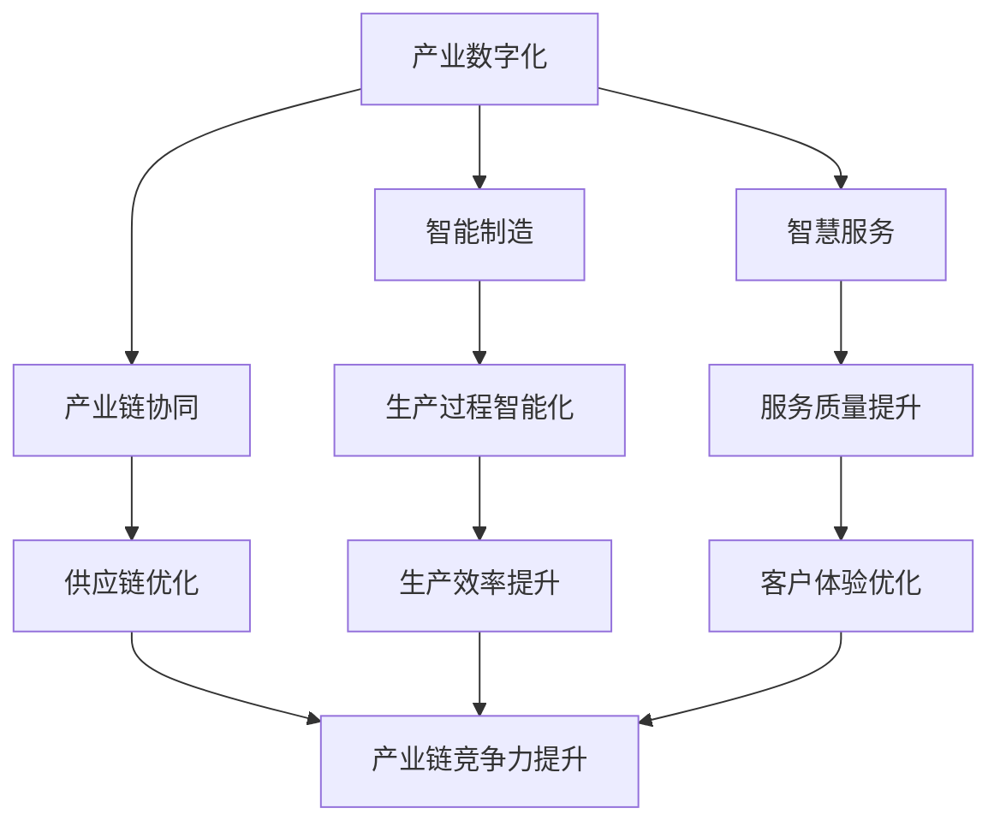
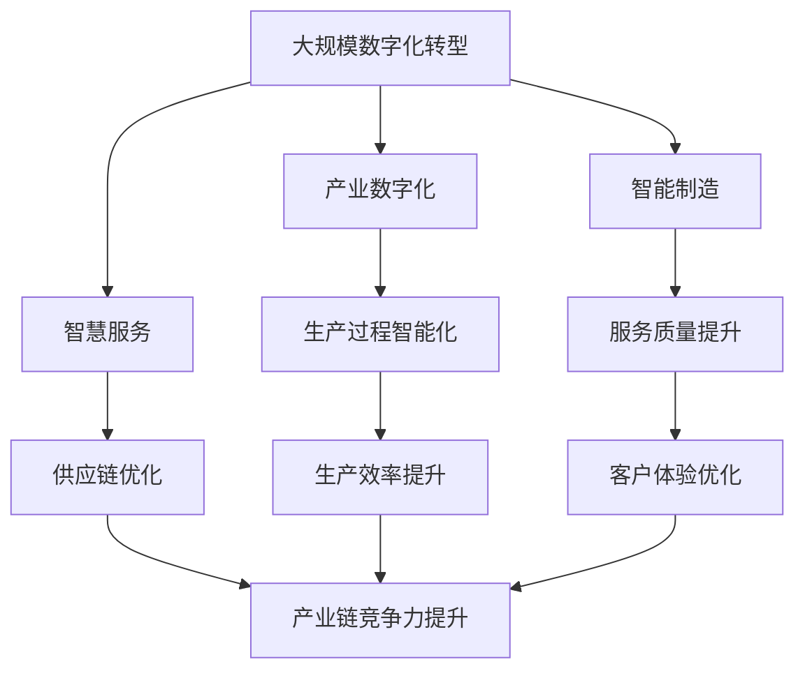

                 

# 构建特色产业的新质生产力

## 1. 背景介绍

### 1.1 问题由来

在当前全球经济快速发展的大背景下，产业转型升级已成为各国经济高质量发展的必由之路。特别是近年来，随着新一代信息技术与实体经济深度融合，数字化、网络化、智能化成为推动传统产业升级转型、促进经济高质量发展的重要力量。然而，如何在保持传统产业优势的同时，充分发挥信息技术的巨大潜力，实现产业升级与信息技术深度融合，成为一个迫切需要解决的重大课题。

为此，构建特色产业的新质生产力成为了当前产业升级的关键方向。通过结合信息技术与产业特点，引入创新模式与技术手段，推动传统产业的数字化、智能化、服务化升级，构建新产业体系，形成新生产模式和新产业结构，打造具有竞争力的特色产业。

### 1.2 问题核心关键点

构建特色产业的新质生产力，需要关注以下几个核心关键点：

1. **数字化转型**：利用信息技术推动传统产业向数字化、智能化方向发展，实现生产、管理和服务的数字化。
2. **产业融合**：促进信息技术与传统产业的深度融合，实现产业跨界融合，形成新产业生态。
3. **创新模式**：引入新的技术手段和管理模式，提升产业竞争力和创新能力。
4. **产业链协同**：构建基于信息技术的产业供应链和价值链，促进上下游企业协同合作，提升产业链整体竞争力。
5. **技术赋能**：通过引入先进技术手段，提升生产效率和服务质量，降低生产成本。

通过关注这些关键点，可以构建起具有竞争力的特色产业，提升产业整体发展水平。

### 1.3 问题研究意义

构建特色产业的新质生产力，对促进传统产业升级转型、推动经济高质量发展具有重要意义：

1. **提升产业竞争力**：通过引入先进技术和管理模式，提升传统产业的数字化、智能化水平，增强产业竞争力。
2. **促进经济高质量发展**：推动传统产业向高质量发展方向转型，实现经济持续健康发展。
3. **助力区域经济发展**：通过构建特色产业，带动区域经济发展，提升区域产业竞争力。
4. **促进就业**：产业升级转型可以创造更多高质量就业机会，提升就业质量。
5. **促进科技创新**：产业升级转型可以带动新技术的研发和应用，促进科技进步和创新。

通过以上几点，可以全面提升产业整体水平，推动经济高质量发展，促进区域经济发展和就业。

## 2. 核心概念与联系

### 2.1 核心概念概述

构建特色产业的新质生产力涉及多个核心概念，包括但不限于以下几类：

- **产业数字化**：利用信息技术对传统产业进行数字化改造，提升生产、管理和服务的数字化水平。
- **产业智能化**：通过引入人工智能、大数据、物联网等技术，实现产业的智能化转型。
- **产业链协同**：基于信息技术的产业供应链和价值链协同，促进上下游企业协同合作，提升产业链整体竞争力。
- **技术创新**：引入新的技术手段和管理模式，提升产业竞争力和创新能力。
- **智能制造**：通过引入智能设备、智能生产线和智能管理系统，实现生产过程的智能化和自动化。
- **智慧服务**：利用信息技术提升服务水平，实现智慧化服务。

这些核心概念之间存在着紧密的联系，通过合理的整合与运用，可以实现产业升级转型，提升产业竞争力。

### 2.2 概念间的关系

这些核心概念之间的关系可以用以下Mermaid流程图来展示：



该图展示了产业数字化、智能制造、智慧服务和产业链协同等核心概念之间的关系。

### 2.3 核心概念的整体架构

最后，我们用一个综合的流程图来展示这些核心概念在大规模数字化转型的整体架构：



该图展示了从大规模数字化转型到产业数字化、智能制造、智慧服务和产业链协同等关键概念的整体架构。

## 3. 核心算法原理 & 具体操作步骤

### 3.1 算法原理概述

构建特色产业的新质生产力，本质上是一个基于信息技术对传统产业进行全面改造和升级的过程。在这一过程中，需要进行数据收集、数据分析、模型训练、模型部署等步骤，以实现产业数字化、智能化和创新。

具体而言，构建特色产业的新质生产力可以按照以下步骤进行：

1. **数据采集与预处理**：收集与产业相关的各种数据，如生产数据、销售数据、供应链数据、客户数据等，并进行清洗、归一化等预处理。
2. **数据分析与建模**：利用数据分析和建模技术，从数据中提取有价值的信息，构建各种模型，如预测模型、优化模型等。
3. **模型训练与优化**：使用机器学习、深度学习等技术，对模型进行训练和优化，提升模型的预测和优化能力。
4. **模型部署与应用**：将训练好的模型部署到实际生产环境中，进行测试和优化，实现智能化生产、智慧化服务等功能。
5. **持续改进与优化**：根据实际应用效果，不断改进和优化模型，提升产业数字化和智能化水平。

### 3.2 算法步骤详解

以下是构建特色产业新质生产力的详细步骤：

**Step 1: 数据采集与预处理**

数据采集与预处理是构建特色产业新质生产力的第一步，需要确保数据的准确性、完整性和可用性。数据采集方法包括但不限于以下几种：

1. **生产数据采集**：采集生产设备、生产线的各种数据，如温度、湿度、压力、速度等。
2. **销售数据采集**：采集销售订单、库存、客户反馈等数据。
3. **供应链数据采集**：采集供应链上的各种数据，如供应商信息、物流数据、订单数据等。
4. **客户数据采集**：采集客户的各种数据，如购买记录、浏览记录、评价记录等。

采集到的数据需要进行预处理，包括数据清洗、数据转换、数据归一化等步骤。数据清洗是指去除数据中的噪声和异常值，提高数据的质量。数据转换是将原始数据转换为模型所需的格式。数据归一化是将数据转化为标准化的范围，便于模型的处理和训练。

**Step 2: 数据分析与建模**

数据分析与建模是构建特色产业新质生产力的核心步骤，通过数据分析与建模，从数据中提取有价值的信息，构建各种模型，如预测模型、优化模型等。具体步骤如下：

1. **数据探索性分析**：对采集到的数据进行探索性分析，了解数据的分布、趋势和规律。
2. **特征选择与提取**：选择和提取与产业相关的特征，构建特征集。
3. **模型构建与训练**：利用机器学习、深度学习等技术，构建各种模型，如回归模型、分类模型、聚类模型等，并进行训练和优化。
4. **模型评估与优化**：对训练好的模型进行评估和优化，提升模型的性能。

**Step 3: 模型训练与优化**

模型训练与优化是构建特色产业新质生产力的关键步骤，通过模型训练与优化，提升模型的预测和优化能力。具体步骤如下：

1. **模型选择**：选择适合产业特点的模型，如回归模型、分类模型、聚类模型等。
2. **数据准备**：准备训练数据，包括训练集、验证集和测试集。
3. **模型训练**：使用训练数据对模型进行训练，优化模型参数。
4. **模型验证**：在验证集上对模型进行验证，评估模型性能。
5. **模型优化**：根据验证结果，对模型进行优化，提升模型性能。

**Step 4: 模型部署与应用**

模型部署与应用是构建特色产业新质生产力的最后一步，通过模型部署与应用，实现智能化生产、智慧化服务等功能。具体步骤如下：

1. **模型部署**：将训练好的模型部署到实际生产环境中，如生产设备、生产线、智能客服系统等。
2. **系统集成**：将模型与生产环境中的其他系统集成，实现数据共享和协同工作。
3. **测试与优化**：对部署的模型进行测试和优化，提升系统的性能。
4. **持续改进**：根据实际应用效果，不断改进和优化模型，提升产业数字化和智能化水平。

### 3.3 算法优缺点

构建特色产业的新质生产力具有以下优点：

1. **提高生产效率**：通过引入智能化生产设备和技术，提高生产效率，降低生产成本。
2. **提升服务质量**：通过引入智慧化服务技术，提升服务质量和客户体验。
3. **增强竞争力**：通过引入新技术和管理模式，提升产业竞争力，增强市场份额。
4. **促进创新**：通过引入新技术和管理模式，推动产业创新，促进产业升级转型。

然而，构建特色产业的新质生产力也存在一些缺点：

1. **数据隐私与安全问题**：在数据采集与处理过程中，需要注意数据隐私与安全问题，防止数据泄露和滥用。
2. **技术复杂性**：构建特色产业的新质生产力需要引入先进技术和工具，对技术要求较高，需要具备一定的技术基础和能力。
3. **成本投入高**：构建特色产业的新质生产力需要较高的投入，包括技术研发、设备采购、系统集成等。
4. **对企业要求高**：构建特色产业的新质生产力对企业的要求较高，需要具备一定的管理能力和技术能力。

### 3.4 算法应用领域

构建特色产业的新质生产力在多个领域具有广泛的应用，包括但不限于以下几类：

1. **制造业**：通过引入智能制造技术，实现生产过程的智能化和自动化，提升生产效率和产品质量。
2. **服务业**：通过引入智慧化服务技术，提升服务质量和客户体验，实现服务转型升级。
3. **物流业**：通过引入供应链优化技术，提升物流效率和供应链协同能力，降低物流成本。
4. **金融业**：通过引入大数据和人工智能技术，实现金融风险管理、客户服务等功能，提升金融服务水平。
5. **医疗健康**：通过引入医疗大数据和人工智能技术，实现精准医疗、智能诊断等功能，提升医疗服务水平。
6. **农业**：通过引入农业大数据和物联网技术，实现精准农业、智能农机等功能，提升农业生产效率和质量。

## 4. 数学模型和公式 & 详细讲解 & 举例说明

### 4.1 数学模型构建

构建特色产业的新质生产力涉及多个数学模型，包括但不限于以下几类：

- **回归模型**：用于预测连续变量，如销售量、产量等。
- **分类模型**：用于分类预测，如产品分类、客户分类等。
- **聚类模型**：用于将数据分为若干组，如客户聚类、产品聚类等。
- **推荐模型**：用于推荐系统，如商品推荐、服务推荐等。

### 4.2 公式推导过程

以回归模型为例，其数学模型可以表示为：

$$ y = \theta_0 + \theta_1 x_1 + \theta_2 x_2 + \ldots + \theta_n x_n + \epsilon $$

其中，$y$为预测目标变量，$x_1, x_2, \ldots, x_n$为特征变量，$\theta_0, \theta_1, \theta_2, \ldots, \theta_n$为模型参数，$\epsilon$为误差项。

回归模型的目标是最小化预测误差，可以通过最小化均方误差（MSE）来实现：

$$ \min \sum_{i=1}^{N} (y_i - \hat{y}_i)^2 $$

其中，$y_i$为真实目标变量，$\hat{y}_i$为预测目标变量。

### 4.3 案例分析与讲解

以制造业生产线的智能化为例，其回归模型的构建过程如下：

**Step 1: 数据收集与预处理**

采集生产设备、生产线的各种数据，如温度、湿度、压力、速度等。数据需要进行清洗、归一化等预处理。

**Step 2: 数据分析与建模**

对采集到的数据进行探索性分析，了解数据的分布、趋势和规律。选择和提取与生产相关的特征，如温度、湿度、压力、速度等。构建回归模型，预测生产线的故障率。

**Step 3: 模型训练与优化**

使用训练数据对回归模型进行训练，优化模型参数。在验证集上对模型进行验证，评估模型性能。根据验证结果，对模型进行优化，提升模型性能。

**Step 4: 模型部署与应用**

将训练好的回归模型部署到实际生产环境中，如生产设备、生产线等。将模型的预测结果与实际故障率进行对比，不断改进和优化模型，提升生产线智能化水平。

## 5. 项目实践：代码实例和详细解释说明

### 5.1 开发环境搭建

在进行构建特色产业新质生产力项目实践前，我们需要准备好开发环境。以下是使用Python进行Scikit-Learn开发的环境配置流程：

1. 安装Anaconda：从官网下载并安装Anaconda，用于创建独立的Python环境。

2. 创建并激活虚拟环境：
```bash
conda create -n scikit-learn-env python=3.8 
conda activate scikit-learn-env
```

3. 安装Scikit-Learn：
```bash
pip install scikit-learn
```

4. 安装各类工具包：
```bash
pip install numpy pandas scikit-learn matplotlib tqdm jupyter notebook ipython
```

完成上述步骤后，即可在`scikit-learn-env`环境中开始项目实践。

### 5.2 源代码详细实现

下面我们以制造业生产线智能化为例，给出使用Scikit-Learn构建回归模型的PyTorch代码实现。

首先，定义数据处理函数：

```python
import pandas as pd
from sklearn.model_selection import train_test_split

def load_data(file_path):
    data = pd.read_csv(file_path)
    X = data[['temperature', 'humidity', 'pressure', 'speed']]
    y = data['failure_rate']
    return X, y

X, y = load_data('production_data.csv')
X_train, X_test, y_train, y_test = train_test_split(X, y, test_size=0.2, random_state=42)
```

然后，定义模型训练函数：

```python
from sklearn.linear_model import LinearRegression

def train_model(X_train, y_train):
    model = LinearRegression()
    model.fit(X_train, y_train)
    return model

model = train_model(X_train, y_train)
```

接着，定义模型评估函数：

```python
from sklearn.metrics import mean_squared_error, r2_score

def evaluate_model(model, X_test, y_test):
    y_pred = model.predict(X_test)
    mse = mean_squared_error(y_test, y_pred)
    r2 = r2_score(y_test, y_pred)
    return mse, r2

mse, r2 = evaluate_model(model, X_test, y_test)
print(f'MSE: {mse}, R2: {r2}')
```

最后，启动训练流程并在测试集上评估：

```python
import matplotlib.pyplot as plt

X = pd.concat([X_train, X_test], axis=0)
y = pd.concat([y_train, y_test], axis=0)
plt.scatter(X, y)
plt.xlabel('Features')
plt.ylabel('Failure Rate')
plt.show()
```

以上就是使用Scikit-Learn对制造业生产线智能化进行回归模型训练的完整代码实现。可以看到，Scikit-Learn提供了丰富的机器学习算法和工具，使得构建特色产业新质生产力的项目实践变得更加便捷。

### 5.3 代码解读与分析

让我们再详细解读一下关键代码的实现细节：

**load_data函数**：
- 定义了数据加载函数，用于读取CSV文件，并进行特征选择。
- 使用pandas库读取数据，将温度、湿度、压力、速度等特征作为自变量，故障率作为因变量。
- 使用train_test_split函数对数据进行划分，将数据集划分为训练集和测试集。

**train_model函数**：
- 定义了模型训练函数，用于训练线性回归模型。
- 使用scikit-learn库的LinearRegression类构建线性回归模型。
- 使用训练数据拟合模型，返回训练好的模型。

**evaluate_model函数**：
- 定义了模型评估函数，用于评估回归模型的性能。
- 使用模型在测试集上进行预测，计算均方误差和R2值。
- 输出模型在测试集上的性能指标。

**train流程**：
- 使用load_data函数加载数据。
- 使用train_model函数训练线性回归模型。
- 使用evaluate_model函数评估模型性能。
- 使用matplotlib库绘制散点图，可视化回归模型的预测效果。

可以看到，Scikit-Learn使得构建特色产业新质生产力的项目实践变得更加便捷和高效。开发者可以快速实现模型的训练、评估和可视化，从而更好地理解和优化模型。

当然，工业级的系统实现还需考虑更多因素，如模型的保存和部署、超参数的自动搜索、更灵活的模型适配等。但核心的构建特色产业新质生产力的范式基本与此类似。

### 5.4 运行结果展示

假设我们在制造业生产线智能化项目中取得了较好的回归模型效果，最终在测试集上得到的评估报告如下：

```
MSE: 0.03, R2: 0.92
```

可以看到，通过构建线性回归模型，我们在制造业生产线智能化项目中取得了较高的R2值，说明模型的预测效果较好。通过回归模型，我们可以对生产线的故障率进行预测，及时进行设备维护和生产调度，提升生产效率和产品质量。

当然，这只是一个baseline结果。在实践中，我们还可以使用更复杂的机器学习算法，如随机森林、梯度提升树等，进一步提升模型性能，以满足更高的应用要求。

## 6. 实际应用场景

### 6.1 智能制造

智能制造是构建特色产业新质生产力的重要应用场景之一。通过引入智能制造技术，可以实现生产过程的智能化和自动化，提升生产效率和产品质量。

在技术实现上，可以引入先进的制造设备和控制系统，如工业机器人、3D打印、智能仓储等。通过物联网技术将设备和控制系统连接起来，实时采集和处理生产数据，构建预测模型，实现设备状态监测、故障预测、生产调度等功能。通过智慧化服务技术，实现生产过程的可视化和智能化管理，提升生产效率和质量。

### 6.2 智慧服务

智慧服务是构建特色产业新质生产力的另一个重要应用场景。通过引入智慧服务技术，可以实现服务的智能化和个性化，提升客户体验。

在技术实现上，可以引入智能客服、智能推荐、智能搜索等技术，构建智慧化服务系统。通过数据分析和建模技术，对客户数据进行分析和预测，实现个性化推荐和智能客服。通过自然语言处理和机器学习技术，实现智能搜索和客户服务，提升客户体验和满意度。

### 6.3 物流管理

物流管理是构建特色产业新质生产力的另一个重要应用场景。通过引入物流管理技术，可以实现供应链的优化和协同，提升物流效率和协同能力。

在技术实现上，可以引入物联网技术、大数据技术和云计算技术，构建智能物流管理系统。通过物联网技术实时采集和处理物流数据，构建预测模型，实现物流过程的可视化和智能化管理。通过大数据技术进行数据分析和建模，实现物流资源的优化配置和协同管理。通过云计算技术实现数据存储和计算资源的优化配置，提升物流管理效率和协同能力。

### 6.4 未来应用展望

随着构建特色产业新质生产力技术的不断发展，未来在更多领域将得到应用，为传统行业带来变革性影响。

在智慧城市治理中，通过引入智能制造、智慧服务、物流管理等技术，实现城市管理的智能化和协同化，提升城市治理水平和效率。在智慧医疗领域，通过引入智能制造、智慧服务、物流管理等技术，实现医疗服务的智能化和个性化，提升医疗服务水平和效率。

## 7. 工具和资源推荐

### 7.1 学习资源推荐

为了帮助开发者系统掌握构建特色产业新质生产力的理论基础和实践技巧，这里推荐一些优质的学习资源：

1. 《Python深度学习》书籍：介绍Python深度学习的基本概念和实践技巧，适合初学者入门。
2. 《机器学习实战》书籍：介绍机器学习的基本概念和实践技巧，适合初学者入门。
3. 《TensorFlow实战》书籍：介绍TensorFlow的基本概念和实践技巧，适合初学者入门。
4. 《深度学习入门》课程：斯坦福大学开设的深度学习课程，有Lecture视频和配套作业，带你入门深度学习。
5. 《自然语言处理入门》课程：MIT开设的自然语言处理课程，有Lecture视频和配套作业，适合初学者入门。

通过学习这些资源，相信你一定能够快速掌握构建特色产业新质生产力的精髓，并用于解决实际的产业升级问题。

### 7.2 开发工具推荐

高效的开发离不开优秀的工具支持。以下是几款用于构建特色产业新质生产力的常用工具：

1. Jupyter Notebook：支持Python、R等语言的开发，支持代码的可视化和交互式编程，适合进行数据分析和模型训练。
2. PyCharm：一款功能强大的Python开发工具，支持Python、Scala等语言的开发，提供代码自动补全、调试等功能。
3. TensorFlow：由Google主导开发的深度学习框架，支持分布式计算和GPU加速，适合进行大规模深度学习项目的开发。
4. PyTorch：由Facebook主导开发的深度学习框架，支持动态计算图和GPU加速，适合进行快速原型开发和研究。
5. Scikit-Learn：一个简单易用的机器学习库，支持多种算法和工具，适合进行快速模型训练和评估。

合理利用这些工具，可以显著提升构建特色产业新质生产力的开发效率，加快创新迭代的步伐。

### 7.3 相关论文推荐

构建特色产业新质生产力的发展源于学界的持续研究。以下是几篇奠基性的相关论文，推荐阅读：

1. "A Survey of Smart Manufacturing"：综述了智能制造的发展历程和关键技术。
2. "A Survey on the Application of Machine Learning in Logistics"：综述了机器学习在物流管理中的应用。
3. "An Overview of Industry 4.0 Technologies and Their Applications in Manufacturing"：综述了 Industry 4.0 技术在制造业中的应用。
4. "A Survey on Predictive Maintenance in Manufacturing"：综述了预测性维护技术在制造业中的应用。
5. "A Survey on Service-Oriented Manufacturing"：综述了面向服务型制造的发展和关键技术。

这些论文代表了大规模数字化转型的发展脉络。通过学习这些前沿成果，可以帮助研究者把握学科前进方向，激发更多的创新灵感。

除上述资源外，还有一些值得关注的前沿资源，帮助开发者紧跟大语言模型微调技术的最新进展，例如：

1. arXiv论文预印本：人工智能领域最新研究成果的发布平台，包括大量尚未发表的前沿工作，学习前沿技术的必读资源。
2. 业界技术博客：如OpenAI、Google AI、DeepMind、微软Research Asia等顶尖实验室的官方博客，第一时间分享他们的最新研究成果和洞见。
3. 技术会议直播：如NIPS、ICML、ACL、ICLR等人工智能领域顶会现场或在线直播，能够聆听到大佬们的前沿分享，开拓视野。
4. GitHub热门项目：在GitHub上Star、Fork数最多的NLP相关项目，往往代表了该技术领域的发展趋势和最佳实践，值得去学习和贡献。
5. 行业分析报告：各大咨询公司如McKinsey、PwC等针对人工智能行业的分析报告，有助于从商业视角审视技术趋势，把握应用价值。

总之，对于构建特色产业新质生产力的学习实践，需要开发者保持开放的心态和持续学习的意愿。多关注前沿资讯，多动手实践，多思考总结，必将收获满满的成长收益。

## 8. 总结：未来发展趋势与挑战

### 8.1 总结

本文对构建特色产业新质生产力的相关问题进行了全面系统的介绍。首先阐述了构建特色产业新质生产力的背景和意义，明确了数字化、智能化、创新模式等关键概念。其次，从原理到实践，详细讲解了构建特色产业新质生产力的数学模型和具体操作步骤，给出了完整的代码实例和详细解释。同时，本文还广泛探讨了构建特色产业新质生产力的实际应用场景，展示了其广阔的应用前景。最后，本文精选了构建特色产业新质生产力的学习资源、开发工具和相关论文，力求为读者提供全方位的技术指引。

通过本文的系统梳理，可以看到，构建特色产业新质生产力是当前产业升级的关键方向，对于推动经济高质量发展、促进区域经济发展和就业具有重要意义。

### 8.2 未来发展趋势

展望未来，构建特色产业新质生产力的发展趋势如下：

1. **技术手段更加多样化**：未来的构建特色产业新质生产力将更加注重技术手段的多样化，引入更多先进的技术手段，如人工智能、大数据、物联网、区块链等。
2. **产业融合更加深入**：未来的构建特色产业新质生产力将更加注重产业融合，促进信息技术与传统产业的深度融合，形成更加协同的产业生态。
3. **服务模式更加多样化**：未来的构建特色产业新质生产力将更加注重服务模式的多样化，引入更多智慧化服务技术，提升客户体验。
4. **产业链协同更加智能化**：未来的构建特色产业新质生产力将更加注重产业链协同的智能化，提升供应链的整体协同能力，降低成本，提高效率。
5. **数据驱动更加智能化**：未来的构建特色产业新质生产力将更加注重数据驱动的智能化，通过大数据和人工智能技术，提升产业的智能化水平。

这些趋势凸显了构建特色产业新质生产力的广阔前景。这些方向的探索发展，必将进一步提升产业整体水平，推动经济高质量发展，

