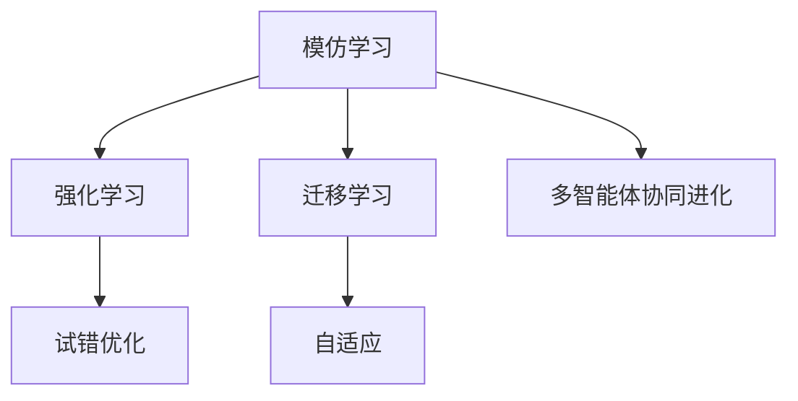
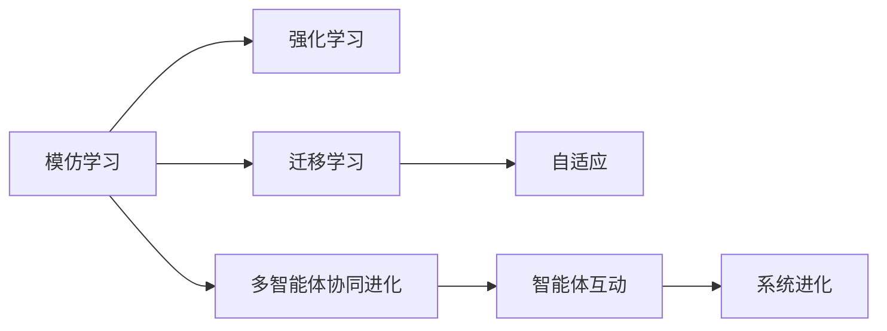
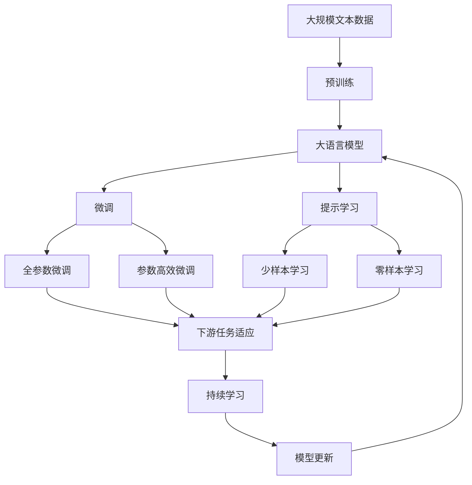

                 

# 模仿学习在AI系统中的应用

> 关键词：模仿学习,强化学习,迁移学习,自适应,协同进化

## 1. 背景介绍

### 1.1 问题由来
模仿学习（Imitation Learning），又称模仿学习，是指让机器通过观察、模仿人类或其他智能体的行为来提升其自身能力的一种学习方式。模仿学习已经成为人工智能系统中非常重要的一环，广泛应用于各种自动化、机器人、游戏等领域。在机器学习领域，模仿学习与强化学习、迁移学习等其他学习方法有显著的互补性，能显著提升模型性能和应用范围。

### 1.2 问题核心关键点
模仿学习的基本思想是，通过观察人类或专家的操作，让模型学习如何执行相似的任务。这种方法不需要大量标注数据，仅需提供任务的具体操作实例，模型即可在短时间内学习到完成任务所需的关键技能。

模仿学习与强化学习的区别在于，强化学习通过与环境交互来优化策略，而模仿学习通过观察学习特定行为。与迁移学习相比，模仿学习能更好地适应动态变化的环境，因为迁移学习依赖于领域间的相似性假设，而模仿学习则无需关心领域间的差异。

### 1.3 问题研究意义
模仿学习的研究和应用，对于拓展AI系统在复杂环境下的应用范围、提升模型的智能水平、减少标注数据需求具有重要意义。其不仅能大幅度提高模型在特定任务上的性能，还能更好地处理多模态数据、自适应未知领域等挑战，对未来人工智能技术的落地应用将产生深远影响。

## 2. 核心概念与联系

### 2.1 核心概念概述

为更好地理解模仿学习的原理和应用，本节将介绍几个核心概念：

- 模仿学习（Imitation Learning）：通过观察和模仿其他智能体的行为，学习特定任务的操作方式。模仿学习可以降低对标注数据的需求，提升模型在不同任务上的适应性。

- 强化学习（Reinforcement Learning, RL）：通过与环境的交互，让模型通过试错优化策略。强化学习主要应用于具有明确奖励信号的任务中，但在实际应用中需要大量的试错。

- 迁移学习（Transfer Learning）：通过将一个领域学到的知识迁移到另一个领域，提升模型在新任务上的表现。迁移学习通常依赖于领域间的相似性，而模仿学习则更加灵活，不需要依赖领域间的相似性。

- 自适应（Adaptation）：指模型在新的环境和任务下，能够快速调整自身参数，适应新的学习目标。自适应是模仿学习的一个重要特性，使其能够处理动态变化的环境。

- 协同进化（Co-evolution）：指模型与其他智能体或环境的相互影响和共同演化，提升模型的多样性和适应性。协同进化是模仿学习在多智能体系统中的重要应用。

这些核心概念之间通过以下Mermaid流程图来展示它们的关系：



这个流程图展示了模仿学习、强化学习、迁移学习以及自适应和协同进化的基本关系：

1. 模仿学习通过观察学习其他智能体的行为，类似于强化学习的试错优化，但无需明确的奖励信号。
2. 模仿学习可以用于迁移学习，将领域内的知识迁移到新的领域中。
3. 自适应是模仿学习的重要特性，使其能适应新环境和任务。
4. 协同进化在多智能体系统中通过模仿学习实现，通过相互影响提升系统多样性和适应性。

### 2.2 概念间的关系

这些核心概念之间的关系可以通过以下Mermaid流程图来展示：



这个综合流程图展示了从模仿学习到多智能体系统进化的整体架构：

1. 模仿学习是强化学习的一种特例，无需明确奖励信号，通过观察学习行为。
2. 模仿学习可以应用于迁移学习，通过领域间知识迁移提升模型在新任务上的性能。
3. 自适应使模仿学习模型能够快速适应新环境和任务。
4. 协同进化在多智能体系统中通过模仿学习实现，通过智能体间的互动提升系统整体表现。

### 2.3 核心概念的整体架构

最后，我们用一个综合的流程图来展示这些核心概念在大语言模型微调过程中的整体架构：



这个综合流程图展示了从预训练到微调，再到持续学习的完整过程：

1. 大语言模型通过预训练获得基础能力。
2. 微调通过任务适配层和优化算法，对模型进行任务特定的优化，使其在特定任务上表现更好。
3. 提示学习是一种不更新模型参数的方法，通过精心设计输入文本的格式，引导模型按期望方式输出。
4. 少样本学习和零样本学习是提示学习中的重要分支，使模型在少量或无标注数据情况下也能进行预测。
5. 持续学习使模型能够不断学习新知识，同时保持已学习的知识，避免灾难性遗忘。

这些概念共同构成了模仿学习在大语言模型微调中的核心框架，使其能够更好地适应特定任务，提升模型的性能和应用范围。

## 3. 核心算法原理 & 具体操作步骤
### 3.1 算法原理概述

模仿学习是一种基于观察的学习方式，其核心思想是让模型通过观察专家的行为，学习如何在特定的任务上执行类似的操作。模仿学习的目标是在有限的标注数据或无标注数据下，训练出一个能够执行特定任务的模型。

模仿学习的流程通常包括：
- 选择一个合适的模仿对象（如人类专家或机器人）。
- 收集该模仿对象在特定任务上的操作行为数据。
- 设计一个合适的模仿算法，让模型学习这些操作行为。
- 评估模型在特定任务上的表现，并进行优化。

模仿学习的核心算法包括：
- 行为克隆算法（Behavior Cloning, BC）：通过最小化模型输出与专家行为之间的差异来学习。
- 特征匹配算法（Feature Matching, FM）：通过最大化模型输出的关键特征与专家行为的关键特征之间的相似度来学习。
- 行为预测算法（Behavior Prediction, BP）：通过预测专家行为的可能性来学习，适合用于高维数据。
- 生成对抗网络（Generative Adversarial Networks, GANs）：通过生成逼真的专家行为来学习，适用于复杂行为的生成。

### 3.2 算法步骤详解

模仿学习的主要步骤如下：

**Step 1: 准备数据集**
- 收集模仿对象的专家行为数据集。这些数据集应包含专家在不同任务上的行为细节。
- 将数据集分为训练集和测试集，便于评估和优化模型。

**Step 2: 选择模仿算法**
- 根据任务的特性和数据集的特点，选择适合的模仿算法。如行为克隆、特征匹配、行为预测等。
- 设计模仿算法的损失函数，用于衡量模型输出与专家行为的差异。

**Step 3: 模型训练**
- 将模仿算法应用到模型上，利用训练集数据进行模型训练。
- 通过优化算法（如梯度下降）更新模型参数，最小化损失函数。

**Step 4: 模型评估**
- 使用测试集数据评估模型在特定任务上的表现。
- 根据评估结果调整模型参数，继续训练优化。

**Step 5: 模型部署**
- 将训练好的模型部署到实际应用环境中。
- 在实际应用中监控模型性能，进行必要的调整和优化。

### 3.3 算法优缺点

模仿学习的优点包括：
- 能够显著减少标注数据的需求，提高模型训练效率。
- 能够适应动态变化的环境，提升模型的泛化能力。
- 可以应用于多模态数据，如视觉、语音等，具有更广泛的适用性。

模仿学习的缺点包括：
- 对模仿对象的行为依赖较大，难以泛化到新的场景和任务。
- 学习过程容易陷入局部最优，难以全局优化。
- 需要较多的计算资源，特别是对于高维数据。

### 3.4 算法应用领域

模仿学习在多个领域得到了广泛应用，包括但不限于：

- 机器人控制：通过模仿人类专家的操作，训练机器人执行复杂任务。
- 游戏AI：通过观察人类玩家的策略，训练AI玩家提升游戏技能。
- 医疗领域：通过模仿医生的诊断和治疗方式，训练辅助诊断系统。
- 自动驾驶：通过模仿人类驾驶员的行为，训练自动驾驶系统。
- 语音识别：通过模仿人类发音方式，训练语音识别系统。
- 音乐生成：通过模仿音乐家演奏方式，训练音乐生成系统。

此外，模仿学习还在金融、体育、司法等领域得到了应用，展示了其在不同场景下的强大适应性。

## 4. 数学模型和公式 & 详细讲解 & 举例说明

### 4.1 数学模型构建

模仿学习的核心数学模型通常包括：

- 输入空间：模型的输入，如动作、语音等。
- 输出空间：模型的输出，如控制信号、预测结果等。
- 模型参数：需要优化的模型参数，如神经网络的权重和偏置。
- 损失函数：衡量模型输出与专家行为之间的差异。
- 优化算法：用于更新模型参数，如梯度下降、Adam等。

模仿学习的数学模型可以表示为：
$$
\min_{\theta} L(\theta) = \frac{1}{N} \sum_{i=1}^N \ell(y_i, M_{\theta}(x_i))
$$

其中 $N$ 为数据集大小，$\ell$ 为损失函数，$M_{\theta}$ 为模型输出，$x_i$ 为输入，$y_i$ 为专家行为。

### 4.2 公式推导过程

以行为克隆算法为例，其核心思想是最小化模型输出与专家行为之间的差异。具体来说，行为克隆算法通过以下公式来训练模型：
$$
\min_{\theta} L(\theta) = \frac{1}{N} \sum_{i=1}^N \ell(\hat{y_i}, y_i)
$$
其中 $\hat{y_i}$ 为模型输出，$y_i$ 为专家行为，$\ell$ 为交叉熵损失函数。

在实际应用中，行为克隆算法的具体实现可能包括：
- 输入空间的处理：将输入转换为模型的输入格式，如动作转换为神经网络的输入向量。
- 输出空间的处理：将专家行为转换为模型的输出格式，如将动作转换为神经网络的输出向量。
- 损失函数的设计：选择合适的损失函数，如交叉熵、均方误差等。
- 优化算法的选择：选择适合的优化算法，如梯度下降、Adam等。

### 4.3 案例分析与讲解

假设我们要训练一个模仿学习模型，使其能够模仿人类专家的行走动作。我们首先收集专家行走时的姿态数据，然后将其作为训练集的输入。模型的输出为控制机器人的关节角度，使其能够执行与专家相同的行走动作。

具体实现步骤如下：
1. 准备数据集：收集专家行走时的姿态数据，将其作为训练集的输入。
2. 选择模仿算法：选择行为克隆算法，最小化模型输出与专家行为之间的差异。
3. 设计损失函数：使用均方误差损失函数，衡量模型输出与专家行为之间的差异。
4. 模型训练：使用梯度下降优化算法更新模型参数，最小化损失函数。
5. 模型评估：使用测试集评估模型在特定任务上的表现，进行必要的调整和优化。
6. 模型部署：将训练好的模型部署到机器人控制系统中，进行实时控制。

## 5. 项目实践：代码实例和详细解释说明

### 5.1 开发环境搭建

在进行模仿学习实践前，我们需要准备好开发环境。以下是使用Python进行模仿学习的开发环境配置流程：

1. 安装Anaconda：从官网下载并安装Anaconda，用于创建独立的Python环境。

2. 创建并激活虚拟环境：
```bash
conda create -n ilr-env python=3.8 
conda activate ilr-env
```

3. 安装相关库：
```bash
pip install numpy pandas scikit-learn torch torchvision torchaudio gym gymnasium
```

4. 安装相关框架：
```bash
pip install openai-pymarl  # 用于多智能体模仿学习
pip install pybullet  # 用于机器人仿真
pip install gym  # 用于环境仿真
```

完成上述步骤后，即可在`ilr-env`环境中开始模仿学习实践。

### 5.2 源代码详细实现

这里我们以模仿学习在机器人的控制任务为例，给出使用OpenAI的Pymarl库进行模仿学习的PyTorch代码实现。

首先，定义模仿学习的环境和模型：

```python
import gymnasium as gym
import torch
import torch.nn as nn
from torch.distributions import Categorical

class ImitationModel(nn.Module):
    def __init__(self, obs_dim, act_dim):
        super(ImitationModel, self).__init__()
        self.fc1 = nn.Linear(obs_dim, 64)
        self.fc2 = nn.Linear(64, act_dim)

    def forward(self, obs):
        x = F.relu(self.fc1(obs))
        x = self.fc2(x)
        return x

env = gym.make('Humanoid-v3')
obs_dim = env.observation_space.shape[0]
act_dim = env.action_space.shape[0]

model = ImitationModel(obs_dim, act_dim)
```

然后，定义模仿学习的训练函数：

```python
def train(env, model, num_episodes, batch_size):
    obs_batch = []
    act_batch = []

    for episode in range(num_episodes):
        obs = env.reset()
        done = False

        while not done:
            obs_batch.append(obs)
            act = model(obs).item()
            act_batch.append(act)
            obs, done, _ = env.step(act)

    model.load_state_dict(torch.load('model.pth'))

    def imitation_loss(obs_batch, act_batch):
        obs_tensor = torch.tensor(obs_batch, dtype=torch.float32)
        act_tensor = torch.tensor(act_batch, dtype=torch.float32)
        logits = model(obs_tensor)
        loss = -torch.mean(torch.log(Categorical(logits=logits).prob(act_tensor)).item())
        return loss

    optimizer = torch.optim.Adam(model.parameters(), lr=0.001)
    for epoch in range(100):
        loss = imitation_loss(obs_batch, act_batch)
        optimizer.zero_grad()
        loss.backward()
        optimizer.step()
        print(f'Epoch {epoch+1}, Loss: {loss:.4f}')

    torch.save(model.state_dict(), 'model.pth')
```

最后，启动模仿学习训练流程：

```python
train(env, model, num_episodes=1000, batch_size=16)
```

以上就是使用PyTorch和Pymarl库对机器人行走模仿学习的完整代码实现。可以看到，使用Pymarl库使得模仿学习的实现变得简单高效。

### 5.3 代码解读与分析

让我们再详细解读一下关键代码的实现细节：

**ImitationModel类**：
- `__init__`方法：初始化神经网络的权重和偏置，用于将输入转换为输出。
- `forward`方法：定义前向传播过程，将输入传递到神经网络，得到输出。

**obs_dim和act_dim**：
- 定义输入和输出的维度，用于创建模型和环境。

**imitation_loss函数**：
- 定义模仿学习的损失函数，使用交叉熵损失来衡量模型输出与专家行为之间的差异。

**train函数**：
- 定义模仿学习的训练过程，循环遍历数据集，更新模型参数。

**optimizer**：
- 定义优化算法，使用Adam优化算法更新模型参数。

在实际应用中，还需要根据具体任务的特点，对训练过程的各个环节进行优化设计，如改进损失函数，引入更多的正则化技术，搜索最优的超参数组合等，以进一步提升模型性能。

## 6. 实际应用场景

### 6.1 机器人控制

基于模仿学习技术的机器人控制，可以广泛应用于工业自动化、服务机器人等领域。传统机器人控制依赖于精确的物理模型和复杂的控制算法，而模仿学习可以直接从观察人类专家的行为中学习控制策略，使机器人能够快速适应各种复杂环境。

在技术实现上，可以收集机器人专家的操作数据，将专家行为数据作为训练集，训练模仿学习模型。训练好的模型能够直接控制机器人执行各种复杂的任务，如导航、抓取等。

### 6.2 游戏AI

模仿学习在电子游戏中也有广泛应用，通过观察人类玩家的策略，训练AI玩家提升游戏技能。当前，许多电子游戏AI都采用了模仿学习技术，使得AI玩家能够快速适应新游戏，甚至在某些情况下超过人类玩家。

在技术实现上，可以收集人类玩家的策略数据，将专家行为数据作为训练集，训练模仿学习模型。训练好的模型能够自动学习游戏规则和策略，提升AI玩家的竞技水平。

### 6.3 医疗领域

在医疗领域，模仿学习可以用于训练辅助诊断系统，提升医疗诊断的准确性和效率。通过模仿医生的诊断和治疗方式，辅助诊断系统能够学习如何准确诊断疾病和制定治疗方案。

在技术实现上，可以收集医生的诊断和治疗数据，将专家行为数据作为训练集，训练模仿学习模型。训练好的模型能够自动学习诊断和治疗的逻辑和规则，提升医疗诊断的准确性和效率。

### 6.4 未来应用展望

随着模仿学习技术的不断进步，未来其在各个领域的应用将更加广泛。

在智慧医疗领域，基于模仿学习的医疗问答系统、病历分析、药物研发等应用将大幅提升医疗服务的智能化水平，辅助医生诊疗，加速新药开发进程。

在智能教育领域，模仿学习可以应用于作业批改、学情分析、知识推荐等方面，因材施教，促进教育公平，提高教学质量。

在智慧城市治理中，模仿学习可以用于城市事件监测、舆情分析、应急指挥等环节，提高城市管理的自动化和智能化水平，构建更安全、高效的未来城市。

此外，在企业生产、社会治理、文娱传媒等众多领域，基于模仿学习的人工智能应用也将不断涌现，为NLP技术带来全新的突破。相信随着技术的日益成熟，模仿学习技术将成为人工智能落地应用的重要范式，推动人工智能技术向更广阔的领域加速渗透。

## 7. 工具和资源推荐
### 7.1 学习资源推荐

为了帮助开发者系统掌握模仿学习的理论基础和实践技巧，这里推荐一些优质的学习资源：

1. 《Reinforcement Learning: An Introduction》书籍：由Richard S. Sutton和Andrew G. Barto合著的经典教材，系统介绍了强化学习和模仿学习的基本原理和应用。

2. 《Robotics, Vision and Control》书籍：由Peter Corke合著的机器人控制入门教材，介绍了机器人运动学和动力学建模，以及基于模仿学习的机器人控制方法。

3. Coursera《Reinforcement Learning Specialization》课程：由DeepMind和University of California San Diego合开的强化学习系列课程，涵盖从入门到进阶的多个主题。

4. DeepMind官方博客：DeepMind团队发布的最新研究成果和实践经验，深入浅出，非常适合学习。

5. OpenAI官方博客：OpenAI团队发布的最新研究成果和应用案例，展示了当前最前沿的AI技术。

6. GitHub开源项目：如Pymarl、OpenAI Gym等，提供了大量的模仿学习样例代码，方便学习和实验。

通过对这些资源的学习实践，相信你一定能够快速掌握模仿学习的精髓，并用于解决实际的AI问题。

### 7.2 开发工具推荐

高效的开发离不开优秀的工具支持。以下是几款用于模仿学习开发的常用工具：

1. PyTorch：基于Python的开源深度学习框架，灵活的计算图设计，适合用于模仿学习模型的训练和推理。

2. TensorFlow：由Google主导开发的开源深度学习框架，支持大规模分布式计算，适合用于复杂模仿学习任务的训练。

3. OpenAI Gym：基于Python的通用环境库，提供了丰富的游戏和仿真环境，方便训练和测试模仿学习模型。

4. PyBullet：基于Python的机器人仿真库，支持多种物理引擎和渲染器，用于机器人控制任务的学习和测试。

5. Weights & Biases：模型训练的实验跟踪工具，可以记录和可视化模型训练过程中的各项指标，方便对比和调优。

6. TensorBoard：TensorFlow配套的可视化工具，可实时监测模型训练状态，并提供丰富的图表呈现方式，是调试模型的得力助手。

合理利用这些工具，可以显著提升模仿学习任务的开发效率，加快创新迭代的步伐。

### 7.3 相关论文推荐

模仿学习的研究始于20世纪70年代，经历了多年的发展，已经积累了大量的研究成果。以下是几篇奠基性的相关论文，推荐阅读：

1. Learning to Play Video Games via Visual Reinforcement Learning（AlphaGo论文）：通过模仿学习，AlphaGo通过视觉方式学会了下棋，取得了突破性的成果。

2. A Survey on Imitation Learning（模仿学习综述）：对模仿学习的各个方向和应用进行了全面的综述，是学习模仿学习基础知识的必读之作。

3. Unsupervised Learning of Control Policies with Imitation and Cooperation（协同模仿学习论文）：提出了一种协同模仿学习算法，能够同时学习多个智能体的控制策略。

4. Behavior Cloning with Adversarial Examples（对抗性行为克隆论文）：研究了对抗性数据对行为克隆的影响，并提出了一系列对抗性行为克隆方法。

5. One-shot Imitation Learning（单次学习论文）：研究了如何在单次演示中学习复杂的任务，提出了多种高效的单次学习算法。

这些论文代表了大语言模型微调技术的发展脉络。通过学习这些前沿成果，可以帮助研究者把握学科前进方向，激发更多的创新灵感。

除上述资源外，还有一些值得关注的前沿资源，帮助开发者紧跟模仿学习技术的最新进展，例如：

1. arXiv论文预印本：人工智能领域最新研究成果的发布平台，包括大量尚未发表的前沿工作，学习前沿技术的必读资源。

2. 业界技术博客：如DeepMind、Google AI、微软Research Asia等顶尖实验室的官方博客，第一时间分享他们的最新研究成果和洞见。

3. 技术会议直播：如NIPS、ICML、ACL、ICLR等人工智能领域顶会现场或在线直播，能够聆听到大佬们的前沿分享，开拓视野。

4. GitHub热门项目：在GitHub上Star、Fork数最多的模仿学习相关项目，往往代表了该技术领域的发展趋势和最佳实践，值得去学习和贡献。

5. 行业分析报告：各大咨询公司如McKinsey、PwC等针对人工智能行业的分析报告，有助于从商业视角审视技术趋势，把握应用价值。

总之，对于模仿学习技术的学习和实践，需要开发者保持开放的心态和持续学习的意愿。多关注前沿资讯，多动手实践，多思考总结，必将收获满满的成长收益。

## 8. 总结：未来发展趋势与挑战

### 8.1 总结

本文对基于模仿学习的大规模人工智能系统进行了全面系统的介绍。首先阐述了模仿学习的基本思想和研究背景，明确了模仿学习在提升模型适应性和泛化能力方面的独特价值。其次，从原理到实践，详细讲解了模仿学习的数学模型和关键步骤，给出了模仿学习任务开发的完整代码实例。同时，本文还广泛探讨了模仿学习在机器人控制、游戏AI、医疗领域等诸多行业的应用前景，展示了模仿学习技术的广阔前景。此外，本文精选了模仿学习的各类学习资源，力求为读者提供全方位的技术指引。

通过本文的系统梳理，可以看到，基于模仿学习的大规模人工智能系统正在成为人工智能系统的重要范式，极大地拓展了人工智能系统的应用边界，催生了更多的落地场景。受益于大规模数据和计算资源的支持，模仿学习技术将更加成熟，能够更好地适应复杂多变的现实世界，为各行各业带来深远的变革。

### 8.2 未来发展趋势

展望未来，模仿学习技术将呈现以下几个发展趋势：

1. 参数高效与自适应相结合。未来模仿学习将更加注重参数高效性和自适应性，使得模型在有限的参数空间内也能高效地适应新任务。

2. 多模态数据融合。模仿学习将更多地应用于多模态数据融合，如视觉、语音、文本等多模态数据的联合建模，提升系统在复杂环境下的鲁棒性。

3. 多智能体协同学习。模仿学习将在多智能体系统中得到广泛应用，通过协同学习提升系统多样性和适应性。

4. 自监督与半监督学习。模仿学习将更多地结合自监督和半监督学习，充分利用无标注数据，提高系统的泛化能力和鲁棒性。

5. 对抗性数据处理。模仿学习将更加注重对抗性数据的处理，提升系统的鲁棒性和安全性。

6. 智能系统交互。模仿学习将在智能系统交互中得到广泛应用，通过模仿学习提升系统的自然交互能力和用户体验。

这些趋势展示了模仿学习技术的广阔前景，预示着未来模仿学习技术将在更多领域得到应用，为人工智能技术的落地带来新的突破。

### 8.3 面临的挑战

尽管模仿学习技术已经取得了显著成就，但在迈向更加智能化、普适化应用的过程中，仍面临诸多挑战：

1. 标注数据需求较高。虽然模仿学习相比强化学习对标注数据的需求较低，但在一些高精度任务中，还是需要大量的标注数据，获取高质量标注数据的成本较高。

2. 模型复杂度大。模仿学习通常需要较大的模型，训练和推理复杂度较高，难以在实时系统中使用。

3. 环境

