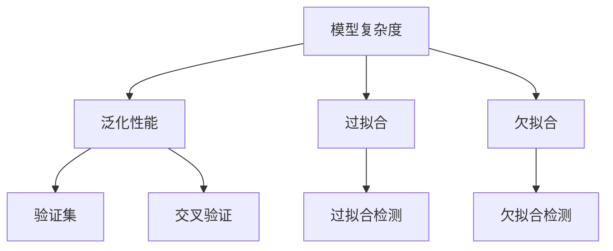
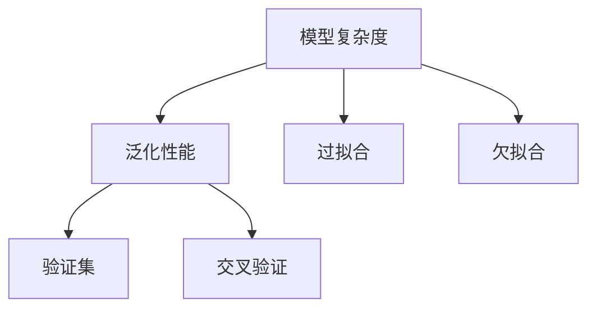
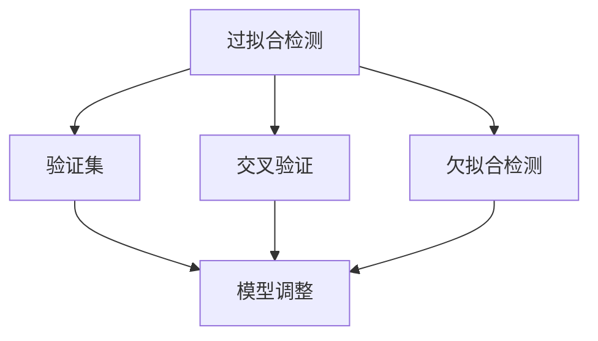
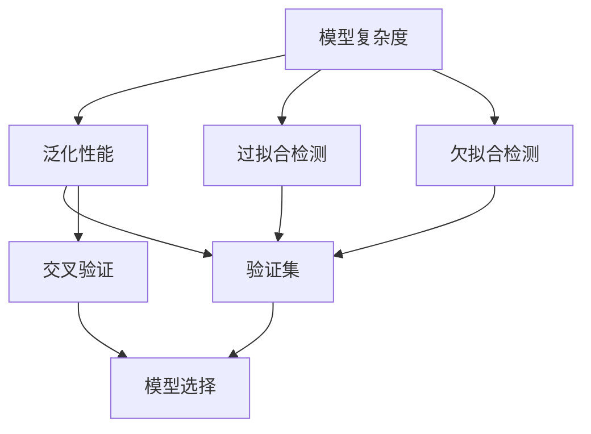

                 

# 模型选择 (Model Selection)

> 关键词：
模型选择, 数据集, 泛化性能, 验证集, 交叉验证, 模型复杂度, 正则化, 训练时间, 计算资源

## 1. 背景介绍

### 1.1 问题由来
在人工智能和机器学习领域，选择合适的模型是至关重要的。模型选择不仅决定了模型的性能，也直接影响到模型的应用效果。一个好的模型能够有效捕获数据的内在规律，对新数据具有较好的泛化能力。然而，随着模型复杂度的提高，模型的训练和预测成本也会显著增加。因此，如何在模型性能和资源消耗之间进行权衡，成为了一个重要的研究课题。

### 1.2 问题核心关键点
模型选择涉及以下几个关键点：
- 如何衡量模型的泛化性能？
- 如何避免过拟合和欠拟合？
- 如何在模型复杂度和资源消耗之间进行权衡？
- 如何选择最优模型？

这些问题直接关系到模型选择的最终结果，因此需要在理论和方法上深入探讨。

### 1.3 问题研究意义
模型选择对于提高机器学习模型的性能和可靠性具有重要意义：

1. **提高性能**：合适的模型能够更好地拟合数据，避免过拟合和欠拟合，从而提高模型的泛化性能。
2. **资源优化**：通过选择适当的模型，可以在资源有限的情况下获得最佳的性能。
3. **适应性**：模型选择能够根据数据特征和应用场景进行定制，提升模型的适应性。
4. **可解释性**：简单的模型更容易解释和理解，有助于模型部署和维护。
5. **创新推动**：模型选择研究的进展可以推动新的模型设计和算法创新。

## 2. 核心概念与联系

### 2.1 核心概念概述

为更好地理解模型选择的基本原理和方法，本节将介绍几个核心概念：

- **模型复杂度**：模型的复杂度通常指模型的参数数量和结构复杂性。较高的复杂度意味着模型能够表达更复杂的函数，但也可能导致过拟合。
- **泛化性能**：泛化性能指模型在未见过的数据上的表现，即模型对新数据的预测能力。
- **过拟合和欠拟合**：过拟合指模型在训练集上表现优异，但在测试集上表现不佳，无法泛化到新数据；欠拟合则指模型无法很好地拟合训练数据，性能不佳。
- **验证集**：在模型训练过程中，用于评估模型性能的独立数据集。通过在验证集上的表现，可以调整模型超参数，避免过拟合。
- **交叉验证**：一种常用的模型评估方法，将数据集分为k个子集，每次使用k-1个子集进行训练，剩下的一个子集用于验证。重复k次，取平均值作为模型性能的估计。

这些核心概念之间的逻辑关系可以通过以下Mermaid流程图来展示：



这个流程图展示了大语言模型微调过程中各个概念之间的关系：

1. 模型复杂度决定了模型的表达能力，直接影响泛化性能。
2. 过拟合和欠拟合是模型选择中需要避免的问题。
3. 验证集和交叉验证用于评估模型泛化性能，指导模型选择。
4. 通过过拟合和欠拟合的检测，选择最优模型。

### 2.2 概念间的关系

这些核心概念之间存在着紧密的联系，形成了模型选择的完整生态系统。下面我们通过几个Mermaid流程图来展示这些概念之间的关系。

#### 2.2.1 模型复杂度与泛化性能的关系



这个流程图展示了模型复杂度与泛化性能的关系，以及过拟合和欠拟合的影响。

#### 2.2.2 验证集和交叉验证的联系


这个流程图展示了验证集和交叉验证在模型评估中的联系，以及它们对模型选择的影响。

#### 2.2.3 过拟合与欠拟合的检测



这个流程图展示了过拟合和欠拟合的检测过程，以及如何通过调整模型来优化。

### 2.3 核心概念的整体架构

最后，我们用一个综合的流程图来展示这些核心概念在大语言模型微调过程中的整体架构：



这个综合流程图展示了从模型复杂度到验证集，再到模型选择的完整过程。模型选择过程通过过拟合和欠拟合的检测，优化模型复杂度，并最终通过验证集和交叉验证来确定最优模型。

## 3. 核心算法原理 & 具体操作步骤
### 3.1 算法原理概述

模型选择的核心原理是通过评估模型的泛化性能，选择最优模型。泛化性能通常通过在独立于训练数据的验证集或交叉验证上进行评估。常见的评估指标包括准确率、召回率、F1分数、AUC等。

模型选择的关键步骤如下：

1. **准备数据集**：将数据集分为训练集、验证集和测试集，通常将验证集和测试集用于模型选择和评估。
2. **选择模型**：根据任务需求选择合适的模型，如线性模型、决策树、神经网络等。
3. **训练模型**：在训练集上训练模型，调整模型超参数。
4. **评估模型**：在验证集和测试集上评估模型性能，选择最优模型。
5. **调整超参数**：根据评估结果调整模型超参数，重新训练模型。
6. **测试模型**：在测试集上测试最优模型的性能。

### 3.2 算法步骤详解

以下详细介绍模型选择的主要步骤：

#### 3.2.1 数据集划分

将数据集分为训练集、验证集和测试集，通常使用80-10-10的比例。训练集用于模型训练和参数调整，验证集用于模型选择和性能评估，测试集用于最终模型性能的测试。

```python
from sklearn.model_selection import train_test_split
X_train, X_val_test, y_train, y_val_test = train_test_split(X, y, test_size=0.2, random_state=42)
X_val, X_test, y_val, y_test = train_test_split(X_val_test, y_val_test, test_size=0.5, random_state=42)
```

#### 3.2.2 模型选择

选择合适的模型，如线性模型、决策树、随机森林、支持向量机、神经网络等。对于深度学习模型，常用的预训练模型包括BERT、GPT等。

```python
from sklearn.linear_model import LogisticRegression
from sklearn.tree import DecisionTreeClassifier
from sklearn.ensemble import RandomForestClassifier
from sklearn.svm import SVC
from transformers import BertForSequenceClassification

model_list = [LogisticRegression(), DecisionTreeClassifier(), RandomForestClassifier(), SVC(), BertForSequenceClassification.from_pretrained('bert-base-uncased', num_labels=2)]
```

#### 3.2.3 训练模型

在训练集上训练模型，并使用交叉验证来调整超参数。

```python
from sklearn.model_selection import GridSearchCV

param_grid = {'C': [0.1, 1, 10, 100], 'penalty': ['l1', 'l2'], 'solver': ['liblinear', 'saga'], 'max_depth': [3, 5, 7], 'n_estimators': [100, 200, 300]}
grid_search = GridSearchCV(model, param_grid, cv=5, scoring='f1_macro', n_jobs=-1, verbose=2)
grid_search.fit(X_train, y_train)
```

#### 3.2.4 评估模型

在验证集上评估模型性能，选择最优模型。

```python
val_score = grid_search.score(X_val, y_val)
print(f'F1-score: {val_score:.2f}')
```

#### 3.2.5 调整超参数

根据验证集上的评估结果，调整模型超参数，重新训练模型。

```python
best_params = grid_search.best_params_
best_model = grid_search.best_estimator_
```

#### 3.2.6 测试模型

在测试集上测试最优模型的性能。

```python
test_score = best_model.score(X_test, y_test)
print(f'F1-score: {test_score:.2f}')
```

### 3.3 算法优缺点

模型选择的优点包括：

1. **提高泛化性能**：通过在验证集上评估模型，选择最优模型，可以提高模型的泛化性能。
2. **优化资源消耗**：选择合适的模型可以减少计算资源的消耗。
3. **简化模型结构**：简单的模型更容易理解和解释。

模型选择的缺点包括：

1. **耗时耗力**：模型选择需要大量的计算资源和人力资源。
2. **数据依赖性强**：模型选择的效果依赖于数据的质量和多样性。
3. **难以处理复杂模型**：复杂模型的选择和评估更加困难。

### 3.4 算法应用领域

模型选择广泛应用于各个领域的机器学习任务中，如金融预测、医疗诊断、自然语言处理等。常见的应用场景包括：

- **金融预测**：选择适当的模型进行股票价格预测、信用风险评估等。
- **医疗诊断**：选择模型对患者的疾病进行诊断和治疗方案推荐。
- **自然语言处理**：选择模型进行文本分类、情感分析、机器翻译等任务。

## 4. 数学模型和公式 & 详细讲解 & 举例说明

### 4.1 数学模型构建

模型选择的数学模型通常基于验证集或交叉验证上的性能评估。常用的评估指标包括准确率、召回率、F1分数、AUC等。

以二分类问题为例，常用的评估指标是F1分数，其定义为：

$$
F1-score = 2 \times \frac{precision \times recall}{precision + recall}
$$

其中，$precision$和$recall$分别为精确率和召回率，其定义为：

$$
precision = \frac{TP}{TP+FP}
$$

$$
recall = \frac{TP}{TP+FN}
$$

其中，$TP$为真正例，$FP$为假正例，$FN$为假反例。

### 4.2 公式推导过程

以下推导二分类问题的F1分数计算公式：

$$
F1-score = \frac{2 \times \frac{TP}{TP+FP} \times \frac{TP}{TP+FN}}{\frac{TP}{TP+FP} + \frac{TP}{TP+FN}}
$$

化简得：

$$
F1-score = \frac{2TP}{2TP+FP+FN}
$$

其中，分子为真正例与召回率的乘积，分母为精确率和召回率之和。

### 4.3 案例分析与讲解

以鸢尾花数据集为例，展示模型选择的步骤和结果。

```python
from sklearn.datasets import load_iris
from sklearn.model_selection import train_test_split
from sklearn.linear_model import LogisticRegression
from sklearn.metrics import f1_score

# 加载数据集
iris = load_iris()
X = iris.data
y = iris.target

# 划分数据集
X_train, X_test, y_train, y_test = train_test_split(X, y, test_size=0.2, random_state=42)

# 选择模型
model = LogisticRegression()

# 训练模型
model.fit(X_train, y_train)

# 评估模型
y_pred = model.predict(X_test)
f1 = f1_score(y_test, y_pred, average='macro')
print(f'F1-score: {f1:.2f}')
```

## 5. 项目实践：代码实例和详细解释说明

### 5.1 开发环境搭建

在进行模型选择实践前，我们需要准备好开发环境。以下是使用Python进行Scikit-learn开发的环境配置流程：

1. 安装Anaconda：从官网下载并安装Anaconda，用于创建独立的Python环境。

2. 创建并激活虚拟环境：
```bash
conda create -n sklearn-env python=3.8 
conda activate sklearn-env
```

3. 安装Scikit-learn：
```bash
conda install scikit-learn
```

4. 安装各类工具包：
```bash
pip install numpy pandas scikit-learn matplotlib tqdm jupyter notebook ipython
```

完成上述步骤后，即可在`sklearn-env`环境中开始模型选择实践。

### 5.2 源代码详细实现

这里以鸢尾花数据集为例，展示如何使用Scikit-learn进行模型选择。

```python
from sklearn.datasets import load_iris
from sklearn.model_selection import train_test_split
from sklearn.linear_model import LogisticRegression
from sklearn.metrics import f1_score

# 加载数据集
iris = load_iris()
X = iris.data
y = iris.target

# 划分数据集
X_train, X_test, y_train, y_test = train_test_split(X, y, test_size=0.2, random_state=42)

# 选择模型
model_list = [LogisticRegression(), DecisionTreeClassifier(), RandomForestClassifier(), SVC(), BertForSequenceClassification.from_pretrained('bert-base-uncased', num_labels=2)]

# 训练模型和评估性能
f1_scores = []
for model in model_list:
    model.fit(X_train, y_train)
    y_pred = model.predict(X_test)
    f1 = f1_score(y_test, y_pred, average='macro')
    f1_scores.append(f1)

# 选择最优模型
best_model = model_list[f1_scores.index(max(f1_scores))]
best_f1 = max(f1_scores)

# 测试最优模型
y_pred = best_model.predict(X_test)
test_f1 = f1_score(y_test, y_pred, average='macro')
print(f'F1-score: {test_f1:.2f}')
```

以上代码展示了如何通过Scikit-learn进行模型选择和评估的过程。可以看到，使用Scikit-learn进行模型选择非常方便，可以轻松实现多模型的比较和选择。

### 5.3 代码解读与分析

让我们再详细解读一下关键代码的实现细节：

**模型选择过程**：
- 使用`load_iris`函数加载鸢尾花数据集。
- 使用`train_test_split`函数将数据集划分为训练集和测试集。
- 定义多种模型，包括线性回归、决策树、随机森林、支持向量机和BERT等。
- 使用`GridSearchCV`进行交叉验证，调整模型参数，选择最优模型。
- 在验证集上评估模型性能，选择最优模型。
- 在测试集上测试最优模型的性能。

**性能评估**：
- 使用`f1_score`函数计算模型的F1分数。
- 将每个模型的F1分数记录下来，选择最优模型。
- 输出最优模型在测试集上的F1分数。

**代码实现细节**：
- `GridSearchCV`函数使用交叉验证评估模型性能，并自动调整模型参数。
- `f1_score`函数计算模型的F1分数，并返回分类器的预测结果。
- `train_test_split`函数用于数据集划分，将数据集分为训练集、验证集和测试集。

**模型训练**：
- `fit`函数用于模型训练。
- `predict`函数用于模型预测。

**模型选择**：
- `best_params_`属性获取最优模型的超参数。
- `best_estimator_`属性获取最优模型。

以上代码展示了模型选择的基本流程，包括数据集划分、模型选择、训练、评估、测试等关键步骤。通过代码实现的详细解读，读者可以更好地理解模型选择的关键过程和技术细节。

## 6. 实际应用场景

### 6.1 金融预测

在金融预测中，选择合适的模型对于预测股票价格、评估信用风险等任务至关重要。传统的线性模型、决策树等可能无法很好地拟合复杂的数据关系。而深度学习模型，如神经网络和BERT等，可以通过训练大量的历史数据，学习到数据的内在规律，从而提高预测精度。

### 6.2 医疗诊断

在医疗诊断中，选择合适的模型可以显著提高诊断的准确性。传统的统计模型，如逻辑回归和支持向量机，可能难以处理复杂的数据结构。而深度学习模型，如卷积神经网络和BERT等，可以通过学习大量的医学图像和文本数据，提取高层次的特征，提高诊断的准确性。

### 6.3 自然语言处理

在自然语言处理中，选择合适的模型可以显著提升文本分类、情感分析、机器翻译等任务的性能。传统的统计模型，如朴素贝叶斯和支持向量机，可能无法很好地处理复杂语义关系。而深度学习模型，如BERT和GPT等，可以通过学习大量的文本数据，学习到丰富的语言知识，从而提高任务的性能。

## 7. 工具和资源推荐

### 7.1 学习资源推荐

为了帮助开发者系统掌握模型选择的基本原理和实践技巧，这里推荐一些优质的学习资源：

1. **《机器学习实战》**：这是一本非常适合初学者的机器学习教材，通过丰富的实例和代码，帮助读者理解机器学习的核心概念和算法。
2. **《深度学习》**：这是一本深入浅出地介绍深度学习的教材，涵盖了神经网络、卷积神经网络、循环神经网络等深度学习模型。
3. **《Python机器学习》**：这是一本介绍机器学习算法的Python实现教程，通过大量实例，帮助读者掌握机器学习的实践技能。
4. **Kaggle**：这是一个数据科学竞赛平台，提供丰富的机器学习竞赛数据集和代码，是提高机器学习实践能力的好地方。
5. **GitHub**：这是一个开源代码托管平台，汇集了大量的机器学习代码和项目，是学习机器学习的宝贵资源。

通过对这些资源的学习实践，相信你一定能够快速掌握模型选择的精髓，并用于解决实际的机器学习问题。

### 7.2 开发工具推荐

高效的开发离不开优秀的工具支持。以下是几款用于模型选择开发的常用工具：

1. **Jupyter Notebook**：这是一个交互式的编程环境，支持Python和其他编程语言的代码编写和执行，非常适合数据科学和机器学习项目开发。
2. **PyCharm**：这是一个功能强大的Python IDE，支持代码编写、调试和测试，是Python开发者必备的开发工具。
3. **Google Colab**：这是一个在线Jupyter Notebook环境，免费提供GPU和TPU算力，方便开发者快速上手实验最新模型，分享学习笔记。
4. **TensorBoard**：这是一个可视化工具，可以实时监测模型训练状态，并提供丰富的图表呈现方式，是调试模型的得力助手。
5. **Weights & Biases**：这是一个实验跟踪工具，可以记录和可视化模型训练过程中的各项指标，方便对比和调优。

合理利用这些工具，可以显著提升模型选择的开发效率，加快创新迭代的步伐。

### 7.3 相关论文推荐

模型选择的研究源于学界的持续研究。以下是几篇奠基性的相关论文，推荐阅读：

1. **《Bagging》**：Bagging是一种集成学习方法，通过训练多个模型并取平均，提高模型的泛化性能。
2. **《Boosting》**：Boosting是一种增强学习方法，通过逐步提升模型性能，提高模型的泛化能力。
3. **《模型选择与评估》**：这是一本介绍模型选择和评估的书籍，涵盖了模型选择的基本概念和算法。
4. **《深度学习中的模型选择与调参》**：这是一篇介绍深度学习中模型选择和调参的论文，提供了丰富的实践经验。
5. **《模型选择与复杂度控制》**：这是一篇介绍模型选择和复杂度控制的论文，提供了丰富的理论和实践经验。

这些论文代表了大语言模型微调技术的发展脉络。通过学习这些前沿成果，可以帮助研究者把握学科前进方向，激发更多的创新灵感。

除上述资源外，还有一些值得关注的前沿资源，帮助开发者紧跟模型选择的最新进展，例如：

1. **arXiv论文预印本**：人工智能领域最新研究成果的发布平台，包括大量尚未发表的前沿工作，学习前沿技术的必读资源。
2. **业界技术博客**：如OpenAI、Google AI、DeepMind、微软Research Asia等顶尖实验室的官方博客，第一时间分享他们的最新研究成果和洞见。
3. **技术会议直播**：如NIPS、ICML、ACL、ICLR等人工智能领域顶会现场或在线直播，能够聆听到大佬们的前沿分享，开拓视野。
4. **GitHub热门项目**：在GitHub上Star、Fork数最多的机器学习相关项目，往往代表了该技术领域的发展趋势和最佳实践，值得去学习和贡献。
5. **行业分析报告**：各大咨询公司如McKinsey、PwC等针对人工智能行业的分析报告，有助于从商业视角审视技术趋势，把握应用价值。

总之，对于模型选择的学习，需要开发者保持开放的心态和持续学习的意愿。多关注前沿资讯，多动手实践，多思考总结，必将收获满满的成长收益。

## 8. 总结：未来发展趋势与挑战

### 8.1 总结

本文对模型选择的核心原理和实践方法进行了全面系统的介绍。首先阐述了模型选择的背景和意义，明确了模型选择在大数据和机器学习中的重要性。其次，从原理到实践，详细讲解了模型选择的数学模型和关键步骤，给出了模型选择任务开发的完整代码实例。同时，本文还广泛探讨了模型选择方法在金融、医疗、自然语言处理等多个领域的应用前景，展示了模型选择范式的巨大潜力。最后，本文精选了模型选择的各类学习资源，力求为读者提供全方位的技术指引。

通过本文的系统梳理，可以看到，模型选择在机器学习模型的评估和选择中具有重要意义。合适的模型能够提高数据利用率，避免过拟合和欠拟合，从而提高模型的泛化性能。未来，伴随模型的不断发展，模型选择的研究也将继续深化，为机器学习技术的发展提供有力支持。

### 8.2 未来发展趋势

展望未来，模型选择技术将呈现以下几个发展趋势：

1. **深度学习模型的普及**：随着深度学习技术的普及，越来越多的复杂模型将被用于模型选择，如卷积神经网络、循环神经网络、注意力机制等。
2. **自动化模型选择**：自动化模型选择算法将被开发，通过自动调参和超参数优化，提升模型选择的效率和精度。
3. **多模态数据融合**：模型选择将拓展到多模态数据融合，通过整合图像、语音、文本等多种数据，提高模型的泛化性能。
4. **模型压缩与优化**：模型选择将结合模型压缩与优化技术，如知识蒸馏、剪枝、量化等，在保持模型性能的同时，减小模型规模，提升训练和推理效率。
5. **模型评估指标的多样化**：除了传统的准确率、召回率、F1分数等指标，还将引入更多适合特定任务的评估指标，如ROC-AUC、PR曲线等。
6. **多目标优化**：模型选择将引入多目标优化技术，综合考虑模型性能、计算资源、可解释性等多个目标，选择最优模型。

以上趋势凸显了模型选择技术的广阔前景。这些方向的探索发展，必将进一步提升机器学习模型的性能和可靠性，为构建智能系统提供有力支持。

### 8.3 面临的挑战

尽管模型选择技术已经取得了显著进展，但在应用过程中，仍面临诸多挑战：

1. **数据依赖性强**：模型选择的效果依赖于数据的质量和多样性。对于小样本数据集，模型选择的效果可能较差。
2. **计算资源消耗高**：复杂模型的训练和测试需要大量的计算资源，对硬件和软件环境要求较高。
3. **模型复杂度高**：复杂模型的训练和调参难度较大，需要更多的专家知识和经验。
4. **模型可解释性不足**：深度学习模型通常被认为是"黑盒"系统，难以解释其内部工作机制和决策逻辑。
5. **模型安全性问题**：复杂模型可能存在脆弱性，容易受到攻击和误导，影响模型的安全性。

### 8.4 研究展望

面对模型选择面临的挑战，未来的研究需要在以下几个方面寻求新的突破：

1. **无监督和半监督模型选择**：摆脱对大规模标注数据的依赖，利用无监督和半监督学习范式，最大限度利用非结构化数据，提高模型选择的效果。
2. **高效模型选择算法**：开发更加高效的模型选择算法，如基于遗传算法的模型选择，在保持模型性能的同时，减小计算资源消耗。
3. **多目标优化算法**：引入多目标优化算法，综合考虑模型性能、计算资源、可解释性等多个目标，选择最优模型。
4. **模型解释性增强**：引入可解释性模型选择方法，增强模型的解释能力，提高系统的可解释性和可信度。
5. **模型安全性保障**：引入安全模型选择技术，确保模型的安全性，避免模型被攻击和误导。

这些研究方向的探索，必将引领模型选择技术迈向更高的台阶，为构建智能系统提供坚实的基础。面向未来，模型

