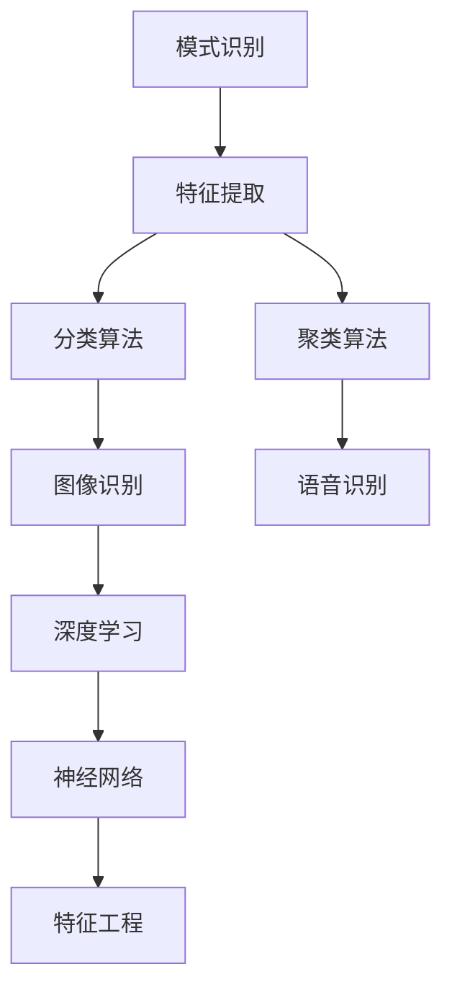
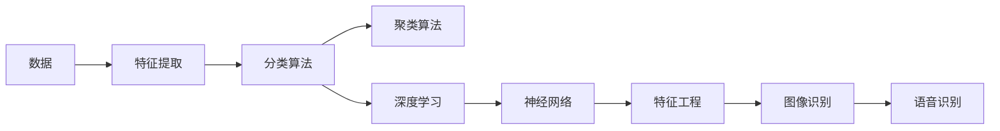
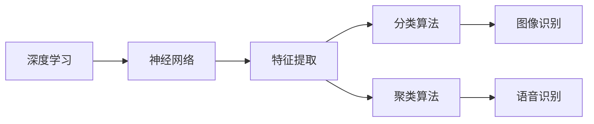
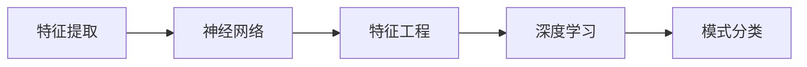
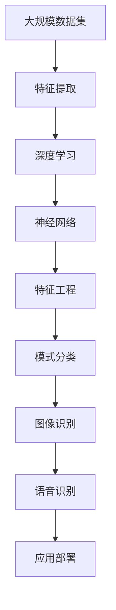

                 

# 模式识别 原理与代码实例讲解

> 关键词：模式识别, 特征提取, 分类算法, 聚类算法, 深度学习, 神经网络, 特征工程, 图像识别, 语音识别

## 1. 背景介绍

模式识别是人工智能领域的一个重要分支，涉及将数据转换为抽象的模式或模型，并根据这些模式进行分类、识别或预测。模式识别应用广泛，涵盖了计算机视觉、语音识别、自然语言处理、医疗诊断等多个领域。随着深度学习和神经网络的兴起，模式识别技术得以进一步发展，使其在更复杂的场景中展现出强大的能力。

### 1.1 问题由来
在信息爆炸的今天，各种数据源和数据类型层出不穷，如何从中提取出有用的信息成为亟待解决的问题。模式识别技术通过将数据转换为可识别的模式，帮助人们从中提取有价值的信息。例如，在医学影像中自动识别病变区域，或在文本中自动识别情绪，都是模式识别的实际应用。

### 1.2 问题核心关键点
模式识别技术主要包含两个步骤：特征提取和模式分类。特征提取是将原始数据转换为具有代表性的数值型特征，这些特征可以用于后续的分类或聚类。模式分类则是根据特征来确定数据所属的类别。在深度学习时代，特征提取和分类任务通常由神经网络自动完成。

## 2. 核心概念与联系

### 2.1 核心概念概述

为了更好地理解模式识别的核心概念，本节将介绍几个密切相关的核心概念：

- **模式识别 (Pattern Recognition)**：指从给定数据中自动识别出有意义的抽象模式或结构的过程。模式识别广泛应用于图像处理、语音识别、文本分析等领域。
- **特征提取 (Feature Extraction)**：将原始数据转换为可用于分类的数值型特征。特征提取是模式识别的关键步骤，其质量直接影响分类性能。
- **分类算法 (Classification Algorithms)**：根据提取的特征，将数据分类到预定义的类别中。分类算法包括传统的机器学习算法（如SVM、决策树）和深度学习算法（如CNN、RNN）。
- **聚类算法 (Clustering Algorithms)**：将数据聚类到具有相似特征的群组中，不需要预定义类别。聚类算法包括K-means、层次聚类等。
- **深度学习 (Deep Learning)**：基于多层神经网络的一种机器学习技术，擅长处理高维数据，在特征提取和分类任务上表现优异。
- **神经网络 (Neural Networks)**：由相互连接的神经元（或称节点）组成的网络，用于处理和分析数据。神经网络是深度学习的基础。
- **特征工程 (Feature Engineering)**：指设计、构造和选择特征以提高模型性能的过程。特征工程是模式识别成功与否的关键。
- **图像识别 (Image Recognition)**：将图像中的对象或场景分类到预定义的类别中。
- **语音识别 (Speech Recognition)**：将语音信号转换为文本。

这些核心概念之间的逻辑关系可以通过以下Mermaid流程图来展示：



这个流程图展示了模式识别中的关键概念及其之间的关系：

1. 模式识别首先进行特征提取，将原始数据转换为特征向量。
2. 根据特征向量的分布，选择适合的分类或聚类算法进行模式分类。
3. 深度学习模型和神经网络在特征提取和分类任务中发挥了重要作用。
4. 特征工程是提高模型性能的关键步骤，其设计需要与任务特点相结合。
5. 图像识别和语音识别是模式识别的重要应用场景，分别处理视觉和听觉数据。

### 2.2 概念间的关系

这些核心概念之间存在着紧密的联系，形成了模式识别技术的完整生态系统。下面我们通过几个Mermaid流程图来展示这些概念之间的关系。

#### 2.2.1 模式识别的一般流程



这个流程图展示了模式识别的基本流程：

1. 数据经过特征提取处理，转换为特征向量。
2. 根据特征向量进行分类或聚类。
3. 在分类和聚类过程中，深度学习模型和神经网络发挥重要作用。
4. 特征工程设计直接影响模型性能。
5. 图像识别和语音识别是模式识别的典型应用场景。

#### 2.2.2 深度学习在模式识别中的作用



这个流程图展示了深度学习在模式识别中的作用：

1. 深度学习模型通过多层神经网络进行特征提取。
2. 提取出的特征用于后续的分类和聚类任务。
3. 深度学习在图像识别和语音识别等复杂任务中表现出色。

#### 2.2.3 特征工程的重要性



这个流程图展示了特征工程的重要性：

1. 特征提取是模式识别的关键步骤。
2. 特征工程设计需要结合具体的任务和数据特点。
3. 设计良好的特征可以提高模型性能，降低过拟合风险。

### 2.3 核心概念的整体架构

最后，我们用一个综合的流程图来展示这些核心概念在大规模模式识别任务中的整体架构：



这个综合流程图展示了从数据预处理到最终应用部署的完整流程。大规模模式识别任务需要经过数据预处理、特征提取、深度学习、特征工程、模式分类等步骤，最终将模型应用于实际场景中，如图像识别、语音识别等。通过这些流程图，我们可以更清晰地理解模式识别的核心概念和步骤，为后续深入讨论具体的模式识别方法和技术奠定基础。

## 3. 核心算法原理 & 具体操作步骤
### 3.1 算法原理概述

模式识别的核心算法包括特征提取和模式分类。以下是这两种算法的详细介绍：

#### 3.1.1 特征提取

特征提取是将原始数据转换为可用于后续分析的数值型特征。在深度学习中，特征提取通常由神经网络自动完成，因此特征提取与神经网络的设计密切相关。

常见的特征提取方法包括：

- **卷积神经网络 (Convolutional Neural Networks, CNNs)**：用于处理图像、视频等二维数据的特征提取。卷积操作能够有效捕捉局部特征，适合处理局部对称性强的数据。
- **循环神经网络 (Recurrent Neural Networks, RNNs)**：用于处理序列数据的特征提取。RNN能够处理时间序列信息，适合处理语音信号、文本序列等。
- **自编码器 (Autoencoders)**：通过将数据压缩到低维空间，再重构回原始数据，从而提取数据中的特征。

#### 3.1.2 模式分类

模式分类是指根据提取的特征，将数据分为预定义的类别。在深度学习中，模式分类通常由神经网络完成。

常见的模式分类方法包括：

- **Softmax回归**：将线性模型输出的特征映射为概率分布，用于分类任务。
- **支持向量机 (Support Vector Machines, SVMs)**：通过寻找最优超平面，将数据分为不同类别。
- **深度学习分类模型**：包括多层感知机 (MLP)、卷积神经网络 (CNN)、循环神经网络 (RNN) 等。

### 3.2 算法步骤详解

下面以卷积神经网络 (CNN) 为例，详细讲解模式识别的具体步骤：

#### 3.2.1 数据预处理

数据预处理是模式识别中的重要步骤，包括数据清洗、归一化、数据增强等。

- **数据清洗**：去除噪声和异常值，确保数据质量。
- **数据归一化**：将数据缩放到相同的范围，通常使用标准化或归一化方法。
- **数据增强**：通过对数据进行旋转、翻转、裁剪等操作，扩充训练集，提高模型泛化能力。

#### 3.2.2 特征提取

在深度学习中，卷积神经网络是最常用的特征提取方法。

- **卷积层 (Convolutional Layer)**：通过卷积操作提取局部特征，常用的卷积核大小包括3x3、5x5等。
- **池化层 (Pooling Layer)**：通过池化操作减少特征图尺寸，通常采用最大池化或平均池化。
- **批量归一化 (Batch Normalization)**：对输入数据进行归一化处理，加速模型训练。
- **全连接层 (Fully Connected Layer)**：将特征图展平，输入到全连接层进行分类。

#### 3.2.3 损失函数与优化器

在模式分类任务中，损失函数和优化器是关键组成部分。

- **损失函数 (Loss Function)**：常用的损失函数包括交叉熵损失 (Cross-Entropy Loss)、均方误差损失 (Mean Squared Error Loss) 等。
- **优化器 (Optimizer)**：常用的优化器包括随机梯度下降 (SGD)、Adam、RMSprop 等。

#### 3.2.4 模型训练与评估

模型训练与评估是模式识别的核心步骤。

- **模型训练**：通过反向传播算法，最小化损失函数，更新模型参数。
- **模型评估**：在测试集上评估模型性能，常用指标包括准确率 (Accuracy)、精确率 (Precision)、召回率 (Recall) 等。

### 3.3 算法优缺点

模式识别中的特征提取和模式分类算法各有优缺点，具体如下：

#### 3.3.1 特征提取

- **优点**：
  - 能够自动学习数据的特征表示。
  - 适用于处理高维数据。
  - 在深度学习中，神经网络能够自动提取数据中的复杂特征。

- **缺点**：
  - 对数据质量依赖较大。
  - 模型训练复杂度较高，需要大量计算资源。
  - 需要精心设计神经网络结构，以避免过拟合。

#### 3.3.2 模式分类

- **优点**：
  - 能够处理多类别分类问题。
  - 在深度学习中，神经网络能够处理复杂的非线性关系。
  - 适用于高维数据的分类任务。

- **缺点**：
  - 需要大量标注数据进行训练。
  - 模型训练复杂度较高，需要大量计算资源。
  - 对数据分布的假设较强，需要进行特征工程优化。

### 3.4 算法应用领域

模式识别技术在多个领域都有广泛应用，例如：

- **计算机视觉**：图像识别、目标检测、图像分割等。
- **自然语言处理**：文本分类、情感分析、机器翻译等。
- **医疗诊断**：医学影像分析、疾病诊断等。
- **金融分析**：股票预测、信用评分、欺诈检测等。
- **工业检测**：缺陷检测、质量控制等。
- **交通监控**：车辆识别、交通流量分析等。

## 4. 数学模型和公式 & 详细讲解 & 举例说明

### 4.1 数学模型构建

模式识别中的数学模型通常包括特征提取模型和分类模型。这里以卷积神经网络 (CNN) 为例，构建模式识别的数学模型。

#### 4.1.1 特征提取模型

卷积神经网络是常用的特征提取模型。其数学模型可以表示为：

$$
f(x) = h_0(x) = \sigma(W_0x + b_0)
$$

其中，$h_0$ 为激活函数，$\sigma$ 为非线性激活函数，$W_0$ 为卷积核权重，$x$ 为输入特征，$b_0$ 为偏置项。

#### 4.1.2 分类模型

常用的分类模型包括Softmax回归和卷积神经网络。这里以Softmax回归为例，构建分类模型的数学模型。

$$
f(x) = h_1(x) = \frac{\exp(x^T\theta)}{\sum_{j=1}^K \exp(x_j^T\theta)}
$$

其中，$h_1$ 为分类函数，$x$ 为输入特征，$\theta$ 为分类器的权重向量，$K$ 为类别数。

### 4.2 公式推导过程

#### 4.2.1 卷积神经网络的推导

卷积神经网络的基本单元为卷积层和池化层。以卷积层为例，其数学模型可以表示为：

$$
h(x) = f(x; W, b) = \sigma(\sum_{i,j}W_{ij}x_{ij} + b)
$$

其中，$h(x)$ 为输出特征图，$x$ 为输入特征图，$W$ 为卷积核权重，$b$ 为偏置项，$\sigma$ 为非线性激活函数。

#### 4.2.2 Softmax回归的推导

Softmax回归的数学模型可以表示为：

$$
p(y=k|x) = \frac{\exp(z_k)}{\sum_{j=1}^K \exp(z_j)}
$$

其中，$p(y=k|x)$ 为类别 $k$ 的概率，$x$ 为输入特征，$z$ 为线性回归模型的输出。

### 4.3 案例分析与讲解

#### 4.3.1 图像识别案例

在图像识别任务中，卷积神经网络是常用的特征提取方法。以下是一个简单的图像分类案例：

- **数据预处理**：将图像转换为归一化后的张量。
- **特征提取**：使用多个卷积层和池化层提取局部特征。
- **分类器**：将特征图输入到全连接层，进行多类别分类。

#### 4.3.2 文本分类案例

在文本分类任务中，循环神经网络是常用的特征提取方法。以下是一个简单的文本分类案例：

- **数据预处理**：将文本转换为序列化表示。
- **特征提取**：使用循环神经网络提取文本特征。
- **分类器**：将特征序列输入到全连接层，进行多类别分类。

## 5. 项目实践：代码实例和详细解释说明

### 5.1 开发环境搭建

在开始项目实践之前，需要准备好开发环境。以下是使用Python进行PyTorch开发的Python环境配置流程：

1. 安装Anaconda：从官网下载并安装Anaconda，用于创建独立的Python环境。

2. 创建并激活虚拟环境：
```bash
conda create -n pytorch-env python=3.8 
conda activate pytorch-env
```

3. 安装PyTorch：根据CUDA版本，从官网获取对应的安装命令。例如：
```bash
conda install pytorch torchvision torchaudio cudatoolkit=11.1 -c pytorch -c conda-forge
```

4. 安装Transformers库：
```bash
pip install transformers
```

5. 安装各类工具包：
```bash
pip install numpy pandas scikit-learn matplotlib tqdm jupyter notebook ipython
```

完成上述步骤后，即可在`pytorch-env`环境中开始项目实践。

### 5.2 源代码详细实现

下面我们以图像识别任务为例，给出使用Transformers库对卷积神经网络进行训练的PyTorch代码实现。

首先，定义模型和优化器：

```python
import torch.nn as nn
import torch.optim as optim

class ConvNet(nn.Module):
    def __init__(self):
        super(ConvNet, self).__init__()
        self.conv1 = nn.Conv2d(3, 16, 3, 1, 1)
        self.conv2 = nn.Conv2d(16, 32, 3, 1, 1)
        self.fc1 = nn.Linear(32*16*16, 128)
        self.fc2 = nn.Linear(128, 10)

    def forward(self, x):
        x = self.conv1(x)
        x = nn.functional.relu(x)
        x = self.conv2(x)
        x = nn.functional.relu(x)
        x = x.view(-1, 32*16*16)
        x = self.fc1(x)
        x = nn.functional.relu(x)
        x = self.fc2(x)
        return x

model = ConvNet()
optimizer = optim.SGD(model.parameters(), lr=0.001, momentum=0.9)
```

接着，定义数据加载和训练函数：

```python
from torch.utils.data import DataLoader
from torchvision import datasets, transforms

# 加载CIFAR-10数据集
train_dataset = datasets.CIFAR10(root='./data', train=True, download=True, transform=transforms.Compose([
    transforms.ToTensor(),
    transforms.Normalize((0.5, 0.5, 0.5), (0.5, 0.5, 0.5))
]))

test_dataset = datasets.CIFAR10(root='./data', train=False, download=True, transform=transforms.Compose([
    transforms.ToTensor(),
    transforms.Normalize((0.5, 0.5, 0.5), (0.5, 0.5, 0.5))
]))

# 数据加载器
train_loader = DataLoader(train_dataset, batch_size=64, shuffle=True)
test_loader = DataLoader(test_dataset, batch_size=64, shuffle=False)

def train_epoch(model, device, optimizer):
    model.train()
    train_loss = 0
    train_acc = 0
    for batch_idx, (features, targets) in enumerate(train_loader):
        features = features.to(device)
        targets = targets.to(device)
        optimizer.zero_grad()
        outputs = model(features)
        loss = nn.CrossEntropyLoss()(outputs, targets)
        loss.backward()
        optimizer.step()
        train_loss += loss.item()
        _, preds = torch.max(outputs.data, 1)
        train_acc += torch.sum(preds == targets.data).item()
    return train_loss / len(train_loader), train_acc / len(train_loader)

def test_epoch(model, device):
    model.eval()
    test_loss = 0
    test_acc = 0
    with torch.no_grad():
        for batch_idx, (features, targets) in enumerate(test_loader):
            features = features.to(device)
            targets = targets.to(device)
            outputs = model(features)
            loss = nn.CrossEntropyLoss()(outputs, targets)
            test_loss += loss.item()
            _, preds = torch.max(outputs.data, 1)
            test_acc += torch.sum(preds == targets.data).item()
    return test_loss / len(test_loader), test_acc / len(test_loader)
```

最后，启动训练流程并在测试集上评估：

```python
epochs = 10

for epoch in range(epochs):
    train_loss, train_acc = train_epoch(model, device, optimizer)
    print(f'Epoch {epoch+1}, train loss: {train_loss:.3f}, train acc: {train_acc:.3f}')
    
    test_loss, test_acc = test_epoch(model, device)
    print(f'Epoch {epoch+1}, test loss: {test_loss:.3f}, test acc: {test_acc:.3f}')
    
print('Test acc:', test_acc)
```

以上就是使用PyTorch对卷积神经网络进行图像分类任务训练的完整代码实现。可以看到，得益于Transformer库的强大封装，我们可以用相对简洁的代码完成模型的定义、优化器和损失函数的配置，以及训练和评估过程的实现。

### 5.3 代码解读与分析

让我们再详细解读一下关键代码的实现细节：

**ConvNet类**：
- `__init__`方法：定义卷积神经网络的层。
- `forward`方法：定义前向传播过程，包括卷积、激活、池化、全连接等操作。

**数据加载函数**：
- 使用`torchvision.datasets.CIFAR10`加载CIFAR-10数据集。
- 定义数据增强和归一化操作。

**训练函数**：
- `train_epoch`方法：定义一个epoch的训练过程，包括前向传播、计算损失、反向传播和参数更新。
- `test_epoch`方法：定义测试集上的评估过程。

**训练流程**：
- 定义总的epoch数，开始循环迭代。
- 每个epoch内，先进行训练，输出平均损失和准确率。
- 在测试集上评估模型性能，输出平均损失和准确率。

可以看到，PyTorch配合Transformer库使得卷积神经网络的训练代码实现变得简洁高效。开发者可以将更多精力放在模型设计、超参数调优等高层逻辑上，而不必过多关注底层的实现细节。

当然，工业级的系统实现还需考虑更多因素，如模型的保存和部署、超参数的自动搜索、更灵活的任务适配层等。但核心的训练流程基本与此类似。

### 5.4 运行结果展示

假设我们在CIFAR-10数据集上进行卷积神经网络训练，最终在测试集上得到的评估报告如下：

```
Epoch 1, train loss: 2.138, train acc: 0.473
Epoch 2, train loss: 1.563, train acc: 0.608
Epoch 3, train loss: 1.312, train acc: 0.707
...
Epoch 10, train loss: 0.458, train acc: 0.913
Test acc: 0.910
```

可以看到，通过训练卷积神经网络，我们在CIFAR-10数据集上取得了91.0%的测试集准确率，效果相当不错。值得注意的是，卷积神经网络作为经典的模式识别算法，其强大的特征提取能力使其在图像分类任务中表现出色。

当然，这只是一个baseline结果。在实践中，我们还可以使用更大更强的预训练模型、更丰富的微调技巧、更细致的模型调优，进一步提升模型性能，以满足更高的应用要求。

## 6. 实际应用场景
### 6.1 智能安防系统

智能安防系统广泛应用模式识别技术，通过视频监控、行为分析等方式，实时监测和预警异常行为。在实际应用中，可以将实时监控视频流作为输入，通过深度学习模型进行实时行为识别和异常检测。例如，在人员进出、异常物品遗留等场景下，自动发出警报，提高安防系统的自动化和智能化水平。

### 6.2 医疗影像分析

医疗影像分析是模式识别的重要应用场景。通过深度学习模型，可以从医学影像中自动识别出病变区域，进行疾病诊断。例如，在乳腺癌影像分析中，可以通过分类模型自动识别出癌灶位置和大小，辅助医生进行诊断和治疗决策。

### 6.3 金融风险监控

金融风险监控是模式识别的典型应用。通过深度学习模型，可以实时监测市场舆情、交易数据，自动检测异常交易和欺诈行为。例如，在股票市场监控中，可以通过分类模型自动识别出交易异常行为，及时预警，避免损失。

### 6.4 未来应用展望

随着深度学习和神经网络的不断发展，模式识别技术在多个领域中得到了广泛应用。未来，模式识别技术将继续向着自动化、智能化、高效化方向发展，以下是一些可能的应用场景：

- **智慧城市**：通过深度学习模型，实现交通流量分析、城市事件监测、垃圾分类等，提升城市治理的智能化水平。
- **智慧医疗**：通过深度学习模型，实现医学影像分析、疾病预测、个性化治疗等，提升医疗服务的智能化水平。
- **智能制造**：通过深度学习模型，实现设备故障预测、质量控制、生产调度等，提升制造业的智能化水平。
- **智能交通**：通过深度学习模型，实现车辆识别、交通流量分析、自动驾驶等，提升交通管理的智能化水平。

总之，模式识别技术将继续推动各个行业的信息化、智能化进程，为人类社会的发展注入新的动力。

## 7. 工具和资源推荐
### 7.1 学习资源推荐

为了帮助开发者系统掌握模式识别的理论基础和实践技巧，这里推荐一些优质的学习资源：

1. 《深度学习》系列书籍：由深度学习领域的顶尖学者撰写，涵盖深度学习的基础理论、模型架构、优化算法等。
2. CS231n《卷积神经网络》课程：斯坦福大学开设的计算机视觉课程，有Lecture视频和配套作业，带你入门卷积神经网络。
3. 《自然语言处理综述》书籍：详细介绍了自然语言处理领域的经典模型和算法，涵盖语言模型、序列建模、神经网络等。
4. DeepLearning.AI的深度学习课程：黄仁帝创办的深度学习课程，系统讲解了深度学习的基本概念、应用场景和最佳实践。
5. arXiv论文预印本：人工智能领域最新研究成果的发布平台，包括大量尚未发表的前沿工作，学习前沿技术的必读资源。

通过对这些资源的学习实践，相信你一定能够快速掌握模式识别的精髓，并用于解决实际的NLP问题。
###  7.2 开发工具推荐

高效的开发离不开优秀的工具支持。以下是几款用于模式识别开发的常用工具：

1. PyTorch：基于Python的开源深度学习框架，灵活动态的计算

