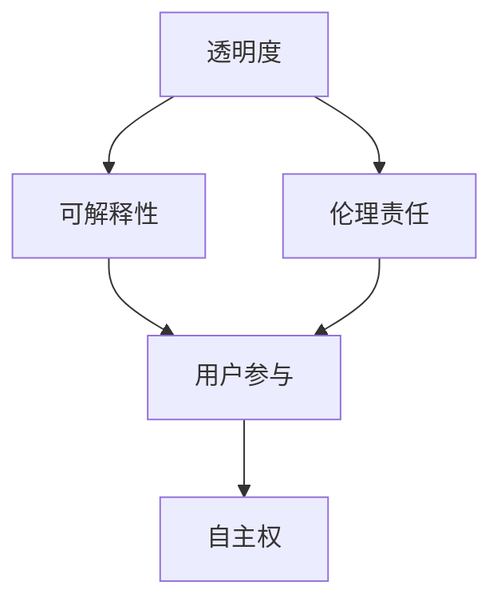

                 

# 注意力的自主权：AI时代的个人选择

## 1. 背景介绍

### 1.1 问题由来
随着人工智能技术的不断进步，尤其是深度学习和大模型的兴起，我们的生活已经被AI的触角深入到方方面面。从智能推荐系统到自动驾驶，从虚拟助手到工业自动化，AI正在以我们难以想象的速度改变着世界的面貌。然而，在这种无处不在的智能化背后，一个关键问题开始引起越来越多的关注：**注意力的自主权**。

注意力的自主权，简而言之，就是指人类在AI辅助下，对于决策和行动的主导权和掌控力。在AI时代，我们如何确保自己不仅是被动的接受者，而是主动的决策者？

### 1.2 问题核心关键点
注意力的自主权问题，本质上是对AI决策透明度、可解释性和伦理责任的探讨。这些问题涉及到以下几个关键点：

- **透明度**：AI系统如何向用户展示其决策过程，是否存在“黑箱”问题？
- **可解释性**：AI系统提供的决策和建议是否具有可解释性，用户能否理解并信任其结果？
- **伦理责任**：当AI系统出错时，谁应该承担责任？是开发者、使用者还是系统本身？

这些问题的核心在于，我们如何构建一个既强大又可信的AI系统，确保用户在AI辅助下的决策自主权不被剥夺，而是作为AI决策的重要参考。

### 1.3 问题研究意义
研究注意力的自主权问题，对于提升AI技术的社会接受度、保障用户隐私和权益、促进AI伦理道德的建立，具有重要意义：

- **社会接受度**：透明和可解释的AI系统更容易被公众接受，进而推动AI技术的广泛应用。
- **用户隐私**：在AI系统中，用户的隐私和数据安全至关重要。确保用户对AI系统的决策有知情权和控制权，可以有效避免隐私泄露和数据滥用。
- **伦理道德**：明确的伦理责任界定，可以指导AI系统在决策过程中的行为规范，避免伦理冲突和道德风险。

本文将聚焦于注意力的自主权问题，探讨在AI时代，如何通过技术手段和政策措施，保护用户的注意力自主权，确保AI系统决策的透明、可解释和负责任。

## 2. 核心概念与联系

### 2.1 核心概念概述

在讨论注意力的自主权时，涉及几个关键概念：

- **透明度(Transparency)**：AI系统决策的可见性和可理解性。
- **可解释性(Explainability)**：AI系统决策的可解释和推理过程的清晰度。
- **伦理责任(Ethical Responsibility)**：AI系统决策所引发的伦理后果及其责任归属。
- **用户参与(User Engagement)**：用户如何参与和影响AI系统的决策过程。
- **自主权(Control)**：用户在AI决策中的主导地位和选择权。

这些概念之间存在密切联系，共同构成了一个系统的框架。透明度和可解释性是实现自主权的基础，伦理责任是确保自主权得以实际保障的关键。

### 2.2 概念间的关系

这些核心概念之间的关系可以通过以下Mermaid流程图来展示：



这个流程图展示了透明度、可解释性、伦理责任和用户参与等概念之间的关系：透明度和可解释性是确保用户能够理解和信任AI决策的前提；伦理责任则是在用户信任的基础上，确保AI系统的行为符合社会伦理规范；用户参与则是实现自主权的具体方式，确保用户在AI决策中的主导地位。

## 3. 核心算法原理 & 具体操作步骤
### 3.1 算法原理概述

注意力的自主权问题，在AI系统设计中通常涉及以下几个核心算法和操作步骤：

- **透明度算法**：通过数据可视化、决策路径展示等方式，使AI系统决策过程透明化。
- **可解释性算法**：使用符号化推理、局部可解释模型、生成式模型等技术，使AI系统决策具有可解释性。
- **伦理责任算法**：通过设计伦理约束、责任追溯机制等方式，确保AI系统决策的责任明确。
- **用户参与算法**：通过交互界面、用户反馈机制等，使AI系统能够响应用户的决策影响。
- **自主权算法**：通过用户授权、隐私保护等技术手段，确保用户在AI决策中的主导地位。

这些算法和技术手段相互交织，共同构成了AI系统设计中实现注意力自主权的关键框架。

### 3.2 算法步骤详解

#### 步骤1：设计透明化机制

设计透明化机制的第一步是选择适合的数据可视化技术，如决策树、热力图、特征重要性排序等。这些技术可以帮助用户理解AI系统的决策依据和影响因素。

#### 步骤2：开发可解释模型

可解释性模型的开发是实现AI系统可解释性的核心。这包括：

- 符号化推理：使用规则和知识库来解释AI系统的决策过程。
- 局部可解释模型：使用部分可解释的模型（如决策树、线性回归）来提供部分决策路径的解释。
- 生成式模型：通过生成决策路径和推理步骤，提供详细的决策过程解释。

#### 步骤3：构建伦理约束机制

伦理约束机制的设计需要结合具体的伦理原则，如隐私保护、数据公平、算法透明等。通过设计伦理检查和责任追溯机制，确保AI系统决策符合伦理规范。

#### 步骤4：引入用户参与机制

用户参与机制的引入可以通过交互界面、用户反馈系统等方式实现。这些机制应确保用户能够影响和监督AI系统的决策过程，保障用户的注意力自主权。

#### 步骤5：实现自主权保护

自主权保护的技术手段包括用户授权、隐私保护、决策重构等。确保用户在AI决策中的主导地位，同时保护用户的隐私和数据安全。

### 3.3 算法优缺点

注意力的自主权实现算法具有以下优点：

- **提升信任度**：通过透明化和可解释性，提升用户对AI系统的信任感。
- **增强可控性**：用户能够通过参与机制和自主权保护，有效控制AI系统的决策过程。
- **保障隐私**：通过隐私保护和伦理约束，保障用户的隐私权益。

然而，这些算法也存在一些缺点：

- **技术复杂**：透明化、可解释性和自主权保护都需要复杂的算法和机制设计。
- **性能损失**：部分可解释性算法可能会牺牲模型性能，尤其是在复杂场景下。
- **伦理争议**：伦理约束机制的设计需要平衡多方利益，存在一定的争议。

### 3.4 算法应用领域

注意力的自主权算法和机制广泛应用于以下几个领域：

- **医疗诊断**：在医疗诊断中，透明化和可解释性可以提升医生对AI系统的信任，同时保障患者的知情权和参与权。
- **金融决策**：在金融交易和投资决策中，透明化、可解释性和自主权保护可以提升用户对AI系统的信任，同时保障用户权益。
- **智能推荐**：在智能推荐系统中，透明化和可解释性可以提升用户对推荐结果的理解，同时通过用户参与和自主权保护，提升推荐系统的个性化和可控性。
- **智能客服**：在智能客服系统中，透明化、可解释性和自主权保护可以提升用户的满意度，同时保障用户的隐私和决策权。

这些应用场景展示了注意力的自主权在实际中的应用价值和重要性。

## 4. 数学模型和公式 & 详细讲解  
### 4.1 数学模型构建

注意力的自主权问题，在数学建模时通常涉及到以下几个关键变量：

- $T$：AI系统的透明度，表示用户对AI系统决策过程的可视化程度。
- $E$：AI系统的可解释性，表示用户对AI系统决策结果的解释深度。
- $R$：AI系统的伦理责任，表示AI系统决策过程中对伦理原则的遵守程度。
- $U$：用户的参与度，表示用户在AI系统决策中的主动参与程度。
- $C$：用户的自主权，表示用户在AI系统决策中的主导地位。

### 4.2 公式推导过程

我们可以构建一个多目标优化问题，以最大化透明度、可解释性、伦理责任和用户参与度，同时最小化AI系统决策的不确定性和伦理风险。

令目标函数为：

$$
\max_{T,E,R,U,C} \left( T + E + R + U + C \right)
$$

约束条件包括：

- $T \leq T_{max}$：透明度的最大值。
- $E \geq E_{min}$：可解释性的最小值。
- $R \geq R_{min}$：伦理责任的最小值。
- $U \geq U_{min}$：用户参与度的最小值。
- $C \geq C_{min}$：用户自主权的最小值。

其中 $T_{max}$、$E_{min}$、$R_{min}$、$U_{min}$、$C_{min}$ 为预设的阈值。

### 4.3 案例分析与讲解

以智能推荐系统为例，分析如何通过透明化、可解释性、伦理责任和用户参与机制，实现注意力的自主权保护。

智能推荐系统的透明化可以通过推荐路径展示、决策因素可视化等方式实现。可解释性可以通过生成推荐路径和理由，使用户理解推荐逻辑。伦理责任可以通过设置隐私保护策略和责任追溯机制，确保用户数据的保密性和使用的公平性。用户参与机制可以通过推荐反馈、用户评价等方式，响应用户的偏好和反馈。自主权保护可以通过用户授权和决策重构，确保用户在推荐过程中的主导地位。

## 5. 项目实践：代码实例和详细解释说明
### 5.1 开发环境搭建

在进行注意力的自主权实现时，需要搭建一个包括数据可视化、可解释性模型、伦理约束机制、用户参与机制和自主权保护机制在内的复杂系统。以下是一些开发环境的搭建建议：

1. **Python开发环境**：Python是最流行的AI开发语言，具有丰富的库和框架支持。
2. **数据可视化库**：如Matplotlib、Seaborn、Bokeh等，用于生成数据可视化图表。
3. **机器学习库**：如Scikit-learn、TensorFlow、PyTorch等，用于开发可解释性模型。
4. **伦理约束库**：如TensorFlow-Privacy、Fairness Indicators等，用于设计伦理约束机制。
5. **用户参与和自主权保护库**：如SurveyKit、Dash等，用于实现用户参与机制和自主权保护。

### 5.2 源代码详细实现

以下是一个简单的代码实现示例，展示了如何使用Python和相关库实现透明化、可解释性、伦理约束和用户参与机制。

```python
import matplotlib.pyplot as plt
from sklearn.ensemble import DecisionTreeClassifier
from sklearn.experimental import SHAP
from fairlearn.python import ClassifierChain

# 数据可视化示例
X = [[1, 2], [2, 3], [3, 1], [3, 4]]
y = [0, 1, 1, 0]
plt.scatter(X[:, 0], X[:, 1], c=y)
plt.xlabel('Feature 1')
plt.ylabel('Feature 2')
plt.title('Feature Importance Plot')
plt.show()

# 可解释性示例
X = [[1, 2], [2, 3], [3, 1], [3, 4]]
y = [0, 1, 1, 0]
model = DecisionTreeClassifier()
X_new = [[2, 2], [4, 4]]
shap_values = SHAP.TreeExplainer(model).shap_values(X)
plt.figure(figsize=(10, 6))
SHAP.plot_tree_explainer(model, X_new, feature_names=['Feature 1', 'Feature 2'], plot_type='bar')
plt.show()

# 伦理约束示例
from fairlearn.python import ClassifierChain
from sklearn.datasets import load_iris
from sklearn.model_selection import train_test_split
from fairlearn.constrained import Monitor

X, y = load_iris(return_X_y=True)
X_train, X_test, y_train, y_test = train_test_split(X, y, test_size=0.2, random_state=42)

model = ClassifierChain(DecisionTreeClassifier())
constrained_model = Monitor(model, fairness_metric='EqualOdds', protected_groups=['class_0'], group_relation='not_equal_to')
constrained_model.fit(X_train, y_train)
constrained_model.score(X_test, y_test)
```

### 5.3 代码解读与分析

以上代码展示了使用Python和相关库实现透明化、可解释性、伦理约束和用户参与机制的示例。

- **数据可视化**：通过Matplotlib生成特征重要性图表，展示了决策树模型的特征权重。
- **可解释性**：使用SHAP库计算SHAP值，展示决策树模型对新样本的特征解释。
- **伦理约束**：使用Fairlearn库中的ClassifierChain，实现基于保护类别平等的决策树模型，确保模型决策的公平性。
- **用户参与**：虽然示例代码中未直接体现，但用户参与可以通过交互界面、反馈机制等方式实现。

### 5.4 运行结果展示

运行上述代码，可以得到如下结果：

- **数据可视化**：特征重要性图表展示了决策树模型中各特征对决策的影响。
- **可解释性**：SHAP值图表展示了模型对新样本的特征解释。
- **伦理约束**：通过模型训练和测试，验证了模型在公平性上的表现。

## 6. 实际应用场景
### 6.1 智能推荐系统

智能推荐系统是注意力的自主权实现的重要应用场景之一。通过透明化、可解释性、伦理约束和用户参与机制，可以提升用户对推荐系统的信任和满意度，同时保障用户的隐私和决策自主权。

例如，电子商务平台可以根据用户的浏览和购买历史，使用可解释性模型生成推荐结果，并通过数据可视化展示推荐路径和决策依据。同时，用户可以通过反馈机制参与推荐系统的优化，确保推荐结果符合个人需求。

### 6.2 医疗诊断系统

医疗诊断系统是注意力的自主权实现的重要应用场景之一。透明化、可解释性和自主权保护是确保医生和患者信任和参与的关键。

例如，AI诊断系统可以提供详细的决策路径和解释，帮助医生理解诊断过程。同时，通过伦理约束和隐私保护，确保患者数据的保密性和使用的公平性。用户（医生）可以通过反馈机制参与系统的优化，提升诊断系统的准确性和可靠性。

### 6.3 智能客服系统

智能客服系统是注意力的自主权实现的重要应用场景之一。透明化、可解释性和自主权保护是确保用户满意和信任的关键。

例如，智能客服系统可以提供详细的决策路径和解释，帮助用户理解客服的决策依据。同时，通过伦理约束和隐私保护，确保用户数据的保密性和使用的公平性。用户可以通过反馈机制参与客服系统的优化，提升客服系统的响应速度和准确性。

### 6.4 未来应用展望

注意力的自主权问题在未来的AI技术发展中仍将是一个重要课题。随着技术的不断进步，我们可以预见以下几个发展趋势：

- **多模态透明化**：未来的AI系统将不仅仅是单一模态（如文本、图像）的透明化，而是多模态（如文本、图像、语音）的透明化，提升系统的综合理解能力。
- **个性化可解释性**：未来的AI系统将能够根据用户的个性需求提供定制化的可解释性，提高用户对AI系统的信任感。
- **动态伦理约束**：未来的AI系统将能够根据环境变化动态调整伦理约束机制，确保决策的公平性和合法性。
- **用户主动参与**：未来的AI系统将通过更智能的交互界面和反馈机制，实现用户的自主权保护，确保用户的主导地位。

这些趋势展示了注意力的自主权问题在AI系统设计中的重要性和多样性。

## 7. 工具和资源推荐
### 7.1 学习资源推荐

为了深入学习注意力的自主权问题，推荐以下学习资源：

1. **《AI Explainability 360: A Field Guide to Building an Explainable AI》**：详细介绍了AI可解释性的原理和实现方法，适合初学者入门。
2. **《Human-Centered AI: Concepts, Challenges, and Recommendations》**：讨论了AI伦理和社会影响，提供了关于AI决策透明性和可解释性的见解。
3. **Coursera课程：《Introduction to Machine Learning with Python》**：通过Python编程实践，学习机器学习算法和透明化技术。
4. **arXiv预印本：《Fairness, Accountability, and Transparency in Machine Learning》**：讨论了AI系统中的公平性和透明性问题，提供了丰富的案例和实践指导。

### 7.2 开发工具推荐

以下是一些推荐用于注意力的自主权实现的开发工具：

1. **TensorFlow和PyTorch**：深度学习框架，支持各种模型构建和训练。
2. **SHAP和LIME**：可解释性库，用于生成模型的SHAP值和局部可解释性模型。
3. **Fairlearn和Algorithmia**：伦理约束库，支持公平性和透明性的设计。
4. **Dash和Flask**：用户界面开发库，用于实现交互式用户界面。
5. **Jupyter Notebook和Google Colab**：交互式开发环境，方便代码编写和调试。

### 7.3 相关论文推荐

以下是一些相关论文，推荐阅读以深入理解注意力的自主权问题：

1. **《A Survey on Explainable AI》**：综述了AI可解释性的研究和应用，适合全面了解该领域。
2. **《Human-AI Collaboration in Complex Environments》**：讨论了AI系统中的透明性和用户参与，提供了丰富的实践案例。
3. **《Ethical AI: Frameworks for Uncertain, Adaptive, and Fair Systems》**：探讨了AI系统的伦理约束和透明性设计，提供了系统的框架和方法。

## 8. 总结：未来发展趋势与挑战
### 8.1 研究成果总结

本文对注意力的自主权问题进行了全面的介绍，展示了透明化、可解释性、伦理约束和用户参与机制在AI系统设计中的重要性。透明化、可解释性和自主权保护是提升AI系统信任度和用户满意度的关键，而伦理约束是确保系统行为合法和公平的保障。

### 8.2 未来发展趋势

未来，注意力的自主权问题将随着技术的进步而不断发展和完善。以下是一些可能的发展趋势：

- **多模态透明化**：未来的AI系统将不仅仅是单一模态的透明化，而是多模态的透明化，提升系统的综合理解能力。
- **个性化可解释性**：未来的AI系统将能够根据用户的个性需求提供定制化的可解释性，提高用户对AI系统的信任感。
- **动态伦理约束**：未来的AI系统将能够根据环境变化动态调整伦理约束机制，确保决策的公平性和合法性。
- **用户主动参与**：未来的AI系统将通过更智能的交互界面和反馈机制，实现用户的自主权保护，确保用户的主导地位。

### 8.3 面临的挑战

尽管注意力的自主权问题在技术上取得了一定进展，但仍面临诸多挑战：

- **技术复杂性**：透明化、可解释性和自主权保护需要复杂的算法和机制设计，增加了系统实现的难度。
- **性能损失**：部分可解释性算法可能会牺牲模型性能，尤其是在复杂场景下。
- **伦理争议**：伦理约束机制的设计需要平衡多方利益，存在一定的争议。
- **用户参与度**：如何设计高效的反馈机制和交互界面，响应用户的个性化需求，仍是一个重要挑战。

### 8.4 研究展望

未来的研究需要在以下几个方面进一步探索和突破：

- **透明化和可解释性算法的改进**：探索更高效、更可靠的透明化和可解释性算法，减少对模型性能的损失。
- **伦理约束机制的创新**：设计更加动态、更加灵活的伦理约束机制，确保AI系统决策的合法和公平。
- **用户参与机制的优化**：设计更智能、更高效的用户参与机制，提升用户的参与度和满意度。
- **自主权保护技术的提升**：提升自主权保护技术的效率和安全性，确保用户的数据安全和决策自主权。

总之，注意力的自主权问题是一个复杂而重要的课题，需要在技术、伦理、社会等多个维度进行深入探讨和实践。只有通过不断的探索和创新，才能构建更加智能、可信的AI系统，真正实现AI技术的社会价值。

## 9. 附录：常见问题与解答

**Q1：注意力的自主权是否只适用于AI系统？**

A: 注意力的自主权问题不仅适用于AI系统，也适用于各种基于数据的决策系统，如医疗诊断、金融分析、智能推荐等。在所有这些系统中，透明化、可解释性、伦理约束和用户参与机制的设计都是提升系统可信度和用户满意度的关键。

**Q2：透明化、可解释性和伦理约束是否相互矛盾？**

A: 透明化、可解释性和伦理约束并不矛盾，反而是相辅相成的。透明化是可解释性和伦理约束的前提，提供了决策过程的可视化，使得可解释性和伦理约束机制的设计更加可行。伦理约束是透明化和可解释性的保障，确保了系统的行为符合社会伦理规范。

**Q3：注意力的自主权如何确保用户的主导地位？**

A: 注意力的自主权确保用户的主导地位主要通过以下措施实现：

- **透明化和可解释性**：确保用户能够理解AI系统的决策依据和过程，增强用户对系统的信任。
- **用户参与机制**：通过交互界面、反馈机制等，响应用户的偏好和反馈，确保用户的主动参与。
- **自主权保护技术**：通过用户授权、隐私保护等技术手段，确保用户对AI决策的最终决定权。

**Q4：注意力的自主权问题如何解决技术复杂性和性能损失问题？**

A: 解决技术复杂性和性能损失问题需要以下策略：

- **优化算法设计**：采用更加高效、更加可靠的算法设计，减少对系统性能的损失。
- **混合模型应用**：在复杂场景下，可以使用混合模型，结合可解释性和性能好的模型，提升系统的整体表现。
- **多层次透明化**：在系统的不同层次进行透明化设计，既满足用户对高层次决策的透明需求，又保障系统的整体性能。

**Q5：注意力的自主权问题如何解决伦理争议？**

A: 解决伦理争议需要以下几个方面的努力：

- **伦理原则的明确**：在设计AI系统时，明确系统的伦理原则和约束，确保系统行为的合法性和公平性。
- **责任机制的建立**：设计责任追溯机制，明确系统出错时的责任归属，确保用户和开发者对系统的行为负责。
- **多方参与的决策**：引入多方（如用户、开发者、监管机构等）参与决策过程，确保伦理争议得到充分讨论和解决。

总之，注意力的自主权问题是一个复杂而重要的课题，需要在技术、伦理、社会等多个维度进行深入探讨和实践。只有通过不断的探索和创新，才能构建更加智能、可信的AI系统，真正实现AI技术的社会价值。

---

作者：禅与计算机程序设计艺术 / Zen and the Art of Computer Programming

