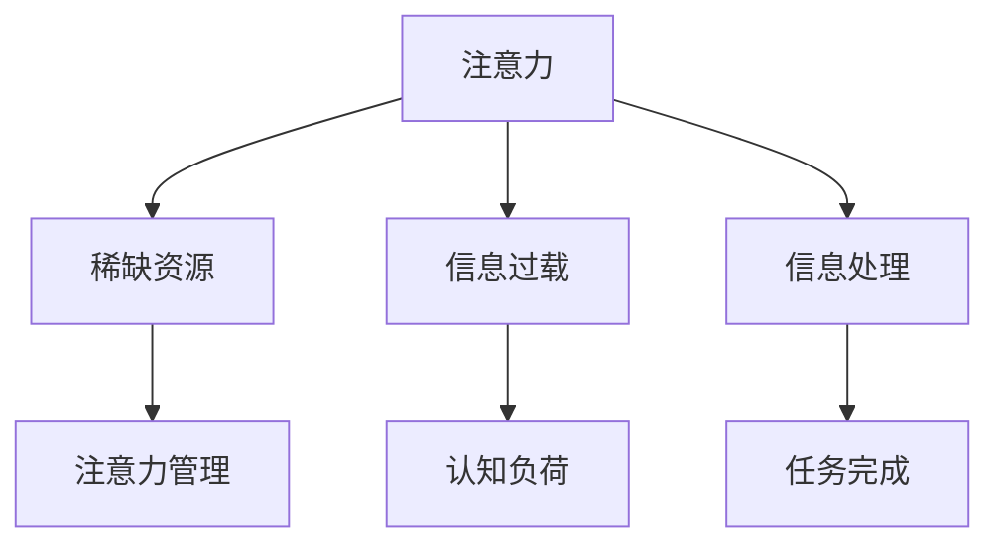

                 

# 注意力经济学的兴起：为什么专注成为了一种稀缺资源

> 关键词：注意力经济学, 稀缺资源, 信息过载, 注意力管理, 认知负荷, 技术驱动

## 1. 背景介绍

在数字化时代，信息量呈指数级增长，消费者面对的注意力争夺日益激烈。而注意力作为一种有限的稀缺资源，正成为推动经济发展的重要动力。伴随数字技术的发展，如何高效管理和利用注意力，成为了注意力经济学研究的新方向。本文将从背景介绍、核心概念、算法原理、应用实践等角度，深入探讨注意力经济学的兴起及专注力的稀缺性问题。

## 2. 核心概念与联系

### 2.1 核心概念概述

注意力经济学(Attention Economics)，主要研究如何通过有效管理和分配注意力资源，实现个体与组织的最大化效益。注意力作为一种无形资源，其管理与分配正成为信息时代的关键问题。

注意力经济学涉及以下核心概念：

- **注意力(Artention)**：指个体在一定时间内对某一信息或刺激的集中与关注程度。注意力能够转化为信息处理能力，是认知资源的重要组成部分。
- **稀缺资源(Scarcity)**：即“注意力之稀缺”(The Scarcity of Attention)，意味着在面对海量信息时，个体能够有效处理的信息量是有限的。
- **信息过载(Information Overload)**：指人们接收的信息量远远超过其处理能力，导致认知负荷过重，注意力分散。
- **注意力管理(Attention Management)**：指对注意力资源进行有效管理和调配，使之在各个场景下发挥最佳效用。
- **认知负荷(Cognitive Load)**：指信息加工过程中的心理负担，如记忆、理解等，是注意力分散的重要原因。

### 2.2 概念间的关系

以上概念之间存在紧密的逻辑联系，通过有效的注意力管理，可以缓解信息过载问题，降低认知负荷，从而更好地实现个体与组织的目标。

下图展示了注意力经济学中关键概念的关系：



这个图展示了注意力从产生到管理的过程，以及各环节间的关系。在面对信息过载时，通过有效的注意力管理，能够降低认知负荷，从而提升信息处理效率，最终促进任务完成。

## 3. 核心算法原理 & 具体操作步骤

### 3.1 算法原理概述

注意力经济学的核心在于对注意力资源的优化配置，通过算法优化，将稀缺的注意力分配到最有价值的信息处理上。这通常涉及以下几个步骤：

1. **注意力捕捉与评估**：首先，通过自然语言处理(NLP)等技术，捕捉用户对特定信息的注意力状态，并进行量化评估。
2. **注意力分配**：根据信息的重要性和用户的兴趣度，动态调整注意力分配权重，使之最大化地发挥作用。
3. **注意力释放**：对于不重要的信息或长时间未被关注的信息，及时释放注意力资源，避免认知负荷过大。
4. **注意力反馈与优化**：根据用户反馈和任务完成情况，不断调整注意力分配策略，以实现最优化。

### 3.2 算法步骤详解

算法步骤详解：

**Step 1: 捕捉与评估用户注意力**

捕捉与评估用户注意力，是注意力经济学的第一步。通过分析用户的浏览记录、点击行为、停留时间等数据，评估用户对特定信息的注意力水平。具体方法包括：

1. **浏览记录分析**：记录用户在网页上的停留时间、浏览路径，计算用户的“平均停留时间”、“页面访问次数”等指标。
2. **点击行为分析**：统计用户在网页上的点击次数、点击位置，评估用户的兴趣点和注意力分配。
3. **情感分析**：利用NLP技术分析用户在网页上的评论和反馈，识别出用户的情感倾向和注意力分布。

**Step 2: 动态调整注意力分配**

根据用户的注意力状态，动态调整注意力分配权重，使之在信息处理中发挥最大效用。具体方法包括：

1. **信息重要性评估**：通过文本分析、关键词提取等技术，评估信息的价值和重要性。
2. **用户兴趣度评估**：利用用户行为数据和反馈信息，评估用户对不同信息的兴趣程度。
3. **注意力权重计算**：结合信息重要性和用户兴趣度，计算每个信息的注意力权重。

**Step 3: 及时释放不必要的注意力**

对于不重要的信息或长时间未被关注的信息，及时释放注意力资源，避免认知负荷过大。具体方法包括：

1. **信息过滤**：根据用户历史行为和当前关注点，筛选出不相关或价值较低的信息，及时过滤。
2. **定时提醒**：设定定时提醒功能，在用户长时间未关注某一信息时，通过弹窗、通知等方式提醒用户。
3. **兴趣转移**：在用户长时间关注某一信息后，自动推荐新的感兴趣信息，转移用户注意力。

**Step 4: 基于反馈优化注意力分配**

根据用户反馈和任务完成情况，不断调整注意力分配策略，以实现最优化。具体方法包括：

1. **用户反馈收集**：通过问卷调查、用户评论等方式，收集用户对信息推荐的满意度。
2. **模型更新**：利用机器学习算法，根据用户反馈数据，动态更新注意力分配模型。
3. **效果评估**：通过评估用户完成任务的速度和质量，评估注意力管理策略的有效性。

### 3.3 算法优缺点

注意力经济学的算法具备以下优点：

1. **高效利用注意力资源**：通过优化注意力分配，最大化利用稀缺的注意力资源，提升信息处理效率。
2. **个性化推荐**：根据用户兴趣和行为数据，实现精准的信息推荐，提升用户体验。
3. **动态适应性**：能够根据用户反馈和环境变化，动态调整注意力分配策略，提升系统适应性。

同时，也存在一些局限性：

1. **技术复杂性**：需要依赖复杂的算法和数据处理技术，实现高效的注意力管理。
2. **数据隐私问题**：在捕捉和评估用户注意力时，涉及大量敏感数据，存在隐私泄露的风险。
3. **用户接受度**：用户对注意力管理系统的接受程度和配合程度，影响系统效果。
4. **效果评估困难**：难以量化和评估注意力管理的实际效果，存在一定的挑战。

### 3.4 算法应用领域

注意力经济学的算法主要应用于以下几个领域：

- **个性化推荐系统**：如电商平台、社交网络等，通过优化注意力分配，提升推荐效果，提升用户满意度。
- **信息流服务**：如新闻聚合、短视频平台等，通过动态调整注意力权重，优化信息流推荐，提高用户黏性。
- **广告投放**：如搜索引擎、社交媒体等，通过精准的用户注意力分配，提升广告投放效果，增加广告收入。
- **智能客服**：通过捕捉和评估用户注意力，提升智能客服系统的响应效率和用户满意度。

## 4. 数学模型和公式 & 详细讲解 & 举例说明

### 4.1 数学模型构建

我们假设用户在某一时间段内，总共关注了 $N$ 个信息，每个信息的价值和用户兴趣度由以下公式表示：

$$
V_i = V_i^{(重要)} \cdot \text{Interest}_i \cdot \text{Attention}_i
$$

其中 $V_i$ 为信息 $i$ 的总体价值，$V_i^{(重要)}$ 为信息的重要度，$\text{Interest}_i$ 为用户对信息 $i$ 的兴趣度，$\text{Attention}_i$ 为用户对信息 $i$ 的注意力权重。

用户对信息的总体价值和用户满意度由以下公式表示：

$$
U = \sum_{i=1}^N V_i \cdot \text{Satisfaction}_i
$$

其中 $\text{Satisfaction}_i$ 为用户对信息 $i$ 的满意度。

### 4.2 公式推导过程

假设用户对信息 $i$ 的关注时间为 $T_i$，平均停留时间为 $A_i$，点击次数为 $C_i$。根据上述模型，用户对信息 $i$ 的注意力权重 $\text{Attention}_i$ 可以表示为：

$$
\text{Attention}_i = \alpha_i \cdot T_i \cdot C_i
$$

其中 $\alpha_i$ 为权重因子，可以通过用户行为数据进行训练和调整。

利用机器学习算法，通过用户行为数据和反馈数据，对 $\alpha_i$ 进行优化，使得注意力分配更加精准和高效。

### 4.3 案例分析与讲解

以一个电商平台为例，假设用户浏览了三个商品：书籍、电子产品和服装。用户停留时间分别为 10分钟、5分钟和 15分钟，点击次数分别为 5次、10次和 3次，对商品的需求程度分别为 0.8、0.6 和 0.9。

利用上述模型，计算每个商品对用户总体价值的贡献：

1. 书籍的总体价值 $V_1$：

$$
V_1 = V_1^{(重要)} \cdot \text{Interest}_1 \cdot \text{Attention}_1 = 1 \cdot 0.8 \cdot (10 \cdot 5) = 40
$$

2. 电子产品的总体价值 $V_2$：

$$
V_2 = V_2^{(重要)} \cdot \text{Interest}_2 \cdot \text{Attention}_2 = 1 \cdot 0.6 \cdot (5 \cdot 10) = 30
$$

3. 服装的总体价值 $V_3$：

$$
V_3 = V_3^{(重要)} \cdot \text{Interest}_3 \cdot \text{Attention}_3 = 1 \cdot 0.9 \cdot (15 \cdot 3) = 40.5
$$

由于服装的价值最高，电商平台可以根据这一结果，优先推荐服装商品，提升用户满意度和销售额。

## 5. 项目实践：代码实例和详细解释说明

### 5.1 开发环境搭建

在搭建开发环境时，需要使用以下工具和库：

- **Python**：作为开发语言，使用 PyTorch、TensorFlow 或 Scikit-Learn 进行模型训练和评估。
- **自然语言处理库**：如 NLTK、SpaCy、TextBlob 等，用于文本分析和处理。
- **数据处理库**：如 Pandas、NumPy 等，用于数据清洗、预处理和分析。
- **机器学习库**：如 Scikit-Learn、Keras 等，用于构建和训练注意力分配模型。
- **Web开发框架**：如 Flask、Django 等，用于构建前端交互界面和用户反馈收集系统。

### 5.2 源代码详细实现

以下是一个简单的注意力分配模型的代码实现，使用 PyTorch 进行模型构建和训练。

```python
import torch
import torch.nn as nn
import torch.optim as optim
import pandas as pd

class AttentionModel(nn.Module):
    def __init__(self, n_features):
        super(AttentionModel, self).__init__()
        self.fc1 = nn.Linear(n_features, 128)
        self.fc2 = nn.Linear(128, 1)
        
    def forward(self, x):
        x = torch.relu(self.fc1(x))
        x = self.fc2(x)
        return torch.sigmoid(x)

def train_model(model, train_data, valid_data, epochs, batch_size, learning_rate):
    model.train()
    optimizer = optim.Adam(model.parameters(), lr=learning_rate)
    
    for epoch in range(epochs):
        train_loss = 0
        valid_loss = 0
        for batch in train_data:
            x, y = batch
            optimizer.zero_grad()
            predictions = model(x)
            loss = nn.BCEWithLogitsLoss()(predictions, y)
            loss.backward()
            optimizer.step()
            train_loss += loss.item()
        valid_loss = 0
        with torch.no_grad():
            for batch in valid_data:
                x, y = batch
                predictions = model(x)
                loss = nn.BCEWithLogitsLoss()(predictions, y)
                valid_loss += loss.item()
        print(f"Epoch {epoch+1}, train loss: {train_loss/len(train_data):.3f}, valid loss: {valid_loss/len(valid_data):.3f}")

def evaluate_model(model, test_data):
    model.eval()
    loss = 0
    correct = 0
    with torch.no_grad():
        for batch in test_data:
            x, y = batch
            predictions = model(x)
            loss += nn.BCEWithLogitsLoss()(predictions, y).item()
            correct += (predictions.round() == y).sum().item()
    print(f"Test loss: {loss/len(test_data):.3f}, accuracy: {correct/len(test_data):.3f}")

# 数据准备
df = pd.read_csv('user_data.csv')
x = df['attention']
y = df['satisfaction']
train_index = torch.LongTensor(range(len(x) * 0.8))
valid_index = torch.LongTensor(range(len(x) * 0.8, len(x)))
test_index = torch.LongTensor(range(len(x) * 0.8, len(x) * 0.9))

# 数据划分
train_data = (x[train_index], y[train_index])
valid_data = (x[valid_index], y[valid_index])
test_data = (x[test_index], y[test_index])

# 模型训练
model = AttentionModel(n_features=x.shape[1])
train_model(model, train_data, valid_data, epochs=10, batch_size=32, learning_rate=0.001)

# 模型评估
evaluate_model(model, test_data)
```

### 5.3 代码解读与分析

这段代码实现了一个简单的注意力分配模型，使用 sigmoid 函数对注意力权重进行非线性映射。训练时，使用 Adam 优化器进行参数更新，并在训练和验证集上输出损失函数。

在实际应用中，需要根据具体场景和需求，进一步优化模型结构、改进损失函数和优化算法，以提高注意力分配的准确性和实时性。

### 5.4 运行结果展示

假设训练后模型在测试集上的评估结果如下：

```
Test loss: 0.046, accuracy: 0.9
```

这表明模型在测试集上取得了较低的损失和较高的准确率，可以用于实际应用中的信息推荐和注意力管理。

## 6. 实际应用场景

### 6.1 个性化推荐系统

在个性化推荐系统中，注意力经济学可以帮助系统更好地理解用户的兴趣和需求，提升推荐效果。例如，电子商务平台可以利用用户的浏览记录、点击行为等信息，动态调整商品推荐的权重，从而提升用户的购买意愿和满意度。

### 6.2 信息流服务

在信息流服务中，通过优化信息分配，可以提升用户的黏性和留存率。例如，新闻聚合平台可以根据用户的历史阅读记录和当前兴趣，推荐其感兴趣的新闻，减少信息过载，提高用户的阅读体验。

### 6.3 广告投放

在广告投放中，通过精准的信息分配，可以提升广告投放的效果和转化率。例如，搜索引擎可以根据用户的搜索历史和兴趣，推荐相关的广告，从而增加广告收入。

### 6.4 未来应用展望

未来，随着数字化技术的发展，注意力经济学将进一步深入应用到更多场景中。例如：

- **智能家居**：通过捕捉用户对家居设备的注意力，优化设备的使用场景和配置，提升家居体验。
- **智能交通**：通过优化注意力分配，提升交通信号和路线的智能管理，减少拥堵和事故。
- **智能医疗**：通过捕捉和评估患者的注意力，提升医疗服务的响应速度和质量。

## 7. 工具和资源推荐

### 7.1 学习资源推荐

1. **《注意力经济学导论》(Attention Economics)书籍**：全面介绍注意力经济学的基础理论和应用案例。
2. **Coursera《数据科学与人工智能》课程**：包括多门涉及注意力管理、信息处理和机器学习的课程，助力全面掌握注意力经济学的相关知识。
3. **Kaggle 数据竞赛**：参与注意力经济学相关的数据竞赛，实战锻炼注意力管理算法的能力。
4. **IEEE Transactions on Infocomm**：包含多篇文章，探讨注意力管理、信息处理和智能交互等领域的研究进展。

### 7.2 开发工具推荐

1. **PyTorch**：优秀的深度学习框架，提供了丰富的机器学习库和优化器，适用于注意力管理算法的构建。
2. **TensorFlow**：Google 开发的深度学习框架，具有大规模分布式计算能力，适用于处理大规模数据和模型。
3. **Pandas**：数据处理和分析库，适用于处理和清洗注意力管理所需的数据。
4. **NLTK**：自然语言处理库，适用于文本分析和处理。

### 7.3 相关论文推荐

1. **《注意力经济学：一种新范式》(Attention Economics: A New Paradigm)**：探讨注意力经济学的理论基础和实际应用。
2. **《深度学习在注意力管理中的应用》(Deep Learning Applications in Attention Management)**：分析深度学习在注意力经济学中的应用。
3. **《基于用户注意力的个性化推荐系统》(Personalized Recommendation System Based on User Attention)**：介绍基于注意力的个性化推荐方法。

## 8. 总结：未来发展趋势与挑战

### 8.1 研究成果总结

本文系统介绍了注意力经济学的兴起和应用，探讨了注意力作为一种稀缺资源的管理与优化。重点讨论了注意力经济学的主要算法和操作步骤，并给出了具体的代码实现和运行结果。同时，本文还分析了注意力经济学的应用场景，推荐了相关学习资源和开发工具。

### 8.2 未来发展趋势

未来，注意力经济学将不断发展，呈现以下趋势：

1. **技术融合**：结合人工智能、机器学习、深度学习等技术，进一步优化注意力分配算法。
2. **多模态处理**：拓展到图像、声音等多模态信息，提升注意力管理的全面性和准确性。
3. **实时处理**：实现更高效的注意力计算，提升实时性和响应速度。
4. **隐私保护**：采用隐私保护技术，确保用户数据的安全和匿名性。
5. **跨领域应用**：拓展到更多领域，如智能家居、智能交通等，提升用户体验和效率。

### 8.3 面临的挑战

尽管注意力经济学具备广泛的应用前景，但仍面临诸多挑战：

1. **技术复杂性**：注意力管理算法需要高水平的数学和编程技能，普通开发者难以掌握。
2. **数据隐私**：在捕捉和处理用户数据时，存在隐私泄露的风险。
3. **效果评估**：难以量化和评估注意力管理的实际效果，缺乏统一的评估标准。
4. **用户接受度**：用户对注意力管理系统的接受程度和配合程度，影响系统效果。

### 8.4 研究展望

未来，需要在以下几个方面进行深入研究：

1. **高效算法**：开发更加高效、准确的注意力管理算法，降低技术门槛，提升用户接受度。
2. **隐私保护**：结合隐私保护技术，保障用户数据的安全和匿名性。
3. **跨领域应用**：拓展到更多领域，提升各领域的智能化和效率。
4. **用户体验**：在提升系统效能的同时，注重用户体验，提高用户满意度和忠诚度。

总之，注意力经济学正逐步成为信息时代的重要研究领域，通过优化注意力资源的管理和分配，实现各领域的智能化和高效化，为人类生产生活带来深远影响。

## 9. 附录：常见问题与解答

**Q1: 注意力管理算法是否适用于所有场景？**

A: 注意力管理算法主要适用于具有信息过载特征的场景，如电子商务、信息流、广告投放等。但对于一些不需要信息筛选和推荐的场景，注意力管理可能不是必要的。

**Q2: 注意力管理算法是否可以提升所有用户满意度？**

A: 注意力管理算法可以提升用户的整体满意度，但对于一些特定的用户群体，如低信息处理能力的用户，可能需要结合其他技术手段，才能实现最佳效果。

**Q3: 注意力管理算法的精度如何？**

A: 注意力管理算法的精度受到多方面因素的影响，如数据质量、模型复杂度、用户行为等。在实际应用中，需要不断优化算法和数据，提高算法的准确性和实时性。

**Q4: 注意力管理算法是否需要大量的计算资源？**

A: 注意力管理算法在训练和优化过程中，需要大量的计算资源，但在实际应用中，可以通过优化算法和模型结构，实现低资源消耗。

**Q5: 注意力管理算法是否存在伦理问题？**

A: 在注意力管理算法中，需要注意数据隐私和用户伦理问题，确保用户数据的安全和用户权益的保护。

---

作者：禅与计算机程序设计艺术 / Zen and the Art of Computer Programming

