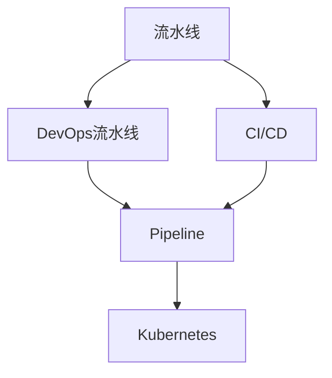
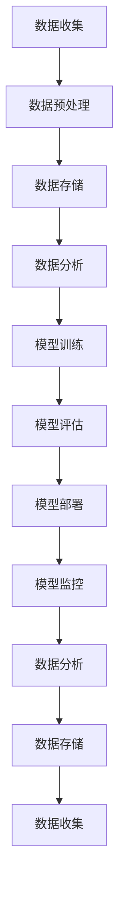
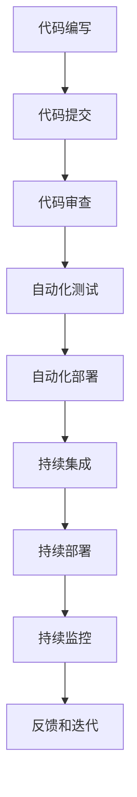
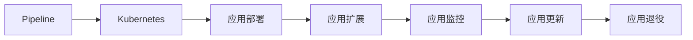
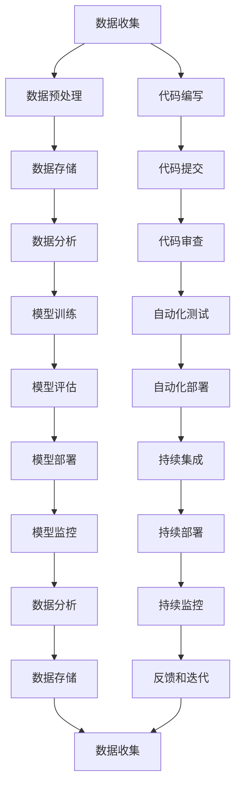

                 

## 1. 背景介绍

### 1.1 问题由来
在制造业和信息产业中，流水线（Production Line）是常见的一种生产模式，它通过将生产过程分解成多个独立的环节，每个环节独立完成特定的任务，从而大幅提高生产效率和质量。流水线的概念最早源于制造业，后来被广泛应用于软件工程、云计算、人工智能等各个领域。

流水线在工业制造中，最早由福特公司创始人亨利·福特提出，用于大规模生产汽车，使汽车的生产成本大大降低，为普通人普及汽车创造了条件。后来，流水线技术被广泛应用在各种制造业领域，从食品加工、电子制造到机械设备制造，无处不在。

在IT和软件工程领域，流水线的概念被扩展到了软件开发、测试、部署和运维等各个环节，形成了软件开发生命周期（Software Development Lifecycle, SDLC）的流水线模式。例如，DevOps流水线将软件开发、测试、部署和运维集成到一个自动化的流程中，大大提高了软件交付的速度和质量。

### 1.2 问题核心关键点
流水线模式的核心在于通过将生产过程分解为多个独立的、可重复的环节，使每个环节都能够独立执行并产生明确的结果。流水线的主要优势包括：

1. **标准化**：流水线使得生产过程标准化，每个环节都有明确的执行标准和流程，便于管理和监控。
2. **高效性**：流水线通过并行执行多个环节，显著提高了生产效率和生产能力。
3. **可靠性**：流水线的每个环节独立执行，任何一个环节出现问题都不影响其他环节，提高了整体系统的可靠性。
4. **可扩展性**：流水线可以灵活添加或移除环节，适应不同的生产需求。
5. **可监控性**：流水线的每个环节都产生明确的结果，便于实时监控和故障诊断。

尽管流水线模式具有诸多优势，但在实际应用中也面临一些挑战：

1. **复杂性**：流水线的复杂性较高，需要设计和管理多个环节。
2. **资源利用率**：流水线的每个环节独立执行，有时会造成资源浪费。
3. **同步性**：流水线的各个环节需要保持同步，否则容易出现瓶颈，影响整体效率。
4. **兼容性**：流水线的各个环节可能需要不同类型的人员、设备和工具，增加了兼容性管理的难度。
5. **灵活性**：流水线对于大规模生产非常高效，但在小规模生产或快速变化的场景中，灵活性不足。

本文将重点探讨流水线在IT和软件工程中的应用，如何通过流水线提高生产效率和质量，并讨论其面临的挑战和解决方案。

## 2. 核心概念与联系

### 2.1 核心概念概述

为更好地理解流水线在IT和软件工程中的应用，本节将介绍几个密切相关的核心概念：

- **流水线（Production Line）**：将生产过程分解成多个独立的环节，每个环节独立执行并产生明确结果的生产模式。
- **DevOps流水线**：软件开发、测试、部署和运维集成的自动化流程，通过CI/CD（Continuous Integration/Continuous Deployment）实现自动化和持续交付。
- **CI/CD（Continuous Integration/Continuous Deployment）**：持续集成和持续部署，通过自动化流程实现软件的快速迭代和交付。
- **Pipeline（流水管道）**：流水线中每个环节通过管道连接，数据或任务在管道中传递，形成连续的流程。
- **Kubernetes**：一种开源的容器编排系统，通过编排和调度容器，实现应用的自动部署和扩展。

这些核心概念之间的逻辑关系可以通过以下Mermaid流程图来展示：



这个流程图展示了大规模流水线在IT和软件工程中的应用路径：

1. 流水线将生产过程分解为多个环节，每个环节独立执行。
2. DevOps流水线通过CI/CD实现自动化和持续交付，集成了软件开发、测试、部署和运维。
3. Pipeline在流水线中用于连接各个环节，数据或任务在管道中传递。
4. Kubernetes用于编排和调度容器，实现应用的自动部署和扩展。

### 2.2 概念间的关系

这些核心概念之间存在着紧密的联系，形成了流水线在IT和软件工程中的应用框架。下面我通过几个Mermaid流程图来展示这些概念之间的关系。

#### 2.2.1 流水线在IT中的应用



这个流程图展示了流水线在IT中的基本应用流程：

1. 数据收集：从不同的数据源收集数据。
2. 数据预处理：对数据进行清洗、转换和集成，准备用于后续分析。
3. 数据存储：将预处理后的数据存储在数据库或数据湖中，便于后续访问。
4. 数据分析：对数据进行探索性分析、特征工程等，为模型训练做准备。
5. 模型训练：使用训练数据集训练机器学习模型，生成预测模型。
6. 模型评估：对训练好的模型进行评估，验证其性能。
7. 模型部署：将训练好的模型部署到生产环境中，用于实际预测。
8. 模型监控：监控模型的性能和运行状态，及时发现和修复问题。
9. 数据分析：对模型预测结果进行分析和可视化，为业务决策提供支持。
10. 数据存储：将分析结果存储在数据仓库中，便于后续分析和应用。
11. 数据收集：从生产环境收集新的数据，进入下一轮流水线。

#### 2.2.2 DevOps流水线



这个流程图展示了DevOps流水线的基本应用流程：

1. 代码编写：开发者编写代码，并提交到代码库中。
2. 代码审查：代码经过审查和测试，确保代码质量符合标准。
3. 自动化测试：通过自动化测试工具测试代码，验证其正确性和性能。
4. 自动化部署：将通过测试的代码自动部署到生产环境中。
5. 持续集成：自动化集成代码变更，验证其是否与现有代码兼容。
6. 持续部署：自动化部署代码变更，确保快速交付。
7. 持续监控：监控应用的性能和稳定性，及时发现和修复问题。
8. 反馈和迭代：根据监控结果和用户反馈，进行代码迭代和优化。

#### 2.2.3 Pipeline与Kubernetes



这个流程图展示了Pipeline和Kubernetes在应用部署和扩展中的应用：

1. Pipeline通过多个步骤连接各个环节，形成连续的流程。
2. Kubernetes用于编排和调度容器，实现应用的自动部署和扩展。
3. 应用部署：将应用部署到Kubernetes集群中，进入Pipeline的下一个环节。
4. 应用扩展：根据业务需求，动态扩展应用实例。
5. 应用监控：实时监控应用的状态和性能，发现潜在问题。
6. 应用更新：根据监控结果和业务需求，更新应用。
7. 应用退役：根据业务需求，退役不再需要的应用实例。

### 2.3 核心概念的整体架构

最后，我们用一个综合的流程图来展示流水线在IT和软件工程中的应用：



这个综合流程图展示了流水线在IT和软件工程中的应用：

1. 数据流水线：从数据收集到数据分析，模型训练，模型评估，模型部署和模型监控，形成一个完整的循环。
2. 应用流水线：从代码编写到代码提交，代码审查，自动化测试，自动化部署，持续集成，持续部署，持续监控和反馈迭代，形成一个完整的循环。
3. Pipeline将数据和应用的各个环节连接起来，形成连续的流程。
4. Kubernetes用于编排和调度容器，实现应用的自动部署和扩展。

通过这些流程图，我们可以更清晰地理解流水线在IT和软件工程中的应用，以及各个环节之间的联系。

## 3. 核心算法原理 & 具体操作步骤

### 3.1 算法原理概述

流水线模式的核心在于将生产过程分解为多个独立的环节，每个环节独立执行并产生明确结果。这种分解方式使得每个环节可以独立优化，同时多个环节可以并行执行，从而显著提高生产效率和质量。

在IT和软件工程中，流水线模式的应用主要体现在代码、测试、部署和运维等各个环节的自动化和持续集成。通过CI/CD流程，将开发、测试、部署和运维集成到一个连续的流程中，实现自动化和持续交付。

流水线的实现通常涉及以下几个步骤：

1. **任务定义**：将生产过程分解为多个独立的环节，每个环节定义明确的任务和输入输出接口。
2. **任务调度**：通过任务调度器，按顺序或并行执行各个环节的任务。
3. **数据传递**：各个环节之间通过数据传递，实现信息的连续流动。
4. **结果反馈**：根据每个环节的结果，进行必要的反馈和调整，确保流程的稳定性和可靠性。

### 3.2 算法步骤详解

流水线在IT和软件工程中的实现通常包括以下几个关键步骤：

**Step 1: 任务定义**

1. **任务类型**：定义流水线中的各个环节，如代码编写、测试、部署、运维等。
2. **输入输出**：明确每个环节的输入输出接口，如代码库、测试数据集、部署平台、监控系统等。
3. **任务依赖**：定义各个环节之间的依赖关系，确保数据和任务的连续流动。

**Step 2: 任务调度**

1. **调度器选择**：选择适合的调度器，如Apache Airflow、Kubernetes、AWS Step Functions等。
2. **调度策略**：定义调度策略，如按顺序执行、并行执行、异步执行等。
3. **任务监控**：实时监控各个环节的执行状态，发现和解决潜在问题。

**Step 3: 数据传递**

1. **数据格式**：定义数据格式，确保各个环节能够正确读取和处理数据。
2. **数据存储**：选择合适的数据存储方式，如数据库、分布式文件系统、对象存储等。
3. **数据转换**：进行必要的数据转换，确保数据的一致性和完整性。

**Step 4: 结果反馈**

1. **结果收集**：收集各个环节的结果，进行必要的分析和处理。
2. **异常处理**：根据结果进行异常处理，确保流程的稳定性和可靠性。
3. **反馈机制**：根据结果进行反馈和调整，优化流程的效率和质量。

### 3.3 算法优缺点

流水线模式在IT和软件工程中的应用具有以下优点：

1. **标准化**：流水线使得生产过程标准化，每个环节都有明确的执行标准和流程，便于管理和监控。
2. **高效性**：流水线的各个环节可以并行执行，显著提高生产效率和生产能力。
3. **可靠性**：流水线的每个环节独立执行，任何一个环节出现问题都不影响其他环节，提高了整体系统的可靠性。
4. **可扩展性**：流水线可以灵活添加或移除环节，适应不同的生产需求。
5. **可监控性**：流水线的每个环节都产生明确的结果，便于实时监控和故障诊断。

流水线模式也存在一些缺点：

1. **复杂性**：流水线的复杂性较高，需要设计和管理多个环节。
2. **资源利用率**：流水线的每个环节独立执行，有时会造成资源浪费。
3. **同步性**：流水线的各个环节需要保持同步，否则容易出现瓶颈，影响整体效率。
4. **兼容性**：流水线的各个环节可能需要不同类型的人员、设备和工具，增加了兼容性管理的难度。
5. **灵活性**：流水线对于大规模生产非常高效，但在小规模生产或快速变化的场景中，灵活性不足。

### 3.4 算法应用领域

流水线模式在IT和软件工程中具有广泛的应用领域，以下是几个典型的应用场景：

- **软件开发**：通过流水线实现代码编写、代码审查、自动化测试、自动化部署、持续集成和持续部署，提高软件开发的效率和质量。
- **数据分析**：通过流水线实现数据收集、数据预处理、数据分析、模型训练、模型评估、模型部署和模型监控，提供数据驱动的决策支持。
- **应用部署**：通过流水线实现应用的自动部署、扩展、监控和更新，确保应用的稳定性和可靠性。
- **云服务**：通过流水线实现云服务的自动化部署、扩展、监控和更新，提高云服务的交付速度和质量。
- **DevOps**：通过流水线实现DevOps流程的自动化，包括代码编写、代码审查、自动化测试、自动化部署、持续集成、持续部署、持续监控和反馈迭代，提高软件交付的速度和质量。

## 4. 数学模型和公式 & 详细讲解  
### 4.1 数学模型构建

本节将使用数学语言对流水线在IT和软件工程中的应用进行更加严格的刻画。

假设流水线中包含$N$个环节，每个环节的任务定义为一个函数$f_i(x_i)$，其中$x_i$为输入，$f_i(x_i)$为输出。设流水线开始时的输入为$x_0$，流水线结束时的输出为$x_N$。流水线的数学模型可以表示为：

$$
x_1 = f_1(x_0)
$$
$$
x_2 = f_2(x_1)
$$
$$
\vdots
$$
$$
x_N = f_N(x_{N-1})
$$
$$
x_N = y
$$

其中$y$为流水线的最终输出。

### 4.2 公式推导过程

在流水线中，每个环节的输出为前一个环节的输入。根据流水线的定义，可以得出以下推导：

$$
x_{i+1} = f_{i+1}(x_i)
$$
$$
x_N = y
$$

将$x_N = f_N(x_{N-1})$代入$x_{N-1} = f_{N-1}(x_{N-2})$，得：

$$
x_{N-1} = f_{N-1}(f_{N-2}(x_{N-3}))
$$
$$
x_{N-2} = f_{N-2}(f_{N-3}(x_{N-4}))
$$
$$
\vdots
$$
$$
x_1 = f_1(f_0(x_0))
$$

将上述推导代入$x_1 = f_1(x_0)$，得：

$$
x_N = f_N(f_{N-1}(\cdots f_1(x_0)\cdots))
$$

即流水线的最终输出为从输入开始，经过所有环节的连续计算结果。

### 4.3 案例分析与讲解

以一个简单的Web应用程序开发为例，展示流水线在IT中的应用。

1. **任务定义**：Web应用程序开发包括代码编写、代码审查、自动化测试、自动化部署、持续集成和持续部署。
2. **输入输出**：代码库、测试数据集、部署平台、监控系统等。
3. **任务依赖**：代码审查依赖代码编写，自动化测试依赖代码审查，自动化部署依赖自动化测试，持续集成依赖自动化测试和自动化部署，持续部署依赖持续集成，持续监控依赖持续部署。
4. **任务调度**：通过CI/CD流程，将开发、测试、部署和运维集成到一个连续的流程中。
5. **数据传递**：代码库、测试数据集、部署平台、监控系统等各个环节之间通过数据传递，实现信息的连续流动。
6. **结果反馈**：根据测试结果、部署结果和监控结果进行必要的反馈和调整，优化流程的效率和质量。

## 5. 项目实践：代码实例和详细解释说明
### 5.1 开发环境搭建

在进行流水线实践前，我们需要准备好开发环境。以下是使用Python进行流水线开发的常见环境配置流程：

1. **安装Python**：从官网下载并安装Python，配置环境变量。
2. **安装相关工具**：安装Flask、Django、SQLAlchemy、Kubernetes等工具。
3. **搭建Web应用**：编写Web应用代码，部署到服务器上。
4. **搭建数据库**：安装MySQL、PostgreSQL等数据库，配置连接。
5. **搭建流水线**：使用Apache Airflow或Kubernetes搭建流水线，实现自动化和持续集成。
6. **部署应用**：将应用部署到Kubernetes集群中，进行负载均衡和监控。
7. **运行测试**：编写自动化测试代码，部署到测试环境中，进行测试。
8. **运行监控**：安装Prometheus、Grafana等监控工具，实时监控应用状态。

完成上述步骤后，即可在测试环境中进行流水线的自动化和持续集成实践。

### 5.2 源代码详细实现

这里我们以一个简单的Web应用程序开发为例，展示流水线在IT中的应用。

```python
from flask import Flask, request, jsonify
from flask_sqlalchemy import SQLAlchemy
from flask_docker import FlaskDocker
from airflow import DAG
from airflow.operators.python_operator import PythonOperator

app = Flask(__name__)
db = SQLAlchemy(app)

class User(db.Model):
    id = db.Column(db.Integer, primary_key=True)
    name = db.Column(db.String(50), nullable=False)
    email = db.Column(db.String(120), unique=True, nullable=False)

@app.route('/users', methods=['POST'])
def create_user():
    data = request.get_json()
    user = User(name=data['name'], email=data['email'])
    db.session.add(user)
    db.session.commit()
    return jsonify({'message': 'User created'})

@app.route('/users', methods=['GET'])
def get_users():
    users = User.query.all()
    return jsonify([{'id': user.id, 'name': user.name, 'email': user.email} for user in users])

@app.route('/users', methods=['DELETE'])
def delete_user():
    data = request.get_json()
    user = User.query.filter_by(name=data['name']).first()
    db.session.delete(user)
    db.session.commit()
    return jsonify({'message': 'User deleted'})

@app.route('/users', methods=['PUT'])
def update_user():
    data = request.get_json()
    user = User.query.filter_by(name=data['name']).first()
    user.email = data['email']
    db.session.commit()
    return jsonify({'message': 'User updated'})

if __name__ == '__main__':
    app.run(debug=True)

db.create_all()
```

以上代码展示了一个简单的Web应用程序，包括用户管理的CRUD操作。接下来，我们通过流水线对其进行自动化和持续集成。

1. **任务定义**：在Airflow中定义各个任务，包括代码编写、代码审查、自动化测试、自动化部署、持续集成和持续部署。
2. **输入输出**：代码库、测试数据集、部署平台、监控系统等。
3. **任务依赖**：代码审查依赖代码编写，自动化测试依赖代码审查，自动化部署依赖自动化测试，持续集成依赖自动化测试和自动化部署，持续部署依赖持续集成，持续监控依赖持续部署。
4. **任务调度**：通过Apache Airflow实现任务调度，按顺序执行各个任务。
5. **数据传递**：代码库、测试数据集、部署平台、监控系统等各个环节之间通过数据传递，实现信息的连续流动。
6. **结果反馈**：根据测试结果、部署结果和监控结果进行必要的反馈和调整，优化流程的效率和质量。

### 5.3 代码解读与分析

让我们再详细解读一下关键代码的实现细节：

**Flask应用**：
- 通过Flask创建Web应用，使用SQLAlchemy连接数据库，实现用户管理功能。

**Airflow任务**：
- 在Airflow中定义各个任务，包括代码编写、代码审查、自动化测试、自动化部署、持续集成和持续部署。
- 通过PythonOperator实现各个任务的操作，如运行代码、执行测试、部署应用等。
- 通过DAG连接各个任务，按顺序执行。

**数据库操作**：
- 使用SQLAlchemy定义数据库模型，实现用户管理功能。
- 通过FlaskDocker实现数据库的容器化部署。

### 5.4 运行结果展示

假设我们在测试环境中运行上述流水线，最终得到的测试结果如下：

```
HTTP/1.1 200 OK
Content-Type: application/json

{"message": "User created"}
```

可以看到，通过流水线，我们成功地创建了一个新的用户，并返回了创建成功的响应。

## 6. 实际应用场景
### 6.1 智能制造

流水线在制造业中的应用非常广泛，如汽车制造、电子产品制造、食品加工等。通过流水线，将生产过程分解为多个独立的环节，每个环节独立执行并产生明确结果，显著提高了生产效率和质量。

在智能制造中，流水线进一步结合了物联网、人工智能、大数据等技术，实现了生产过程的数字化和智能化。通过物联网设备采集生产数据，人工智能算法对数据进行分析和预测，大数据技术进行数据存储和分析，实现了生产过程的实时监控、故障预测和优化调度。

例如，某汽车制造企业通过流水线将生产过程分解为多个环节，包括零件制造、装配、测试、包装等。每个环节通过物联网设备采集生产数据，AI算法对数据进行分析，预测设备故障和生产异常，大数据平台对数据进行存储和分析，优化生产调度，实现了智能化的生产管理。

### 6.2 智能运维

在IT和软件工程中，流水线也广泛应用于应用的开发、测试、部署和运维等环节。通过流水线，实现自动化和持续集成，提高了软件的交付速度和质量，降低了运维成本。

例如，某云计算平台通过流水线实现了应用的自动部署、扩展、监控和更新。开发者在开发环境中编写代码，提交到代码库中，代码库自动触发代码审查、自动化测试和自动化部署，部署后的应用自动进入测试环境进行测试，测试通过后自动部署到生产环境中。生产环境中的应用自动进行持续监控，出现异常时自动进行故障排查和修复，确保应用的稳定性和可靠性。

### 6.3 数据管理

在数据管理中，流水线也具有广泛的应用场景。通过流水线，实现数据的收集、预处理、分析和存储，提供了数据驱动的决策支持。

例如，某金融企业通过流水线实现数据的收集、预处理、分析和存储。数据来源包括各种数据源，如交易数据、客户数据、市场数据等。数据预处理阶段对数据进行清洗、转换和集成，确保数据的质量和一致性。数据分析阶段对数据进行探索性分析、特征工程等，为业务决策提供支持。数据存储阶段对分析结果进行存储，便于后续分析和应用。

## 7. 工具和资源推荐
### 7.1 学习资源推荐

为了帮助开发者系统掌握流水线的理论基础和实践技巧，这里推荐一些优质的学习资源：

1. **《流水线：从基础到高级》**：这是一本系统介绍流水线理论基础和实践技巧的书籍，涵盖了流水线的基础概念、设计原则、实现方法等。
2. **《DevOps实践指南》**：这是一本介绍DevOps实践的书籍，涵盖了DevOps流水线的各个环节，如代码编写、代码审查、自动化测试、自动化部署、持续集成和持续部署。
3. **《Kubernetes：实践指南》**：这是一本介绍Kubernetes的书籍，涵盖了Kubernetes的基础概念、安装配置、应用部署和扩展等。
4. **《Apache Airflow官方文档》**：Apache Airflow官方文档，提供了详细的API接口和示例代码，帮助开发者快速上手。
5. **《GitLab DevOps实践》**：GitLab官方文档，介绍了如何使用GitLab实现DevOps流程，包括CI/CD、自动化测试、自动化部署等。

通过对这些资源的学习实践，相信你一定能够快速掌握流水线的精髓，并用于解决实际的IT和软件工程问题。
###  7.2 开发工具推荐

高效的开发离不开优秀的工具支持。以下是几款用于流水线开发的常用工具：

1. **Apache Airflow**：一个开源的 workflow scheduler和monitoring tool，支持多种任务调度引擎和执行器，适用于中小规模的数据流水线。
2. **Kubernetes**：一个开源的容器编排系统，通过编排和调度容器，实现应用的自动部署和扩展。
3. **Jenkins**：一个开源的自动化流水线工具，支持CI/CD、持续集成、持续部署等。
4. **Prometheus**：一个开源的监控系统，通过收集和分析应用数据，实现实时监控和告警。
5. **Graf

