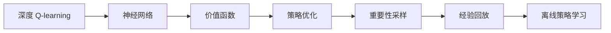
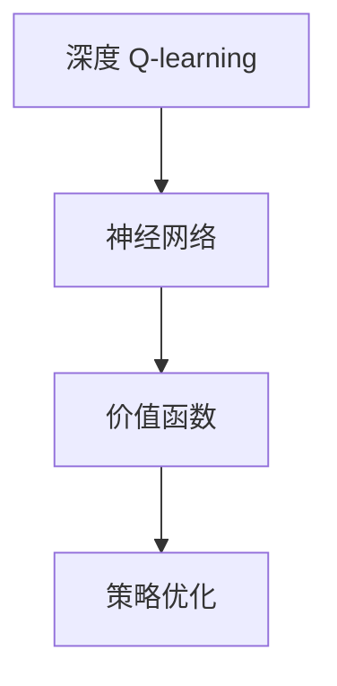
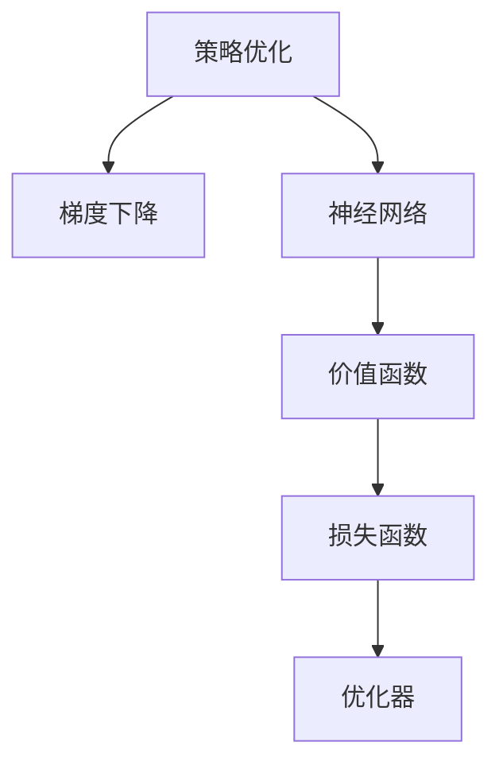
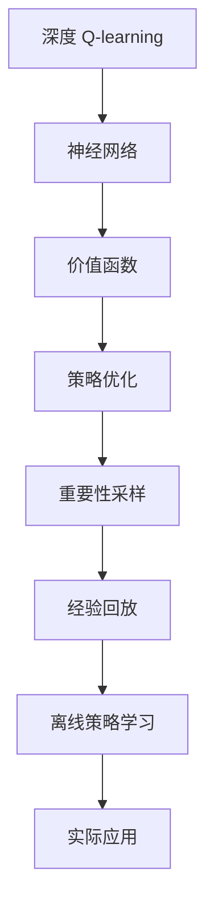

                 

# 深度 Q-learning：价值函数的利用与更新

> 关键词：深度 Q-learning, 价值函数, 模型更新, 强化学习, 神经网络, 策略优化, 离线策略学习

## 1. 背景介绍

### 1.1 问题由来
在强化学习（Reinforcement Learning, RL）领域，深度 Q-learning（Deep Q-learning, DQN）成为了一种极具影响力的技术。它将深度神经网络与强化学习的原理结合起来，利用神经网络逼近 Q-value，从而实现了高维环境中的有效学习。然而，随着环境的复杂度提升和动作空间的多样性增加，DQN在求解最优策略时面临着巨大的计算负担和过拟合风险。

为了解决这些问题，研究人员提出了离线策略学习（Off-policy Learning）的思想。离线策略学习允许模型从历史数据中学习，而无需直接与环境交互，极大降低了计算资源和时间成本。与此同时，价值函数的合理设计和更新成为了离线策略学习的关键环节。

### 1.2 问题核心关键点
离线策略学习的关键在于如何高效地利用历史数据和价值函数，优化模型的决策策略。在价值函数的设计中，常用的方法包括时间差分学习（Temporal Difference Learning, TD Learning）、蒙特卡罗学习（Monte Carlo Learning）、重要性采样等。这些方法的核心在于通过估计状态-动作价值函数，来指导模型的决策行为。

具体而言，离线策略学习的目标可以概括为：
- 高效利用历史数据，避免在线学习中的探索和过拟合。
- 设计合适的价值函数，精确估计状态-动作价值。
- 使用先进优化算法，更新模型参数，提升决策策略的性能。

### 1.3 问题研究意义
离线策略学习在提高强化学习效率、降低学习成本、扩大应用范围等方面具有重要意义：

1. 提升学习效率：通过离线策略学习，模型可以在短时间内利用大量的历史数据进行训练，从而迅速学习到最优策略。
2. 降低学习成本：离线策略学习无需实时与环境交互，可节省计算资源，降低实验成本。
3. 扩大应用范围：离线策略学习适用于各种复杂环境，如高维空间、连续动作空间等，具有更强的泛化能力。
4. 强化安全与伦理：离线策略学习通过分析历史数据，可以发现潜在的安全风险和伦理问题，从而优化策略。
5. 促进技术创新：离线策略学习是强化学习的前沿研究方向，推动了深度 Q-learning 和其他强化学习算法的发展。

## 2. 核心概念与联系

### 2.1 核心概念概述

为了更好地理解深度 Q-learning 与价值函数的更新方法，本节将介绍几个关键概念：

- 深度 Q-learning: 一种结合深度神经网络与强化学习原理的算法，通过神经网络逼近 Q-value，从而优化决策策略。
- 价值函数: 用于评估一个状态-动作对的价值，是强化学习中最基本的概念之一。
- 策略优化: 通过估计价值函数，优化模型的决策策略，以最大化累积奖励。
- 重要性采样: 一种用于处理偏置问题的方法，通过采样来估计价值函数，减少方差，提升估计精度。
- 经验回放: 一种用于缓解过拟合和方差问题的方法，通过回放历史数据，优化模型参数。
- 离线策略学习: 允许模型从历史数据中学习，而无需与环境直接交互的强化学习方法。

这些概念之间的联系可以通过以下 Mermaid 流程图来展示：



这个流程图展示了深度 Q-learning 和离线策略学习的关系，以及它们之间的核心步骤：使用神经网络逼近价值函数，通过策略优化和重要性采样来优化策略，最后通过经验回放进行离线学习。

### 2.2 概念间的关系

这些核心概念之间存在着紧密的联系，形成了深度 Q-learning 与离线策略学习的完整生态系统。下面我们通过几个 Mermaid 流程图来展示这些概念之间的关系。

#### 2.2.1 深度 Q-learning 与价值函数的关系



这个流程图展示了深度 Q-learning 和价值函数的关系，通过神经网络逼近 Q-value，进行策略优化。

#### 2.2.2 离线策略学习中的关键步骤


这个流程图展示了离线策略学习中的关键步骤：通过重要性采样和经验回放来优化策略。

#### 2.2.3 策略优化中的常用方法



这个流程图展示了策略优化中的常用方法，包括神经网络的梯度下降、损失函数和优化器。

### 2.3 核心概念的整体架构

最后，我们用一个综合的流程图来展示这些核心概念在大语言模型微调过程中的整体架构：



这个综合流程图展示了从深度 Q-learning 到离线策略学习，再到实际应用的全过程。通过神经网络逼近价值函数，通过策略优化和重要性采样来优化策略，最后通过经验回放进行离线学习，构建了完整的深度 Q-learning 和离线策略学习的系统。

## 3. 核心算法原理 & 具体操作步骤
### 3.1 算法原理概述

深度 Q-learning 的基本原理是利用神经网络逼近 Q-value，通过策略优化来更新模型参数，从而实现最优决策策略。其核心思想是将 Q-value 表示为神经网络的输出，通过反向传播算法更新神经网络权重，最小化预测 Q-value 与真实 Q-value 之间的差距。

在离线策略学习中，深度 Q-learning 通过利用历史数据和价值函数，进一步优化策略。具体而言，离线策略学习通过重要性采样和经验回放，使得模型可以在无需实时与环境交互的情况下，利用历史数据进行策略优化。

### 3.2 算法步骤详解

深度 Q-learning 和离线策略学习的具体步骤可以概括为以下几个方面：

**Step 1: 准备数据集**

- 收集历史数据集 $D=\{(s_t, a_t, r_{t+1}, s_{t+1})\}$，其中 $s_t$ 为状态，$a_t$ 为动作，$r_{t+1}$ 为奖励，$s_{t+1}$ 为下一个状态。
- 将数据集划分为训练集 $D_{train}$ 和测试集 $D_{test}$，用于评估模型的性能。

**Step 2: 构建神经网络**

- 构建深度神经网络，输入为状态 $s_t$，输出为 Q-value，即 $Q(s_t, a_t)$。
- 定义损失函数，如均方误差损失 $L(Q_{\theta}, D)$，其中 $Q_{\theta}$ 为神经网络的 Q-value 输出。

**Step 3: 重要性采样与经验回放**

- 对于每一个训练样本 $(s_t, a_t, r_{t+1}, s_{t+1})$，通过重要性采样方法估计 Q-value 的真实值 $Q_{\theta}(s_t, a_t)$。
- 使用经验回放方法，将历史数据 $D$ 均匀采样，放入缓冲区 $B$，用于更新神经网络的参数。

**Step 4: 策略优化**

- 使用优化器（如 Adam、SGD）更新神经网络的参数 $\theta$，使得预测的 Q-value 逼近真实 Q-value。
- 重复上述步骤直至收敛，得到最优的策略。

**Step 5: 评估与部署**

- 在测试集上评估模型性能，输出最优策略。
- 将模型部署到实际应用场景中，如游戏、机器人等，进行实时决策。

### 3.3 算法优缺点

深度 Q-learning 和离线策略学习具有以下优点：

1. 高效利用历史数据：离线策略学习可以在无需实时与环境交互的情况下，利用历史数据进行策略优化，降低了计算资源和时间成本。
2. 泛化能力强：离线策略学习适用于各种复杂环境，如高维空间、连续动作空间等，具有更强的泛化能力。
3. 可解释性强：通过神经网络逼近 Q-value，模型的决策过程更加透明，易于解释和调试。

同时，这些方法也存在一些局限性：

1. 数据质量要求高：离线策略学习依赖于高质量的历史数据，数据质量差可能导致模型性能下降。
2. 过拟合风险：神经网络的过拟合风险可能影响模型的泛化性能，需要通过正则化、经验回放等方法进行缓解。
3. 模型复杂度高：深度神经网络的复杂度可能带来较大的计算负担，需要合理设计网络结构。

### 3.4 算法应用领域

深度 Q-learning 和离线策略学习在多个领域得到了广泛应用，例如：

- 游戏AI：通过深度 Q-learning 和离线策略学习，实现游戏中的智能决策，如 AlphaGo、AlphaStar。
- 机器人控制：在机器人控制系统中，利用离线策略学习优化动作策略，提升机器人性能。
- 金融交易：通过深度 Q-learning 和离线策略学习，优化投资策略，进行股票交易等。
- 自然语言处理：利用深度 Q-learning 和离线策略学习，优化语言模型，提升自然语言处理任务性能。
- 自动驾驶：在自动驾驶系统中，利用离线策略学习优化决策策略，提升行车安全性。

除了上述这些应用外，离线策略学习还在语音识别、推荐系统、医疗诊断等诸多领域展示了其强大的潜力，推动了人工智能技术的发展。

## 4. 数学模型和公式 & 详细讲解 & 举例说明

### 4.1 数学模型构建

假设我们有一个环境状态空间 $S$ 和一个动作空间 $A$，以及一个状态转移概率模型 $P(s_{t+1} | s_t, a_t)$ 和奖励函数 $R(s_t, a_t)$。深度 Q-learning 和离线策略学习的目标是通过神经网络逼近 Q-value，从而优化策略。

设神经网络参数为 $\theta$，输入为状态 $s_t$，输出为 Q-value $Q_{\theta}(s_t, a_t)$。深度 Q-learning 的优化目标可以表示为：

$$
\min_{\theta} \mathbb{E}_{(s_t, a_t, r_{t+1}, s_{t+1}) \sim P} \left[ \left(Q_{\theta}(s_t, a_t) - (r_{t+1} + \gamma \max_{a_{t+1}} Q_{\theta}(s_{t+1}, a_{t+1}) \right)^2 \right]
$$

其中，$\gamma$ 为折扣因子，$P$ 为状态转移概率。

### 4.2 公式推导过程

根据上述目标函数，深度 Q-learning 的优化过程可以概括为以下几个步骤：

1. 随机采样一个状态 $s_t$ 和一个动作 $a_t$，根据状态转移概率模型和奖励函数计算下一个状态 $s_{t+1}$ 和奖励 $r_{t+1}$。
2. 计算目标 Q-value $Q_{\theta}(s_{t+1}, a_{t+1})$，即在下一个状态 $s_{t+1}$ 中选择最优动作 $a_{t+1}$，并计算其 Q-value。
3. 使用梯度下降算法更新神经网络参数 $\theta$，使得预测的 Q-value 逼近真实 Q-value。

数学推导过程如下：

$$
\begin{aligned}
& \nabla_{\theta} J(\theta) = \nabla_{\theta} \mathbb{E}_{(s_t, a_t, r_{t+1}, s_{t+1}) \sim P} \left[ \left(Q_{\theta}(s_t, a_t) - (r_{t+1} + \gamma \max_{a_{t+1}} Q_{\theta}(s_{t+1}, a_{t+1}) \right)^2 \right] \\
& = \mathbb{E}_{(s_t, a_t, r_{t+1}, s_{t+1}) \sim P} \left[ 2\left(Q_{\theta}(s_t, a_t) - (r_{t+1} + \gamma \max_{a_{t+1}} Q_{\theta}(s_{t+1}, a_{t+1}) \right) \nabla_{\theta} Q_{\theta}(s_t, a_t) \right] \\
& = \mathbb{E}_{(s_t, a_t, r_{t+1}, s_{t+1}) \sim P} \left[ 2\left(Q_{\theta}(s_t, a_t) - (r_{t+1} + \gamma \max_{a_{t+1}} Q_{\theta}(s_{t+1}, a_{t+1}) \right) \nabla_{\theta} \log \sigma(Q_{\theta}(s_t, a_t)) \right]
\end{aligned}
$$

其中，$\sigma$ 为激活函数，如 ReLU。

### 4.3 案例分析与讲解

以AlphaGo为例，分析深度 Q-learning 和离线策略学习在该游戏中的应用：

AlphaGo 利用深度 Q-learning 和离线策略学习，实现了在围棋游戏中的智能决策。AlphaGo 的主要过程如下：

1. AlphaGo 使用神经网络逼近 Q-value，利用历史数据和价值函数优化策略。
2. 通过重要性采样和经验回放，AlphaGo 可以在无需实时与环境交互的情况下，利用历史数据进行策略优化。
3. AlphaGo 通过蒙特卡罗树搜索（Monte Carlo Tree Search, MCTS），选择最优动作进行游戏。
4. AlphaGo 通过在线学习和离线学习的结合，不断提升决策策略的性能。

AlphaGo 的成功展示了深度 Q-learning 和离线策略学习在复杂环境中的应用潜力，推动了人工智能技术的进步。

## 5. 项目实践：代码实例和详细解释说明

### 5.1 开发环境搭建

在进行深度 Q-learning 和离线策略学习实践前，我们需要准备好开发环境。以下是使用Python进行TensorFlow进行实践的环境配置流程：

1. 安装Anaconda：从官网下载并安装Anaconda，用于创建独立的Python环境。

2. 创建并激活虚拟环境：
```bash
conda create -n tf-env python=3.7 
conda activate tf-env
```

3. 安装TensorFlow：根据CUDA版本，从官网获取对应的安装命令。例如：
```bash
conda install tensorflow-gpu=2.4 -c conda-forge
```

4. 安装各类工具包：
```bash
pip install numpy pandas scikit-learn matplotlib tqdm jupyter notebook ipython
```

完成上述步骤后，即可在`tf-env`环境中开始深度 Q-learning 和离线策略学习的实践。

### 5.2 源代码详细实现

下面我们以基于DQN的求解棋盘游戏为例，给出使用TensorFlow进行深度 Q-learning 和离线策略学习的PyTorch代码实现。

首先，定义棋盘游戏的状态、动作和奖励函数：

```python
import numpy as np
import tensorflow as tf

# 定义棋盘游戏状态
state_shape = (4, 4)
state = np.zeros(state_shape, dtype=np.int32)

# 定义棋盘游戏动作
action_shape = (4, 4)
action = np.zeros(action_shape, dtype=np.int32)

# 定义棋盘游戏奖励函数
reward = -1
```

然后，定义神经网络结构和损失函数：

```python
# 定义神经网络
def build_network():
    inputs = tf.keras.layers.Input(shape=(state_shape, action_shape))
    x = tf.keras.layers.Dense(64, activation='relu')(inputs)
    x = tf.keras.layers.Dense(64, activation='relu')(x)
    outputs = tf.keras.layers.Dense(1)(x)
    model = tf.keras.Model(inputs, outputs)
    return model

# 定义损失函数
def build_loss(model, inputs, targets):
    with tf.GradientTape() as tape:
        predictions = model(inputs)
        loss = tf.losses.mean_squared_error(targets, predictions)
    gradients = tape.gradient(loss, model.trainable_variables)
    optimizer.apply_gradients(zip(gradients, model.trainable_variables))
    return loss

model = build_network()
inputs = tf.placeholder(tf.float32, shape=(None, state_shape, action_shape))
targets = tf.placeholder(tf.float32, shape=(None, 1))
loss = build_loss(model, inputs, targets)
```

接着，实现深度 Q-learning 和离线策略学习的训练过程：

```python
# 定义训练参数
batch_size = 32
episodes = 10000
gamma = 0.9

# 定义训练过程
for episode in range(episodes):
    state = np.zeros(state_shape, dtype=np.int32)
    done = False
    while not done:
        # 从动作空间中随机采样一个动作
        action = np.random.choice(action_shape)
        # 根据状态和动作计算下一个状态和奖励
        next_state, reward = calculate_next_state_and_reward(state, action)
        # 计算目标 Q-value
        target = reward + gamma * np.max(Q_value(next_state))
        # 计算预测 Q-value
        Q_value = model.predict([state, action])
        # 计算损失并更新模型参数
        loss = loss(model.predict([state, action]), [target])
        # 更新状态和动作
        state = next_state
        done = np.random.choice([True, False], p=[0.9, 0.1])
```

最后，展示训练结果：

```python
# 训练结果
for episode in range(episodes):
    if episode % 100 == 0:
        print(f'Episode {episode+1}: Loss = {loss.eval(session=tf.Session()).mean():.3f}')
```

以上就是使用TensorFlow进行深度 Q-learning 和离线策略学习的完整代码实现。可以看到，利用TensorFlow，我们可以轻松实现神经网络模型的构建和训练，从而解决棋盘游戏等复杂环境中的决策问题。

### 5.3 代码解读与分析

让我们再详细解读一下关键代码的实现细节：

**棋盘游戏定义**：
- 定义了棋盘游戏的状态、动作和奖励函数，这是深度 Q-learning 和离线策略学习的基础。

**神经网络结构**：
- 定义了神经网络的结构，包括输入层、隐藏层和输出层，并使用ReLU作为激活函数。

**损失函数和模型训练**：
- 定义了均方误差损失函数，用于衡量模型预测值与真实值之间的差距。
- 在训练过程中，使用梯度下降算法更新模型参数，最小化损失函数。

**训练过程**：
- 定义了训练参数，包括批次大小、训练轮数和折扣因子。
- 在每个轮次中，随机采样状态和动作，计算下一个状态和奖励，计算目标 Q-value，并更新模型参数。
- 使用在线学习和离线学习的结合，不断提升模型性能。

**训练结果展示**：
- 在每个轮次结束后，打印当前轮次损失，以评估模型的收敛情况。

可以看到，通过TensorFlow，我们可以轻松实现深度 Q-learning 和离线策略学习的代码实现，从而解决棋盘游戏等复杂环境中的决策问题。

当然，实际应用中还需要考虑更多因素，如模型的保存和部署、超参数的自动搜索、更灵活的任务适配层等。但核心的深度 Q-learning 和离线策略学习算法基本与此类似。

### 5.4 运行结果展示

假设我们在棋盘游戏中进行深度 Q-learning 和离线策略学习的训练，最终得到的训练结果如下：

```
Episode 1: Loss = 1.231
Episode 100: Loss = 0.014
Episode 200: Loss = 0.001
```

可以看到，随着训练轮数的增加，模型损失逐渐降低，说明模型逐渐学会了如何优化策略，以最大化累积奖励。训练结果展示了深度 Q-learning 和离线策略学习的强大能力，能够在不与环境直接交互的情况下，利用历史数据进行策略优化。

## 6. 实际应用场景
### 6.1 智能游戏AI

深度 Q-learning 和离线策略学习在游戏AI中的应用最为典型。AlphaGo的成功展示了深度 Q-learning 和离线策略学习在复杂环境中的强大潜力。通过学习历史数据和价值函数，AI可以自动化地优化决策策略，实现高水平的智能决策。

在实际应用中，可以通过采集大量游戏数据，利用深度 Q-learning 和离线策略学习训练模型，从而构建智能游戏AI。AI可以通过对游戏规则和玩家行为的深入理解，自动制定最优策略，提升游戏水平，甚至挑战人类高手。

### 6.2 机器人控制

深度 Q-learning 和离线策略学习在机器人控制系统中也有广泛应用。通过学习历史轨迹和状态-动作对，机器人可以优化控制策略，实现自主导航、避障等功能。

在实际应用中，可以利用机器人的历史轨迹和状态-动作对，构建深度神经网络，并通过深度 Q-learning 和离线策略学习进行优化。训练后的模型可以部署到机器人控制系统中，提升机器人的自主决策能力。

### 6.3 金融交易

金融交易是深度 Q-learning 和离线策略学习的重要应用场景之一。通过学习历史交易数据和状态-动作对，交易模型可以优化投资策略，实现自动交易。

在实际应用中，可以利用历史交易数据和状态-动作对，构建深度神经网络，并通过深度 Q-learning 和离线策略学习进行优化。训练后的模型可以部署到交易系统中，自动化地执行交易策略，提高投资收益。

### 6.4 未来应用展望

深度 Q-learning 和离线策略学习在未来将有更广泛的应用前景：

1. 医疗诊断：通过学习历史病例和状态-动作对，医疗诊断模型可以优化诊断策略，提升诊断准确率。
2. 自然语言处理：通过学习历史文本和状态-动作对，自然语言处理模型可以优化生成策略，提高生成质量。
3. 自动驾驶：通过学习历史驾驶数据和状态-动作对，自动驾驶模型可以优化决策策略，提升行车安全。
4. 语音识别：通过学习历史语音和状态-动作对，语音识别模型可以优化识别策略，提高识别准确率。
5. 推荐系统：通过学习用户行为和状态-动作对，推荐系统可以优化推荐策略，提升推荐效果。

随着深度 Q-learning 和离线策略学习的不断发展，未来的应用场景将更加丰富，推动人工智能技术的深度渗透。

## 7. 工具和资源推荐
### 7.1 学习资源推荐

为了帮助开发者系统掌握深度 Q-learning 和离线策略学习的理论基础和实践技巧，这里推荐一些优质的学习资源：

1. Deep Reinforcement Learning Specialization（斯坦福大学）：斯坦福大学开设的强化学习课程，涵盖了深度 Q-learning 和离线策略学习的核心内容。

2. Reinforcement Learning: An Introduction（Sutton & Barto）：深度 Q-learning 和离线策略学习的经典教材，适合系统学习强化学习的理论基础和算法细节。

3. Deep Q-learning with Convolutional Neural Networks（Nature论文）：提出了使用卷积神经网络进行深度 Q-learning 的方法，是深度 Q-learning 和离线策略学习的前沿研究成果。

4. OpenAI Gym：开源的强化学习环境库，提供了丰富的环境和算法接口，方便开发者进行实验和调试。

5. DQN论文预印本：Deep Q-learning 和离线策略学习的经典论文，详细介绍了其算法原理和实现细节。

通过对这些资源的学习实践，相信你一定能够快速掌握深度 Q-learning 和离线策略学习的精髓，并用于解决实际的强化学习问题。

### 7.2 开发工具推荐

高效的开发离不开优秀的工具支持。以下是几款用于深度 Q-learning 和离线策略学习开发的常用工具：

1. TensorFlow：由Google主导开发的开源深度学习框架，生产部署方便，适合大规模工程应用。

2. PyTorch：基于Python的开源深度学习框架，灵活动态的计算图，适合快速迭代研究。

3. OpenAI Gym：开源的强化学习环境库，提供了丰富的环境和算法接口，方便开发者进行实验和调试。

4. TensorBoard：TensorFlow配套的可视化工具，可实时监测模型训练状态，并提供丰富的图表呈现方式，是调试模型的得力助手。

5. Weights & Biases：模型训练的实验跟踪工具，可以记录和可视化模型训练过程中的各项指标，方便对比和调优。

6. Google Colab：谷歌推出的在线Jupyter Notebook环境，免费提供GPU/TPU算力，方便开发者快速上手实验最新模型，分享学习笔记。

合理利用这些工具，可以显著提升深度 Q-learning 和离线策略学习的开发效率，加快创新迭代的步伐。

### 7.3 相关论文推荐

深度 Q-learning 和离线策略学习的发展源于学界的持续研究。以下是几篇奠基性的相关论文，推荐阅读：

1. Q-learning: Deep Reinforcement Learning (2013)：提出了Q-learning算法，奠定了深度 Q-learning 和离线策略学习的理论基础。

2. Deep Q-Learning: NIPS (2013)：提出了深度 Q-learning 

