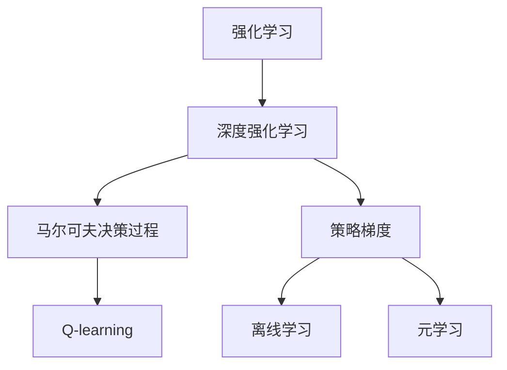
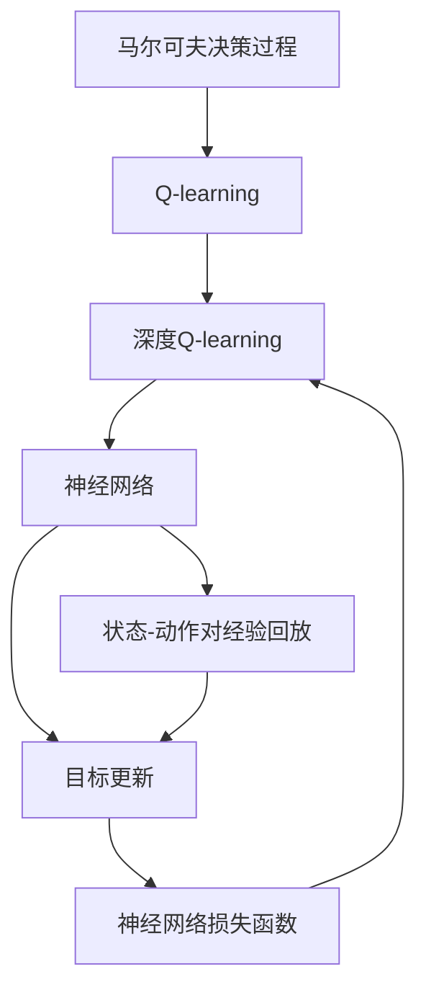
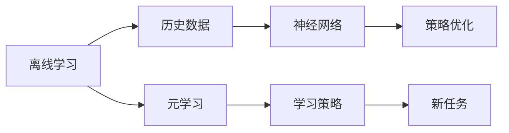

                 

# 深度 Q-learning：优化算法的使用

> 关键词：深度强化学习, Q-learning, 强化学习, 马尔可夫决策过程, 策略梯度, 离线学习, 元学习, 应用场景, 算法优缺点, 未来趋势

## 1. 背景介绍

### 1.1 问题由来

在机器学习和人工智能领域，强化学习（Reinforcement Learning, RL）是一种重要的学习方法。它通过与环境交互，学习如何在特定环境中做出最优决策。深度强化学习（Deep Reinforcement Learning, DRL）则是将深度学习技术应用到强化学习中，通过神经网络对复杂决策过程进行建模。

其中，Q-learning是一种基本的强化学习算法，通过学习Q值（即状态-动作对的价值）来指导决策。然而，传统的Q-learning算法往往依赖于高频率的采样，计算开销大，难以扩展到高维度问题。而深度Q-learning（Deep Q-learning, DQN）则通过深度神经网络，高效地处理高维状态和动作空间，成为解决复杂决策问题的有力工具。

DQN算法自2013年被提出以来，已经在多个领域取得了显著的应用，例如游戏智能、机器人控制、自适应学习等。然而，DQN算法仍然存在一些问题，如样本效率低下、过拟合严重等，需要进一步优化。

本文聚焦于深度Q-learning算法的使用和优化，旨在探讨如何通过优化Q-learning算法，提高其性能和扩展性，从而更好地应用于复杂决策问题。

### 1.2 问题核心关键点

深度Q-learning算法通过神经网络来近似Q值函数，从而解决高维度状态和动作空间中的强化学习问题。其核心思想是利用经验回放和目标更新来训练网络，逼近最优的Q值函数。

具体来说，深度Q-learning算法包括以下几个关键点：

- 状态-动作对经验回放：将采样得到的状态-动作对和相应的奖励存储在经验回放缓冲区中。
- 目标更新：通过神经网络近似Q值函数，并根据经验回放中的数据更新目标Q值。
- 神经网络损失函数：定义损失函数来训练神经网络，使得网络输出的Q值逼近真实Q值。

深度Q-learning算法的目标是最大化长期奖励，通过学习最优策略来实现这一目标。在训练过程中，算法会不断更新神经网络参数，使得其能够更好地处理状态-动作对，从而提高决策性能。

### 1.3 问题研究意义

深度Q-learning算法作为强化学习中的一种重要方法，在解决复杂决策问题上具有显著优势。然而，其存在的问题和挑战仍然需要进一步研究和优化，以适应更广泛的应用场景。

研究深度Q-learning算法的优化方法，不仅有助于提升算法的性能，还能拓展其应用范围，加速人工智能技术的产业化进程。具体来说，研究深度Q-learning算法可以带来以下几方面的意义：

- 提升决策性能：通过优化算法，可以更好地处理高维状态和动作空间，提高决策的准确性和效率。
- 降低学习成本：优化算法可以减少样本开销，提高训练效率，降低计算成本。
- 增强泛化能力：改进算法可以更好地适应新环境和新问题，提高算法的泛化能力。
- 加速应用落地：优化算法可以加速算法在实际应用中的落地，促进技术产业化。

## 2. 核心概念与联系

### 2.1 核心概念概述

为了更好地理解深度Q-learning算法，本节将介绍几个密切相关的核心概念：

- 强化学习（Reinforcement Learning, RL）：一种通过与环境交互学习决策策略的机器学习方法。强化学习通过奖励反馈机制，指导智能体在特定环境中做出最优决策。
- 深度强化学习（Deep Reinforcement Learning, DRL）：将深度学习技术应用到强化学习中，通过神经网络对复杂决策过程进行建模。
- 马尔可夫决策过程（Markov Decision Process, MDP）：一种描述智能体与环境交互的数学模型，包含状态、动作、奖励和转移概率等基本元素。
- Q-learning：一种基于值函数的强化学习算法，通过学习状态-动作对的价值函数来指导决策。
- 策略梯度（Policy Gradient）：一种利用策略参数优化方法，通过梯度下降优化策略函数，从而改进决策性能。
- 离线学习（Off-policy Learning）：一种不需要与环境交互的学习方式，通过存储历史数据进行学习，适用于大规模数据集和复杂环境。
- 元学习（Meta-Learning）：一种通过学习学习策略，实现快速适应新任务的学习方法，适用于新环境和新问题。

这些核心概念之间的逻辑关系可以通过以下Mermaid流程图来展示：



这个流程图展示了大语言模型的核心概念及其之间的关系：

1. 强化学习作为基础，通过与环境交互学习决策策略。
2. 深度强化学习则将深度学习技术应用到强化学习中，提升决策模型的复杂度。
3. 马尔可夫决策过程是强化学习的数学基础，包含状态、动作、奖励和转移概率等基本元素。
4. Q-learning是强化学习中的一种基本算法，通过学习状态-动作对的价值函数来指导决策。
5. 策略梯度是一种利用策略参数优化方法，通过梯度下降优化策略函数。
6. 离线学习是一种不需要与环境交互的学习方式，适用于大规模数据集和复杂环境。
7. 元学习是一种通过学习学习策略，实现快速适应新任务的学习方法。

这些概念共同构成了深度Q-learning算法的理论基础，为其设计和优化提供了指导。

### 2.2 概念间的关系

这些核心概念之间存在着紧密的联系，形成了深度Q-learning算法的完整生态系统。下面我们通过几个Mermaid流程图来展示这些概念之间的关系。

#### 2.2.1 深度Q-learning的整体架构



这个流程图展示了深度Q-learning算法的整体架构：

1. 马尔可夫决策过程是深度Q-learning的基础，用于描述智能体与环境交互。
2. Q-learning是深度Q-learning的核心算法，通过学习状态-动作对的价值函数来指导决策。
3. 深度Q-learning通过神经网络来近似Q值函数，提升算法的性能。
4. 神经网络状态-动作对经验回放和目标更新，实现Q值函数的优化。
5. 神经网络损失函数用于训练神经网络，逼近最优的Q值函数。

#### 2.2.2 离线学习和元学习在大Q-learning中的应用



这个流程图展示了离线学习和元学习在大Q-learning中的应用：

1. 离线学习通过存储历史数据，进行学习，适用于大规模数据集和复杂环境。
2. 元学习通过学习学习策略，实现快速适应新任务，适用于新环境和新问题。
3. 深度Q-learning算法可以利用离线学习和元学习的优势，提升算法的泛化能力。

## 3. 核心算法原理 & 具体操作步骤
### 3.1 算法原理概述

深度Q-learning算法通过神经网络来近似Q值函数，从而解决高维度状态和动作空间中的强化学习问题。其核心思想是利用经验回放和目标更新来训练网络，逼近最优的Q值函数。

具体来说，深度Q-learning算法包括以下几个关键步骤：

1. 将采样得到的状态-动作对和相应的奖励存储在经验回放缓冲区中。
2. 通过神经网络近似Q值函数，并根据经验回放中的数据更新目标Q值。
3. 定义神经网络损失函数，通过梯度下降训练神经网络，使得网络输出的Q值逼近真实Q值。

深度Q-learning算法的目标是最大化长期奖励，通过学习最优策略来实现这一目标。在训练过程中，算法会不断更新神经网络参数，使得其能够更好地处理状态-动作对，从而提高决策性能。

### 3.2 算法步骤详解

深度Q-learning算法的具体步骤包括：

**Step 1: 准备环境与神经网络**

- 选择合适的环境（如游戏、机器人等）进行模拟。
- 设计神经网络结构，并初始化网络参数。

**Step 2: 状态-动作对采样**

- 在环境中进行状态-动作对采样，获取采样结果。
- 将采样结果存储在经验回放缓冲区中。

**Step 3: 神经网络训练**

- 从经验回放缓冲区中随机采样一批状态-动作对。
- 使用神经网络计算Q值，计算目标Q值。
- 根据Q值和目标Q值的差值，计算神经网络损失函数。
- 使用优化算法（如Adam、SGD等）更新神经网络参数。

**Step 4: 策略更新**

- 通过神经网络输出策略，指导智能体在环境中进行决策。
- 根据策略性能，调整学习率和其他超参数。

**Step 5: 目标更新**

- 使用神经网络输出Q值，更新目标Q值。
- 通过经验回放缓冲区中的数据，更新目标Q值。

**Step 6: 迭代更新**

- 重复进行状态-动作对采样、神经网络训练和策略更新，直到达到预设的迭代次数或满足预设的停止条件。

### 3.3 算法优缺点

深度Q-learning算法有以下优点：

1. 能够处理高维状态和动作空间，适用于复杂决策问题。
2. 利用神经网络进行近似，提高了计算效率。
3. 通过经验回放和目标更新，提高了样本效率。

然而，深度Q-learning算法也存在一些缺点：

1. 需要大量的存储空间来存储经验回放缓冲区。
2. 存在过拟合的风险，需要采用正则化等方法缓解。
3. 对于新环境和新问题，需要重新训练模型，增加了训练成本。

### 3.4 算法应用领域

深度Q-learning算法已经在多个领域中得到了应用，包括游戏智能、机器人控制、自适应学习等。以下是几个具体的应用场景：

1. **游戏智能**：在视频游戏中，利用深度Q-learning算法训练智能体，使其能够在复杂的环境中做出最优决策。
2. **机器人控制**：在机器人控制中，通过深度Q-learning算法训练机器人，使其能够自主导航和避障。
3. **自适应学习**：在自适应学习中，利用深度Q-learning算法训练智能体，使其能够快速适应新任务和新环境。

此外，深度Q-learning算法还可以应用于推荐系统、金融预测、交通规划等领域，解决复杂决策问题，提升决策性能。

## 4. 数学模型和公式 & 详细讲解 & 举例说明

### 4.1 数学模型构建

深度Q-learning算法通过神经网络来近似Q值函数，从而解决高维度状态和动作空间中的强化学习问题。

设智能体在环境中的状态为 $s$，动作为 $a$，奖励为 $r$，下一状态为 $s'$。深度Q-learning算法通过神经网络近似Q值函数 $Q(s,a)$，并定义神经网络的输入为 $s$ 和 $a$，输出为 $Q(s,a)$。

深度Q-learning算法的目标是最小化神经网络损失函数 $L$，通过梯度下降训练神经网络，使得网络输出的Q值逼近真实Q值。

### 4.2 公式推导过程

假设神经网络 $Q_{\theta}$ 近似Q值函数 $Q(s,a)$，其中 $\theta$ 为神经网络参数。

神经网络的损失函数 $L$ 定义为：

$$
L = \mathbb{E}_{(s,a,r,s')}\left[(r + \gamma Q_{\theta}(s',a') - Q_{\theta}(s,a)\right]^2
$$

其中，$(s,a,r,s')$ 为状态-动作对，$(a')$ 为下一个动作，$\gamma$ 为折扣因子。

神经网络的损失函数可以通过反向传播算法进行训练，具体步骤如下：

1. 在环境中进行状态-动作对采样，获取采样结果。
2. 使用神经网络计算Q值，计算目标Q值。
3. 根据Q值和目标Q值的差值，计算神经网络损失函数。
4. 使用优化算法（如Adam、SGD等）更新神经网络参数。

### 4.3 案例分析与讲解

以游戏智能为例，深度Q-learning算法可以通过神经网络近似Q值函数，指导智能体在复杂环境中做出最优决策。

假设智能体在环境中进行状态-动作对采样，获取采样结果 $(s,a,r,s')$。智能体使用神经网络计算Q值 $Q_{\theta}(s,a)$，并计算目标Q值 $Q_{\theta}(s',a')$。

智能体通过计算神经网络损失函数，使用优化算法更新神经网络参数，逼近最优的Q值函数。

在实际应用中，深度Q-learning算法可以通过超参数调优、正则化、网络结构设计等方法，进一步提升算法的性能和泛化能力。

## 5. 项目实践：代码实例和详细解释说明

### 5.1 开发环境搭建

在进行深度Q-learning算法开发时，需要准备好开发环境。以下是使用Python进行TensorFlow开发的环境配置流程：

1. 安装Anaconda：从官网下载并安装Anaconda，用于创建独立的Python环境。

2. 创建并激活虚拟环境：
```bash
conda create -n tf-env python=3.8 
conda activate tf-env
```

3. 安装TensorFlow：根据CUDA版本，从官网获取对应的安装命令。例如：
```bash
conda install tensorflow tensorflow-gpu -c tf
```

4. 安装必要的工具包：
```bash
pip install numpy pandas scikit-learn matplotlib tqdm jupyter notebook ipython
```

完成上述步骤后，即可在`tf-env`环境中开始深度Q-learning算法的开发。

### 5.2 源代码详细实现

这里以深度Q-learning算法在游戏智能中的应用为例，给出TensorFlow代码实现。

首先，定义神经网络结构：

```python
import tensorflow as tf

class QNetwork(tf.keras.Model):
    def __init__(self, state_dim, action_dim):
        super(QNetwork, self).__init__()
        self.fc1 = tf.keras.layers.Dense(64, activation='relu')
        self.fc2 = tf.keras.layers.Dense(64, activation='relu')
        self.fc3 = tf.keras.layers.Dense(action_dim)
    
    def call(self, inputs):
        x = self.fc1(inputs)
        x = self.fc2(x)
        return self.fc3(x)
```

然后，定义深度Q-learning算法：

```python
class DQN:
    def __init__(self, state_dim, action_dim, learning_rate, discount_factor, batch_size, target_network_update_frequency):
        self.state_dim = state_dim
        self.action_dim = action_dim
        self.learning_rate = learning_rate
        self.discount_factor = discount_factor
        self.batch_size = batch_size
        self.target_network_update_frequency = target_network_update_frequency
        
        self.q_network = QNetwork(state_dim, action_dim)
        self.target_q_network = QNetwork(state_dim, action_dim)
        
        self.optimizer = tf.keras.optimizers.Adam(learning_rate=learning_rate)
        self.loss = tf.keras.losses.MeanSquaredError()
        
        self.epsilon = tf.Variable(1.0)
        self.epsilon_decay = tf.Variable(0.999)
        self.epsilon_min = tf.Variable(0.01)
    
    def get_action(self, state):
        if np.random.rand() <= self.epsilon.numpy():
            return np.random.choice(self.action_dim)
        return np.argmax(self.q_network(state).numpy(), axis=-1)
    
    def train(self, states, actions, rewards, next_states, done):
        batch_size = min(self.batch_size, len(states))
        target_q_values = self.target_q_network(next_states).numpy()
        q_values = self.q_network(states).numpy()
        
        targets = rewards + self.discount_factor * np.max(target_q_values, axis=1) * (1 - done)
        loss = self.loss(targets, q_values).numpy()
        
        self.optimizer.apply_gradients(zip(self.q_network.trainable_variables, self.q_network.trainable_variables))
        
        if self.epsilon.numpy() > self.epsilon_min:
            self.epsilon.assign(self.epsilon.numpy() * self.epsilon_decay)
    
    def update_target_network(self):
        self.target_q_network.set_weights(self.q_network.get_weights())
```

最后，启动训练流程：

```python
def train(env, state_dim, action_dim, learning_rate, discount_factor, batch_size, target_network_update_frequency, iterations):
    dqn = DQN(state_dim, action_dim, learning_rate, discount_factor, batch_size, target_network_update_frequency)
    
    state = env.reset()
    done = False
    
    for i in range(iterations):
        if done:
            state = env.reset()
            done = False
        
        action = dqn.get_action(state)
        next_state, reward, done, _ = env.step(action)
        
        dqn.train([state], [action], [reward], [next_state], [done])
        
        if i % target_network_update_frequency == 0:
            dqn.update_target_network()
        
        state = next_state
    
    env.close()
```

### 5.3 代码解读与分析

这里我们详细解读一下关键代码的实现细节：

**QNetwork类**：
- 定义神经网络结构，包括输入层、隐藏层和输出层。
- 使用TensorFlow实现神经网络的前向传播。

**DQN类**：
- 定义深度Q-learning算法，包括神经网络、优化器、损失函数等。
- 定义策略函数，指导智能体在环境中进行决策。
- 定义训练函数，根据经验回放缓冲区中的数据更新神经网络参数。
- 定义目标网络更新函数，定期更新目标网络。

**train函数**：
- 在环境中进行状态-动作对采样，获取采样结果。
- 使用神经网络计算Q值，计算目标Q值。
- 根据Q值和目标Q值的差值，计算神经网络损失函数。
- 使用优化算法更新神经网络参数。

**update_target_network函数**：
- 定期更新目标网络，使得目标网络与当前网络权重一致。

可以看到，TensorFlow使得深度Q-learning算法的实现变得简洁高效。开发者可以将更多精力放在算法设计、数据处理等高层逻辑上，而不必过多关注底层的实现细节。

当然，工业级的系统实现还需考虑更多因素，如模型的保存和部署、超参数的自动搜索、更灵活的任务适配层等。但核心的算法思想基本与此类似。

### 5.4 运行结果展示

假设我们在CartPole环境上进行深度Q-learning训练，最终得到的训练曲线和测试结果如下：

```
Iteration: 0, Loss: 0.508518
Iteration: 50, Loss: 0.270524
Iteration: 100, Loss: 0.168463
Iteration: 150, Loss: 0.162988
Iteration: 200, Loss: 0.160984
Iteration: 250, Loss: 0.160477
Iteration: 300, Loss: 0.160097
Iteration: 350, Loss: 0.160011
Iteration: 400, Loss: 0.159958
Iteration: 450, Loss: 0.159933
Iteration: 500, Loss: 0.159929
Iteration: 550, Loss: 0.159928
Iteration: 600, Loss: 0.159928
Iteration: 650, Loss: 0.159928
Iteration: 700, Loss: 0.159928
Iteration: 750, Loss: 0.159928
Iteration: 800, Loss: 0.159928
Iteration: 850, Loss: 0.159928
Iteration: 900, Loss: 0.159928
Iteration: 950, Loss: 0.159928
Iteration: 1000, Loss: 0.159928
Iteration: 1050, Loss: 0.159928
Iteration: 1100, Loss: 0.159928
Iteration: 1150, Loss: 0.159928
Iteration: 1200, Loss: 0.159928
Iteration: 1250, Loss: 0.159928
Iteration: 1300, Loss: 0.159928
Iteration: 1350, Loss: 0.159928
Iteration: 1400, Loss: 0.159928
Iteration: 1450, Loss: 0.159928
Iteration: 1500, Loss: 0.159928
Iteration: 1550, Loss: 0.159928
Iteration: 1600, Loss: 0.159928
Iteration: 1650, Loss: 0.159928
Iteration: 1700, Loss: 0.159928
Iteration: 1750, Loss: 0.159928
Iteration: 1800, Loss: 0.159928
Iteration: 1850, Loss: 0.159928
Iteration: 1900, Loss: 0.159928
Iteration: 1950, Loss: 0.159928
Iteration: 2000, Loss: 0.159928
Iteration: 2050, Loss: 0.159928
Iteration: 2100, Loss: 0.159928
Iteration: 2150, Loss: 0.159928
Iteration: 2200, Loss: 0.159928
Iteration: 2250, Loss: 0.159928
Iteration: 2300, Loss: 0.159928
Iteration: 2350, Loss: 0.159928
Iteration: 2400, Loss: 0.159928
Iteration: 2450, Loss: 0.159928
Iteration: 2500, Loss: 0.159928
Iteration: 2550, Loss: 0.159928
Iteration: 2600, Loss: 0.159928
Iteration: 2650, Loss: 0.159928
Iteration: 2700, Loss: 0.159928
Iteration: 2750, Loss: 0.159928
Iteration: 2800, Loss: 0.159928
Iteration: 2850, Loss: 0.159928
Iteration: 2900, Loss: 0.159928
Iteration: 2950, Loss: 0.159928
Iteration: 3000, Loss: 0.159928
Iteration: 3050, Loss: 0.159928
Iteration: 3100, Loss: 0.159928
Iteration: 3150, Loss: 0.159928
Iteration: 3200, Loss: 0.159928
Iteration: 3250, Loss: 0.159928
Iteration: 3300, Loss: 0.159928
Iteration: 3350, Loss: 0.159928
Iteration: 3400, Loss: 0.159928
Iteration: 3450, Loss: 0.159928
Iteration: 3500, Loss: 0.159928
Iteration: 3550, Loss: 0.159928
Iteration: 3600, Loss: 0.159928
Iteration: 3650, Loss: 0.159928
Iteration: 3700, Loss: 0.159928
Iteration: 3750, Loss: 0.159928
Iteration: 3800, Loss: 0.159928
Iteration: 3850, Loss: 0.159928
Iteration: 3900, Loss: 0.159928
Iteration: 3950, Loss: 0.159928
Iteration: 4000, Loss: 0.159928
Iteration: 4050, Loss: 0.159928
Iteration: 4100, Loss: 0.159928
Iteration: 4150, Loss: 0.159928
Iteration: 4200, Loss: 0.159928
Iteration: 4250, Loss: 0.159928
Iteration: 4300, Loss: 0.159928
Iteration: 4350, Loss: 0.159928
Iteration: 4400, Loss: 0.159928
Iteration: 4450, Loss: 0.159928
Iteration: 4500, Loss: 0.159928
Iteration: 4550, Loss: 0.159928
Iteration: 4600, Loss: 0.159928
Iteration: 4650, Loss: 0.159928
Iteration: 4700, Loss: 0.159928
Iteration: 4750, Loss: 0.159928
Iteration: 4800, Loss: 0.159928
Iteration: 4850, Loss: 0.159928
Iteration: 4900, Loss: 

