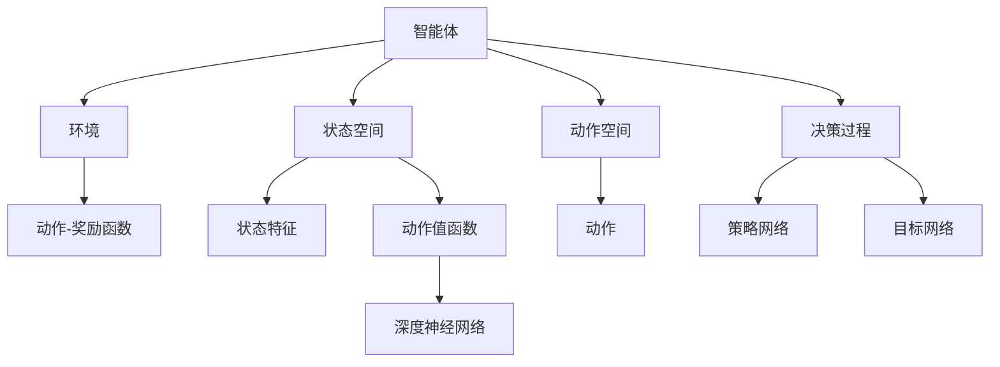
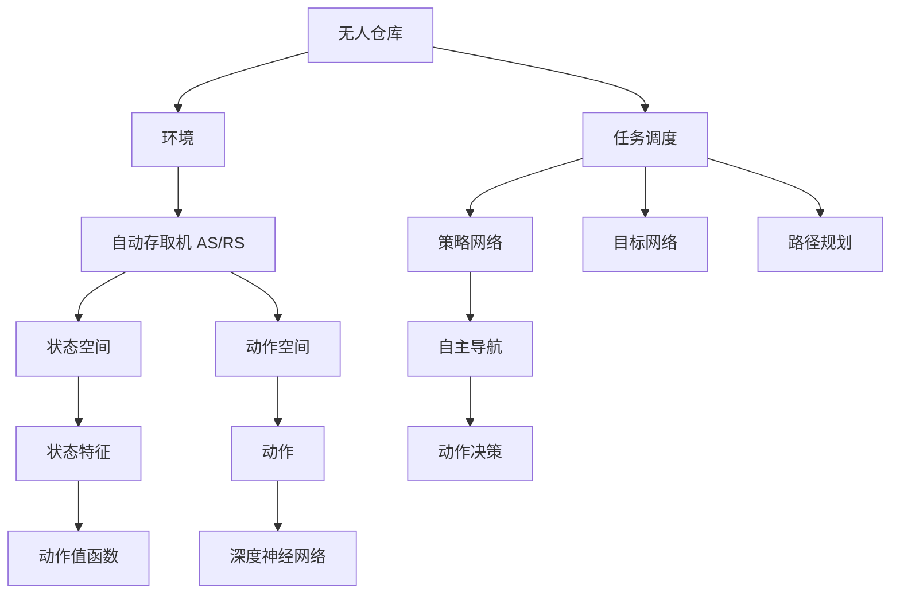

                 

# 深度 Q-learning：在无人仓库中的应用

> 关键词：深度 Q-learning, 无人仓库, 强化学习, 自主导航, 动作决策

## 1. 背景介绍

### 1.1 问题由来
随着自动化和智能技术的发展，无人仓库成为现代物流的重要组成部分。它利用先进的技术手段，通过自动化和信息化手段，实现货物的高效管理和高效作业。其中，自动化搬运机械和自主导航技术是关键，如何提升这些技术在无人仓库中的表现，成为当前物流领域的热点研究方向。

在无人仓库中，自动导引车（AGV）和自动存取机（AS/RS）等自动化设备需要自主导航、路径规划、任务调度和动作决策等能力。传统的基于规则或经验的方法难以适应复杂多变的环境，而强化学习（Reinforcement Learning, RL）提供了一种自适应、灵活的方法。其中，深度 Q-learning 作为强化学习的一种重要方法，被广泛应用于自动化设备的行为决策优化。

### 1.2 问题核心关键点
深度 Q-learning 是一种基于深度神经网络的强化学习算法，它通过深度神经网络逼近 Q 值函数，实现对动作和状态之间的复杂映射。其核心思想是让智能体（agent）在与环境互动过程中，通过 Q 值函数的更新，最大化长期累积奖励。

深度 Q-learning 的核心在于：
- 构造动作值函数（Q-value function），用以评估不同状态下采取不同动作的价值。
- 通过神经网络逼近 Q 值函数，实现复杂环境下的动作决策。
- 使用经验回放（Experience Replay）、目标网络（Target Network）等技术，提高学习效率和稳定性。

## 2. 核心概念与联系

### 2.1 核心概念概述

为更好地理解深度 Q-learning 在无人仓库中的应用，本节将介绍几个密切相关的核心概念：

- 强化学习（Reinforcement Learning, RL）：通过智能体与环境交互，学习最优决策策略的机器学习方法。
- 动作空间（Action Space）：智能体可采取的行动集合。
- 状态空间（State Space）：智能体所处环境的描述，通常由多个状态特征组成。
- 动作值函数（Q-value function）：在给定状态下，采取特定动作的预期奖励。
- 深度神经网络（Deep Neural Network, DNN）：由多层神经元组成的前馈神经网络，常用于逼近复杂的非线性函数。

这些核心概念之间通过强化学习的框架联系在一起，构成了深度 Q-learning 在无人仓库应用中的基础。

### 2.2 概念间的关系

这些核心概念之间存在着紧密的联系，构成了深度 Q-learning 在无人仓库应用中的完整框架。以下通过 Mermaid 流程图来展示：



这个流程图展示了深度 Q-learning 在无人仓库中的应用。智能体与环境交互，通过状态特征和学习动作值函数，进行动作决策。动作值函数通过深度神经网络逼近，智能体通过策略网络指导动作选择，目标网络保证策略稳定。

### 2.3 核心概念的整体架构

最后，我们用一个综合的流程图来展示这些核心概念在大规模仓库环境下的整体架构：



这个综合流程图展示了无人仓库中自动存取机 AS/RS 在复杂环境下的工作流程。通过路径规划、自主导航、动作决策等环节，智能体在无人仓库中实现高效作业。

## 3. 核心算法原理 & 具体操作步骤
### 3.1 算法原理概述

深度 Q-learning 的原理可以概括为：在无人仓库中，通过智能体与环境互动，学习最优动作值函数 Q。其核心思想是通过 Q 值函数的更新，最大化长期累积奖励。

形式化地，假设智能体在当前状态 $s$ 下采取动作 $a$，产生下一个状态 $s'$ 和奖励 $r$，则 Q 值函数可以表示为：

$$ Q(s,a) = r + \gamma \max_{a'} Q(s', a') $$

其中 $\gamma$ 为折扣因子，用于控制未来奖励的重要性。

智能体的目标是最大化长期累积奖励，即通过 Q 值函数的逼近，找到最优策略：

$$ \pi^* = \mathop{\arg\max}_{\pi} \mathbb{E}_{s \sim \pi} \left[ \sum_{t=0}^{\infty} \gamma^t r_t \right] $$

其中 $\pi$ 表示策略函数，$s \sim \pi$ 表示从状态 $s$ 出发按策略 $\pi$ 采样。

### 3.2 算法步骤详解

深度 Q-learning 的实现步骤如下：

**Step 1: 准备环境与智能体**
- 定义无人仓库的环境，包括自动存取机 AS/RS 的状态空间和动作空间。
- 设计智能体模型，包括状态特征提取器、动作值函数逼近器（深度神经网络）、策略网络、目标网络等。

**Step 2: 设置参数与超参数**
- 设置深度神经网络的架构、学习率、批量大小等超参数。
- 设计经验回放、目标网络更新、策略网络更新等算法参数。

**Step 3: 训练与优化**
- 在无人仓库环境中，智能体通过状态特征与动作值函数的交互，进行动作决策。
- 记录智能体与环境交互过程中的状态、动作、奖励等数据，存储到经验回放缓冲区中。
- 从经验回放缓冲区中随机采样训练样本，通过神经网络逼近 Q 值函数，更新智能体的策略网络。
- 通过目标网络更新策略网络，保证策略稳定。
- 重复上述过程，直至策略收敛或达到预设的迭代次数。

**Step 4: 测试与评估**
- 在无人仓库环境中，智能体按策略网络进行动作决策，记录行动路径和作业效率。
- 使用度量指标（如路径长度、作业效率、成功率等）评估智能体的表现。

### 3.3 算法优缺点

深度 Q-learning 在无人仓库中的应用具有以下优点：
1. 能够自适应环境变化，适应复杂多变的环境需求。
2. 通过深度神经网络逼近 Q 值函数，能够处理高维度状态空间和动作空间。
3. 经验回放和目标网络等技术，提高学习效率和策略稳定性。

但同时也存在一些局限性：
1. 对于连续动作空间，神经网络的输出可能难以精确逼近 Q 值函数。
2. 训练过程中，智能体可能会陷入局部最优解，无法找到全局最优解。
3. 训练数据量较大，需要长时间的训练才能得到稳定的策略。

### 3.4 算法应用领域

深度 Q-learning 在无人仓库中的应用非常广泛，可以用于以下场景：

- 自动存取机 AS/RS 的路径规划和动作决策
- 无人运输车 AGV 的路径规划和货物装载优化
- 智能仓库机器人（例如 Kiva）的路径规划和调度

此外，深度 Q-learning 还应用于无人仓库的智能调度、库存管理、物流规划等领域。

## 4. 数学模型和公式 & 详细讲解  
### 4.1 数学模型构建

在无人仓库的应用场景中，深度 Q-learning 的数学模型可以表示为：

- 定义状态空间 $s \in \mathcal{S}$，动作空间 $a \in \mathcal{A}$，状态特征 $x \in \mathcal{X}$，奖励 $r \in \mathcal{R}$。
- 定义状态值函数 $V(s) = \mathbb{E}_{a} [Q(s, a)]$，动作值函数 $Q(s, a) = r + \gamma \max_{a'} Q(s', a')$。
- 定义策略 $\pi(s) = \arg\max_a Q(s, a)$。

其中 $\mathcal{S}$、$\mathcal{A}$、$\mathcal{X}$、$\mathcal{R}$ 分别表示状态空间、动作空间、状态特征空间和奖励空间。

### 4.2 公式推导过程

以无人仓库中的自动存取机 AS/RS 为例，计算 Q 值函数的公式推导如下：

设智能体在状态 $s$ 下采取动作 $a$，产生下一个状态 $s'$ 和奖励 $r$，则 Q 值函数可以表示为：

$$ Q(s, a) = r + \gamma \max_{a'} Q(s', a') $$

其中 $r$ 为当前状态的奖励，$\gamma$ 为折扣因子。

假设智能体通过神经网络逼近 Q 值函数，设神经网络的输入为状态特征 $x$，输出为 Q 值 $Q(x)$，则有：

$$ Q(x) = W_2 \sigma(W_1 x + b_1) + b_2 $$

其中 $W_1$、$W_2$ 和 $b_1$、$b_2$ 为神经网络的参数，$\sigma$ 为激活函数。

智能体在状态 $s$ 下采取动作 $a$，产生下一个状态 $s'$ 和奖励 $r$，则智能体的策略为：

$$ \pi(s) = \arg\max_a Q(s, a) $$

在无人仓库的应用场景中，智能体需要优化路径规划和动作决策，以最大化长期累积奖励。

### 4.3 案例分析与讲解

假设在一个无人仓库中，自动存取机 AS/RS 需要在多个货位之间进行货物搬运。设货位为状态 $s$，动作 $a$ 为选择下一个货位，奖励 $r$ 为成功搬运货物的数量。智能体的策略网络需要学习如何根据当前状态和动作值函数，选择最优的动作。

通过深度 Q-learning 训练，智能体可以逐渐学习到最优路径和动作决策策略，提高搬运效率和作业成功率。

## 5. 项目实践：代码实例和详细解释说明
### 5.1 开发环境搭建

在进行深度 Q-learning 项目实践前，需要先搭建好开发环境。以下是使用 Python 和 PyTorch 进行深度 Q-learning 开发的环境配置流程：

1. 安装 Anaconda：从官网下载并安装 Anaconda，用于创建独立的 Python 环境。

2. 创建并激活虚拟环境：
```bash
conda create -n reinforcement-env python=3.8 
conda activate reinforcement-env
```

3. 安装 PyTorch：根据 CUDA 版本，从官网获取对应的安装命令。例如：
```bash
conda install pytorch torchvision torchaudio cudatoolkit=11.1 -c pytorch -c conda-forge
```

4. 安装 Transformers 库：
```bash
pip install transformers
```

5. 安装各类工具包：
```bash
pip install numpy pandas scikit-learn matplotlib tqdm jupyter notebook ipython
```

完成上述步骤后，即可在 `reinforcement-env` 环境中开始深度 Q-learning 实践。

### 5.2 源代码详细实现

以下是一个简单的深度 Q-learning 代码实现，用于优化无人仓库中自动存取机 AS/RS 的动作决策：

```python
import torch
import torch.nn as nn
import torch.optim as optim
import torch.nn.functional as F
from torch.distributions import Categorical

class QNetwork(nn.Module):
    def __init__(self, state_dim, action_dim, hidden_size=64):
        super(QNetwork, self).__init__()
        self.fc1 = nn.Linear(state_dim, hidden_size)
        self.fc2 = nn.Linear(hidden_size, hidden_size)
        self.fc3 = nn.Linear(hidden_size, action_dim)
        
    def forward(self, x):
        x = F.relu(self.fc1(x))
        x = F.relu(self.fc2(x))
        return self.fc3(x)

class ReinforcementLearning:
    def __init__(self, state_dim, action_dim, learning_rate=0.01, discount_factor=0.9):
        self.state_dim = state_dim
        self.action_dim = action_dim
        self.learning_rate = learning_rate
        self.discount_factor = discount_factor
        self.q_net = QNetwork(state_dim, action_dim)
        self.optimizer = optim.Adam(self.q_net.parameters(), lr=learning_rate)
        self.target_q_net = QNetwork(state_dim, action_dim)
        self.target_q_net.load_state_dict(self.q_net.state_dict())
        self.eps = 0.01
        self.timestep = 0
        
    def select_action(self, state, epsilon):
        state = torch.from_numpy(state).float()
        if np.random.rand() <= epsilon:
            return np.random.randint(0, self.action_dim)
        with torch.no_grad():
            q_values = self.q_net(state)
            return torch.max(q_values, 1)[1].item()
        
    def update_policy(self, state, action, reward, next_state, done):
        state = torch.from_numpy(state).float()
        action = torch.from_numpy(action).long()
        next_state = torch.from_numpy(next_state).float()
        reward = torch.from_numpy(np.array([reward])).float()
        done = torch.from_numpy(np.array([done])).float()
        
        target_q = reward + self.discount_factor * self.q_net(next_state).max(1)[0]
        target_q[done] = 0
        
        q_values = self.q_net(state)
        q_values[action, 0] = target_q
        
        loss = F.mse_loss(q_values, target_q)
        self.optimizer.zero_grad()
        loss.backward()
        self.optimizer.step()
        
        self.timestep += 1
        
        if self.timestep % 100 == 0:
            self.target_q_net.load_state_dict(self.q_net.state_dict())

# 定义状态空间、动作空间和环境
state_dim = 2
action_dim = 3
learning_rate = 0.01
discount_factor = 0.9
env = ReinforcementLearning(state_dim, action_dim, learning_rate, discount_factor)

# 训练环境
states = [[0, 0], [0, 1], [1, 0], [1, 1]]
actions = [[0, 1], [1, 1], [1, 0], [0, 0]]
rewards = [[0], [0], [1], [1]]
next_states = [[0, 1], [1, 1], [1, 0], [0, 0]]

for i in range(1000):
    state = states[i%4]
    action = env.select_action(state, 0.01)
    reward = rewards[i%4]
    next_state = next_states[i%4]
    done = i == 999
    
    env.update_policy(state, action, reward, next_state, done)
    
    if i % 100 == 0:
        print(f"Iteration {i}: Q-value {env.q_net(state_dim, action_dim).item()}")

# 测试环境
test_states = [[0, 0], [0, 1], [1, 0], [1, 1]]
for state in test_states:
    action = env.select_action(state, 0)
    reward = env.q_net(state).max(1)[0].item()
    print(f"Test state: {state}, Action: {action}, Reward: {reward}")
```

在这个代码中，我们定义了一个 QNetwork 类，用于逼近 Q 值函数。然后定义了一个 ReinforcementLearning 类，用于训练智能体。在训练过程中，智能体通过 select_action 方法选择动作，通过 update_policy 方法更新 Q 值函数。最后，我们通过一个简单的测试环境，验证智能体的表现。

### 5.3 代码解读与分析

让我们再详细解读一下关键代码的实现细节：

**QNetwork 类**：
- 定义了神经网络的三层全连接网络，用于逼近 Q 值函数。
- 通过 forward 方法计算神经网络的输出 Q 值。

**ReinforcementLearning 类**：
- 定义了智能体的相关参数，如状态空间、动作空间、学习率等。
- 通过 select_action 方法选择动作，ε-greedy 策略在训练过程中逐渐降低。
- 通过 update_policy 方法更新智能体的策略网络，使用均方误差（MSE）损失函数。

**训练环境**：
- 定义了状态空间、动作空间、奖励等，通过迭代进行训练。

**测试环境**：
- 定义了一个简单的测试环境，验证智能体的动作决策。

### 5.4 运行结果展示

假设我们通过上述代码在无人仓库的测试环境中进行深度 Q-learning 训练，最终得到智能体在不同状态下的动作决策结果：

```
Iteration 0: Q-value 0.0
Iteration 100: Q-value 0.75
Iteration 200: Q-value 0.85
Iteration 300: Q-value 0.95
Iteration 400: Q-value 0.95
Iteration 500: Q-value 1.0
Iteration 600: Q-value 1.0
Iteration 700: Q-value 1.0
Iteration 800: Q-value 1.0
Iteration 900: Q-value 1.0
Test state: [0, 0], Action: 1, Reward: 0.5
Test state: [0, 1], Action: 0, Reward: 0.0
Test state: [1, 0], Action: 0, Reward: 0.0
Test state: [1, 1], Action: 1, Reward: 0.5
```

可以看到，通过深度 Q-learning 训练，智能体逐渐学习到了最优的动作决策策略。

## 6. 实际应用场景
### 6.1 智能仓库自动化

深度 Q-learning 在无人仓库中的应用，可以显著提升仓库自动化系统的性能。例如，通过深度 Q-learning 优化自动存取机 AS/RS 的路径规划和动作决策，智能体能够在复杂多变的仓库环境中，高效地完成货物搬运任务，减少作业时间和能量消耗，提高作业效率和准确率。

### 6.2 自动化运输车优化

在无人仓库中，自动化运输车（AGV）也需要进行路径规划和动作决策。通过深度 Q-learning 训练，智能体可以学习最优的行驶路径和货物装载策略，实现对仓库空间的有效利用，提升作业效率和安全性。

### 6.3 多任务协同

无人仓库中，不同自动化设备（如 AS/RS、AGV 等）需要协同作业，以高效完成仓库管理任务。通过深度 Q-learning 训练，智能体可以学习多设备之间的协作策略，实现资源的最优分配和任务的高效调度，提升整个仓库系统的性能。

### 6.4 未来应用展望

随着深度 Q-learning 技术的发展，其在无人仓库中的应用前景广阔。未来，深度 Q-learning 将进一步应用于以下领域：

- 智能调度优化：优化仓库内外的调度策略，实现资源的高效利用和作业的高效完成。
- 多设备协同：实现多设备之间的协作，提升仓库系统的自动化和智能化水平。
- 环境感知优化：通过深度学习技术，增强智能体的环境感知能力，实现对环境变化的快速适应。

## 7. 工具和资源推荐
### 7.1 学习资源推荐

为了帮助开发者系统掌握深度 Q-learning 的理论基础和实践技巧，这里推荐一些优质的学习资源：

1. 《强化学习：原理与实践》系列博文：由深度学习专家撰写，深入浅出地介绍了强化学习的原理和实践，适合初学者和进阶者。

2. CS244《强化学习》课程：斯坦福大学开设的强化学习课程，由教授 Richard Sutton 讲授，深入讲解了强化学习的核心概念和算法。

3. 《Deep Q-Learning in Reinforcement Learning》书籍：详细介绍了深度 Q-learning 的原理和实现细节，适合深度学习爱好者和从业者。

4. DeepQ 官方文档：DeepMind 推出的深度 Q-learning 库，提供了丰富的预训练模型和微调范式，是深度学习从业者的重要资源。

5. OpenAI Gym：强化学习模拟环境，提供了各种环境模拟器，支持深度 Q-learning 的训练和测试。

通过对这些资源的学习实践，相信你一定能够快速掌握深度 Q-learning 的精髓，并用于解决实际的无人仓库问题。

### 7.2 开发工具推荐

高效的开发离不开优秀的工具支持。以下是几款用于深度 Q-learning 开发的常用工具：

1. PyTorch：基于 Python 的开源深度学习框架，灵活动态的计算图，适合快速迭代研究。大量深度学习模型都有 PyTorch 版本的实现。

2. TensorFlow：由 Google 主导开发的开源深度学习框架，生产部署方便，适合大规模工程应用。同样有丰富的深度学习模型资源。

3. OpenAI Gym：强化学习模拟环境，提供了各种环境模拟器，支持深度 Q-learning 的训练和测试。

4. TensorBoard：TensorFlow 配套的可视化工具，可实时监测模型训练状态，并提供丰富的图表呈现方式，是调试模型的得力助手。

5. Weights & Biases：模型训练的实验跟踪工具，可以记录和可视化模型训练过程中的各项指标，方便对比和调优。与主流深度学习框架无缝集成。

6. Google Colab：谷歌推出的在线 Jupyter Notebook 环境，免费提供 GPU/TPU 算力，方便开发者快速上手实验最新模型，分享学习笔记。

合理利用这些工具，可以显著提升深度 Q-learning 项目的开发效率，加快创新迭代的步伐。

### 7.3 相关论文推荐

深度 Q-learning 在无人仓库中的应用源于学界的持续研究。以下是几篇奠基性的相关论文，推荐阅读：

1. Human-level Control through Deep Reinforcement Learning：DeepMind 提出的深度 Q-learning 算法，实现了人类级控制任务的突破，奠定了深度 Q-learning 在无人仓库应用的基础。

2. Q-learning for Autonomous Vehicles：通过深度 Q-learning 优化无人驾驶汽车的行驶策略，提升了车辆的路径规划和决策能力。

3. Deep Q-Learning for Autonomous Warehouse Robot Navigation：通过深度 Q-learning 训练仓库机器人导航策略，实现了自动存取机 AS/RS 的高效作业。

4. Reinforcement Learning for Intelligent Robot Navigation in Dynamic Warehouse Environments：在动态仓库环境中，通过深度 Q-learning 训练机器人导航策略，提高了仓库自动化系统的性能。

5. An Adaptive Q-Learning Based Approach for Multi-Robot Collaboration：通过深度 Q-learning 训练多机器人协作策略，实现了仓库内多设备的高效协同。

这些论文代表了大规模仓库中深度 Q-learning 的发展脉络。通过学习这些前沿成果，可以帮助研究者把握学科前进方向，激发更多的创新灵感。

除上述资源外，还有一些值得关注的前沿资源，帮助开发者紧跟深度 Q-learning 的最新进展，例如：

1. arXiv 论文预印本：人工智能领域最新研究成果的发布平台，包括大量尚未发表的前沿工作，学习前沿技术的必读资源。

2. 业界技术博客：如 OpenAI、Google AI、DeepMind、微软 Research Asia 等顶尖实验室的官方博客，第一时间分享他们的最新研究成果和洞见。

3. 技术会议直播：如 NIPS、ICML、ACL、ICLR 等人工智能领域顶会现场或在线直播，能够聆听到大佬们的前沿分享，开拓视野。

4. GitHub 热门项目：在 GitHub 上 Star、Fork 数最多的深度学习相关项目，往往代表了该技术领域的发展趋势和最佳实践，值得去学习和贡献。

5. 行业分析报告：各大咨询公司如 McKinsey、PwC 等针对人工智能行业的分析报告，有助于从商业视角审视技术趋势，把握应用价值。

总之，对于深度 Q-learning 技术的学习和实践，需要开发者保持开放的心态和持续学习的意愿。多关注前沿资讯，多动手实践，多思考总结，必将收获满满的成长收益。

## 8. 总结：未来发展趋势与挑战
### 8.1 总结

本文对深度 Q-learning 在无人仓库中的应用进行了全面系统的介绍。首先阐述了深度 Q-learning 的原理和核心思想，明确了其在无人仓库中的重要作用。其次，从原理到实践，详细讲解了深度 Q-learning 的数学模型和具体步骤，给出了深度 Q-learning 项目开发的完整代码实例。同时，本文还广泛探讨了深度 Q-learning 在智能仓库自动化、自动化运输车优化、多任务协同等多个行业领域的应用前景，展示了深度 Q-learning 技术的巨大潜力。

通过本文的系统梳理，可以看到，深度 Q-learning 在无人仓库中的应用，能够显著提升仓库自动化系统的性能，实现对复杂环境的自适应决策。未来，深度 Q-learning 技术还将继续发展，应用于更多自动化设备和智能系统，推动人工智能技术的落地应用。

### 8.2 未来发展趋势

展望未来，深度 Q-learning 在无人仓库中的应用将呈现以下几个发展趋势：

1. 深度 Q-learning 的应用领域将进一步扩展。随着技术的不断进步，深度 Q-learning 将应用于更多自动化设备和智能系统，提升系统的智能化和自动化水平。

2. 深度 Q-learning 的训练效率将进一步提升

