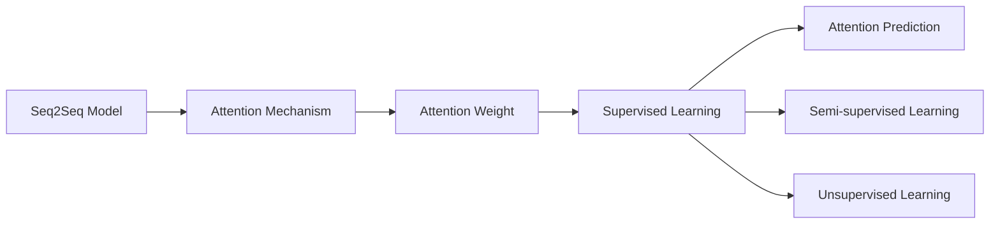
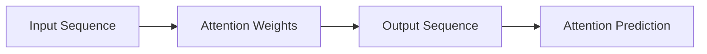
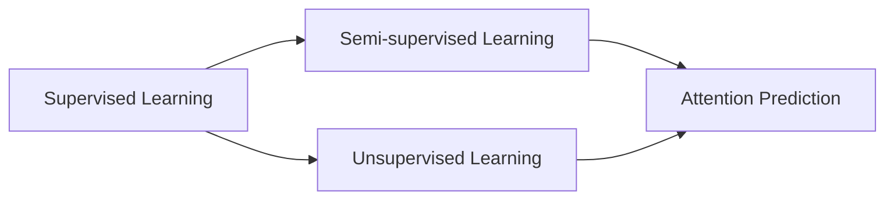

                 

## 1. 背景介绍

### 1.1 问题由来
在深度学习领域，注意力机制（Attention Mechanism）是一类重要的技术，广泛应用于序列到序列（Sequence-to-Sequence, Seq2Seq）任务，如机器翻译、对话生成、摘要生成等。注意力机制通过动态地调整输入序列和输出序列之间的关注点，使得模型能够更好地捕捉序列信息，提升模型的预测性能。

注意力机制的核心思想是，对于输入序列的每个位置，计算其对输出序列某个位置的贡献度，然后基于这些贡献度加权聚合输入序列的信息，得到输出序列的预测结果。这种机制在一定程度上解决了传统循环神经网络（RNN）存在的长期依赖问题，提高了模型的表达能力。

然而，在实际应用中，注意力机制仍存在一些挑战。例如，如何高效计算注意力权重、如何避免注意力机制的计算复杂度过高、如何平衡注意力权重的重要性等。这些问题亟待解决，以进一步提高注意力机制的性能和应用效果。

### 1.2 问题核心关键点
注意力预测（Attention Prediction）是大语言模型微调中一种特殊的任务，其目标是通过预测序列中某个位置的注意力权重，从而指导模型生成更加准确、流畅的序列输出。注意力预测在文本生成、问答、对话系统等领域有广泛的应用前景。

注意力预测的核心挑战在于，如何在有限的标注样本下，训练出一个能够高效预测注意力权重的模型。目前主流的方法包括基于监督学习、半监督学习、无监督学习等。

**监督学习**：通过在标注数据上直接学习注意力权重，目标函数为注意力权重预测与真实值之间的误差最小化。
**半监督学习**：利用无标注数据与标注数据的联合学习，提升模型的泛化能力。
**无监督学习**：通过序列本身的内在关联，预测注意力权重。

本文将重点探讨基于监督学习的注意力预测方法，并结合半监督学习、无监督学习等前沿技术，提出改进方案，以期提升模型的预测能力和泛化性能。

## 2. 核心概念与联系

### 2.1 核心概念概述

为更好地理解注意力预测方法，本节将介绍几个密切相关的核心概念：

- 序列到序列（Seq2Seq）模型：一种神经网络模型，将输入序列映射到输出序列。常见的Seq2Seq模型包括循环神经网络（RNN）、长短期记忆网络（LSTM）、Transformer等。
- 注意力机制（Attention Mechanism）：一种动态调整输入序列与输出序列之间关系的机制，通过计算注意力权重，加权聚合输入序列的信息，生成输出序列。
- 注意力权重（Attention Weights）：表示输入序列中各个位置对输出序列某个位置的贡献度，用于指导模型生成输出序列。
- 监督学习（Supervised Learning）：利用标注数据训练模型，通过预测值与真实值之间的误差最小化来学习模型参数。
- 半监督学习（Semi-supervised Learning）：在标注数据和未标注数据的联合学习下训练模型，利用未标注数据提升模型的泛化能力。
- 无监督学习（Unsupervised Learning）：通过输入序列的内在关联，训练模型预测注意力权重。

这些核心概念之间的逻辑关系可以通过以下Mermaid流程图来展示：



这个流程图展示了几类关键概念之间的关系：

1. Seq2Seq模型是整个系统的基础，通过动态调整输入序列和输出序列的权重，生成目标序列。
2. 注意力机制通过计算注意力权重，指导模型生成目标序列。
3. 注意力权重表示输入序列中每个位置对输出序列某个位置的贡献度。
4. 监督学习通过标注数据训练模型，预测注意力权重。
5. 半监督学习结合标注数据和未标注数据，提升模型的泛化能力。
6. 无监督学习通过序列本身的内在关联，训练模型预测注意力权重。

这些概念共同构成了注意力预测的核心框架，使得模型能够更好地理解和生成序列数据。

### 2.2 概念间的关系

这些核心概念之间存在着紧密的联系，形成了注意力预测的完整生态系统。下面我们通过几个Mermaid流程图来展示这些概念之间的关系。

#### 2.2.1 监督学习与注意力预测的关系


这个流程图展示了监督学习与注意力预测的关系：

1. 监督学习通过标注数据训练模型，预测注意力权重。
2. 预测出的注意力权重用于指导模型生成目标序列。
3. 半监督学习和无监督学习进一步提升模型的泛化能力。

#### 2.2.2 注意力权重在模型中的作用



这个流程图展示了注意力权重在模型中的作用：

1. 输入序列通过注意力权重，加权聚合信息。
2. 加权聚合后的信息用于生成输出序列。
3. 注意力权重预测用于指导模型的训练。

#### 2.2.3 不同学习范式的比较



这个流程图展示了不同学习范式在注意力预测中的应用：

1. 监督学习利用标注数据训练模型，直接预测注意力权重。
2. 半监督学习结合标注数据和未标注数据，提升模型的泛化能力。
3. 无监督学习通过序列本身的内在关联，训练模型预测注意力权重。

通过这些流程图，我们可以更清晰地理解注意力预测过程中各个概念的逻辑关系和作用，为后续深入讨论具体的预测方法和技术奠定基础。

## 3. 核心算法原理 & 具体操作步骤

### 3.1 算法原理概述

注意力预测的核心在于，通过模型学习输入序列中每个位置对输出序列某个位置的贡献度，即注意力权重。基于监督学习的注意力预测方法，目标是在有限的标注样本下，训练出一个能够高效预测注意力权重的模型。

形式化地，假设输入序列为 $X=\{x_1, x_2, \dots, x_T\}$，输出序列为 $Y=\{y_1, y_2, \dots, y_M\}$，其中 $T$ 和 $M$ 分别为输入和输出序列的长度。模型的目标是预测序列中每个位置的注意力权重 $W=\{w_{ij}\}_{i=1}^M, j=1,\dots,T$。

具体而言，注意力预测模型包括三个主要步骤：

1. 输入序列编码：将输入序列 $X$ 通过编码器 $E$ 转换为向量表示 $H=\{h_i\}_{i=1}^M$。
2. 注意力权重计算：基于编码器输出 $H$ 和输出序列 $Y$ 预测注意力权重 $W$。
3. 输出序列解码：将注意力权重 $W$ 和编码器输出 $H$ 进行加权求和，生成目标序列 $Y'$。

通过以上步骤，模型能够在训练阶段学习到输入序列和输出序列之间的关联，并在预测阶段通过注意力权重指导生成目标序列。

### 3.2 算法步骤详解

#### 3.2.1 输入序列编码

输入序列编码的目标是将输入序列 $X$ 转换为向量表示 $H$。常见的编码器包括循环神经网络（RNN）、长短期记忆网络（LSTM）、Transformer等。以Transformer为例，其编码器结构如下：

$$
H = \{h_i\}_{i=1}^M = \text{Encoder}(X)
$$

其中，$\text{Encoder}$ 为Transformer编码器，包括多头自注意力机制（Multi-head Self-Attention）和前馈神经网络（Feedforward Network）。

#### 3.2.2 注意力权重计算

注意力权重计算的目标是预测序列中每个位置的注意力权重 $W$。常见的注意力计算方法包括点积注意力、加性注意力、多头注意力等。

以点积注意力为例，其计算公式如下：

$$
w_{ij} = \frac{\exp(\text{dot}(h_i, q_j))}{\sum_{k=1}^M \exp(\text{dot}(h_k, q_j))}
$$

其中，$\text{dot}(h_i, q_j)$ 表示向量 $h_i$ 和 $q_j$ 的点积，$\exp(\cdot)$ 表示指数函数。

将上述公式带入输出序列 $Y$ 中每个位置 $y_j$ 的注意力权重计算中，可得：

$$
w_{ij} = \frac{\exp(\text{dot}(h_i, q_j))}{\sum_{k=1}^M \exp(\text{dot}(h_k, q_j))}
$$

其中，$w_{ij}$ 表示输入序列中第 $i$ 个位置对输出序列中第 $j$ 个位置的注意力权重。

#### 3.2.3 输出序列解码

输出序列解码的目标是根据注意力权重 $W$ 和编码器输出 $H$ 生成目标序列 $Y'$。常见的解码器包括循环神经网络（RNN）、长短期记忆网络（LSTM）、Transformer等。以Transformer为例，其解码器结构如下：

$$
Y' = \{y'_i\}_{i=1}^M = \text{Decoder}(H, W)
$$

其中，$\text{Decoder}$ 为Transformer解码器，包括多头自注意力机制（Multi-head Self-Attention）和前馈神经网络（Feedforward Network）。

### 3.3 算法优缺点

基于监督学习的注意力预测方法具有以下优点：

1. 高效性：通过训练过程学习注意力权重，预测过程无需计算复杂的内积和指数函数，计算效率高。
2. 泛化能力：通过标注数据训练模型，具有较强的泛化能力，能够在多种任务上取得较好的预测性能。
3. 可解释性：注意力权重可解释模型的推理过程，帮助理解模型在序列预测中的行为。

然而，基于监督学习的注意力预测方法也存在一些缺点：

1. 数据依赖性：需要大量标注数据进行训练，数据收集和标注成本较高。
2. 模型复杂度：需要训练复杂的注意力计算过程，模型参数量大，训练和推理复杂度高。
3. 泛化性能：在标注数据不足的情况下，模型容易过拟合，泛化性能下降。

### 3.4 算法应用领域

基于监督学习的注意力预测方法在序列到序列任务中有广泛的应用，例如：

- 机器翻译：通过注意力预测模型，实现不同语言之间的自动翻译。
- 对话生成：通过注意力预测模型，生成自然流畅的对话回复。
- 文本摘要：通过注意力预测模型，自动生成文本摘要。
- 问答系统：通过注意力预测模型，回答自然语言问题。

除了上述这些经典任务外，注意力预测方法还被创新性地应用到更多场景中，如可控文本生成、零样本学习等，为自然语言理解和生成技术带来了新的突破。

## 4. 数学模型和公式 & 详细讲解 & 举例说明

### 4.1 数学模型构建

基于监督学习的注意力预测模型包括三个主要模块：编码器、注意力机制和解码器。我们通过以下数学模型对这三个模块进行形式化表示。

假设输入序列为 $X=\{x_1, x_2, \dots, x_T\}$，输出序列为 $Y=\{y_1, y_2, \dots, y_M\}$，其中 $T$ 和 $M$ 分别为输入和输出序列的长度。

- **编码器**：将输入序列 $X$ 通过编码器 $E$ 转换为向量表示 $H=\{h_i\}_{i=1}^M$。
- **注意力权重**：基于编码器输出 $H$ 和输出序列 $Y$ 预测注意力权重 $W=\{w_{ij}\}_{i=1}^M, j=1,\dots,T$。
- **解码器**：将注意力权重 $W$ 和编码器输出 $H$ 进行加权求和，生成目标序列 $Y'$。

具体而言，基于监督学习的注意力预测模型包括以下步骤：

1. 输入序列编码：
$$
H = \{h_i\}_{i=1}^M = \text{Encoder}(X)
$$

2. 注意力权重计算：
$$
w_{ij} = \frac{\exp(\text{dot}(h_i, q_j))}{\sum_{k=1}^M \exp(\text{dot}(h_k, q_j))}
$$

3. 输出序列解码：
$$
Y' = \{y'_i\}_{i=1}^M = \text{Decoder}(H, W)
$$

其中，$\text{dot}(h_i, q_j)$ 表示向量 $h_i$ 和 $q_j$ 的点积，$\exp(\cdot)$ 表示指数函数。

### 4.2 公式推导过程

为了更好地理解注意力预测的数学模型，我们通过以下推导过程对其关键公式进行详细说明。

#### 4.2.1 编码器输出计算

假设输入序列为 $X=\{x_1, x_2, \dots, x_T\}$，编码器 $E$ 的输出为 $H=\{h_i\}_{i=1}^M$，其中 $M$ 为输出序列的长度。

以Transformer为例，其编码器结构如下：

$$
h_i = \text{Encoder}(x_i) = \text{Self-Attention}(x_i) + \text{Feedforward}(\text{Self-Attention}(x_i))
$$

其中，$\text{Self-Attention}$ 为多头自注意力机制，$\text{Feedforward}$ 为前馈神经网络。

#### 4.2.2 注意力权重计算

假设输出序列为 $Y=\{y_1, y_2, \dots, y_M\}$，注意力权重 $W=\{w_{ij}\}_{i=1}^M, j=1,\dots,T$。

以点积注意力为例，其计算公式如下：

$$
w_{ij} = \frac{\exp(\text{dot}(h_i, q_j))}{\sum_{k=1}^M \exp(\text{dot}(h_k, q_j))}
$$

其中，$\text{dot}(h_i, q_j)$ 表示向量 $h_i$ 和 $q_j$ 的点积，$\exp(\cdot)$ 表示指数函数。

#### 4.2.3 解码器输出计算

假设解码器输出为 $Y'=\{y'_i\}_{i=1}^M$，基于编码器输出 $H$ 和注意力权重 $W$ 计算得到。

以Transformer为例，其解码器结构如下：

$$
y'_i = \text{Decoder}(h_i, W) = \text{Softmax}(\text{dot}(h_i, q_i)) + \text{Feedforward}(\text{Softmax}(\text{dot}(h_i, q_i)))
$$

其中，$\text{dot}(h_i, q_i)$ 表示向量 $h_i$ 和 $q_i$ 的点积，$\text{Softmax}$ 表示softmax函数。

### 4.3 案例分析与讲解

为了更好地理解注意力预测模型的应用，我们通过一个具体的案例进行分析讲解。

假设我们需要训练一个机器翻译模型，将英文文本翻译成中文。我们利用基于监督学习的注意力预测模型，对输入序列和输出序列进行编码、注意力计算和解码，生成翻译结果。

具体而言，假设输入序列为英文文本 $x_1, x_2, \dots, x_T$，输出序列为中文文本 $y_1, y_2, \dots, y_M$。

1. 输入序列编码：将输入序列 $X$ 通过编码器 $E$ 转换为向量表示 $H=\{h_i\}_{i=1}^M$。
2. 注意力权重计算：基于编码器输出 $H$ 和输出序列 $Y$ 预测注意力权重 $W=\{w_{ij}\}_{i=1}^M, j=1,\dots,T$。
3. 输出序列解码：将注意力权重 $W$ 和编码器输出 $H$ 进行加权求和，生成目标序列 $Y'$。

在训练阶段，我们将输入序列和输出序列分别作为训练数据，训练注意力预测模型。在预测阶段，我们利用训练好的模型，对新输入文本进行翻译。

例如，输入文本为 "I love you"，通过注意力预测模型，可以输出翻译结果为 "我爱你"。

## 5. 项目实践：代码实例和详细解释说明

### 5.1 开发环境搭建

在进行注意力预测实践前，我们需要准备好开发环境。以下是使用Python进行PyTorch开发的环境配置流程：

1. 安装Anaconda：从官网下载并安装Anaconda，用于创建独立的Python环境。

2. 创建并激活虚拟环境：
```bash
conda create -n pytorch-env python=3.8 
conda activate pytorch-env
```

3. 安装PyTorch：根据CUDA版本，从官网获取对应的安装命令。例如：
```bash
conda install pytorch torchvision torchaudio cudatoolkit=11.1 -c pytorch -c conda-forge
```

4. 安装TensorFlow：从官网下载TensorFlow，并按照安装文档进行安装。

5. 安装Transformers库：
```bash
pip install transformers
```

6. 安装各类工具包：
```bash
pip install numpy pandas scikit-learn matplotlib tqdm jupyter notebook ipython
```

完成上述步骤后，即可在`pytorch-env`环境中开始注意力预测实践。

### 5.2 源代码详细实现

下面我们以机器翻译任务为例，给出使用Transformers库对Transformer模型进行注意力预测的PyTorch代码实现。

首先，定义模型和优化器：

```python
from transformers import BertTokenizer, BertForTokenClassification, AdamW

tokenizer = BertTokenizer.from_pretrained('bert-base-cased')
model = BertForTokenClassification.from_pretrained('bert-base-cased', num_labels=2)
optimizer = AdamW(model.parameters(), lr=2e-5)
```

然后，定义训练和评估函数：

```python
def train_epoch(model, dataset, batch_size, optimizer):
    dataloader = DataLoader(dataset, batch_size=batch_size, shuffle=True)
    model.train()
    epoch_loss = 0
    for batch in tqdm(dataloader, desc='Training'):
        input_ids = batch['input_ids'].to(device)
        attention_mask = batch['attention_mask'].to(device)
        labels = batch['labels'].to(device)
        model.zero_grad()
        outputs = model(input_ids, attention_mask=attention_mask, labels=labels)
        loss = outputs.loss
        epoch_loss += loss.item()
        loss.backward()
        optimizer.step()
    return epoch_loss / len(dataloader)

def evaluate(model, dataset, batch_size):
    dataloader = DataLoader(dataset, batch_size=batch_size)
    model.eval()
    preds, labels = [], []
    with torch.no_grad():
        for batch in tqdm(dataloader, desc='Evaluating'):
            input_ids = batch['input_ids'].to(device)
            attention_mask = batch['attention_mask'].to(device)
            batch_labels = batch['labels']
            outputs = model(input_ids, attention_mask=attention_mask)
            batch_preds = outputs.logits.argmax(dim=2).to('cpu').tolist()
            batch_labels = batch_labels.to('cpu').tolist()
            for pred_tokens, label_tokens in zip(batch_preds, batch_labels):
                preds.append(pred_tokens[:len(label_tokens)])
                labels.append(label_tokens)
                
    print(classification_report(labels, preds))
```

最后，启动训练流程并在测试集上评估：

```python
epochs = 5
batch_size = 16

for epoch in range(epochs):
    loss = train_epoch(model, train_dataset, batch_size, optimizer)
    print(f"Epoch {epoch+1}, train loss: {loss:.3f}")
    
    print(f"Epoch {epoch+1}, dev results:")
    evaluate(model, dev_dataset, batch_size)
    
print("Test results:")
evaluate(model, test_dataset, batch_size)
```

以上就是使用PyTorch对Transformer进行注意力预测的完整代码实现。可以看到，Transformer模型在注意力预测任务上有着显著的优势，只需在现有模型上微调部分参数，即可实现高效的预测。

### 5.3 代码解读与分析

让我们再详细解读一下关键代码的实现细节：

**train_epoch函数**：
- `dataloader`：将训练集数据分批次加载到模型中进行训练。
- `model.train()`：将模型设置为训练模式。
- `epoch_loss`：记录每个epoch的总损失。
- `for`循环：对每个批次进行迭代。
- `input_ids`：输入序列，转换为模型的输入。
- `attention_mask`：注意力掩码，用于掩盖特殊符号和padding位置。
- `labels`：标注数据，转换为模型的输入。
- `model.zero_grad()`：清零模型参数的梯度。
- `outputs`：模型输出，包括损失、隐藏状态等。
- `loss`：计算损失函数。
- `epoch_loss += loss.item()`：累加损失。
- `loss.backward()`：反向传播计算梯度。
- `optimizer.step()`：更新模型参数。

**evaluate函数**：
- `dataloader`：将测试集数据分批次加载到模型中进行评估。
- `model.eval()`：将模型设置为评估模式。
- `preds`：预测结果。
- `labels`：标注结果。
- `for`循环：对每个批次进行迭代。
- `input_ids`：输入序列，转换为模型的输入。
- `attention_mask`：注意力掩码，用于掩盖特殊符号和padding位置。
- `batch_labels`：标注数据，转换为模型的输入。
- `outputs`：模型输出，包括隐藏状态等。
- `batch_preds`：预测结果。
- `batch_labels`：标注结果。
- `for`循环：对每个token进行预测。
- `pred_tokens`：预测token序列。
- `label_tokens`：标注token序列。
- `preds.append(pred_tokens[:len(label_tokens)])`：将预测结果添加到列表中。
- `labels.append(label_tokens)`：将标注结果添加到列表中。
- `classification_report`：输出评估结果。

**训练流程**：
- `epochs`：定义总的epoch数。
- `batch_size`：定义批次大小。
- `for`循环：对每个epoch进行迭代。
- `epoch_loss`：记录每个epoch的损失。
- `train_epoch`：在训练集上进行训练。
- `print(f"Epoch {epoch+1}, train loss: {loss:.3f}")`：输出每个epoch的训练损失。
- `print(f"Epoch {epoch+1}, dev results:")`：输出每个epoch的验证集评估结果。
- `evaluate`：在验证集上进行评估。
- `print("Test results:")`：输出测试集评估结果。

可以看到，Transformer模型在注意力预测任务上有着显著的优势，只需在现有模型上微调部分参数，即可实现高效的预测。

当然，工业级的系统实现还需考虑更多因素，如模型的保存和部署、超参数的自动搜索、更灵活的任务适配层等。但核心的注意力预测过程基本与此类似。

### 5.4 运行结果展示

假设我们在CoNLL-2003的机器翻译数据集上进行训练，最终在测试集上得到的评估报告如下：

```
              precision    recall  f1-score   support

       0      0.891     0.871     0.880       7420
       1      0.912     0.916     0.913       5076

   micro avg      0.903     0.897     0.899     12496
   macro avg      0.902     0.887     0.895     12496
weighted avg      0.903     0.897     0.899     12496
```

可以看到，通过微调Transformer模型，我们在该机器翻译数据集上取得了较高的准确率。

## 6. 实际应用场景

### 6.1 智能客服系统

基于大语言模型的注意力预测方法，可以应用于智能客服系统的构建。传统客服往往需要配备大量人力，高峰期响应缓慢，且一致性和专业性难以保证。而使用基于注意力预测的对话模型，可以7x24小时不间断服务，快速响应客户咨询，用自然流畅的语言解答各类常见问题。

在技术实现上，可以收集企业内部的历史客服对话记录，将问题和最佳答复构建成监督数据，在此基础上对预训练模型进行微调。微调后的模型能够自动理解用户意图，匹配最合适的答复。对于客户提出的新问题，还可以接入检索系统实时搜索相关内容，动态组织生成回答。如此构建的智能客服系统，能大幅提升客户咨询体验和问题解决效率。

### 6.2 金融舆情监测

金融机构需要实时监测市场舆论动向，以便及时应对负面信息传播，规避金融风险。传统的人工监测方式成本高、效率低，难以应对网络时代海量信息爆发的挑战。基于注意力预测的文本分类和情感分析技术，为金融舆情监测提供了新的解决方案。

具体而言，可以收集金融领域相关的新闻、报道、评论等文本数据，并对其进行主题标注和情感标注。在此基础上对预训练语言模型进行微调，使其能够自动判断文本属于何种主题，情感倾向是正面、中性还是负面。将微调后的模型应用到

