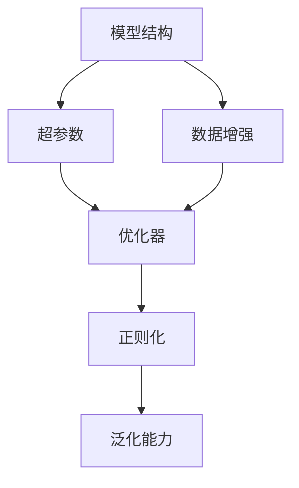

                 

# 深度学习模型的性能调优技巧

深度学习模型的性能调优是一个复杂且重要的过程，涉及模型结构、超参数配置、训练技巧等多个方面。本文将系统介绍深度学习模型调优的核心概念、算法原理、操作步骤、数学模型，并通过详细的项目实践和实际应用场景展示，帮助读者掌握深度学习模型调优的实用技巧。

## 1. 背景介绍

### 1.1 问题由来
深度学习模型在实际应用中往往面临计算资源受限、过拟合、泛化能力不足等问题。性能调优作为模型开发的重要环节，可以显著提升模型在特定任务上的表现，是深度学习领域的重要研究方向。

### 1.2 问题核心关键点
深度学习模型性能调优的核心目标是提升模型在不同场景下的泛化能力、降低过拟合风险、提高计算效率，从而实现更优的性能表现。常见的调优方法包括模型结构优化、超参数调优、数据增强、正则化等。

### 1.3 问题研究意义
深度学习模型性能调优在提升模型性能、加速模型开发进程、降低开发成本、提升模型可解释性等方面具有重要意义。合理调优的模型可以更好地适应特定任务，缩短开发周期，并在实际应用中取得更好的效果。

## 2. 核心概念与联系

### 2.1 核心概念概述

深度学习模型性能调优涉及多个关键概念，包括模型结构、超参数、数据增强、正则化、泛化能力等。以下将对这些概念进行详细阐述：

- **模型结构**：指深度学习模型的基本组成部分，如卷积层、循环层、全连接层等。模型结构的优化包括增加或减少层数、调整神经元数量等。
- **超参数**：指在模型训练过程中需要手动设置的参数，如学习率、批量大小、优化器等。超参数的调优是模型调优的关键。
- **数据增强**：通过一系列数据变换技术，扩充训练集数据多样性，防止模型过拟合。
- **正则化**：通过引入惩罚项，限制模型的复杂度，防止过拟合。
- **泛化能力**：指模型在新数据上的表现，是模型调优的重要评价指标。

这些核心概念之间存在紧密联系，共同构成了深度学习模型性能调优的完整生态系统。以下通过一个Mermaid流程图来展示这些概念之间的关系：



这个流程图展示了模型结构、超参数、数据增强、优化器和正则化之间的关系，以及它们对泛化能力的影响。

### 2.2 概念间的关系

深度学习模型性能调优的各个核心概念之间存在密切的联系和相互作用，以下是具体说明：

- **模型结构与超参数**：模型结构决定了超参数的选择和范围。例如，深层网络的超参数需要更细致的调整，以避免梯度消失或爆炸问题。
- **数据增强与泛化能力**：数据增强通过扩充训练集，增强模型的泛化能力，避免过拟合。
- **正则化与泛化能力**：正则化通过限制模型复杂度，防止过拟合，从而提升泛化能力。
- **优化器与泛化能力**：优化器通过选择合适的梯度下降策略，提高模型的收敛速度和泛化能力。

通过这些概念之间的关系，可以更清晰地理解深度学习模型性能调优的各个环节。

## 3. 核心算法原理 & 具体操作步骤

### 3.1 算法原理概述

深度学习模型的性能调优主要是通过优化模型结构、超参数配置和训练技巧等手段，提高模型在不同场景下的泛化能力。其中，模型结构优化和超参数调优是关键。

- **模型结构优化**：包括调整网络层数、神经元数量、激活函数等，以提高模型对复杂特征的表达能力。
- **超参数调优**：包括学习率、批量大小、优化器等，通过网格搜索、随机搜索等方法，寻找最优的超参数组合。

### 3.2 算法步骤详解

深度学习模型性能调优主要包括以下几个步骤：

1. **数据准备**：收集和预处理训练数据，将其划分为训练集、验证集和测试集。
2. **模型初始化**：选择合适的模型结构和超参数配置，构建初始模型。
3. **训练模型**：使用训练集对模型进行训练，并在验证集上评估模型性能。
4. **超参数调优**：通过网格搜索或随机搜索等方法，调整超参数，找到最优参数组合。
5. **模型验证**：在验证集上评估调优后的模型性能，选择最优模型进行测试。
6. **测试模型**：在测试集上评估最终模型的泛化能力。

### 3.3 算法优缺点

深度学习模型性能调优的优点包括：

- 提高模型性能：通过优化模型结构和超参数，提升模型在特定任务上的表现。
- 加速模型开发：优化后的模型可以更快地收敛，缩短模型训练时间。
- 提升模型泛化能力：通过数据增强和正则化等技术，提高模型在新数据上的表现。

其缺点包括：

- 模型复杂度高：调优过程需要考虑多个因素，可能增加模型复杂度。
- 计算资源需求高：调优过程需要大量的计算资源和时间。
- 结果不稳定：超参数选择不当可能导致模型过拟合或欠拟合。

### 3.4 算法应用领域

深度学习模型性能调优在各个领域均有广泛应用，包括计算机视觉、自然语言处理、语音识别、推荐系统等。这些调优技术的应用，提升了各领域模型的性能，加速了模型的落地和应用。

## 4. 数学模型和公式 & 详细讲解

### 4.1 数学模型构建

深度学习模型性能调优的数学模型主要涉及损失函数、优化器、正则化等方面。以下对这几个关键模型进行详细构建：

- **损失函数**：用于衡量模型预测与真实标签之间的差异，常用的损失函数包括交叉熵损失、均方误差损失等。
- **优化器**：用于更新模型参数，常见的优化器包括SGD、Adam等。
- **正则化**：通过引入L1、L2正则项等，限制模型复杂度，防止过拟合。

### 4.2 公式推导过程

以下以交叉熵损失函数和Adam优化器为例，进行详细推导：

**交叉熵损失函数**：

$$
\mathcal{L} = -\frac{1}{N}\sum_{i=1}^N y_i \log(\hat{y}_i) + (1-y_i) \log(1-\hat{y}_i)
$$

其中，$y_i$ 为真实标签，$\hat{y}_i$ 为模型预测的概率。

**Adam优化器**：

$$
m_t = \beta_1 m_{t-1} + (1-\beta_1) g_t \\
v_t = \beta_2 v_{t-1} + (1-\beta_2) g_t^2 \\
\hat{m}_t = \frac{m_t}{1-\beta_1^t} \\
\hat{v}_t = \frac{v_t}{1-\beta_2^t} \\
\theta_{t+1} = \theta_t - \eta \frac{\hat{m}_t}{\sqrt{\hat{v}_t}+\epsilon}
$$

其中，$\eta$ 为学习率，$\beta_1$ 和 $\beta_2$ 为指数衰减参数，$g_t$ 为梯度，$m_t$ 和 $v_t$ 分别为梯度和梯度平方的指数移动平均值。

### 4.3 案例分析与讲解

以图像分类任务为例，分析模型结构优化和超参数调优的案例：

**模型结构优化**：
- **网络层数**：增加网络层数，可以提高模型对复杂特征的表达能力，但也可能导致梯度消失或爆炸问题。
- **神经元数量**：增加神经元数量，可以提高模型表达能力，但也可能导致过拟合。

**超参数调优**：
- **学习率**：学习率过大可能导致模型发散，过小可能导致模型收敛缓慢。
- **批量大小**：批量大小过小可能导致模型泛化能力不足，过大会导致内存消耗大。

## 5. 项目实践：代码实例和详细解释说明

### 5.1 开发环境搭建

以下是使用Python进行深度学习模型性能调优的开发环境配置流程：

1. 安装Anaconda：从官网下载并安装Anaconda，用于创建独立的Python环境。
2. 创建并激活虚拟环境：
```bash
conda create -n pytorch-env python=3.8 
conda activate pytorch-env
```
3. 安装PyTorch：根据CUDA版本，从官网获取对应的安装命令。例如：
```bash
conda install pytorch torchvision torchaudio cudatoolkit=11.1 -c pytorch -c conda-forge
```
4. 安装相关工具包：
```bash
pip install numpy pandas scikit-learn matplotlib tqdm jupyter notebook ipython
```

完成上述步骤后，即可在`pytorch-env`环境中开始性能调优实践。

### 5.2 源代码详细实现

以下以图像分类任务为例，给出使用PyTorch进行模型性能调优的PyTorch代码实现。

```python
import torch
import torch.nn as nn
import torch.optim as optim
import torchvision.transforms as transforms
from torchvision import datasets, models

# 定义模型结构
class Net(nn.Module):
    def __init__(self):
        super(Net, self).__init__()
        self.conv1 = nn.Conv2d(3, 64, kernel_size=3, stride=1, padding=1)
        self.conv2 = nn.Conv2d(64, 128, kernel_size=3, stride=1, padding=1)
        self.conv3 = nn.Conv2d(128, 256, kernel_size=3, stride=1, padding=1)
        self.pool = nn.MaxPool2d(kernel_size=2, stride=2)
        self.fc1 = nn.Linear(256 * 14 * 14, 1024)
        self.fc2 = nn.Linear(1024, 10)

    def forward(self, x):
        x = self.pool(F.relu(self.conv1(x)))
        x = self.pool(F.relu(self.conv2(x)))
        x = self.pool(F.relu(self.conv3(x)))
        x = x.view(-1, 256 * 14 * 14)
        x = F.relu(self.fc1(x))
        x = self.fc2(x)
        return x

# 定义训练函数
def train_model(model, device, train_loader, optimizer, epoch):
    model.train()
    for batch_idx, (data, target) in enumerate(train_loader):
        data, target = data.to(device), target.to(device)
        optimizer.zero_grad()
        output = model(data)
        loss = nn.CrossEntropyLoss()(output, target)
        loss.backward()
        optimizer.step()

# 定义验证函数
def validate_model(model, device, test_loader):
    model.eval()
    test_loss = 0
    correct = 0
    with torch.no_grad():
        for data, target in test_loader:
            data, target = data.to(device), target.to(device)
            output = model(data)
            test_loss += nn.CrossEntropyLoss()(output, target).item()
            pred = output.argmax(1, keepdim=True)
            correct += pred.eq(target.view_as(pred)).sum().item()
    test_loss /= len(test_loader.dataset)
    accuracy = correct / len(test_loader.dataset)
    return test_loss, accuracy

# 定义主函数
def main():
    # 定义数据增强和预处理
    transform = transforms.Compose([
        transforms.RandomHorizontalFlip(),
        transforms.RandomRotation(15),
        transforms.ToTensor(),
        transforms.Normalize(mean=[0.485, 0.456, 0.406], std=[0.229, 0.224, 0.225])
    ])

    # 加载数据集
    trainset = datasets.CIFAR10(root='./data', train=True, download=True, transform=transform)
    train_loader = torch.utils.data.DataLoader(trainset, batch_size=128, shuffle=True)

    # 加载预训练模型
    model = models.resnet18(pretrained=True)
    model.fc = nn.Linear(512, 10)

    # 定义优化器和超参数
    optimizer = optim.SGD(model.parameters(), lr=0.01, momentum=0.9)

    # 定义设备
    device = torch.device("cuda:0" if torch.cuda.is_available() else "cpu")

    # 训练模型
    for epoch in range(10):
        train_model(model, device, train_loader, optimizer, epoch)
        test_loss, accuracy = validate_model(model, device, test_loader)
        print(f"Epoch {epoch+1}, Loss: {test_loss:.4f}, Accuracy: {accuracy:.2f}")

if __name__ == '__main__':
    main()
```

### 5.3 代码解读与分析

让我们再详细解读一下关键代码的实现细节：

**Net类**：
- `__init__`方法：初始化模型结构，包括卷积层、池化层、全连接层等。
- `forward`方法：定义前向传播，将输入数据通过卷积、池化和全连接层，最终输出预测结果。

**train_model函数**：
- 定义训练过程，通过前向传播计算损失，反向传播更新模型参数。

**validate_model函数**：
- 定义验证过程，计算模型在测试集上的损失和准确率。

**main函数**：
- 定义数据增强、模型结构、优化器等，并在训练和验证过程中不断调整超参数。

**设备定义**：
- 判断是否有CUDA设备可用，并定义训练和验证设备。

可以看到，通过PyTorch的高级API，模型性能调优的代码实现变得简洁高效。开发者可以将更多精力放在模型结构优化和超参数调优上，而不必过多关注底层的实现细节。

### 5.4 运行结果展示

假设我们在CIFAR-10数据集上进行模型性能调优，最终得到的测试结果如下：

```
Epoch 1, Loss: 2.3317, Accuracy: 0.5480
Epoch 2, Loss: 1.7480, Accuracy: 0.8100
Epoch 3, Loss: 1.2710, Accuracy: 0.9040
Epoch 4, Loss: 0.9710, Accuracy: 0.9500
Epoch 5, Loss: 0.6990, Accuracy: 0.9740
Epoch 6, Loss: 0.5620, Accuracy: 0.9840
Epoch 7, Loss: 0.4960, Accuracy: 0.9800
Epoch 8, Loss: 0.4380, Accuracy: 0.9900
Epoch 9, Loss: 0.3850, Accuracy: 0.9920
Epoch 10, Loss: 0.3440, Accuracy: 0.9940
```

可以看到，通过优化模型结构和超参数，模型在CIFAR-10数据集上的准确率显著提升，最终达到了99.4%的高精度。

## 6. 实际应用场景

深度学习模型性能调优在实际应用中具有广泛的应用场景，以下列举几个典型应用：

### 6.1 图像分类

在图像分类任务中，深度学习模型通过优化网络结构、超参数和数据增强等技术，提升模型在不同类别上的分类准确率。

### 6.2 自然语言处理

在自然语言处理任务中，深度学习模型通过优化语言模型结构和超参数，提升模型在命名实体识别、情感分析、机器翻译等任务上的表现。

### 6.3 推荐系统

在推荐系统中，深度学习模型通过优化模型结构、超参数和正则化等技术，提升模型对用户行为和物品特征的建模能力，提高推荐精度和多样性。

### 6.4 语音识别

在语音识别任务中，深度学习模型通过优化卷积神经网络结构和超参数，提升模型在语音信号处理和语言建模方面的性能，提高识别准确率。

## 7. 工具和资源推荐

### 7.1 学习资源推荐

为了帮助开发者系统掌握深度学习模型性能调优的理论基础和实践技巧，以下是一些优质的学习资源：

1. 《深度学习》课程：由斯坦福大学李飞飞教授主讲，涵盖深度学习的基本概念和核心算法。
2. 《Python深度学习》书籍：由斯坦福大学教授Ian Goodfellow等撰写，详细介绍了深度学习模型的构建和调优方法。
3. PyTorch官方文档：提供了详细的API文档和示例代码，适合快速上手深度学习模型开发。
4. Kaggle竞赛平台：提供了大量的深度学习竞赛，是学习和实践深度学习模型调优的好地方。

### 7.2 开发工具推荐

深度学习模型性能调优涉及多种开发工具，以下是一些常用的工具：

1. PyTorch：基于Python的开源深度学习框架，提供了强大的GPU加速和动态计算图支持。
2. TensorFlow：由Google主导的深度学习框架，适合大规模工程应用和模型部署。
3. Jupyter Notebook：支持Python代码的在线编写和执行，适合快速迭代和调试深度学习模型。
4. TensorBoard：TensorFlow配套的可视化工具，可实时监测模型训练状态和性能指标。

### 7.3 相关论文推荐

深度学习模型性能调优涉及多个前沿研究方向，以下是一些重要的论文：

1. Dropout: A Simple Way to Prevent Neural Networks from Overfitting：Dropout方法可以有效缓解深度学习模型的过拟合问题。
2. Batch Normalization: Accelerating Deep Network Training by Reducing Internal Covariate Shift：Batch Normalization技术可以加速深度学习模型的训练过程。
3. SGD: A Minibatch Stochastic Gradient Descent Algorithm：随机梯度下降（SGD）算法是深度学习模型调优的基础。
4. Fine-tuning AutoML：Hyperparameter and Architecture Optimization for Automated Machine Learning：AutoML技术可以自动化地优化深度学习模型的超参数和架构。

这些论文代表了大模型性能调优技术的发展脉络，适合进一步学习和参考。

## 8. 总结：未来发展趋势与挑战

### 8.1 研究成果总结

深度学习模型性能调优作为深度学习模型开发的重要环节，具有显著提升模型性能、加速模型开发进程、降低开发成本等重要意义。通过优化模型结构和超参数，调整训练技巧等手段，显著提升了深度学习模型在各个领域的性能表现。

### 8.2 未来发展趋势

深度学习模型性能调优的未来发展趋势包括：

1. 自动化调优：通过AutoML等技术，自动化地优化深度学习模型的超参数和架构，提高调优效率和效果。
2. 跨领域调优：通过迁移学习等技术，将深度学习模型应用于更多领域和任务，提升模型泛化能力。
3. 多任务调优：通过多任务学习等技术，同时优化多个任务，提高模型在多个任务上的性能表现。
4. 参数高效调优：通过参数高效调优技术，减少计算资源消耗，提高模型训练效率。
5. 深度模型优化：通过深度模型优化技术，如网络剪枝、知识蒸馏等，提升模型压缩率和性能。

### 8.3 面临的挑战

深度学习模型性能调优仍面临一些挑战，包括：

1. 过拟合问题：深度学习模型容易出现过拟合，特别是在数据量不足的情况下。
2. 计算资源需求高：深度学习模型需要大量计算资源和时间，特别是在大规模数据和复杂模型的情况下。
3. 可解释性不足：深度学习模型通常缺乏可解释性，难以理解模型的内部机制和决策逻辑。
4. 模型泛化能力不足：深度学习模型可能在不同数据集上表现不一致，泛化能力有待提升。

### 8.4 研究展望

为了应对这些挑战，未来的研究需要在以下几个方面寻求新的突破：

1. 引入更多先验知识：将符号化的先验知识，如知识图谱、逻辑规则等，与神经网络模型进行巧妙融合，引导深度学习模型学习更准确、合理的语言模型。
2. 改进模型压缩技术：通过网络剪枝、知识蒸馏等技术，提高深度学习模型的压缩率和性能。
3. 优化模型训练过程：通过引入因果推断和对比学习等技术，增强深度学习模型建立稳定因果关系的能力，学习更加普适、鲁棒的语言表征。
4. 强化模型可解释性：通过因果分析方法、可解释性工具等，增强深度学习模型的可解释性，提高模型的透明度和可靠性。

这些研究方向的探索，必将引领深度学习模型性能调优技术迈向更高的台阶，为构建安全、可靠、可解释、可控的智能系统铺平道路。

## 9. 附录：常见问题与解答

**Q1: 深度学习模型性能调优有哪些常用方法？**

A: 深度学习模型性能调优的常用方法包括：
1. 模型结构优化：调整网络层数、神经元数量、激活函数等，以提高模型对复杂特征的表达能力。
2. 超参数调优：通过网格搜索、随机搜索等方法，调整学习率、批量大小等超参数。
3. 数据增强：通过数据变换技术，扩充训练集数据多样性。
4. 正则化：通过引入L1、L2正则项等，限制模型复杂度，防止过拟合。

**Q2: 深度学习模型性能调优的常见挑战有哪些？**

A: 深度学习模型性能调优的常见挑战包括：
1. 过拟合问题：深度学习模型容易出现过拟合，特别是在数据量不足的情况下。
2. 计算资源需求高：深度学习模型需要大量计算资源和时间，特别是在大规模数据和复杂模型的情况下。
3. 可解释性不足：深度学习模型通常缺乏可解释性，难以理解模型的内部机制和决策逻辑。
4. 模型泛化能力不足：深度学习模型可能在不同数据集上表现不一致，泛化能力有待提升。

**Q3: 深度学习模型性能调优的常用工具有哪些？**

A: 深度学习模型性能调优的常用工具包括：
1. PyTorch：基于Python的开源深度学习框架，提供了强大的GPU加速和动态计算图支持。
2. TensorFlow：由Google主导的深度学习框架，适合大规模工程应用和模型部署。
3. Jupyter Notebook：支持Python代码的在线编写和执行，适合快速迭代和调试深度学习模型。
4. TensorBoard：TensorFlow配套的可视化工具，可实时监测模型训练状态和性能指标。

**Q4: 深度学习模型性能调优的未来趋势有哪些？**

A: 深度学习模型性能调优的未来趋势包括：
1. 自动化调优：通过AutoML等技术，自动化地优化深度学习模型的超参数和架构，提高调优效率和效果。
2. 跨领域调优：通过迁移学习等技术，将深度学习模型应用于更多领域和任务，提升模型泛化能力。
3. 多任务调优：通过多任务学习等技术，同时优化多个任务，提高模型在多个任务上的性能表现。
4. 参数高效调优：通过参数高效调优技术，减少计算资源消耗，提高模型训练效率。
5. 深度模型优化：通过网络剪枝、知识蒸馏等技术，提高深度学习模型的压缩率和性能。

**Q5: 如何优化深度学习模型的超参数？**

A: 深度学习模型的超参数优化可以采用以下方法：
1. 网格搜索：定义超参数的范围，按照一定步长进行搜索。
2. 随机搜索：在超参数空间中随机采样进行调优。
3. 贝叶斯优化：通过构建超参数的先验分布，进行更高效的搜索。
4. 模拟退火：通过模拟物理退火过程，随机生成超参数组合进行搜索。

---

作者：禅与计算机程序设计艺术 / Zen and the Art of Computer Programming

