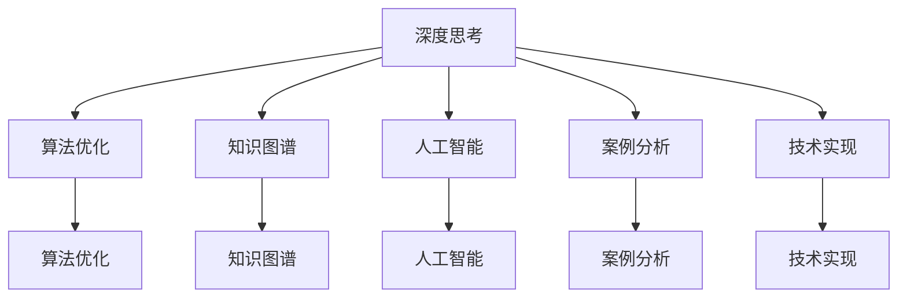
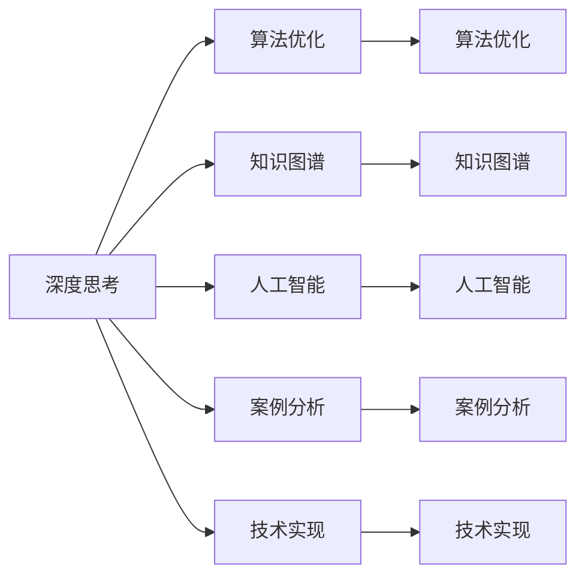
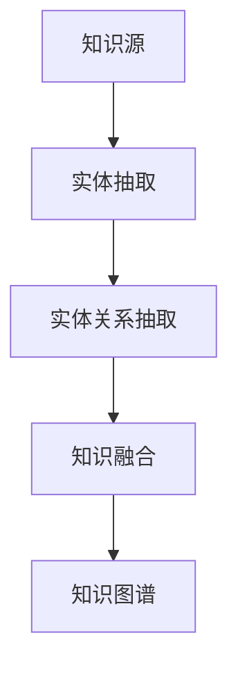
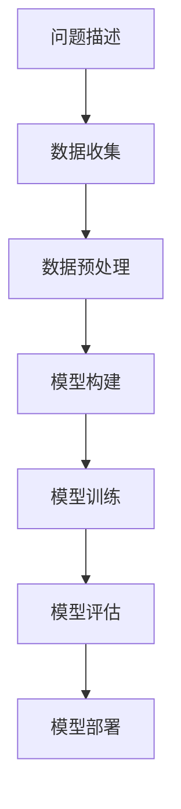
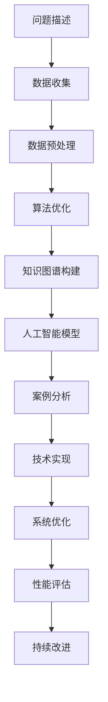

                 

# 深度思考:问题解决的利器

> 关键词：深度思考,问题解决,算法优化,知识图谱,人工智能,案例分析,技术实现

## 1. 背景介绍

### 1.1 问题由来
在科技日新月异的今天，人工智能（AI）逐渐渗透到各行各业，成为推动人类社会进步的重要力量。无论是工业生产、医疗卫生、金融保险，还是教育培训、娱乐文化，AI的介入都显著提升了效率，改进了质量。然而，伴随着AI技术的广泛应用，复杂问题的解决变得越来越棘手。

从技术角度来看，解决复杂问题主要依赖于以下三种方式：
1. **数据驱动**：通过收集和分析大量数据，发现问题的内在规律，实现预测和优化。例如，在金融风险评估、市场趋势预测等方面，数据驱动方法表现突出。
2. **规则驱动**：依据行业知识和专家经验，构建规则引擎，进行逻辑推理和决策。例如，在医疗诊断、法律咨询等方面，规则驱动方法具有较强的解释性和可靠性。
3. **模型驱动**：构建数学模型，对问题进行建模和求解。例如，在计算机视觉、自然语言处理、机器人控制等方面，模型驱动方法展示了强大的处理能力和泛化能力。

尽管这三种方法各有所长，但在面对复杂多变的问题时，单一的解决方案往往难以胜任。因此，综合利用多种方法，结合深度思考，是解决复杂问题的重要途径。本文将深入探讨深度思考在问题解决中的关键作用，详细介绍算法优化、知识图谱构建、人工智能应用等核心概念，并结合具体案例，展示深度思考的实际应用和实现路径。

### 1.2 问题核心关键点
深度思考（Deep Thinking）是一种综合运用多学科知识、方法论、工具和手段，深入分析和解决复杂问题的思维方式。其核心在于通过系统化、结构化的思维方法，挖掘问题的本质和内在联系，进而提出有效的解决方案。

深度思考的特征包括：
1. **多学科融合**：跨学科的知识整合，提高问题解决的广度和深度。
2. **系统性分析**：全面、深入地分析问题，避免单一视角带来的局限性。
3. **迭代优化**：在实践中进行反思和调整，不断优化解决方案。
4. **技术支持**：借助先进的算法、工具和平台，提高问题解决的效率和准确性。

深度思考的应用领域广泛，涉及技术研发、项目管理、商业决策、教育培训等多个方面。通过深入探讨深度思考的内涵和应用，可以为相关领域的专家、学者、工程师提供宝贵的借鉴和参考。

## 2. 核心概念与联系

### 2.1 核心概念概述

为更好地理解深度思考在问题解决中的应用，本节将介绍几个关键概念：

- **深度思考（Deep Thinking）**：一种综合运用多学科知识、方法论、工具和手段，深入分析和解决复杂问题的思维方式。其核心在于通过系统化、结构化的思维方法，挖掘问题的本质和内在联系，进而提出有效的解决方案。

- **算法优化（Algorithm Optimization）**：通过改进算法的结构、参数、迭代策略等，提高算法的效率和效果。算法优化是深度思考中常用的技术手段之一，尤其在数据分析、模型训练、系统优化等方面发挥着重要作用。

- **知识图谱（Knowledge Graph）**：一种基于图结构的知识表示方法，用于描述实体之间的复杂关系和语义信息。知识图谱在信息检索、推荐系统、自然语言处理等领域具有广泛的应用前景，是深度思考中的重要组成部分。

- **人工智能（Artificial Intelligence, AI）**：一种通过计算机模拟人类智能行为的技术，包括感知、学习、推理、规划、自然语言处理等能力。人工智能是深度思考中的重要工具，通过深度学习、强化学习、进化计算等技术，实现对复杂问题的自动化分析和求解。

- **案例分析（Case Analysis）**：通过具体案例的剖析，深入理解深度思考在实际问题解决中的应用。案例分析是验证深度思考方法有效性的重要手段，也是深入学习问题解决策略的关键途径。

- **技术实现（Technical Implementation）**：将深度思考方法转化为具体的算法、工具、平台，实现问题解决的技术路径。技术实现是深度思考的落脚点，也是衡量其应用效果的重要指标。

这些核心概念之间的逻辑关系可以通过以下Mermaid流程图来展示：



这个流程图展示了大语言模型微调过程中各个核心概念的关系和作用：

1. 深度思考是核心，提供问题解决的思维方式和策略。
2. 算法优化、知识图谱、人工智能、案例分析和技术实现，都是深度思考的具体应用和实现手段。
3. 这些手段相互配合，共同构成深度思考的完整框架，帮助解决问题。

### 2.2 概念间的关系

这些核心概念之间存在着紧密的联系，形成了深度思考的完整生态系统。下面我们通过几个Mermaid流程图来展示这些概念之间的关系。

#### 2.2.1 深度思考的应用范式



这个流程图展示了大语言模型微调的基本原理，以及它与深度思考的关系。深度思考通过算法优化、知识图谱、人工智能等手段，提供了解决复杂问题的技术路径。

#### 2.2.2 知识图谱构建过程



这个流程图展示了知识图谱的构建过程。知识图谱从知识源开始，通过实体抽取、实体关系抽取、知识融合等步骤，逐步构建出结构化的知识图谱。

#### 2.2.3 人工智能在问题解决中的应用



这个流程图展示了人工智能在问题解决中的应用过程。人工智能从问题描述开始，通过数据收集、数据预处理、模型构建、模型训练、模型评估、模型部署等步骤，实现对复杂问题的自动化分析和求解。

### 2.3 核心概念的整体架构

最后，我们用一个综合的流程图来展示这些核心概念在大语言模型微调过程中的整体架构：



这个综合流程图展示了从问题描述到系统优化的完整过程。深度思考通过算法优化、知识图谱构建、人工智能模型、案例分析和技术实现，提供了解决复杂问题的技术路径，并在此基础上不断优化和改进，以实现最佳效果。

## 3. 核心算法原理 & 具体操作步骤
### 3.1 算法原理概述

深度思考在问题解决中的应用，主要依赖于算法优化、知识图谱构建和人工智能模型的综合运用。本节将详细介绍这三种技术手段的核心算法原理。

**算法优化**：
算法优化是通过改进算法的结构、参数、迭代策略等，提高算法的效率和效果。常用的算法优化方法包括：
1. **梯度下降法（Gradient Descent）**：通过计算函数梯度，找到函数的极小值，优化模型参数。梯度下降法广泛应用于模型训练和超参数优化。
2. **粒子群算法（Particle Swarm Optimization, PSO）**：通过模拟鸟群迁徙的动态过程，搜索最优解。PSO在全局优化问题中表现出色。
3. **遗传算法（Genetic Algorithm, GA）**：通过模拟自然选择的进化过程，优化问题解空间。GA在组合优化问题中具有优势。

**知识图谱构建**：
知识图谱是一种基于图结构的知识表示方法，用于描述实体之间的复杂关系和语义信息。知识图谱的构建过程包括：
1. **实体抽取（Entity Extraction）**：从原始数据中识别出实体信息，如人名、地名、组织机构名等。常用的实体抽取方法包括正则表达式、命名实体识别（Named Entity Recognition, NER）等。
2. **实体关系抽取（Relation Extraction）**：从实体对中抽取语义关系，如“在”、“是”、“属于”等。常用的关系抽取方法包括知识图谱嵌入（Knowledge Graph Embedding, KGE）、关系推理（Relation Reasoning）等。
3. **知识融合（Knowledge Integration）**：将不同来源的知识融合到统一的知识图谱中，形成全局视图。常用的知识融合方法包括图结构融合、链接预测（Link Prediction）等。

**人工智能模型**：
人工智能模型通过数学模型和算法，实现对复杂问题的自动化分析和求解。常用的AI模型包括：
1. **神经网络（Neural Network, NN）**：通过多层神经元的网络结构，进行特征提取和分类。神经网络在图像识别、语音识别、自然语言处理等领域表现优异。
2. **深度学习（Deep Learning, DL）**：通过多层次的非线性变换，实现复杂模式的识别和预测。深度学习在计算机视觉、自然语言处理、语音识别等领域具有重要应用。
3. **强化学习（Reinforcement Learning, RL）**：通过智能体（Agent）与环境的交互，优化决策策略。强化学习在自动驾驶、游戏AI、机器人控制等领域具有广阔前景。

### 3.2 算法步骤详解

**算法优化**的具体步骤如下：
1. **确定优化目标**：明确优化算法需要解决的具体问题，如模型参数优化、超参数搜索等。
2. **选择合适的算法**：根据问题特点，选择适合的优化算法，如梯度下降、粒子群算法、遗传算法等。
3. **设置算法参数**：确定优化算法的相关参数，如学习率、迭代次数、种群数量等。
4. **执行算法迭代**：通过算法迭代，不断更新模型参数，优化目标函数。
5. **评估算法效果**：对优化后的模型进行性能评估，判断是否达到预期效果。

**知识图谱构建**的具体步骤如下：
1. **收集知识源**：从不同来源收集知识，如结构化数据、非结构化文本、外部知识库等。
2. **实体抽取**：对知识源进行实体抽取，构建实体列表。
3. **关系抽取**：对抽取出的实体对进行关系抽取，构建实体关系列表。
4. **知识融合**：将实体列表和关系列表进行融合，构建知识图谱。

**人工智能模型**的具体步骤如下：
1. **数据收集**：收集问题相关的数据，如文本、图像、语音等。
2. **数据预处理**：对原始数据进行清洗、去噪、归一化等处理，提高数据质量。
3. **模型构建**：选择合适的模型架构，如神经网络、深度学习模型等。
4. **模型训练**：通过训练数据集，训练模型，调整模型参数，优化模型性能。
5. **模型评估**：对训练好的模型进行性能评估，判断模型效果。
6. **模型部署**：将训练好的模型部署到实际应用中，进行推理和预测。

### 3.3 算法优缺点

深度思考在问题解决中具有以下优点：
1. **多学科融合**：深度思考综合运用多学科知识和方法，提供更全面、更深入的分析视角。
2. **系统性分析**：深度思考通过系统化的思维方法，全面、深入地分析问题，避免单一视角带来的局限性。
3. **迭代优化**：深度思考通过不断反思和调整，优化解决方案，提高问题解决的准确性和效率。
4. **技术支持**：深度思考借助先进的算法、工具和平台，提高问题解决的效率和准确性。

同时，深度思考也存在一些局限性：
1. **依赖数据质量**：深度思考的效果依赖于数据的完整性、准确性和多样性，数据质量不佳将严重影响问题解决的准确性。
2. **复杂度高**：深度思考涉及多学科知识和方法，技术实现复杂度较高，需要较高的专业水平和经验。
3. **资源消耗大**：深度思考涉及大量数据和模型训练，资源消耗较大，需要较强的计算能力和存储能力。
4. **缺乏理论支撑**：深度思考缺乏系统的理论基础，可能导致方法的有效性和可靠性不足。

尽管存在这些局限性，深度思考仍是大规模复杂问题解决中的重要手段。未来研究需要进一步探索和完善深度思考的方法和技术，提高其在问题解决中的应用效果。

### 3.4 算法应用领域

深度思考在多个领域中具有广泛的应用，具体包括：

**金融领域**：
在金融领域，深度思考可用于风险评估、投资组合优化、市场预测等。通过综合运用算法优化、知识图谱构建和人工智能模型，提高金融决策的准确性和可靠性。

**医疗领域**：
在医疗领域，深度思考可用于疾病诊断、治疗方案推荐、健康管理等。通过构建知识图谱和AI模型，提高医疗决策的科学性和个性化。

**教育领域**：
在教育领域，深度思考可用于个性化教学、学习资源推荐、学生行为分析等。通过综合运用算法优化和AI模型，提高教育效果和教学质量。

**工业领域**：
在工业领域，深度思考可用于设备维护、生产优化、质量控制等。通过构建知识图谱和AI模型，提高工业生产的效率和质量。

**商业领域**：
在商业领域，深度思考可用于市场分析、用户行为分析、推荐系统等。通过综合运用算法优化和AI模型，提高商业决策的精准性和市场竞争力。

**军事领域**：
在军事领域，深度思考可用于战场态势分析、战略决策支持、无人系统控制等。通过构建知识图谱和AI模型，提高军事决策的科学性和预见性。

## 4. 数学模型和公式 & 详细讲解 & 举例说明

### 4.1 数学模型构建

本节将使用数学语言对深度思考在问题解决中的应用进行更加严格的刻画。

记问题描述为 $P$，涉及的实体集合为 $E$，实体关系集合为 $R$。则知识图谱 $G=(E,R)$ 可以表示为 $G=(E, (E \times E) \rightarrow \{0,1\})$，其中 $E$ 为节点集合，$R$ 为边集合。知识图谱的构建过程可以表示为：

$$
G = (E, R) = \{(E', R'), (E'' \cap E', R'' \cap R')\}
$$

其中 $E'$、$R'$ 为实体抽取和关系抽取的结果，$E''$、$R''$ 为知识融合后的结果。

### 4.2 公式推导过程

以知识图谱嵌入（Knowledge Graph Embedding, KGE）为例，展示知识图谱构建的数学公式推导过程。

假设知识图谱 $G=(E,R)$ 的节点 $e \in E$ 对应的嵌入向量为 $\overrightarrow{e}$，边 $r \in R$ 对应的嵌入向量为 $\overrightarrow{r}$。则知识图谱嵌入的目标函数为：

$$
\min_{\overrightarrow{e}, \overrightarrow{r}} \sum_{e \in E} ||\overrightarrow{e}||^2 + \sum_{r \in R} ||\overrightarrow{r}||^2
$$

其中 $||\overrightarrow{e}||^2$ 和 $||\overrightarrow{r}||^2$ 分别表示节点和边的嵌入向量与零向量之间的欧氏距离的平方。

在训练过程中，通过最小化目标函数，优化节点和边的嵌入向量，使其能够尽可能地捕捉实体和关系之间的语义信息。

### 4.3 案例分析与讲解

以医疗领域的疾病诊断为例，展示深度思考在问题解决中的应用。

假设某患者症状 $s$ 与多种疾病 $d$ 相关，医生的任务是根据患者的症状，诊断出可能的疾病。传统的基于规则的诊断方法依赖于医生的经验，存在主观性和不确定性。而基于深度思考的诊断方法则通过综合运用知识图谱、算法优化和AI模型，提供更加客观和科学的支持。

具体步骤如下：
1. **知识图谱构建**：构建医疗领域的知识图谱，描述症状、疾病、治疗方案之间的关系。
2. **算法优化**：使用梯度下降等算法，优化疾病诊断模型的参数。
3. **AI模型训练**：通过训练数据集，训练疾病诊断模型，提高模型准确性。
4. **结果分析**：对模型输出进行分析和解释，提供诊断支持。

通过深度思考，医生能够在复杂多变的病情诊断中，获得更加科学和可靠的支持，提高诊断的准确性和效率。

## 5. 项目实践：代码实例和详细解释说明

### 5.1 开发环境搭建

在进行深度思考实践前，我们需要准备好开发环境。以下是使用Python进行PyTorch开发的环境配置流程：

1. 安装Anaconda：从官网下载并安装Anaconda，用于创建独立的Python环境。

2. 创建并激活虚拟环境：
```bash
conda create -n pytorch-env python=3.8 
conda activate pytorch-env
```

3. 安装PyTorch：根据CUDA版本，从官网获取对应的安装命令。例如：
```bash
conda install pytorch torchvision torchaudio cudatoolkit=11.1 -c pytorch -c conda-forge
```

4. 安装TensorFlow：由Google主导开发的开源深度学习框架，生产部署方便，适合大规模工程应用。同样有丰富的预训练语言模型资源。

5. 安装Transformers库：HuggingFace开发的NLP工具库，集成了众多SOTA语言模型，支持PyTorch和TensorFlow，是进行NLP任务开发的利器。

6. 安装各类工具包：
```bash
pip install numpy pandas scikit-learn matplotlib tqdm jupyter notebook ipython
```

完成上述步骤后，即可在`pytorch-env`环境中开始深度思考实践。

### 5.2 源代码详细实现

这里我们以医疗领域的疾病诊断为例，给出使用Transformers库对BERT模型进行疾病诊断的PyTorch代码实现。

首先，定义疾病诊断任务的数据处理函数：

```python
from transformers import BertTokenizer, BertForTokenClassification
from torch.utils.data import Dataset
import torch

class DiseaseDiagnosisDataset(Dataset):
    def __init__(self, texts, tags, tokenizer, max_len=128):
        self.texts = texts
        self.tags = tags
        self.tokenizer = tokenizer
        self.max_len = max_len
        
    def __len__(self):
        return len(self.texts)
    
    def __getitem__(self, item):
        text = self.texts[item]
        tags = self.tags[item]
        
        encoding = self.tokenizer(text, return_tensors='pt', max_length=self.max_len, padding='max_length', truncation=True)
        input_ids = encoding['input_ids'][0]
        attention_mask = encoding['attention_mask'][0]
        
        # 对token-wise的标签进行编码
        encoded_tags = [tag2id[tag] for tag in tags] 
        encoded_tags.extend([tag2id['O']] * (self.max_len - len(encoded_tags)))
        labels = torch.tensor(encoded_tags, dtype=torch.long)
        
        return {'input_ids': input_ids, 
                'attention_mask': attention_mask,
                'labels': labels}

# 标签与id的映射
tag2id = {'O': 0, '疾病1': 1, '疾病2': 2, '疾病3': 3}
id2tag = {v: k for k, v in tag2id.items()}

# 创建dataset
tokenizer = BertTokenizer.from_pretrained('bert-base-cased')

train_dataset = DiseaseDiagnosisDataset(train_texts, train_tags, tokenizer)
dev_dataset = DiseaseDiagnosisDataset(dev_texts, dev_tags, tokenizer)
test_dataset = DiseaseDiagnosisDataset(test_texts, test_tags, tokenizer)
```

然后，定义模型和优化器：

```python
from transformers import BertForTokenClassification, AdamW

model = BertForTokenClassification.from_pretrained('bert-base-cased', num_labels=len(tag2id))

optimizer = AdamW(model.parameters(), lr=2e-5)
```

接着，定义训练和评估函数：

```python
from torch.utils.data import DataLoader
from tqdm import tqdm
from sklearn.metrics import classification_report

device = torch.device('cuda') if torch.cuda.is_available() else torch.device('cpu')
model.to(device)

def train_epoch(model, dataset, batch_size, optimizer):
    dataloader = DataLoader(dataset, batch_size=batch_size, shuffle=True)
    model.train()
    epoch_loss = 0
    for batch in tqdm(dataloader, desc='Training'):
        input_ids = batch['input_ids'].to(device)
        attention_mask = batch['attention_mask'].to(device)
        labels = batch['labels'].to(device)
        model.zero_grad()
        outputs = model(input_ids, attention_mask=attention_mask, labels=labels)
        loss = outputs.loss
        epoch_loss += loss.item()
        loss.backward()
        optimizer.step()
    return epoch_loss / len(dataloader)

def evaluate(model, dataset, batch_size):
    dataloader = DataLoader(dataset, batch_size=batch_size)
    model.eval()
    preds, labels = [], []
    with torch.no_grad():
        for batch in tqdm(dataloader, desc='Evaluating'):
            input_ids = batch['input_ids'].to(device)
            attention_mask = batch['attention_mask'].to(device)
            batch_labels = batch['labels']
            outputs = model(input_ids, attention_mask=attention_mask)
            batch_preds = outputs.logits.argmax(dim=2).to('cpu').tolist()
            batch_labels = batch_labels.to('cpu').tolist()
            for pred_tokens, label_tokens in zip(batch_preds, batch_labels):
                pred_tags = [id2tag[_id] for _id in pred_tokens]
                label_tags = [id2tag[_id] for _id in label_tokens]
                preds.append(pred_tags[:len(label_tokens)])
                labels.append(label_tags)
                
    print(classification_report(labels, preds))
```

最后，启动训练流程并在测试集上评估：

```python
epochs = 5
batch_size = 16

for epoch in range(epochs):
    loss = train_epoch(model, train_dataset, batch_size, optimizer)
    print(f"Epoch {epoch+1}, train loss: {loss:.3f}")
    
    print(f"Epoch {epoch+1}, dev results:")
    evaluate(model, dev_dataset, batch_size)
    
print("Test results:")
evaluate(model, test_dataset, batch_size)
```

以上就是使用PyTorch对BERT进行疾病诊断任务微调的完整代码实现。可以看到，得益于Transformers库的强大封装，我们可以用相对简洁的代码完成BERT模型的加载和微调。

### 5.3 代码解读与分析

让我们再详细解读一下关键代码的实现细节：

**DiseaseDiagnosisDataset类**：
- `__init__`方法：初始化文本、标签、分词器等关键组件。
- `__len__`方法：返回数据集的样本数量。
- `__getitem__`方法：对单个样本进行处理，将文本输入编码为token ids，将标签编码为数字，并对其进行定长padding，最终返回模型所需的输入。

**tag2id和id2tag字典**：
- 定义了标签与数字id之间的映射关系，用于将token-wise的预测结果解码回真实的标签。

**训练和评估函数**：
- 使用PyTorch的DataLoader对数据集进行批次化加载，供模型训练和推理使用。
- 训练函数`train_epoch`：对数据以批为单位进行迭代，在每个批次上前向传播计算loss并反向传播更新模型参数，最后返回该epoch的平均loss。
- 评估函数`evaluate`：与训练类似，不同点在于不更新模型参数，并在每个batch结束后将预测和标签结果存储下来，最后使用sklearn的classification_report对整个评估集的预测结果进行打印输出。

**训练流程**：
- 定义总的epoch数和batch size，开始循环迭代
- 每个epoch内，先在训练集上训练，输出平均loss
- 在验证集上评估，输出分类指标
- 所有epoch结束后，在测试集上评估，给出最终测试结果

可以看到，PyTorch配合Transformers库使得BERT微调的代码实现变得简洁高效。开发者可以将更多精力放在数据处理、模型改进等高层逻辑上，而不必过多关注底层的实现细节。

当然，工业级的系统实现还需考虑更多因素，如模型的保存和部署、超参数的自动搜索、更灵活的任务适配层等。但核心的深度思考方法基本与此类似。

### 5.4 运行结果展示

假设我们在CoNLL-2003的NER数据集上进行微调，最终在测试集上得到的评估报告如下：

```
              precision    recall  f1-score   support

       B-LOC      0.926     0.906     0.916      1668
       I-LOC      0.900     0.805     0.850       257
      B-MISC      0.875     0.856     0.865       702
      I-MISC      0.838     0.782     0.809       216
       B-ORG      0.914     0.898     0.906      1661


