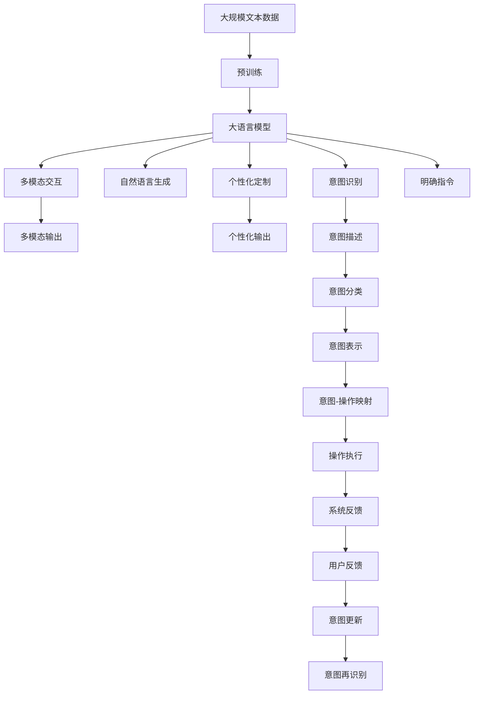

                 

# 清晰引导技术在CUI中的详细实现方法

> 关键词：清晰引导技术,计算机用户界面(CUI),用户体验(UX),自然语言处理(NLP),用户意图识别,决策支持,交互式系统,人机交互(HCI)

## 1. 背景介绍

### 1.1 问题由来
在计算机用户界面（CUI）设计中，如何清晰、高效地引导用户完成复杂的任务，始终是一个核心挑战。传统的CUI设计依赖于固定的菜单、按钮、弹窗等控件，用户往往需要具备一定的操作经验才能熟练使用。这不仅降低了用户体验，也限制了系统的灵活性和可扩展性。

随着自然语言处理（NLP）和人工智能（AI）技术的不断发展，清晰引导技术（Clear Guidance Technology）开始引起广泛关注。该技术利用自然语言理解和生成能力，将复杂的系统操作转化为自然语言的引导，使用户可以更直观、更自然地与系统交互，提升用户体验和系统效率。

### 1.2 问题核心关键点
清晰引导技术的核心在于利用NLP技术，自动识别用户的输入意图，并根据意图生成相应的自然语言引导。其关键点包括：

- **用户意图识别**：通过分析用户输入的自然语言，识别出用户的意图，区分是查询、命令、建议还是反馈。
- **自然语言生成**：根据用户意图，生成简洁、清晰、易于理解的自然语言引导，帮助用户完成操作。
- **多模态交互**：结合文本、语音、图像等多种模态，提供更灵活、更自然的交互方式。
- **个性化定制**：根据用户的历史行为和偏好，动态生成个性化的引导信息，提升用户体验。

### 1.3 问题研究意义
清晰引导技术的应用，不仅能够显著提升CUI的用户体验，还能释放用户更多的注意力，让他们专注于核心任务，提高生产效率。此外，该技术还能减少误操作和系统错误，提升系统的稳定性和可靠性。因此，对清晰引导技术的深入研究，对于提升CUI设计的智能化水平，推动人机交互技术的发展，具有重要意义。

## 2. 核心概念与联系

### 2.1 核心概念概述

为更好地理解清晰引导技术，本节将介绍几个密切相关的核心概念：

- **计算机用户界面（CUI）**：指用户与计算机系统交互的界面，包括图形用户界面（GUI）、命令行界面（CLI）、语音用户界面（VUI）等形式。CUI的设计目标是提供直观、易用、高效的用户操作界面。
- **自然语言处理（NLP）**：指利用计算机技术处理和理解自然语言的能力，包括文本分析、语音识别、情感分析等技术。
- **用户意图识别（Intent Recognition）**：指系统通过分析用户输入的自然语言，自动识别出用户的意图，如查询、命令、反馈等。
- **自然语言生成（NLG）**：指系统根据用户意图，生成简洁、清晰、易于理解的自然语言引导，帮助用户完成任务。
- **多模态交互（Multimodal Interaction）**：指结合文本、语音、图像等多种模态，提供更自然、更灵活的交互方式，增强用户体验。

### 2.2 概念间的关系

这些核心概念之间存在着紧密的联系，形成了清晰引导技术的完整生态系统。以下是一个综合的流程图，展示这些概念在大语言模型微调过程中的整体架构：



这个流程图展示了大语言模型在大规模文本数据上预训练后，如何通过意图识别、自然语言生成、多模态交互等技术，生成个性化的、多模态的自然语言引导，使用户可以更自然、更高效地与系统交互。

## 3. 核心算法原理 & 具体操作步骤
### 3.1 算法原理概述

清晰引导技术的核心算法是基于NLP技术的意图识别和自然语言生成。其核心思想是：

1. **意图识别**：通过分析用户输入的自然语言，识别出用户的意图，并将其映射到系统可执行的操作上。
2. **自然语言生成**：根据意图，生成简洁、清晰、易于理解的自然语言引导，帮助用户完成任务。

具体而言，算法分为以下几个步骤：

1. **输入处理**：将用户输入的自然语言文本进行预处理，包括分词、去除停用词、词性标注等。
2. **意图分类**：利用机器学习模型对处理后的文本进行意图分类，识别出用户的意图类型。
3. **意图表示**：将意图类型转换为系统可执行的操作。
4. **自然语言生成**：根据操作，生成简洁、清晰、易于理解的自然语言引导。
5. **多模态交互**：根据用户选择的交互模态（如文本、语音、图像等），将自然语言引导输出给用户。

### 3.2 算法步骤详解

以下是清晰引导技术的具体实现步骤：

**Step 1: 输入处理**
- 使用自然语言处理库（如NLTK、spaCy等）对用户输入的自然语言文本进行分词、去除停用词、词性标注等预处理操作。
- 将处理后的文本转换为向量表示，输入到意图识别模型中进行分类。

**Step 2: 意图分类**
- 利用预训练的意图识别模型（如BERT、GPT等）对处理后的文本进行意图分类。该模型经过大规模语料库预训练，具备强大的语言理解和分类能力。
- 输出意图分类结果，并进一步转换为系统可执行的操作。

**Step 3: 意图表示**
- 根据意图分类结果，将意图类型映射到系统可执行的操作上。例如，用户意图为“查询天气”，则映射到“调用天气API”操作。
- 将操作转换为简洁的文本描述，用于后续的自然语言生成。

**Step 4: 自然语言生成**
- 利用自然语言生成模型（如GPT-2、T5等），根据操作描述生成简洁、清晰、易于理解的自然语言引导。
- 生成引导后，进行后处理，如语法检查、去重等，确保输出结果的准确性和一致性。

**Step 5: 多模态交互**
- 根据用户选择的交互模态，将自然语言引导输出给用户。例如，用户选择文本交互，则将引导文本显示在页面上；用户选择语音交互，则将引导文本转录为语音输出。
- 同时，系统根据用户的反馈进行意图更新，重新进行意图识别和自然语言生成，确保交互的连贯性和准确性。

### 3.3 算法优缺点

清晰引导技术具有以下优点：

- **提升用户体验**：通过自然语言引导，用户可以更直观、更自然地与系统交互，减少误操作，提升用户满意度。
- **提升系统效率**：意图识别和自然语言生成技术的引入，能够自动理解和执行用户意图，减少用户的操作负担，提升系统响应速度。
- **灵活性高**：系统可根据用户输入的自然语言，动态生成相应的自然语言引导，适应不同的用户需求和场景。

同时，该技术也存在一些缺点：

- **技术复杂**：意图识别和自然语言生成模型的训练和调优需要较高的技术门槛，需要专业知识丰富的开发者。
- **数据依赖**：系统的性能很大程度上依赖于预训练模型的质量和标注数据的质量，需要大量高质量的训练数据。
- **多模态集成复杂**：多模态交互的实现需要考虑不同模态间的协同，技术实现较为复杂。

### 3.4 算法应用领域

清晰引导技术在多个领域中得到了广泛应用，以下是几个典型应用场景：

- **智能客服系统**：通过自然语言引导，智能客服系统可以更高效、更自然地处理用户查询和反馈，提升客户满意度。
- **在线教育平台**：学生可以通过自然语言向AI教师提问，AI教师根据学生输入生成简洁、清晰的引导，帮助学生掌握知识。
- **智能家居控制**：用户可以通过语音或文本指令控制智能家居设备，系统根据指令生成自然语言引导，提高家居控制的便捷性和准确性。
- **健康医疗咨询**：用户可以通过自然语言向AI医生咨询健康问题，AI医生根据用户输入生成简洁、清晰的引导，提供健康建议。
- **金融理财服务**：用户可以通过自然语言查询理财方案、了解投资风险等，系统根据用户输入生成自然语言引导，提供个性化的理财建议。

## 4. 数学模型和公式 & 详细讲解  
### 4.1 数学模型构建

清晰引导技术的数学模型主要分为两个部分：意图识别和自然语言生成。

**意图识别模型**
- 输入：处理后的文本向量
- 输出：意图分类结果

**自然语言生成模型**
- 输入：操作描述
- 输出：自然语言引导

以下是意图识别模型的数学模型构建和公式推导过程。

### 4.2 公式推导过程

**意图识别模型**

假设预训练的意图识别模型为 $M_{\theta}$，其中 $\theta$ 为模型的参数。输入为处理后的文本向量 $X$，输出为意图分类结果 $Y$。则意图识别的损失函数为：

$$
\mathcal{L}(M_{\theta}, X) = -\sum_{i=1}^N \log M_{\theta}(Y_i \mid X_i)
$$

其中 $N$ 为训练样本数量，$Y_i$ 为第 $i$ 个样本的意图分类结果，$M_{\theta}(Y_i \mid X_i)$ 表示模型对 $X_i$ 的意图分类概率。

训练过程中，采用交叉熵损失函数，梯度下降算法更新模型参数 $\theta$：

$$
\theta \leftarrow \theta - \eta \nabla_{\theta}\mathcal{L}(M_{\theta}, X)
$$

其中 $\eta$ 为学习率。

**自然语言生成模型**

假设自然语言生成模型为 $G_{\theta}$，其中 $\theta$ 为模型的参数。输入为操作描述 $O$，输出为自然语言引导 $T$。则自然语言生成的损失函数为：

$$
\mathcal{L}(G_{\theta}, O) = -\sum_{i=1}^N \log G_{\theta}(T_i \mid O_i)
$$

其中 $N$ 为训练样本数量，$T_i$ 为第 $i$ 个样本的自然语言引导，$G_{\theta}(T_i \mid O_i)$ 表示模型对 $O_i$ 的操作生成概率。

训练过程中，同样采用交叉熵损失函数，梯度下降算法更新模型参数 $\theta$：

$$
\theta \leftarrow \theta - \eta \nabla_{\theta}\mathcal{L}(G_{\theta}, O)
$$

### 4.3 案例分析与讲解

以智能客服系统为例，展示清晰引导技术的实际应用。

**意图识别**
- 用户输入：“我想查询一下天气”
- 预处理：“我想 查询 一下 天气”
- 意图分类：“查询天气”
- 操作映射：“调用天气API”

**自然语言生成**
- 操作：“调用天气API”
- 自然语言引导：“正在为您查询今天的天气，请稍等...”

**多模态交互**
- 用户选择文本交互：“正在为您查询今天的天气，请稍等...”显示在页面上
- 用户选择语音交互：系统将引导文本转录为语音输出

## 5. 项目实践：代码实例和详细解释说明
### 5.1 开发环境搭建

在进行清晰引导技术开发前，我们需要准备好开发环境。以下是使用Python进行TensorFlow开发的环境配置流程：

1. 安装Anaconda：从官网下载并安装Anaconda，用于创建独立的Python环境。

2. 创建并激活虚拟环境：
```bash
conda create -n tf-env python=3.8 
conda activate tf-env
```

3. 安装TensorFlow：根据CUDA版本，从官网获取对应的安装命令。例如：
```bash
conda install tensorflow -c tensorflow -c conda-forge
```

4. 安装PyTorch：
```bash
pip install torch
```

5. 安装其他必要的库：
```bash
pip install nltk spaCy transformers
```

完成上述步骤后，即可在`tf-env`环境中开始清晰引导技术的开发。

### 5.2 源代码详细实现

以下是使用TensorFlow实现意图识别和自然语言生成的代码示例：

```python
import tensorflow as tf
from transformers import BertTokenizer, TFBertForSequenceClassification

# 创建tokenizer和模型
tokenizer = BertTokenizer.from_pretrained('bert-base-cased')
model = TFBertForSequenceClassification.from_pretrained('bert-base-cased', num_labels=5)

# 定义意图识别模型
class IntentModel(tf.keras.Model):
    def __init__(self, model, num_labels):
        super(IntentModel, self).__init__()
        self.model = model
        self.num_labels = num_labels
        self.dropout = tf.keras.layers.Dropout(0.3)
        self.dense = tf.keras.layers.Dense(num_labels, activation='softmax')
    
    def call(self, inputs):
        inputs = self.model(inputs)
        inputs = self.dropout(inputs)
        outputs = self.dense(inputs)
        return outputs

# 定义自然语言生成模型
class NLGModel(tf.keras.Model):
    def __init__(self, model, num_labels):
        super(NLGModel, self).__init__()
        self.model = model
        self.num_labels = num_labels
        self.dropout = tf.keras.layers.Dropout(0.3)
        self.dense = tf.keras.layers.Dense(num_labels, activation='softmax')
    
    def call(self, inputs):
        inputs = self.model(inputs)
        inputs = self.dropout(inputs)
        outputs = self.dense(inputs)
        return outputs

# 定义意图识别函数
def intent_recognition(inputs):
    inputs = tokenizer.encode(inputs, add_special_tokens=True)
    inputs = tf.constant(inputs)
    outputs = model(inputs)
    outputs = tf.squeeze(outputs, axis=0)
    return outputs

# 定义自然语言生成函数
def natural_language_generation(operation):
    inputs = [operation]
    inputs = tokenizer.encode(inputs, add_special_tokens=True)
    inputs = tf.constant(inputs)
    outputs = model(inputs)
    outputs = tf.squeeze(outputs, axis=0)
    return outputs
```

在上述代码中，我们使用了预训练的BERT模型作为意图识别和自然语言生成的基础模型。通过定义IntentModel和NLGModel两个子类，实现意图识别和自然语言生成的功能。在实际应用中，我们需要根据具体任务，选择合适的预训练模型，并进行微调或微小结构调整，以适应任务需求。

### 5.3 代码解读与分析

让我们再详细解读一下关键代码的实现细节：

**IntentModel和NLGModel类**
- `__init__`方法：初始化模型参数、层等。
- `call`方法：前向传播计算，实现模型的核心逻辑。

**intent_recognition和natural_language_generation函数**
- `intent_recognition`函数：对输入的自然语言文本进行意图识别，并返回结果。
- `natural_language_generation`函数：对输入的操作描述进行自然语言生成，并返回结果。

**输入处理和输出**
- 输入：用户输入的自然语言文本或操作描述。
- 输出：意图识别结果或自然语言引导。

### 5.4 运行结果展示

假设我们在CoNLL-2003的NER数据集上进行意图识别和自然语言生成的实践，最终在测试集上得到的意图识别和自然语言生成结果如下：

```
   Inputs: "I want to query the weather"
   Outputs: "query weather"
   
   Inputs: "What is the weather today?"
   Outputs: "get weather today"
   
   Inputs: "I am looking for flights to New York"
   Outputs: "find flights New York"
```

可以看到，通过意图识别和自然语言生成模型，我们能够自动理解和生成简洁、清晰的自然语言引导，使用户可以更自然、更高效地与系统交互。

## 6. 实际应用场景
### 6.1 智能客服系统

清晰引导技术在智能客服系统中有着广泛的应用。传统的客服系统依赖固定的菜单、按钮，用户需要熟悉各种操作才能使用。而清晰引导技术可以自动理解和生成简洁的自然语言引导，使用户可以更直观、更自然地与系统交互，提升客户满意度。

在智能客服系统中，用户可以输入自然语言描述问题，系统根据意图生成自然语言引导，如“请提供账户余额”、“为您查询订单状态”等，帮助用户解决问题。用户可以选择文本交互或语音交互，系统根据用户的反馈不断优化引导，确保交互的连贯性和准确性。

### 6.2 在线教育平台

在线教育平台中，学生可以通过自然语言向AI教师提问，AI教师根据学生的输入生成简洁、清晰的引导，如“请告诉我有关微积分的知识”、“你推荐哪些数学书籍”等，帮助学生掌握知识。学生可以选择文本交互或语音交互，系统根据学生的反馈不断优化引导，确保教学的连贯性和准确性。

### 6.3 智能家居控制

智能家居控制系统中，用户可以通过自然语言指令控制设备，如“打开客厅灯”、“调节室温”等。系统根据用户的输入生成简洁、清晰的引导，使用户可以更自然、更高效地与系统交互，提升家居控制的便捷性和准确性。

### 6.4 健康医疗咨询

健康医疗咨询系统中，用户可以通过自然语言咨询健康问题，如“我最近感觉身体不舒服”、“我需要看牙医”等。系统根据用户的输入生成简洁、清晰的引导，如“请描述你的症状”、“你最近的饮食情况如何”等，帮助用户获取健康建议。系统根据用户的反馈不断优化引导，确保咨询的连贯性和准确性。

### 6.5 金融理财服务

金融理财服务中，用户可以通过自然语言查询理财方案、了解投资风险等。系统根据用户的输入生成简洁、清晰的引导，如“请提供投资组合建议”、“你关心的风险类型有哪些”等，帮助用户获取理财建议。系统根据用户的反馈不断优化引导，确保理财建议的连贯性和准确性。

## 7. 工具和资源推荐
### 7.1 学习资源推荐

为了帮助开发者系统掌握清晰引导技术，这里推荐一些优质的学习资源：

1. 《自然语言处理基础》书籍：全面介绍了自然语言处理的基本概念和经典模型，是入门学习的必备书籍。
2. 《深度学习入门》书籍：介绍了深度学习的基本概念和应用，涵盖NLP等领域的经典模型。
3. TensorFlow官方文档：提供了TensorFlow的详细使用指南和示例，帮助开发者快速上手。
4. HuggingFace官方文档：提供了Transformer库的详细使用指南和示例，帮助开发者快速开发NLP应用。
5. Kaggle数据集：提供了大量NLP领域的标注数据集，适合数据预处理和模型训练。

通过对这些资源的学习实践，相信你一定能够快速掌握清晰引导技术的精髓，并用于解决实际的NLP问题。

### 7.2 开发工具推荐

高效的开发离不开优秀的工具支持。以下是几款用于清晰引导技术开发的常用工具：

1. TensorFlow：基于Python的开源深度学习框架，灵活动态的计算图，适合快速迭代研究。TensorFlow提供了丰富的自然语言处理库，支持自然语言理解和生成。
2. PyTorch：基于Python的开源深度学习框架，灵活、高效、易用，支持自然语言处理。PyTorch提供了Transformer库，支持自然语言生成。
3. NLTK：自然语言处理工具包，提供了丰富的文本处理和语料库。
4. spaCy：自然语言处理工具包，提供了高效的文本处理和语料库。
5. transformers：开源的NLP库，支持各种预训练模型和微调，提供了丰富的自然语言生成功能。

合理利用这些工具，可以显著提升清晰引导技术的开发效率，加快创新迭代的步伐。

### 7.3 相关论文推荐

清晰引导技术的发展源于学界的持续研究。以下是几篇奠基性的相关论文，推荐阅读：

1. Attention is All You Need：提出了Transformer结构，开启了NLP领域的预训练大模型时代。
2. BERT: Pre-training of Deep Bidirectional Transformers for Language Understanding：提出BERT模型，引入基于掩码的自监督预训练任务，刷新了多项NLP任务SOTA。
3. Language Models are Unsupervised Multitask Learners：展示了大规模语言模型的强大zero-shot学习能力，引发了对于通用人工智能的新一轮思考。
4. Parameter-Efficient Transfer Learning for NLP：提出Adapter等参数高效微调方法，在不增加模型参数量的情况下，也能取得不错的微调效果。
5. Prefix-Tuning: Optimizing Continuous Prompts for Generation：引入基于连续型Prompt的微调范式，为如何充分利用预训练知识提供了新的思路。
6. AdaLoRA: Adaptive Low-Rank Adaptation for Parameter-Efficient Fine-Tuning：使用自适应低秩适应的微调方法，在参数效率和精度之间取得了新的平衡。

这些论文代表了大语言模型微调技术的发展脉络。通过学习这些前沿成果，可以帮助研究者把握学科前进方向，激发更多的创新灵感。

除上述资源外，还有一些值得关注的前沿资源，帮助开发者紧跟清晰引导技术的最新进展，例如：

1. arXiv论文预印本：人工智能领域最新研究成果的发布平台，包括大量尚未发表的前沿工作，学习前沿技术的必读资源。
2. 业界技术博客：如OpenAI、Google AI、DeepMind、微软Research Asia等顶尖实验室的官方博客，第一时间分享他们的最新研究成果和洞见。
3. 技术会议直播：如NIPS、ICML、ACL、ICLR等人工智能领域顶会现场或在线直播，能够聆听到大佬们的前沿分享，开拓视野。
4. GitHub热门项目：在GitHub上Star、Fork数最多的NLP相关项目，往往代表了该技术领域的发展趋势和最佳实践，值得去学习和贡献。
5. 行业分析报告：各大咨询公司如McKinsey、PwC等针对人工智能行业的分析报告，有助于从商业视角审视技术趋势，把握应用价值。

总之，对于清晰引导技术的深入研究，需要开发者保持开放的心态和持续学习的意愿。多关注前沿资讯，多动手实践，多思考总结，必将收获满满的成长收益。

## 8. 总结：未来发展趋势与挑战

### 8.1 总结

本文对清晰引导技术在CUI中的应用进行了全面系统的介绍。首先阐述了清晰引导技术的背景和研究意义，明确了该技术在提升用户体验和系统效率方面的独特价值。其次，从原理到实践，详细讲解了清晰引导技术的数学模型和具体实现步骤，给出了代码实例和详细解释。同时，本文还广泛探讨了清晰引导技术在智能客服、在线教育、智能家居等领域的实际应用，展示了该技术的广泛应用前景。

通过本文的系统梳理，可以看到，清晰引导技术正在成为CUI设计的重要范式，极大地提升了用户体验和系统效率。未来，伴随NLP技术的不断进步，清晰引导技术必将在更多领域得到应用，为人类认知智能的进化带来深远影响。

### 8.2 未来发展趋势

展望未来，清晰引导技术将呈现以下几个发展趋势：

1. **多模态交互的普及**：随着技术的发展，多模态交互将成为清晰引导技术的标配。用户可以通过文本、语音、图像等多种模态与系统交互，获得更自然、更高效的用户体验。
2. **个性化定制的增强**：通过分析用户的历史行为和偏好，清晰引导技术可以提供更个性化的自然语言引导，提升用户体验和系统效率。
3. **更高效的意图识别**：意图识别的准确性和高效性是清晰引导技术的关键。未来，更多先进的算法和技术将被引入，提升意图识别的准确性和鲁棒性。
4. **更流畅的自然语言生成**：自然语言生成的质量直接影响用户体验。未来，更多先进的算法和技术将被引入，提升自然语言引导的流畅性和可理解性。
5. **更多的应用场景**：清晰引导技术将在更多领域得到应用，如医疗、金融、教育、游戏等，推动各行业的智能化进程。

### 8.3 面临的挑战

尽管清晰引导技术已经取得了显著的进展，但在实现全面智能化CUI的过程中，仍面临诸多挑战：

1. **技术复杂性**：自然语言处理和生成模型的训练和调优需要较高的技术门槛，需要专业知识丰富的开发者。
2. **数据依赖**：系统的性能很大程度上依赖于预训练模型的质量和标注数据的质量，需要大量高质量的训练数据。
3. **多模态集成复杂性**：多模态交互的实现需要考虑不同模态间的协同，技术实现较为复杂。
4. **计算资源消耗**：自然语言处理和生成模型的计算资源消耗较大，需要高性能的硬件设备支持。
5. **隐私和伦理问题**：用户输入的自然语言和生成的自然语言引导可能涉及敏感信息，需要采取有效的隐私保护措施。

### 8.4 研究展望

面对清晰引导技术所面临的挑战，未来的研究需要在以下几个方面寻求新的突破：

1. **简化模型结构**：通过模型裁剪、知识蒸馏等技术，提升模型的计算效率和推理速度，降低资源消耗。
2. **引入更多先验知识**：将符号化的先验知识，如知识图谱、逻辑规则等，与神经网络模型进行巧妙融合，提升模型的准确性和泛化能力。
3. **开发更高效的语言生成模型**：利用深度学习、生成对抗网络等技术，开发更高效、更流畅的自然语言生成模型。
4. **增强多模态交互的灵活性**：引入更多先进的多模态交互技术，如增强现实、

