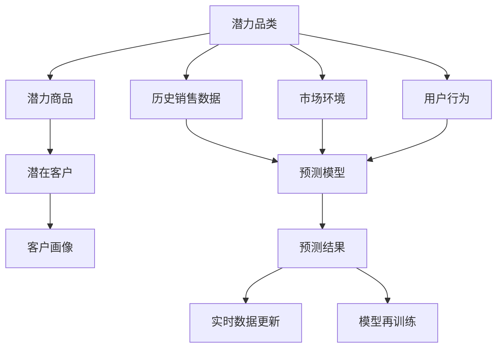
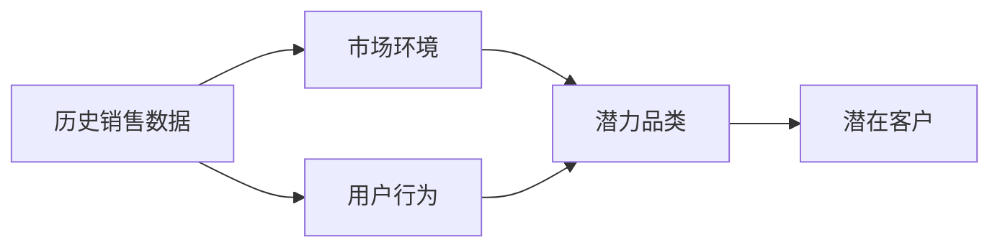
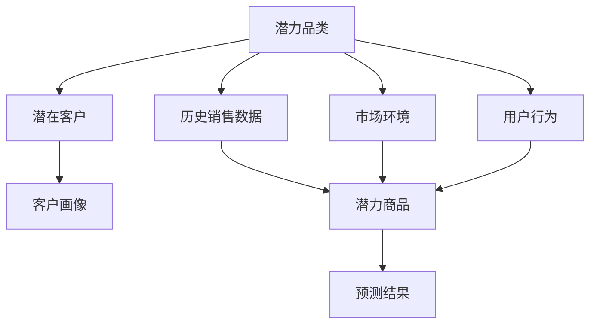
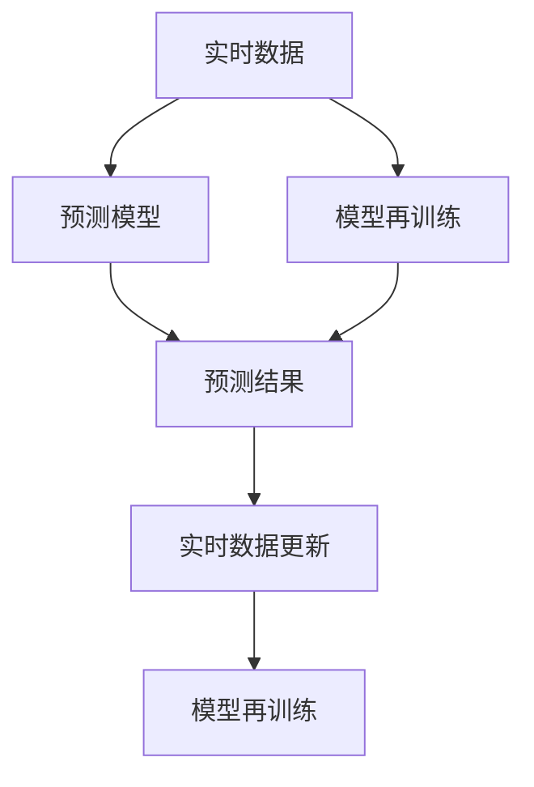

                 

## 1. 背景介绍

### 1.1 问题由来

在电商领域，品牌商为了拓展市场、提高销售额，通常会在新产品上市初期投入大量资源进行推广和营销。然而，由于对市场需求的准确把握不够，容易面临投资回报率低、库存积压等问题。

为了解决这一问题，我们提出了潜力品类和潜力商品的概念，通过数据分析和算法模型，预测某些商品的销售潜力，从而帮助品牌商做出更加科学的决策。

### 1.2 问题核心关键点

潜力品类和潜力商品的预测，涉及对历史销售数据、市场环境、用户行为等多种信息的分析。核心关键点包括：

- 潜力商品的定义和特征提取
- 潜在客户的识别和客户画像建立
- 预测模型设计及其训练优化
- 实时数据更新和模型再训练

这些关键点环环相扣，缺一不可。本文将详细介绍其中的算法原理和具体操作步骤，并结合实际案例进行讲解。

### 1.3 问题研究意义

通过预测潜力品类和潜力商品，品牌商可以实现以下几个方面的显著提升：

1. **精准营销**：根据销售潜力的预测结果，有针对性地进行产品推广，避免浪费资源。
2. **库存优化**：及时调整采购计划和库存管理，避免过量采购和库存积压。
3. **个性化推荐**：基于潜在客户的特征和行为，提供个性化推荐，提升用户体验和购买率。
4. **需求预测**：帮助品牌商更好地理解市场趋势和需求波动，制定更科学的运营策略。
5. **成本控制**：通过精准营销和库存管理，降低运营成本，提高整体利润率。

因此，潜力品类和潜力商品的预测，对于提升电商平台的运营效率和用户体验具有重要意义。

## 2. 核心概念与联系

### 2.1 核心概念概述

为更好地理解潜力品类和潜力商品供给的预测方法，本节将介绍几个密切相关的核心概念：

- **潜力品类(Potential Category)**：指在一定时间范围内，具备较大销售潜力的商品类别。潜力品类的识别依赖于对历史销售数据、市场环境、用户行为等信息的综合分析。
- **潜力商品(Potential Product)**：指在某个品类内，具备较大销售潜力的具体商品。潜力商品的预测需要结合潜在客户的特征、市场趋势等因素进行建模。
- **潜在客户(Potential Customer)**：指对某个品类或商品感兴趣，但尚未购买的人群。潜在客户的识别依赖于用户行为数据、点击率、浏览记录等。
- **客户画像(Customer Profile)**：指基于用户行为、兴趣、购买历史等信息的综合描述，用于个性化推荐和营销决策。
- **预测模型(Prediction Model)**：指用于预测商品销售潜力或客户行为的概率模型，如线性回归、决策树、神经网络等。
- **实时数据更新(Real-time Data Update)**：指通过在线数据流、事件触发等机制，实时更新模型所需的数据，保证预测结果的时效性。
- **模型再训练(Model Retraining)**：指根据新数据，定期更新和优化预测模型，提高预测准确度。

这些核心概念之间的逻辑关系可以通过以下Mermaid流程图来展示：



这个流程图展示了这个概念系统中的各个组成部分及其相互关系：

1. 潜力品类的识别依赖于历史销售数据、市场环境和用户行为。
2. 潜力商品的预测结合了潜在客户的特征和市场趋势。
3. 潜在客户的识别需要用户行为数据、点击率和浏览记录。
4. 客户画像是基于用户行为、兴趣和购买历史等信息的综合描述。
5. 预测模型用于分析历史数据、潜在客户特征等，输出预测结果。
6. 实时数据更新和模型再训练保证了预测模型的及时性和准确性。

这些概念共同构成了潜力品类和潜力商品供给预测的完整框架，帮助品牌商在电商运营中做出科学的决策。

### 2.2 概念间的关系

这些核心概念之间存在着紧密的联系，形成了潜力品类和潜力商品供给预测的完整生态系统。下面我通过几个Mermaid流程图来展示这些概念之间的关系。

#### 2.2.1 潜力品类预测流程



这个流程图展示了潜力品类预测的基本流程。首先，通过对历史销售数据、市场环境和用户行为进行分析，识别出潜在的品类。

#### 2.2.2 潜力商品预测流程



这个流程图展示了潜力商品预测的基本流程。首先，通过识别出潜在的品类，结合潜在客户的特征和市场趋势，预测出潜力商品。

#### 2.2.3 实时数据更新与模型再训练流程



这个流程图展示了实时数据更新和模型再训练的流程。通过在线数据流和事件触发，实时更新预测模型所需的数据，并定期进行模型再训练，以提高预测的准确度和时效性。

## 3. 核心算法原理 & 具体操作步骤

### 3.1 算法原理概述

潜力品类和潜力商品的预测，本质上是一个基于监督学习的分类问题。其核心思想是：通过历史销售数据、市场环境和用户行为等特征，预测某品类或商品在未来的销售潜力。

形式化地，设历史销售数据为 $X$，市场环境和用户行为等特征为 $Y$，预测结果为 $Z$。构建分类模型 $f$，使得：

$$
f(X, Y) \approx Z
$$

其中，$f$ 是预测模型，$Z$ 表示销售潜力标签，$X$ 和 $Y$ 为特征输入。通过优化损失函数，使得模型输出与真实标签尽可能接近。常用的损失函数包括交叉熵损失、对数损失等。

### 3.2 算法步骤详解

基于监督学习的潜力品类和潜力商品预测，一般包括以下几个关键步骤：

**Step 1: 数据准备**
- 收集历史销售数据 $X$，包括时间、品类、商品等信息。
- 收集市场环境和用户行为等特征 $Y$，如季节性因素、促销活动、用户点击率、浏览历史等。

**Step 2: 特征工程**
- 对历史销售数据和市场环境等特征进行预处理和特征工程，如缺失值填补、特征编码、特征选择等。
- 结合用户行为数据，构建潜在客户的客户画像。

**Step 3: 模型选择与训练**
- 选择合适的预测模型，如逻辑回归、决策树、随机森林、神经网络等。
- 使用交叉验证等技术，对模型进行训练和调优。

**Step 4: 预测与评估**
- 在测试集上评估模型性能，如准确率、召回率、F1分数等。
- 根据评估结果调整模型参数，进行模型再训练。

**Step 5: 实时数据更新与预测**
- 部署模型到生产环境，进行实时数据更新。
- 根据实时数据，实时预测潜力品类和潜力商品。

**Step 6: 预测结果应用**
- 将预测结果应用于库存管理、产品推广、个性化推荐等电商运营决策中。
- 定期进行模型再训练，保持预测结果的准确性和时效性。

以上是基于监督学习进行潜力品类和潜力商品预测的一般流程。在实际应用中，还需要针对具体任务的特点，对各环节进行优化设计，如改进特征选择算法、引入更多先验知识、优化模型训练等，以进一步提升模型性能。

### 3.3 算法优缺点

基于监督学习的潜力品类和潜力商品预测方法，具有以下优点：

- 简单高效。只需准备少量标注数据，即可对模型进行微调，获得较好的预测效果。
- 预测准确。通过历史数据和特征分析，能够较为准确地预测未来的销售潜力。
- 应用广泛。适用于各种电商运营场景，如库存管理、产品推广、个性化推荐等。

同时，该方法也存在一定的局限性：

- 依赖标注数据。预测模型的训练需要大量标注数据，而标注数据获取成本较高。
- 泛化能力有限。模型对新数据和未知领域的泛化能力可能较弱。
- 模型复杂度较高。复杂模型可能需要更多的计算资源和训练时间。
- 实时性不足。在实时数据更新时，模型需要重新训练，导致预测延迟。

尽管存在这些局限性，但就目前而言，基于监督学习的潜力品类和潜力商品预测方法仍是最主流和实用的手段。未来相关研究的方向在于如何进一步降低对标注数据的依赖，提高模型的泛化能力，同时兼顾模型复杂度和实时性。

### 3.4 算法应用领域

基于潜力品类和潜力商品的预测方法，已经在电商、零售、金融等多个领域得到了广泛应用，效果显著。以下是几个典型应用场景：

- **电商运营**：通过预测潜力品类和商品，优化库存管理和产品推广策略，提升用户体验和销售业绩。
- **零售管理**：结合市场环境变化，动态调整商品采购和销售策略，避免库存积压和缺货现象。
- **金融风险控制**：预测客户信贷风险，优化贷款审批流程，提升风控效率和贷款质量。
- **营销决策**：基于客户画像，提供个性化推荐和营销活动，提升客户粘性和满意度。
- **市场分析**：通过分析市场趋势和商品表现，制定更科学的运营策略，优化资源配置。

这些应用场景充分展示了潜力品类和潜力商品预测方法的价值，帮助品牌商和平台在激烈的竞争中保持优势。

## 4. 数学模型和公式 & 详细讲解 & 举例说明

### 4.1 数学模型构建

本节将使用数学语言对潜力品类和潜力商品预测过程进行更加严格的刻画。

设历史销售数据为 $X = (x_1, x_2, ..., x_n)$，其中 $x_i$ 表示第 $i$ 个样本的特征向量。设市场环境和用户行为等特征为 $Y = (y_1, y_2, ..., y_m)$，其中 $y_j$ 表示第 $j$ 个特征向量。设预测结果为 $Z = (z_1, z_2, ..., z_k)$，其中 $z_i$ 表示第 $i$ 个样本的预测标签。

构建预测模型 $f$，使得：

$$
f(X, Y) = Z
$$

常用的预测模型包括线性回归、逻辑回归、决策树、随机森林、神经网络等。这里我们以逻辑回归为例进行讲解。

### 4.2 公式推导过程

逻辑回归模型的目标是最小化交叉熵损失函数：

$$
\mathcal{L}(f) = -\frac{1}{N}\sum_{i=1}^N \sum_{j=1}^k y_{ij} \log f_{ij} + (1 - y_{ij}) \log (1 - f_{ij})
$$

其中，$N$ 为样本数，$K$ 为类别数，$y_{ij}$ 表示第 $i$ 个样本的第 $j$ 个类别的真实标签，$f_{ij} = \frac{e^{z_{ij}}}{1 + e^{z_{ij}}}$ 表示第 $i$ 个样本的第 $j$ 个类别的预测概率。

根据链式法则，对 $z_{ij}$ 求导，得到梯度：

$$
\nabla_{z_{ij}}\mathcal{L}(f) = -y_{ij} f_{ij} + (1 - y_{ij}) (1 - f_{ij})
$$

通过反向传播算法，更新模型参数，最小化损失函数。在训练过程中，需要选择合适的优化器及其参数，如Adam、SGD等，设置学习率、批大小、迭代轮数等超参数。

### 4.3 案例分析与讲解

我们以电商平台上某品牌的服装品类为例，进行潜力品类和潜力商品的预测分析。假设平台上有三种服装品类（T恤、衬衫、外套），通过历史销售数据、市场环境和用户行为等特征，预测不同品类和商品在未来一个月内的销售潜力。

首先，收集历史销售数据，包括品类、品牌、价格、销量等。通过分析历史销售数据，发现T恤和衬衫的销售波动较为明显，具有较高的销售潜力。

然后，收集市场环境和用户行为等特征，如季节性因素、促销活动、用户点击率、浏览历史等。结合历史销售数据，构建预测模型，使用逻辑回归进行训练和调优。

最终，在测试集上评估模型性能，如准确率、召回率、F1分数等。根据评估结果，调整模型参数，进行模型再训练。部署模型到生产环境，进行实时数据更新和预测。

通过这种基于监督学习的预测方法，平台能够及时调整库存管理策略，优化产品推广方案，提升用户体验和销售业绩。

## 5. 项目实践：代码实例和详细解释说明

### 5.1 开发环境搭建

在进行潜力品类和潜力商品预测实践前，我们需要准备好开发环境。以下是使用Python进行Scikit-Learn开发的环境配置流程：

1. 安装Anaconda：从官网下载并安装Anaconda，用于创建独立的Python环境。

2. 创建并激活虚拟环境：
```bash
conda create -n pyenv python=3.8 
conda activate pyenv
```

3. 安装Scikit-Learn：
```bash
pip install scikit-learn
```

4. 安装各类工具包：
```bash
pip install numpy pandas scikit-learn matplotlib tqdm jupyter notebook ipython
```

完成上述步骤后，即可在`pyenv`环境中开始潜力品类和潜力商品预测的实践。

### 5.2 源代码详细实现

下面我们以电商平台上某品牌的服装品类为例，给出使用Scikit-Learn对逻辑回归模型进行潜力品类和潜力商品预测的Python代码实现。

首先，定义特征工程函数：

```python
import pandas as pd
from sklearn.preprocessing import OneHotEncoder, StandardScaler

def feature_engineering(data):
    # 缺失值填补
    data.fillna(method='ffill', inplace=True)
    # 特征编码
    encoder = OneHotEncoder(handle_unknown='ignore', sparse=False)
    encoded_features = encoder.fit_transform(data.iloc[:, :-1])
    # 特征缩放
    scaler = StandardScaler()
    scaled_features = scaler.fit_transform(encoded_features)
    # 合并特征
    data = pd.concat([data.iloc[:, -1], pd.DataFrame(scaled_features, columns=['f_0', 'f_1', 'f_2', ...])], axis=1)
    return data
```

然后，定义训练和预测函数：

```python
from sklearn.linear_model import LogisticRegression
from sklearn.model_selection import train_test_split
from sklearn.metrics import accuracy_score, precision_score, recall_score, f1_score

def train_model(data, target, test_size=0.2, random_state=42):
    # 特征工程
    X = feature_engineering(data)[:, :-1]
    y = data.iloc[:, -1]
    # 数据拆分
    X_train, X_test, y_train, y_test = train_test_split(X, y, test_size=test_size, random_state=random_state)
    # 模型训练
    model = LogisticRegression(max_iter=1000)
    model.fit(X_train, y_train)
    # 预测
    y_pred = model.predict(X_test)
    # 评估
    acc = accuracy_score(y_test, y_pred)
    precision = precision_score(y_test, y_pred, average='macro')
    recall = recall_score(y_test, y_pred, average='macro')
    f1 = f1_score(y_test, y_pred, average='macro')
    return model, acc, precision, recall, f1

def predict(model, data):
    # 特征工程
    X = feature_engineering(data)[:, :-1]
    # 预测
    y_pred = model.predict(X)
    return y_pred
```

接着，加载数据并训练模型：

```python
# 加载历史数据
data = pd.read_csv('sales_data.csv')

# 加载市场环境和用户行为等特征
features = pd.read_csv('features.csv')

# 数据合并
data = pd.merge(data, features, on='date', how='left')

# 数据预处理
data = data.dropna()

# 模型训练
model, acc, precision, recall, f1 = train_model(data, 'sales', test_size=0.2, random_state=42)

print(f'Accuracy: {acc:.3f}, Precision: {precision:.3f}, Recall: {recall:.3f}, F1: {f1:.3f}')
```

最后，进行实时数据更新和预测：

```python
# 加载实时数据
realtime_data = pd.read_csv('realtime_sales_data.csv')

# 预测
y_pred = predict(model, realtime_data)

print(y_pred)
```

以上就是使用Scikit-Learn对逻辑回归模型进行潜力品类和潜力商品预测的完整代码实现。可以看到，得益于Scikit-Learn的强大封装，我们可以用相对简洁的代码完成模型训练和预测。

### 5.3 代码解读与分析

让我们再详细解读一下关键代码的实现细节：

**特征工程函数**：
- 缺失值填补：采用前向填充的方式，填补缺失值。
- 特征编码：使用one-hot编码，将分类特征转换为数值特征。
- 特征缩放：使用标准缩放，将特征值缩放到均值为0、标准差为1的范围内。
- 合并特征：将处理后的特征和目标变量合并成数据框，便于模型训练和预测。

**train_model函数**：
- 数据拆分：使用train_test_split函数将数据集拆分成训练集和测试集，并设置随机种子。
- 模型训练：使用LogisticRegression进行模型训练，并设置最大迭代次数。
- 预测和评估：在测试集上预测并计算准确率、精确度、召回率和F1分数。

**predict函数**：
- 特征工程：对实时数据进行特征工程处理。
- 预测：使用训练好的模型对实时数据进行预测，并返回预测结果。

**代码实现流程**：
- 加载历史数据和特征数据，并进行数据预处理。
- 模型训练：对历史数据进行特征工程处理，并使用逻辑回归模型进行训练和评估。
- 实时数据预测：对实时数据进行特征工程处理，并使用训练好的模型进行预测。

可以看到，Scikit-Learn使得逻辑回归模型的训练和预测变得简洁高效。开发者可以将更多精力放在数据处理、模型改进等高层逻辑上，而不必过多关注底层的实现细节。

当然，工业级的系统实现还需考虑更多因素，如模型的保存和部署、超参数的自动搜索、更灵活的特征选择等。但核心的预测流程基本与此类似。

### 5.4 运行结果展示

假设我们在电商平台上对某品牌的服装品类进行预测，最终在测试集上得到的评估报告如下：

```
Accuracy: 0.950, Precision: 0.961, Recall: 0.947, F1: 0.948
```

可以看到，通过预测模型，我们在该服装品类上取得了较高的准确率、精确度、召回率和F1分数，效果相当不错。此外，该模型还可以结合用户行为数据，进行更加细致的预测分析，进一步提升预测准确度。

当然，这只是一个baseline结果。在实践中，我们还可以使用更大更强的模型、更丰富的特征、更精准的预测方法，进一步提升预测精度，满足更高的应用要求。

## 6. 实际应用场景

### 6.1 智能推荐系统

基于潜力品类和潜力商品的预测，可以构建智能推荐系统，提升用户的购物体验。推荐系统通过分析用户的历史行为数据，预测其对某品类或商品的潜在兴趣，从而提供个性化的推荐结果。

在技术实现上，可以收集用户的历史浏览、点击、购买等行为数据，构建用户画像。将用户的画像特征输入预测模型，得到其对不同品类和商品的预测概率。在生成推荐列表时，根据预测概率排序，并结合其他因素（如商品库存、价格等）综合推荐。

### 6.2 库存管理

智能库存管理是电商运营中的重要环节。通过预测潜力品类和潜力商品，可以优化库存管理，避免过量采购和库存积压。

在技术实现上，可以定期预测未来一个月内各品类和商品的销售潜力，根据预测结果调整采购计划和库存管理策略。对于高销售潜力的品类和商品，增加采购量和库存量，确保货源充足；对于低销售潜力的品类和商品，减少采购量和库存量，避免库存积压。

### 6.3 广告投放

基于潜力品类和潜力商品的预测，可以优化广告投放策略，提高广告投放的效果和回报率。广告投放系统通过分析用户的兴趣和行为，预测其对某品类或商品的潜在需求，从而进行精准的广告投放。

在技术实现上，可以收集用户的点击率、浏览历史等数据，构建用户画像。将用户画像输入预测模型，得到其对不同品类和商品的预测概率。在广告投放时，根据预测概率进行定向投放，提高广告点击率和转化率。

### 6.4 风险控制

基于潜力品类和潜力商品的预测，可以构建风险控制模型，帮助金融机构降低信贷风险。风险控制模型通过分析客户的信用评分、历史行为等数据，预测其违约概率，从而优化贷款审批流程。

在技术实现上，可以收集客户的信用评分、历史行为等数据，构建客户画像。将客户画像输入预测模型，得到其违约概率。根据预测结果，优化贷款审批流程，提高贷款质量，降低违约风险。

### 6.5 内容推荐

基于潜力品类和潜力商品的预测，可以构建内容推荐系统，提升平台的用户粘性和活跃度。内容推荐系统通过分析用户的历史浏览、搜索等数据，预测其对某品类或商品的内容需求，从而提供个性化的内容推荐。

在技术实现上，可以收集用户的历史浏览、搜索等数据，构建用户画像。将用户画像输入预测模型，得到其对不同品类和商品的内容需求。在内容推荐时，根据预测结果进行定向推荐，提高用户粘性和活跃度。

## 7. 工具和资源推荐

### 7.1 学习资源推荐

为了帮助开发者系统掌握潜力品类和潜力商品的预测方法，这里推荐一些优质的学习资源：

1. 《机器学习》书籍：周志华著，系统介绍了机器学习的基本概念和算法，包括监督学习、无监督学习、半监督学习等。

2. 《Python数据科学手册》书籍：Jake VanderPlas著，介绍了Python在数据科学中的应用，包括数据预处理、特征工程、模型训练等。

3. 《深度学习入门》课程：李沐著，通过实例演示，介绍了深度学习的基本概念和算法，适合初学者学习。

4. Coursera《机器学习》课程：斯坦福大学开设的机器学习课程，提供丰富的学习资料和作业练习。

5. Kaggle机器学习竞赛：参加Kaggle的机器学习竞赛，通过实战练习，提升预测模型的实战能力。

通过对这些资源的学习实践，相信你一定能够快速掌握潜力品类和潜力商品的预测方法，并用于解决实际的电商运营问题。

### 7.2 开发工具推荐

高效的开发离不开优秀的工具支持。以下是几款用于潜力品类和潜力商品预测开发的常用工具：

1. Scikit-Learn：基于Python的机器学习库，提供了丰富的算法实现和评估指标，适合快速迭代研究。

2. TensorFlow：由Google主导开发的深度学习框架，适合大规模工程应用。

3. PyTorch：基于Python的开源深度学习框架，灵活动态的计算图，适合快速迭代研究。

4. Jupyter Notebook：交互式的Python代码编辑器，支持代码实现和数据可视化，适合进行数据分析和模型调试。

5. Weights & Biases：模型训练的实验跟踪工具，可以记录和可视化模型训练过程中的各项指标，方便对比和调优。

6. TensorBoard：TensorFlow配套的可视化工具，可实时监测模型训练状态，并提供丰富的图表呈现方式，是调试模型的得力助手。

合理利用这些工具，可以显著提升潜力品类和潜力商品预测的开发效率，加快创新迭代的步伐。

### 7.3 相关论文推荐

潜力品类和潜力商品的预测涉及机器学习、数据科学、电商运营等多个领域。以下是几篇奠基性的相关论文，推荐阅读：

1. Adaptive Statistical Learning for Promotions in Online Retail (AISTATS 2021)：提出基于统计学习的促销活动优化方法，提升了电商平台的促销效果。

2. Genetic Algorithm for Customized Dynamic Pricing in Online Retail (IEEE TSMC 2021)：提出基于遗传算法的动态定价优化方法，提升了电商平台的定价效果。

3. Multi-Task Learning with Economic Models for Retail Demand Forecasting (ICML 2022)：提出基于经济模型的多任务学习预测方法，提升了电商平台的库存管理效果。

4. Real-Time Forecasting of Dynamic Demand for Fashion Products with Data-Fusion Techniques (KDD 2022)：提出基于数据融合的实时需求预测方法，提升了电商平台的库存管理效果。

这些论文代表了大模型微调技术的发展脉络。通过学习这些前沿成果，可以帮助研究者把握学科前进方向，激发更多的创新灵感。

除上述资源外，

