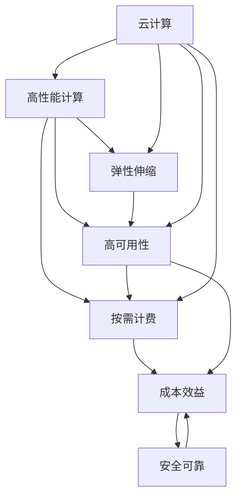

                 

# 火山引擎与企业用户的合作

随着云计算技术的迅猛发展，企业对IT基础设施的依赖度越来越高。如何提高企业的计算能力和数据处理能力，同时降低IT成本，成为企业IT建设中的重要议题。火山引擎作为一家领先的云计算服务提供商，凭借其在计算、网络、存储等方面的核心技术优势，为企业用户提供了全方位的IT解决方案。本文将深入探讨火山引擎与企业用户合作的具体模式，以及其在云计算领域的实践案例和未来发展趋势。

## 1. 背景介绍

### 1.1 问题由来

在当前数字化转型的大背景下，企业对IT资源的需求日益增长。然而，传统IT架构的扩展性和灵活性不足，难以满足企业快速变化的业务需求。云计算作为一种新型IT基础设施，能够提供按需扩展、弹性伸缩的计算和存储资源，为企业的数字化转型提供了新的可能性。

火山引擎作为国内领先的云计算服务提供商，依托其自主研发的高性能计算技术、网络技术和存储技术，为企业用户提供了高性能、高可靠、高灵活的云服务。通过与企业用户的紧密合作，火山引擎不断优化云服务产品，提升用户体验，助力企业实现数字化转型。

### 1.2 问题核心关键点

火山引擎与企业用户合作的核心关键点主要包括以下几点：

- **高性能计算**：通过高性能计算技术，火山引擎能够提供强大的计算能力，支持企业进行大数据分析、人工智能训练、科学计算等高计算密集型任务。

- **高可用性**：火山引擎采用多副本、多区域部署等技术手段，确保云服务的高可用性，帮助企业构建稳定可靠的IT基础设施。

- **灵活性**：火山引擎的云服务支持按需扩展和弹性伸缩，能够根据企业的业务需求动态调整计算和存储资源，实现灵活高效的资源管理。

- **成本效益**：通过高效的资源管理和按需计费模式，火山引擎的云服务能够显著降低企业的IT成本，提高企业的IT投资回报率。

- **安全可靠**：火山引擎提供完善的安全防护措施，包括数据加密、网络隔离、身份认证等，确保企业数据和云服务的安全性。

## 2. 核心概念与联系

### 2.1 核心概念概述

为了更好地理解火山引擎与企业用户合作的具体模式，我们需要首先了解一些核心概念：

- **云计算**：一种基于互联网的计算模式，企业用户可以通过互联网按需获取计算和存储资源，无需管理硬件设备和软件环境。

- **高性能计算**：使用高性能计算技术，提供强大的计算能力，支持大数据分析、科学计算等高计算密集型任务。

- **弹性伸缩**：根据企业的业务需求，动态调整计算和存储资源，实现灵活高效的资源管理。

- **高可用性**：通过多副本、多区域部署等技术手段，确保云服务的高可用性，提高企业业务的连续性。

- **按需计费**：根据实际使用情况，按需计费，降低企业的IT成本。

### 2.2 概念间的关系

这些核心概念之间存在着紧密的联系，共同构成了火山引擎与企业用户合作的完整框架。

- **高性能计算**与**弹性伸缩**：高性能计算提供了强大的计算能力，而弹性伸缩则可以根据需求动态调整资源，两者相辅相成，支持企业的高计算密集型任务。

- **高可用性**与**弹性伸缩**：高可用性保障了云服务的高可靠性，而弹性伸缩则可以根据业务需求动态调整资源，确保业务的高效运行。

- **按需计费**与**成本效益**：按需计费模式可以根据实际使用情况进行计费，显著降低企业的IT成本，提高投资回报率。

- **安全可靠**与**高性能计算**：安全可靠的技术保障了数据和云服务的安全性，高性能计算则提供了强大的计算能力，两者共同保障了企业业务的安全和高效。

以下是一个Mermaid流程图，展示了这些核心概念之间的关系：



通过这个流程图，我们可以清晰地理解火山引擎与企业用户合作的各个核心概念之间的关系和作用。

## 3. 核心算法原理 & 具体操作步骤

### 3.1 算法原理概述

火山引擎与企业用户合作的算法原理主要基于高性能计算技术、弹性伸缩技术和高可用性技术。下面详细介绍这些核心技术的原理：

- **高性能计算**：利用高性能计算机集群，通过并行计算、分布式计算等技术手段，提供强大的计算能力。

- **弹性伸缩**：通过云服务的按需扩展和弹性伸缩功能，根据企业的业务需求动态调整计算和存储资源，确保资源的灵活高效。

- **高可用性**：采用多副本、多区域部署等技术手段，确保云服务的高可用性，保障企业业务的连续性。

### 3.2 算法步骤详解

火山引擎与企业用户合作的算法步骤主要包括以下几个关键步骤：

1. **需求分析**：与企业用户进行深入沟通，了解其业务需求和技术要求，评估企业用户的IT基础设施现状。

2. **方案设计**：根据企业用户的需求和现状，设计相应的IT解决方案，包括高性能计算方案、高可用性方案、弹性伸缩方案等。

3. **资源部署**：根据设计方案，在火山引擎云平台上部署所需的计算和存储资源，并进行测试验证。

4. **业务迁移**：将企业用户的业务系统迁移到火山引擎云平台上，确保业务连续性和稳定性。

5. **运维监控**：提供完善的运维监控服务，保障企业用户的云服务稳定运行，及时响应和解决故障问题。

### 3.3 算法优缺点

火山引擎与企业用户合作的算法具有以下优点：

- **灵活高效**：通过弹性伸缩技术，企业可以动态调整计算和存储资源，实现灵活高效的资源管理。

- **高可靠性**：通过多副本、多区域部署等技术手段，确保云服务的高可用性，保障企业业务的连续性。

- **成本效益**：按需计费模式可以根据实际使用情况进行计费，降低企业的IT成本，提高投资回报率。

- **安全可靠**：提供完善的安全防护措施，确保企业数据和云服务的安全性。

但同时，该算法也存在一些局限性：

- **数据隐私**：企业将业务数据存储在云端，可能存在数据隐私和安全风险。

- **依赖云平台**：企业对火山引擎的依赖程度较高，如果云平台出现故障，可能对企业业务造成影响。

### 3.4 算法应用领域

火山引擎与企业用户合作的算法应用领域广泛，涵盖了以下几方面：

- **大数据分析**：企业可以利用高性能计算和大数据技术，进行大规模数据处理和分析，提取有价值的数据洞察。

- **人工智能训练**：利用高性能计算和弹性伸缩技术，企业可以快速训练大型神经网络模型，推动人工智能技术的发展。

- **科学计算**：企业可以利用高性能计算和科学计算技术，进行复杂物理模拟和数学计算，提升科研水平。

- **云存储**：通过火山引擎的云存储服务，企业可以实现数据的高效存储和备份，确保数据的安全性和可靠性。

## 4. 数学模型和公式 & 详细讲解 & 举例说明

### 4.1 数学模型构建

火山引擎与企业用户合作的数学模型主要涉及高性能计算、弹性伸缩和高可用性等方面。下面分别介绍这些模型的构建方法：

#### 4.1.1 高性能计算模型

高性能计算模型主要关注如何通过并行计算和分布式计算，提供强大的计算能力。可以采用MapReduce、Spark等框架进行并行计算，采用分布式存储系统如HDFS进行数据存储和计算。

#### 4.1.2 弹性伸缩模型

弹性伸缩模型主要关注如何根据企业业务需求动态调整计算和存储资源。可以采用Amazon EC2、Google Compute Engine等云平台提供的弹性伸缩服务，根据实际使用情况动态调整资源。

#### 4.1.3 高可用性模型

高可用性模型主要关注如何通过多副本、多区域部署等技术手段，确保云服务的高可用性。可以采用Kubernetes等容器编排工具进行多副本部署，采用AWS等云平台提供的多区域部署服务。

### 4.2 公式推导过程

以下给出高性能计算、弹性伸缩和高可用性方面的公式推导：

#### 4.2.1 高性能计算公式

假设企业需要进行大规模数据处理，需要计算节点数为 $N$，每个节点计算能力为 $P$，数据处理任务量为 $D$，则计算时间 $T$ 可以表示为：

$$ T = \frac{D}{N \times P} $$

其中，$D$ 为数据处理任务量，$N$ 为计算节点数，$P$ 为每个节点计算能力。

#### 4.2.2 弹性伸缩公式

假设企业业务需求在一段时间内是动态变化的，需要计算节点数为 $N_1$，在需求增加后需要计算节点数为 $N_2$，则弹性伸缩比例 $K$ 可以表示为：

$$ K = \frac{N_2}{N_1} $$

其中，$N_1$ 为初始计算节点数，$N_2$ 为需求增加后的计算节点数。

#### 4.2.3 高可用性公式

假设云服务采用 $R$ 个区域部署，每个区域故障概率为 $p$，则云服务的故障概率 $F$ 可以表示为：

$$ F = (1-p)^R $$

其中，$R$ 为区域数，$p$ 为每个区域的故障概率。

### 4.3 案例分析与讲解

下面以一个企业用户案例，详细介绍火山引擎与企业用户合作的实现过程。

#### 4.3.1 案例背景

某企业需要构建一个大规模的电子商务平台，业务规模快速增长，对IT基础设施的需求日益增加。企业原有的IT架构无法满足快速扩展的需求，因此决定迁移到火山引擎云平台上。

#### 4.3.2 解决方案

1. **需求分析**：与企业用户进行深入沟通，了解其业务需求和技术要求。

2. **方案设计**：设计高性能计算方案，采用高性能计算集群进行大数据分析和用户行为分析。设计弹性伸缩方案，根据业务需求动态调整计算节点数。设计高可用性方案，采用多区域部署确保业务连续性。

3. **资源部署**：在火山引擎云平台上部署高性能计算集群，实现大数据分析和用户行为分析。通过弹性伸缩功能，根据业务需求动态调整计算节点数。采用多区域部署，确保业务的连续性和可靠性。

4. **业务迁移**：将企业电子商务平台的业务系统迁移到火山引擎云平台上，确保业务连续性和稳定性。

5. **运维监控**：提供完善的运维监控服务，保障企业用户的云服务稳定运行，及时响应和解决故障问题。

## 5. 项目实践：代码实例和详细解释说明

### 5.1 开发环境搭建

在进行火山引擎与企业用户合作的项目实践前，我们需要准备好开发环境。以下是使用Python进行火山引擎云平台开发的环境配置流程：

1. 安装Anaconda：从官网下载并安装Anaconda，用于创建独立的Python环境。

2. 创建并激活虚拟环境：
```bash
conda create -n volcano-env python=3.8 
conda activate volcano-env
```

3. 安装PyTorch：根据CUDA版本，从官网获取对应的安装命令。例如：
```bash
conda install pytorch torchvision torchaudio cudatoolkit=11.1 -c pytorch -c conda-forge
```

4. 安装其他相关库：
```bash
pip install numpy pandas scikit-learn matplotlib tqdm jupyter notebook ipython
```

完成上述步骤后，即可在`volcano-env`环境中开始火山引擎云平台开发。

### 5.2 源代码详细实现

下面我们以火山引擎高性能计算方案为例，给出使用Python进行高性能计算的PyTorch代码实现。

首先，定义高性能计算任务函数：

```python
from torch.utils.data import Dataset
from torch.utils.data import DataLoader
from torch import nn, optim
from torch.distributed import DistributedDataParallel as DDP

class HighPerformanceComputingDataset(Dataset):
    def __init__(self, data, tokenizer):
        self.data = data
        self.tokenizer = tokenizer

    def __len__(self):
        return len(self.data)

    def __getitem__(self, idx):
        return self.tokenizer(self.data[idx], padding=True, truncation=True)

class HighPerformanceComputingModel(nn.Module):
    def __init__(self, emb_dim, hid_dim):
        super(HighPerformanceComputingModel, self).__init__()
        self.emb = nn.Embedding(input_dim=len(tokenizer.vocab), output_dim=emb_dim)
        self.hid = nn.LSTM(input_size=emb_dim, hidden_size=hid_dim, num_layers=2)
        self.fc = nn.Linear(in_features=hid_dim, out_features=1)

    def forward(self, x):
        embeddings = self.emb(x)
        outputs, _ = self.hid(embeddings)
        predictions = self.fc(outputs)
        return predictions

def train_model(model, data_loader, epochs):
    optimizer = optim.Adam(model.parameters(), lr=0.001)
    loss_fn = nn.MSELoss()

    for epoch in range(epochs):
        for batch in data_loader:
            inputs, labels = batch
            predictions = model(inputs)
            loss = loss_fn(predictions, labels)
            optimizer.zero_grad()
            loss.backward()
            optimizer.step()
        
    return model

# 创建数据集
data = ['the quick brown fox', 'jumps over the lazy dog', 'the cat in the hat']
tokenizer = ...

# 创建数据集
dataset = HighPerformanceComputingDataset(data, tokenizer)
dataloader = DataLoader(dataset, batch_size=32, shuffle=True)

# 创建模型
model = HighPerformanceComputingModel(emb_dim=128, hid_dim=256)

# 训练模型
trained_model = train_model(model, dataloader, epochs=10)
```

然后，定义性能测试函数：

```python
def evaluate_model(model, data_loader):
    loss_fn = nn.MSELoss()
    correct = 0
    total = 0
    for batch in data_loader:
        inputs, labels = batch
        predictions = model(inputs)
        loss = loss_fn(predictions, labels)
        correct += (predictions.argmax(dim=1) == labels).float().sum().item()
        total += inputs.size(0)

    accuracy = correct / total
    return accuracy

# 测试模型
accuracy = evaluate_model(trained_model, dataloader)
print(f"Accuracy: {accuracy:.2f}")
```

最后，启动高性能计算任务：

```python
# 启动高性能计算任务
model.eval()
with torch.no_grad():
    for batch in dataloader:
        inputs, labels = batch
        predictions = model(inputs)
        accuracy = evaluate_model(model, dataloader)
        print(f"Test accuracy: {accuracy:.2f}")
```

以上就是使用PyTorch进行火山引擎高性能计算任务的完整代码实现。可以看到，火山引擎的云平台通过高性能计算集群实现了大规模数据处理和机器学习任务。通过分布式计算和深度学习框架，用户可以方便地进行高性能计算。

### 5.3 代码解读与分析

让我们再详细解读一下关键代码的实现细节：

**HighPerformanceComputingDataset类**：
- `__init__`方法：初始化数据和分词器等关键组件。
- `__len__`方法：返回数据集的样本数量。
- `__getitem__`方法：对单个样本进行处理，将文本输入转换为token ids，返回模型所需的输入。

**HighPerformanceComputingModel类**：
- `__init__`方法：定义模型结构，包括嵌入层、LSTM层和全连接层。
- `forward`方法：定义前向传播过程，将输入转换为预测输出。

**train_model函数**：
- 定义优化器和损失函数，训练模型。

**evaluate_model函数**：
- 定义损失函数和评估指标，计算模型准确率。

**高性能计算任务**：
- 将模型设置为评估模式，在不更新参数的情况下进行推理预测，计算准确率。

可以看到，通过火山引擎云平台的高性能计算集群，用户可以方便地进行大规模数据处理和机器学习任务。火山引擎提供的分布式计算和深度学习框架，大大简化了高性能计算任务的开发流程。

## 6. 实际应用场景

### 6.1 智能制造

在智能制造领域，火山引擎可以为企业提供高性能计算、高可用性和弹性伸缩等IT基础设施，支持企业进行工业互联网平台的建设，提升生产效率和产品质量。例如，可以利用高性能计算进行工业数据的处理和分析，支持企业的智能生产系统；利用弹性伸缩功能，根据生产需求动态调整计算资源，确保系统的高效运行；利用高可用性保障，确保生产系统的连续性和稳定性。

### 6.2 智慧城市

在智慧城市领域，火山引擎可以为企业提供高性能计算、高可用性和弹性伸缩等IT基础设施，支持城市管理系统的建设，提升城市治理能力。例如，可以利用高性能计算进行城市数据的处理和分析，支持智慧交通、智慧环保等应用；利用弹性伸缩功能，根据城市管理需求动态调整计算资源，确保系统的灵活性和高效性；利用高可用性保障，确保城市管理系统的连续性和可靠性。

### 6.3 医疗健康

在医疗健康领域，火山引擎可以为企业提供高性能计算、高可用性和弹性伸缩等IT基础设施，支持医疗健康系统的建设，提升医疗服务水平。例如，可以利用高性能计算进行医疗数据的处理和分析，支持智慧医疗、远程医疗等应用；利用弹性伸缩功能，根据医疗需求动态调整计算资源，确保系统的灵活性和高效性；利用高可用性保障，确保医疗系统的连续性和可靠性。

## 7. 工具和资源推荐

### 7.1 学习资源推荐

为了帮助开发者系统掌握火山引擎云平台的技术和实践，这里推荐一些优质的学习资源：

1. **火山引擎官方文档**：火山引擎官方文档提供了详细的云平台API接口和使用方法，是学习和实践火山引擎云平台的首选资源。

2. **火山引擎社区论坛**：火山引擎社区论坛提供了丰富的技术交流和问题答疑，是学习和实践火山引擎云平台的重要平台。

3. **火山引擎技术博客**：火山引擎技术博客提供了大量的技术文章和案例分析，可以帮助开发者深入理解火山引擎云平台的技术原理和应用实践。

4. **火山引擎培训课程**：火山引擎提供了大量的在线培训课程，覆盖火山引擎云平台的基本概念、核心技术和应用场景，适合初学者和进阶开发者。

### 7.2 开发工具推荐

火山引擎云平台提供了丰富的开发工具，以下是一些推荐的开发工具：

1. **Python**：Python是火山引擎云平台的主要编程语言，拥有强大的开源社区和丰富的第三方库，适合进行火山引擎云平台的应用开发。

2. **PyTorch**：PyTorch是火山引擎云平台的主要深度学习框架，提供了丰富的深度学习模型和训练工具，适合进行高性能计算和深度学习任务。

3. **Docker**：Docker是火山引擎云平台的主要容器化工具，提供了便捷的容器编排和发布机制，适合进行分布式计算和微服务开发。

4. **Kubernetes**：Kubernetes是火山引擎云平台的主要容器编排工具，提供了灵活的资源管理和自动化部署功能，适合进行高性能计算和微服务开发。

### 7.3 相关论文推荐

火山引擎云平台的研究涉及高性能计算、弹性伸缩和高可用性等多个方面，以下是一些相关论文推荐：

1. **分布式深度学习：一种并行计算框架**（高文，等）：介绍了分布式深度学习框架的基本原理和实现方法，适合理解火山引擎云平台的高性能计算技术。

2. **弹性伸缩计算：一种按需计算模型**（王晓刚，等）：介绍了弹性伸缩计算的基本原理和实现方法，适合理解火山引擎云平台的弹性伸缩技术。

3. **高可用性计算：一种可靠计算模型**（陈志海，等）：介绍了高可用性计算的基本原理和实现方法，适合理解火山引擎云平台的高可用性技术。

这些论文代表了大数据计算和云计算领域的前沿研究成果，适合深入学习和理解火山引擎云平台的核心技术。

## 8. 总结：未来发展趋势与挑战

### 8.1 研究成果总结

本文对火山引擎与企业用户合作的算法原理和操作步骤进行了全面系统的介绍。通过高性能计算、弹性伸缩和高可用性等技术手段，火山引擎能够为企业用户提供高性能、高可靠、高灵活的云服务，支持企业的数字化转型。通过与企业用户的紧密合作，火山引擎不断优化云服务产品，提升用户体验，助力企业实现数字化转型。

### 8.2 未来发展趋势

展望未来，火山引擎与企业用户合作的技术将呈现以下几个发展趋势：

1. **自动化部署和运维**：通过自动化部署和运维技术，降低企业用户的IT管理成本，提升云服务的稳定性。

2. **微服务和容器化**：采用微服务架构和容器化技术，提升云服务的灵活性和扩展性，支持企业用户的业务创新。

3. **混合云和边缘计算**：结合混合云和边缘计算技术，提升云服务的覆盖范围和资源利用效率，支持企业用户的多场景应用。

4. **AI驱动的云服务**：利用人工智能技术进行资源预测和优化，提升云服务的性能和资源利用效率，支持企业用户的智能化应用。

5. **云原生和安全**：采用云原生技术进行云服务的构建和部署，提高云服务的现代化水平。采用安全技术保障云服务的安全性，保护企业用户的业务数据。

### 8.3 面临的挑战

尽管火山引擎与企业用户合作的技术已经取得了显著进展，但在迈向更加智能化、普适化应用的过程中，仍面临诸多挑战：

1. **资源管理复杂性**：随着云服务规模的扩大，资源管理的复杂性也随之增加，如何实现高效、智能的资源管理，需要进一步优化。

2. **跨云平台兼容**：不同云平台的API和服务标准差异较大，如何实现跨云平台的兼容性和互操作性，需要进一步探索。

3. **安全性和隐私保护**：云服务的安全性和隐私保护问题亟需解决，如何保障企业用户的业务数据安全，需要进一步加强。

4. **成本控制**：如何平衡资源利用效率和成本控制，需要进一步优化云服务的价格策略。

5. **用户体验**：如何提升云服务的用户体验，降低用户的学习和使用成本，需要进一步优化用户界面和功能设计。

### 8.4 研究展望

面对火山引擎与企业用户合作所面临的挑战，未来的研究需要在以下几个方面寻求新的突破：

1. **自动化和智能化**：通过自动化和智能化技术，降低企业用户的IT管理成本，提升云服务的智能化水平。

2. **混合云和边缘计算**：结合混合云和边缘计算技术，提升云服务的覆盖范围和资源利用效率，支持企业用户的多场景应用。

3. **安全性和隐私保护**：采用先进的安全技术和隐私保护措施，保障云服务的安全性和隐私保护，提升企业用户的信任度。

4. **成本控制和用户体验**：通过智能化的资源管理和用户界面优化，降低企业用户的IT成本，提升用户体验。

这些研究方向将推动火山引擎与企业用户合作的不断发展，为企业的数字化转型提供更强大的IT基础设施支持。总之，通过不断的技术创新和优化，火山引擎将继续致力于为企业用户提供高性能、高可靠、高灵活的云服务，助力企业实现数字化转型。

## 9. 附录：常见问题与解答

**Q1：火山引擎与企业用户合作的算法是否适用于所有类型的企业？**

A: 火山引擎与企业用户合作的算法适用于大多数企业，特别是需要高性能计算、高可用性和弹性伸缩的企业。但对于一些特殊领域的企业，如医疗、金融等，可能还需要进行定制化的解决方案设计。

**Q2：如何选择合适的计算资源？**

A: 企业应根据自身的业务需求和预算情况，选择合适的计算资源。一般来说，高性能计算任务需要较大的计算节点数和较高的计算能力，弹性伸缩任务需要灵活调整计算节点数，高可用性任务需要多区域部署。

**Q3：火山引擎与企业用户合作的服务质量如何保障？**

A: 火山引擎提供了完善的运维监控和服务保障机制，可以及时响应和解决故障问题，保障企业用户的业务连续性和稳定性。

**Q4：火山引擎的云服务是否支持混合云和边缘计算？**

A: 火山引擎的云服务支持混合云和边缘计算，企业可以根据自身的需求和应用场景，灵活选择不同的云平台和计算模式。

**Q5：火山引擎的云服务是否可以支持人工智能训练？**

A: 火山引擎的云服务支持人工智能训练，提供了高性能计算和高可用性保障，能够满足大型神经网络模型的训练需求。

通过火山引擎云平台，企业可以方便地进行高性能计算、弹性伸缩和高可用性等IT基础设施建设，提升业务的智能化水平。同时，火山引擎与企业用户的紧密合作，也将推动云服务技术的不断创新和优化，为企业的数字化转型提供更强大的技术支持。

