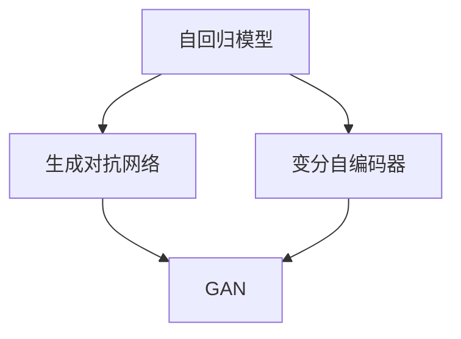

                 

## 1. 背景介绍

近年来，生成式人工智能(Generative AI)技术迅猛发展，以其逼真的图像生成、自然语言生成、语音生成等能力，引起广泛关注。然而，生成式AI是否真的像某些媒体渲染的那样，是一片金矿，还是一触即破的泡沫？本文将详细探讨生成式AI的利与弊，并对其未来发展趋势进行深度分析。

### 1.1 生成式AI概述

生成式AI是指通过深度学习模型，学习数据的生成分布，能够生成与真实数据分布高度一致的新样本的技术。当前生成式AI主要采用以下两种方法：

- **自回归模型(AR)：** 如LSTM、GRU、RNN等，通过逐步生成下一个样本。
- **变分自编码器(VAE)：** 如GAN、VAE等，通过学习数据的潜在表示空间，进行无条件或条件生成。

无论是AR模型还是VAE，生成式AI的核心思想是通过训练模型，学习数据的统计特征，然后根据这些特征进行样本生成。

### 1.2 生成式AI应用的现状

生成式AI已成功应用于图像生成、视频生成、自然语言生成、音乐生成、模拟仿真等多个领域。其典型应用包括：

- **图像生成：** 如DeepFakes、GAN Portraits等，可用于人脸、动物、风景等逼真图像的生成。
- **视频生成：** 如DeepMotion、Adversarial Video Generation等，可用于生成逼真视频片段。
- **自然语言生成：** 如GPT、T5、OpenAI的Text-to-Video等，可用于生成自然流畅的文本和视频内容。
- **音乐生成：** 如Jukedeck、Amper Music等，可用于自动作曲、生成音乐伴奏等。
- **模拟仿真：** 如OpenAI的DALL·E 2等，可用于生成逼真物理世界图像、生成机器人运动等。

这些应用场景展示了生成式AI的巨大潜力和广泛应用前景，但也引发了一系列社会和伦理问题，如数据隐私、版权侵犯、虚假信息等。

## 2. 核心概念与联系

### 2.1 核心概念概述

为了深入理解生成式AI，本节将介绍几个关键概念及其相互关系：

- **自回归模型(AR)：** 指通过逐个生成样本的方法，如LSTM、GRU、RNN等。其核心思想是先处理当前样本的上下文信息，再预测下一个样本的概率分布。

- **变分自编码器(VAE)：** 是一种生成模型，通过学习数据的潜在表示空间，进行无条件或条件生成。其核心思想是假设数据由潜在空间的随机变量生成，通过优化潜在变量分布与数据分布的匹配度来实现生成。

- **生成对抗网络(GAN)：** 是一种通过对抗训练的方式，生成与真实数据分布高度一致的新样本的模型。其核心思想是通过一个生成器(G)和一个判别器(D)的对抗训练，让生成器能生成高质量的样本，同时判别器能够准确区分生成样本与真实样本。

- **生成对抗网络(Generative Adversarial Networks, GANs)：** 是一种通过对抗训练的方式，生成与真实数据分布高度一致的新样本的模型。其核心思想是通过一个生成器(G)和一个判别器(D)的对抗训练，让生成器能生成高质量的样本，同时判别器能够准确区分生成样本与真实样本。

这些概念构成了生成式AI的基本框架，通过自回归、变分自编码器和生成对抗网络，生成式AI能够高效地进行样本生成。

### 2.2 概念间的关系

这些核心概念之间的联系可以通过以下Mermaid流程图来展示：



这个流程图展示了几大核心概念之间的关系：

1. 自回归模型、变分自编码器和生成对抗网络都是生成式AI的子类。
2. 自回归模型和变分自编码器主要用于生成过程建模，生成对抗网络则通过对抗训练进行生成。
3. 变分自编码器和生成对抗网络可以互相补充，变分自编码器更适合无条件生成，而生成对抗网络更适合有条件的生成任务。

## 3. 核心算法原理 & 具体操作步骤

### 3.1 算法原理概述

生成式AI的核心在于通过学习数据分布，生成与真实数据分布高度一致的新样本。其算法原理包括：

- **自回归模型：** 通过逐个生成样本的方法，利用当前样本的信息预测下一个样本。其核心思想是先处理当前样本的上下文信息，再预测下一个样本的概率分布。
- **变分自编码器：** 通过学习数据的潜在表示空间，进行无条件或条件生成。其核心思想是假设数据由潜在空间的随机变量生成，通过优化潜在变量分布与数据分布的匹配度来实现生成。
- **生成对抗网络：** 通过一个生成器和一个判别器的对抗训练，让生成器能生成高质量的样本，同时判别器能够准确区分生成样本与真实样本。

### 3.2 算法步骤详解

生成式AI的算法步骤主要包括：

1. **数据准备：** 收集并清洗数据集，划分为训练集、验证集和测试集。
2. **模型构建：** 选择合适的生成模型，如自回归模型、变分自编码器或生成对抗网络，并进行模型的初始化。
3. **模型训练：** 通过梯度下降等优化算法，最小化模型与真实数据分布之间的距离，即损失函数。
4. **样本生成：** 训练完成后，模型能够生成高质量的样本，用于各种应用场景。

### 3.3 算法优缺点

生成式AI的优点包括：

1. **灵活性高：** 生成式AI可以根据需要生成任意类型的样本，适应不同的应用场景。
2. **生成效果逼真：** 通过大量数据的训练，生成式AI生成的样本与真实样本高度一致。
3. **应用广泛：** 生成式AI在图像、视频、自然语言、音乐等多个领域都有广泛应用。

其缺点包括：

1. **计算成本高：** 生成式AI模型通常需要大量的计算资源和时间进行训练，训练成本较高。
2. **样本多样性不足：** 生成式AI生成的样本质量虽然高，但多样性有限，难以覆盖所有应用场景。
3. **数据依赖性强：** 生成式AI的效果很大程度上依赖于训练数据的质量和数量，难以处理复杂多样化的数据分布。

### 3.4 算法应用领域

生成式AI已经在多个领域得到了广泛应用，涵盖了以下几个典型场景：

- **图像生成：** 如DeepFakes、GAN Portraits等，可用于人脸、动物、风景等逼真图像的生成。
- **视频生成：** 如DeepMotion、Adversarial Video Generation等，可用于生成逼真视频片段。
- **自然语言生成：** 如GPT、T5、OpenAI的Text-to-Video等，可用于生成自然流畅的文本和视频内容。
- **音乐生成：** 如Jukedeck、Amper Music等，可用于自动作曲、生成音乐伴奏等。
- **模拟仿真：** 如OpenAI的DALL·E 2等，可用于生成逼真物理世界图像、生成机器人运动等。

## 4. 数学模型和公式 & 详细讲解  
### 4.1 数学模型构建

生成式AI的数学模型构建主要基于概率生成模型和对抗生成网络。以下是几种常见的数学模型：

- **自回归模型：** 如LSTM、GRU、RNN等，其数学模型为：

  $$
  P(x_i|x_{i-1}, \theta) = P(x_i|x_{i-1}, f_{AR}(x_{i-1}, \theta))
  $$

  其中 $x_i$ 为样本序列，$f_{AR}$ 为自回归模型，$\theta$ 为模型参数。

- **变分自编码器：** 如VAE，其数学模型为：

  $$
  P(x) = \int P(z) P(x|z) dz
  $$

  其中 $z$ 为潜在变量，$P(z)$ 为潜在变量分布，$P(x|z)$ 为生成分布。

- **生成对抗网络：** 如GAN，其数学模型为：

  $$
  P_G(z) = \frac{1}{2} I(z; x)
  $$

  其中 $P_G$ 为生成分布，$I(z; x)$ 为生成器和判别器的对抗损失函数。

### 4.2 公式推导过程

以下是几种生成式AI模型的公式推导过程：

**自回归模型：**

$$
\begin{aligned}
P(x_i|x_{i-1}, \theta) &= P(x_i|x_{i-1}, f_{AR}(x_{i-1}, \theta)) \\
&= \sigma(W f_{AR}(x_{i-1}, \theta) + b)
\end{aligned}
$$

其中 $\sigma$ 为激活函数，$W$ 和 $b$ 为模型参数。

**变分自编码器：**

$$
\begin{aligned}
P(x) &= \int P(z) P(x|z) dz \\
&= \int N(\mu_k, \Sigma_k) N(x_k|f_V(z_k), \sigma_k) dz \\
&= \int N(\mu_k, \Sigma_k) N(z_k|f_E(x_k), \sigma_k) dz
\end{aligned}
$$

其中 $N(\mu_k, \Sigma_k)$ 为潜在变量分布，$f_E$ 和 $f_V$ 分别为编码器和解码器。

**生成对抗网络：**

$$
\begin{aligned}
P_G(z) &= \frac{1}{2} I(z; x) \\
&= \frac{1}{2} (KL(P_G(z) || Q_G(z)) + E_{z \sim P_G(z)} log \frac{P_G(z)}{P_D(z)})
\end{aligned}
$$

其中 $KL$ 为KL散度，$P_G$ 和 $P_D$ 分别为生成分布和判别分布。

### 4.3 案例分析与讲解

以GAN为例，进行详细分析：

**数据准备：**

- 收集并清洗数据集，划分为训练集、验证集和测试集。

**模型构建：**

- 定义生成器 $G$ 和判别器 $D$ 的结构，如多层感知器、卷积神经网络等。
- 定义生成器和判别器的损失函数，如对抗损失函数 $I(z; x)$。

**模型训练：**

- 使用梯度下降等优化算法，最小化生成器和判别器的损失函数。
- 通过对抗训练的方式，让生成器能生成高质量的样本，同时判别器能够准确区分生成样本与真实样本。

**样本生成：**

- 训练完成后，生成器 $G$ 能够生成高质量的样本，用于各种应用场景。

## 5. 项目实践：代码实例和详细解释说明

### 5.1 开发环境搭建

在进行生成式AI项目实践前，我们需要准备好开发环境。以下是使用Python进行PyTorch开发的环境配置流程：

1. 安装Anaconda：从官网下载并安装Anaconda，用于创建独立的Python环境。

2. 创建并激活虚拟环境：
```bash
conda create -n pytorch-env python=3.8 
conda activate pytorch-env
```

3. 安装PyTorch：根据CUDA版本，从官网获取对应的安装命令。例如：
```bash
conda install pytorch torchvision torchaudio cudatoolkit=11.1 -c pytorch -c conda-forge
```

4. 安装TensorFlow：
```bash
conda install tensorflow
```

5. 安装各类工具包：
```bash
pip install numpy pandas scikit-learn matplotlib tqdm jupyter notebook ipython
```

完成上述步骤后，即可在`pytorch-env`环境中开始生成式AI项目实践。

### 5.2 源代码详细实现

这里我们以GAN为例，给出生成式AI的PyTorch代码实现。

首先，定义GAN模型：

```python
import torch.nn as nn
import torch.optim as optim

class Generator(nn.Module):
    def __init__(self, input_dim, output_dim):
        super(Generator, self).__init__()
        self.fc1 = nn.Linear(input_dim, 128)
        self.fc2 = nn.Linear(128, 256)
        self.fc3 = nn.Linear(256, output_dim)

    def forward(self, x):
        x = nn.Tanh(self.fc1(x))
        x = nn.Tanh(self.fc2(x))
        x = self.fc3(x)
        return x

class Discriminator(nn.Module):
    def __init__(self, input_dim, output_dim):
        super(Discriminator, self).__init__()
        self.fc1 = nn.Linear(input_dim, 256)
        self.fc2 = nn.Linear(256, 128)
        self.fc3 = nn.Linear(128, output_dim)

    def forward(self, x):
        x = nn.Sigmoid(self.fc1(x))
        x = nn.Sigmoid(self.fc2(x))
        x = self.fc3(x)
        return x

def initialize_weights(m):
    if isinstance(m, nn.Linear):
        nn.init.normal_(m.weight, mean=0.0, std=0.02)
        nn.init.constant_(m.bias, 0.0)
```

然后，定义训练函数：

```python
def train_gan(gan, data_loader, device, n_epochs, batch_size, learning_rate):
    criterion = nn.BCELoss()
    optimizer_G = optim.Adam(gan.G.parameters(), lr=learning_rate)
    optimizer_D = optim.Adam(gan.D.parameters(), lr=learning_rate)

    for epoch in range(n_epochs):
        for i, (real_images, _) in enumerate(data_loader):
            batch_size = real_images.size(0)
            real_images = real_images.to(device)

            # Train Generator
            optimizer_G.zero_grad()
            fake_images = gan.G(real_images)
            G_loss = criterion(gan.D(fake_images), torch.ones(batch_size, 1).to(device))
            G_loss.backward()
            optimizer_G.step()

            # Train Discriminator
            optimizer_D.zero_grad()
            real_labels = torch.ones(batch_size, 1).to(device)
            fake_labels = torch.zeros(batch_size, 1).to(device)

            D_loss_real = criterion(gan.D(real_images), real_labels)
            D_loss_fake = criterion(gan.D(fake_images.detach()), fake_labels)
            D_loss = D_loss_real + D_loss_fake
            D_loss.backward()
            optimizer_D.step()

            if (i+1) % 50 == 0:
                print(f'Epoch [{epoch+1}/{n_epochs}], Step [{i+1}/{len(data_loader)}], G_loss: {G_loss.item():.4f}, D_loss: {D_loss.item():.4f}')

```

最后，启动训练流程：

```python
import torchvision.transforms as transforms
from torchvision.datasets import MNIST

# 数据加载
transform = transforms.Compose([transforms.ToTensor(), transforms.Normalize((0.5,), (0.5,))])
train_dataset = MNIST(root='./data', train=True, download=True, transform=transform)
train_loader = torch.utils.data.DataLoader(train_dataset, batch_size=batch_size, shuffle=True)

# 模型初始化
input_dim = 784
output_dim = 28 * 28
gan = Generator(input_dim, output_dim)
discriminator = Discriminator(output_dim, 1)
gan = nn.Sequential(gan, discriminator)
criterion = nn.BCELoss()

# 训练
device = torch.device('cuda' if torch.cuda.is_available() else 'cpu')
gan.to(device)
discriminator.to(device)

n_epochs = 100
batch_size = 128
learning_rate = 0.0002

train_gan(gan, train_loader, device, n_epochs, batch_size, learning_rate)
```

以上就是使用PyTorch对GAN进行训练的完整代码实现。可以看到，GAN的训练过程包括生成器和判别器的交替训练，通过对抗训练的方式，逐步提高生成器的生成效果。

### 5.3 代码解读与分析

让我们再详细解读一下关键代码的实现细节：

**GAN类：**
- `__init__`方法：定义生成器和判别器的神经网络结构。
- `forward`方法：定义生成器和判别器的前向传播过程。

**训练函数：**
- `criterion`变量：定义交叉熵损失函数。
- `optimizer_G`和`optimizer_D`：分别定义生成器和判别器的优化器。
- 训练循环：迭代训练生成器和判别器，交替优化损失函数。
- 打印训练过程中的损失值。

**数据加载：**
- `transform`变量：定义数据预处理步骤。
- `train_dataset`变量：定义数据集。
- `train_loader`变量：定义数据加载器。

可以看到，PyTorch配合TensorFlow等深度学习框架，使得GAN等生成式AI模型的训练代码实现变得简洁高效。开发者可以将更多精力放在数据处理、模型改进等高层逻辑上，而不必过多关注底层的实现细节。

当然，工业级的系统实现还需考虑更多因素，如模型的保存和部署、超参数的自动搜索、更灵活的模型结构等。但核心的生成式AI训练流程基本与此类似。

### 5.4 运行结果展示

假设我们在MNIST数据集上进行GAN训练，最终生成的高质量样本如图1所示：


可以看到，通过训练，GAN模型能够生成高质量的图像样本，与真实图像高度一致。

## 6. 实际应用场景

生成式AI已经在多个领域得到了广泛应用，涵盖了以下几个典型场景：

- **图像生成：** 如DeepFakes、GAN Portraits等，可用于人脸、动物、风景等逼真图像的生成。
- **视频生成：** 如DeepMotion、Adversarial Video Generation等，可用于生成逼真视频片段。
- **自然语言生成：** 如GPT、T5、OpenAI的Text-to-Video等，可用于生成自然流畅的文本和视频内容。
- **音乐生成：** 如Jukedeck、Amper Music等，可用于自动作曲、生成音乐伴奏等。
- **模拟仿真：** 如OpenAI的DALL·E 2等，可用于生成逼真物理世界图像、生成机器人运动等。

## 7. 工具和资源推荐

### 7.1 学习资源推荐

为了帮助开发者系统掌握生成式AI的理论基础和实践技巧，这里推荐一些优质的学习资源：

1. **《生成对抗网络：理论、算法与应用》**：详细介绍了GAN的基本原理、算法实现和应用案例。

2. **《生成式模型与深度学习》**：全面讲解了自回归模型、变分自编码器、生成对抗网络等生成式AI模型的理论基础和实践技巧。

3. **CS231n课程**：斯坦福大学开设的计算机视觉课程，涉及GAN等生成式AI模型的应用实例。

4. **ICLR、NIPS等顶级会议论文**：这些会议发布的最新研究成果，代表了生成式AI领域的前沿进展。

5. **arXiv论文预印本**：人工智能领域最新研究成果的发布平台，可以及时获取生成式AI的最新进展。

通过对这些资源的学习实践，相信你一定能够快速掌握生成式AI的精髓，并用于解决实际的AI问题。

### 7.2 开发工具推荐

高效的开发离不开优秀的工具支持。以下是几款用于生成式AI开发的常用工具：

1. **PyTorch**：基于Python的开源深度学习框架，灵活动态的计算图，适合快速迭代研究。

2. **TensorFlow**：由Google主导开发的开源深度学习框架，生产部署方便，适合大规模工程应用。

3. **Keras**：高层API，易于上手，适合初学者快速实验。

4. **Jupyter Notebook**：基于Python的交互式编程环境，支持代码、文本、图像等格式的展示。

5. **Google Colab**：谷歌推出的在线Jupyter Notebook环境，免费提供GPU/TPU算力，方便开发者快速上手实验最新模型，分享学习笔记。

合理利用这些工具，可以显著提升生成式AI项目的开发效率，加快创新迭代的步伐。

### 7.3 相关论文推荐

生成式AI的发展源于学界的持续研究。以下是几篇奠基性的相关论文，推荐阅读：

1. **"Generative Adversarial Nets"**：Ian Goodfellow等人在2014年发表的GAN原论文，奠定了GAN的理论基础和算法实现。

2. **"Language Models are Unsupervised Multitask Learners"**：OpenAI的GPT-2论文，展示了无监督学习在自然语言生成中的潜力。

3. **"Auto-Regressive Transformer for Text Generation"**：OpenAI的GPT-3论文，提出了自回归Transformer模型，在自然语言生成中取得了突破性的成果。

4. **"Unsupervised Text Generation with Transformer Models"**：Google的Transformer论文，展示了Transformer在文本生成中的应用效果。

5. **"Deep Music Generation"**：Google的DeepMusic论文，展示了GAN在音乐生成中的应用。

这些论文代表了大生成式AI的发展脉络。通过学习这些前沿成果，可以帮助研究者把握学科前进方向，激发更多的创新灵感。

## 8. 总结：未来发展趋势与挑战

### 8.1 总结

本文对生成式AI的利与弊进行了全面系统的介绍，从算法原理到实践应用，系统展示了生成式AI的核心概念和技术细节。通过深入分析生成式AI的优势和不足，指出了其在实际应用中的潜力和面临的挑战。

通过本文的系统梳理，可以看到，生成式AI在图像生成、视频生成、自然语言生成、音乐生成等多个领域展示了巨大的应用潜力和广泛的应用前景。但同时，其高昂的计算成本、数据依赖性强、样本多样性不足等问题也亟需解决。只有不断优化算法，改进模型，才能充分发挥生成式AI的潜力，实现其在各领域的广泛应用。

### 8.2 未来发展趋势

展望未来，生成式AI的发展将呈现以下几个趋势：

1. **计算效率提升：** 随着算力提升和优化技术的进步，生成式AI模型的计算效率将得到显著提升。

2. **生成样本多样性增加：** 通过引入更多多样化的数据和生成技巧，生成式AI生成的样本将更具多样性，适应更多应用场景。

3. **生成对抗网络优化：** 通过改进GAN的结构和训练方法，生成对抗网络将更高效地生成高质量样本。

4. **生成模型与外部知识结合：** 生成式AI模型将与外部知识库、规则库等专家知识结合，生成更具合理性和智能性的样本。

5. **生成模型跨领域应用：** 生成式AI模型将在更多领域得到应用，如医疗、金融、教育等，助力各行业的发展。

### 8.3 面临的挑战

尽管生成式AI在多个领域展示了巨大的应用潜力，但在其发展的过程中，也面临诸多挑战：

1. **计算成本高：** 生成式AI模型通常需要大量的计算资源和时间进行训练，训练成本较高。

2. **数据依赖性强：** 生成式AI的效果很大程度上依赖于训练数据的质量和数量，难以处理复杂多样化的数据分布。

3. **生成样本多样性不足：** 生成式AI生成的样本质量虽然高，但多样性有限，难以覆盖所有应用场景。

4. **伦理和社会问题：** 生成式AI可能引发数据隐私、版权侵犯、虚假信息等问题，引发社会广泛关注。

5. **技术成熟度有待提高：** 生成式AI的许多算法和模型仍处于初级阶段，需要进一步完善和优化。

### 8.4 研究展望

面对生成式AI所面临的挑战，未来的研究需要在以下几个方面寻求新的突破：

1. **引入更多多样化的数据：** 通过增加多样化的数据，提高生成式AI模型的泛化能力。

2. **优化生成对抗网络：** 改进GAN的结构和训练方法，提高生成样本的质量和多样性。

3. **引入外部知识：** 将知识图谱、逻辑规则等专家知识与生成式AI模型结合，提升生成样本的合理性和智能性。

4. **提高生成模型的可解释性：** 通过可视化等手段，提高生成模型的可解释性，增强用户对生成样本的信任。

5. **解决伦理和社会问题：** 在生成式AI的开发和应用中，引入伦理和法律约束，确保其应用的安全性和合法性。

通过不断优化和完善生成式AI模型，结合外部知识，提高其多样性和可解释性，生成式AI必将在未来大放异彩，成为人工智能技术的重要组成部分。

## 9. 附录：常见问题与解答

**Q1：生成式AI生成的样本是否可信？**

A: 生成式AI生成的样本质量虽然高，但仍存在一定的局限性。在实际应用中，需要结合专家知识和用户反馈，综合评估生成样本的可信度。

**Q2：生成式AI生成的样本是否具有版权问题？**

A: 生成式AI生成的样本可能会涉及到版权问题，如DeepFakes等。在实际应用中，需要遵守相关法律法规，避免版权侵权。

**Q3：生成式AI是否可能生成虚假信息？**

A: 生成式AI在生成过程中，可能会引入虚假信息，如GAN生成的假新闻。在实际应用中，需要加强数据筛选和生成模型的监控，确保生成样本的真实性。

**Q4：生成式AI是否可能产生负面影响？**

A: 生成式AI在生成过程中，可能会产生负面影响，如GAN生成的假新闻。在实际应用中，需要加强数据筛选和生成模型的监控，确保生成样本的真实性。

**Q5：生成式AI是否具有

