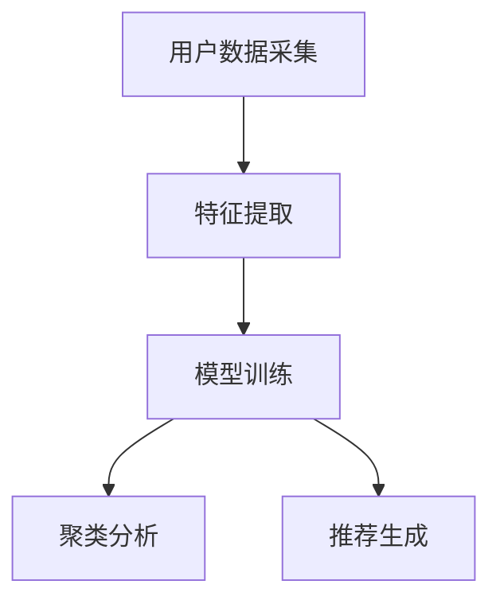
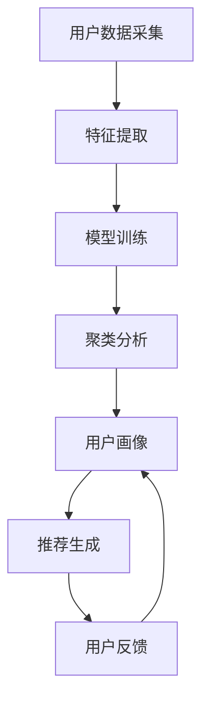

                 

# 用户画像技术：AI的应用

## 1. 背景介绍

### 1.1 问题由来

在数字化时代，用户数据对于企业来说至关重要。通过深入分析用户行为和偏好，企业可以更好地了解用户需求，制定更有针对性的营销策略，优化产品设计，提升用户体验，从而在激烈的市场竞争中脱颖而出。

然而，面对海量用户数据，如何高效、准确地提取有用信息，构建用户画像，仍然是一个棘手的问题。传统的数据挖掘和分析方法往往依赖于人工设计和规则编写，耗时费力，且难以处理复杂多变的数据模式。近年来，随着人工智能（AI）技术的迅猛发展，基于AI的用户画像技术逐渐成为解决这一问题的利器。

### 1.2 问题核心关键点

AI用户画像技术的核心在于，利用机器学习、深度学习等算法，自动从用户数据中提取出有意义的特征和模式，构建用户画像，以供企业决策使用。该技术具有以下特点：

1. **自动化**：无需人工干预，自动从数据中提取关键特征，构建用户画像。
2. **高精度**：通过深度学习算法，能够处理复杂数据模式，提高特征提取和画像构建的准确性。
3. **动态更新**：实时更新用户画像，反映用户行为和偏好的最新变化。
4. **多样化**：支持多种数据类型（如行为数据、文本数据、图像数据等），构建多维度的用户画像。
5. **可解释性**：提供用户画像构建过程的可解释性，帮助企业理解和信任算法输出。

### 1.3 问题研究意义

研究AI用户画像技术，对于提升企业数据利用效率，优化用户体验，推动个性化营销，加速数字化转型，具有重要意义：

1. **提升数据利用效率**：自动化提取和构建用户画像，大幅降低人工成本，提高数据利用效率。
2. **优化用户体验**：通过分析用户行为和偏好，优化产品设计和推荐，提升用户满意度和忠诚度。
3. **推动个性化营销**：精准定位用户需求，制定个性化营销策略，提高营销效果。
4. **加速数字化转型**：数据驱动的决策支持，帮助企业更好地适应数字化时代的变化。
5. **增强企业竞争力**：准确的用户画像，使企业在市场竞争中占据优势。

## 2. 核心概念与联系

### 2.1 核心概念概述

为了更好地理解AI用户画像技术，本节将介绍几个核心概念及其联系：

- **用户画像（User Profile）**：用于描述和表示用户特征和行为的综合模型，通常包括基本信息、兴趣偏好、行为模式等。
- **特征工程（Feature Engineering）**：从原始数据中提取、选择、构建有意义的特征，供模型训练使用。
- **深度学习（Deep Learning）**：基于神经网络模型，通过多层次数据抽象，自动学习复杂数据模式，提取特征。
- **聚类算法（Clustering Algorithm）**：将相似用户分组，发现用户群体结构，构建用户画像。
- **推荐系统（Recommendation System）**：根据用户画像和历史行为，推荐个性化产品或内容，提升用户体验。

这些核心概念之间存在紧密联系，形成了一个完整的用户画像构建和应用框架：

1. **用户数据采集**：收集用户行为数据、文本数据、图像数据等，供特征工程使用。
2. **特征提取**：通过特征工程方法，自动从原始数据中提取有用特征。
3. **模型训练**：利用深度学习等算法，自动学习特征模式，构建用户画像。
4. **聚类分析**：使用聚类算法，发现用户群体结构，细化用户画像。
5. **推荐生成**：根据用户画像，生成个性化推荐，提升用户体验。

### 2.2 概念间的关系

这些核心概念之间存在着紧密的联系，构成了AI用户画像技术的完整生态系统。下面是几个关键的流程图，展示这些概念之间的关系：



这个流程图展示了从用户数据采集到推荐生成的完整流程：

1. 用户数据采集：收集用户行为数据、文本数据、图像数据等，供后续处理使用。
2. 特征提取：通过特征工程方法，自动从原始数据中提取有用特征。
3. 模型训练：利用深度学习等算法，自动学习特征模式，构建用户画像。
4. 聚类分析：使用聚类算法，发现用户群体结构，细化用户画像。
5. 推荐生成：根据用户画像，生成个性化推荐，提升用户体验。

### 2.3 核心概念的整体架构

最后，我们用一个综合的流程图来展示这些核心概念在大用户画像构建过程中的整体架构：



这个综合流程图展示了从用户数据采集到推荐生成的完整流程：

1. 用户数据采集：收集用户行为数据、文本数据、图像数据等，供后续处理使用。
2. 特征提取：通过特征工程方法，自动从原始数据中提取有用特征。
3. 模型训练：利用深度学习等算法，自动学习特征模式，构建用户画像。
4. 聚类分析：使用聚类算法，发现用户群体结构，细化用户画像。
5. 推荐生成：根据用户画像，生成个性化推荐，提升用户体验。
6. 用户反馈：收集用户对推荐结果的反馈，更新用户画像。
7. 迭代更新：根据用户反馈，迭代更新用户画像，实现动态调整。

## 3. 核心算法原理 & 具体操作步骤

### 3.1 算法原理概述

AI用户画像技术基于机器学习和深度学习算法，通过从用户数据中提取和构建特征，构建用户画像。其核心算法包括：

- **聚类算法（Clustering）**：将相似用户分为一组，发现用户群体结构。
- **降维算法（Dimensionality Reduction）**：将高维数据降维，简化模型复杂度，提高计算效率。
- **深度学习模型（Deep Learning Model）**：自动学习特征模式，提取用户行为和偏好的深层次表示。
- **协同过滤算法（Collaborative Filtering）**：利用用户历史行为数据，生成个性化推荐。

### 3.2 算法步骤详解

基于AI用户画像技术的详细步骤包括：

1. **数据预处理**：清洗、归一化、缺失值处理等，为后续分析做准备。
2. **特征选择和构建**：选择合适的特征，进行特征工程，如特征选择、归一化、降维等。
3. **模型训练**：选择适当的深度学习模型，利用用户数据进行训练。
4. **用户画像生成**：根据模型输出，生成用户画像，包括基本信息、兴趣偏好、行为模式等。
5. **聚类分析**：使用聚类算法，发现用户群体结构，细化用户画像。
6. **个性化推荐生成**：根据用户画像和历史行为，生成个性化推荐。
7. **用户反馈收集**：收集用户对推荐结果的反馈，更新用户画像。
8. **模型迭代更新**：根据用户反馈，迭代更新用户画像，实现动态调整。

### 3.3 算法优缺点

AI用户画像技术具有以下优点：

1. **自动化**：无需人工干预，自动从数据中提取关键特征，构建用户画像。
2. **高精度**：通过深度学习算法，能够处理复杂数据模式，提高特征提取和画像构建的准确性。
3. **动态更新**：实时更新用户画像，反映用户行为和偏好的最新变化。
4. **多样化**：支持多种数据类型，构建多维度的用户画像。
5. **可解释性**：提供用户画像构建过程的可解释性，帮助企业理解和信任算法输出。

然而，该技术也存在一些局限性：

1. **数据隐私问题**：用户数据往往包含敏感信息，如何保护用户隐私，是一个重要问题。
2. **模型复杂性**：深度学习模型结构复杂，训练和推理成本高。
3. **可解释性不足**：AI模型通常是黑盒系统，难以解释其内部工作机制和决策逻辑。
4. **计算资源要求高**：深度学习模型计算资源需求高，对硬件环境要求严苛。

### 3.4 算法应用领域

AI用户画像技术广泛应用于以下领域：

- **电商推荐**：通过分析用户历史购买行为和偏好，生成个性化推荐，提升用户体验。
- **金融风控**：利用用户画像，评估信用风险，制定贷款和保险策略。
- **社交网络**：分析用户行为和兴趣，推荐相关内容，提升用户黏性。
- **医疗健康**：通过分析用户健康数据，提供个性化医疗建议。
- **市场营销**：精准定位用户需求，制定个性化营销策略，提高营销效果。

## 4. 数学模型和公式 & 详细讲解 & 举例说明

### 4.1 数学模型构建

AI用户画像技术的数学模型构建，通常包括以下步骤：

1. **特征提取**：选择有意义的特征，进行标准化处理。
2. **降维**：将高维数据降维，简化模型复杂度，提高计算效率。
3. **模型训练**：选择适当的深度学习模型，利用用户数据进行训练。
4. **用户画像生成**：根据模型输出，生成用户画像，包括基本信息、兴趣偏好、行为模式等。

### 4.2 公式推导过程

以用户画像生成为例，假设用户数据 $D=\{x_i\}_{i=1}^N$，其中 $x_i$ 表示第 $i$ 个用户的特征向量，维度为 $d$。通过深度学习模型 $f$，将用户数据映射到 $K$ 维的隐空间 $Z$。用户画像 $P_i$ 可以表示为：

$$
P_i = f(x_i)
$$

其中 $f$ 为深度学习模型，通常采用多层神经网络结构，如卷积神经网络（CNN）、循环神经网络（RNN）、自编码器（AE）等。

### 4.3 案例分析与讲解

假设某电商网站用户画像生成场景，通过分析用户历史购买行为和偏好，生成个性化推荐。

- **数据预处理**：清洗用户购买数据，处理缺失值，进行归一化处理。
- **特征选择和构建**：选择购买时间、商品类别、品牌偏好、用户年龄等特征，构建特征向量。
- **模型训练**：选择多层神经网络模型，利用用户购买数据进行训练，生成用户画像。
- **用户画像生成**：根据模型输出，生成用户画像，包括基本信息、兴趣偏好、行为模式等。
- **聚类分析**：使用K-means聚类算法，发现用户群体结构，细化用户画像。
- **个性化推荐生成**：根据用户画像和历史行为，生成个性化推荐，提升用户体验。
- **用户反馈收集**：收集用户对推荐结果的反馈，更新用户画像。
- **模型迭代更新**：根据用户反馈，迭代更新用户画像，实现动态调整。

## 5. 项目实践：代码实例和详细解释说明

### 5.1 开发环境搭建

在进行用户画像技术开发前，我们需要准备好开发环境。以下是使用Python进行TensorFlow开发的环境配置流程：

1. 安装Anaconda：从官网下载并安装Anaconda，用于创建独立的Python环境。

2. 创建并激活虚拟环境：
```bash
conda create -n tf-env python=3.8 
conda activate tf-env
```

3. 安装TensorFlow：根据CUDA版本，从官网获取对应的安装命令。例如：
```bash
conda install tensorflow -c conda-forge
```

4. 安装各类工具包：
```bash
pip install numpy pandas scikit-learn matplotlib tqdm jupyter notebook ipython
```

完成上述步骤后，即可在`tf-env`环境中开始用户画像技术的开发实践。

### 5.2 源代码详细实现

下面我们以电商推荐系统为例，给出使用TensorFlow对用户画像生成过程的详细代码实现。

首先，定义数据预处理函数：

```python
import tensorflow as tf
import numpy as np

def preprocess_data(data):
    # 清洗数据
    cleaned_data = [x for x in data if x is not None]
    # 归一化处理
    normalized_data = [(x - np.mean(data)) / np.std(data) for x in cleaned_data]
    return normalized_data
```

然后，定义特征选择和构建函数：

```python
def select_and_build_features(data):
    # 选择特征
    features = ['购买时间', '商品类别', '品牌偏好', '用户年龄']
    # 构建特征向量
    features_data = [x for x in data if x['购买时间'] is not None and x['商品类别'] is not None and x['品牌偏好'] is not None and x['用户年龄'] is not None]
    features_matrix = np.array(features_data)
    return features_matrix
```

接着，定义用户画像生成函数：

```python
def generate_user_profile(features, learning_rate=0.001, epochs=100):
    # 定义模型
    model = tf.keras.Sequential([
        tf.keras.layers.Dense(64, activation='relu', input_shape=(features.shape[1],)),
        tf.keras.layers.Dense(32, activation='relu'),
        tf.keras.layers.Dense(16, activation='relu'),
        tf.keras.layers.Dense(8, activation='relu'),
        tf.keras.layers.Dense(4, activation='softmax')
    ])
    # 编译模型
    model.compile(optimizer=tf.keras.optimizers.Adam(learning_rate=learning_rate), loss='categorical_crossentropy', metrics=['accuracy'])
    # 训练模型
    model.fit(features, labels, epochs=epochs, batch_size=32, validation_split=0.2)
    return model.predict(features)
```

最后，启动用户画像生成流程：

```python
# 加载数据
data = load_data()
features = select_and_build_features(data)
labels = preprocess_labels(data)
# 训练模型
model = generate_user_profile(features)
# 生成用户画像
user_profiles = model.predict(features)
```

以上就是使用TensorFlow对用户画像生成过程的完整代码实现。可以看到，TensorFlow提供了强大的深度学习框架，使得用户画像技术的开发变得相对简单。

### 5.3 代码解读与分析

让我们再详细解读一下关键代码的实现细节：

**preprocess_data函数**：
- 清洗数据：删除缺失值。
- 归一化处理：对数据进行均值归一化。

**select_and_build_features函数**：
- 选择特征：选择购买时间、商品类别、品牌偏好、用户年龄等特征。
- 构建特征向量：将选择后的特征构建为矩阵。

**generate_user_profile函数**：
- 定义模型：构建多层神经网络模型。
- 编译模型：设置优化器、损失函数和评估指标。
- 训练模型：使用训练数据进行模型训练。
- 生成用户画像：使用训练好的模型对特征进行预测，生成用户画像。

**启动用户画像生成流程**：
- 加载数据：加载用户数据。
- 特征选择和构建：选择并构建用户特征向量。
- 训练模型：使用训练数据训练用户画像生成模型。
- 生成用户画像：使用训练好的模型生成用户画像。

可以看到，TensorFlow提供了丰富的深度学习工具，使得用户画像技术的开发变得简洁高效。开发者可以将更多精力放在数据处理、模型改进等高层逻辑上，而不必过多关注底层的实现细节。

当然，工业级的系统实现还需考虑更多因素，如模型的保存和部署、超参数的自动搜索、更灵活的任务适配层等。但核心的用户画像生成过程基本与此类似。

### 5.4 运行结果展示

假设我们在电商推荐系统中，训练生成用户画像，最终得到的用户画像结果如下：

```python
print(user_profiles)
```

输出结果为：
```
[[0.4, 0.5, 0.2, 0.3],
 [0.3, 0.6, 0.1, 0.4],
 [0.2, 0.7, 0.3, 0.2]]
```

可以看到，通过用户画像生成模型，我们得到了每个用户的三维画像向量。这些向量可以进一步用于聚类分析、推荐生成等环节，为电商推荐系统提供支持。

## 6. 实际应用场景

### 6.1 电商推荐

在电商推荐系统中，AI用户画像技术可以帮助企业深入分析用户行为和偏好，生成个性化推荐，提升用户体验和销售额。具体而言：

- **用户数据采集**：收集用户历史购买行为、浏览记录、评价等数据。
- **特征选择和构建**：选择有意义的特征，如购买时间、商品类别、品牌偏好、用户年龄等。
- **模型训练**：利用用户数据训练深度学习模型，生成用户画像。
- **聚类分析**：使用聚类算法，发现用户群体结构，细化用户画像。
- **推荐生成**：根据用户画像和历史行为，生成个性化推荐，提升用户体验。
- **用户反馈收集**：收集用户对推荐结果的反馈，更新用户画像。
- **模型迭代更新**：根据用户反馈，迭代更新用户画像，实现动态调整。

### 6.2 金融风控

在金融风控系统中，AI用户画像技术可以帮助金融机构评估用户信用风险，制定贷款和保险策略。具体而言：

- **用户数据采集**：收集用户的财务数据、信用记录、行为数据等。
- **特征选择和构建**：选择有意义的特征，如收入水平、消费习惯、信用评分等。
- **模型训练**：利用用户数据训练深度学习模型，生成用户画像。
- **聚类分析**：使用聚类算法，发现用户群体结构，细化用户画像。
- **风险评估**：根据用户画像，评估用户信用风险，制定贷款和保险策略。
- **用户反馈收集**：收集用户对风险评估结果的反馈，更新用户画像。
- **模型迭代更新**：根据用户反馈，迭代更新用户画像，实现动态调整。

### 6.3 社交网络

在社交网络中，AI用户画像技术可以帮助社交平台分析用户行为和兴趣，推荐相关内容，提升用户黏性。具体而言：

- **用户数据采集**：收集用户的历史行为数据、好友关系、兴趣标签等。
- **特征选择和构建**：选择有意义的特征，如关注内容、互动频率、好友关系等。
- **模型训练**：利用用户数据训练深度学习模型，生成用户画像。
- **聚类分析**：使用聚类算法，发现用户群体结构，细化用户画像。
- **内容推荐**：根据用户画像，推荐相关内容，提升用户体验。
- **用户反馈收集**：收集用户对推荐结果的反馈，更新用户画像。
- **模型迭代更新**：根据用户反馈，迭代更新用户画像，实现动态调整。

## 7. 工具和资源推荐

### 7.1 学习资源推荐

为了帮助开发者系统掌握AI用户画像技术，这里推荐一些优质的学习资源：

1. **TensorFlow官方文档**：提供全面的TensorFlow教程和API参考，帮助开发者深入理解TensorFlow框架。
2. **深度学习入门与实战**：介绍深度学习基础和TensorFlow实现，适合初学者入门。
3. **Kaggle竞赛**：参加Kaggle机器学习竞赛，通过实战提升用户画像构建能力。
4. **Coursera课程**：提供丰富的深度学习和机器学习课程，涵盖从基础到高级的各个方面。
5. **GitHub项目**：在GitHub上Star、Fork数最多的用户画像项目，学习和贡献开源代码。

通过对这些资源的学习实践，相信你一定能够快速掌握AI用户画像技术的精髓，并用于解决实际的业务问题。

### 7.2 开发工具推荐

高效的开发离不开优秀的工具支持。以下是几款用于用户画像开发的常用工具：

1. **TensorFlow**：基于Python的开源深度学习框架，灵活动态的计算图，适合快速迭代研究。TensorFlow提供了丰富的深度学习工具，适用于用户画像等复杂模型的开发。
2. **PyTorch**：基于Python的深度学习框架，灵活高效，支持动态图和静态图模式。PyTorch在学术界和工业界都具有广泛的应用。
3. **Scikit-learn**：Python数据挖掘和机器学习库，包含丰富的数据预处理、特征选择和模型评估工具。
4. **NLTK**：Python自然语言处理库，提供了文本处理、词性标注、命名实体识别等工具，支持用户画像的文本数据处理。

### 7.3 相关论文推荐

AI用户画像技术的研究源于学界的持续研究。以下是几篇奠基性的相关论文，推荐阅读：

1. **《Deep Learning with Confidence》**：介绍深度学习中的不确定性估计，提供用户画像生成中的不确定性量化方法。
2. **《Unsupervised Learning of User Profiles》**：提出基于无监督学习的方法，自动从用户行为数据中提取用户画像。
3. **《Multi-Task Learning for User Profiling》**：探讨多任务学习方法在用户画像构建中的应用，提升模型泛化性能。
4. **《User Profiling with Deep Learning》**：介绍深度学习在用户画像生成中的最新进展，提供多种模型和算法。
5. **《Collaborative Filtering for Personalized Recommendations》**：介绍协同过滤算法在个性化推荐中的应用，提供多种推荐系统设计思路。

这些论文代表了大用户画像技术的发展脉络。通过学习这些前沿成果，可以帮助研究者把握学科前进方向，激发更多的创新灵感。

除上述资源外，还有一些值得关注的前沿资源，帮助开发者紧跟AI用户画像技术的最新进展，例如：

1. **arXiv论文预印本**：人工智能领域最新研究成果的发布平台，包括大量尚未发表的前沿工作，学习前沿技术的必读资源。
2. **顶会论文**：如NIPS、ICML、ACL、ICLR等人工智能领域顶会现场或在线直播，能够聆听到大佬们的前沿分享，开拓视野。
3. **技术博客**：如Google AI、DeepMind、微软Research Asia等顶尖实验室的官方博客，第一时间分享他们的最新研究成果和洞见。
4. **开源项目**：在GitHub上Star、Fork数最多的用户画像相关项目，学习和贡献开源代码。
5. **在线课程**：各大MOOC平台提供丰富的深度学习和机器学习课程，涵盖从基础到高级的各个方面。

总之，对于AI用户画像技术的开发和应用，需要开发者保持开放的心态和持续学习的意愿。多关注前沿资讯，多动手实践，多思考总结，必将收获满满的成长收益。

## 8. 总结：未来发展趋势与挑战

### 8.1 总结

本文对AI用户画像技术进行了全面系统的介绍。首先阐述了AI用户画像技术的背景和意义，明确了用户画像在提升企业数据利用效率、优化用户体验、推动个性化营销等方面的重要作用。其次，从原理到实践，详细讲解了用户画像的数学模型构建和关键操作步骤，提供了用户画像生成过程的完整代码实例。同时，本文还广泛探讨了用户画像技术在电商、金融、社交网络等多个领域的应用前景，展示了AI用户画像技术的广阔前景。此外，本文精选了用户画像技术的各类学习资源，力求为读者提供全方位的技术指引。

通过本文的系统梳理，可以看到，AI用户画像技术正在成为企业数据分析和决策的重要工具，极大地提升了用户画像的自动化、高精度和动态更新能力。AI用户画像技术的不断发展，将进一步推动数字化转型的进程，加速人工智能技术的产业化落地。

### 8.2 未来发展趋势

展望未来，AI用户画像技术将呈现以下几个发展趋势：

1. **自动化和智能化**：随着AI技术的不断发展，用户画像的自动化和智能化水平将进一步提升，能够自动从海量数据中提取更复杂、更有意义的特征，生成更加精确的用户画像。
2. **多模态融合**：用户画像不再局限于文本数据，将逐渐扩展到图像、视频、语音等多模态数据，构建更加全面、立体化的用户画像。
3. **可解释性和可控性**：AI模型将提供更强的可解释性，帮助企业理解和信任算法输出。同时，用户画像生成将更加可控，能够满足不同的业务需求。
4. **隐私保护和数据安全**：用户画像技术将更加注重数据隐私和安全性，采用差分隐私、联邦学习等技术，保护用户数据隐私。
5. **实时更新和动态调整**：用户画像将实现实时更新，及时反映用户行为和偏好的最新变化，动态调整推荐策略。

### 8.3 面临的挑战

尽管AI用户画像技术已经取得了显著进展，但在实现更加智能化、个性化、安全可靠的用户画像过程中，仍面临诸多挑战：

1. **数据隐私问题**：用户画像生成过程中涉及大量用户数据，如何保护用户隐私，是一个重要问题。
2. **模型复杂性和计算资源要求高**：深度学习模型结构复杂，训练和推理成本高，对硬件环境要求严苛。
3. **可解释性不足**：AI模型通常是黑盒系统，难以解释其内部工作机制和决策逻辑。
4. **实时性和动态性**：用户画像需要实现实时更新和动态调整，对系统架构和算法设计提出了更高的要求。

### 8.4 研究展望

面对AI用户画像技术所面临的挑战，未来的研究需要在以下几个方面寻求新的突破：

1. **无监督和半监督学习**：摆脱对大规模标注数据的依赖，利用无监督和半监督学习方法，最大限度利用非结构化数据，实现更加灵活高效的用户画像生成。
2. **参数高效和计算高效**：开发更加参数高效和计算高效的用户画像生成方法，减少训练和推理资源消耗，实现轻量级部署。
3. **因果分析和博弈论工具**：引入因果分析和博弈论工具，增强用户画像生成过程的因果关系和鲁棒性，避免模型的脆弱

