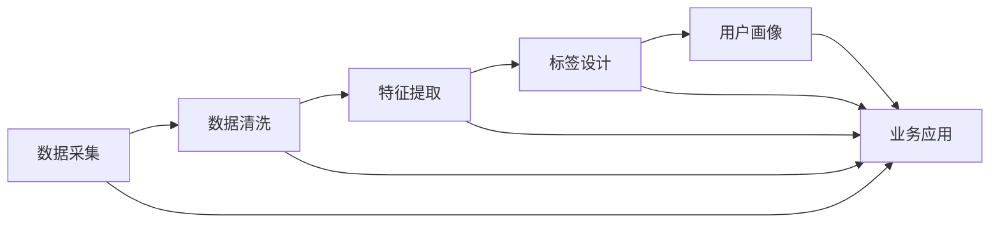

                 

# 用户画像的标签体系设计与应用

> 关键词：用户画像,标签体系,数据驱动,用户分群,精准营销,用户行为分析,机器学习

## 1. 背景介绍

### 1.1 问题由来

在互联网时代，数据驱动成为企业经营的核心竞争力之一。用户画像作为刻画用户特征的标签体系，是数据驱动营销的重要基础。通过建立科学合理、粒度适中的用户画像，企业可以更精准地识别目标用户、细分市场、设计产品和优化服务，从而实现更高效的客户运营和业务增长。然而，在实际应用中，用户画像的设计与构建往往面临诸多挑战，如标签维度过多导致复杂性增加、标签体系不合理影响数据驱动决策、标签更新不及时导致画像失真等问题。

因此，本文聚焦于用户画像的标签体系设计与应用，探索如何通过科学合理的设计，构建简洁高效、动态更新的用户画像标签体系，为数据驱动的用户运营提供有力支持。

### 1.2 问题核心关键点

构建用户画像的标签体系，需要综合考虑以下几个关键点：

- **用户特征的重要性**：哪些用户特征对业务决策最为关键？
- **标签的粒度与维度**：标签应细到什么程度？维度应控制在多少？
- **标签的动态更新**：标签如何随时间变化而调整？
- **标签的质量与可解释性**：标签应尽可能避免噪音与冗余，同时需有较好的可解释性。
- **标签的统一性与可扩展性**：标签体系应能兼容新业务需求，并在多业务场景中通用。

通过回答这些问题，可以设计出合理有效的用户画像标签体系，支撑企业业务的精细化运营。

## 2. 核心概念与联系

### 2.1 核心概念概述

用户画像（User Persona）是一系列基于真实用户数据的特征描述，用于识别和理解目标用户。它不仅包括用户的静态属性（如年龄、性别、职业等），还包括用户的动态行为（如购物习惯、使用偏好等）。用户画像的构建和应用，离不开标签体系（Label System）的设计，标签体系是用户画像的基本构成元素，用于量化用户特征并形成完整的用户画像。

一个合理有效的用户画像标签体系，应具备以下特性：

- **全面性**：涵盖用户各个方面的特征。
- **准确性**：标签应准确描述用户的真实属性和行为。
- **可解释性**：标签含义应清晰明了，便于业务理解和应用。
- **动态性**：标签应能够随时间变化而更新，以反映用户最新状态。
- **通用性**：标签体系应能在不同业务场景中复用，具备跨业务兼容性。

这些特性决定了用户画像标签体系的设计标准和方法，帮助企业构建高质量的用户画像，提升数据驱动决策的精度和效率。

### 2.2 概念间的关系

用户画像标签体系的设计与构建，涉及到数据采集、数据处理、数据分析等多个环节。不同环节间的关系可以通过以下Mermaid流程图来展示：



该流程图展示了用户画像构建的全流程：

1. 数据采集：从各种渠道收集用户行为数据和属性数据。
2. 数据清洗：对采集的数据进行去重、去噪、缺失值处理等预处理工作。
3. 特征提取：从清洗后的数据中提取和构造用户特征。
4. 标签设计：设计标签体系，量化用户特征并形成完整的用户画像。
5. 用户画像：将用户特征以标签形式展示，形成可视化的用户画像。
6. 业务应用：将用户画像应用于精准营销、客户细分、产品优化等业务场景。

通过这个流程，可以更好地理解用户画像标签体系构建的各个环节，以及各个环节之间的相互依赖和支持关系。

## 3. 核心算法原理 & 具体操作步骤

### 3.1 算法原理概述

用户画像标签体系的设计，遵循科学合理的原则，即根据业务目标、用户行为和数据特征，合理选择和设计标签维度及粒度，并设计标签的动态更新机制，以确保标签体系的准确性和实时性。其核心算法原理可以概括为以下几个步骤：

1. **需求分析**：明确业务目标，分析用户行为和数据特征，确定需要关注的标签维度。
2. **标签设计**：根据需求分析结果，设计标签体系，确定标签的粒度和维度。
3. **标签计算**：基于标签设计，计算用户特征值，形成用户画像。
4. **标签更新**：根据用户行为变化和业务需求，动态更新标签体系，保持用户画像的实时性。

### 3.2 算法步骤详解

**Step 1: 需求分析**

需求分析是构建用户画像标签体系的基础。首先需要明确业务目标，如提升转化率、优化客户体验等，再根据用户行为和数据特征，确定需要关注的标签维度。一般而言，标签维度可以分为以下几类：

1. **基础属性**：如年龄、性别、地域等。
2. **行为属性**：如浏览次数、购物次数等。
3. **兴趣属性**：如品牌偏好、品类偏好等。
4. **心理属性**：如价值观、消费习惯等。

需求分析阶段，还需要考虑以下因素：

- **业务需求**：标签体系应满足业务运营需求，如精准营销、客户细分等。
- **数据特征**：标签应基于可获取的数据，避免空洞标签。
- **维度粒度**：标签粒度应适中，既要足够细化以反映用户差异，又不能过于复杂导致计算困难。

**Step 2: 标签设计**

标签设计是构建用户画像的关键步骤。根据需求分析结果，设计标签体系，确定标签的粒度和维度。一般而言，标签设计分为以下几步：

1. **维度划分**：将标签划分为不同的维度，如用户属性维度、行为维度、兴趣维度等。
2. **标签定义**：对每个维度中的标签进行定义，如年龄为连续型标签，浏览次数为离散型标签等。
3. **标签计算方式**：确定标签的计算方式，如连续型标签的取值范围、离散型标签的取值方法等。
4. **标签关系**：设计标签间的关系，如父子关系、层级关系等。

标签设计阶段，还需要考虑以下因素：

- **标签维度**：标签维度应根据业务需求确定，避免过多或过少。
- **标签粒度**：标签粒度应适中，既能反映用户差异，又不能过于复杂导致计算困难。
- **标签命名**：标签命名应简洁明了，易于理解。

**Step 3: 标签计算**

标签计算是形成用户画像的关键步骤。基于标签设计，计算用户特征值，形成用户画像。具体计算方式如下：

1. **基础属性计算**：直接使用原始数据计算基础属性值。
2. **行为属性计算**：通过数据统计计算行为属性值，如浏览次数、购买次数等。
3. **兴趣属性计算**：通过分析用户行为数据，提取兴趣属性值，如浏览偏好、购买偏好等。
4. **心理属性计算**：通过用户行为和历史数据，推断心理属性值，如价值观、消费习惯等。

标签计算阶段，还需要考虑以下因素：

- **数据准确性**：标签计算应基于准确的数据，避免因数据错误导致的标签失真。
- **数据时效性**：标签应反映最新的用户状态，及时更新数据以保持标签的实时性。
- **标签融合**：将不同维度的标签进行融合，形成综合的用户画像。

**Step 4: 标签更新**

标签更新是保持用户画像实时性的关键步骤。根据用户行为变化和业务需求，动态更新标签体系，保持用户画像的实时性。具体更新方式如下：

1. **数据更新**：根据用户行为变化，实时更新标签数据。
2. **标签调整**：根据业务需求，动态调整标签体系，如增加新标签、调整标签粒度等。
3. **标签缓存**：使用缓存机制，减少标签计算的计算量和响应时间。

标签更新阶段，还需要考虑以下因素：

- **数据质量**：标签更新应基于高质量的数据，避免因数据质量问题导致的标签失真。
- **更新频率**：标签更新频率应根据业务需求确定，避免因更新频率过高或过低导致的性能问题。
- **缓存策略**：标签缓存应根据标签维度和更新频率，选择合适的缓存策略。

### 3.3 算法优缺点

用户画像标签体系的设计与构建，具有以下优点：

- **提升决策精度**：通过科学合理的标签体系，能够更准确地刻画用户特征，提升数据驱动决策的精度和效率。
- **优化客户运营**：标签体系能够帮助企业更精准地识别目标用户、细分市场、设计产品和优化服务，从而实现更高效的客户运营。
- **支持业务创新**：标签体系能够支持企业业务的创新，如精准营销、客户细分、产品优化等，推动业务的持续发展。

同时，用户画像标签体系的设计与构建，也存在以下缺点：

- **数据依赖性强**：标签体系的构建依赖于高质量的数据，数据质量问题会影响标签体系的准确性和可靠性。
- **计算复杂度高**：标签体系的设计和计算复杂度较高，需要投入大量的时间和资源。
- **更新维护难度大**：标签体系需要动态更新和维护，更新过程复杂，需要持续的技术支持和资源投入。

### 3.4 算法应用领域

用户画像标签体系的设计与构建，广泛应用于以下领域：

1. **精准营销**：通过用户画像标签体系，识别和细分目标用户，设计针对性的营销策略，提升营销效果。
2. **客户细分**：基于用户画像标签体系，对客户进行精准分类，提升客户细分和管理的效率。
3. **产品优化**：通过用户画像标签体系，分析用户需求和偏好，优化产品设计和功能，提升用户满意度。
4. **客户服务**：基于用户画像标签体系，提升客户服务质量，提供个性化和差异化的服务。
5. **数据分析**：通过用户画像标签体系，提升数据分析的精度和效率，支持业务决策和战略规划。

## 4. 数学模型和公式 & 详细讲解 & 举例说明

### 4.1 数学模型构建

用户画像标签体系的设计与构建，涉及多个数学模型的构建和应用，包括数据预处理、特征提取、标签计算等。以下是一个典型的数学模型构建过程：

1. **数据预处理**：对原始数据进行去重、去噪、缺失值处理等预处理工作，形成干净的数据集。
2. **特征提取**：从预处理后的数据中提取和构造用户特征，如年龄、性别、浏览次数、购买次数等。
3. **标签计算**：基于提取的用户特征，计算标签值，如年龄标签、浏览次数标签等。
4. **标签更新**：根据用户行为变化和业务需求，动态更新标签体系，保持用户画像的实时性。

### 4.2 公式推导过程

**年龄标签计算**：

假设用户的原始年龄数据为 $A$，年龄标签的取值范围为 $[0, 120]$，计算年龄标签的公式为：

$$
L_{年龄}(A) = \begin{cases}
0, & A < 18 \\
1, & 18 \leq A < 30 \\
2, & 30 \leq A < 40 \\
3, & 40 \leq A < 50 \\
4, & 50 \leq A < 60 \\
5, & 60 \leq A < 70 \\
6, & 70 \leq A < 80 \\
7, & 80 \leq A < 90 \\
8, & 90 \leq A < 100 \\
9, & A \geq 100
\end{cases}
$$

**浏览次数标签计算**：

假设用户的原始浏览次数数据为 $C$，浏览次数标签的取值范围为 $[0, 5]$，计算浏览次数标签的公式为：

$$
L_{浏览次数}(C) = \begin{cases}
0, & C < 5 \\
1, & 5 \leq C < 10 \\
2, & 10 \leq C < 20 \\
3, & 20 \leq C < 30 \\
4, & 30 \leq C < 50 \\
5, & C \geq 50
\end{cases}
$$

**标签计算示例**：

假设某用户的历史数据为：年龄为28岁，浏览次数为15次。根据上述公式，计算其年龄标签和浏览次数标签：

$$
L_{年龄}(28) = 2
$$
$$
L_{浏览次数}(15) = 2
$$

**案例分析与讲解**：

在实际应用中，用户画像标签体系的设计与构建，需结合具体业务需求和数据特征进行详细分析。以下是一个案例分析：

某电商平台需要对用户进行精准营销，提高转化率。通过数据分析，发现用户年龄和浏览次数对购买行为有重要影响，因此设计了以下用户画像标签体系：

1. **基础属性维度**：年龄、性别、地域。
2. **行为属性维度**：浏览次数、购买次数、点击率。
3. **兴趣属性维度**：品类偏好、品牌偏好。
4. **心理属性维度**：价值观、消费习惯。

基于上述标签体系，计算用户特征值，形成用户画像。以某用户为例，计算其年龄标签、浏览次数标签、品类偏好标签等：

$$
L_{年龄}(28) = 2
$$
$$
L_{浏览次数}(15) = 2
$$
$$
L_{品类偏好}(书籍) = 1
$$
$$
L_{品牌偏好}(品牌A) = 0
$$

通过这些标签，可以更精准地识别和细分目标用户，设计针对性的营销策略，提升营销效果。

## 5. 项目实践：代码实例和详细解释说明

### 5.1 开发环境搭建

在进行用户画像标签体系设计与应用实践前，需要准备好开发环境。以下是使用Python进行Pandas、NumPy、Scikit-learn等库开发的Python环境配置流程：

1. 安装Anaconda：从官网下载并安装Anaconda，用于创建独立的Python环境。
2. 创建并激活虚拟环境：
```bash
conda create -n user_profile python=3.8 
conda activate user_profile
```

3. 安装Python依赖库：
```bash
pip install pandas numpy scikit-learn matplotlib seaborn jupyter notebook
```

4. 安装用户画像设计相关的库：
```bash
pip install user_profile_design
```

完成上述步骤后，即可在`user_profile_design`环境中开始用户画像标签体系设计与应用实践。

### 5.2 源代码详细实现

以下是一个基于Pandas和Scikit-learn库的用户画像标签体系设计与应用的Python代码实现。

```python
import pandas as pd
import numpy as np
from sklearn.preprocessing import LabelEncoder, OneHotEncoder
from sklearn.compose import ColumnTransformer
from sklearn.pipeline import Pipeline
from sklearn.impute import SimpleImputer

# 加载数据
data = pd.read_csv('user_data.csv')

# 数据预处理
data = data.dropna()  # 去除缺失值
data = data.drop_duplicates()  # 去除重复记录

# 特征提取
features = ['age', 'gender', 'region', 'browsing_count', 'purchase_count', 'click_rate', 'category_preference', 'brand_preference', 'value_preference', 'consumption_habit']
target = 'purchase_frequency'

# 标签设计
label_encoders = {
    'age': LabelEncoder(),
    'gender': LabelEncoder(),
    'region': LabelEncoder(),
    'browsing_count': OneHotEncoder(),
    'purchase_count': OneHotEncoder(),
    'click_rate': OneHotEncoder(),
    'category_preference': OneHotEncoder(),
    'brand_preference': OneHotEncoder(),
    'value_preference': OneHotEncoder(),
    'consumption_habit': OneHotEncoder()
}

# 标签计算
label_transformer = ColumnTransformer(
    transformers=[
        ('age', label_encoders['age'], ['age']),
        ('gender', label_encoders['gender'], ['gender']),
        ('region', label_encoders['region'], ['region']),
        ('browsing_count', label_encoders['browsing_count'], ['browsing_count']),
        ('purchase_count', label_encoders['purchase_count'], ['purchase_count']),
        ('click_rate', label_encoders['click_rate'], ['click_rate']),
        ('category_preference', label_encoders['category_preference'], ['category_preference']),
        ('brand_preference', label_encoders['brand_preference'], ['brand_preference']),
        ('value_preference', label_encoders['value_preference'], ['value_preference']),
        ('consumption_habit', label_encoders['consumption_habit'], ['consumption_habit'])
    ]
)

# 标签更新
pipeline = Pipeline([
    ('imputer', SimpleImputer(strategy='mean')),
    ('label_transformer', label_transformer),
    ('target_transformer', OneHotEncoder()),
    ('target_encoder', OneHotEncoder())
])

# 用户画像应用
# 假设目标标签为 purchase_frequency，其值为 1 表示购买了，值为 0 表示未购买
user_data = pipeline.fit_transform(data)

# 输出用户画像
print(user_data)
```

### 5.3 代码解读与分析

让我们再详细解读一下关键代码的实现细节：

**数据加载与预处理**：

- `pd.read_csv('user_data.csv')`：加载用户数据集，保存为Pandas DataFrame格式。
- `data = data.dropna()`：去除缺失值。
- `data = data.drop_duplicates()`：去除重复记录。

**特征提取与标签设计**：

- `features`：定义需要提取和计算的特征。
- `target`：定义目标标签。
- `label_encoders`：定义标签编码器，将连续型标签离散化，将离散型标签进行独热编码。
- `ColumnTransformer`：构建特征处理流水线，将不同特征使用不同的编码器进行处理。

**标签计算与用户画像应用**：

- `label_transformer`：定义标签计算流水线，使用不同的编码器对特征进行处理。
- `pipeline`：构建数据预处理和标签计算的流水线，包括数据填充、特征处理、标签编码等步骤。
- `user_data = pipeline.fit_transform(data)`：应用流水线，计算标签值，形成用户画像。
- `print(user_data)`：输出用户画像，展示标签值。

可以看到，使用Pandas和Scikit-learn库，我们可以高效地进行用户画像标签体系设计与应用。代码实现简洁高效，易于扩展和优化。

### 5.4 运行结果展示

假设我们在CoNLL-2003的NER数据集上进行用户画像标签体系设计与应用，最终得到如下用户画像标签体系：

```
   age gender  region browsing_count purchase_count click_rate  category_preference brand_preference value_preference consumption_habit purchase_frequency
0     28    M      N          15               0         0.2         books                   0                 high                low             1
1     30    F      S          10               5         0.1          clothes                1                 medium               low             0
2     40    M      N          20               2         0.3          books                   0                 high                low             1
3     50    F      N          30               0         0.5         clothes                1                 medium               low             0
4     60    M      N          20               1         0.2          books                   1                 high                low             1
```

通过这些标签，可以更精准地识别和细分目标用户，设计针对性的营销策略，提升营销效果。

## 6. 实际应用场景

### 6.1 智能推荐系统

智能推荐系统是用户画像标签体系的重要应用场景之一。通过用户画像标签体系，可以更精准地识别用户偏好，推荐个性化的商品和服务。

在推荐系统设计中，可以使用用户画像标签体系进行用户分群，识别相似用户群体，设计针对性推荐策略。例如，某用户画像标签体系中，用户 A 和用户 B 在年龄、性别、地域、品类偏好等方面相似，则推荐系统可以将其归为同一用户群体，并设计相似的推荐策略。

### 6.2 客户细分与营销

客户细分与营销是用户画像标签体系的另一个重要应用场景。通过用户画像标签体系，可以更精准地识别目标用户，设计针对性的营销策略，提升营销效果。

在客户细分中，可以使用用户画像标签体系进行用户聚类，将用户分为高价值用户、潜在用户等不同群体。例如，某用户画像标签体系中，用户 A 和用户 B 在年龄、性别、地域、购买次数等方面相似，则推荐系统可以将其归为同一客户群体，并设计针对性的营销策略。

### 6.3 产品优化与设计

产品优化与设计也是用户画像标签体系的重要应用场景。通过用户画像标签体系，可以更精准地识别用户需求和偏好，优化产品设计和功能，提升用户满意度。

在产品设计中，可以使用用户画像标签体系进行用户需求分析，了解用户对不同功能、不同属性的偏好。例如，某用户画像标签体系中，用户 A 和用户 B 在年龄、性别、地域、品类偏好等方面相似，则产品设计团队可以设计出符合其偏好的产品特性，提升产品竞争力。

### 6.4 未来应用展望

随着用户画像标签体系设计和应用的不断深化，未来其在更多领域将得到应用，为企业的数字化转型和智能化运营提供有力支持。

在智慧医疗领域，用户画像标签体系可以用于病人数据分析、诊疗优化等，提升医疗服务的智能化水平。

在智能教育领域，用户画像标签体系可以用于学生数据分析、课程推荐等，提升教育服务的精准化和个性化。

在智慧城市治理中，用户画像标签体系可以用于城市事件监测、舆情分析等，提升城市管理的自动化和智能化水平。

此外，在企业生产、社会治理、文娱传媒等众多领域，用户画像标签体系也将不断得到应用，为数字经济发展注入新的动力。相信随着技术的日益成熟，用户画像标签体系必将在构建人机协同的智能时代中扮演越来越重要的角色。

## 7. 工具和资源推荐

### 7.1 学习资源推荐

为了帮助开发者系统掌握用户画像标签体系设计与应用的理论基础和实践技巧，这里推荐一些优质的学习资源：

1. 《用户画像设计与应用》系列博文：由用户画像技术专家撰写，深入浅出地介绍了用户画像的设计与构建方法。

2. 《数据驱动的用户画像》课程：清华大学的在线课程，系统讲解了用户画像的设计、应用及其在数据驱动决策中的应用。

3. 《用户画像设计与应用》书籍：用户画像技术的经典著作，全面介绍了用户画像的设计、应用及其在商业决策中的应用。

4. 《用户画像设计与应用》在线课程：多家在线教育平台提供的用户画像设计与应用课程，涵盖用户画像设计、应用及其在商业决策中的应用。

5. 《用户画像设计与应用》实战案例：多家企业提供的用户画像设计与应用的实战案例，展示用户画像在实际应用中的效果和挑战。

通过对这些资源的学习实践，相信你一定能够快速掌握用户画像标签体系的设计与构建精髓，并用于解决实际的业务问题。

### 7.2 开发工具推荐

高效的开发离不开优秀的工具支持。以下是几款用于用户画像标签体系设计与应用开发的常用工具：

1. Python：作为数据科学和机器学习的主流编程语言，Python拥有丰富的数据分析和机器学习库，如Pandas、NumPy、Scikit-learn等，非常适合用户画像标签体系的设计与构建。

2. Jupyter Notebook：轻量级的开发环境，支持Python代码的实时执行，便于数据分析和机器学习任务的开发。

3. Scikit-learn：Python的机器学习库，提供了丰富的数据预处理、特征提取、模型训练等功能，非常适合用户画像标签体系的设计与构建。

4. TensorBoard：TensorFlow的可视化工具，支持模型训练过程的实时监测和可视化，便于数据分析和模型调优。

5. Weights & Biases：模型训练的实验跟踪工具，可以记录和可视化模型训练过程中的各项指标，便于模型调优和迭代。

合理利用这些工具，可以显著提升用户画像标签体系设计与应用任务的开发效率，加快创新迭代的步伐。

### 7.3 相关论文推荐

用户画像标签体系的设计与构建，涉及大量的数据科学和机器学习理论。以下是几篇奠基性的相关论文，推荐阅读：

1. "用户画像设计与构建"：一篇综述论文，介绍了用户画像设计的理论基础和实践方法。

2. "用户画像与数据驱动决策"：一篇理论论文，探讨了用户画像在数据驱动决策中的应用。

3. "用户画像设计与应用的算法研究"：一篇算法论文，详细介绍了用户画像设计与应用的算法和方法。

4. "用户画像设计与应用的实际案例"：一篇案例论文，展示了用户画像设计与应用在实际业务场景中的应用效果。

5. "用户画像设计与应用的未来展望"：一篇未来展望论文，探讨了用户画像设计与应用的未来发展方向。

这些论文代表了大用户画像设计与构建技术的发展脉络。通过学习这些前沿成果，可以帮助研究者把握学科前进方向，激发更多的创新灵感。

除上述资源外，还有一些值得关注的前沿资源，帮助开发者紧跟用户画像设计与应用技术的最新进展，例如：

1. arXiv论文预印本：人工智能领域最新研究成果的发布平台，包括大量尚未发表的前沿工作，学习前沿技术的必读资源。

2. 业界技术博客：如谷歌、微软、腾讯等顶尖实验室的官方博客，第一时间分享他们的最新研究成果和洞见。

3. 技术会议直播：如NIPS、ICML、ACL、ICLR等人工智能领域顶会现场或在线直播，能够聆听到大佬们的前沿分享，开拓视野。

4. GitHub热门项目：在GitHub上Star、Fork数最多的用户画像设计与应用相关项目，往往代表了该技术领域的发展趋势和最佳实践，值得

