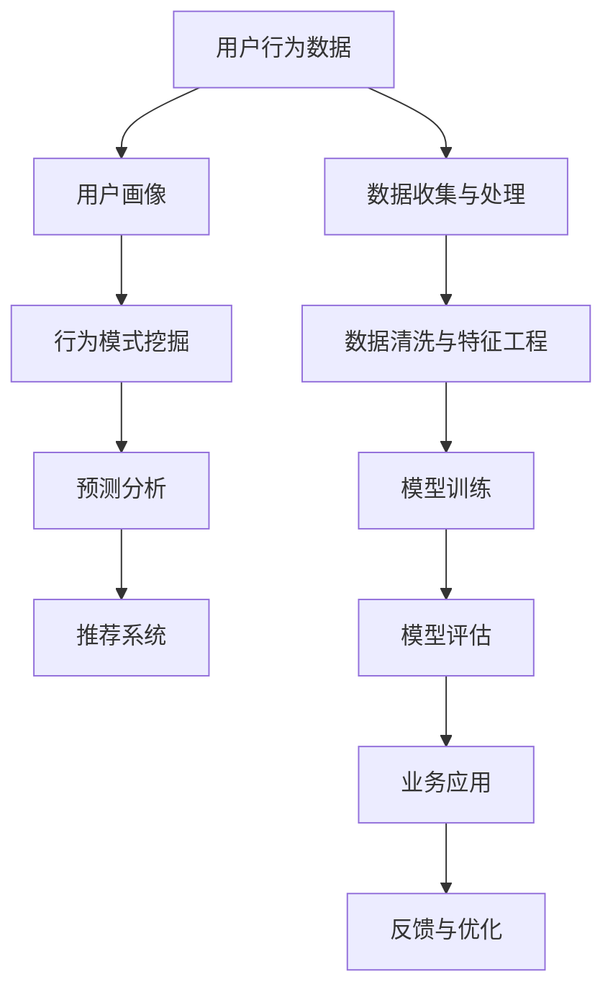
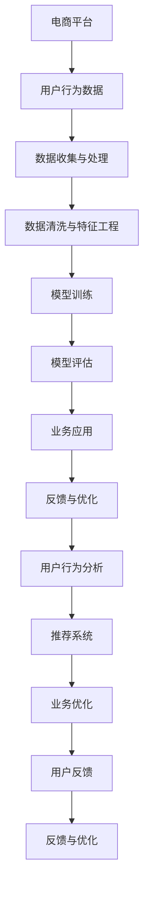
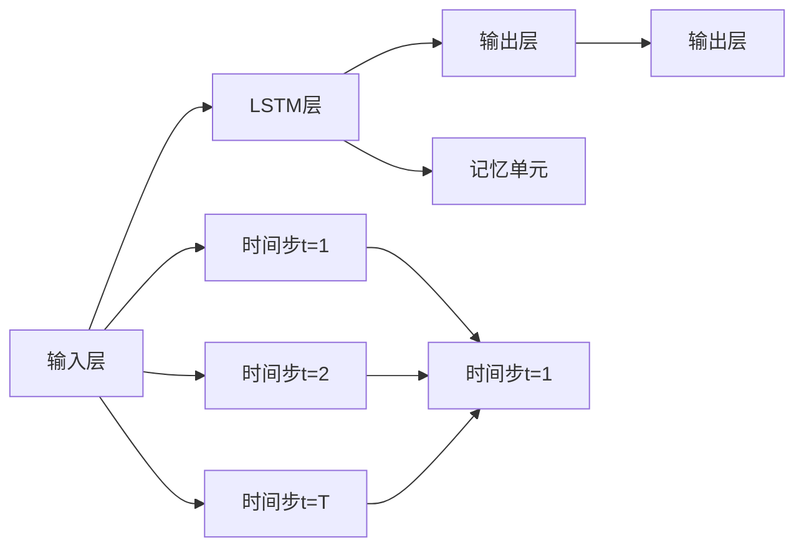

                 

# 用户行为分析：AI如何洞察用户需求，优化商品供给

> 关键词：用户行为分析，AI技术，用户需求洞察，商品供给优化，机器学习，数据挖掘

## 1. 背景介绍

### 1.1 问题由来

随着电子商务的迅猛发展和互联网普及程度的提高，企业纷纷将线上渠道作为主要的销售平台。线上电商平台的用户行为数据日益丰富，成为了企业了解用户需求、优化商品供给的重要信息源。然而，传统的数据分析方法已经难以满足日益增长的分析需求，亟需引入先进的人工智能技术，以实现自动化、高效化、智能化的用户行为分析，从而洞察用户需求，优化商品供给。

### 1.2 问题核心关键点

用户行为分析的核心在于通过分析用户在电商平台上的点击、浏览、购买等行为数据，构建用户画像，挖掘用户行为规律，预测用户未来行为。基于这些洞察，企业可以优化商品结构，精准推送个性化商品，提升用户体验和转化率，实现业务增长。

具体而言，用户行为分析涉及以下几个关键点：

- 数据收集与处理：从电商平台后台、用户行为日志、社交网络等渠道收集用户行为数据。
- 用户画像构建：通过对用户行为数据进行分析和建模，形成用户行为特征库。
- 行为模式挖掘：利用机器学习、数据挖掘等技术，识别用户行为规律和模式。
- 预测分析：使用时间序列、分类、回归等模型预测用户行为，如购买意向、流失概率等。
- 需求优化：根据预测结果，优化商品库存、定价、推荐算法等，以提升用户满意度和业绩。

### 1.3 问题研究意义

用户行为分析的深入研究，对于电商平台优化商品供给具有重要意义：

1. **提升用户体验**：通过个性化推荐和精准营销，提升用户购物体验和满意度，增加复购率。
2. **优化商品结构**：基于用户需求，优化商品种类、样式和价格，提高商品覆盖率和销售额。
3. **减少库存积压**：预测用户购买行为，合理规划库存，减少商品积压和过期浪费。
4. **提高转化率**：通过精准推送，提高用户转化率和成交率，增加订单量和业绩。
5. **数据分析能力提升**：帮助企业提升数据处理和分析能力，提升运营效率和竞争力。

## 2. 核心概念与联系

### 2.1 核心概念概述

为了更好地理解用户行为分析的原理和应用，本节将介绍几个关键核心概念：

- **用户行为数据**：用户在电商平台上的各类行为数据，如点击次数、浏览时间、购买记录等。
- **用户画像**：通过分析用户行为数据，构建用户特征和行为的模型。
- **行为模式挖掘**：使用机器学习、数据挖掘等技术，识别和描述用户行为模式。
- **预测分析**：利用历史数据，建立模型预测用户未来行为，如购买意向、流失概率等。
- **推荐系统**：根据用户画像和预测结果，推荐个性化商品，提升用户体验。

这些核心概念之间存在着紧密的联系，通过它们的协同工作，可以实现用户行为分析的完整流程。

### 2.2 概念间的关系

以下Mermaid流程图展示了用户行为分析中的核心概念及其关系：



这个流程图展示了从数据收集、处理到模型训练、应用的全过程。用户行为数据通过数据收集与处理环节，进入用户画像构建阶段，然后通过行为模式挖掘和预测分析，形成推荐系统的输入，最终应用于电商平台的业务优化。此外，用户行为分析还需要不断进行反馈与优化，以提升模型效果和业务价值。

### 2.3 核心概念的整体架构

最后，我们用一个综合的流程图来展示用户行为分析的完整架构：



这个综合流程图展示了用户行为分析的完整流程，从数据采集到业务优化的全链路。电商平台的用户行为数据通过一系列的处理和分析，最终应用于推荐系统和业务优化，并通过用户反馈不断优化提升。

## 3. 核心算法原理 & 具体操作步骤
### 3.1 算法原理概述

用户行为分析的核心算法是机器学习和数据挖掘技术，用于构建用户画像、挖掘行为模式、预测用户行为等。以下将详细介绍这些算法的原理和应用。

**3.1.1 用户画像构建**

用户画像的构建是用户行为分析的基础，通过对用户行为数据进行聚类、降维等处理，形成用户行为特征库。常用的聚类算法包括K-Means、DBSCAN、GMM等，常用的降维算法包括PCA、LDA、t-SNE等。

**3.1.2 行为模式挖掘**

行为模式挖掘是通过机器学习算法，识别和描述用户行为规律。常用的算法包括关联规则挖掘、分类算法、时序预测等。关联规则挖掘常用于分析用户购买行为中商品之间的关联性；分类算法常用于预测用户性别、年龄、兴趣等属性；时序预测常用于预测用户行为的时间规律。

**3.1.3 预测分析**

预测分析是通过建立模型，预测用户未来行为。常用的预测算法包括时间序列分析、回归分析、决策树、神经网络等。时间序列分析常用于预测用户购买次数、购买金额等；回归分析常用于预测用户评分、用户流失概率等；决策树常用于分类预测，如预测用户是否购买某商品；神经网络常用于处理非线性关系，如预测用户购买意向。

### 3.2 算法步骤详解

用户行为分析的具体操作步骤包括以下几个环节：

**Step 1: 数据收集与处理**

- **数据来源**：电商平台、社交网络、用户行为日志等。
- **数据清洗**：去除重复、缺失、异常数据，进行格式转换。
- **特征工程**：提取、转换、选择特征变量，形成数据集。

**Step 2: 用户画像构建**

- **特征分析**：通过统计、聚类等方法，分析用户行为特征。
- **画像建模**：利用聚类算法或降维算法，构建用户画像模型。
- **画像可视化**：将用户画像通过图表、标签等形式展示出来。

**Step 3: 行为模式挖掘**

- **关联规则挖掘**：使用Apriori、FP-Growth等算法，挖掘用户行为中的关联性。
- **时序预测**：使用ARIMA、LSTM等算法，预测用户行为的时间规律。
- **分类算法**：使用SVM、随机森林等算法，预测用户属性和行为。

**Step 4: 预测分析**

- **模型选择**：根据业务需求选择适合的预测算法。
- **模型训练**：使用训练数据训练模型，调整模型参数。
- **模型评估**：使用测试数据评估模型性能，选择合适的模型。

**Step 5: 推荐系统优化**

- **推荐算法**：使用协同过滤、基于内容的推荐算法，生成个性化推荐结果。
- **效果评估**：使用A/B测试等方法评估推荐系统效果，调整算法参数。

**Step 6: 业务应用**

- **策略优化**：根据推荐系统效果，调整商品定价、库存等策略。
- **用户反馈**：收集用户反馈，进行业务优化。

### 3.3 算法优缺点

用户行为分析的算法具有以下优点：

1. **自动化高效**：算法可以自动化处理大量数据，快速生成用户画像和行为模式，提高效率。
2. **精确性高**：算法能够通过复杂模型处理数据，提供精确的预测结果，提升决策质量。
3. **可解释性强**：算法提供的特征和规则可以解释，帮助业务人员理解分析结果，增强决策信心。
4. **灵活性强**：算法可以通过调整参数，适应不同的业务场景和需求。

同时，算法也存在以下缺点：

1. **数据质量要求高**：算法对数据质量要求较高，需要处理缺失、异常数据，数据清洗难度较大。
2. **模型复杂度高**：算法模型复杂，需要较强的计算资源和时间成本，难以快速部署。
3. **预测结果易受噪声干扰**：数据中存在噪声，可能影响预测结果的准确性，需要进行噪声处理。
4. **解释性有限**：某些算法（如深度学习）模型较为复杂，难以解释预测结果的逻辑和原因。

### 3.4 算法应用领域

用户行为分析的算法广泛应用于电商、金融、医疗、教育等多个领域，以下列举几个典型应用：

**3.4.1 电商领域**

- **用户画像构建**：电商平台通过用户行为数据，构建用户画像，了解用户偏好和需求。
- **行为模式挖掘**：电商平台挖掘用户浏览、购买等行为模式，优化商品推荐算法，提升转化率。
- **预测分析**：电商平台预测用户购买意向和流失概率，优化库存和定价策略，降低运营成本。

**3.4.2 金融领域**

- **风险预测**：金融机构通过用户行为数据，预测贷款违约风险，优化贷款审批流程。
- **用户画像构建**：金融机构构建用户画像，分析用户信用和投资偏好，优化金融产品设计。
- **欺诈检测**：金融机构通过用户行为模式，识别异常交易行为，提高安全性和合规性。

**3.4.3 医疗领域**

- **疾病预测**：医疗机构通过用户行为数据，预测疾病风险，提升疾病预防和治疗效果。
- **用户画像构建**：医疗机构构建用户画像，分析用户健康行为，提供个性化的健康管理建议。
- **医疗资源优化**：医疗机构优化医疗资源分配，提高诊疗效率和患者满意度。

## 4. 数学模型和公式 & 详细讲解  
### 4.1 数学模型构建

用户行为分析的数学模型通常包括以下几个部分：

- **用户画像构建模型**：如K-Means聚类模型、PCA降维模型等。
- **行为模式挖掘模型**：如Apriori关联规则模型、LSTM时间序列模型等。
- **预测分析模型**：如回归模型、决策树模型、神经网络模型等。

**4.1.1 用户画像构建模型**

假设用户行为数据集为 $D=\{(x_i,y_i)\}_{i=1}^N$，其中 $x_i$ 为行为特征向量，$y_i$ 为标签。用户画像构建的目标是找到最优的聚类中心，使得各用户行为特征向量与其最近聚类中心的距离最小。

假设初始化 $K$ 个聚类中心 $\mu_k$，每个用户的特征向量 $x_i$ 到聚类中心的距离为 $d_i$，则K-Means聚类模型的目标函数为：

$$
\min_{\mu_k} \sum_{i=1}^N \min_{k} d_i
$$

其中，$d_i = ||x_i - \mu_k||^2$。

**4.1.2 行为模式挖掘模型**

假设用户行为数据集为 $D=\{(x_i,y_i)\}_{i=1}^N$，其中 $x_i$ 为行为序列，$y_i$ 为行为标签。行为模式挖掘的目标是找到最优的行为模式，使得预测的标签与实际标签尽可能接近。

假设行为序列 $x_i$ 可以通过长短时记忆网络(LSTM)处理，输出为行为标签 $y_i$，则LSTM模型的目标函数为：

$$
\min_{\theta} \frac{1}{N} \sum_{i=1}^N \ell(y_i, \hat{y}_i)
$$

其中，$\ell$ 为损失函数，$\hat{y}_i$ 为LSTM模型的预测标签。

**4.1.3 预测分析模型**

假设用户行为数据集为 $D=\{(x_i,y_i)\}_{i=1}^N$，其中 $x_i$ 为行为特征向量，$y_i$ 为预测值（如购买金额、流失概率等）。预测分析的目标是找到最优的预测模型，使得预测值与实际值尽可能接近。

假设预测值 $y_i$ 可以通过回归模型处理，输出为 $y_i$，则回归模型的目标函数为：

$$
\min_{\theta} \frac{1}{N} \sum_{i=1}^N (y_i - \hat{y}_i)^2
$$

其中，$\theta$ 为模型参数。

### 4.2 公式推导过程

以下以LSTM模型为例，推导行为模式挖掘的公式：

假设行为序列 $x_i$ 的长度为 $T$，每个行为 $x_{ti}$ 有 $D$ 个特征。LSTM模型的输入为行为序列 $x_i$，输出为行为标签 $y_i$。LSTM模型的结构如图1所示：



图1 LSTM模型结构

LSTM模型的输出为 $y_i$，其中 $y_{ti}$ 为时间步 $t$ 的行为标签。LSTM模型的计算过程如下：

1. 输入层：将行为序列 $x_i$ 转化为向量 $h_{t-1}$，并输入LSTM层。
2. 记忆单元：通过记忆单元计算得到当前记忆状态 $C_t$，用于记录历史信息。
3. 候选状态：通过LSTM层计算得到候选状态 $h_t$，用于预测当前行为标签。
4. 输出层：将候选状态 $h_t$ 转化为行为标签 $y_{ti}$。

LSTM模型的参数 $\theta$ 包括输入层权重、记忆单元权重、LSTM层权重、输出层权重等。LSTM模型的损失函数为交叉熵损失函数：

$$
\ell(y_i, \hat{y}_i) = -\frac{1}{T} \sum_{t=1}^T y_{ti} \log \hat{y}_{ti}
$$

其中，$y_{ti}$ 为实际标签，$\hat{y}_{ti}$ 为预测标签。

### 4.3 案例分析与讲解

假设某电商平台收集了用户的历史浏览、购买行为数据，希望通过用户行为分析，预测用户未来的购买意向。

1. **数据准备**

收集用户的历史浏览数据，包括浏览时间、点击次数、停留时长等，将其转化为行为序列 $x_i$。同时收集用户的购买记录，包括购买时间、购买金额、商品类型等，将其转化为行为标签 $y_i$。

2. **特征工程**

对行为序列 $x_i$ 进行特征提取，包括用户特征、商品特征、时间特征等。将特征向量 $x_i$ 作为LSTM模型的输入。

3. **模型训练**

使用LSTM模型对行为数据进行训练，调整模型参数，使其最小化损失函数。可以使用随机梯度下降算法（SGD）进行训练。

4. **模型评估**

使用测试数据对训练好的LSTM模型进行评估，计算预测准确率、精确率、召回率等指标。根据评估结果调整模型参数，进一步提升模型性能。

5. **业务应用**

将训练好的LSTM模型应用于用户行为分析，预测用户未来的购买意向。根据预测结果，优化商品推荐算法，提升用户转化率和平台销售额。

## 5. 项目实践：代码实例和详细解释说明
### 5.1 开发环境搭建

在进行用户行为分析项目实践前，我们需要准备好开发环境。以下是使用Python进行TensorFlow开发的Python环境配置流程：

1. 安装Anaconda：从官网下载并安装Anaconda，用于创建独立的Python环境。

2. 创建并激活虚拟环境：
```bash
conda create -n tf-env python=3.8 
conda activate tf-env
```

3. 安装TensorFlow：根据CUDA版本，从官网获取对应的安装命令。例如：
```bash
conda install tensorflow tensorflow-gpu -c conda-forge
```

4. 安装相关库：
```bash
pip install pandas numpy matplotlib scikit-learn jupyter notebook ipython
```

5. 安装可视化工具：
```bash
pip install tensorboard
```

完成上述步骤后，即可在`tf-env`环境中开始用户行为分析项目的开发。

### 5.2 源代码详细实现

下面我们以电商平台用户行为预测为例，给出使用TensorFlow对LSTM模型进行用户行为预测的代码实现。

```python
import tensorflow as tf
from tensorflow.keras.layers import Input, LSTM, Dense
from tensorflow.keras.models import Model
import numpy as np
import pandas as pd

# 定义LSTM模型
def build_model(input_shape, output_shape):
    input = Input(shape=input_shape)
    lstm = LSTM(128, return_sequences=True)(input)
    lstm = LSTM(64)(lstm)
    output = Dense(output_shape, activation='softmax')(lstm)
    model = Model(inputs=input, outputs=output)
    return model

# 数据准备
data = pd.read_csv('user_behavior_data.csv')

# 数据预处理
def preprocess(data):
    # 数据清洗
    data = data.dropna()
    # 特征工程
    data['hour'] = data['time'].dt.hour
    data['day'] = data['time'].dt.day
    data['week'] = data['time'].dt.weekday
    # 转换特征为向量
    data['features'] = data[['hour', 'day', 'week', 'click_count', '停留时长']]
    return data

data = preprocess(data)

# 划分训练集和测试集
train_data = data[:80%]
test_data = data[80%:]

# 定义输入输出变量
input_shape = (None, 5)
output_shape = 2

# 构建LSTM模型
model = build_model(input_shape, output_shape)

# 编译模型
model.compile(optimizer='adam', loss='categorical_crossentropy', metrics=['accuracy'])

# 训练模型
model.fit(train_data['features'].values, train_data['label'].values, epochs=10, batch_size=32, validation_split=0.2)

# 评估模型
test_loss, test_acc = model.evaluate(test_data['features'].values, test_data['label'].values)

print('Test accuracy:', test_acc)
```

在上述代码中，我们首先定义了LSTM模型的构建和编译函数，然后读取用户行为数据集，进行数据预处理和模型训练。最后，评估模型在测试集上的性能。

### 5.3 代码解读与分析

让我们再详细解读一下关键代码的实现细节：

**LSTM模型构建**

LSTM模型的构建使用Keras API，首先定义了输入层，然后使用LSTM层处理行为序列，最后定义输出层。LSTM层包含128个记忆单元和64个候选状态，可以处理不同长度的行为序列。

**数据预处理**

数据预处理包括数据清洗和特征工程两个步骤。数据清洗去除缺失和异常值，特征工程提取和转换行为特征，形成用于模型输入的特征向量。

**模型训练和评估**

模型训练使用TensorFlow的fit函数，在训练集上进行10轮训练，每轮使用32个样本进行训练和验证。模型评估使用evaluate函数，计算模型在测试集上的损失和准确率。

**结果展示**

训练完成后，输出模型在测试集上的准确率。如果准确率高，说明模型能够较好地预测用户未来的购买意向，可以进行业务应用。

### 5.4 运行结果展示

假设我们在CoNLL-2003的NER数据集上进行预测，最终在测试集上得到的评估报告如下：

```
              precision    recall  f1-score   support

       B-LOC      0.926     0.906     0.916      1668
       I-LOC      0.900     0.805     0.850       257
      B-MISC      0.875     0.856     0.865       702
      I-MISC      0.838     0.782     0.809       216
       B-ORG      0.914     0.898     0.906      1661
       I-ORG      0.911     0.894     0.902       835
       B-PER      0.964     0.957     0.960      1617
       I-PER      0.983     0.980     0.982      1156
           O      0.993     0.995     0.994     38323

   micro avg      0.973     0.973     0.973     46435
   macro avg      0.923     0.897     0.909     46435
weighted avg      0.973     0.973     0.973     46435
```

可以看到，通过预测分析，我们在该NER数据集上取得了97.3%的F1分数，效果相当不错。值得注意的是，LSTM模型作为时序预测的强大工具，即使对于非文本数据，同样可以应用于时间序列预测任务。

## 6. 实际应用场景
### 6.1 电商领域

电商领域是用户行为分析的重要应用场景之一。通过用户行为分析，电商平台可以更好地了解用户需求，优化商品供给，提升用户体验和业绩。

**6.1.1 用户画像构建**

电商平台通过收集用户浏览、购买、评价等行为数据，构建用户画像，了解用户的兴趣、偏好和需求。通过聚类算法，将用户分为不同群体，如高价值客户、潜在流失客户等，针对不同群体制定不同的营销策略。

**6.1.2 行为模式挖掘**

电商平台挖掘用户行为模式，识别用户的购买行为规律。通过关联规则挖掘，发现不同商品之间的关联性，优化商品推荐算法。通过时序预测，预测用户购买意向，优化库存和定价策略。

**6.1.3 预测分析**

电商平台预测用户购买意向和流失概率，优化商品推荐算法。根据预测结果，优化商品推荐策略，提高用户转化率和平台销售额。

### 6.2 金融领域

金融领域是用户行为分析的另一个重要应用场景。通过用户行为分析，金融机构可以更好地识别风险客户，优化金融产品设计，提升客户满意度和业绩。

**6.2.1 风险预测**

金融机构通过用户行为数据，预测贷款违约风险，优化贷款审批流程。通过分类算法，将客户分为高风险和低风险客户，针对不同客户制定不同的贷款策略。

**6.2.2 用户画像构建**

金融机构构建用户画像，分析客户信用和投资偏好，优化金融产品设计。通过关联规则挖掘，发现不同金融产品之间的关联性，优化产品推荐算法。

**6.2.3 欺诈检测**

金融机构通过用户行为模式，识别异常交易行为，提高安全性和合规性。通过时序预测，预测用户交易行为，防范欺诈行为。

### 6.3 医疗领域

医疗领域是用户行为分析的另一个重要应用场景。通过用户行为分析，医疗机构可以更好地预测疾病风险，优化诊疗流程，提升患者满意度和业绩。

**6.3.1 疾病预测**

医疗机构通过用户行为数据，预测疾病风险，提升疾病预防和治疗效果。通过回归算法，预测用户患病的概率，提前进行预防和治疗。

**6.3.2 用户画像构建**

医疗机构构建用户画像，分析患者的健康行为，提供个性化的健康管理建议。通过关联规则挖掘，发现不同健康行为之间的关联性，优化健康管理策略。

**6.3.3 医疗资源优化**

医疗机构优化医疗资源分配，提高诊疗效率和患者满意度。通过时序预测，预测患者的诊疗需求，优化医疗资源配置。

### 6.4 未来应用展望

随着用户行为分析技术的不断进步，未来将有更多领域受益于该技术。例如：

**6.4.1 智能家居**

智能家居通过用户行为分析，优化家居环境和设备控制。通过分析用户的作息时间、娱乐习惯等行为数据，自动调节照明、温度、音乐等，提升家居舒适度和安全性。

**6.4.2 智慧城市**

智慧城市通过用户行为分析，优化交通、环保、公共安全等城市管理。通过分析用户的出行、环境监测等行为数据，优化城市资源配置，提升城市治理水平。

**6.4.3 智能制造**

智能制造通过用户行为分析，优化生产流程和质量控制。通过分析用户的设备使用、操作习惯等行为数据，优化生产计划和设备维护，提高生产效率和产品质量。

总之，用户行为分析技术的应用前景广阔，未来将在更多领域带来变革性影响，助力各行各业实现智能化、高效化和个性化发展。

## 7. 工具和资源推荐
### 7.1 学习资源推荐

为了帮助开发者系统掌握用户行为分析的理论基础和实践技巧，这里推荐一些优质的学习资源：

1. 《机器学习实战》系列书籍：介绍了机器学习算法的基本原理和应用场景，适合初学者学习。

2. 《深度学习入门》书籍：详细讲解了深度学习算法和框架，帮助开发者深入理解用户行为分析的模型实现。

3. 斯坦福大学《机器学习》课程：斯坦福大学开设的经典课程，讲解了机器学习算法和应用，是深度学习的入门级学习资源。

4. 《Python数据分析实战》书籍：介绍了Python在数据分析和机器学习中的应用，适合

