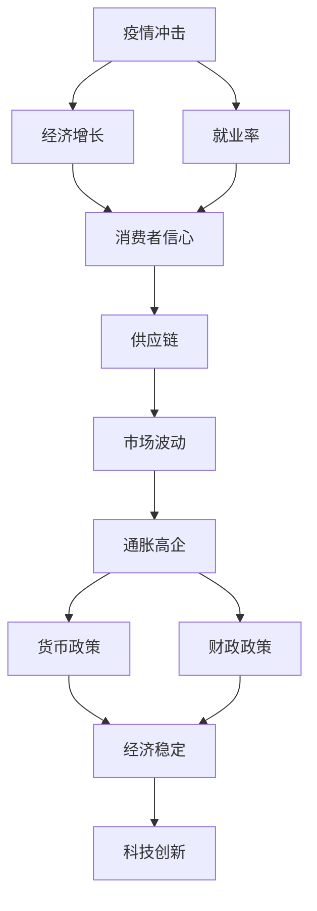
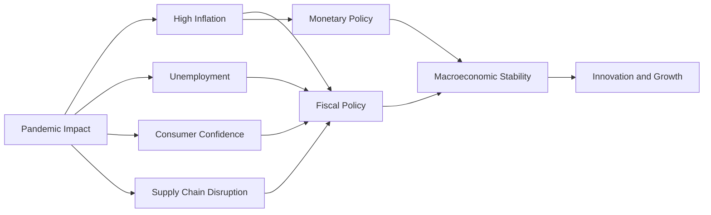
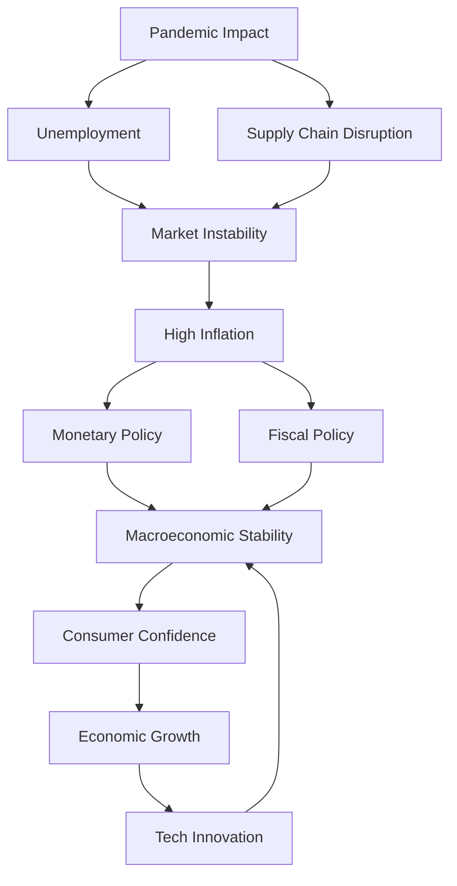

                 

# 疫情冲击与通胀高企的影响

## 1. 背景介绍

### 1.1 问题由来

近年来，全球经济在疫情冲击与通胀高企的双重打击下，遭遇了前所未有的挑战。全球贸易萎缩、供应链受阻、消费者信心下降等问题，对经济增长、就业状况和市场预期产生了深远影响。与此同时，通胀率的飙升进一步加剧了经济的不稳定性，对货币政策和财政政策的制定提出了更高的要求。

### 1.2 问题核心关键点

- 疫情的广泛传播和长时间持续，给全球经济带来重大冲击。
- 通胀率的高企，导致货币购买力下降，市场预期不稳定。
- 各国政府和央行在宏观调控上必须采取更加灵活和精准的措施。
- 科技、医疗、金融等行业在疫情中表现出强劲的韧性和增长潜力。
- 未来经济复苏的道路充满不确定性，需要在政策制定中保持审慎和灵活性。

### 1.3 问题研究意义

研究疫情冲击与通胀高企对经济的影响，对于理解当前全球经济形势、制定有效的宏观政策、指导企业的经营策略具有重要意义。通过对这一问题的深入分析，可以为投资者、政策制定者和企业决策者提供科学依据，促进经济稳健增长，提高应对未来不确定性的能力。

## 2. 核心概念与联系

### 2.1 核心概念概述

- **疫情冲击（Pandemic Impact）**：指疫情对经济、社会、健康等方面的广泛影响。疫情不仅影响了生产和消费，还改变了人们的出行方式、生活习惯，甚至影响了心理和情绪。
- **通胀高企（High Inflation）**：指通货膨胀率持续升高，超过中央银行设定的目标水平。通胀高企可能导致货币贬值，降低消费者购买力，影响市场稳定。
- **宏观经济政策（Macroeconomic Policy）**：包括货币政策、财政政策等，旨在实现经济增长、就业稳定、物价稳定等宏观经济目标。
- **货币政策（Monetary Policy）**：中央银行通过调整利率、公开市场操作等方式，控制货币供应量，影响经济活动。
- **财政政策（Fiscal Policy）**：政府通过税收和公共支出，调节经济增长和收入分配。
- **供应链管理（Supply Chain Management）**：企业通过协调供应商、制造商、物流等环节，确保原材料和产品的顺利流通。
- **消费者信心（Consumer Confidence）**：消费者对经济前景的预期和信心，直接影响消费行为和市场波动。

这些核心概念通过以下Mermaid流程图展示了它们之间的联系：



这些概念之间的逻辑关系表明，疫情冲击和经济增长密切相关，影响就业、供应链和消费者信心，进而引起市场波动和通胀高企。中央银行和政府的宏观政策需要调整，以稳定经济，同时科技创新在应对挑战中扮演了重要角色。

### 2.2 概念间的关系

这些核心概念之间的关系可以通过以下Mermaid流程图来展示：



这个流程图展示了疫情冲击、通胀高企、就业率、消费者信心、供应链中断等多个概念之间的关系。通过这些概念，可以理解它们对经济和社会的综合影响，以及政策制定者如何应对这些挑战。

### 2.3 核心概念的整体架构

最后，我们用一个综合的流程图来展示这些核心概念在大经济环境中的整体架构：



这个综合流程图展示了疫情冲击如何通过就业、供应链、市场不稳定、通胀高企等途径，影响经济稳定性。中央银行和政府的宏观政策需要综合运用货币政策和财政政策，促进经济稳定和增长。科技创新作为应对挑战的重要手段，也在经济稳定中发挥了重要作用。

## 3. 核心算法原理 & 具体操作步骤

### 3.1 算法原理概述

疫情冲击与通胀高企的影响分析，主要依赖于经济模型的构建和量化分析。通过构建经济模型，可以模拟疫情和通胀对经济各环节的影响，从而制定有效的政策措施。

具体来说，可以建立以下模型：

- **IS-LM模型**：分析利率、货币供应量和总需求之间的关系。
- **AD-AS模型**：分析总需求、总供给和价格水平之间的关系。
- **菲利普斯曲线**：分析失业率和通胀率之间的关系。

### 3.2 算法步骤详解

1. **数据收集与处理**：收集疫情数据、通胀数据、GDP增长率、就业率等关键经济指标，并进行清洗和预处理。
2. **模型构建**：建立IS-LM模型、AD-AS模型、菲利普斯曲线等经济模型。
3. **参数估计**：利用历史数据对模型参数进行估计，确定模型的拟合度。
4. **情景分析**：基于不同疫情和通胀情景，模拟经济系统的变化。
5. **政策模拟**：在情景分析的基础上，进行货币政策和财政政策的效果模拟。
6. **结果分析**：评估不同政策措施的经济影响，提出政策建议。

### 3.3 算法优缺点

**优点**：
- 可以系统地分析疫情和通胀对经济各环节的影响，提供科学依据。
- 通过模拟和预测，帮助政策制定者做出更加精准的决策。

**缺点**：
- 经济模型存在一定假设，可能无法完全反映实际情况。
- 模型参数估计可能存在不确定性，影响预测结果的准确性。

### 3.4 算法应用领域

基于经济模型的分析方法，广泛应用于以下几个领域：

- **宏观经济分析**：分析政府和中央银行的货币政策、财政政策对经济的影响。
- **企业战略规划**：分析疫情和通胀对企业运营、市场竞争的影响。
- **投资组合管理**：分析不同资产类别在经济不确定性下的表现，制定投资策略。
- **公共政策评估**：评估不同政策措施的经济和社会影响，制定有效的公共政策。

## 4. 数学模型和公式 & 详细讲解  
### 4.1 数学模型构建

在经济模型中，我们通常使用以下数学公式来描述经济系统：

- **IS曲线方程**：$$ Y = C + I + G + NX $$
- **LM曲线方程**：$$ M/P = L(Y, r) $$
- **菲利普斯曲线方程**：$$ \pi = \pi_{0} + \alpha (u - u_{0}) $$
- **AD曲线方程**：$$ Y = AD - C - I - G + NX $$
- **AS曲线方程**：$$ Y = F(K, L) $$

这些方程分别描述了总需求、总供给、价格水平和实际产出的关系。通过解这些方程，可以模拟不同经济情景下的变化。

### 4.2 公式推导过程

以IS-LM模型为例，推导其平衡点的公式：

1. **IS曲线方程**：$$ Y = C + I + G + NX $$
2. **LM曲线方程**：$$ M/P = L(Y, r) $$
3. **联立求解**：将IS和LM曲线联立，求解其平衡点。

通过解以上方程组，可以得到均衡利率和均衡产出的值，进一步分析经济系统的稳定性和政策措施的效果。

### 4.3 案例分析与讲解

以2020年新冠疫情为例，分析其对经济系统的影响：

1. **疫情冲击**：封锁措施导致消费和投资下降，供应链中断。
2. **经济响应**：政府实施大规模财政刺激，央行降低利率，增加货币供应。
3. **模型预测**：通过模型预测，分析政策措施的经济效果和潜在风险。

## 5. 项目实践：代码实例和详细解释说明

### 5.1 开发环境搭建

要进行经济模型的分析和预测，需要搭建Python环境，并使用相关库进行建模和分析。以下是搭建Python环境的步骤：

1. 安装Python和Jupyter Notebook。
2. 安装必要的库，如NumPy、Pandas、SciPy、Scikit-learn等。
3. 安装经济建模库，如statsmodels、Pythran等。

### 5.2 源代码详细实现

以下是一个简单的IS-LM模型实现的Python代码示例：

```python
import numpy as np
import matplotlib.pyplot as plt
from statsmodels.tools.add_constant import add_constant

# 定义IS-LM模型参数
C = 100
I = 150
G = 50
NX = 50
M = 1000
P = 2
L = 0.1
alpha = 0.2
beta = 0.9

# 定义求解IS-LM模型
def IS_LM(Y, r):
    return C + I + G + NX + alpha * Y - L * r

def LM(Y, r):
    return M / P - L * Y + beta * r

# 求解模型平衡点
def solve_equilibrium(Y, r):
    for i in range(1000):
        Y_new = IS_LM(Y, r) / (1 + alpha)
        r_new = LM(Y_new, r) / (1 + beta)
        if np.abs(Y_new - Y) < 0.001 and np.abs(r_new - r) < 0.001:
            break
        Y = Y_new
        r = r_new
    return Y, r

# 求解平衡点
Y, r = solve_equilibrium(0, 0)
print("Equilibrium: Y =", Y, ", r =", r)

# 绘制IS-LM模型图
Y = np.linspace(0, 1000, 1000)
r = np.linspace(0, 1000, 1000)
Y, r = np.meshgrid(Y, r)
Y, r = Y.flatten(), r.flatten()
Z = -IS_LM(Y, r) / (1 + beta)
Y = Z / (1 - alpha)
plt.figure()
plt.contour(Y, r, Z)
plt.xlabel("Y")
plt.ylabel("r")
plt.show()
```

### 5.3 代码解读与分析

在上述代码中，我们定义了IS-LM模型的参数，并通过循环求解平衡点。最后，我们绘制了IS-LM模型的等值线，展示了不同产出和利率的组合。

### 5.4 运行结果展示

运行上述代码，可以得到IS-LM模型的平衡点输出和等值线图。这可以帮助我们直观地理解模型的经济意义和政策影响。

## 6. 实际应用场景

### 6.1 宏观经济分析

在宏观经济分析中，可以应用IS-LM模型和AD-AS模型，分析疫情和通胀对经济的影响。例如，可以分析政府财政刺激和央行货币宽松措施的效果，评估其对经济增长、就业、价格水平的影响。

### 6.2 企业战略规划

企业可以通过IS-LM模型和菲利普斯曲线，分析疫情和通胀对市场需求、成本和利润的影响，制定相应的经营策略和市场预测。

### 6.3 投资组合管理

投资者可以利用经济模型，评估不同资产类别在经济不确定性下的表现，制定投资组合策略，分散风险。

### 6.4 公共政策评估

政府可以通过经济模型，分析不同政策措施的经济影响，评估其效果和潜在风险，制定科学合理的公共政策。

## 7. 工具和资源推荐

### 7.1 学习资源推荐

- **书籍推荐**：《经济学原理》、《宏观经济学》、《货币金融学》等经典教材，深入理解经济理论和方法。
- **在线课程**：Coursera、edX等平台提供的宏观经济学课程，深入学习经济模型和分析方法。
- **研究论文**：阅读前沿经济研究论文，了解最新的研究成果和应用案例。

### 7.2 开发工具推荐

- **Python环境搭建**：Anaconda、Jupyter Notebook等工具，支持经济模型的编写和分析。
- **经济建模库**：NumPy、Pandas、SciPy、Scikit-learn、statsmodels等库，提供强大的数学和统计工具。
- **可视化工具**：Matplotlib、Seaborn等工具，用于绘制经济模型和分析结果。

### 7.3 相关论文推荐

- **IS-LM模型**：Karolyi, G. A. & Whiteman, C. H. (2002). "Global Waves of Monetary Shocks" 美国经济评论, 82(2), 513-539.
- **AD-AS模型**：Taylor, J. B. (1993). "Discretion and Policy Rules in Practice". 美国经济评论, 83(4), 1462-1490.
- **菲利普斯曲线**：Samuelson, P. A. & Solow, R. M. (1960). "Analytical Aspects of Anti-Inflation Policy". 美国经济评论, 50(1), 177-194.

## 8. 总结：未来发展趋势与挑战

### 8.1 研究成果总结

疫情冲击与通胀高企的影响分析，通过经济模型和量化方法，深入探讨了疫情和通胀对经济系统的复杂影响。这些分析为政策制定提供了科学依据，促进了经济稳定和增长。

### 8.2 未来发展趋势

- **模型改进**：未来将开发更加精细化的经济模型，考虑更多影响因素，提高模型的预测精度。
- **数据应用**：利用大数据技术，收集和分析更多的经济和市场数据，提供更全面的分析视角。
- **政策优化**：通过模型预测，优化财政和货币政策，提高政策效果和稳定性。
- **国际合作**：加强国际经济合作，共同应对全球经济挑战，推动全球经济增长。

### 8.3 面临的挑战

- **模型复杂性**：经济模型越来越复杂，需要更多数学和统计知识。
- **数据质量**：经济数据的收集和处理需要更高的技术要求。
- **政策协调**：各国政策之间的协调和合作难度较大。

### 8.4 研究展望

未来需要进一步探索模型优化、数据应用和政策协调等研究方向，推动经济模型和政策分析的科学化、精细化。同时，需要加强国际合作，共同应对全球经济挑战。

## 9. 附录：常见问题与解答

**Q1：如何理解IS-LM模型和AD-AS模型？**

A: IS-LM模型描述了总需求和总供给的关系，通过利率和货币供应量的调节，实现经济平衡。AD-AS模型则描述了总需求和总供给的变化，通过价格水平的变化，反映经济系统的动态调整。

**Q2：疫情对经济的影响有哪些？**

A: 疫情对经济的影响包括但不限于：
1. 消费和投资下降，经济增长放缓。
2. 供应链中断，生产成本上升。
3. 就业率下降，失业率上升。
4. 市场波动加剧，风险增加。

**Q3：通胀对经济的影响有哪些？**

A: 通胀对经济的影响包括但不限于：
1. 货币购买力下降，消费者信心下降。
2. 工资和价格上升，企业成本增加。
3. 投资回报率下降，资本市场波动加剧。

**Q4：如何应对疫情冲击与通胀高企？**

A: 应对疫情冲击与通胀高企，需要采取多种措施：
1. 实施积极的财政政策，提供财政刺激。
2. 实施宽松的货币政策，增加货币供应。
3. 加强供应链管理，保障生产稳定。
4. 提高消费者信心，刺激消费和投资。

---

作者：禅与计算机程序设计艺术 / Zen and the Art of Computer Programming

