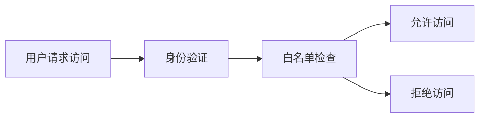

                 

# 白名单：防止未经授权的访问

> 关键词：白名单、访问控制、身份验证、应用程序安全、网络安全

## 1. 背景介绍

在数字化转型和网络化社会的背景下，互联网和移动设备的普及使得信息安全问题变得更加严峻。为了保障数据和系统的安全，用户身份验证和访问控制技术日益受到重视。其中，白名单（White List）作为一种简单而有效的访问控制机制，在企业、政府、金融机构等各类组织中被广泛应用。本文将全面介绍白名单的核心概念、工作原理、实际应用，以及未来发展趋势和挑战。

## 2. 核心概念与联系

### 2.1 核心概念概述

- **白名单（White List）**：白名单是一种基于访问控制的机制，仅允许预先定义的、经过授权的IP地址、用户、设备等访问系统或网络资源。白名单的核心理念是“允许一切未明确禁止的”，其对安全性的保障主要依赖于事先的精确控制。

- **访问控制（Access Control）**：访问控制是指对资源访问进行授权和管理的过程。根据访问控制原则，只有经过身份验证和授权的用户才能访问系统资源。访问控制是信息安全管理的基础。

- **身份验证（Authentication）**：身份验证是指验证用户身份的过程，以确认用户的真实性。常用的身份验证方式包括用户名+密码、双因素认证、生物识别等。

- **应用程序安全（Application Security）**：应用程序安全指的是保护应用程序免受安全威胁，防止未经授权的访问、数据泄露、恶意代码等安全问题。白名单是应用程序安全的重要组成部分。

- **网络安全（Cyber Security）**：网络安全是指保护网络资源免受恶意攻击，保障数据安全、系统稳定和业务连续。白名单是网络安全的重要手段之一。

这些核心概念之间存在密切联系，共同构成了信息安全管理的整体架构。通过白名单机制，可以实现对用户、设备和IP地址等访问主体的精确控制，从而提升应用程序和网络的安全性。

### 2.2 核心概念的关系

白名单作为访问控制的实现方式之一，其核心思想是“最小权限原则”。即仅允许经过验证和授权的用户访问系统资源，同时拒绝未经授权的访问请求。这一原则体现了安全性的核心要义。

以下是一个简单的Mermaid流程图，展示了白名单机制的工作流程：



该流程图示意了用户请求访问时，系统首先进行身份验证，然后根据白名单中授权的IP地址、用户等，判断是否允许访问。如果用户被授权访问，则系统允许访问；否则，系统拒绝访问请求。

## 3. 核心算法原理 & 具体操作步骤

### 3.1 算法原理概述

白名单机制的核心算法原理基于访问控制列表（Access Control List，ACL），其核心思想是“白名单原则”。即仅允许经过验证和授权的用户访问系统资源，同时拒绝未经授权的访问请求。白名单的实现方式通常包括IP白名单、用户白名单和设备白名单等。

- **IP白名单**：仅允许特定IP地址访问系统资源，其他IP地址访问被拒绝。适用于企业内部网络等较为封闭的环境。

- **用户白名单**：仅允许特定用户访问系统资源，其他用户访问被拒绝。适用于需要严格控制用户访问权限的场景，如金融系统、政府系统等。

- **设备白名单**：仅允许特定设备访问系统资源，其他设备访问被拒绝。适用于移动设备访问的场景，如企业移动设备管理（MDM）系统。

### 3.2 算法步骤详解

白名单机制的实现步骤包括身份验证、白名单检查和访问控制三个阶段。具体步骤如下：

1. **身份验证**：系统首先对用户进行身份验证，确认用户的真实性和权限。身份验证的方式包括用户名+密码、双因素认证、生物识别等。

2. **白名单检查**：系统根据白名单规则，检查用户请求的IP地址、用户、设备等是否在授权范围内。如果满足授权条件，则允许访问；否则，拒绝访问。

3. **访问控制**：系统根据访问控制规则，判断用户是否有权限访问请求的资源。如果满足权限条件，则允许访问；否则，拒绝访问。

### 3.3 算法优缺点

白名单机制具有以下优点：

- **安全性高**：仅允许经过验证和授权的用户访问系统资源，可以有效防止未经授权的访问和攻击。
- **易于管理**：白名单规则可以灵活配置和管理，适合于各种规模和复杂度的系统。
- **成本低**：相较于其他安全机制，白名单的实施和管理成本较低，适用于中小企业和资源有限的场景。

白名单机制也存在以下缺点：

- **灵活性不足**：白名单规则一旦配置完成，难以动态调整，无法适应变化的环境和需求。
- **扩展性差**：白名单机制适用于特定环境，难以应对大规模、高动态的网络和应用场景。
- **维护复杂**：白名单规则需要频繁更新和维护，增加了系统管理的复杂性和工作量。

### 3.4 算法应用领域

白名单机制广泛应用于各种场景，包括但不限于：

- **企业网络**：企业内部网络通常使用IP白名单和用户白名单，确保内部网络资源仅供内部用户访问。
- **金融系统**：金融系统通常使用用户白名单和设备白名单，确保关键业务系统仅供授权用户访问。
- **政府系统**：政府系统使用白名单机制，限制敏感数据和资源仅供授权人员访问。
- **移动设备管理**：MDM系统使用设备白名单，确保企业移动设备仅访问授权的内部资源。
- **物联网（IoT）**：IoT设备通常使用白名单机制，确保设备仅访问授权的网络和资源。

## 4. 数学模型和公式 & 详细讲解 & 举例说明

### 4.1 数学模型构建

白名单机制的数学模型基于ACL和访问控制规则。假设系统中有$N$个用户$U=\{u_1,u_2,\ldots,u_N\}$，白名单规则为$W=\{(u_i,a_i)\}$，其中$u_i$表示用户，$a_i$表示用户授权的资源列表。系统对用户请求$u$进行访问控制时，首先进行身份验证，然后根据白名单规则进行访问控制。

### 4.2 公式推导过程

假设用户$u$请求访问资源$r$，系统首先进行身份验证，然后根据白名单规则进行访问控制。白名单规则的数学表达为：

$$
(u,a) \in W \Leftrightarrow r \in a
$$

其中$(u,a) \in W$表示用户$u$在白名单$W$中，$r \in a$表示用户$u$授权访问资源列表$a$中包含资源$r$。系统对用户$u$进行访问控制时，检查$(u,a)$是否在白名单$W$中，若满足则允许访问；否则，拒绝访问。

### 4.3 案例分析与讲解

假设某公司有100个员工，使用白名单机制对内部网站进行访问控制。白名单规则为：

$$
W=\{(u_1,\{网站A,网站B\}),(u_2,\{网站B,邮件系统\}),\ldots,(u_{100},\{邮件系统,云存储\})\}
$$

其中$u_1$表示员工1，授权访问网站A和网站B；$u_2$表示员工2，授权访问网站B和邮件系统。其他员工仅授权访问邮件系统和云存储。

某员工访问网站A，系统首先进行身份验证，然后检查该员工是否在白名单$W$中，发现$(u_1,\{网站A,网站B\}) \in W$，因此允许访问；其他员工访问网站A，系统检查白名单$W$，发现$(u_i,\{网站A,网站B\}) \notin W$，因此拒绝访问。

## 5. 项目实践：代码实例和详细解释说明

### 5.1 开发环境搭建

白名单机制的实现需要搭建合适的开发环境。以下是一个基于Python的开发环境搭建流程：

1. **安装Python**：从官网下载并安装Python，建议使用3.x版本。
2. **安装Flask**：使用pip安装Flask框架，使用Flask实现Web服务端功能。
3. **安装SQLite**：使用pip安装SQLite数据库，用于存储白名单规则。
4. **安装Flask-RESTful**：使用pip安装Flask-RESTful扩展，用于实现RESTful接口。

### 5.2 源代码详细实现

以下是一个简单的Python代码示例，展示了如何使用Flask和SQLite实现白名单机制：

```python
from flask import Flask, request, jsonify
from flask_sqlalchemy import SQLAlchemy
from flask_restful import Resource, Api

app = Flask(__name__)
app.config['SQLALCHEMY_DATABASE_URI'] = 'sqlite://.white_list.db'
db = SQLAlchemy(app)
api = Api(app)

class WhiteList(db.Model):
    id = db.Column(db.Integer, primary_key=True)
    user = db.Column(db.String(100), nullable=False)
    resources = db.Column(db.String(500), nullable=False)

    def __init__(self, user, resources):
        self.user = user
        self.resources = resources

@app.route('/white_list', methods=['POST'])
def add_white_list():
    user = request.json['user']
    resources = request.json['resources']
    white_list = WhiteList(user, resources)
    db.session.add(white_list)
    db.session.commit()
    return jsonify({'status': 'success'}), 201

@app.route('/white_list', methods=['GET'])
def get_white_list():
    white_lists = WhiteList.query.all()
    results = []
    for white_list in white_lists:
        result = {'user': white_list.user, 'resources': white_list.resources}
        results.append(result)
    return jsonify(results)

if __name__ == '__main__':
    db.create_all()
    app.run(debug=True)
```

以上代码定义了一个白名单系统，支持添加和查询白名单规则。用户可以通过POST请求添加白名单规则，通过GET请求查询所有白名单规则。

### 5.3 代码解读与分析

- **Flask框架**：Flask是一个轻量级的Python Web框架，适合快速开发Web应用。
- **SQLite数据库**：SQLite是一种轻量级的关系型数据库，适合小规模应用。
- **RESTful接口**：RESTful接口是一种基于HTTP协议的API设计风格，适合Web应用的数据交互。

以上代码通过Flask实现了Web服务，使用SQLite存储白名单规则，使用RESTful接口实现数据交互。代码简单易懂，适合快速搭建白名单系统。

### 5.4 运行结果展示

运行上述代码后，启动Web服务，可以通过HTTP请求访问白名单系统。例如，添加白名单规则：

```bash
curl -X POST -H "Content-Type: application/json" -d '{"user": "user1", "resources": "websiteA,websiteB"}' http://localhost:5000/white_list
```

查询所有白名单规则：

```bash
curl http://localhost:5000/white_list
```

## 6. 实际应用场景

白名单机制在实际应用中具有广泛的应用场景，以下列举几个典型案例：

### 6.1 企业网络

某公司有200名员工，使用IP白名单和用户白名单对内部网络进行访问控制。白名单规则如下：

- IP白名单：仅允许内部网络IP访问内部资源，外部IP访问被拒绝。
- 用户白名单：仅允许授权用户访问内部资源，其他用户访问被拒绝。

企业内部网络使用白名单机制，可以确保内部资源仅供内部员工访问，防止外部攻击和数据泄露。

### 6.2 金融系统

某金融公司使用用户白名单和设备白名单对关键业务系统进行访问控制。白名单规则如下：

- 用户白名单：仅允许授权用户访问关键业务系统，其他用户访问被拒绝。
- 设备白名单：仅允许授权设备访问关键业务系统，其他设备访问被拒绝。

金融系统使用白名单机制，可以确保关键业务系统仅供授权用户和设备访问，防止恶意攻击和内部泄露。

### 6.3 移动设备管理

某企业使用设备白名单对企业移动设备进行管理。白名单规则如下：

- 设备白名单：仅允许授权设备访问内部资源，其他设备访问被拒绝。

企业移动设备使用白名单机制，可以确保移动设备仅访问授权的内部资源，防止移动设备数据泄露和恶意攻击。

## 7. 工具和资源推荐

### 7.1 学习资源推荐

以下是一些学习白名单机制的资源推荐：

- **《网络安全原理与实践》**：该书系统介绍了网络安全的基本原理和实践技术，包括白名单机制。
- **《信息安全导论》**：该书介绍了信息安全的定义、原理和应用，包括访问控制技术。
- **《网络安全技术与实战》**：该书介绍了网络安全的最新技术和实战案例，包括白名单机制。

### 7.2 开发工具推荐

以下是一些开发白名单机制的常用工具：

- **Flask框架**：Flask是一个轻量级的Python Web框架，适合快速开发Web应用。
- **SQLite数据库**：SQLite是一种轻量级的关系型数据库，适合小规模应用。
- **Flask-RESTful扩展**：Flask-RESTful扩展，用于实现RESTful接口。
- **Jwt**：Jwt是一种基于JSON的认证机制，适合实现双因素认证。

### 7.3 相关论文推荐

以下是几篇推荐的白名单机制相关论文：

- **《基于白名单机制的网络安全策略研究》**：介绍了白名单机制在网络安全中的应用。
- **《一种基于白名单机制的身份认证系统设计》**：介绍了白名单机制在身份认证中的应用。
- **《移动设备管理中的白名单机制研究》**：介绍了白名单机制在移动设备管理中的应用。

## 8. 总结：未来发展趋势与挑战

### 8.1 研究成果总结

白名单机制作为一种简单有效的访问控制机制，已经在企业网络、金融系统、移动设备管理等场景中广泛应用。通过白名单机制，可以有效防止未经授权的访问和攻击，保障系统的安全性。

### 8.2 未来发展趋势

未来白名单机制将向以下几个方向发展：

- **动态白名单**：白名单规则将具备动态调整能力，可以应对变化的环境和需求。
- **智能白名单**：白名单机制将引入人工智能技术，根据用户行为和访问模式，动态调整白名单规则，提高安全性。
- **多因素认证**：白名单机制将引入多因素认证技术，进一步提高用户身份验证的安全性。
- **跨平台管理**：白名单机制将具备跨平台管理能力，实现统一的身份认证和访问控制。
- **区块链技术**：白名单机制将引入区块链技术，确保白名单规则的透明性和不可篡改性。

### 8.3 面临的挑战

白名单机制在应用中面临以下挑战：

- **灵活性不足**：白名单规则一旦配置完成，难以动态调整，无法适应变化的环境和需求。
- **扩展性差**：白名单机制适用于特定环境，难以应对大规模、高动态的网络和应用场景。
- **维护复杂**：白名单规则需要频繁更新和维护，增加了系统管理的复杂性和工作量。
- **隐私问题**：白名单机制需要记录和存储用户和设备的访问记录，可能涉及用户隐私问题。

### 8.4 研究展望

未来的研究需要在以下几个方面寻求新的突破：

- **动态白名单技术**：开发动态白名单规则生成算法，实现白名单规则的动态调整和优化。
- **智能白名单技术**：引入人工智能技术，构建智能白名单机制，实现白名单规则的智能生成和动态调整。
- **多因素认证技术**：研究多因素认证技术，提高白名单机制的身份验证安全性。
- **跨平台管理技术**：研究跨平台身份认证和访问控制技术，实现统一的身份管理和访问控制。
- **区块链技术**：探索区块链技术在白名单机制中的应用，确保白名单规则的透明性和不可篡改性。

## 9. 附录：常见问题与解答

### Q1: 白名单机制如何与双因素认证结合使用？

**A1**：白名单机制与双因素认证结合使用，可以进一步提高身份验证的安全性。具体而言，系统在用户登录时，首先通过白名单机制验证用户和设备的访问权限，然后通过双因素认证进一步确认用户身份。双因素认证通常包括动态令牌、短信验证码、生物识别等形式，可以有效地防止恶意攻击和账号盗用。

### Q2: 白名单机制是否适用于互联网环境？

**A2**：白名单机制在互联网环境中的应用需要慎重考虑。互联网环境具有高动态性和复杂性，白名单规则需要具备灵活性和动态调整能力。此外，白名单机制需要结合其他安全技术，如防火墙、入侵检测等，才能有效应对互联网环境下的安全威胁。

### Q3: 白名单机制是否适用于小型企业？

**A3**：白名单机制适用于小型企业，尤其是内部网络资源相对简单和稳定的企业。通过白名单机制，小型企业可以有效地控制内部访问权限，防止未授权访问和数据泄露。

### Q4: 白名单机制的维护复杂性如何处理？

**A4**：白名单机制的维护复杂性可以通过自动化工具和脚本进行简化。例如，可以定期自动生成白名单规则，动态调整白名单规则，并使用日志和监控工具实时监测白名单规则的执行情况，及时发现和处理异常情况。

### Q5: 白名单机制在移动设备管理中的应用有哪些？

**A5**：白名单机制在移动设备管理中的应用包括：

- **设备访问控制**：仅允许授权设备访问企业内部资源，防止未授权设备访问。
- **应用权限控制**：仅允许授权应用访问设备资源，防止未授权应用访问。
- **数据加密**：仅允许授权设备访问敏感数据，防止未授权设备访问。
- **远程擦除**：仅允许授权设备远程擦除数据，防止未授权设备远程擦除数据。

综上所述，白名单机制作为一种简单有效的访问控制机制，广泛应用于各种场景，是保障信息安全的重要手段。未来，白名单机制将在动态化、智能化、多因素认证等方面继续发展，适应不断变化的安全需求和复杂的应用场景。

