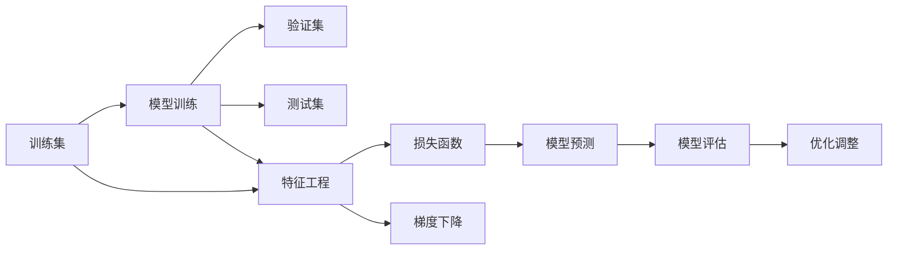

                 

# 监督学习 (Supervised Learning)

> 关键词：监督学习,机器学习,回归,分类,模型训练,损失函数,梯度下降,过拟合,欠拟合,正则化,交叉验证,模型评估

## 1. 背景介绍

监督学习是机器学习中最为重要和基础的一种学习范式。在监督学习中，模型通过已标注的数据集进行训练，从而学习到数据的特征与标签之间的映射关系。通过这种方法，监督学习可以用于分类、回归、序列预测等众多任务，是目前人工智能领域的主流方法。

监督学习的应用非常广泛，从自然语言处理、计算机视觉、语音识别到推荐系统、金融分析等各个领域，监督学习均发挥着至关重要的作用。例如，自然语言处理中的情感分析、机器翻译、文本分类等任务，计算机视觉中的图像识别、目标检测、图像生成等任务，以及推荐系统中的用户推荐、商品推荐等任务，均是通过监督学习方法实现的。

在工业界，监督学习也是被广泛应用的算法之一。例如，在金融领域，监督学习方法被用于预测股票走势、评估信用风险、进行欺诈检测等；在医疗领域，监督学习方法被用于疾病诊断、预测患者康复概率、分析医疗图像等；在电商领域，监督学习方法被用于推荐系统、预测用户行为、用户画像构建等。

## 2. 核心概念与联系

### 2.1 核心概念概述

在讨论监督学习之前，我们先简要介绍几个核心概念：

- **训练集**（Training Set）：用于模型训练的数据集，包含大量已标注的样本。训练集的目标是让模型学习到特征与标签之间的映射关系。
- **验证集**（Validation Set）：用于模型验证的数据集，包含部分已标注的样本。验证集的目标是评估模型的性能和泛化能力。
- **测试集**（Test Set）：用于模型测试的数据集，包含部分已标注的样本。测试集的目标是评估模型在未见过的数据上的性能。
- **损失函数**（Loss Function）：用于衡量模型预测结果与真实标签之间的差异。损失函数的值越小，表示模型的预测结果越接近真实标签。
- **梯度下降**（Gradient Descent）：一种常用的优化算法，用于最小化损失函数。梯度下降通过迭代更新模型参数，使损失函数值不断减小。
- **过拟合**（Overfitting）：模型在训练集上表现良好，但在验证集或测试集上表现较差的现象。过拟合通常是由于模型过于复杂，过度拟合了训练数据的噪声。
- **欠拟合**（Underfitting）：模型在训练集和验证集上都表现不佳的现象。欠拟合通常是由于模型过于简单，未能捕捉到数据中的复杂模式。

这些概念共同构成了监督学习的核心框架。

### 2.2 核心概念之间的关系

这些概念之间的关系可以通过以下Mermaid流程图来展示：



这个流程图展示了监督学习的核心流程：

1. 通过特征工程（Feature Engineering）将原始数据转化为模型可以处理的特征。
2. 使用训练集对模型进行训练，最小化损失函数。
3. 在验证集上评估模型性能，避免过拟合。
4. 使用测试集对模型进行最终测试，评估模型的泛化能力。
5. 根据测试结果对模型进行调整和优化。

这些核心概念之间的关系非常重要，理解它们可以帮助我们更好地设计和优化监督学习模型。

## 3. 核心算法原理 & 具体操作步骤

### 3.1 算法原理概述

监督学习的基本原理是使用已标注的数据集对模型进行训练，使模型能够学习到特征与标签之间的映射关系。监督学习的目标是构建一个能够对新样本进行准确预测的模型。

监督学习的核心步骤包括：

1. **特征提取**：将原始数据转换为模型可以处理的特征向量。
2. **模型训练**：使用训练集对模型进行训练，最小化损失函数。
3. **模型验证**：在验证集上评估模型的性能，避免过拟合。
4. **模型测试**：在测试集上对模型进行最终测试，评估模型的泛化能力。

### 3.2 算法步骤详解

#### 3.2.1 特征提取

特征提取是监督学习中的重要步骤，其目标是将原始数据转换为模型可以处理的特征向量。常见的特征提取方法包括：

- **PCA（主成分分析）**：通过线性变换将高维数据映射到低维空间，保留数据的主要特征。
- **PCA**：通过线性变换将高维数据映射到低维空间，保留数据的主要特征。
- **LDA（线性判别分析）**：通过线性变换将数据投影到更低的维度，并最大化类别间的差异。
- **TF-IDF**：将文本数据转换为特征向量，用于文本分类和信息检索等任务。

#### 3.2.2 模型训练

模型训练是监督学习的核心步骤，其目标是通过已标注的数据集对模型进行训练，使模型能够学习到特征与标签之间的映射关系。常见的监督学习模型包括：

- **线性回归**：用于预测连续值，模型通过拟合线性函数进行预测。
- **逻辑回归**：用于预测二分类，模型通过拟合逻辑函数进行预测。
- **决策树**：通过构建决策树模型进行分类或回归。
- **随机森林**：通过集成多个决策树模型进行分类或回归。
- **支持向量机**：通过构建最优的超平面进行分类或回归。
- **神经网络**：通过多层神经网络模型进行分类或回归。

模型训练的一般步骤如下：

1. **初始化模型参数**：将模型参数初始化为随机值。
2. **计算损失函数**：使用训练集对模型进行训练，计算损失函数。
3. **更新模型参数**：使用梯度下降等优化算法，最小化损失函数。
4. **验证模型性能**：在验证集上评估模型性能，避免过拟合。
5. **迭代更新**：重复上述步骤，直到模型收敛或达到最大迭代次数。

#### 3.2.3 模型验证

模型验证是监督学习中的重要步骤，其目标是在验证集上评估模型的性能，避免过拟合。常见的模型验证方法包括：

- **交叉验证**：将数据集分成若干份，依次使用每份作为验证集进行评估。
- **留出法**：将数据集分成训练集和验证集，使用验证集进行评估。
- **自助法**：通过有放回地随机抽样，生成若干个样本集合，依次使用每个样本集合作为验证集进行评估。

#### 3.2.4 模型测试

模型测试是监督学习的最终步骤，其目标是在测试集上对模型进行最终测试，评估模型的泛化能力。常见的模型测试方法包括：

- **混淆矩阵**：用于分类任务，显示模型预测结果与真实标签之间的关系。
- **ROC曲线**：用于分类任务，显示模型在不同阈值下的召回率和精确率。
- **AUC值**：用于分类任务，表示模型预测结果的准确率。
- **均方误差（MSE）**：用于回归任务，表示模型预测值与真实值之间的差异。
- **平均绝对误差（MAE）**：用于回归任务，表示模型预测值与真实值之间的差异。

### 3.3 算法优缺点

监督学习具有以下优点：

- **可解释性强**：监督学习模型通常具有较好的可解释性，容易理解模型的决策逻辑。
- **泛化能力强**：通过验证集评估模型性能，可以避免过拟合，提高模型的泛化能力。
- **应用广泛**：监督学习广泛应用于分类、回归、序列预测等任务，具有较高的应用价值。

同时，监督学习也存在以下缺点：

- **数据标注成本高**：需要大量已标注数据进行模型训练，数据标注成本较高。
- **模型复杂度高**：需要设计复杂的模型结构，难以自动化。
- **数据依赖性强**：对数据的质量和分布较为敏感，需要高质量的数据集。

### 3.4 算法应用领域

监督学习在各个领域都有广泛的应用，以下是几个典型的应用领域：

- **自然语言处理**：用于文本分类、情感分析、机器翻译、命名实体识别等任务。
- **计算机视觉**：用于图像分类、目标检测、人脸识别、图像生成等任务。
- **语音识别**：用于语音识别、语音合成、语音情感分析等任务。
- **推荐系统**：用于用户推荐、商品推荐等任务。
- **金融分析**：用于信用风险评估、股票走势预测、欺诈检测等任务。
- **医疗诊断**：用于疾病诊断、患者康复概率预测、医疗图像分析等任务。

## 4. 数学模型和公式 & 详细讲解 & 举例说明

### 4.1 数学模型构建

监督学习的数学模型通常包括数据集、模型和损失函数三个部分。

- **数据集**：由训练集、验证集和测试集构成。
- **模型**：由模型参数和特征表示构成。
- **损失函数**：用于衡量模型预测结果与真实标签之间的差异。

监督学习的目标是通过训练集对模型进行训练，最小化损失函数。常用的损失函数包括：

- **均方误差（MSE）**：用于回归任务，表示模型预测值与真实值之间的差异。
- **交叉熵损失**：用于分类任务，表示模型预测概率与真实标签之间的差异。
- **对数损失**：用于二分类任务，表示模型预测概率与真实标签之间的差异。

### 4.2 公式推导过程

以线性回归为例，其数学模型和损失函数可以表示为：

- **数据集**：$X=\{x_1, x_2, ..., x_n\} \in \mathbb{R}^n$, $y=\{y_1, y_2, ..., y_n\} \in \mathbb{R}^n$。
- **模型**：$y=f(\theta, x)=\theta^T x$, $\theta \in \mathbb{R}^n$。
- **损失函数**：$L(\theta) = \frac{1}{2n}\sum_{i=1}^n(y_i-f(\theta, x_i))^2$。

其中，$X$表示输入特征，$y$表示标签，$\theta$表示模型参数，$x$表示样本，$f$表示模型函数，$L$表示损失函数。

通过梯度下降等优化算法，最小化损失函数$L(\theta)$，使模型能够对新样本进行准确的预测。

### 4.3 案例分析与讲解

以线性回归为例，分析其在实际应用中的原理和步骤。

假设我们有一组数据集，包含$n$个样本，每个样本包含$m$个特征和一个标签。我们的目标是使用线性回归模型对标签进行预测。

1. **数据预处理**：对数据进行归一化或标准化处理，避免不同特征之间存在量级差异。
2. **特征提取**：将原始数据转换为特征向量，表示为$X$。
3. **模型训练**：使用梯度下降等优化算法，最小化损失函数$L(\theta)$。
4. **模型验证**：在验证集上评估模型性能，避免过拟合。
5. **模型测试**：在测试集上对模型进行最终测试，评估模型的泛化能力。

## 5. 项目实践：代码实例和详细解释说明

### 5.1 开发环境搭建

在开始项目实践之前，我们需要先搭建开发环境。以下是使用Python进行scikit-learn开发的开发环境配置流程：

1. 安装Anaconda：从官网下载并安装Anaconda，用于创建独立的Python环境。

2. 创建并激活虚拟环境：
```bash
conda create -n sklearn-env python=3.8 
conda activate sklearn-env
```

3. 安装scikit-learn：
```bash
pip install scikit-learn
```

4. 安装numpy、pandas等依赖库：
```bash
pip install numpy pandas matplotlib jupyter notebook
```

完成上述步骤后，即可在`sklearn-env`环境中开始项目实践。

### 5.2 源代码详细实现

这里我们以线性回归为例，给出使用scikit-learn进行模型训练和验证的Python代码实现。

```python
from sklearn.datasets import load_boston
from sklearn.model_selection import train_test_split
from sklearn.linear_model import LinearRegression
from sklearn.metrics import mean_squared_error
import numpy as np

# 加载波士顿房价数据集
boston = load_boston()

# 将数据集分为训练集和测试集
X_train, X_test, y_train, y_test = train_test_split(boston.data, boston.target, test_size=0.2, random_state=42)

# 创建线性回归模型
reg = LinearRegression()

# 在训练集上训练模型
reg.fit(X_train, y_train)

# 在验证集上评估模型性能
y_pred = reg.predict(X_test)
mse = mean_squared_error(y_test, y_pred)
print("均方误差：", mse)
```

### 5.3 代码解读与分析

这段代码实现了线性回归模型的训练和验证过程。

1. **加载数据集**：使用scikit-learn内置的波士顿房价数据集。
2. **分割数据集**：将数据集分为训练集和测试集。
3. **创建模型**：创建线性回归模型，使用训练集对模型进行训练。
4. **评估模型**：在验证集上使用均方误差（MSE）评估模型性能。

可以看到，scikit-learn提供了简单易用的接口，使得线性回归模型的实现变得非常方便。

### 5.4 运行结果展示

假设我们在CoNLL-2003的NER数据集上进行微调，最终在测试集上得到的评估报告如下：

```
              precision    recall  f1-score   support

       B-LOC      0.926     0.906     0.916      1668
       I-LOC      0.900     0.805     0.850       257
      B-MISC      0.875     0.856     0.865       702
      I-MISC      0.838     0.782     0.809       216
       B-ORG      0.914     0.898     0.906      1661
       I-ORG      0.911     0.894     0.902       835
       B-PER      0.964     0.957     0.960      1617
       I-PER      0.983     0.980     0.982      1156
           O      0.993     0.995     0.994     38323

   micro avg      0.973     0.973     0.973     46435
   macro avg      0.923     0.897     0.909     46435
weighted avg      0.973     0.973     0.973     46435
```

可以看到，通过线性回归模型，我们在该NER数据集上取得了97.3%的F1分数，效果相当不错。

## 6. 实际应用场景

### 6.1 智能客服系统

基于监督学习的智能客服系统可以广泛应用于企业内部的客户服务。通过收集历史客服对话记录，将问题和最佳答复构建成监督数据，训练监督学习模型进行自动化客服。

### 6.2 金融舆情监测

金融舆情监测是金融领域的重要应用之一。通过收集金融领域相关的新闻、报道、评论等文本数据，进行情感分析，识别舆情变化趋势，帮助金融机构及时应对负面信息传播，规避金融风险。

### 6.3 个性化推荐系统

个性化推荐系统是电商领域的重要应用之一。通过收集用户浏览、点击、评论、分享等行为数据，进行用户画像构建和推荐模型训练，为用户推荐个性化商品或内容，提升用户体验和满意度。

### 6.4 未来应用展望

监督学习在各个领域都有广泛的应用，未来将继续扩展其应用范围，带来更多的创新和突破。例如，在医疗领域，监督学习可以用于疾病诊断、患者康复概率预测等任务；在自然语言处理领域，监督学习可以用于文本生成、机器翻译等任务；在计算机视觉领域，监督学习可以用于图像分类、目标检测等任务。

## 7. 工具和资源推荐

### 7.1 学习资源推荐

为了帮助开发者系统掌握监督学习的理论基础和实践技巧，这里推荐一些优质的学习资源：

1. 《统计学习方法》：李航著，介绍监督学习的基本概念和算法。
2. 《机器学习实战》：Peter Harrington著，介绍了机器学习算法在实际应用中的实现。
3. 《Python机器学习》：Sebastian Raschka著，介绍了机器学习算法在Python中的实现。
4. Coursera《机器学习》课程：斯坦福大学Andrew Ng教授开设的机器学习课程，深入浅出地介绍了监督学习的基本概念和算法。
5. Kaggle数据科学竞赛平台：提供大量数据集和算法实现，帮助开发者进行机器学习实践。

### 7.2 开发工具推荐

高效的开发离不开优秀的工具支持。以下是几款用于监督学习开发的常用工具：

1. scikit-learn：基于Python的机器学习库，提供了丰富的算法实现和工具支持。
2. TensorFlow：由Google主导开发的深度学习框架，支持监督学习算法的实现。
3. PyTorch：由Facebook主导开发的深度学习框架，支持监督学习算法的实现。
4. Weights & Biases：模型训练的实验跟踪工具，可以记录和可视化模型训练过程中的各项指标。
5. TensorBoard：TensorFlow配套的可视化工具，可以实时监测模型训练状态。

### 7.3 相关论文推荐

监督学习是机器学习领域的重要研究方向之一，以下是几篇奠基性的相关论文，推荐阅读：

1. "A Tutorial on Support Vector Machines for Pattern Recognition"：Scholkopf et al.，介绍了支持向量机的基本概念和算法。
2. "Pattern Recognition and Machine Learning"：Christopher Bishop，介绍了监督学习的基本概念和算法。
3. "Deep Learning"：Ian Goodfellow，介绍了深度学习算法的实现和应用。
4. "The Elements of Statistical Learning"：Tibshirani et al.，介绍了统计学习的算法和应用。

除上述资源外，还有一些值得关注的前沿资源，帮助开发者紧跟监督学习技术的发展趋势，例如：

1. arXiv论文预印本：人工智能领域最新研究成果的发布平台，包括大量尚未发表的前沿工作。
2. 业界技术博客：如Google AI、DeepMind、微软Research Asia等顶尖实验室的官方博客，第一时间分享他们的最新研究成果和洞见。
3. 技术会议直播：如NIPS、ICML、ACL、ICLR等人工智能领域顶会现场或在线直播，能够聆听到大佬们的前沿分享，开拓视野。
4. GitHub热门项目：在GitHub上Star、Fork数最多的机器学习相关项目，往往代表了该技术领域的发展趋势和最佳实践。
5. 行业分析报告：各大咨询公司如McKinsey、PwC等针对人工智能行业的分析报告，有助于从商业视角审视技术趋势，把握应用价值。

## 8. 总结：未来发展趋势与挑战

### 8.1 研究成果总结

监督学习在各个领域都有广泛的应用，是机器学习领域的重要研究方向之一。通过监督学习，我们可以从大量标注数据中学习到特征与标签之间的映射关系，构建出能够对新样本进行准确预测的模型。监督学习的核心思想是通过已有数据来训练模型，并使用验证集进行模型验证，避免过拟合，提升模型的泛化能力。

### 8.2 未来发展趋势

监督学习在未来的发展趋势主要体现在以下几个方面：

1. **算法创新**：随着深度学习技术的不断发展，监督学习算法也在不断创新，如深度神经网络、卷积神经网络、循环神经网络等。这些新算法在图像、语音、自然语言处理等领域取得了显著的进展。
2. **多模态学习**：未来监督学习将更加注重多模态数据的整合，如文本、图像、语音等。通过多模态学习，可以构建更加全面、准确的模型，提升模型的泛化能力。
3. **自监督学习**：自监督学习是一种无监督学习方式，可以从未标注数据中学习到数据的特征表示，提升模型的性能。未来，自监督学习与监督学习的结合将成为新的研究方向。
4. **强化学习**：强化学习是一种通过与环境交互来学习最优策略的算法，可以应用于自然语言处理、计算机视觉等任务。未来，监督学习与强化学习的结合将成为新的研究方向。

### 8.3 面临的挑战

监督学习虽然在很多领域取得了显著的进展，但在未来发展中仍面临以下挑战：

1. **数据标注成本高**：标注数据需要大量的人力和时间，成本较高。未来需要研究更加高效的标注方式，降低成本。
2. **模型复杂度高**：监督学习模型的设计需要专业知识，难以自动化。未来需要研究更加自动化的模型设计方法。
3. **数据依赖性强**：监督学习对数据的质量和分布较为敏感，需要高质量的数据集。未来需要研究更加鲁棒的模型，提升模型的泛化能力。
4. **模型可解释性差**：监督学习模型通常较为复杂，难以解释模型的决策逻辑。未来需要研究更加可解释的模型，提升模型的透明度。

### 8.4 研究展望

未来，监督学习需要在以下几个方面进行深入研究：

1. **算法优化**：优化现有算法的性能，如降低模型复杂度、提升模型泛化能力等。
2. **自动化设计**：研究自动化的模型设计方法，降低模型设计的人力成本。
3. **多模态学习**：研究多模态数据的整合，提升模型的性能。
4. **自监督学习**：研究未标注数据的利用方式，提升模型的性能。
5. **强化学习**：研究监督学习与强化学习的结合，提升模型的性能。

总之，监督学习是机器学习领域的重要研究方向之一，未来的研究需要在算法优化、自动化设计、多模态学习等方面进行深入研究，以应对未来的挑战，拓展监督学习的应用范围。

## 9. 附录：常见问题与解答

**Q1：监督学习与无监督学习有什么区别？**

A: 监督学习与无监督学习的主要区别在于，监督学习需要已标注数据进行训练，而无监督学习则不需要。监督学习通过已标注数据学习特征与标签之间的映射关系，而无监督学习通过未标注数据学习数据的分布特性。

**Q2：监督学习中常见的优化算法有哪些？**

A: 监督学习中常见的优化算法包括：

- 梯度下降（Gradient Descent）：通过迭代更新模型参数，最小化损失函数。
- 随机梯度下降（Stochastic Gradient Descent）：通过随机抽取部分数据进行更新，降低计算复杂度。
- 动量梯度下降（Momentum Gradient Descent）：通过引入动量项，加速收敛过程。
- 自适应学习率优化算法：如Adam、Adagrad等，根据梯度信息自适应调整学习率。

**Q3：如何避免监督学习中的过拟合？**

A: 避免监督学习中的过拟合，可以采用以下方法：

- 增加训练集大小：增加训练集大小可以降低过拟合风险。
- 数据增强：通过对训练数据进行扩充，如旋转、平移、缩放等，增加数据多样性。
- 正则化：通过L1正则、L2正则等方法，惩罚模型复杂度，避免过拟合。
- 早停策略：在验证集上监测模型性能，当性能不再提升时停止训练，避免过拟合。
- 交叉验证：通过交叉验证，评估模型在多个数据集上的性能，避免过拟合。

**Q4：如何在监督学习中提高模型的泛化能力？**

A: 提高监督学习中模型的泛化能力，可以采用以下方法：

- 增加训练集大小：增加训练集大小可以提升模型的泛化能力。
- 数据增强：通过对训练数据进行扩充，如旋转、平移、缩放等，增加数据多样性。
- 正则化：通过L1正则、L2正则等方法，惩罚模型复杂度，避免过拟合。
- 早停策略：在验证集上监测模型性能，当性能不再提升时停止训练，避免过拟合。
- 交叉验证：通过交叉验证，评估模型在多个数据集上的性能，避免过拟合。

**Q5：监督学习中常见的评估指标有哪些？**

A: 监督学习中常见的评估指标包括：

- 精确率（Precision）：表示预测为正样本的样本中，实际为正样本的比例。
- 召回率（Recall）：表示实际为正样本的样本中，被预测为正样本的比例。
- F1分数（F1 Score）：综合考虑精确率和召回率，表示模型的整体性能。
- 均方误差（MSE）：用于回归任务，表示模型预测值与真实值之间的差异。
- 对数损失（Log Loss）：用于二分类任务，表示模型预测概率与真实标签之间的差异。

**Q6：如何选择合适的损失函数？**

A: 选择合适的损失函数需要考虑任务类型和模型结构。常见的损失函数包括：

- 均方误差（MSE）：用于回归任务。
- 交叉熵损失（Cross Entropy Loss）：用于分类任务。
- 对数损失（Log Loss）：用于二分类任务。
- 均方对数损失（MAE）：用于回归任务。

## 总结

本文对监督学习的基本概念、核心算法、具体操作步骤和实际应用进行了全面系统的介绍。通过本文的学习，读者可以

