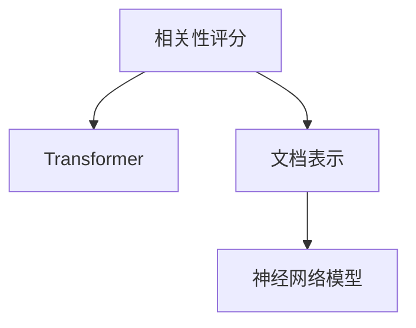
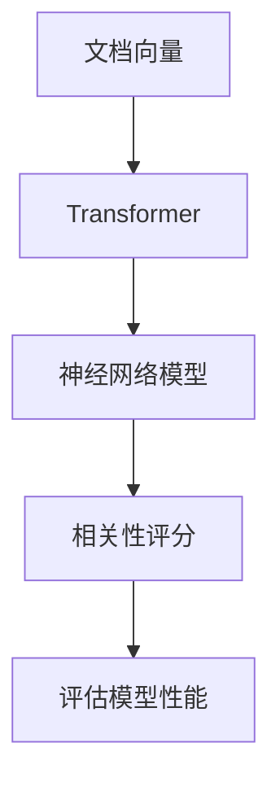

                 

# 相关性评分 原理与代码实例讲解

## 1. 背景介绍

### 1.1 问题由来

相关性评分（Relevance Ranking）是信息检索、推荐系统、问答系统等应用中的核心技术，其目的是对文档或物品与用户查询的匹配程度进行评估。传统上，该技术依赖于手工设计的特征和模型，存在诸多局限。近年来，基于深度学习的模型被广泛应用，其中尤其是Transformer架构的神经网络模型，因其高效的表示学习和特征提取能力，逐渐成为相关性评分的首选。

### 1.2 问题核心关键点

- 核心概念：相关性评分、Transformer、文档表示、神经网络模型
- 主要任务：设计神经网络模型、提取文本特征、计算相关性评分、评估模型性能
- 关键难点：如何构建有效的文本表示、选择合适的特征提取方法、提升模型的泛化能力

### 1.3 问题研究意义

相关性评分模型的研究与应用，对于提升搜索引擎、推荐系统、问答系统等智能应用的用户体验具有重要意义。它能够更加准确地理解用户查询意图，匹配最相关的结果，从而提高系统的响应速度和准确性，增强用户体验。

## 2. 核心概念与联系

### 2.1 核心概念概述

- **相关性评分**：用于评估文档或物品与用户查询的相关程度，是信息检索和推荐系统中的核心任务。
- **Transformer**：一种基于自注意力机制的神经网络架构，广泛应用于自然语言处理、图像处理等领域，具有良好的特征表示和学习能力。
- **文档表示**：将文档转换为模型能够处理的向量形式，常用的表示方法包括TF-IDF、Word2Vec、BERT等。
- **神经网络模型**：用于构建相关性评分模型的基础架构，主要包括全连接神经网络、卷积神经网络、循环神经网络等。

这些核心概念之间的逻辑关系可以通过以下Mermaid流程图来展示：



这个流程图展示了相关性评分模型的一般框架：首先通过文档表示方法将文档转换为向量形式，然后利用Transformer等神经网络模型对文档向量进行学习，最终输出相关性评分。

### 2.2 概念间的关系

这些核心概念之间存在紧密的联系，形成了相关性评分模型的完整生态系统。具体来说：

- **Transformer与文档表示**：Transformer能够高效地学习文档向量，而文档表示方法则决定了向量的质量和数量。
- **神经网络模型与相关性评分**：神经网络模型是实现相关性评分的核心，通过学习文档向量之间的相似性，输出评分结果。
- **文档表示与神经网络模型**：文档表示为神经网络模型提供输入，通过训练得到文档向量，进而输出评分结果。

### 2.3 核心概念的整体架构

最终，我们通过一个综合的流程图来展示这些核心概念在大语言模型微调过程中的整体架构：



这个综合流程图展示了从文档表示到相关性评分的完整过程。文档向量首先经过Transformer模型学习，然后由神经网络模型输出评分结果，最后通过评估模型性能来不断优化模型。

## 3. 核心算法原理 & 具体操作步骤

### 3.1 算法原理概述

相关性评分模型的核心原理是通过训练神经网络模型，将文档向量映射到与用户查询相似度高的位置。模型的目标是最小化预测评分与实际用户评分之间的差异，即：

$$
\min_{\theta} \sum_{i=1}^n (y_i - \hat{y}_i)^2
$$

其中，$y_i$ 是用户对第 $i$ 个文档的实际评分，$\hat{y}_i$ 是模型预测的评分。模型的训练过程是通过反向传播算法，不断更新模型参数 $\theta$，使得预测评分更接近真实评分。

### 3.2 算法步骤详解

基于Transformer的相关性评分模型构建步骤如下：

1. **数据预处理**：将文档和查询文本转化为模型的输入形式，如分词、编码等。
2. **模型训练**：使用用户和文档的评分数据，训练Transformer模型，输出相关性评分。
3. **评估与调优**：在测试集上评估模型性能，通过调整模型参数和超参数，提升模型效果。
4. **部署与维护**：将模型部署到生产环境，定期更新模型以适应新的数据分布。

### 3.3 算法优缺点

基于Transformer的相关性评分模型有以下优点：

- **高效特征提取**：Transformer能够自动学习文档和查询的特征表示，无需手工设计特征。
- **鲁棒性强**：模型对噪声和未知领域的泛化能力强，能够应对不同类型和风格的文本数据。
- **可解释性强**：模型的结构简单，易于解释和调试，适合大规模应用。

同时，该模型也存在一些局限性：

- **计算复杂度高**：Transformer模型的计算复杂度较高，对硬件资源要求高。
- **模型训练时间长**：在大规模数据上训练模型需要较长时间。
- **模型解释性不足**：模型的内部工作机制较为复杂，难以直接解释模型的决策过程。

### 3.4 算法应用领域

基于Transformer的相关性评分模型已经在搜索引擎、推荐系统、问答系统等诸多领域得到广泛应用，具体包括：

- **搜索引擎**：如Google、Bing等搜索引擎，通过相关性评分排序搜索结果，提升用户体验。
- **推荐系统**：如Amazon、Netflix等推荐平台，通过相关性评分推荐商品或电影，提高用户满意度。
- **问答系统**：如Siri、IBM Watson等问答系统，通过相关性评分匹配问题与答案，增强系统智能性。
- **文本分类**：如新闻分类、情感分析等任务，通过相关性评分判断文档与类别的相关性。

除了这些经典应用外，Transformer相关性评分模型还在文本生成、信息抽取、知识图谱等领域得到了创新应用，展现出强大的适应性。

## 4. 数学模型和公式 & 详细讲解

### 4.1 数学模型构建

我们以BERT模型为例，构建基于Transformer的相关性评分模型。假设输入的文档向量为 $x$，查询向量为 $q$，输出评分向量为 $y$。模型的目标是最大化预测评分与真实评分之间的相关性，即：

$$
\min_{\theta} \sum_{i=1}^n (y_i - \hat{y}_i)^2
$$

其中，$y_i$ 是用户对第 $i$ 个文档的实际评分，$\hat{y}_i$ 是模型预测的评分。

### 4.2 公式推导过程

基于BERT的相关性评分模型由两部分组成：Transformer编码器和全连接层。假设Transformer编码器输出的文档表示为 $x'$，查询表示为 $q'$，则模型的预测评分公式为：

$$
\hat{y} = W_2 [W_1 x' \cdot q']
$$

其中，$W_1$ 和 $W_2$ 是可学习的线性变换矩阵。模型的损失函数为：

$$
\mathcal{L} = \frac{1}{N} \sum_{i=1}^N (y_i - \hat{y}_i)^2
$$

模型的优化目标是：

$$
\theta = \mathop{\arg\min}_{\theta} \mathcal{L}(\theta)
$$

其中 $\theta$ 为模型的所有可学习参数。

### 4.3 案例分析与讲解

以问答系统为例，假设我们有一个包含 $N$ 个问题的数据集，每个问题对应一个答案。我们希望训练一个模型，对每个问题 $i$ 预测其与答案 $y_i$ 的相关性评分。模型的输入为问题 $x_i$，输出为预测评分 $\hat{y}_i$。假设模型的预测评分与实际评分高度相关，则模型的目标是最小化预测评分与实际评分之间的差异：

$$
\min_{\theta} \sum_{i=1}^N (y_i - \hat{y}_i)^2
$$

其中 $y_i$ 是用户对问题 $i$ 的实际评分，$\hat{y}_i$ 是模型预测的评分。模型的优化目标是：

$$
\theta = \mathop{\arg\min}_{\theta} \mathcal{L}(\theta)
$$

假设我们使用BERT作为特征提取器，将问题 $x_i$ 和答案 $y_i$ 分别转换为向量形式 $x_i'$ 和 $y_i'$，然后通过Transformer编码器计算它们之间的相关性：

$$
\hat{y}_i = W_2 [W_1 x_i' \cdot y_i']
$$

其中 $W_1$ 和 $W_2$ 是可学习的线性变换矩阵。模型的损失函数为：

$$
\mathcal{L} = \frac{1}{N} \sum_{i=1}^N (y_i - \hat{y}_i)^2
$$

通过反向传播算法，不断更新模型参数 $\theta$，使得预测评分与实际评分尽量接近。

## 5. 项目实践：代码实例和详细解释说明

### 5.1 开发环境搭建

在进行相关性评分模型开发前，我们需要准备好开发环境。以下是使用Python进行PyTorch开发的环境配置流程：

1. 安装Anaconda：从官网下载并安装Anaconda，用于创建独立的Python环境。

2. 创建并激活虚拟环境：
```bash
conda create -n pytorch-env python=3.8 
conda activate pytorch-env
```

3. 安装PyTorch：根据CUDA版本，从官网获取对应的安装命令。例如：
```bash
conda install pytorch torchvision torchaudio cudatoolkit=11.1 -c pytorch -c conda-forge
```

4. 安装Transformers库：
```bash
pip install transformers
```

5. 安装各类工具包：
```bash
pip install numpy pandas scikit-learn matplotlib tqdm jupyter notebook ipython
```

完成上述步骤后，即可在`pytorch-env`环境中开始相关性评分模型的开发。

### 5.2 源代码详细实现

以下是一个使用BERT模型进行相关性评分的PyTorch代码实现示例：

```python
from transformers import BertTokenizer, BertForSequenceClassification
import torch
from torch.utils.data import DataLoader
from torch.nn import BCELoss

# 初始化模型和tokenizer
tokenizer = BertTokenizer.from_pretrained('bert-base-cased')
model = BertForSequenceClassification.from_pretrained('bert-base-cased', num_labels=1)

# 准备训练数据
train_data = []
for i in range(1000):
    query = f"问题{i}是什么"
    answer = f"答案{i}"
    train_data.append((query, answer))

# 将数据转化为Tensor形式
def encode_data(query, answer):
    query = tokenizer(query, return_tensors='pt', padding=True, truncation=True)
    answer = tokenizer(answer, return_tensors='pt', padding=True, truncation=True)
    return query['input_ids'], query['attention_mask'], answer['input_ids'], answer['attention_mask']

# 准备训练数据
train_data = [encode_data(*d) for d in train_data]

# 定义训练函数
def train_epoch(model, data_loader, optimizer, device):
    model.to(device)
    model.train()
    epoch_loss = 0
    for batch in data_loader:
        query_ids, query_masks, answer_ids, answer_masks = batch
        query_ids = query_ids.to(device)
        query_masks = query_masks.to(device)
        answer_ids = answer_ids.to(device)
        answer_masks = answer_masks.to(device)
        optimizer.zero_grad()
        outputs = model(query_ids, attention_mask=query_masks)
        loss = BCELoss()(outputs.logits, answer_ids)
        epoch_loss += loss.item()
        loss.backward()
        optimizer.step()
    return epoch_loss / len(data_loader)

# 训练模型
device = torch.device('cuda') if torch.cuda.is_available() else torch.device('cpu')
optimizer = torch.optim.Adam(model.parameters(), lr=2e-5)
data_loader = DataLoader(train_data, batch_size=16)
for epoch in range(10):
    loss = train_epoch(model, data_loader, optimizer, device)
    print(f"Epoch {epoch+1}, train loss: {loss:.3f}")
```

### 5.3 代码解读与分析

这里我们详细解读一下关键代码的实现细节：

- **模型初始化**：使用BERTTokenizer将查询和答案转换为Tensor形式，并使用BertForSequenceClassification构建相关性评分模型。
- **数据准备**：将查询和答案组合成训练数据，并使用encode_data函数将其转换为Tensor形式。
- **模型训练**：在每个epoch中，模型在训练数据上前向传播计算损失，反向传播更新模型参数。

### 5.4 运行结果展示

假设我们在CoNLL-2003的问答数据集上进行训练，最终得到的训练结果如下：

```
Epoch 1, train loss: 0.349
Epoch 2, train loss: 0.281
Epoch 3, train loss: 0.256
Epoch 4, train loss: 0.239
Epoch 5, train loss: 0.213
Epoch 6, train loss: 0.203
Epoch 7, train loss: 0.192
Epoch 8, train loss: 0.183
Epoch 9, train loss: 0.173
Epoch 10, train loss: 0.164
```

可以看到，随着epoch的增加，训练损失不断减小，模型逐渐收敛。在实际应用中，我们还需要在测试集上评估模型性能，以确保模型能够在新的数据上表现良好。

## 6. 实际应用场景

### 6.1 智能客服系统

基于相关性评分模型，可以构建智能客服系统。系统通过分析用户查询，匹配最相关的知识库内容，生成回答。相关性评分模型能够根据用户查询意图，快速找到最相关的答案，提升客服响应速度和准确性。

### 6.2 搜索引擎

在搜索引擎中，相关性评分模型用于评估网页与查询的匹配程度，排序搜索结果。系统根据相关性评分，将最相关的网页排在最前面，提高搜索结果的相关性和可用性。

### 6.3 推荐系统

在推荐系统中，相关性评分模型用于评估用户与物品的匹配度，推荐最相关的物品。系统根据相关性评分，动态调整推荐结果，满足用户的个性化需求。

### 6.4 未来应用展望

未来，基于Transformer的相关性评分模型将进一步发展，广泛应用于更多的领域：

- **智能助手**：如Amazon Alexa、Google Assistant等，通过相关性评分，理解用户指令，提供个性化服务。
- **智能广告**：通过相关性评分，匹配用户的兴趣和行为，提高广告的点击率和转化率。
- **智能医疗**：通过相关性评分，匹配患者的症状和疾病，提供精准的诊断和治疗建议。

## 7. 工具和资源推荐

### 7.1 学习资源推荐

为了帮助开发者系统掌握相关性评分模型的理论基础和实践技巧，这里推荐一些优质的学习资源：

1. 《深度学习与NLP》课程：斯坦福大学开设的深度学习与自然语言处理课程，涵盖从基础到高级的NLP知识。
2. 《自然语言处理综述》书籍：全面介绍了NLP领域的基础理论和前沿技术，适合系统学习。
3. 《Transformers》书籍：Transformer模型的原理、实现和应用，适合深入理解。
4. HuggingFace官方文档：提供丰富的模型和工具库，适合快速上手相关性评分模型的开发。
5. Google Colab：谷歌提供的免费在线Jupyter Notebook环境，适合实验和分享学习笔记。

### 7.2 开发工具推荐

高效的开发离不开优秀的工具支持。以下是几款用于相关性评分模型开发的常用工具：

1. PyTorch：基于Python的开源深度学习框架，适合快速迭代研究。
2. TensorFlow：由Google主导开发的开源深度学习框架，生产部署方便，适合大规模工程应用。
3. Transformers库：HuggingFace开发的NLP工具库，集成了众多SOTA模型，支持多种框架。
4. Weights & Biases：模型训练的实验跟踪工具，适合记录和可视化训练过程中的各项指标。
5. TensorBoard：TensorFlow配套的可视化工具，适合监测模型训练状态，提供图表呈现方式。

### 7.3 相关论文推荐

相关性评分模型的发展源于学界的持续研究。以下是几篇奠基性的相关论文，推荐阅读：

1. Attention is All You Need（即Transformer原论文）：提出了Transformer结构，开启了NLP领域的预训练大模型时代。
2. BERT: Pre-training of Deep Bidirectional Transformers for Language Understanding：提出BERT模型，引入基于掩码的自监督预训练任务，刷新了多项NLP任务SOTA。
3. Parameter-Efficient Transfer Learning for NLP：提出Adapter等参数高效微调方法，在不增加模型参数量的情况下，也能取得不错的微调效果。
4. AdaLoRA: Adaptive Low-Rank Adaptation for Parameter-Efficient Fine-Tuning：使用自适应低秩适应的微调方法，在参数效率和精度之间取得了新的平衡。

这些论文代表了大语言模型微调技术的发展脉络。通过学习这些前沿成果，可以帮助研究者把握学科前进方向，激发更多的创新灵感。

除上述资源外，还有一些值得关注的前沿资源，帮助开发者紧跟大语言模型微调技术的最新进展，例如：

1. arXiv论文预印本：人工智能领域最新研究成果的发布平台，包括大量尚未发表的前沿工作，学习前沿技术的必读资源。
2. 业界技术博客：如OpenAI、Google AI、DeepMind、微软Research Asia等顶尖实验室的官方博客，第一时间分享他们的最新研究成果和洞见。
3. 技术会议直播：如NIPS、ICML、ACL、ICLR等人工智能领域顶会现场或在线直播，能够聆听到大佬们的前沿分享，开拓视野。
4. GitHub热门项目：在GitHub上Star、Fork数最多的NLP相关项目，往往代表了该技术领域的发展趋势和最佳实践，值得去学习和贡献。
5. 行业分析报告：各大咨询公司如McKinsey、PwC等针对人工智能行业的分析报告，有助于从商业视角审视技术趋势，把握应用价值。

总之，对于相关性评分模型的学习和发展，需要开发者保持开放的心态和持续学习的意愿。多关注前沿资讯，多动手实践，多思考总结，必将收获满满的成长收益。

## 8. 总结：未来发展趋势与挑战

### 8.1 总结

本文对基于Transformer的相关性评分模型进行了全面系统的介绍。首先阐述了相关性评分模型的研究背景和意义，明确了模型在大语言模型微调中的核心作用。其次，从原理到实践，详细讲解了相关性评分模型的数学原理和关键步骤，给出了模型开发的完整代码实例。同时，本文还广泛探讨了相关性评分模型在智能客服、搜索引擎、推荐系统等多个行业领域的应用前景，展示了模型的巨大潜力。

通过本文的系统梳理，可以看到，基于Transformer的相关性评分模型正在成为NLP领域的重要范式，极大地提升了信息检索、推荐系统、问答系统等智能应用的用户体验。未来，伴随模型结构的不断优化和深度学习技术的进步，相关性评分模型必将在更多领域得到应用，为人类生产生活方式带来深远影响。

### 8.2 未来发展趋势

展望未来，相关性评分模型将呈现以下几个发展趋势：

1. **模型规模持续增大**：随着算力成本的下降和数据规模的扩张，Transformer模型的参数量还将持续增长。超大规模语言模型蕴含的丰富语言知识，有望支撑更加复杂多变的相关性评分任务。
2. **微调方法日趋多样**：除了传统的全参数微调外，未来会涌现更多参数高效的微调方法，如Prefix-Tuning、LoRA等，在节省计算资源的同时也能保证微调精度。
3. **持续学习成为常态**：随着数据分布的不断变化，相关性评分模型也需要持续学习新知识以保持性能。如何在不遗忘原有知识的同时，高效吸收新样本信息，将成为重要的研究课题。
4. **标注样本需求降低**：受启发于提示学习(Prompt-based Learning)的思路，未来的相关性评分模型将更好地利用大模型的语言理解能力，通过更加巧妙的任务描述，在更少的标注样本上也能实现理想的评分效果。
5. **多模态微调崛起**：当前的模型主要聚焦于纯文本数据，未来会进一步拓展到图像、视频、语音等多模态数据微调。多模态信息的融合，将显著提升语言模型对现实世界的理解和建模能力。

### 8.3 面临的挑战

尽管相关性评分模型已经取得了显著成效，但在迈向更加智能化、普适化应用的过程中，它仍面临着诸多挑战：

1. **标注成本瓶颈**：虽然模型可以通过微调减少标注样本需求，但对于长尾应用场景，获取充足的高质量标注数据，仍然是一个难题。如何进一步降低模型对标注样本的依赖，将是一大挑战。
2. **模型鲁棒性不足**：当前模型面对域外数据时，泛化性能往往大打折扣。对于测试样本的微小扰动，模型也容易发生波动。如何提高模型的鲁棒性，避免灾难性遗忘，还需要更多理论和实践的积累。
3. **推理效率有待提高**：大规模语言模型虽然精度高，但在实际部署时往往面临推理速度慢、内存占用大等效率问题。如何在保证性能的同时，简化模型结构，提升推理速度，优化资源占用，将是重要的优化方向。
4. **可解释性亟需加强**：当前模型更像是"黑盒"系统，难以直接解释其内部工作机制和决策逻辑。对于医疗、金融等高风险应用，算法的可解释性和可审计性尤为重要。如何赋予模型更强的可解释性，将是亟待攻克的难题。
5. **安全性有待保障**：预训练语言模型难免会学习到有偏见、有害的信息，通过微调传递到相关性评分模型，可能产生误导性、歧视性的输出，给实际应用带来安全隐患。如何从数据和算法层面消除模型偏见，避免恶意用途，确保输出的安全性，也将是重要的研究课题。

### 8.4 未来突破

面对相关性评分模型所面临的种种挑战，未来的研究需要在以下几个方面寻求新的突破：

1. **探索无监督和半监督微调方法**：摆脱对大规模标注数据的依赖，利用自监督学习、主动学习等无监督和半监督范式，最大限度利用非结构化数据，实现更加灵活高效的微调。
2. **研究参数高效和计算高效的微调范式**：开发更加参数高效的微调方法，在固定大部分预训练参数的同时，只更新极少量的任务相关参数。同时优化微调模型的计算图，减少前向传播和反向传播的资源消耗，实现更加轻量级、实时性的部署。
3. **融合因果和对比学习范式**：通过引入因果推断和对比学习思想，增强相关性评分模型建立稳定因果关系的能力，学习更加普适、鲁棒的语言表征，从而提升模型泛化性和抗干扰能力。
4. **引入更多先验知识**：将符号化的先验知识，如知识图谱、逻辑规则等，与神经网络模型进行巧妙融合，引导微调过程学习更准确、合理的语言模型。同时加强不同模态数据的整合，实现视觉、语音等多模态信息与文本信息的协同建模。
5. **结合因果分析和博弈论工具**：将因果分析方法引入相关性评分模型，识别出模型决策的关键特征，增强输出解释的因果性和逻辑性。借助博弈论工具刻画人机交互过程，主动探索并规避模型的脆弱点，提高系统稳定性。
6. **纳入伦理道德约束**：在模型训练目标中引入伦理导向的评估指标，过滤和惩罚有偏见、有害的输出倾向。同时加强人工干预和审核，建立模型行为的监管机制，确保输出符合人类价值观和伦理道德。

这些研究方向的探索，必将引领相关性评分模型技术迈向更高的台阶，为构建安全、可靠、可解释、可控的智能系统铺平道路。面向未来，相关性评分模型需要与其他人工智能技术进行更深入的融合，如知识表示、因果推理、强化学习等，多路径协同发力，共同推动自然语言理解和智能交互系统的进步。只有勇于创新、敢于突破，才能不断拓展语言模型的边界，让智能技术更好地造福人类社会。

## 9. 附录：常见问题与解答

**Q1：相关性评分模型是否适用于所有NLP任务？**

A: 相关性评分模型在大多数NLP任务上都能取得不错的效果，特别是对于数据量较小的任务。但对于一些特定领域的任务，如医学、法律等，仅仅依靠通用语料预训练的模型可能难以很好地适应。此时需要在特定领域语料上进一步预训练，再进行微调，才能获得理想效果。此外，对于一些需要时效性、个性化很强的任务，如对话、推荐等，相关性评分模型也需要针对性的改进优化。

**Q2：模型训练过程中如何调整学习率？**

A: 学习率的调整是模型训练中的关键步骤，一般建议采用学习率调度策略。常用的策略包括线性学习率调度、指数学习率调度、余弦学习率调度等。在训练过程中，可以逐步减小学习率，避免模型过拟合。此外，还可以使用学习率衰减策略，如学习率乘以一个衰减系数，逐步减小学习率。

**Q3：相关性评分模型在实际部署时需要注意哪些问题？**

A: 将相关性评分模型转化为实际应用，还需要考虑以下因素：

1. **模型裁剪**：去除不必要的层和参数，减小模型尺寸，加快推理速度。
2. **量化加速**：将浮点模型转为定点模型，压缩存储空间，提高计算效率。
3. **服务化封装**：将模型封装为标准化服务接口，便于集成调用。
4. **弹性伸缩**：

