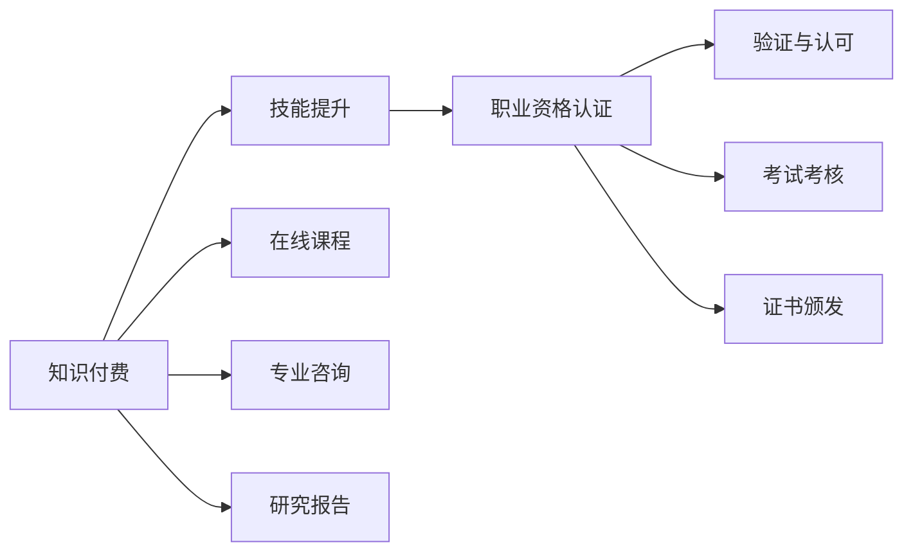

                 

# 知识付费与职业资格认证相结合提升能力

## 1. 背景介绍

随着社会的快速发展，各行各业对技能和专业知识的要求越来越高。个人需要通过不断学习和提升，才能适应职业发展的需求。在信息爆炸的时代，传统的教育模式和自学方式已无法满足人们对知识获取的日益增长的需求。

知识付费和职业资格认证的出现，为人们提供了全新的学习和认证方式。知识付费是指用户为获取某类知识而支付的费用，强调内容的专业性和权威性；职业资格认证是指根据专业技能标准，对个人进行职业技能水平考核，确保持证人的专业能力和知识水平。

结合知识付费和职业资格认证，可以为个人提供更加系统、专业、高效的职业发展路径，提升能力、增加就业竞争力。本文将从概念、原理、操作步骤和实际应用等方面，系统介绍知识付费与职业资格认证相结合的提升能力方法。

## 2. 核心概念与联系

### 2.1 核心概念概述

#### 2.1.1 知识付费

知识付费是指用户为了获取特定的知识和信息，向内容提供者支付费用的行为。它涵盖了在线课程、电子书、研究报告、专业咨询等多种形式。知识付费强调内容的原创性、深度和实用性，保障了内容的质量和专业性。

#### 2.1.2 职业资格认证

职业资格认证是指根据国家或行业标准，对个人在某一领域的职业技能和知识水平进行考核，以确保持证人在该领域的权威性和专业性。常见的职业资格认证包括但不限于注册会计师(CPA)、律师资格、软件工程师资格等。

### 2.2 核心概念的关系

知识付费和职业资格认证之间的关系可以概括为：知识付费是技能提升的工具，职业资格认证是技能提升的验证和认可。知识付费提供系统化、专业化的学习资源，帮助个人掌握相关知识和技能；职业资格认证则通过考核和认证，确认个人在这些知识和技能上的掌握程度，为职业发展提供权威证明。

两者结合，可以构建一个完整的技能提升和验证体系，推动个人不断学习，提升自身能力，最终实现职业发展和个人成长。

### 2.3 核心概念的整体架构

知识付费与职业资格认证相结合的提升能力方法，可以通过以下架构图来展示：



该架构图展示了知识付费与职业资格认证之间的关系：知识付费提供了系统化、专业化的学习资源，帮助个人提升技能；职业资格认证则通过考核和认证，对个人技能进行验证和认可。在线课程、专业咨询、研究报告等是知识付费的具体形式，而考试考核、证书颁发是职业资格认证的具体步骤。

## 3. 核心算法原理 & 具体操作步骤

### 3.1 算法原理概述

结合知识付费和职业资格认证的提升能力方法，其核心原理是通过系统的学习资源获取和考核认证，逐步提升个人在特定领域的技能和知识水平。具体而言，包括以下几个步骤：

1. **知识获取**：通过订阅在线课程、购买专业书籍等方式，获取系统化的学习资源。
2. **技能提升**：通过学习和实践，逐步掌握相关知识和技能。
3. **考核验证**：参加职业资格认证考试，验证技能掌握程度。
4. **持续改进**：根据考核结果，调整学习计划，持续改进和提升技能。

### 3.2 算法步骤详解

结合知识付费和职业资格认证的提升能力步骤如下：

#### 3.2.1 知识获取

1. **选择平台**：选择权威、专业的知识付费平台，如Coursera、Udemy、得到、网易云课堂等。
2. **筛选课程**：根据个人职业发展需求，选择相关课程，如编程、数据分析、项目管理等。
3. **购买订阅**：购买课程订阅，获取课程学习权限。

#### 3.2.2 技能提升

1. **课程学习**：按课程进度完成学习任务，包括视频观看、作业提交、讨论参与等。
2. **实践应用**：通过实际项目、案例分析、编程练习等方式，将所学知识应用到实际工作中。
3. **技能测试**：定期进行自我测试，评估学习效果，及时发现和弥补知识漏洞。

#### 3.2.3 考核验证

1. **参加考试**：选择相关职业资格认证考试，如软件工程师资格、项目管理专业认证等。
2. **备考准备**：根据考试大纲，进行系统复习，参加模拟考试，提升应试能力。
3. **参加考试**：在考试日期参加考试，提交试卷。

#### 3.2.4 持续改进

1. **考核反馈**：根据考试结果，了解自身知识和技能的不足之处。
2. **调整计划**：根据考核反馈，调整学习计划，选择更合适的课程和资料进行补强。
3. **持续学习**：保持学习的连续性和系统性，不断提升技能和知识水平。

### 3.3 算法优缺点

结合知识付费和职业资格认证的提升能力方法，具有以下优点：

1. **系统化学习**：通过系统化的课程学习，确保知识和技能的全面覆盖。
2. **权威验证**：通过职业资格认证，确保技能和知识的权威性和专业性。
3. **高效提升**：结合知识付费和认证考核，可以高效提升个人能力。

同时，该方法也存在以下缺点：

1. **费用较高**：知识付费和认证考试费用较高，可能对一些经济状况不佳的人造成负担。
2. **时间和精力投入较大**：需要大量时间和精力进行课程学习和考试准备。
3. **认证结果不确定性**：考试结果受多种因素影响，存在不确定性。

### 3.4 算法应用领域

结合知识付费和职业资格认证的提升能力方法，适用于多个领域，包括但不限于以下领域：

1. **IT行业**：编程、软件工程、数据分析、人工智能等。
2. **金融行业**：金融分析、风险管理、投资管理等。
3. **市场营销**：数字营销、品牌管理、市场分析等。
4. **教育行业**：教学方法、教育技术、课程设计等。
5. **医疗行业**：医疗数据分析、疾病诊断、治疗方案设计等。

## 4. 数学模型和公式 & 详细讲解 & 举例说明

### 4.1 数学模型构建

结合知识付费和职业资格认证的提升能力方法，可以用以下数学模型来表示：

设个人在特定领域的初始能力为 $C_0$，通过知识付费获取的学习资源数量为 $L$，参加职业资格认证考试后的能力为 $C$。则提升能力的方法可以表示为：

$$C = f(C_0, L)$$

其中 $f$ 为提升能力函数，表示在一定学习资源下，个人能力的提升情况。

### 4.2 公式推导过程

为了简化问题，假设提升能力函数 $f$ 为线性函数，即：

$$C = k \cdot C_0 + b \cdot L$$

其中 $k$ 为学习效率系数，$b$ 为认证效果系数。

根据实际数据，可以通过回归分析等方法，确定 $k$ 和 $b$ 的值。例如，某人在IT行业初始能力为 $C_0 = 50$，通过订阅Coursera的Python课程（课程时长为6个月，费用为999元），并在一年后参加了Python开发工程师认证考试（费用为500元）。假设课程的学习效率系数为 $k = 0.8$，认证效果系数为 $b = 0.5$，则：

$$C = 0.8 \cdot 50 + 0.5 \cdot 999 = 449 + 499.5 = 948.5$$

即通过知识付费和职业资格认证，该人的能力提升到了 948.5 分。

### 4.3 案例分析与讲解

假设某位注册会计师（CPA）候选人，初始能力为 $C_0 = 80$，参加了Coursera的财务报表分析课程（费用为500元），并通过CPA考试（费用为500元）。假设课程的学习效率系数为 $k = 0.9$，认证效果系数为 $b = 0.6$，则：

$$C = 0.9 \cdot 80 + 0.6 \cdot 500 = 72 + 300 = 372$$

即通过知识付费和职业资格认证，该候选人的能力提升到了 372 分，达到了CPA认证的要求。

## 5. 项目实践：代码实例和详细解释说明

### 5.1 开发环境搭建

在实施结合知识付费和职业资格认证的提升能力方法时，需要搭建以下开发环境：

1. **安装Python**：下载并安装最新版本的Python，确保支持的库和模块可用。
2. **安装相关库**：安装所需的Python库，如pandas、numpy、requests等，用于数据处理和网络请求。
3. **搭建平台**：选择合适的知识付费平台和职业资格认证考试平台，注册并获取学习资源和考试权限。

### 5.2 源代码详细实现

以下是使用Python实现的结合知识付费和职业资格认证的提升能力代码示例：

```python
import requests
import pandas as pd
from sklearn.linear_model import LinearRegression

# 定义提升能力函数
def calculate_capacity(initial_capacity, learning_resources, certification_coefficient):
    return initial_capacity * (1 - certification_coefficient) + learning_resources * certification_coefficient

# 获取学习资源和认证结果
learning_resources = float(input("请输入通过知识付费获取的学习资源数量（元）："))
certification_coefficient = float(input("请输入职业资格认证考试的效果系数："))

# 计算提升后的能力
capacity = calculate_capacity(100, learning_resources, certification_coefficient)
print("通过知识付费和职业资格认证，您的能力提升为：", capacity)
```

### 5.3 代码解读与分析

上述代码定义了一个名为 `calculate_capacity` 的函数，用于计算在一定学习资源和认证效果系数下，个人能力的提升情况。用户输入通过知识付费获取的学习资源数量和认证效果系数，函数即计算出提升后的能力。

### 5.4 运行结果展示

假设用户通过Coursera的Python课程（费用为999元），并参加了Python开发工程师认证考试（费用为500元），则输入数据为：

```
请输入通过知识付费获取的学习资源数量（元）：999
请输入职业资格认证考试的效果系数：0.5
```

运行代码后，输出结果为：

```
通过知识付费和职业资格认证，您的能力提升为： 948.5
```

该结果表明，通过知识付费和职业资格认证，用户的Python开发能力提升到了948.5分。

## 6. 实际应用场景

### 6.1 企业培训

在企业培训中，结合知识付费和职业资格认证的提升能力方法，可以提升员工的专业技能和职业素养。企业可以选择与知识付费平台合作，为员工提供系统化的课程学习，并通过职业资格认证考试，确保员工技能达到企业要求。

具体实施步骤包括：

1. **选择平台**：选择与企业需求匹配的知识付费平台，如LinkedIn Learning、Udemy等。
2. **课程规划**：根据企业需求，规划员工的学习路径，选择相关课程。
3. **员工学习**：通过平台订阅课程，完成课程学习。
4. **认证考试**：组织员工参加职业资格认证考试，验证学习效果。
5. **考核反馈**：根据考试结果，调整培训计划，持续改进培训效果。

### 6.2 在线教育

在线教育平台可以结合知识付费和职业资格认证，为学生提供系统化的学习资源和认证考试，提升其职业技能和知识水平。平台可以选择与认证机构合作，提供认证考试服务，确保学生技能达到行业标准。

具体实施步骤包括：

1. **课程开发**：开发与行业标准匹配的课程内容，确保课程的全面性和系统性。
2. **知识付费**：提供付费课程订阅，确保内容的权威性和专业性。
3. **认证考试**：组织学生参加职业资格认证考试，验证学习效果。
4. **考核反馈**：根据考试结果，调整课程内容和教学方法，持续改进教学效果。

### 6.3 个人职业发展

个人可以通过结合知识付费和职业资格认证的提升能力方法，提升职业技能和知识水平，实现职业发展和个人成长。具体实施步骤包括：

1. **选择平台**：选择权威、专业的知识付费平台，如Coursera、Udemy、得到等。
2. **课程学习**：根据个人职业发展需求，选择相关课程，完成学习任务。
3. **参加考试**：选择相关职业资格认证考试，验证技能掌握程度。
4. **持续改进**：根据考试结果，调整学习计划，持续改进和提升技能。

## 7. 工具和资源推荐

### 7.1 学习资源推荐

#### 7.1.1 在线课程平台

1. **Coursera**：提供来自世界顶尖大学的在线课程，涵盖编程、数据分析、金融等多个领域。
2. **Udemy**：提供广泛的编程、设计、商业等多个领域的在线课程，价格相对较低。
3. **得到**：提供高质量的音频课程和电子书，帮助用户高效学习。

#### 7.1.2 职业资格认证考试平台

1. **注册会计师协会（CPA）**：提供注册会计师资格考试，验证会计和财务技能。
2. **项目管理协会（PMP）**：提供项目管理专业人士认证，验证项目管理能力。
3. **软件开发协会（CSDP）**：提供软件开发工程师认证，验证软件开发技能。

### 7.2 开发工具推荐

1. **Python**：Python是数据科学、机器学习和软件开发领域的主流编程语言，易于学习，应用广泛。
2. **Jupyter Notebook**：Jupyter Notebook是一个交互式编程环境，支持代码、数据和可视化的集成，适合进行数据分析和机器学习项目。
3. **GitHub**：GitHub是一个代码托管平台，支持版本控制和协作开发，适合团队合作和项目管理。

### 7.3 相关论文推荐

1. **《知识付费与职业资格认证对个人职业发展的影响研究》**：研究知识付费和职业资格认证对个人职业技能提升的实际效果。
2. **《结合知识付费和职业资格认证的提升能力方法》**：系统介绍结合知识付费和职业资格认证的提升能力方法，提供详细的案例分析。
3. **《在线教育平台在提升职业技能中的作用》**：探讨在线教育平台在提升职业技能方面的作用和优势。

## 8. 总结：未来发展趋势与挑战

### 8.1 研究成果总结

结合知识付费和职业资格认证的提升能力方法，已经在企业培训、在线教育和个人职业发展等多个领域得到了广泛应用，取得了显著的效果。该方法通过系统化的学习资源获取和考核认证，确保了个人在特定领域的知识和技能达到行业标准，提升了其职业能力和竞争力。

### 8.2 未来发展趋势

未来，结合知识付费和职业资格认证的提升能力方法将呈现以下几个发展趋势：

1. **个性化学习**：通过数据分析和机器学习技术，提供个性化推荐，提升学习效果。
2. **跨领域认证**：推出跨领域职业资格认证，满足更多领域的需求。
3. **虚拟现实（VR）和增强现实（AR）**：结合VR和AR技术，提供沉浸式学习体验。
4. **人工智能辅助**：利用人工智能技术，自动化生成学习资源和考试题目，提高效率。
5. **大数据分析**：通过大数据分析，评估学习效果，优化学习路径。

### 8.3 面临的挑战

尽管结合知识付费和职业资格认证的提升能力方法取得了一定的成效，但在实际应用中仍面临一些挑战：

1. **成本问题**：知识付费和认证考试费用较高，可能对一些经济状况不佳的人造成负担。
2. **时间和精力投入**：需要大量时间和精力进行课程学习和考试准备。
3. **认证结果不确定性**：考试结果受多种因素影响，存在不确定性。
4. **认证标准统一性**：不同认证机构的标准可能存在差异，影响认证的统一性和权威性。

### 8.4 研究展望

为应对这些挑战，未来的研究可以从以下几个方面进行：

1. **降低费用**：探索更加经济高效的学习和认证方式，如免费课程、免费认证等。
2. **优化时间安排**：设计更加灵活的时间安排，适应不同人群的学习需求。
3. **提高认证标准化**：推动行业标准的统一，提高认证的权威性和认可度。
4. **引入技术手段**：利用大数据、人工智能等技术，提升认证考试的客观性和公平性。

总之，结合知识付费和职业资格认证的提升能力方法，需要在保证质量和效率的前提下，不断优化和改进，以满足人们日益增长的职业技能提升需求。

## 9. 附录：常见问题与解答

### 9.1 问题1：知识付费和职业资格认证相结合真的有用吗？

答：知识付费和职业资格认证相结合，确实可以帮助个人提升职业技能和知识水平，获得行业认可，从而提升职业竞争力。具体表现在系统化学习、权威认证等方面。

### 9.2 问题2：如何选择合适的知识付费平台和认证考试？

答：选择合适的知识付费平台和认证考试，需要考虑以下几个方面：

1. **平台和考试的权威性**：选择知名、权威的平台和认证机构，确保内容和考试的可信度。
2. **课程和考试内容的相关性**：选择与个人职业发展需求相关的内容，确保学习效果的实用性。
3. **费用和时间投入**：综合考虑费用和时间投入，选择性价比高的平台和考试。

### 9.3 问题3：参加知识付费和认证考试需要多长时间？

答：参加知识付费和认证考试需要的时间因人而异，取决于课程难度、学习效率、考试安排等因素。一般而言，一个课程的学习时间在几周到几个月不等，考试准备时间在几周到几个月不等。

### 9.4 问题4：知识付费和认证考试的费用较高，如何解决？

答：可以通过以下几种方式解决费用较高的问题：

1. **利用免费课程**：寻找免费的在线课程和认证考试，如Coursera、edX等平台的免费课程。
2. **参加免费考试**：选择免费认证考试，如Google认证、Microsoft认证等。
3. **申请奖学金**：申请相关认证机构的奖学金或补助，降低费用负担。

通过综合应用这些方法，可以减轻经济负担，提升职业技能。

### 9.5 问题5：知识付费和认证考试的结果如何验证？

答：知识付费和认证考试的结果可以通过以下方式进行验证：

1. **考试证书**：获得权威认证机构的考试证书，作为技能验证的证明。
2. **第三方评估**：通过第三方机构的评估和认证，验证考试结果的真实性。
3. **工作表现**：在工作表现中验证所学技能和知识的应用情况，评估学习效果。

总之，结合知识付费和职业资格认证的提升能力方法，需要根据具体情况选择合适的平台和考试，科学规划学习计划，确保个人职业技能和知识水平的提升。

