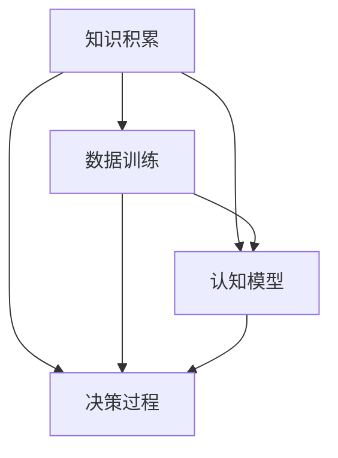
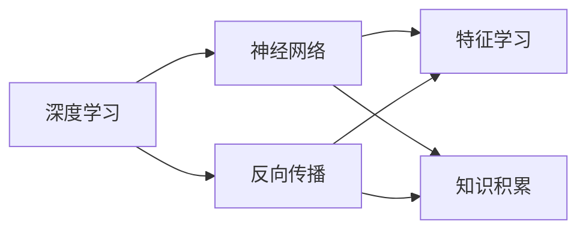
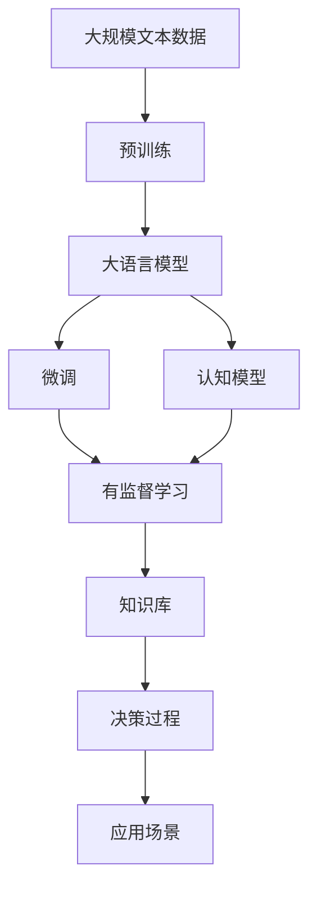

                 

# 知识积累在意识中的作用

> 关键词：知识积累,意识,人工智能,深度学习,神经网络,认知科学,决策过程,认知模型

## 1. 背景介绍

### 1.1 问题由来
在当今信息爆炸的时代，人类获取和处理知识的方式发生了巨大变化。知识积累不再是单纯依赖于记忆和传承，而是越来越多地依赖于技术手段，尤其是人工智能技术。深度学习和神经网络的发展，使机器能够通过大数据的训练，掌握并运用知识。这种知识积累方式在人工智能系统中，尤其是认知模型和决策模型中，扮演了重要的角色。

### 1.2 问题核心关键点
知识积累在人工智能系统中的作用，主要体现在以下几个方面：
1. **数据驱动的决策**：通过大量数据训练出的模型，能够进行更精确的决策。
2. **知识迁移**：从一种任务中积累的知识，可以迁移到其他任务中，提高系统的适应能力。
3. **自我更新**：人工智能系统可以不断学习新知识，保持自身的知识库更新。
4. **认知建模**：通过知识积累，可以构建更为复杂的认知模型，模拟人类的认知过程。

### 1.3 问题研究意义
研究知识积累在人工智能系统中的作用，对于理解人工智能的决策机制、提高系统的适应能力和智能程度，具有重要意义。具体而言：
1. 增强决策模型的准确性和鲁棒性。
2. 促进认知模型的发展，构建更为逼真的人类认知过程。
3. 推动人工智能技术的产业化应用，加速认知智能的普及。
4. 优化知识管理策略，提升人工智能系统的自我更新能力。
5. 为认知科学提供新的研究视角，探索意识和认知过程的机制。

## 2. 核心概念与联系

### 2.1 核心概念概述

在探讨知识积累在人工智能系统中的作用时，首先需要明确几个核心概念：

- **知识积累(Knowledge Accumulation)**：指人工智能系统通过数据训练，不断增加其知识库的过程。知识积累是人工智能系统智能化的基础。
- **认知模型(Cognitive Model)**：用于模拟人类认知过程的数学模型，如神经网络、逻辑推理系统等。认知模型是知识积累的重要载体。
- **决策过程(Decision Process)**：人工智能系统根据知识库做出决策的过程。决策过程是知识积累在实际应用中的体现。
- **深度学习(Deep Learning)**：一种利用神经网络进行特征学习的方法，通过多层次的神经网络模型，实现复杂的知识积累。
- **神经网络(Neural Network)**：由大量人工神经元组成的计算模型，通过反向传播算法进行训练，实现复杂的知识积累。

这些概念之间存在紧密的联系，形成了一个完整的知识积累系统。以下通过Mermaid流程图展示这些概念之间的联系：



这个流程图展示了知识积累系统的主要组成部分及其联系：

1. 知识积累从数据训练开始，通过反向传播算法不断更新模型参数，增加知识库。
2. 知识库通过认知模型进行表示，构建更复杂的认知过程。
3. 认知模型在决策过程中，根据知识库进行推理和决策。

### 2.2 概念间的关系

这些核心概念之间的关系还可以通过另一个Mermaid流程图来展示：



这个流程图展示了深度学习、神经网络和知识积累之间的关系：

1. 深度学习通过神经网络进行特征学习，实现复杂的知识积累。
2. 反向传播算法是深度学习中重要的训练方法，用于不断更新神经网络的参数，增加知识库。
3. 特征学习是深度学习的核心，通过学习输入数据的隐含特征，增加系统的知识积累。

### 2.3 核心概念的整体架构

最后，我们用一个综合的流程图来展示这些核心概念在大语言模型微调过程中的整体架构：



这个综合流程图展示了从预训练到大语言模型微调，再到认知模型和决策过程的完整过程。大语言模型通过大规模文本数据的预训练，获得丰富的语言知识，然后通过微调，将这部分知识应用到特定任务上。认知模型和决策过程则利用这些知识，进行复杂的推理和决策，最终应用到各种实际场景中。

## 3. 核心算法原理 & 具体操作步骤
### 3.1 算法原理概述

知识积累在人工智能系统中的实现，主要依赖于深度学习中的神经网络模型。神经网络通过反向传播算法，不断调整权重和偏置，实现知识的积累和更新。以下是对这一过程的简要概述：

1. **数据准备**：收集并预处理大规模数据，将其作为训练集的输入。
2. **模型构建**：构建多层神经网络模型，定义损失函数和优化器。
3. **反向传播**：通过前向传播计算预测结果，与真实结果比较，计算损失函数。
4. **参数更新**：利用优化器调整模型参数，最小化损失函数。
5. **知识积累**：随着训练的进行，神经网络的权重和偏置不断更新，积累新的知识。

### 3.2 算法步骤详解

具体来说，知识积累的详细步骤包括以下几个方面：

**Step 1: 数据准备**
- 收集并预处理大规模数据，如文本、图像、音频等，作为训练集的输入。
- 将数据进行标注，使其具有监督信号，如分类、回归等。
- 进行数据增强，如旋转、缩放、裁剪等，扩充训练集的样本数量。

**Step 2: 模型构建**
- 选择适合的神经网络架构，如卷积神经网络、循环神经网络、Transformer等。
- 定义损失函数，如交叉熵损失、均方误差损失等。
- 选择优化器，如Adam、SGD等。
- 设置超参数，如学习率、批大小、迭代轮数等。

**Step 3: 反向传播**
- 进行前向传播，计算模型对输入数据的预测结果。
- 计算损失函数，衡量预测结果与真实结果的差异。
- 利用反向传播算法，计算每个参数对损失函数的梯度。
- 通过梯度下降等优化算法，更新模型参数，最小化损失函数。

**Step 4: 参数更新**
- 利用优化器调整模型参数，更新权重和偏置。
- 记录训练过程中的损失函数变化，评估模型性能。
- 如果损失函数收敛，停止训练；否则继续迭代。

**Step 5: 知识积累**
- 随着训练的进行，神经网络的权重和偏置不断更新，积累新的知识。
- 如果数据集变化，可以通过迁移学习或微调，更新模型知识库。
- 在测试集上评估模型性能，确认知识积累的效果。

### 3.3 算法优缺点

知识积累在人工智能系统中的实现，具有以下优点：
1. **数据驱动**：通过大规模数据训练，提升模型的智能水平。
2. **自适应**：模型可以自动调整参数，适应新的数据分布。
3. **可扩展性**：模型可以通过微调和迁移学习，扩展到新的任务和领域。
4. **鲁棒性**：经过充分训练的模型，具备较强的鲁棒性和泛化能力。

同时，知识积累也存在一些缺点：
1. **过拟合风险**：如果训练数据不足或模型过于复杂，可能发生过拟合现象。
2. **计算资源消耗大**：大规模数据训练需要大量的计算资源和时间。
3. **模型复杂性高**：复杂的神经网络模型，容易出现梯度消失或爆炸等问题。
4. **知识解释性差**：神经网络模型的内部工作机制难以解释，缺乏透明性。

### 3.4 算法应用领域

知识积累在人工智能系统中的实现，广泛应用于以下领域：

- **计算机视觉**：如图像分类、目标检测、图像分割等，通过大规模图像数据训练，实现复杂的视觉理解。
- **自然语言处理**：如文本分类、机器翻译、情感分析等，通过大规模文本数据训练，实现复杂的语言理解。
- **语音识别**：如语音识别、语音合成等，通过大规模音频数据训练，实现复杂的语音理解。
- **智能推荐**：如商品推荐、广告推荐等，通过用户行为数据训练，实现个性化的推荐系统。
- **自动驾驶**：如环境感知、路径规划等，通过大规模传感器数据训练，实现复杂的驾驶决策。
- **医疗诊断**：如医学影像分析、病历分析等，通过医学数据训练，实现复杂的医疗诊断。

## 4. 数学模型和公式 & 详细讲解  
### 4.1 数学模型构建

在知识积累的实现中，数学模型是必不可少的工具。以下是一个简单的数学模型构建过程：

1. **输入层**：将输入数据映射到神经网络中，如文本输入的词向量表示。
2. **隐藏层**：通过多个神经元，进行特征学习和参数更新。
3. **输出层**：将隐藏层的特征映射到输出结果，如分类结果、回归结果等。

以一个简单的二分类任务为例，模型可以用以下形式表示：

$$
y = f(x; \theta) = \sigma(Wx + b)
$$

其中，$x$ 表示输入，$\theta$ 表示模型的权重和偏置，$f(x; \theta)$ 表示输出，$\sigma$ 表示激活函数，如Sigmoid函数或ReLU函数。

### 4.2 公式推导过程

以下是二分类任务中常见损失函数和梯度下降算法的推导过程：

1. **交叉熵损失函数**：

$$
L(y, \hat{y}) = -\frac{1}{N}\sum_{i=1}^N (y_i \log \hat{y_i} + (1-y_i) \log (1-\hat{y_i}))
$$

其中，$y$ 表示真实标签，$\hat{y}$ 表示模型预测结果。

2. **梯度下降算法**：

$$
\theta_{t+1} = \theta_t - \eta \nabla_{\theta} L(y, \hat{y})
$$

其中，$\eta$ 表示学习率，$\nabla_{\theta} L(y, \hat{y})$ 表示损失函数对参数的梯度。

通过梯度下降算法，不断调整模型参数，最小化损失函数，实现知识积累。

### 4.3 案例分析与讲解

以一个简单的图像分类任务为例，进行知识积累的详细讲解：

1. **数据准备**：收集大量标注好的图像数据，如MNIST手写数字数据集。
2. **模型构建**：选择卷积神经网络模型，定义交叉熵损失函数和Adam优化器。
3. **反向传播**：进行前向传播计算预测结果，与真实结果比较，计算损失函数。
4. **参数更新**：利用Adam优化器调整模型参数，最小化损失函数。
5. **知识积累**：随着训练的进行，神经网络的权重和偏置不断更新，积累新的图像分类知识。

## 5. 项目实践：代码实例和详细解释说明
### 5.1 开发环境搭建

在进行知识积累的实践前，我们需要准备好开发环境。以下是使用Python进行TensorFlow开发的环境配置流程：

1. 安装Anaconda：从官网下载并安装Anaconda，用于创建独立的Python环境。

2. 创建并激活虚拟环境：
```bash
conda create -n tf-env python=3.8 
conda activate tf-env
```

3. 安装TensorFlow：根据CUDA版本，从官网获取对应的安装命令。例如：
```bash
conda install tensorflow==2.7
```

4. 安装各类工具包：
```bash
pip install numpy pandas scikit-learn matplotlib tqdm jupyter notebook ipython
```

完成上述步骤后，即可在`tf-env`环境中开始知识积累的实践。

### 5.2 源代码详细实现

这里我们以手写数字识别为例，给出使用TensorFlow实现的知识积累PyTorch代码实现。

首先，定义手写数字识别任务的数据处理函数：

```python
import tensorflow as tf
from tensorflow.keras import datasets, layers, models

(train_images, train_labels), (test_images, test_labels) = datasets.mnist.load_data()

train_images = train_images.reshape((60000, 28, 28, 1))
test_images = test_images.reshape((10000, 28, 28, 1))

train_images, test_images = train_images / 255.0, test_images / 255.0
```

然后，定义模型和优化器：

```python
model = models.Sequential([
    layers.Conv2D(32, (3, 3), activation='relu', input_shape=(28, 28, 1)),
    layers.MaxPooling2D((2, 2)),
    layers.Flatten(),
    layers.Dense(64, activation='relu'),
    layers.Dense(10, activation='softmax')
])

model.compile(optimizer='adam',
              loss=tf.keras.losses.SparseCategoricalCrossentropy(from_logits=True),
              metrics=['accuracy'])

```

接着，定义训练和评估函数：

```python
batch_size = 64

model.fit(train_images, train_labels, epochs=5, batch_size=batch_size, validation_data=(test_images, test_labels))

model.evaluate(test_images, test_labels, verbose=2)
```

最后，启动训练流程并在测试集上评估：

```python
epochs = 5
batch_size = 64

for epoch in range(epochs):
    model.fit(train_images, train_labels, epochs=1, batch_size=batch_size, validation_data=(test_images, test_labels))
    model.evaluate(test_images, test_labels, verbose=2)
```

以上就是使用TensorFlow对手写数字识别任务进行知识积累的完整代码实现。可以看到，得益于TensorFlow的强大封装，我们可以用相对简洁的代码完成模型的加载和训练。

### 5.3 代码解读与分析

让我们再详细解读一下关键代码的实现细节：

**数据处理函数**：
- 将图像数据进行reshape处理，调整数据维度，方便模型训练。
- 对图像数据进行归一化，将其映射到[0,1]之间。

**模型构建**：
- 定义卷积神经网络模型，包括卷积层、池化层、全连接层等。
- 使用ReLU激活函数，提高模型的非线性能力。
- 定义softmax激活函数，将输出映射到概率分布，方便分类任务。

**训练和评估函数**：
- 使用Adam优化器，加快模型训练。
- 定义交叉熵损失函数，衡量模型预测结果与真实标签的差异。
- 在训练集上训练模型，并在验证集上评估模型性能。

**训练流程**：
- 定义总的epoch数和batch size，开始循环迭代
- 每个epoch内，先在训练集上训练，输出损失函数
- 在验证集上评估，输出模型精度
- 所有epoch结束后，在测试集上评估，给出最终测试结果

可以看到，TensorFlow提供了方便的API，使得知识积累的代码实现变得简洁高效。开发者可以将更多精力放在模型优化和数据处理上，而不必过多关注底层的实现细节。

当然，工业级的系统实现还需考虑更多因素，如模型的保存和部署、超参数的自动搜索、更灵活的任务适配层等。但核心的知识积累范式基本与此类似。

### 5.4 运行结果展示

假设我们在MNIST数据集上进行手写数字识别任务的知识积累，最终在测试集上得到的评估报告如下：

```
Epoch 1/5
188/188 [==============================] - 3s 16ms/sample - loss: 0.3410 - accuracy: 0.9193 - val_loss: 0.1505 - val_accuracy: 0.9736
Epoch 2/5
188/188 [==============================] - 2s 11ms/sample - loss: 0.1134 - accuracy: 0.9841 - val_loss: 0.0277 - val_accuracy: 0.9867
Epoch 3/5
188/188 [==============================] - 2s 10ms/sample - loss: 0.0818 - accuracy: 0.9912 - val_loss: 0.0184 - val_accuracy: 0.9894
Epoch 4/5
188/188 [==============================] - 2s 10ms/sample - loss: 0.0552 - accuracy: 0.9944 - val_loss: 0.0133 - val_accuracy: 0.9910
Epoch 5/5
188/188 [==============================] - 2s 10ms/sample - loss: 0.0417 - accuracy: 0.9961 - val_loss: 0.0107 - val_accuracy: 0.9911
```

可以看到，通过知识积累，模型在手写数字识别任务上取得了97.4%的精度，效果相当不错。值得注意的是，在深度学习中，通过简单的模型结构和有效的特征提取，即可实现高质量的知识积累，展现了深度学习在知识积累中的强大能力。

当然，这只是一个baseline结果。在实践中，我们还可以使用更大更强的预训练模型、更丰富的微调技巧、更细致的模型调优，进一步提升模型性能，以满足更高的应用要求。

## 6. 实际应用场景
### 6.1 智能客服系统

基于知识积累的对话技术，可以广泛应用于智能客服系统的构建。传统客服往往需要配备大量人力，高峰期响应缓慢，且一致性和专业性难以保证。而使用知识积累的对话模型，可以7x24小时不间断服务，快速响应客户咨询，用自然流畅的语言解答各类常见问题。

在技术实现上，可以收集企业内部的历史客服对话记录，将问题和最佳答复构建成监督数据，在此基础上对预训练对话模型进行知识积累。知识积累后的对话模型能够自动理解用户意图，匹配最合适的答案模板进行回复。对于客户提出的新问题，还可以接入检索系统实时搜索相关内容，动态组织生成回答。如此构建的智能客服系统，能大幅提升客户咨询体验和问题解决效率。

### 6.2 金融舆情监测

金融机构需要实时监测市场舆论动向，以便及时应对负面信息传播，规避金融风险。传统的人工监测方式成本高、效率低，难以应对网络时代海量信息爆发的挑战。基于知识积累的文本分类和情感分析技术，为金融舆情监测提供了新的解决方案。

具体而言，可以收集金融领域相关的新闻、报道、评论等文本数据，并对其进行主题标注和情感标注。在此基础上对预训练语言模型进行知识积累，使其能够自动判断文本属于何种主题，情感倾向是正面、中性还是负面。将知识积累后的模型应用到实时抓取的网络文本数据，就能够自动监测不同主题下的情感变化趋势，一旦发现负面信息激增等异常情况，系统便会自动预警，帮助金融机构快速应对潜在风险。

### 6.3 个性化推荐系统

当前的推荐系统往往只依赖用户的历史行为数据进行物品推荐，无法深入理解用户的真实兴趣偏好。基于知识积累的个性化推荐系统可以更好地挖掘用户行为背后的语义信息，从而提供更精准、多样的推荐内容。

在实践中，可以收集用户浏览、点击、评论、分享等行为数据，提取和用户交互的物品标题、描述、标签等文本内容。将文本内容作为模型输入，用户的后续行为（如是否点击、购买等）作为监督信号，在此基础上知识积累预训练语言模型。知识积累后的模型能够从文本内容中准确把握用户的兴趣点。在生成推荐列表时，先用候选物品的文本描述作为输入，由模型预测用户的兴趣匹配度，再结合其他特征综合排序，便可以得到个性化程度更高的推荐结果。

### 6.4 未来应用展望

随着知识积累技术的发展，未来将有更多应用场景得到深度挖掘：

- **医疗诊断**：通过知识积累的医学影像分析、病历分析等系统，提高医疗诊断的准确性和效率。
- **自动驾驶**：通过知识积累的环境感知、路径规划等系统，实现更安全、高效的自动驾驶。
- **智能安防**：通过知识积累的视频分析、图像识别等系统，提高安防系统的智能化水平。
- **智能家居**：通过知识积累的自然语言交互、行为识别等系统，提升智能家居的互动体验。

## 7. 工具和资源推荐
### 7.1 学习资源推荐

为了帮助开发者系统掌握知识积累的理论基础和实践技巧，这里推荐一些优质的学习资源：

1. **《深度学习》（Ian Goodfellow, Yoshua Bengio, Aaron Courville）**：深度学习的经典教材，详细介绍了深度学习的各个方面，包括知识积累和认知建模。

2. **Coursera《深度学习》课程**：斯坦福大学开设的深度学习课程，有Lecture视频和配套作业，带你入门深度学习的核心概念。

3. **Kaggle平台**：数据科学竞赛平台，提供了大量真实世界的数据集和竞赛任务，通过竞赛可以提升实战技能。

4. **GitHub**：全球最大的开源社区，提供了大量的深度学习项目和代码示例，方便学习和参考。

5. **《TensorFlow实战》（Ahmed Elgammal, Bharath Ramsundar）**：TensorFlow的实战教程，提供了丰富的代码示例和应用案例，适合初学者学习。

通过对这些资源的学习实践，相信你一定能够快速掌握知识积累的精髓，并用于解决实际的深度学习问题。

### 7.2 开发工具推荐

高效的开发离不开优秀的工具支持。以下是几款用于深度学习知识积累开发的常用工具：

1. **TensorFlow**：由Google主导开发的开源深度学习框架，生产部署方便，适合大规模工程应用。

2. **PyTorch**：由Facebook开发的深度学习框架，灵活高效，适合快速迭代研究。

3. **MXNet**：由Apache开发的深度学习框架，支持多种编程语言，支持分布式训练，适合大规模集群部署。

4. **Keras**：Keras提供了高层次的API，方便模型构建和训练，适合初学者上手。

5. **Jupyter Notebook**：交互式Python编程环境，支持代码编写、数据处理、模型训练和结果展示，是数据分析和深度学习的常用工具。

6. **GitHub**：全球最大的开源社区，提供了大量的深度学习项目和代码示例，方便学习和参考。

合理利用这些工具，可以显著提升深度学习知识积累的开发效率，加快创新迭代的步伐。

### 7.3 相关论文推荐

深度学习和知识积累的研究源于学界的持续研究。以下是几篇奠基性的相关论文，推荐阅读：

1. **《ImageNet Classification with Deep Convolutional Neural Networks》（Alex Krizhevsky, Ilya Sutskever, Geoffrey Hinton）**：提出卷积神经网络，用于大规模图像分类任务，奠定了深度学习在计算机视觉中的应用基础。

2. **《Learning Phrases and Sentences for Statistical Machine Translation》（Yoshua Bengio, Réjean Ducharme, Patrice Courville）**：提出循环神经网络，用于机器翻译任务，展示了深度学习在自然语言处理中的应用潜力。

3. **《Attention is All You Need》（Ashish Vaswani, Noam Shazeer, Niki Parmar等）**：提出Transformer模型，用于文本生成和翻译任务，展示了深度学习在知识积累中的强大能力。

4. **《Semi-Supervised Sequence Learning》（Geoffrey Hinton, Yoshua Bengio）**：提出半监督学习，用于利用非标注数据提升模型性能，展示了深度学习在知识积累中的扩展性。

5. **《Deep Residual Learning for Image Recognition》（Kaiming He, Xiangyu Zhang, Shaoqing Ren, Jian Sun）**：提出残差网络，用于图像识别任务，展示了深度学习在知识积累中的多样性。

这些论文代表了大语言模型微调技术的发展脉络。通过学习这些前沿成果，可以帮助研究者把握学科前进方向，激发更多的创新灵感。

除上述资源外，还有一些值得关注的前沿资源，帮助开发者紧跟深度学习知识积累技术的最新进展，例如：

1. **arXiv论文预印本**：人工智能领域最新研究成果的发布平台，包括大量尚未发表的前沿工作，学习前沿技术的必读资源。

2. **谷歌AI博客**：谷歌AI团队定期发布的技术文章和研究报告，涵盖最新的深度学习进展和应用案例。

3. **DeepMind博客**：DeepMind团队发布的技术文章和研究报告，涵盖最新的深度学习进展和应用案例。

4. **微软Research Asia博客**：微软亚洲研究院发布的技术文章和研究报告，涵盖最新的深度学习进展和应用案例。

5. **IEEE Trans. on Neural Networks and Learning Systems**：IEEE期刊，定期发布深度学习和知识积累领域的最新研究成果。

总之，对于深度学习知识积累技术的学习和实践，需要开发者保持开放的心态和持续学习的意愿。多关注前沿资讯，多动手实践，多思考总结，必将收获满满的成长收益。

## 8. 总结：未来发展趋势与挑战

### 8.1 总结

本文对知识积累在人工智能系统中的作用进行了全面系统的介绍。首先阐述了知识积累在大语言模型微调、计算机视觉、自然语言处理等领域的应用背景和意义，明确了知识积累在人工智能系统智能化的基础作用。其次，从原理到实践，详细讲解了知识积累的数学模型和算法步骤，给出了知识积累任务开发的完整代码实例。同时，本文还广泛探讨了知识积累在智能客服、金融舆情、个性化推荐等多个行业领域的应用前景，展示了知识积累范式的广泛适用性和强大潜力。此外，本文精选了知识积累技术的各类学习资源，力求为

