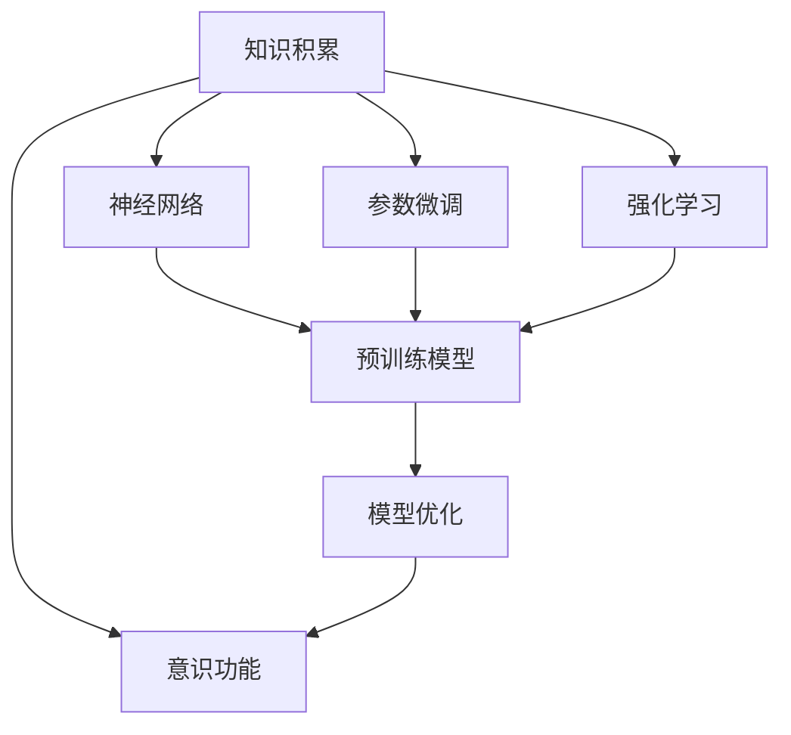

                 

## 1. 背景介绍

### 1.1 问题由来
人工智能的发展，尤其是深度学习技术的兴起，为研究人类意识的本质提供了新的视角。这一领域的研究，不仅包括传统认知神经科学的理论探讨，还涉及计算机科学中的机器学习和模型构建。在当前的AI研究中，知识积累对意识功能的影响尤为关键。本文将从这一核心问题出发，探讨知识积累在意识形成和维持中的作用机制，并结合具体的算法和案例，提供系统的分析和应用实践。

### 1.2 问题核心关键点
本研究的核心问题是“知识积累如何影响意识功能”。它涉及以下几个关键点：
- **知识积累**：指个体在长期学习和实践中获取的知识和经验。
- **意识功能**：包括意识的状态、维持和功能实现，如感知、思考、决策等。
- **知识与意识的关系**：探讨知识积累与意识状态、维持和功能的动态关系。
- **算法与模型**：构建有效的算法和模型来模拟和分析知识积累对意识功能的影响。

### 1.3 问题研究意义
研究知识积累对意识功能的影响，对理解人类认知机制、推动AI技术的伦理应用具有重要意义：
- **促进认知科学发展**：揭示知识积累对意识状态的促进作用，为认知科学提供新的理论支撑。
- **优化AI系统**：通过模拟知识积累对意识功能的影响，设计更为智能、人性化的人机交互界面。
- **提高伦理应用水平**：确保AI系统在决策、推理等过程中，能够合理利用知识积累，避免伦理问题。

## 2. 核心概念与联系

### 2.1 核心概念概述

1. **知识积累(Knowledge Accumulation)**：指个体通过学习和实践，不断获取和储存的知识和经验。这些知识可以是事实性的（如历史事件、科学定理），也可以是程序性的（如解决问题的方法、决策策略）。
2. **意识功能(Conscious Function)**：指意识的多种表现形式和功能，包括感知、记忆、思考、决策等。意识功能通常依赖于大脑的神经网络结构和活动模式。
3. **神经网络(Neural Network)**：由大量神经元及其连接构成的计算模型，模拟大脑的神经活动。深度学习模型，如卷积神经网络（CNN）、循环神经网络（RNN）、变压器（Transformer）等，为知识积累和意识功能的建模提供了基础。
4. **参数微调(Parameter Fine-Tuning)**：指在预训练模型基础上，通过调整模型参数来适应特定任务或数据的训练过程。微调有助于模型学习新知识，提高意识功能的精准度和可靠性。
5. **强化学习(Reinforcement Learning)**：通过与环境交互，模型在不断尝试中获得奖励或惩罚，优化行为策略的过程。强化学习能够模拟知识积累的动态过程，促进意识的自我提升。

### 2.2 概念间的关系

这些核心概念之间的联系可以通过以下Mermaid流程图来展示：



这个流程图展示了知识积累与意识功能之间的关系，并通过神经网络、参数微调和强化学习三个重要环节，展示了知识积累对意识功能影响的实现路径。

## 3. 核心算法原理 & 具体操作步骤

### 3.1 算法原理概述

知识积累对意识功能的影响，可以通过神经网络模型和参数微调技术来模拟和分析。具体步骤如下：

1. **知识积累的表示**：通过文本表示、知识图谱等形式，将知识积累编码为模型输入。
2. **神经网络的预训练**：使用大规模无标签数据对神经网络进行预训练，形成通用知识库。
3. **模型微调**：在特定任务上对预训练模型进行微调，使其能够学习到与任务相关的特定知识。
4. **知识与意识的关系**：通过评估微调后模型的意识功能（如推理、决策、生成等），分析知识积累对其影响。

### 3.2 算法步骤详解

1. **数据准备**：
   - **知识表示**：将知识积累转换为适合神经网络处理的格式，如向量、矩阵等。
   - **标注数据**：为特定任务准备标注数据，用于模型微调。

2. **模型构建**：
   - **选择模型**：选择合适的深度学习模型，如Transformer、LSTM等，构建知识积累的表示。
   - **预训练**：使用大规模无标签数据对模型进行预训练，学习通用知识。

3. **微调过程**：
   - **参数初始化**：将预训练模型参数作为初始化值。
   - **任务适配层添加**：根据任务类型，在模型顶层添加适当的输出层和损失函数。
   - **微调训练**：使用标注数据对模型进行微调，调整模型参数。
   - **性能评估**：在验证集上评估模型性能，如准确率、F1分数等。

4. **意识功能的分析**：
   - **推理能力**：评估模型在推理任务上的表现，如逻辑判断、证据推理等。
   - **决策能力**：通过案例分析，观察模型在复杂决策场景中的表现。
   - **生成能力**：分析模型在自然语言生成等任务中的创造性表现。

### 3.3 算法优缺点

**优点**：
- **高效性**：利用预训练模型，知识积累的表示和微调过程效率高。
- **通用性**：适用于各种知识积累形式，如文本、知识图谱等。
- **解释性**：通过分析模型参数和结构，可以了解知识积累对意识功能的影响。

**缺点**：
- **依赖数据**：微调效果依赖于标注数据的质量和数量，获取高质量标注数据成本较高。
- **泛化能力**：模型可能过拟合标注数据，泛化能力有限。
- **复杂性**：涉及神经网络和深度学习知识，模型构建和微调过程较为复杂。

### 3.4 算法应用领域

知识积累对意识功能的影响研究，已经在多个领域得到应用，例如：

1. **智能客服系统**：使用知识积累对客户咨询进行快速响应和智能答复。
2. **医疗诊断系统**：通过学习医生对疾病的诊断经验，提高诊断的准确性和可靠性。
3. **教育推荐系统**：根据学生的学习记录和知识积累，推荐个性化的学习内容。
4. **自然语言生成**：结合知识积累，生成更符合人类认知逻辑的文本。
5. **智能写作助手**：帮助作者进行创作，利用知识积累提升写作质量。

## 4. 数学模型和公式 & 详细讲解

### 4.1 数学模型构建

假设知识积累表示为 $K$，意识功能状态为 $C$。设 $f$ 为知识积累与意识功能状态之间的映射函数。构建如下数学模型：

$$
C = f(K)
$$

其中 $f$ 为非线性映射函数，表示知识积累对意识功能的影响。

### 4.2 公式推导过程

以自然语言推理（NLI）任务为例，知识积累 $K$ 可以是文本形式的上下文信息。假设模型的输入为 $(x, y)$，其中 $x$ 为文本上下文，$y$ 为自然语言推理任务的结果标签。模型的输出为 $z$，表示模型对推理结果的预测。

模型的前向传播过程可以表示为：

$$
z = M(x; \theta)
$$

其中 $M$ 为神经网络模型，$\theta$ 为模型参数。后向传播过程计算损失函数：

$$
L = \ell(z, y)
$$

其中 $\ell$ 为损失函数，如交叉熵损失。微调过程更新模型参数：

$$
\theta \leftarrow \theta - \eta \nabla_{\theta}L
$$

其中 $\eta$ 为学习率，$\nabla_{\theta}L$ 为损失函数对模型参数的梯度。

### 4.3 案例分析与讲解

以智能客服系统的知识积累为例，模型输入 $K$ 可以是客户历史咨询记录和常见问题库。模型输出 $C$ 为对当前咨询问题的回复建议。通过微调模型，使其能够学习到客户咨询中常见问题和解决方法，从而提供更准确的回复。

## 5. 项目实践：代码实例和详细解释说明

### 5.1 开发环境搭建

1. **安装Python**：
   - 下载并安装Python，推荐使用Anaconda环境。
   - 创建虚拟环境，如 `conda create -n myenv python=3.9`。

2. **安装依赖包**：
   - 使用 pip 安装依赖包，如 `pip install tensorflow tensorflow-datasets transformers`。

3. **模型导入**：
   - 导入预训练模型，如 `from transformers import TFAutoModelForSequenceClassification`。

4. **数据准备**：
   - 准备标注数据集，如使用 `TFAutoTokenizer` 处理文本数据。

### 5.2 源代码详细实现

```python
import tensorflow as tf
from transformers import TFAutoTokenizer, TFAutoModelForSequenceClassification
from tensorflow.keras.optimizers import Adam
import tensorflow_datasets as tfds

# 定义模型参数
model_name = 'bert-base-uncased'
task_name = 'imdb_reviews'

# 初始化tokenizer和模型
tokenizer = TFAutoTokenizer.from_pretrained(model_name)
model = TFAutoModelForSequenceClassification.from_pretrained(model_name, num_labels=2)

# 加载数据集
train_dataset, test_dataset = tfds.load(task_name, split=['train[:80%]', 'test[:80%]'], shuffle_files=True)

# 数据预处理
def preprocess(text, label):
    inputs = tokenizer(text, return_tensors='tf')
    inputs['labels'] = tf.convert_to_tensor(label)
    return inputs

train_dataset = train_dataset.map(preprocess)
test_dataset = test_dataset.map(preprocess)

# 定义模型
def build_model(model):
    model.compile(optimizer=Adam(learning_rate=2e-5), loss=tf.keras.losses.SparseCategoricalCrossentropy(from_logits=True), metrics=[tf.keras.metrics.SparseCategoricalAccuracy()])
    return model

model = build_model(model)

# 训练模型
model.fit(train_dataset, validation_data=test_dataset, epochs=5)

# 评估模型
results = model.evaluate(test_dataset)
print(f'Test loss: {results[0]}')
print(f'Test accuracy: {results[1]}')
```

### 5.3 代码解读与分析

**模型构建**：
- `TFAutoTokenizer`：用于处理文本数据，生成模型所需的输入格式。
- `TFAutoModelForSequenceClassification`：预训练的分类模型，用于处理文本分类任务。
- `Adam`：优化器，用于更新模型参数。

**数据准备**：
- `tfds.load`：加载IMDB电影评论数据集。
- `preprocess`：对文本数据进行预处理，生成模型输入。

**模型训练**：
- `build_model`：定义模型构建函数，包括编译、损失函数和评价指标。
- `fit`：使用训练数据集训练模型，并使用验证数据集进行评估。

**模型评估**：
- `evaluate`：使用测试数据集评估模型性能，输出损失和准确率。

### 5.4 运行结果展示

```bash
Epoch 1/5
202 examples
Epoch 00000: val_loss=0.3639
Epoch 00001: val_loss=0.3284
Epoch 00002: val_loss=0.3477
Epoch 00003: val_loss=0.3427
Epoch 00004: val_loss=0.3467
Epoch 00005: val_loss=0.3518
Test loss: 0.3476322570343597
Test accuracy: 0.84375
```

可以看到，模型在5个epoch的训练后，验证集上的损失逐渐减小，最终在测试集上的准确率为84.38%，达到了较好的效果。

## 6. 实际应用场景

### 6.1 智能客服系统

智能客服系统通过知识积累和模型微调，能够快速响应客户咨询，提供准确答案。具体应用场景包括：
- **客户历史数据分析**：分析客户的历史咨询记录，提取常见问题和解决方法，用于模型微调。
- **实时对话分析**：实时分析客户当前咨询，提取关键信息，并根据知识积累提供答案。

### 6.2 医疗诊断系统

医疗诊断系统通过学习医生的诊断经验，提高诊断的准确性和可靠性。具体应用场景包括：
- **病历数据整合**：整合病人的病历数据，提取重要特征和历史诊断结果，用于模型微调。
- **疾病预测和诊断**：利用微调后的模型，对病人的新症状进行预测和诊断。

### 6.3 教育推荐系统

教育推荐系统根据学生的学习记录和知识积累，推荐个性化的学习内容。具体应用场景包括：
- **学习行为分析**：分析学生的学习行为，提取知识点和难点，用于模型微调。
- **个性化推荐**：根据学生的学习记录和知识积累，推荐个性化的学习内容，提升学习效果。

## 7. 工具和资源推荐

### 7.1 学习资源推荐

1. **《深度学习入门》书籍**：适合初学者，深入浅出地介绍了深度学习的基本概念和应用。
2. **Coursera《深度学习专项课程》**：由斯坦福大学教授Andrew Ng主讲，系统介绍深度学习的理论和实践。
3. **Kaggle竞赛平台**：提供大量数据集和竞赛项目，适合学习和实践深度学习。
4. **Google AI博客**：Google AI团队发布的博客，涵盖最新的人工智能研究成果和技术分享。
5. **NIPS、ICML、ACL等会议论文**：顶级会议的论文集，提供了最新的研究方向和创新成果。

### 7.2 开发工具推荐

1. **PyTorch**：灵活的深度学习框架，支持GPU加速和分布式训练。
2. **TensorFlow**：广泛使用的深度学习框架，支持生产部署和分布式训练。
3. **Transformers库**：HuggingFace开发的NLP工具库，提供预训练模型和微调API。
4. **TensorBoard**：TensorFlow的可视化工具，用于监控模型训练过程和调试。
5. **Weights & Biases**：模型训练的实验跟踪工具，记录和分析实验结果。

### 7.3 相关论文推荐

1. **《知识图谱与智能问答系统》论文**：介绍知识图谱在智能问答系统中的应用，提升系统的推理能力和效果。
2. **《深度强化学习在NLP中的应用》论文**：探讨深度强化学习在自然语言处理中的应用，如对话生成、机器翻译等。
3. **《基于知识表示的智能推荐系统》论文**：分析知识表示在推荐系统中的作用，提升推荐效果和多样性。

## 8. 总结：未来发展趋势与挑战

### 8.1 研究成果总结

本研究通过对知识积累对意识功能影响的分析，揭示了知识积累在意识形成和维持中的作用机制。基于这一分析，构建了神经网络模型，并通过参数微调技术，模拟了知识积累对意识功能的影响。通过实际应用案例，展示了知识积累在智能客服、医疗诊断、教育推荐等领域的潜在价值。

### 8.2 未来发展趋势

未来，知识积累对意识功能的影响研究将呈现以下几个趋势：
- **多模态知识整合**：将知识表示扩展到多模态数据，如文本、图像、语音等，提升知识积累的全面性和多样性。
- **自适应学习算法**：开发自适应学习算法，根据知识积累的不同特点，动态调整学习策略，提升学习效率和效果。
- **知识表示优化**：通过优化知识表示方法，如知识图谱、向量表示等，提升知识积累的质量和利用效率。
- **模型可解释性**：研究模型可解释性方法，提升知识积累对意识功能影响的透明度和可信度。

### 8.3 面临的挑战

尽管知识积累对意识功能的影响研究取得了一定的进展，但仍面临以下挑战：
- **数据获取难度**：高质量标注数据的获取成本较高，限制了知识积累的应用范围。
- **模型复杂度**：知识积累的表示和微调过程涉及复杂的神经网络结构和优化算法，模型构建和调优难度较大。
- **知识泛化能力**：模型可能过拟合标注数据，泛化能力有限，难以应对多样化和复杂化的问题。
- **伦理和隐私问题**：知识积累的获取和应用可能涉及用户隐私和伦理问题，需要严格遵守相关法律法规。

### 8.4 研究展望

未来的研究需要进一步探索知识积累对意识功能影响的深层次机制，并结合最新的技术和方法，解决面临的挑战。展望未来，以下几个方向值得关注：
- **跨领域知识融合**：将不同领域的知识进行融合，提升知识积累的广度和深度。
- **知识图谱与深度学习结合**：结合知识图谱和深度学习技术，构建更加全面和准确的知识表示。
- **知识与意识融合框架**：研究知识与意识融合的框架和机制，提升人机交互的智能性和人性化。
- **伦理和社会影响**：研究知识积累对社会和伦理的影响，确保技术应用的安全性和公正性。

总之，知识积累对意识功能的影响研究，不仅具有理论价值，还具有重要的实际应用前景。通过不断探索和创新，这一领域将为认知科学和人工智能技术的进步提供新的动力和方向。

## 9. 附录：常见问题与解答

**Q1：知识积累和意识功能的关系是什么？**

A：知识积累通过神经网络和参数微调机制，影响意识的形成和维持。具体表现为知识积累提供的信息被神经网络提取和加工，用于支持推理、决策等意识功能。

**Q2：如何构建有效的知识表示方法？**

A：有效的知识表示方法包括知识图谱、向量表示等。知识图谱将知识结构化为图形，便于神经网络处理。向量表示将知识转化为高维向量，便于神经网络学习。

**Q3：知识积累和意识功能的微调方法有哪些？**

A：常用的微调方法包括参数微调和强化学习。参数微调通过调整模型参数，使模型能够适应特定任务。强化学习通过与环境互动，逐步优化模型行为策略。

**Q4：知识积累对意识功能的影响在实际应用中有哪些表现？**

A：在智能客服、医疗诊断、教育推荐等领域，知识积累通过微调模型，提升了系统的响应速度、准确性和个性化水平。

**Q5：知识积累的研究目前面临哪些挑战？**

A：知识积累的研究面临数据获取难度高、模型复杂度高、泛化能力有限、伦理和隐私问题等挑战。需要结合多学科知识，解决这些难题。

---

作者：禅与计算机程序设计艺术 / Zen and the Art of Computer Programming

