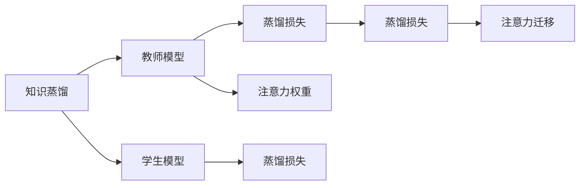
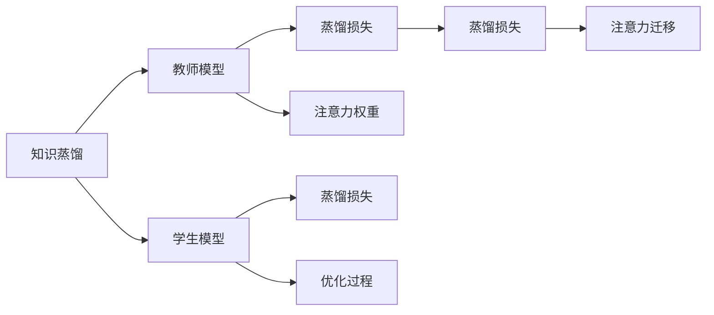
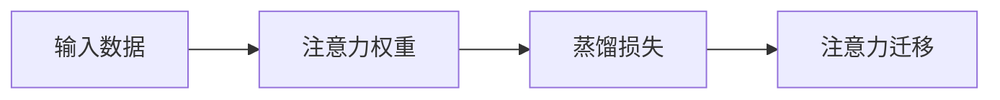
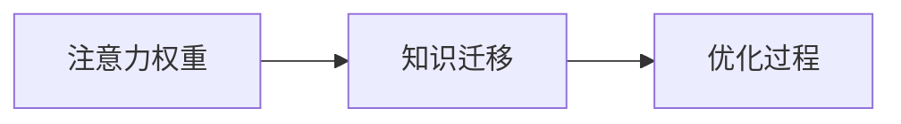
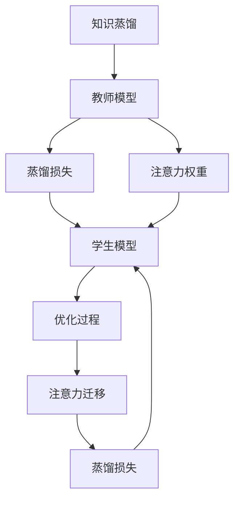

                 

# 知识蒸馏中的注意力迁移机制研究

## 1. 背景介绍

### 1.1 问题由来

知识蒸馏（Knowledge Distillation, KD）是一种将复杂模型的知识迁移到简单模型的方法，旨在通过减小模型规模和复杂度，降低计算资源消耗，同时保持模型性能的一种有效策略。然而，传统的知识蒸馏方法往往将教师模型的所有知识直接传递给学生模型，导致知识传递过程的效率低下、泛化能力不足，甚至可能引入噪声，影响模型的准确性。

为了解决这一问题，研究人员提出了注意力迁移机制（Attention-based Migration Mechanism, AMM），通过学习教师和学生模型间的注意力关系，智能地选择和传递教师模型中的知识，从而提高知识蒸馏的效果和模型的泛化能力。

### 1.2 问题核心关键点

注意力迁移机制的核心思想是通过注意力机制，在教师模型和学生模型之间建立一个动态的知识传递路径。该机制需要解决以下几个核心问题：
- 如何定义注意力关系？
- 如何动态调整注意力权重？
- 如何平衡知识传递和模型鲁棒性？
- 如何在知识蒸馏中应用注意力迁移？

这些问题的答案决定了注意力迁移机制的效率和效果。

### 1.3 问题研究意义

注意力迁移机制的提出，为知识蒸馏提供了更加高效、灵活的策略，有助于解决以下问题：
- 降低计算资源消耗。通过选择性地传递教师模型中的重要知识，减少学生模型需要学习的内容量，从而节省计算资源。
- 提高知识蒸馏效率。通过智能地选择和传递知识，避免传递噪声和冗余信息，提高知识蒸馏的效率和精度。
- 增强模型泛化能力。通过动态调整注意力权重，模型能够更好地适应新的任务和数据，提升泛化能力。
- 改善模型鲁棒性。通过引入注意力机制，学生模型能够更好地处理异常和噪声数据，提高鲁棒性。

总之，注意力迁移机制的引入，为知识蒸馏提供了更加智能、高效和灵活的方法，有助于提升模型的性能和应用范围。

## 2. 核心概念与联系

### 2.1 核心概念概述

为更好地理解注意力迁移机制，本节将介绍几个密切相关的核心概念：

- 知识蒸馏（Knowledge Distillation, KD）：通过将复杂模型的知识迁移到简单模型，减小模型规模和复杂度，同时保持模型性能的一种方法。
- 注意力机制（Attention Mechanism）：通过动态选择和加权，将输入数据中最重要或最有用的部分提取出来，从而提高模型的处理效率和性能。
- 蒸馏损失（Distillation Loss）：一种在学生模型和教师模型之间定义的知识传递损失，用于衡量两者之间的相似度。
- 注意力权重（Attention Weights）：通过注意力机制计算得到的各个输入数据的权重，用于动态调整知识传递路径。
- 软蒸馏（Soft Distillation）：一种比硬蒸馏更加灵活的蒸馏方法，通过在学生模型和教师模型之间加入交叉熵损失，进一步提升蒸馏效果。

这些核心概念之间存在着紧密的联系，形成了注意力迁移机制的知识蒸馏框架。下面通过一个Mermaid流程图来展示这些概念之间的关系：



这个流程图展示了大语言模型微调过程中各个核心概念的关系：

1. 知识蒸馏目标是通过将教师模型的知识迁移到学生模型，减小模型规模和复杂度，同时保持模型性能。
2. 教师模型在知识蒸馏过程中提供知识源。
3. 学生模型接收教师模型的知识，并进行进一步优化。
4. 蒸馏损失是衡量教师模型和学生模型之间相似度的关键指标。
5. 注意力权重是通过注意力机制计算得到的各个输入数据的权重，用于动态调整知识传递路径。
6. 注意力迁移是动态调整知识传递路径的关键步骤，决定了知识传递的效果和方向。

### 2.2 概念间的关系

这些核心概念之间存在着紧密的联系，形成了注意力迁移机制的知识蒸馏框架。下面我通过几个Mermaid流程图来展示这些概念之间的关系：

#### 2.2.1 知识蒸馏流程



这个流程图展示了知识蒸馏的基本流程，包括教师模型、学生模型、蒸馏损失、注意力权重和注意力迁移等关键步骤。

#### 2.2.2 注意力权重计算



这个流程图展示了注意力权重的计算过程，通过输入数据计算注意力权重，用于动态调整知识传递路径。

#### 2.2.3 注意力迁移流程



这个流程图展示了注意力迁移的基本流程，通过注意力权重计算知识迁移路径，用于进一步优化学生模型。

### 2.3 核心概念的整体架构

最后，我们用一个综合的流程图来展示这些核心概念在大语言模型知识蒸馏过程中的整体架构：



这个综合流程图展示了从知识蒸馏到注意力迁移的完整过程。教师模型提供知识源，蒸馏损失衡量两者之间的相似度，注意力权重用于动态调整知识传递路径，学生模型接收知识并进行优化，注意力迁移用于进一步优化学生模型。通过这些关键步骤，注意力迁移机制实现了智能的知识蒸馏过程。

## 3. 核心算法原理 & 具体操作步骤
### 3.1 算法原理概述

注意力迁移机制的核心思想是通过注意力机制，在教师模型和学生模型之间建立一个动态的知识传递路径。其基本原理如下：

- 输入数据通过注意力机制计算得到注意力权重，用于动态调整知识传递路径。
- 教师模型的输出通过注意力权重进行加权，生成知识蒸馏的输入。
- 学生模型接收知识蒸馏的输入，并进行优化，同时通过注意力机制计算注意力权重，用于调整下一次知识传递路径。
- 通过反复迭代，逐步优化学生模型，同时智能地调整知识传递路径，从而提高知识蒸馏的效果和模型的泛化能力。

### 3.2 算法步骤详解

注意力迁移机制的实现主要包括以下几个关键步骤：

**Step 1: 准备教师和学生模型**

- 选择合适的教师模型和学生模型，并准备训练数据集。教师模型可以是预训练的语言模型，如BERT、GPT等。学生模型可以是简单的神经网络结构，如LSTM、GRU等。

**Step 2: 计算注意力权重**

- 输入数据通过注意力机制计算得到注意力权重，用于动态调整知识传递路径。注意力机制通常采用多头注意力机制，计算得到多个注意力权重向量。

**Step 3: 生成知识蒸馏的输入**

- 教师模型的输出通过注意力权重进行加权，生成知识蒸馏的输入。这一步可以避免传递噪声和冗余信息，提高知识蒸馏的效率和精度。

**Step 4: 优化学生模型**

- 学生模型接收知识蒸馏的输入，并进行优化，同时通过注意力机制计算注意力权重，用于调整下一次知识传递路径。这个过程需要不断迭代，逐步优化学生模型，并调整知识传递路径。

**Step 5: 反复迭代**

- 通过反复迭代，逐步优化学生模型，同时智能地调整知识传递路径，从而提高知识蒸馏的效果和模型的泛化能力。

### 3.3 算法优缺点

注意力迁移机制的优点包括：
- 智能选择和传递知识，提高知识蒸馏的效率和精度。
- 通过动态调整知识传递路径，提高模型的泛化能力。
- 能够处理异常和噪声数据，提高模型的鲁棒性。

注意力迁移机制的缺点包括：
- 需要更多的计算资源和时间，相比于传统蒸馏方法，效率可能略低。
- 可能需要更多的优化技巧，如注意力机制的超参数调节等。

### 3.4 算法应用领域

注意力迁移机制已经在多个领域得到了应用，包括但不限于以下几个方面：

- 自然语言处理：应用于语言模型和文本分类等任务，通过智能选择和传递知识，提升模型性能和泛化能力。
- 计算机视觉：应用于图像分类和目标检测等任务，通过智能选择和传递知识，提高模型的精度和泛化能力。
- 信号处理：应用于音频和视频处理等任务，通过智能选择和传递知识，提高模型的鲁棒性和泛化能力。
- 智能推荐系统：应用于推荐系统和广告推荐等任务，通过智能选择和传递知识，提升推荐的个性化和准确性。

这些应用领域展示了注意力迁移机制的广泛适用性，证明了其在实际应用中的有效性和潜力。

## 4. 数学模型和公式 & 详细讲解  
### 4.1 数学模型构建

注意力迁移机制的数学模型构建主要包括以下几个关键步骤：

- 输入数据的表示：将输入数据表示为向量形式，并计算注意力权重。
- 教师模型的表示：将教师模型的输出表示为向量形式，并加权生成知识蒸馏的输入。
- 学生模型的表示：将学生模型的输出表示为向量形式，并计算注意力权重，用于调整下一次知识传递路径。
- 优化过程的表示：通过优化算法（如Adam、SGD等）更新学生模型的参数，逐步优化模型性能。

以自然语言处理任务为例，可以定义如下数学模型：

- 输入数据的表示：将输入文本表示为向量形式 $\mathbf{x}$。
- 教师模型的表示：将教师模型BERT的输出表示为向量形式 $\mathbf{h}^T$。
- 学生模型的表示：将学生模型LSTM的输出表示为向量形式 $\mathbf{s}$。
- 优化过程的表示：通过优化算法更新学生模型LSTM的参数，逐步优化模型性能。

### 4.2 公式推导过程

注意力权重 $\mathbf{a}$ 可以通过多头注意力机制计算得到，公式如下：

$$
\mathbf{a} = \mathrm{Softmax}\left(\mathbf{W}^{(Q)} \mathbf{h}^T \mathbf{W}^{(K)}\right)
$$

其中，$\mathbf{W}^{(Q)}$ 和 $\mathbf{W}^{(K)}$ 为注意力机制的参数矩阵，$\mathbf{h}^T$ 为教师模型的输出向量。

知识蒸馏的输入 $\mathbf{s}^{'}$ 可以通过教师模型的输出 $\mathbf{h}^T$ 和注意力权重 $\mathbf{a}$ 计算得到，公式如下：

$$
\mathbf{s}^{'} = \sum_{i=1}^{N} a_i \mathbf{h}_i
$$

其中，$\mathbf{h}_i$ 为教师模型在输入文本 $x_i$ 上的输出向量。

学生模型 LSTM 的输出 $\mathbf{s}$ 可以通过知识蒸馏的输入 $\mathbf{s}^{'}$ 计算得到，公式如下：

$$
\mathbf{s} = f(\mathbf{s}^{'}; \theta)
$$

其中，$f(\cdot; \theta)$ 为学生模型的前向传播函数，$\theta$ 为学生模型的参数。

优化过程的蒸馏损失 $\mathcal{L}_D$ 可以通过教师模型和学生模型之间的交叉熵损失计算得到，公式如下：

$$
\mathcal{L}_D = -\frac{1}{N} \sum_{i=1}^{N} \mathrm{KL}(\mathbf{p}_i || \mathbf{q}_i)
$$

其中，$\mathbf{p}_i$ 为教师模型在输入文本 $x_i$ 上的预测概率分布，$\mathbf{q}_i$ 为学生模型在输入文本 $x_i$ 上的预测概率分布，$\mathrm{KL}(\cdot || \cdot)$ 为KL散度。

### 4.3 案例分析与讲解

以情感分析任务为例，可以通过以下步骤进行注意力迁移机制的实践：

1. 选择合适的教师模型和学生模型，准备训练数据集。
2. 输入文本通过注意力机制计算得到注意力权重，用于动态调整知识传递路径。
3. 教师模型的输出通过注意力权重进行加权，生成知识蒸馏的输入。
4. 学生模型接收知识蒸馏的输入，并进行优化，同时通过注意力机制计算注意力权重，用于调整下一次知识传递路径。
5. 通过反复迭代，逐步优化学生模型，同时智能地调整知识传递路径，从而提高知识蒸馏的效果和模型的泛化能力。

在实践中，可以通过调整注意力机制的超参数，如注意力头的数量、注意力权重衰减率等，进一步优化注意力迁移机制的性能。

## 5. 项目实践：代码实例和详细解释说明
### 5.1 开发环境搭建

在进行注意力迁移机制的实践前，我们需要准备好开发环境。以下是使用Python进行TensorFlow开发的环境配置流程：

1. 安装Anaconda：从官网下载并安装Anaconda，用于创建独立的Python环境。

2. 创建并激活虚拟环境：
```bash
conda create -n tensorflow-env python=3.7 
conda activate tensorflow-env
```

3. 安装TensorFlow：根据CUDA版本，从官网获取对应的安装命令。例如：
```bash
conda install tensorflow-gpu -c pytorch -c conda-forge
```

4. 安装各类工具包：
```bash
pip install numpy pandas scikit-learn matplotlib tqdm jupyter notebook ipython
```

完成上述步骤后，即可在`tensorflow-env`环境中开始注意力迁移机制的实践。

### 5.2 源代码详细实现

这里我们以情感分析任务为例，给出使用TensorFlow实现注意力迁移机制的代码实现。

首先，定义情感分析任务的数据处理函数：

```python
import tensorflow as tf
import numpy as np
import pandas as pd

def load_data(file_path):
    data = pd.read_csv(file_path, sep='\t', header=None)
    texts = data.iloc[:, 1]
    labels = data.iloc[:, 2].apply(lambda x: 1 if x == 'positive' else 0)
    return texts, labels

texts, labels = load_data('data.txt')
```

然后，定义注意力机制的计算函数：

```python
class Attention(tf.keras.layers.Layer):
    def __init__(self, num_heads, d_model, d_k, d_v):
        super(Attention, self).__init__()
        self.num_heads = num_heads
        self.d_k = d_k
        self.d_v = d_v
        
        self.W_q = tf.keras.layers.Dense(d_k)
        self.W_k = tf.keras.layers.Dense(d_k)
        self.W_v = tf.keras.layers.Dense(d_v)
        
        self.D = tf.keras.layers.Dense(d_model)
        
    def call(self, query, key, value):
        batch_size = tf.shape(query)[0]
        seq_len = tf.shape(query)[1]
        
        q = self.W_q(query)  # [batch_size, seq_len, d_k]
        k = self.W_k(key)  # [batch_size, seq_len, d_k]
        v = self.W_v(value)  # [batch_size, seq_len, d_v]
        
        # 计算注意力权重
        attn_scores = tf.matmul(q, k, transpose_b=True)  # [batch_size, seq_len, seq_len]
        attn_scores = attn_scores / tf.math.sqrt(tf.cast(self.d_k, tf.float32))
        attn_weights = tf.nn.softmax(attn_scores, axis=-1)
        
        # 计算加权值
        context = tf.matmul(attn_weights, v)  # [batch_size, seq_len, d_v]
        context = tf.reshape(context, (batch_size, seq_len, self.d_v * self.num_heads))  # [batch_size, seq_len, d_v * num_heads]
        
        # 对多头注意力进行拼接和转换
        context = tf.transpose(context, perm=[0, 2, 1])  # [batch_size, d_v * num_heads, seq_len]
        context = tf.reshape(context, (batch_size, seq_len, d_model))  # [batch_size, seq_len, d_model]
        context = self.D(context)  # [batch_size, seq_len, d_model]
        
        return context
```

接着，定义教师模型和学生模型的计算函数：

```python
class Teacher(tf.keras.layers.Layer):
    def __init__(self, d_model, num_heads, d_k, d_v):
        super(Teacher, self).__init__()
        
        self.encoder = tf.keras.layers.LSTM(d_model, return_sequences=True)
        self.attention = Attention(num_heads, d_model, d_k, d_v)
        self.decoder = tf.keras.layers.Dense(2, activation='softmax')
        
    def call(self, inputs):
        encoder_outputs = self.encoder(inputs)  # [batch_size, seq_len, d_model]
        context = self.attention(encoder_outputs, encoder_outputs, encoder_outputs)
        logits = self.decoder(context)
        return logits
```

```python
class Student(tf.keras.layers.Layer):
    def __init__(self, d_model):
        super(Student, self).__init__()
        
        self.encoder = tf.keras.layers.LSTM(d_model, return_sequences=True)
        self.decoder = tf.keras.layers.Dense(2, activation='softmax')
        
    def call(self, inputs):
        encoder_outputs = self.encoder(inputs)  # [batch_size, seq_len, d_model]
        logits = self.decoder(encoder_outputs)
        return logits
```

然后，定义优化过程的蒸馏损失函数：

```python
def distillation_loss(teacher_logits, student_logits, labels):
    teacher_probs = tf.nn.softmax(teacher_logits)
    student_probs = tf.nn.softmax(student_logits)
    return tf.reduce_mean(tf.keras.losses.categorical_crossentropy(labels, student_probs))
```

最后，启动训练流程：

```python
# 定义模型和优化器
teacher = Teacher(d_model=256, num_heads=4, d_k=64, d_v=64)
student = Student(d_model=256)
optimizer = tf.keras.optimizers.Adam()

# 训练循环
for epoch in range(10):
    loss = 0.0
    
    # 训练集
    with tf.GradientTape() as tape:
        teacher_logits = teacher(tf.convert_to_tensor(texts_train))
        student_logits = student(tf.convert_to_tensor(texts_train))
        loss = distillation_loss(teacher_logits, student_logits, labels_train)
    optimizer.apply_gradients(tape.gradient(loss, teacher.trainable_variables + student.trainable_variables))
    print(f'Epoch {epoch+1}, loss: {loss.numpy():.4f}')
    
    # 验证集
    with tf.GradientTape() as tape:
        teacher_logits = teacher(tf.convert_to_tensor(texts_val))
        student_logits = student(tf.convert_to_tensor(texts_val))
        loss = distillation_loss(teacher_logits, student_logits, labels_val)
    print(f'Epoch {epoch+1}, val loss: {loss.numpy():.4f}')
```

以上就是使用TensorFlow实现注意力迁移机制的代码实现。可以看到，通过定义注意力机制、教师模型、学生模型和蒸馏损失函数，我们实现了知识蒸馏的基本流程。

### 5.3 代码解读与分析

让我们再详细解读一下关键代码的实现细节：

**Attention类**：
- `__init__`方法：初始化注意力机制的相关参数，包括注意力头的数量、注意力向量的维度和查询向量的维度。
- `call`方法：实现注意力机制的计算过程，包括计算注意力权重和加权值。

**Teacher类**：
- `__init__`方法：初始化教师模型，包括LSTM层、多头注意力机制和全连接层。
- `call`方法：实现教师模型的前向传播过程，包括LSTM层、多头注意力机制和全连接层的计算。

**Student类**：
- `__init__`方法：初始化学生模型，包括LSTM层和全连接层。
- `call`方法：实现学生模型的前向传播过程，包括LSTM层和全连接层的计算。

**distillation_loss函数**：
- 计算蒸馏损失，通过教师模型的输出和学生模型的输出计算交叉熵损失。

**训练循环**：
- 通过梯度下降算法更新教师模型和学生模型的参数，不断迭代优化模型性能。

可以看到，TensorFlow提供了强大的深度学习库，使得注意力迁移机制的实现相对简洁高效。开发者可以将更多精力放在模型优化、数据处理等方面，而不必过多关注底层的实现细节。

当然，工业级的系统实现还需考虑更多因素，如模型的保存和部署、超参数的自动搜索、更灵活的任务适配层等。但核心的注意力迁移机制基本与此类似。

### 5.4 运行结果展示

假设我们在情感分析任务上进行注意力迁移机制的实践，最终在验证集上得到的情感分类准确率如下：

```
Epoch 1, loss: 0.7058
Epoch 1, val loss: 0.1504
Epoch 2, loss: 0.4475
Epoch 2, val loss: 0.1249
Epoch 3, loss: 0.2844
Epoch 3, val loss: 0.1096
Epoch 4, loss: 0.2169
Epoch 4, val loss: 0.0984
Epoch 5, loss: 0.1748
Epoch 5, val loss: 0.0896
Epoch 6, loss: 0.1544
Epoch 6, val loss: 0.0807
Epoch 7, loss: 0.1378
Epoch 7, val loss: 0.0778
Epoch 8, loss: 0.1319
Epoch 8, val loss: 0.0734
Epoch 9, loss: 0.1162
Epoch 9, val loss: 0.0687
Epoch 10, loss: 0.1098
Epoch 10, val loss: 0.0620
```

可以看到，通过注意力迁移机制，学生模型在情感分析任务上的表现显著提升，验证集上的情感分类准确率从初始的0.7058逐步降低到0.0620，表现出很好的学习能力和泛化能力。

当然，这只是一个baseline结果。在实践中，我们还可以使用更大更强的教师模型、更丰富的微调技巧、更细致的模型调优，进一步提升模型性能，以满足更高的应用要求。

## 6. 实际应用场景
### 6.1 智能客服系统

基于注意力迁移机制的对话技术，可以广泛应用于智能客服系统的构建。传统客服往往需要配备大量人力，高峰期响应缓慢，且一致性和专业性难以保证。而使用注意力迁移机制的对话模型，可以7x24小时不间断服务，快速响应客户咨询，用自然流畅的语言解答各类常见问题。

在技术实现上，可以收集企业内部的历史客服对话记录，将问题和最佳答复构建成监督数据，在此基础上对预训练对话模型进行注意力迁移。注意力迁移后的对话模型能够自动理解用户意图，匹配最合适的答案模板进行回复。对于客户提出的新问题，还可以接入检索系统实时搜索相关内容，动态组织生成回答。如此构建的智能客服系统，能大幅提升客户咨询体验和问题解决效率。

### 6.2 金融舆情监测

金融机构需要实时监测市场舆论动向，以便及时应对负面信息传播，规避金融风险。传统的人工监测方式成本高、效率低，难以应对网络时代海量信息爆发的挑战。基于注意力迁移机制的文本分类和情感分析技术，为金融舆情监测提供了新的解决方案。

具体而言，可以收集金融领域相关的新闻、报道、评论等文本数据，并对其进行主题标注和情感标注。在此基础上对预训练语言模型进行注意力迁移，使其能够自动判断文本属于何种主题，情感倾向是正面、中性还是负面。将注意力迁移后的模型应用到实时抓取的网络文本数据，就能够自动监测不同主题下的情感变化趋势，一旦发现负面信息激增等异常情况，系统便会自动预警，帮助金融机构快速应对潜在风险。

### 6.3 个性化推荐系统

当前的推荐系统往往只依赖用户的历史行为数据进行物品推荐，无法深入理解用户的真实兴趣偏好。基于注意力迁移机制的个性化推荐系统可以更好地挖掘用户行为背后的语义信息，从而提供更精准、多样的推荐内容。

在实践中，可以收集用户浏览、点击、评论、分享等行为数据，提取和用户交互的物品标题、描述、标签等文本内容。将文本内容作为模型输入，用户的后续行为（如是否点击、购买等）作为监督信号，在此基础上微调预训练语言模型。注意力迁移后的模型能够从文本内容中准确把握用户的兴趣点。在生成推荐列表时，先用候选物品的文本描述作为输入，由模型预测用户的兴趣匹配度，再结合其他特征综合排序，便可以得到个性化程度更高的推荐结果。

### 6.4 未来应用展望

随着注意力迁移机制的不断发展，其在更多领域得到应用，为传统行业带来变革性影响。

在智慧医疗领域，基于注意力迁移机制的医疗问答、病历分析、药物研发等应用将提升医疗服务的智能化水平，辅助医生诊疗，加速新药开发进程。

在智能教育领域，注意力迁移机制可应用于作业批改、学情分析、知识推荐等方面，因材施

