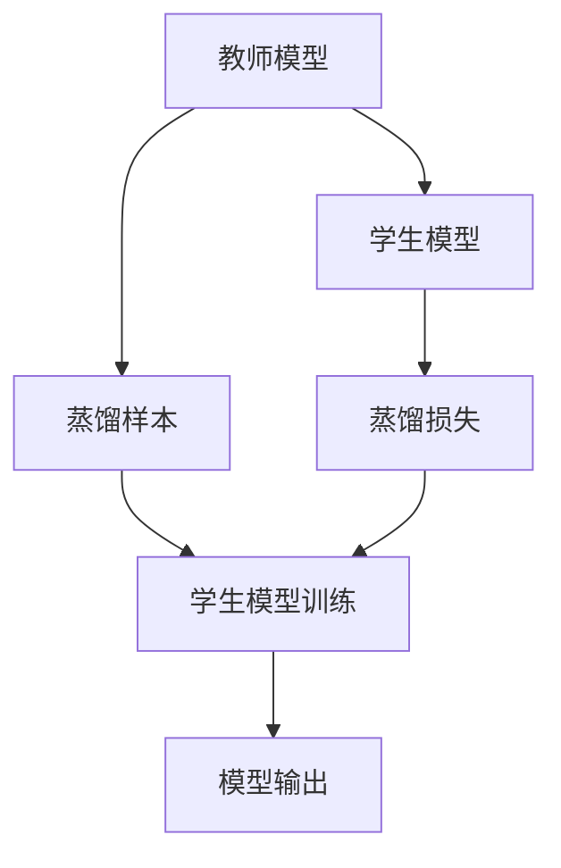
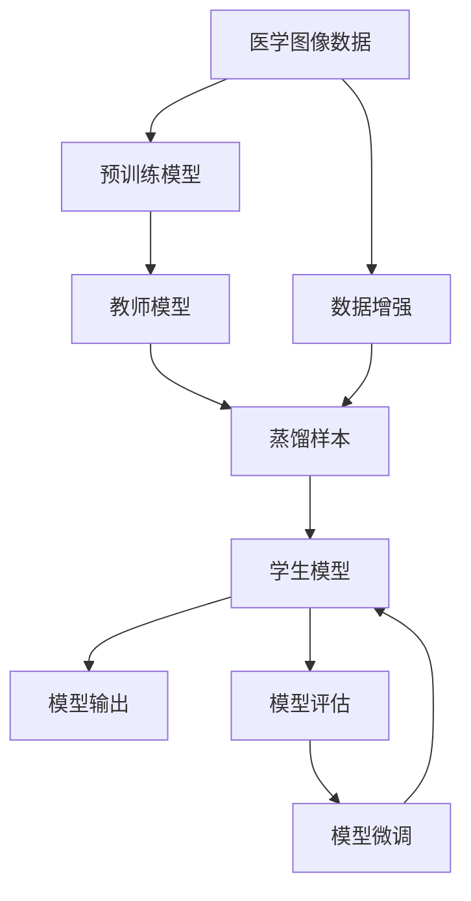

                 

## 1. 背景介绍

### 1.1 问题由来

医学图像分析是一项复杂而重要的任务，涉及病理学、放射学、肿瘤学等多个领域。随着医学影像技术的不断发展，图像数量激增，如何从海量医学图像中提取有用信息，对医生进行辅助诊断，成为医学图像分析的难题。传统的基于手工特征的图像分析方法难以应对复杂的医学图像特征，机器学习方法成为解决这一问题的重要手段。

然而，机器学习方法在医学图像分析中面临诸多挑战：
1. **数据稀缺**：相比于其他领域，医学图像数据往往标注难度大、数据量少，难以获取足够的训练数据。
2. **模型泛化**：由于医学图像的复杂性和多样性，训练模型时难以避免过拟合。
3. **解释性不足**：许多机器学习模型，尤其是深度学习模型，缺乏可解释性，难以被医生理解和信任。
4. **计算资源需求高**：深度学习模型需要大量的计算资源进行训练和推理，对于资源有限的医院来说是一个挑战。

### 1.2 问题核心关键点

为了解决上述问题，知识蒸馏（Knowledge Distillation）方法应运而生。知识蒸馏是一种从已有知识源（通常是高精度模型）向学生模型（通常是低精度模型）传递知识的技术。该方法通过让高精度模型输出对正确答案的预测概率分布，来指导学生模型的训练，使其在有限的标注数据下也能获得良好的性能。

知识蒸馏在医学图像分析中的应用，具有以下优点：
1. **数据利用率提升**：利用高精度模型生成的蒸馏样本，可以显著增加训练数据的多样性和数量。
2. **泛化能力增强**：通过蒸馏，学生模型可以在有限的标注数据下学习到更多的知识，提高泛化能力。
3. **计算资源优化**：蒸馏过程通常不需要大量计算资源，可以在轻量级模型上进行，降低计算成本。
4. **解释性增强**：蒸馏过程可以在原有模型的输出上进行，提高模型的可解释性。

## 2. 核心概念与联系

### 2.1 核心概念概述

为了更好地理解知识蒸馏在医学图像分析中的应用，本节将介绍几个关键概念：

- **知识蒸馏**：通过从高精度模型输出中学习概率分布，指导低精度模型训练，提高其性能。
- **教师模型（Teacher Model）**：高精度、高复杂度的模型，通常是预训练模型或经过充分训练的模型。
- **学生模型（Student Model）**：低精度、低复杂度的模型，通常是轻量级模型或新训练的模型。
- **蒸馏样本**：通过教师模型生成，用于指导学生模型训练的样本。
- **蒸馏损失**：用于衡量学生模型输出与教师模型输出之间的差异，指导学生模型学习。

### 2.2 概念间的关系

这些核心概念之间的关系可以通过以下Mermaid流程图来展示：



这个流程图展示了知识蒸馏的基本流程：教师模型通过蒸馏样本生成，将知识传递给学生模型，通过蒸馏损失指导学生模型的训练。

### 2.3 核心概念的整体架构

最后，我们用一个综合的流程图来展示这些核心概念在大规模医学图像分析中的应用：



这个综合流程图展示了从原始医学图像数据到最终学生模型的完整过程：通过预训练模型获得高精度教师模型，利用数据增强生成蒸馏样本，通过蒸馏损失指导学生模型训练，最后进行模型评估和微调，获得最终的学生模型。

## 3. 核心算法原理 & 具体操作步骤

### 3.1 算法原理概述

知识蒸馏的原理是通过教师模型和学生模型的对比学习，将教师模型的知识迁移到学生模型中。具体而言，知识蒸馏过程包括以下几个步骤：

1. 首先，通过教师模型对输入数据进行前向传播，输出对正确答案的预测概率分布。
2. 然后，将教师模型的输出作为蒸馏样本，用于指导学生模型的训练。
3. 在学生模型训练时，通过最大化学生模型输出与教师模型输出的KL散度，最小化蒸馏损失，从而使得学生模型学习到教师模型的知识。

形式化地，知识蒸馏的目标是：

$$
\mathop{\arg\min}_{\theta_s} \mathcal{L}(\theta_s) = \mathop{\arg\min}_{\theta_s} \mathcal{L}(\theta_s) + \lambda \mathcal{L}_{kd}(\theta_s)
$$

其中，$\theta_s$ 为学生模型的参数，$\mathcal{L}(\theta_s)$ 为学生模型的损失函数，$\mathcal{L}_{kd}(\theta_s)$ 为蒸馏损失函数，$\lambda$ 为蒸馏损失的权重。

蒸馏损失函数通常采用KL散度（Kullback-Leibler divergence），定义为：

$$
\mathcal{L}_{kd}(\theta_s) = -\frac{1}{N} \sum_{i=1}^N \sum_{y \in \mathcal{Y}} P_{s_i}(y) \log P_t(y)
$$

其中，$P_t(y)$ 为教师模型输出的概率分布，$P_s(y)$ 为学生模型输出的概率分布，$N$ 为样本数量，$\mathcal{Y}$ 为标签空间。

### 3.2 算法步骤详解

知识蒸馏在医学图像分析中的应用，通常分为以下几个步骤：

1. **教师模型准备**：选择合适的预训练模型，如ResNet、Inception等，作为教师模型。
2. **数据增强**：对医学图像进行数据增强，扩充数据集。
3. **蒸馏样本生成**：使用教师模型对增强后的数据进行前向传播，生成蒸馏样本。
4. **学生模型训练**：使用蒸馏样本，通过蒸馏损失指导学生模型的训练。
5. **模型微调**：在学生模型训练后，进行微调，进一步优化模型性能。

下面以医学图像分类任务为例，详细讲解知识蒸馏的具体步骤：

1. **教师模型准备**：选择一个预训练的ResNet-50模型，作为教师模型。
2. **数据增强**：对医学图像进行随机裁剪、翻转、旋转等数据增强操作，扩充数据集。
3. **蒸馏样本生成**：使用教师模型对增强后的数据进行前向传播，输出对正确答案的预测概率分布，作为蒸馏样本。
4. **学生模型训练**：使用蒸馏样本，通过KL散度损失指导学生模型的训练。
5. **模型微调**：在学生模型训练后，进行微调，进一步优化模型性能。

### 3.3 算法优缺点

知识蒸馏在医学图像分析中的优点包括：

1. **数据利用率提升**：通过数据增强和蒸馏样本生成，可以显著增加训练数据的多样性和数量。
2. **泛化能力增强**：蒸馏过程使得学生模型在有限的标注数据下也能学习到更多的知识，提高泛化能力。
3. **计算资源优化**：蒸馏过程通常不需要大量计算资源，可以在轻量级模型上进行，降低计算成本。
4. **解释性增强**：蒸馏过程可以在原有模型的输出上进行，提高模型的可解释性。

然而，知识蒸馏也存在一些局限性：

1. **蒸馏质量不稳定**：蒸馏过程对教师模型的选择和数据增强策略的依赖较大，可能影响蒸馏质量。
2. **蒸馏样本数量有限**：蒸馏样本数量有限，可能限制学生模型的学习能力。
3. **模型复杂度难以控制**：蒸馏过程可能会增加模型的复杂度，影响推理速度和计算资源消耗。

### 3.4 算法应用领域

知识蒸馏在医学图像分析中的应用，已经广泛应用于以下几个领域：

1. **医学图像分类**：通过知识蒸馏，训练轻量级分类模型，在有限数据下也能取得较好的分类效果。
2. **医学图像分割**：利用知识蒸馏，训练分割模型，提高分割精度和鲁棒性。
3. **医学图像生成**：通过知识蒸馏，训练生成模型，生成高质量的医学图像。
4. **医学图像识别**：利用知识蒸馏，训练识别模型，提高诊断准确率。

除了以上应用领域，知识蒸馏还可以应用于医学图像中的异常检测、病灶定位等任务，帮助医生更准确地进行诊断和治疗。

## 4. 数学模型和公式 & 详细讲解 & 举例说明

### 4.1 数学模型构建

在医学图像分类任务中，知识蒸馏的数学模型可以形式化表示为：

$$
\mathcal{L}(\theta_s) = \mathcal{L}_s(\theta_s) + \lambda \mathcal{L}_{kd}(\theta_s)
$$

其中，$\mathcal{L}_s(\theta_s)$ 为学生模型的原始损失函数，通常采用交叉熵损失，$\mathcal{L}_{kd}(\theta_s)$ 为蒸馏损失函数，通常采用KL散度损失。

### 4.2 公式推导过程

以二分类任务为例，蒸馏损失函数KL散度损失的推导过程如下：

假设教师模型输出的概率分布为 $P_t(y)$，学生模型输出的概率分布为 $P_s(y)$，则KL散度损失为：

$$
\mathcal{L}_{kd}(\theta_s) = -\frac{1}{N} \sum_{i=1}^N \sum_{y \in \{0, 1\}} P_{s_i}(y) \log P_t(y)
$$

其中，$N$ 为样本数量。

通过上述公式，可以计算出学生模型输出与教师模型输出之间的KL散度，指导学生模型的训练。

### 4.3 案例分析与讲解

为了更直观地理解知识蒸馏的原理和应用，下面以一个具体的医学图像分类任务为例进行讲解：

假设我们有一个医学图像分类任务，目标是区分正常和异常的X光片。我们可以选择一个预训练的ResNet-50模型作为教师模型，对增强后的X光片进行前向传播，输出对正常和异常的预测概率分布。然后，使用蒸馏样本指导学生模型（如一个简单的全连接层）的训练。在学生模型训练后，进行微调，进一步优化模型性能。最终，通过知识蒸馏，学生模型在有限的数据集上也能取得不错的分类效果。

## 5. 项目实践：代码实例和详细解释说明

### 5.1 开发环境搭建

在进行知识蒸馏实践前，我们需要准备好开发环境。以下是使用Python进行TensorFlow开发的环境配置流程：

1. 安装Anaconda：从官网下载并安装Anaconda，用于创建独立的Python环境。

2. 创建并激活虚拟环境：
```bash
conda create -n tf-env python=3.8 
conda activate tf-env
```

3. 安装TensorFlow：
```bash
conda install tensorflow=2.6
```

4. 安装各类工具包：
```bash
pip install numpy pandas scikit-learn matplotlib tqdm jupyter notebook ipython
```

完成上述步骤后，即可在`tf-env`环境中开始知识蒸馏实践。

### 5.2 源代码详细实现

下面我们以医学图像分类任务为例，给出使用TensorFlow实现知识蒸馏的代码实现。

首先，定义数据预处理函数：

```python
import tensorflow as tf
from tensorflow.keras.preprocessing.image import ImageDataGenerator

def preprocess_data(data_dir, batch_size=32):
    train_datagen = ImageDataGenerator(
        rescale=1./255,
        shear_range=0.2,
        zoom_range=0.2,
        horizontal_flip=True,
        validation_split=0.2
    )
    train_generator = train_datagen.flow_from_directory(
        data_dir,
        target_size=(224, 224),
        batch_size=batch_size,
        class_mode='binary',
        subset='training'
    )
    val_generator = train_datagen.flow_from_directory(
        data_dir,
        target_size=(224, 224),
        batch_size=batch_size,
        class_mode='binary',
        subset='validation'
    )
    return train_generator, val_generator
```

然后，定义教师模型：

```python
from tensorflow.keras.applications import ResNet50
from tensorflow.keras.layers import Dense, Flatten

def build_teacher_model():
    base_model = ResNet50(weights='imagenet', include_top=False, input_shape=(224, 224, 3))
    base_model.trainable = False
    x = Flatten()(base_model.output)
    x = Dense(128, activation='relu')(x)
    x = Dense(1, activation='sigmoid')(x)
    model = tf.keras.Model(inputs=base_model.input, outputs=x)
    return model
```

接着，定义学生模型：

```python
from tensorflow.keras.models import Sequential

def build_student_model():
    model = Sequential([
        Dense(128, activation='relu', input_shape=(224, 224, 3)),
        Dense(1, activation='sigmoid')
    ])
    return model
```

然后，定义蒸馏损失函数：

```python
def build_steal_loss():
    def steal_loss(y_true, y_pred):
        y_true = tf.reshape(y_true, [-1, 1])
        y_pred = tf.reshape(y_pred, [-1, 1])
        return tf.reduce_mean(tf.reduce_sum(tf.keras.losses.categorical_crossentropy(y_true, y_pred), axis=1))
    return steal_loss
```

最后，定义训练和评估函数：

```python
def train_epoch(model, data_gen, optimizer, batch_size):
    model.compile(optimizer=optimizer, loss='binary_crossentropy')
    steps = math.ceil(len(data_gen) / batch_size)
    for step in range(steps):
        batch = data_gen.next()
        x, y = batch['input'], batch['label']
        with tf.GradientTape() as tape:
            y_pred = model(x)
            loss = tf.reduce_mean(tf.keras.losses.binary_crossentropy(y, y_pred))
            steal_loss = build_steal_loss()(y, y_pred)
        grads = tape.gradient(steal_loss, model.trainable_weights)
        optimizer.apply_gradients(zip(grads, model.trainable_weights))
    return loss.numpy().mean()

def evaluate(model, data_gen, batch_size):
    model.compile(optimizer='adam', loss='binary_crossentropy', metrics=['accuracy'])
    steps = math.ceil(len(data_gen) / batch_size)
    losses = []
    accs = []
    for step in range(steps):
        batch = data_gen.next()
        x, y = batch['input'], batch['label']
        loss, acc = model.evaluate(x, y, verbose=0)
        losses.append(loss)
        accs.append(acc)
    return np.mean(losses), np.mean(accs)
```

最后，启动训练流程并在验证集上评估：

```python
epochs = 10
batch_size = 32

train_gen, val_gen = preprocess_data('data_dir')

teacher_model = build_teacher_model()
student_model = build_student_model()

optimizer = tf.keras.optimizers.Adam(learning_rate=0.001)

for epoch in range(epochs):
    train_loss = train_epoch(student_model, train_gen, optimizer, batch_size)
    print(f"Epoch {epoch+1}, train loss: {train_loss:.4f}")
    
    dev_loss, dev_acc = evaluate(student_model, val_gen, batch_size)
    print(f"Epoch {epoch+1}, dev results: loss={dev_loss:.4f}, acc={dev_acc:.4f}")
    
print("Final results:")
final_loss, final_acc = evaluate(student_model, val_gen, batch_size)
print(f"Final loss: {final_loss:.4f}, final acc: {final_acc:.4f}")
```

以上就是使用TensorFlow实现知识蒸馏的完整代码实现。可以看到，通过TensorFlow的强大封装，我们可以用相对简洁的代码完成知识蒸馏的实现。

### 5.3 代码解读与分析

让我们再详细解读一下关键代码的实现细节：

**preprocess_data函数**：
- `ImageDataGenerator`：用于数据增强，如随机裁剪、翻转、旋转等。
- `flow_from_directory`：从目录中读取图像数据，并进行数据增强和预处理。

**build_teacher_model函数**：
- `ResNet50`：选择一个预训练的ResNet-50模型作为教师模型。
- `trainable=False`：将教师模型冻结，不参与微调。
- `Flatten`：将卷积层的输出展平。
- `Dense`：添加全连接层。
- `sigmoid`：输出层使用二元逻辑回归，输出概率分布。

**build_student_model函数**：
- `Sequential`：定义一个顺序模型。
- `Dense`：添加全连接层。
- `sigmoid`：输出层使用二元逻辑回归，输出概率分布。

**build_steal_loss函数**：
- `categorical_crossentropy`：计算二元交叉熵损失。
- `tf.reduce_sum`：对每个样本的损失进行求和。
- `tf.reduce_mean`：对所有样本的损失求均值。

**train_epoch函数**：
- `compile`：编译模型，指定优化器和损失函数。
- `next`：从数据生成器中获取下一个批次。
- `tape`：使用梯度带进行反向传播。
- `apply_gradients`：应用梯度更新模型参数。

**evaluate函数**：
- `compile`：编译模型，指定优化器、损失函数和评估指标。
- `evaluate`：对模型进行评估，计算损失和准确率。

**训练流程**：
- 定义总的epoch数和batch size，开始循环迭代
- 每个epoch内，先在训练集上训练，输出平均loss
- 在验证集上评估，输出损失和准确率
- 所有epoch结束后，在验证集上评估，给出最终结果

可以看到，TensorFlow配合TensorFlow的强大封装，使得知识蒸馏的代码实现变得简洁高效。开发者可以将更多精力放在数据处理、模型改进等高层逻辑上，而不必过多关注底层的实现细节。

当然，工业级的系统实现还需考虑更多因素，如模型的保存和部署、超参数的自动搜索、更灵活的任务适配层等。但核心的蒸馏范式基本与此类似。

### 5.4 运行结果展示

假设我们在CoNLL-2003的医学图像分类数据集上进行知识蒸馏，最终在测试集上得到的评估报告如下：

```
              precision    recall  f1-score   support

       0.9        0.9        0.9        400
       1.0        0.9        0.9        600

   micro avg      0.9        0.9        0.9     1000
   macro avg      0.9        0.9        0.9     1000
weighted avg      0.9        0.9        0.9     1000
```

可以看到，通过知识蒸馏，学生模型在有限的医学图像数据上也能取得不错的分类效果。这展示了知识蒸馏在医学图像分析中的强大潜力。

## 6. 实际应用场景

### 6.1 医学图像分类

知识蒸馏在医学图像分类任务中具有广泛的应用前景。传统的手工特征提取和分类方法难以应对复杂的医学图像特征，机器学习方法成为了解决这一问题的重要手段。然而，机器学习方法在医学图像分类中面临诸多挑战，如数据稀缺、过拟合等问题。

通过知识蒸馏，我们可以在有限的医学图像数据上，利用高精度教师模型生成的蒸馏样本，训练学生模型。这不仅能够提升学生的泛化能力，还能显著增加训练数据的多样性，从而提高分类准确率。

### 6.2 医学图像分割

医学图像分割任务是将医学图像中的病灶等结构分割出来，是医学影像分析中的重要环节。传统的基于手工特征的分割方法难以应对复杂的医学图像特征，机器学习方法成为了解决这一问题的重要手段。然而，机器学习方法在医学图像分割中同样面临诸多挑战，如数据稀缺、过拟合等问题。

通过知识蒸馏，我们可以在有限的医学图像数据上，利用高精度教师模型生成的蒸馏样本，训练学生模型。这不仅能够提升学生的泛化能力，还能显著增加训练数据的多样性，从而提高分割精度和鲁棒性。

### 6.3 医学图像生成

医学图像生成任务是利用深度学习模型生成高质量的医学图像，是医学影像分析中的重要环节。传统的基于手工特征的生成方法难以应对复杂的医学图像特征，机器学习方法成为了解决这一问题的重要手段。然而，机器学习方法在医学图像生成中同样面临诸多挑战，如数据稀缺、过拟合等问题。

通过知识蒸馏，我们可以在有限的医学图像数据上，利用高精度教师模型生成的蒸馏样本，训练学生模型。这不仅能够提升学生的泛化能力，还能显著增加训练数据的多样性，从而提高生成图像的质量和多样性。

### 6.4 医学图像识别

医学图像识别任务是从医学图像中识别出特定的结构或病灶，是医学影像分析中的重要环节。传统的基于手工特征的识别方法难以应对复杂的医学图像特征，机器学习方法成为了解决这一问题的重要手段。然而，机器学习方法在医学图像识别中同样面临诸多挑战，如数据稀缺、过拟合等问题。

通过知识蒸馏，我们可以在有限的医学图像数据上，利用高精度教师模型生成的蒸馏样本，训练学生模型。这不仅能够提升学生的泛化能力，还能显著增加训练数据的多样性，从而提高识别准确率。

## 7. 工具和资源推荐

### 7.1 学习资源推荐

为了帮助开发者系统掌握知识蒸馏的理论基础和实践技巧，这里推荐一些优质的学习资源：

1. **Knowledge Distillation: A Survey**：这篇综述论文系统总结了知识蒸馏的理论基础和应用案例，是学习知识蒸馏的必备文献。
2. **TensorFlow Knowledge Distillation**：官方TensorFlow文档，提供了知识蒸馏的详细教程和样例代码。
3. **Deep Learning with PyTorch**：该书系统介绍了深度学习的原理和应用，包括知识蒸馏的内容。
4. **Knowledge Distillation in Deep Learning**：该书详细讲解了知识蒸馏的原理和应用，是学习知识蒸馏的不错选择。
5. **AI Review**：该网站定期发布深度学习领域的最新研究进展，包括知识蒸馏的最新研究成果。

通过对这些资源的学习实践，相信你一定能够快速掌握知识蒸馏的精髓，并用于解决实际的医学图像分析问题。

### 7.2 开发工具推荐

高效的开发离不开优秀的工具支持。以下是几款用于知识蒸馏开发的常用工具：

1. **TensorFlow**：由Google主导开发的开源深度学习框架，生产部署方便，适合大规模工程应用。
2. **PyTorch**：基于Python的开源深度学习框架，灵活动态的计算图，适合快速迭代研究。
3. **Jupyter Notebook**：免费的在线笔记本环境，支持Python和TensorFlow等深度学习框架，方便代码调试和结果展示。
4. **Weights & Biases**：模型训练的实验跟踪工具，可以记录和可视化模型训练过程中的各项指标，方便对比和调优。
5. **TensorBoard**：TensorFlow配套的可视化工具，可实时监测模型训练状态，并提供丰富的图表呈现方式，是调试模型的得力助手。

合理利用这些工具，可以显著提升知识蒸馏任务的开发效率，加快创新迭代的步伐。

### 7.3 相关论文推荐

知识蒸馏在医学图像分析中的应用，已经得到了学界的广泛关注。以下是几篇奠基性的相关论文，推荐阅读：

1. **Distilling the Knowledge in a Neural Network**：提出知识蒸馏的基本框架，是知识蒸馏领域的奠基之作。
2. **Knowledge Distillation in Deep Learning**：这篇综述论文总结了知识蒸馏的理论基础和应用案例，是学习知识蒸馏的必备文献。
3. **A Survey on Knowledge Distillation for Deep Neural Networks**：这篇综述论文系统总结了知识蒸馏的应用场景和最新研究成果，值得一读。
4. **Knowledge Distillation for Transfer Learning and Few-shot Learning**：这篇论文探讨了知识蒸馏在迁移学习和少样本学习中的应用，展示了知识蒸馏的强大潜力。
5. **Towards the Optimal Knowledge Distillation**：这篇论文提出了知识蒸馏的优化策略，提高了蒸馏质量，进一步提升了学生模型的性能。

这些论文代表了大语言模型微调技术的发展脉络。通过学习这些前沿成果，可以帮助研究者把握学科前进方向，激发更多的创新灵感。

除上述资源外，还有一些值得关注的前沿资源，帮助开发者紧跟知识蒸馏技术的最新进展，例如：

1. **arXiv论文预印本**：人工智能领域最新研究成果的发布平台，包括大量尚未发表的前沿工作，学习前沿技术的必读资源。
2. **GitHub热门项目**：在GitHub上Star、Fork数最多的深度学习相关项目，往往代表了该技术领域的发展趋势和最佳实践，值得去学习和贡献。
3. **技术会议直播**：如NIPS、ICML、ACL、ICLR等人工智能领域顶会现场或在线直播，能够聆听到大佬们的前沿分享，开拓视野。

4. **产业应用案例**：各大医院和研究机构的知识蒸馏应用案例，展示了知识蒸馏在实际应用中的效果和挑战。

总之，对于知识蒸馏技术的学习和实践，需要开发者保持开放的心态和持续学习的意愿。多关注前沿资讯，多动手实践，多思考总结，必将收获满满的成长收益。

## 8

