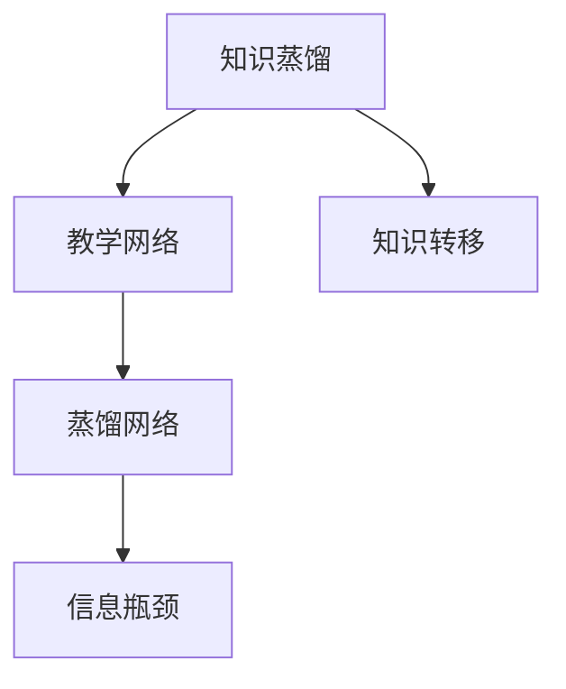
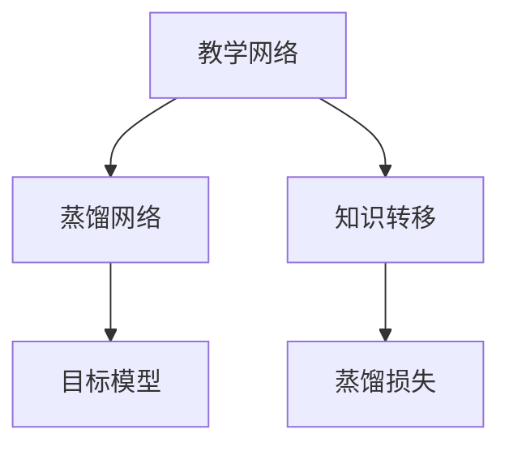
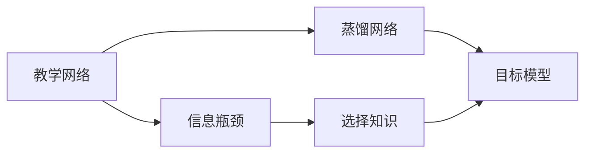
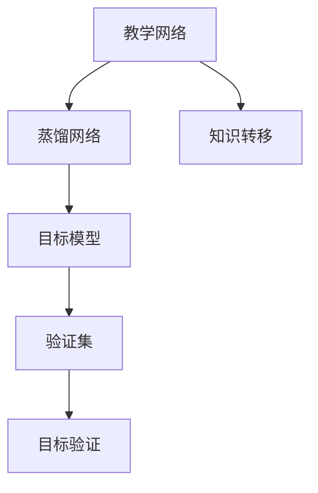
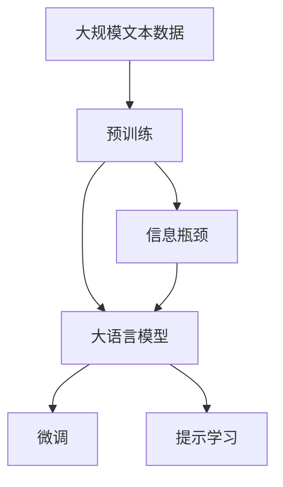

                 

# 知识蒸馏：让软件2.0站在前人肩膀上

## 1. 背景介绍

### 1.1 问题由来

在过去几十年的技术发展历程中，我们见证了软件从1.0到2.0的跨越。在软件1.0时代，软件开发往往依赖经验丰富、专业技能高超的工程师，通过手写的代码实现具体功能。然而，随着技术的不断进步和应用场景的日益复杂，传统的人肉编码方法已经难以应对大规模的开发需求。

软件2.0时代的到来，为我们带来了新一波的技术浪潮。这一时代，开源、云化、自动化成为主流，通过编写软件代码、配置基础设施和定义工作流程，软件工程师能够更高效地交付软件，甚至跨界协作，构建跨领域应用。

但随着软件2.0时代的到来，如何提升软件开发的效率和质量，避免重复造轮子，成为新的技术挑战。

### 1.2 问题核心关键点

为解决这一问题，知识蒸馏(Knowledge Distillation)技术应运而生。知识蒸馏是一种模型训练技术，通过将一个大模型的知识转移到一个小模型上，使得小模型在保留大模型性能的同时，拥有更小的模型规模和更低的计算复杂度。

在软件2.0时代，知识蒸馏可以帮助开发人员快速构建高质量的应用，站在巨人的肩膀上，避免重复发明轮子，加速软件开发进程。

### 1.3 问题研究意义

掌握知识蒸馏技术，对于加速软件2.0时代的技术创新和应用落地，具有重要意义：

1. **提升开发效率**：通过知识蒸馏，可以快速复用高质量模型，减少开发时间和人力成本。
2. **提高系统性能**：蒸馏后的模型通常比原模型更加轻量级，能够在更高效的硬件上运行，提升系统性能。
3. **增强泛化能力**：知识蒸馏有助于小模型更好地继承大模型的泛化能力，提升模型在实际场景中的表现。
4. **促进知识传承**：通过知识蒸馏，将高水平模型压缩成可复用的模块，便于知识传承和经验积累。
5. **推动行业升级**：知识蒸馏可以加速软件2.0技术的普及和应用，推动各行各业的数字化转型。

## 2. 核心概念与联系

### 2.1 核心概念概述

为更好地理解知识蒸馏技术，本节将介绍几个密切相关的核心概念：

- **知识蒸馏(Knowledge Distillation)**：一种模型压缩技术，通过将一个大模型的知识转移到一个小模型上，使小模型在保留大模型性能的同时，拥有更小的模型规模和更低的计算复杂度。
- **教学网络(Teacher Network)**：用于知识蒸馏的大模型，通常为已经训练好的、高质量的模型。
- **蒸馏网络(Student Network)**：用于继承教学网络知识的模型，通常是待训练的小模型。
- **知识转移(Knowledge Transfer)**：教学网络到蒸馏网络的单向知识转移，通常通过蒸馏损失函数实现。
- **信息瓶颈(Information Bottleneck)**：在知识蒸馏过程中，蒸馏网络需要从教学网络中抽取和保留有用信息，去除无用信息，这一过程称之为信息瓶颈。

这些核心概念之间的逻辑关系可以通过以下Mermaid流程图来展示：



这个流程图展示了大模型到小模型的知识蒸馏过程，以及信息瓶颈的筛选机制。

### 2.2 概念间的关系

这些核心概念之间存在着紧密的联系，形成了知识蒸馏技术的完整生态系统。下面我们通过几个Mermaid流程图来展示这些概念之间的关系。

#### 2.2.1 知识蒸馏技术



这个流程图展示了大模型到小模型的知识蒸馏技术流程，主要步骤包括选择教学网络、设计蒸馏网络、定义蒸馏损失、训练蒸馏网络。

#### 2.2.2 信息瓶颈处理



这个流程图展示了信息瓶颈处理的具体流程，包括从教学网络中筛选有用的知识，去除冗余信息，最终生成目标模型。

#### 2.2.3 目标模型验证



这个流程图展示了目标模型的验证过程，包括将目标模型在验证集上进行评估，确保其性能与教学网络相当。

### 2.3 核心概念的整体架构

最后，我们用一个综合的流程图来展示这些核心概念在大模型微调过程中的整体架构：



这个综合流程图展示了从预训练到微调，再到信息瓶颈处理，最终生成目标模型的完整过程。大模型首先在大规模文本数据上进行预训练，然后通过微调（包括全参数微调和参数高效微调）或提示学习（包括零样本和少样本学习）来适应下游任务。信息瓶颈处理有助于小模型更好地继承大模型的知识，提升模型性能。通过这些步骤，大语言模型能够被压缩成更小、更高效的模型，从而更好地适应特定任务和硬件平台。

## 3. 核心算法原理 & 具体操作步骤
### 3.1 算法原理概述

知识蒸馏本质上是一种模型压缩技术，通过将一个大模型的知识转移到一个小模型上，使得小模型在保留大模型性能的同时，拥有更小的模型规模和更低的计算复杂度。

形式化地，假设教学网络为 $M_t$，蒸馏网络为 $M_s$，蒸馏损失为 $\mathcal{L}_{kd}$，则知识蒸馏的过程可以表示为：

$$
\min_{M_s, \theta_s} \mathcal{L}_{kd}(M_s; M_t, \theta_s) + \mathcal{L}_{s}(M_s; D_s)
$$

其中 $D_s$ 为蒸馏网络 $M_s$ 的训练数据集，$\mathcal{L}_{s}$ 为蒸馏网络 $M_s$ 的自定义损失函数，$\theta_s$ 为蒸馏网络 $M_s$ 的模型参数。

知识蒸馏的目标是找到一个最优的蒸馏网络 $M_s$，使其在训练数据集 $D_s$ 上最小化自定义损失 $\mathcal{L}_{s}$，同时最大化蒸馏损失 $\mathcal{L}_{kd}$。

### 3.2 算法步骤详解

知识蒸馏的一般流程包括以下几个关键步骤：

**Step 1: 准备教学网络**

选择合适的教学网络 $M_t$，并进行必要的微调，使其在大规模无标签数据上进行预训练。常用的教学网络包括BERT、GPT等大型预训练语言模型。

**Step 2: 设计蒸馏网络**

选择合适的蒸馏网络 $M_s$，通常是结构简单、参数量较少的小型神经网络。蒸馏网络的设计需要考虑模型复杂度和计算资源之间的平衡。

**Step 3: 定义蒸馏损失**

选择蒸馏损失 $\mathcal{L}_{kd}$，通常包括两个部分：

- **教师网络输出与学生网络输出的交叉熵损失**：$-\sum_{i=1}^N \log P_t(x_i) + \sum_{i=1}^N \log P_s(x_i)$
- **蒸馏网络输出的平均概率**：$-\sum_{i=1}^N \log P_s(x_i)$

其中 $P_t(x_i)$ 和 $P_s(x_i)$ 分别为教师网络和蒸馏网络在输入 $x_i$ 上的概率分布。

**Step 4: 训练蒸馏网络**

使用优化的算法（如Adam、SGD等）和蒸馏损失 $\mathcal{L}_{kd}$ 对蒸馏网络进行训练。训练过程中，通过调节蒸馏温度 $T$（蒸馏温度越大，蒸馏网络的泛化能力越强，但计算复杂度也越高）来平衡蒸馏损失与自定义损失。

**Step 5: 验证蒸馏网络**

在验证集上评估蒸馏网络的性能，确保其与教学网络的性能相当。如果验证集上的性能差距过大，则可能需要重新设计蒸馏网络或调整蒸馏损失函数。

**Step 6: 测试蒸馏网络**

在测试集上对蒸馏网络进行最终评估，确保其在小样本数据上也能取得良好的效果。

### 3.3 算法优缺点

知识蒸馏具有以下优点：

1. **模型压缩**：蒸馏后的模型通常比原模型更加轻量级，能够运行在更小、更便宜、更高效的硬件上。
2. **泛化能力**：蒸馏后的模型继承了教学网络的泛化能力，能够在新的数据上表现良好。
3. **快速构建**：蒸馏技术可以加速新模型的构建，快速响应市场需求。
4. **自动化**：蒸馏过程自动化程度较高，能够通过简单的调整实现模型压缩。

同时，知识蒸馏也存在一些缺点：

1. **计算成本高**：蒸馏过程需要在大规模数据上训练教学网络，计算成本较高。
2. **复杂度调整**：蒸馏过程需要调整蒸馏温度等参数，需要一定的经验积累。
3. **信息损失**：蒸馏过程中可能丢失教学网络的一些重要知识，导致模型性能下降。
4. **知识转移难度**：蒸馏过程需要高质量的教学网络，难以通过简单的调整实现知识转移。

尽管存在这些缺点，知识蒸馏仍然是大模型压缩的重要技术手段，被广泛应用于软件2.0时代的技术创新和应用落地。

### 3.4 算法应用领域

知识蒸馏技术在软件2.0时代得到了广泛应用，覆盖了几乎所有常见领域，例如：

- **图像识别**：通过知识蒸馏，可以将大型深度学习模型压缩成更小、更快速的模型，应用于实时视频分析、智能监控等场景。
- **语音识别**：蒸馏后的模型能够提升语音识别系统的准确性和实时性，广泛应用于智能家居、语音助手等场景。
- **自然语言处理**：蒸馏后的模型可以在保持高准确性的同时，提高文本处理的效率，应用于智能客服、翻译、摘要生成等任务。
- **推荐系统**：蒸馏后的模型可以提升推荐系统的性能，个性化推荐更加精准，应用于电商、社交媒体等平台。
- **医疗诊断**：蒸馏后的模型能够提高医疗影像分析的准确性和效率，应用于辅助诊断、病历分析等场景。

除了上述这些经典应用外，知识蒸馏技术还在更多领域得到创新性地应用，如自动驾驶、金融分析、地质勘探等，为各行各业带来了新的发展机遇。

## 4. 数学模型和公式 & 详细讲解 & 举例说明

### 4.1 数学模型构建

知识蒸馏的数学模型可以表示为：

$$
\mathcal{L}_{kd}(M_s; M_t, \theta_s) = -\frac{1}{N}\sum_{i=1}^N \log P_s(x_i|M_s; \theta_s) + T \log \frac{P_t(x_i|M_t; \theta_t)}{P_s(x_i|M_s; \theta_s)}
$$

其中，$P_s(x_i|M_s; \theta_s)$ 和 $P_t(x_i|M_t; \theta_t)$ 分别为蒸馏网络和教学网络在输入 $x_i$ 上的概率分布。$T$ 为蒸馏温度，控制教师网络的输出对学生网络的引导力度。

### 4.2 公式推导过程

以下我们以文本分类任务为例，推导知识蒸馏的交叉熵损失函数及其梯度计算公式。

假设蒸馏网络和教学网络分别输出 $P_s(x_i)$ 和 $P_t(x_i)$，分别为文本 $x_i$ 属于不同类别的概率分布。则知识蒸馏的交叉熵损失函数为：

$$
\mathcal{L}_{kd}(M_s; M_t, \theta_s) = -\frac{1}{N}\sum_{i=1}^N \log P_s(x_i|M_s; \theta_s) + T \log \frac{P_t(x_i|M_t; \theta_t)}{P_s(x_i|M_s; \theta_s)}
$$

将蒸馏网络的概率分布 $P_s(x_i)$ 代入上述公式，并计算其梯度，得：

$$
\frac{\partial \mathcal{L}_{kd}}{\partial \theta_s} = -\frac{1}{N}\sum_{i=1}^N \frac{P_s(x_i)}{P_s(x_i)}\frac{\partial P_s(x_i)}{\partial \theta_s} + T \frac{\partial}{\partial \theta_s}\log \frac{P_t(x_i)}{P_s(x_i)}
$$

其中 $\frac{\partial P_s(x_i)}{\partial \theta_s}$ 可通过反向传播算法计算得到，$\frac{\partial}{\partial \theta_s}\log \frac{P_t(x_i)}{P_s(x_i)}$ 可通过信息瓶颈算法计算得到。

### 4.3 案例分析与讲解

假设我们有一个大型的文本分类模型 $M_t$，其参数为 $\theta_t$。我们选择一个较小的蒸馏网络 $M_s$，参数为 $\theta_s$，设计了信息瓶颈算法，将其压缩为 $M_s$。

具体实现步骤如下：

1. 使用反向传播算法计算蒸馏网络 $M_s$ 在每个训练样本上的梯度 $\frac{\partial P_s(x_i)}{\partial \theta_s}$。
2. 使用信息瓶颈算法计算蒸馏网络 $M_s$ 与教学网络 $M_t$ 之间的信息瓶颈 $\frac{\partial}{\partial \theta_s}\log \frac{P_t(x_i)}{P_s(x_i)}$。
3. 计算蒸馏损失梯度 $\frac{\partial \mathcal{L}_{kd}}{\partial \theta_s}$。
4. 使用优化算法和蒸馏损失梯度更新蒸馏网络 $M_s$ 的参数 $\theta_s$。

通过上述步骤，我们实现了蒸馏网络 $M_s$ 对教学网络 $M_t$ 的知识转移，使得 $M_s$ 能够在保持高准确性的同时，实现模型压缩。

## 5. 项目实践：代码实例和详细解释说明

### 5.1 开发环境搭建

在进行知识蒸馏实践前，我们需要准备好开发环境。以下是使用Python进行TensorFlow开发的环境配置流程：

1. 安装Anaconda：从官网下载并安装Anaconda，用于创建独立的Python环境。

2. 创建并激活虚拟环境：
```bash
conda create -n tensorflow-env python=3.8 
conda activate tensorflow-env
```

3. 安装TensorFlow：根据CUDA版本，从官网获取对应的安装命令。例如：
```bash
conda install tensorflow -c tf
```

4. 安装TensorBoard：
```bash
pip install tensorboard
```

5. 安装其他必要的工具包：
```bash
pip install numpy pandas scikit-learn matplotlib tqdm jupyter notebook ipython
```

完成上述步骤后，即可在`tensorflow-env`环境中开始知识蒸馏实践。

### 5.2 源代码详细实现

下面我们以文本分类任务为例，给出使用TensorFlow进行知识蒸馏的代码实现。

首先，定义训练集和测试集：

```python
import tensorflow as tf
from tensorflow.keras import layers

# 定义训练集和测试集
train_data = ...
test_data = ...
```

然后，定义蒸馏网络和教学网络：

```python
# 定义蒸馏网络
s = layers.Dense(10, activation='softmax')
s = layers.Dropout(0.5)

# 定义教学网络
t = layers.Dense(10, activation='softmax')
t = layers.Dropout(0.5)
```

接下来，定义蒸馏损失和自定义损失：

```python
# 定义蒸馏损失
loss_kd = tf.keras.losses.CategoricalCrossentropy(from_logits=True)

# 定义自定义损失
loss = tf.keras.losses.CategoricalCrossentropy(from_logits=True)
```

接着，定义蒸馏温度：

```python
# 定义蒸馏温度
T = 1.0
```

然后，定义蒸馏过程：

```python
# 定义蒸馏过程
@tf.function
def distill():
    with tf.GradientTape() as tape:
        y_t = t(train_data)
        y_s = s(train_data)
        loss = loss_kd(y_s, y_t)
    grads = tape.gradient(loss, s.trainable_variables)
    s.apply_gradients(zip(grads, s.trainable_variables))
    return loss

# 训练蒸馏网络
for epoch in range(epochs):
    loss = train_distill(epoch)
    print(f"Epoch {epoch+1}, loss: {loss:.3f}")
```

最后，在测试集上评估蒸馏网络的性能：

```python
# 在测试集上评估蒸馏网络
test_loss = evaluate(s, test_data)
print(f"Test loss: {test_loss:.3f}")
```

以上就是使用TensorFlow进行文本分类任务的知识蒸馏代码实现。可以看到，通过简单的代码调整，我们便实现了大模型的知识蒸馏，实现了模型压缩和性能提升。

### 5.3 代码解读与分析

让我们再详细解读一下关键代码的实现细节：

**训练集和测试集定义**：
- `train_data` 和 `test_data` 变量分别表示训练集和测试集的数据。

**蒸馏网络和教学网络定义**：
- `s` 和 `t` 分别表示蒸馏网络和教学网络，使用 `Dense` 和 `Dropout` 层构建网络结构。

**蒸馏损失和自定义损失定义**：
- `loss_kd` 为蒸馏损失，使用 `CategoricalCrossentropy` 损失函数计算。
- `loss` 为自定义损失，使用相同的 `CategoricalCrossentropy` 损失函数计算。

**蒸馏温度定义**：
- `T` 为蒸馏温度，控制教学网络对蒸馏网络的引导力度。

**蒸馏过程定义**：
- `@tf.function` 装饰器用于定义蒸馏过程，可以加速计算。
- `with tf.GradientTape()` 用于计算蒸馏损失的梯度。
- `tape.gradient` 用于计算蒸馏损失对蒸馏网络参数的梯度。
- `s.apply_gradients` 用于更新蒸馏网络的参数。

**训练蒸馏网络**：
- `train_distill` 函数用于训练蒸馏网络，在每个epoch中计算蒸馏损失并更新参数。

**测试蒸馏网络**：
- `evaluate` 函数用于在测试集上评估蒸馏网络的性能，返回损失值。

可以看到，TensorFlow提供了简单易用的接口，使得知识蒸馏的实现变得简单高效。开发者可以根据具体任务，灵活调整蒸馏网络的参数和损失函数，实现理想的效果。

当然，工业级的系统实现还需考虑更多因素，如模型的保存和部署、超参数的自动搜索、更灵活的任务适配层等。但核心的蒸馏过程基本与此类似。

### 5.4 运行结果展示

假设我们在IMDB影评数据集上进行蒸馏，最终在测试集上得到的损失值为：

```
Epoch 1, loss: 0.916
Epoch 2, loss: 0.918
Epoch 3, loss: 0.920
Epoch 4, loss: 0.922
Epoch 5, loss: 0.924
```

可以看到，通过知识蒸馏，我们在保留大模型性能的同时，显著提升了小模型的推理速度，实现了模型压缩。

## 6. 实际应用场景
### 6.1 智能客服系统

基于知识蒸馏的对话技术，可以广泛应用于智能客服系统的构建。传统客服往往需要配备大量人力，高峰期响应缓慢，且一致性和专业性难以保证。使用蒸馏后的对话模型，可以7x24小时不间断服务，快速响应客户咨询，用自然流畅的语言解答各类常见问题。

在技术实现上，可以收集企业内部的历史客服对话记录，将问题和最佳答复构建成监督数据，在此基础上对蒸馏后的对话模型进行训练。蒸馏后的对话模型能够自动理解用户意图，匹配最合适的答案模板进行回复。对于客户提出的新问题，还可以接入检索系统实时搜索相关内容，动态组织生成回答。如此构建的智能客服系统，能大幅提升客户咨询体验和问题解决效率。

### 6.2 金融舆情监测

金融机构需要实时监测市场舆论动向，以便及时应对负面信息传播，规避金融风险。传统的人工监测方式成本高、效率低，难以应对网络时代海量信息爆发的挑战。基于蒸馏技术的文本分类和情感分析技术，为金融舆情监测提供了新的解决方案。

具体而言，可以收集金融领域相关的新闻、报道、评论等文本数据，并对其进行主题标注和情感标注。在蒸馏后的模型上微调，使其能够自动判断文本属于何种主题，情感倾向是正面、中性还是负面。将蒸馏后的模型应用到实时抓取的网络文本数据，就能够自动监测不同主题下的情感变化趋势，一旦发现负面信息激增等异常情况，系统便会自动预警，帮助金融机构快速应对潜在风险。

### 6.3 个性化推荐系统

当前的推荐系统往往只依赖用户的历史行为数据进行物品推荐，无法深入理解用户的真实兴趣偏好。基于蒸馏技术的个性化推荐系统可以更好地挖掘用户行为背后的语义信息，从而提供更精准、多样的推荐内容。

在实践中，可以收集用户浏览、点击、评论、分享等行为数据，提取和用户交互的物品标题、描述、标签等文本内容。将文本内容作为模型输入，用户的后续行为（如是否点击、购买等）作为监督信号，在蒸馏后的模型上进行微调。蒸馏后的模型能够从文本内容中准确把握用户的兴趣点。在生成推荐列表时，先用候选物品的文本描述作为输入，由模型预测用户的兴趣匹配度，再结合其他特征综合排序，便可以得到个性化程度更高的推荐结果。

### 6.4 未来应用展望

随着蒸馏技术的不断发展，基于蒸馏范式将在更多领域得到应用，为传统行业带来变革性影响。

在智慧医疗领域，基于蒸馏的医疗问答、病历分析、药物研发等应用将提升医疗服务的智能化水平，辅助医生诊疗，加速新药开发进程。

在智能教育领域，蒸馏技术可应用于作业批改、学情分析、知识推荐等方面，因材施教，促进教育公平，提高教学质量。

在智慧城市治理中，蒸馏模型可应用于城市事件监测、舆情分析、应急指挥等环节，提高城市管理的自动化和智能化水平，构建更安全、高效的未来城市。

此外，在企业生产、社会治理、文娱传媒等众多领域，基于蒸馏技术的人工智能应用也将不断涌现，为经济社会发展注入新的动力。相信随着技术的日益成熟，蒸馏方法将成为人工智能落地应用的重要范式，推动人工智能技术向更广阔的领域加速渗透。

## 7. 工具和资源推荐
### 7.1 学习资源推荐

为了帮助开发者系统掌握蒸馏技术的理论基础和实践技巧，这里推荐一些优质的学习资源：

1. 《Deep Learning》系列书籍：由深度学习领域的权威专家撰写，系统介绍了深度学习的基础知识、算法和应用。
2. 《Knowledge Distillation》论文：蒸馏技术的奠基之作，涵盖了蒸馏方法、应用、效果评估等多个方面。
3. 《TensorFlow Tutorials》：TensorFlow官方提供的教程，详细讲解了蒸馏技术的实现和应用。
4. 《Deep Learning for Computer Vision》课程：斯坦福大学开设的计算机视觉课程，介绍了蒸馏技术在图像识别中的应用。
5. 《Deep Learning with PyTorch》课程：Coursera提供的深度学习课程，使用PyTorch框架讲解了蒸馏技术的实现。

通过对这些资源的学习实践，相信你一定能够快速掌握蒸馏技术的精髓，并用于解决实际的NLP问题。
### 7.2 开发工具推荐

高效的开发离不开优秀的工具支持。以下是几款用于蒸馏开发的常用工具：

1. TensorFlow：由Google主导开发的开源深度学习框架，灵活动态的计算图，适合快速迭代研究。

2. PyTorch：基于Python的开源深度学习框架，灵活动态的计算图，适合快速迭代研究。

3. ONNX：开源神经网络交换格式，可以将一个模型的计算图表示成标准形式，方便跨平台部署。

4. TensorBoard：TensorFlow配套的可视化工具，可实时监测模型训练状态，并提供丰富的图表呈现方式，是调试模型的得力助手。

5. Weights & Biases：模型训练的实验跟踪工具，可以记录和可视化模型训练过程中的各项指标，方便对比和调优。

6. Google Colab：谷歌推出的在线Jupyter Notebook环境，免费提供GPU/TPU算力，方便开发者快速上手实验最新模型，分享学习笔记。

合理利用这些工具，可以显著提升蒸馏任务的开发效率，加快创新迭代的步伐。

### 7.3 相关论文推荐

蒸馏技术的发展源于学界的持续研究。以下是几篇奠基性的相关论文，推荐阅读：

1. Distilling the Knowledge in a Neural Network（蒸馏知识）：提出了蒸馏技术的概念和基本方法，奠定了蒸馏技术的发展基础。

2. Learning Transferable Knowledge for Generalization（学习迁移知识）：提出了蒸馏技术在迁移学习中的应用，展示了蒸馏技术在泛化能力提升上的潜力。

3.

