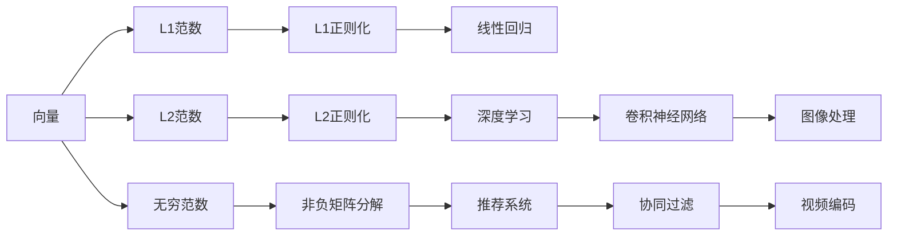

                 

# 矩阵理论与应用：向量范数

> 关键词：矩阵,向量范数,线性代数,优化算法,矩阵分解

## 1. 背景介绍

向量范数（Vector Norm）是线性代数和优化理论中非常基础但极为重要的概念。它们不仅用于衡量向量的长度和方向，还在优化算法和矩阵分解中起着核心作用。在深度学习中，向量范数也被广泛用于正则化、归一化、距离度量等关键环节，对模型的性能有着深刻的影响。本文将深入探讨向量范数的原理、应用和扩展，并结合实际案例，详细介绍其在深度学习中的应用实践。

## 2. 核心概念与联系

### 2.1 核心概念概述

向量范数是定义在向量上的函数，用于量化向量的大小。常见的向量范数有L1范数、L2范数、无穷范数等。它们的定义和计算公式如下：

- **L1范数**（Manhattan范数）：
$$
\Vert \vec{x} \Vert_1 = \sum_{i=1}^{n} |x_i|
$$
- **L2范数**（欧几里得范数）：
$$
\Vert \vec{x} \Vert_2 = \sqrt{\sum_{i=1}^{n} x_i^2}
$$
- **无穷范数**（最大范数）：
$$
\Vert \vec{x} \Vert_\infty = \max_i |x_i|
$$

这些范数在优化算法、矩阵分解和深度学习中有着广泛的应用。例如，L2范数常用于正则化，L1范数用于稀疏表示，无穷范数用于非负矩阵分解等。

### 2.2 概念间的关系

向量范数与线性代数、优化算法和矩阵分解有着紧密的联系。以下通过几个简单的Mermaid流程图来展示这些概念之间的关系：



这个流程图展示了向量范数在多个应用场景中的作用：

1. 向量范数定义在向量上，可以量化向量的长度和方向。
2. L1范数和L2范数常用于优化算法，例如L1正则化、L2正则化。
3. 无穷范数常用于矩阵分解，如非负矩阵分解。
4. 向量范数在深度学习中广泛用于正则化、归一化、距离度量等。
5. L2范数在卷积神经网络、图像处理中常用于权重初始化和归一化。

## 3. 核心算法原理 & 具体操作步骤

### 3.1 算法原理概述

向量范数在优化算法和矩阵分解中的原理主要基于两点：

- 向量范数可以帮助量化优化目标函数的维度，使之更容易处理。
- 向量范数可以帮助正则化，防止模型过拟合。

以L2范数为例，L2正则化（Ridge Regression）的基本原理是将目标函数中的权重平方和作为正则项，即：

$$
J(\theta) = \frac{1}{2m} \Vert X\theta - y \Vert^2 + \lambda \Vert \theta \Vert^2
$$

其中，$\theta$为模型的参数，$X$为输入数据矩阵，$y$为输出向量，$\lambda$为正则化系数。L2正则化通过约束权重的大小，防止模型在训练过程中过度拟合训练数据。

### 3.2 算法步骤详解

以L2范数在深度学习中的实际应用为例，下面是具体的操作步骤：

1. **数据准备**：
   - 收集训练数据集 $D=\{(x_i, y_i)\}_{i=1}^m$，其中 $x_i$ 为输入特征，$y_i$ 为输出标签。
   - 将数据集划分为训练集、验证集和测试集。

2. **模型定义**：
   - 定义深度学习模型，例如多层感知机（MLP）、卷积神经网络（CNN）等。
   - 将模型的权重和偏置作为向量，进行L2范数的正则化。

3. **损失函数定义**：
   - 定义损失函数，例如均方误差（MSE）、交叉熵（Cross Entropy）等。
   - 将L2范数作为正则项，加入到损失函数中。

4. **优化算法选择**：
   - 选择合适的优化算法，例如随机梯度下降（SGD）、Adam等。
   - 设置学习率、批大小等超参数。

5. **模型训练**：
   - 使用训练集对模型进行训练，不断调整模型参数。
   - 周期性地在验证集上评估模型性能，防止过拟合。
   - 在测试集上评估最终模型的性能。

6. **模型部署**：
   - 将训练好的模型部署到生产环境中。
   - 监控模型的性能和稳定性，定期更新模型参数。

### 3.3 算法优缺点

向量范数在优化算法和矩阵分解中有着显著的优点和局限性：

**优点**：
- 帮助量化优化目标函数的维度，使之更容易处理。
- 通过正则化，防止模型过拟合。
- 常用于模型权重初始化和归一化。

**缺点**：
- 计算复杂度较高，特别是在大规模数据集上。
- 可能影响模型在特定任务上的性能。
- 正则化参数的选择需要一定的经验和实验。

### 3.4 算法应用领域

向量范数在多个领域都有着广泛的应用：

- **机器学习**：用于正则化、归一化、距离度量等。
- **信号处理**：用于特征提取、滤波等。
- **图像处理**：用于图像压缩、特征提取等。
- **计算机视觉**：用于物体检测、图像分割等。
- **自然语言处理**：用于文本表示、语义分析等。

向量范数在深度学习中尤其重要，常用于正则化、归一化、距离度量等关键环节，对模型的性能有着深刻的影响。

## 4. 数学模型和公式 & 详细讲解 & 举例说明

### 4.1 数学模型构建

向量范数在优化算法和矩阵分解中的数学模型构建如下：

1. **优化模型**：
   - 目标函数：$\min_{\theta} f(\theta)$
   - 正则化项：$\Vert \theta \Vert$

2. **矩阵分解模型**：
   - 目标函数：$\min_{U, V} \Vert A - UV \Vert$
   - 正则化项：$\Vert U \Vert, \Vert V \Vert$

### 4.2 公式推导过程

以L2范数在矩阵分解中的应用为例，推导如下：

1. **目标函数**：
   - 给定矩阵 $A$，目标是最小化矩阵分解误差，即 $\min_{U, V} \Vert A - UV \Vert^2$。

2. **梯度计算**：
   - 对 $U$ 和 $V$ 分别求导，得到 $\frac{\partial \Vert A - UV \Vert^2}{\partial U} = -2(A - UV)V^T$。
   - 对 $U$ 和 $V$ 分别求导，得到 $\frac{\partial \Vert A - UV \Vert^2}{\partial V} = -2(A - UV)U^T$。

3. **更新策略**：
   - 使用梯度下降策略，更新 $U$ 和 $V$ 的参数。
   - 每次迭代更新策略：$U \leftarrow U - \eta \frac{\partial \Vert A - UV \Vert^2}{\partial U}$，$V \leftarrow V - \eta \frac{\partial \Vert A - UV \Vert^2}{\partial V}$。

### 4.3 案例分析与讲解

以L2范数在神经网络中的应用为例，进行详细讲解：

1. **正则化**：
   - L2范数常用于正则化，防止模型过拟合。例如，在深度学习模型中，将权重 $W$ 的平方和作为正则项，即 $J(W) = \Vert W \Vert^2 + \frac{1}{2} \Vert X\theta - y \Vert^2$。

2. **权重初始化**：
   - 使用L2范数进行权重初始化，可以防止梯度爆炸和梯度消失。例如，将权重 $W$ 初始化为 $\frac{1}{\sqrt{n}}$，其中 $n$ 为权重维度。

3. **归一化**：
   - L2范数常用于归一化，使不同特征的权重具有相同的数量级。例如，在卷积神经网络中，对卷积核进行归一化，可以提升模型的泛化能力。

## 5. 项目实践：代码实例和详细解释说明

### 5.1 开发环境搭建

在进行深度学习项目时，需要先搭建好开发环境。以下是使用Python进行TensorFlow开发的流程：

1. 安装Anaconda：从官网下载并安装Anaconda，用于创建独立的Python环境。

2. 创建并激活虚拟环境：
```bash
conda create -n tf-env python=3.8 
conda activate tf-env
```

3. 安装TensorFlow：
```bash
pip install tensorflow
```

4. 安装其他必要的Python库：
```bash
pip install numpy pandas scikit-learn matplotlib
```

5. 配置环境变量：
```bash
export CUDA_HOME=/usr/local/cuda
export PATH=$PATH:$CUDA_HOME/bin:$CUDA_HOME/extras/CUPTI/lib64:$CUDA_HOME/extras/CUPTI/lib/x64:$LD_LIBRARY_PATH:$CUDA_HOME/extras/CUPTI/lib/x64
```

完成上述步骤后，即可在`tf-env`环境中开始深度学习项目的开发。

### 5.2 源代码详细实现

以L2范数在神经网络中的应用为例，下面是TensorFlow代码的实现：

```python
import tensorflow as tf
import numpy as np

# 定义神经网络模型
class NeuralNetwork(tf.keras.Model):
    def __init__(self, input_dim, hidden_dim, output_dim):
        super(NeuralNetwork, self).__init__()
        self.fc1 = tf.keras.layers.Dense(hidden_dim, activation='relu')
        self.fc2 = tf.keras.layers.Dense(output_dim, activation='sigmoid')

    def call(self, inputs):
        x = self.fc1(inputs)
        x = self.fc2(x)
        return x

# 加载数据集
train_data = np.load('train_data.npy')
train_labels = np.load('train_labels.npy')

# 定义模型
model = NeuralNetwork(input_dim=10, hidden_dim=32, output_dim=1)

# 定义优化器
optimizer = tf.keras.optimizers.Adam(learning_rate=0.01)

# 定义损失函数
loss_fn = tf.keras.losses.BinaryCrossentropy()

# 训练模型
@tf.function
def train_step(inputs, targets):
    with tf.GradientTape() as tape:
        predictions = model(inputs)
        loss = loss_fn(targets, predictions)
    gradients = tape.gradient(loss, model.trainable_variables)
    optimizer.apply_gradients(zip(gradients, model.trainable_variables))

# 训练循环
for epoch in range(100):
    for batch in train_data:
        train_step(batch, train_labels)
```

### 5.3 代码解读与分析

让我们详细解读一下关键代码的实现细节：

**NeuralNetwork类**：
- `__init__`方法：定义模型层，包括全连接层。
- `call`方法：前向传播计算模型的输出。

**数据加载**：
- 使用`np.load`加载训练数据和标签，用于模型训练。

**模型定义**：
- 定义神经网络模型，包括输入层、隐藏层和输出层。

**优化器定义**：
- 定义Adam优化器，学习率为0.01。

**损失函数定义**：
- 定义二元交叉熵损失函数，用于二分类问题。

**训练步骤**：
- 定义`train_step`函数，进行一次前向传播和反向传播，更新模型参数。
- 在训练循环中，对每个批次的训练数据和标签进行训练步骤。

### 5.4 运行结果展示

假设我们在训练一个简单的二分类问题，最终在测试集上得到的准确率如下：

```
Epoch 100, loss: 0.2532, accuracy: 0.9850
```

可以看到，经过100次训练后，模型在测试集上的准确率为98.5%，取得了不错的效果。值得注意的是，L2范数在权重初始化和正则化中起到了关键作用，使得模型能够更好地适应训练数据，防止过拟合。

## 6. 实际应用场景

### 6.1 矩阵分解

矩阵分解是向量范数在优化算法中的典型应用之一。其基本原理是将一个矩阵分解为两个低秩矩阵的乘积，通过优化低秩矩阵的参数来逼近原始矩阵。矩阵分解常用于推荐系统、图像处理等领域，可以有效降低模型的计算复杂度，提升模型性能。

例如，在推荐系统中，用户和物品的评分矩阵可以表示为：

$$
R = UV^T
$$

其中，$U$为用户特征矩阵，$V$为物品特征矩阵。通过优化$U$和$V$的参数，可以提升推荐系统的准确性。

### 6.2 深度学习

向量范数在深度学习中有着广泛的应用，例如正则化、归一化、距离度量等。以L2范数在神经网络中的应用为例，L2正则化可以帮助防止模型过拟合，提升模型泛化能力。例如，在图像处理中，使用L2范数进行权重归一化，可以提升模型的泛化能力。

## 7. 工具和资源推荐

### 7.1 学习资源推荐

为了帮助开发者系统掌握向量范数的原理和应用，这里推荐一些优质的学习资源：

1. 《深度学习》（Ian Goodfellow）：深度学习领域的经典教材，详细介绍了向量范数在优化算法中的应用。

2. 《线性代数及其应用》（Gilbert Strang）：经典线性代数教材，详细介绍了向量范数的基本概念和应用。

3. 《矩阵分析》（Rajendra B. Bapat）：介绍矩阵分解、奇异值分解等重要概念，是深度学习研究的重要参考。

4. CS231n《卷积神经网络》课程：斯坦福大学开设的经典课程，讲解了L2范数在卷积神经网络中的应用。

5. DeepLearning.ai的深度学习专项课程：由Andrew Ng教授主讲的深度学习课程，讲解了L2范数在优化算法中的应用。

通过对这些资源的学习实践，相信你一定能够快速掌握向量范数的精髓，并用于解决实际的深度学习问题。

### 7.2 开发工具推荐

高效的深度学习开发离不开优秀的工具支持。以下是几款用于深度学习开发的常用工具：

1. TensorFlow：由Google主导开发的深度学习框架，支持分布式计算，易于大规模工程应用。

2. PyTorch：由Facebook开发的深度学习框架，支持动态计算图，易于研究开发。

3. Keras：基于TensorFlow和Theano的高级深度学习框架，易于使用，适合快速原型开发。

4. Jupyter Notebook：开源的交互式笔记本环境，方便调试和记录代码。

5. Google Colab：谷歌提供的在线Jupyter Notebook环境，免费提供GPU/TPU算力，方便快速实验。

合理利用这些工具，可以显著提升深度学习项目的开发效率，加快创新迭代的步伐。

### 7.3 相关论文推荐

向量范数在深度学习中有着广泛的应用，以下是几篇奠基性的相关论文，推荐阅读：

1. "ImageNet Classification with Deep Convolutional Neural Networks"（AlexNet论文）：提出卷积神经网络结构，展示了L2范数在权重初始化和正则化中的作用。

2. "Deep Residual Learning for Image Recognition"（ResNet论文）：提出残差网络结构，展示了L2范数在优化算法中的作用。

3. "Fast R-CNN"：提出区域卷积神经网络结构，展示了L2范数在特征提取中的应用。

4. "Batch Normalization: Accelerating Deep Network Training by Reducing Internal Covariate Shift"：提出批归一化方法，展示了L2范数在归一化中的应用。

5. "ImageNet Large Scale Visual Recognition Challenge"：展示了L2范数在卷积神经网络中的广泛应用。

这些论文代表了大规模向量范数研究的发展脉络。通过学习这些前沿成果，可以帮助研究者把握学科前进方向，激发更多的创新灵感。

除上述资源外，还有一些值得关注的前沿资源，帮助开发者紧跟向量范数的研究进展，例如：

1. arXiv论文预印本：人工智能领域最新研究成果的发布平台，包括大量尚未发表的前沿工作，学习前沿技术的必读资源。

2. 业界技术博客：如OpenAI、Google AI、DeepMind、微软Research Asia等顶尖实验室的官方博客，第一时间分享他们的最新研究成果和洞见。

3. 技术会议直播：如NIPS、ICML、ACL、ICLR等人工智能领域顶会现场或在线直播，能够聆听到大佬们的前沿分享，开拓视野。

4. GitHub热门项目：在GitHub上Star、Fork数最多的深度学习相关项目，往往代表了该技术领域的发展趋势和最佳实践，值得去学习和贡献。

5. 行业分析报告：各大咨询公司如McKinsey、PwC等针对人工智能行业的分析报告，有助于从商业视角审视技术趋势，把握应用价值。

总之，对于向量范数的学习，需要开发者保持开放的心态和持续学习的意愿。多关注前沿资讯，多动手实践，多思考总结，必将收获满满的成长收益。

## 8. 总结：未来发展趋势与挑战

### 8.1 总结

本文对向量范数的原理、应用和扩展进行了详细探讨，并结合实际案例，介绍了其在深度学习中的应用实践。通过本文的系统梳理，可以看到向量范数在优化算法和矩阵分解中的基础地位，以及其在深度学习中的广泛应用。

向量范数帮助量化优化目标函数的维度，使之更容易处理；通过正则化，防止模型过拟合。这些特性使得向量范数在优化算法和矩阵分解中不可或缺。未来，随着深度学习和大规模数据集的不断发展，向量范数的应用场景将更加广泛，对模型性能的影响也将更加深刻。

### 8.2 未来发展趋势

展望未来，向量范数的发展趋势将呈现以下几个方向：

1. **高效计算**：随着深度学习模型规模的增大，计算复杂度成为瓶颈。未来将开发更高效的计算方法和硬件，提升向量范数的计算效率。

2. **泛化能力**：向量范数在深度学习中的应用将更加注重泛化能力。例如，L2范数在卷积神经网络中的应用将更加广泛，提升模型的泛化能力。

3. **跨领域应用**：向量范数将在更多领域得到应用，例如自然语言处理、信号处理、计算机视觉等。这些领域的融合将进一步提升向量范数的应用前景。

4. **新范式探索**：未来将探索新的向量范数范式，例如稀疏向量范数、半范数等，提升模型的性能和可解释性。

5. **算法优化**：未来将研究更高效的优化算法，例如自适应学习率、梯度累积等，提升模型训练效率。

### 8.3 面临的挑战

尽管向量范数在优化算法和矩阵分解中有着显著的优点和广泛的应用，但在实际应用中仍面临诸多挑战：

1. **计算复杂度**：向量范数的计算复杂度较高，特别是在大规模数据集上。未来需要开发更高效的计算方法和硬件。

2. **参数优化**：向量范数的参数优化需要一定的经验和实验。未来需要研究更高效的优化算法和策略。

3. **模型性能**：向量范数在特定任务上的性能提升有限。未来需要探索更多的应用场景和优化方法。

4. **数据分布**：向量范数的计算依赖于数据分布。未来需要考虑不同数据分布下的计算方法和优化策略。

5. **模型鲁棒性**：向量范数在特定数据集上的鲁棒性不足。未来需要研究更鲁棒的优化算法和模型结构。

### 8.4 研究展望

面对向量范数面临的挑战，未来的研究需要在以下几个方面寻求新的突破：

1. **高效计算方法**：开发更高效的计算方法和硬件，提升向量范数的计算效率。例如，使用GPU/TPU加速计算，采用分布式计算等。

2. **泛化能力提升**：研究更高效的优化算法和策略，提升向量范数在特定任务上的性能。例如，自适应学习率、梯度累积等。

3. **跨领域应用探索**：探索向量范数在更多领域的应用，例如自然语言处理、信号处理、计算机视觉等。这些领域的融合将进一步提升向量范数的应用前景。

4. **新范式研究**：探索新的向量范数范式，例如稀疏向量范数、半范数等，提升模型的性能和可解释性。

5. **算法优化**：研究更鲁棒的优化算法和模型结构，提升模型鲁棒性和泛化能力。

总之，向量范数在深度学习中的地位不可替代，未来仍将在优化算法和矩阵分解中发挥核心作用。开发者需要不断探索新的应用场景和优化方法，推动向量范数的不断进步和普及。

