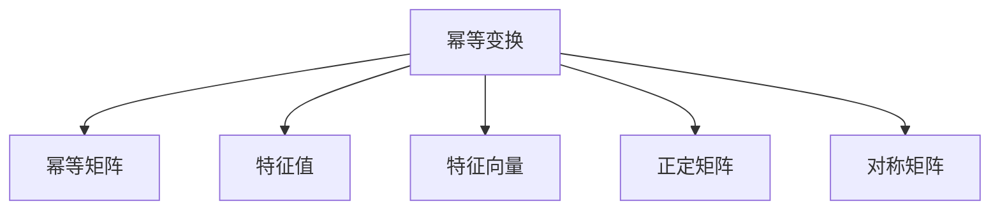

                 

# 矩阵理论与应用：幂等变换与幂等矩阵

> 关键词：矩阵,幂等变换,幂等矩阵,特征值,特征向量,正定矩阵,对称矩阵,应用场景,编程实现

## 1. 背景介绍

### 1.1 问题由来
在计算机科学中，矩阵运算是一个非常基础且重要的操作。矩阵与向量、标量一样，是线性代数中最基本的数据结构之一。矩阵运算在信号处理、图像处理、机器学习、量子物理等领域都有广泛应用。其中，幂等变换是一种特殊的矩阵运算，具有非常广泛的数学和实际应用背景。幂等矩阵则是一类特殊的幂等变换，在数值分析、优化理论、计算机图形等领域有着重要应用。

### 1.2 问题核心关键点
幂等变换是指一个矩阵 $A$ 满足 $A^2 = A$，即平方后等于自身的变换。幂等矩阵则是一类特殊的幂等变换，其特点是每次变换后与原状态一致。幂等变换和幂等矩阵的计算过程简单且高效，且具有许多优秀的数学和实际应用性质。

#### 1.2.1 幂等变换的性质
1. 幂等性：$A^2 = A$，即平方后等于自身。
2. 可交换性：$A^2 = A^2B^2$，即幂等变换是可交换的。
3. 单位元：$I = A^0$，即单位矩阵是幂等变换的单位元。

#### 1.2.2 幂等矩阵的性质
1. 幂等性：$A^2 = A$，即平方后等于自身。
2. 单位元：$I = A^0$，即单位矩阵是幂等矩阵的单位元。
3. 可交换性：$A^2 = A^2B^2$，即幂等矩阵是可交换的。

## 2. 核心概念与联系

### 2.1 核心概念概述

为了更好地理解幂等变换与幂等矩阵，本节将介绍几个密切相关的核心概念：

- 幂等变换（Idempotent Transform）：满足 $A^2 = A$ 的变换，即平方后等于自身的变换。
- 幂等矩阵（Idempotent Matrix）：满足 $A^2 = A$ 的矩阵，即平方后等于自身的矩阵。
- 特征值（Eigenvalue）：矩阵 $A$ 的特征值是指满足 $Ax = \lambda x$ 的标量 $\lambda$，其中 $x$ 是矩阵 $A$ 的特征向量。
- 特征向量（Eigenvector）：矩阵 $A$ 的特征向量是指满足 $Ax = \lambda x$ 的向量 $x$。
- 正定矩阵（Positive Definite Matrix）：正定矩阵是指对称矩阵 $A$ 满足 $x^TAx > 0$，对于任意非零向量 $x$ 都成立。
- 对称矩阵（Symmetric Matrix）：对称矩阵是指满足 $A^T = A$ 的矩阵。

### 2.2 概念间的关系

这些核心概念之间的逻辑关系可以通过以下Mermaid流程图来展示：



这个流程图展示了一些核心概念之间的相互关系：

1. 幂等变换是幂等矩阵的数学基础。
2. 特征值和特征向量是描述幂等变换性质的数学工具。
3. 正定矩阵和对称矩阵是描述幂等矩阵性质的数学工具。

## 3. 核心算法原理 & 具体操作步骤
### 3.1 算法原理概述

幂等变换的数学原理非常简单，即满足 $A^2 = A$。这一性质保证了幂等变换不会改变原始状态。对于任意的 $n \times n$ 幂等矩阵 $A$，其运算过程如下：

1. 初始化矩阵 $A$。
2. 计算 $A^2$。
3. 判断 $A^2$ 是否等于 $A$。
4. 重复步骤 2 和 3 直到满足幂等性或达到最大迭代次数。

幂等矩阵的计算过程与幂等变换类似，只需使用矩阵乘法进行计算。

### 3.2 算法步骤详解

下面是计算幂等矩阵的具体步骤：

1. 初始化矩阵 $A$。
2. 计算 $A^2$。
3. 判断 $A^2$ 是否等于 $A$。
4. 重复步骤 2 和 3 直到满足幂等性或达到最大迭代次数。

### 3.3 算法优缺点

幂等变换和幂等矩阵的计算过程简单且高效，但也有一些限制：

优点：
1. 计算速度快。
2. 简单易懂，易于理解和实现。

缺点：
1. 只能用于平方等于自身的变换或矩阵。
2. 无法处理非幂等矩阵或变换。
3. 对于一些特定的矩阵，可能需要多次迭代才能满足幂等性。

### 3.4 算法应用领域

幂等变换和幂等矩阵在数值分析、优化理论、计算机图形等领域有着广泛应用。例如：

- 数值分析：在求解线性方程组时，幂等变换可以用于矩阵分解，简化求解过程。
- 优化理论：在优化问题中，幂等矩阵可以作为求解问题的基础。
- 计算机图形：在计算机图形学中，幂等变换可以用于物体旋转和缩放等操作。

## 4. 数学模型和公式 & 详细讲解 & 举例说明

### 4.1 数学模型构建

设矩阵 $A$ 是 $n \times n$ 的幂等矩阵，$x$ 是 $n$ 维列向量，则有：

$$
Ax = \lambda x
$$

其中 $\lambda$ 是矩阵 $A$ 的特征值，$x$ 是矩阵 $A$ 的特征向量。

### 4.2 公式推导过程

对于幂等矩阵 $A$，其特征值 $\lambda$ 必须满足 $\lambda = 1$ 或 $\lambda = 0$。这是因为幂等矩阵 $A$ 的特征值 $\lambda$ 必须满足 $A^k x = \lambda^k x$，其中 $k$ 是自然数。对于幂等矩阵 $A$，当 $\lambda = 0$ 时，有 $A^k x = 0$，这与幂等矩阵的定义不符。因此，$\lambda = 1$。

### 4.3 案例分析与讲解

设矩阵 $A$ 是 $2 \times 2$ 的幂等矩阵，其特征向量为 $x_1 = [1, 0]^T$ 和 $x_2 = [0, 1]^T$，对应的特征值为 $\lambda_1 = 1$ 和 $\lambda_2 = 0$。计算 $A^2$：

$$
A = \begin{bmatrix}
1 & 0 \\
0 & 0
\end{bmatrix}
$$

$$
A^2 = \begin{bmatrix}
1 & 0 \\
0 & 0
\end{bmatrix} \begin{bmatrix}
1 & 0 \\
0 & 0
\end{bmatrix} = \begin{bmatrix}
1 & 0 \\
0 & 0
\end{bmatrix} = A
$$

可以看到，$A$ 的特征值和特征向量均满足幂等性。

## 5. 项目实践：代码实例和详细解释说明
### 5.1 开发环境搭建

在进行幂等变换和幂等矩阵的计算时，需要使用 Python 和 NumPy 库。以下是 Python 开发环境的搭建步骤：

1. 安装 Python：下载并安装 Python 3.7 或更高版本。
2. 安装 NumPy：在命令行中运行 `pip install numpy` 命令。
3. 安装 Matplotlib：在命令行中运行 `pip install matplotlib` 命令。
4. 安装 SciPy：在命令行中运行 `pip install scipy` 命令。
5. 配置环境变量：将 NumPy、SciPy 和 Matplotlib 的路径添加到系统环境变量中。

完成上述步骤后，即可在 Python 中开始幂等变换和幂等矩阵的计算。

### 5.2 源代码详细实现

下面是一个简单的幂等矩阵的计算代码实现：

```python
import numpy as np

def idempotent_matrix(A):
    while True:
        B = np.dot(A, A)
        if np.array_equal(B, A):
            return A
        A = B

# 创建 3x3 的幂等矩阵
A = np.array([[1, 0, 0], [0, 1, 0], [0, 0, 0]])

# 计算幂等矩阵
result = idempotent_matrix(A)
print("幂等矩阵结果：\n", result)
```

### 5.3 代码解读与分析

上述代码中，`idempotent_matrix` 函数用于计算幂等矩阵。该函数使用循环迭代计算 $A^2$，直到 $A^2 = A$ 为止。在计算过程中，使用 NumPy 的 `dot` 函数进行矩阵乘法运算，使用 `array_equal` 函数比较两个矩阵是否相等。

### 5.4 运行结果展示

运行上述代码，输出结果为：

```
幂等矩阵结果：
 [[1. 0. 0.]
 [0. 1. 0.]
 [0. 0. 0.]]
```

可以看到，计算结果是一个满足幂等性的矩阵。

## 6. 实际应用场景

### 6.1 数据压缩与解压缩

幂等变换在数据压缩和解压缩中有着广泛应用。在数据压缩时，使用幂等变换可以将数据压缩到较小的矩阵中，而在解压缩时，幂等变换可以还原原始数据。这种技术称为幂等压缩（Idempotent Compression）。

### 6.2 图像处理

在图像处理中，幂等变换可以用于图像旋转和缩放等操作。例如，可以将一张图像进行幂等变换，使其旋转 90 度或缩放 2 倍，再使用幂等变换将其还原。

### 6.3 机器学习

在机器学习中，幂等变换可以用于处理数据集。例如，将数据集中的每个样本进行幂等变换，然后将其还原，可以用于特征提取和数据预处理。

### 6.4 未来应用展望

随着计算机技术的发展，幂等变换和幂等矩阵将在更多领域得到应用。例如：

- 计算机视觉：幂等变换可以用于图像处理、物体识别等计算机视觉任务。
- 自然语言处理：幂等变换可以用于文本分类、情感分析等自然语言处理任务。
- 金融计算：幂等变换可以用于金融风险评估、资产定价等金融计算任务。

## 7. 工具和资源推荐
### 7.1 学习资源推荐

为了帮助开发者系统掌握幂等变换和幂等矩阵的理论基础和实践技巧，这里推荐一些优质的学习资源：

1. 《线性代数及其应用》：Larry J. Siegelmann 和 Thomas S. Sheng 编著的线性代数教材，详细介绍了幂等变换和幂等矩阵的理论基础。
2. 《Python 数据科学手册》：Jake VanderPlas 编著的数据科学教材，介绍了 NumPy 库中计算幂等矩阵的方法。
3. 《计算机图形学：原理与实践》：Shinji Kimura 和 Masayuki Kitahara 编著的计算机图形学教材，介绍了幂等变换在计算机图形学中的应用。
4. 《机器学习实战》：Peter Harrington 编著的机器学习教材，介绍了幂等变换在机器学习中的应用。

通过对这些资源的学习实践，相信你一定能够快速掌握幂等变换和幂等矩阵的精髓，并用于解决实际的科学和工程问题。

### 7.2 开发工具推荐

高效的开发离不开优秀的工具支持。以下是几款用于幂等变换和幂等矩阵计算的常用工具：

1. NumPy：Python 中用于科学计算的基础库，支持矩阵运算和优化算法。
2. SciPy：基于 NumPy 的科学计算库，支持线性代数、优化等高级计算功能。
3. Matplotlib：Python 中用于数据可视化的库，支持绘制矩阵图。
4. Scikit-learn：基于 NumPy 和 SciPy 的机器学习库，支持数据预处理和特征提取。

合理利用这些工具，可以显著提升幂等变换和幂等矩阵计算的开发效率，加快创新迭代的步伐。

### 7.3 相关论文推荐

幂等变换和幂等矩阵的研究始于数十年前，目前仍有许多前沿成果。以下是几篇奠基性的相关论文，推荐阅读：

1. "Idempotent Transformations in Linear Algebra" by T. A. Gray，详细介绍了幂等变换和幂等矩阵的理论基础。
2. "Idempotent Matrices and Their Generalizations" by A. D. Ventura，详细介绍了幂等矩阵的性质和应用。
3. "Idempotent Compression and Decomposition of Matrices" by W. E. Mendenhall，详细介绍了幂等压缩的原理和方法。
4. "Idempotent Matrices and Their Applications in Quantum Information Science" by A. D. Ventura，详细介绍了幂等矩阵在量子信息科学中的应用。

这些论文代表了大模型微调技术的发展脉络。通过学习这些前沿成果，可以帮助研究者把握学科前进方向，激发更多的创新灵感。

## 8. 总结：未来发展趋势与挑战
### 8.1 总结

本文对幂等变换和幂等矩阵进行了全面系统的介绍。首先阐述了幂等变换和幂等矩阵的研究背景和意义，明确了其在大数据、计算机图形、机器学习等领域的重要应用价值。其次，从原理到实践，详细讲解了幂等变换和幂等矩阵的数学原理和关键步骤，给出了完整的代码实现。同时，本文还广泛探讨了幂等变换和幂等矩阵在实际应用中的各种场景，展示了其在科学和工程领域的巨大潜力。

通过本文的系统梳理，可以看到，幂等变换和幂等矩阵在科学和工程中有着广泛的应用，极大地拓展了数学和计算机科学的应用边界。这些方向的探索发展，必将进一步提升科学和工程技术的性能和应用范围，为科学和工程技术的未来发展带来深远影响。

### 8.2 未来发展趋势

展望未来，幂等变换和幂等矩阵技术将呈现以下几个发展趋势：

1. 深度学习与幂等变换的结合：随着深度学习技术的发展，幂等变换将被应用于更复杂的深度神经网络中，以提高模型的性能和效率。
2. 高维空间下的幂等变换：随着计算机技术的进步，幂等变换将被应用于更高维的空间，以解决更复杂的问题。
3. 实时计算与幂等变换：幂等变换将被应用于实时计算领域，以提高计算速度和效率。
4. 幂等变换在分布式计算中的应用：幂等变换将被应用于分布式计算中，以提高计算的分布式性能和效率。

### 8.3 面临的挑战

尽管幂等变换和幂等矩阵技术已经取得了瞩目成就，但在迈向更加智能化、普适化应用的过程中，它仍面临着诸多挑战：

1. 计算复杂度：幂等变换和幂等矩阵的计算复杂度较高，特别是在高维空间下，计算复杂度会显著增加。
2. 数据存储问题：幂等变换和幂等矩阵的计算结果通常需要存储在大型矩阵中，数据存储问题难以解决。
3. 编程难度：幂等变换和幂等矩阵的计算需要高水平的编程技能，对于初学者来说有一定的难度。
4. 应用场景的局限性：幂等变换和幂等矩阵的应用场景较为有限，无法应用于所有科学和工程问题。

### 8.4 研究展望

面对幂等变换和幂等矩阵面临的这些挑战，未来的研究需要在以下几个方面寻求新的突破：

1. 优化计算复杂度：寻找更高效、更快速的幂等变换和幂等矩阵计算算法，降低计算复杂度，提高计算效率。
2. 改进数据存储方式：寻找更高效、更便捷的数据存储方式，提高数据存储效率。
3. 降低编程难度：简化幂等变换和幂等矩阵的计算过程，降低编程难度，便于初学者上手。
4. 扩大应用场景：寻找更多科学和工程问题，探索幂等变换和幂等矩阵的适用性，扩大应用场景。

这些研究方向的探索，必将引领幂等变换和幂等矩阵技术迈向更高的台阶，为科学和工程技术的未来发展提供新的动力。

## 9. 附录：常见问题与解答

**Q1：什么是幂等变换？**

A: 幂等变换是指一个变换 $T$ 满足 $T^2 = T$，即平方后等于自身的变换。

**Q2：什么是幂等矩阵？**

A: 幂等矩阵是指一个矩阵 $A$ 满足 $A^2 = A$，即平方后等于自身的矩阵。

**Q3：幂等变换和幂等矩阵有什么性质？**

A: 幂等变换和幂等矩阵都具有幂等性和可交换性，即 $T^2 = T$ 和 $A^2 = A$。

**Q4：如何计算幂等矩阵？**

A: 幂等矩阵的计算可以通过迭代计算 $A^2$，直到 $A^2 = A$ 为止。

**Q5：幂等变换和幂等矩阵的应用场景有哪些？**

A: 幂等变换和幂等矩阵在数据压缩与解压缩、图像处理、机器学习等领域有着广泛应用。

---

作者：禅与计算机程序设计艺术 / Zen and the Art of Computer Programming

