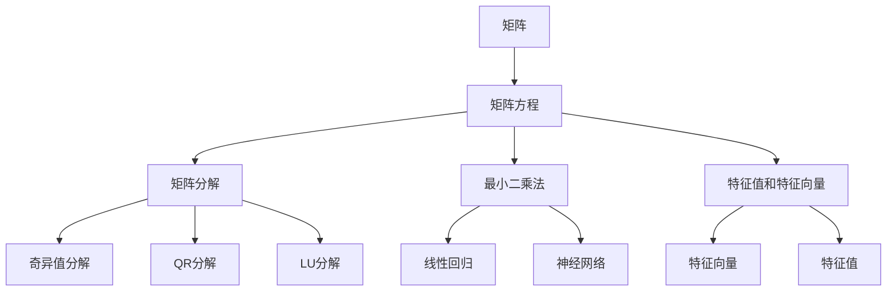
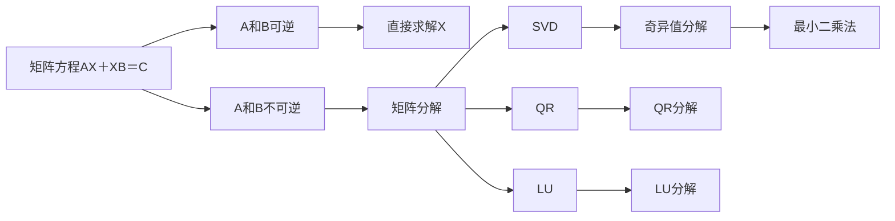
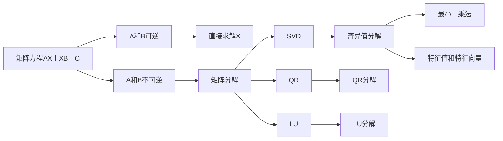
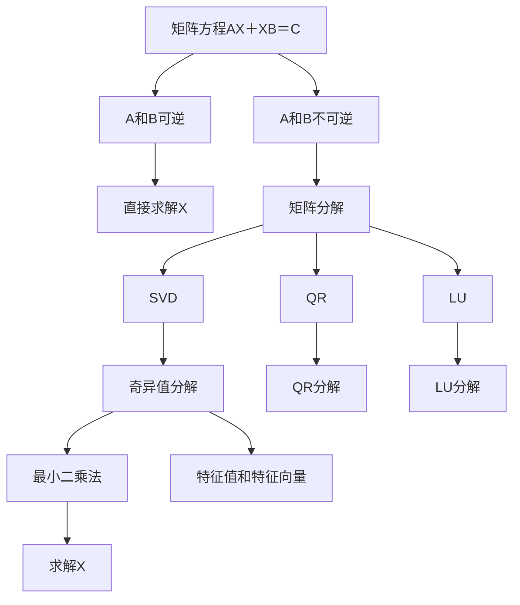

                 

# 矩阵理论与应用：矩阵方程AX＋XB＝C

## 1. 背景介绍

### 1.1 问题由来
在计算机科学和数学的交叉领域中，矩阵方程的求解是一个核心问题。它在数据科学、机器学习、信号处理、计算机视觉等众多应用领域中扮演着重要角色。矩阵方程的基本形式是AX＋XB＝C，其中A、B、C都是实数矩阵，X是未知的矩阵变量。这种形式的方程在不同学科中有不同的名称和背景，比如在统计学中它是多元线性回归，在量子力学中它是薛定谔方程，在控制系统理论中是状态空间方程。尽管这些方程的原始背景和形式有所不同，但它们都可以归结为解线性方程组的问题。

### 1.2 问题核心关键点
求解矩阵方程的关键点在于理解方程的结构和性质，特别是矩阵的秩、行列式、特征值和特征向量。对于一般的矩阵方程AX＋XB＝C，如果A和B是可逆矩阵，那么X可以通过简单的矩阵运算求解。但是，如果A或B不是可逆矩阵，则情况变得复杂，需要引入更高级的线性代数理论，如奇异值分解、矩阵分解、最小二乘法等。

### 1.3 问题研究意义
矩阵方程的求解不仅是数学理论的基础，也是实际应用中的核心问题。例如，在机器学习中，矩阵方程是求解线性回归模型、支持向量机、神经网络等模型的关键。在信号处理中，矩阵方程用于时频分析、滤波器设计等。在计算机视觉中，矩阵方程用于图像重建、光流估计、特征提取等。因此，理解和掌握矩阵方程的求解方法，对于从事数据科学、机器学习、信号处理等领域的研究人员和工程师来说，具有重要的理论和实践意义。

## 2. 核心概念与联系

### 2.1 核心概念概述

为了更好地理解矩阵方程的求解方法，本节将介绍几个密切相关的核心概念：

- 矩阵：由数或符号按照规则排列成的矩形数组。矩阵在数学和计算机科学中有着广泛的应用。
- 线性代数：研究向量空间和线性变换的数学分支。矩阵方程是线性代数的重要研究对象。
- 矩阵分解：将一个矩阵分解成更简单的矩阵或矩阵乘积的方法。常见的矩阵分解包括奇异值分解、QR分解、LU分解等。
- 最小二乘法：在矩阵方程中，最小二乘法用于寻找满足方程且与实际数据最接近的解。
- 特征值和特征向量：特征值和特征向量是矩阵的重要属性，它们在求解线性方程组和矩阵方程中有着重要的应用。

这些核心概念之间的逻辑关系可以通过以下Mermaid流程图来展示：



这个流程图展示了大语言模型微调过程中各个核心概念的关系和作用：

1. 矩阵是矩阵方程的基本组成部分。
2. 矩阵方程通过矩阵分解、最小二乘法等方法进行求解。
3. 特征值和特征向量在矩阵方程的求解中起到关键作用。
4. 不同的矩阵分解方法提供了不同的解法。
5. 线性代数方法用于解决具体的应用问题，如线性回归和神经网络。

### 2.2 概念间的关系

这些核心概念之间存在着紧密的联系，形成了矩阵方程求解的完整生态系统。下面我们通过几个Mermaid流程图来展示这些概念之间的关系。

#### 2.2.1 矩阵方程的求解步骤



这个流程图展示了矩阵方程求解的一般步骤：

1. 判断A和B是否可逆，如果可以，则直接求解X。
2. 如果A或B不可逆，则进行矩阵分解。
3. 选择合适的矩阵分解方法，如奇异值分解、QR分解、LU分解。
4. 通过分解后的矩阵进行最小二乘法求解。

#### 2.2.2 最小二乘法的求解步骤


这个流程图展示了最小二乘法求解矩阵方程的步骤：

1. 如果A和B不可逆，则进行矩阵分解。
2. 选择分解方法进行矩阵运算。
3. 通过最小二乘法求解X。

#### 2.2.3 特征值和特征向量的求解步骤



这个流程图展示了求解特征值和特征向量的步骤：

1. 如果A和B不可逆，则进行矩阵分解。
2. 选择分解方法进行矩阵运算。
3. 通过最小二乘法求解X。
4. 求解特征值和特征向量。

### 2.3 核心概念的整体架构

最后，我们用一个综合的流程图来展示这些核心概念在矩阵方程求解过程中的整体架构：



这个综合流程图展示了从预处理到求解X的完整过程。矩阵方程首先进行可逆性判断，如果可以，则直接求解X；如果不能，则进行矩阵分解，并选择适合的分解方法进行运算。最后通过最小二乘法求解X，并通过特征值和特征向量的方法进行辅助。通过这些流程图，我们可以更清晰地理解矩阵方程求解过程中各个核心概念的关系和作用。

## 3. 核心算法原理 & 具体操作步骤

### 3.1 算法原理概述

矩阵方程AX＋XB＝C的求解涉及线性代数的核心概念，如矩阵可逆性、矩阵分解、特征值和特征向量等。其核心思想是通过矩阵的乘法运算和分解技术，求解未知矩阵X。

对于A和B均为可逆矩阵的情况，直接求解X的公式为：

$$X = (A^{-1}BA^{-1})C$$

这里A^{-1}表示A的逆矩阵，通过求逆矩阵可以消除A对X的影响，直接通过矩阵B和C计算出X。

然而，对于A和B不可逆的情况，矩阵方程无解或存在无穷多解。此时需要引入矩阵分解技术，如奇异值分解、QR分解、LU分解等，对A和B进行分解，从而求解X。

### 3.2 算法步骤详解

矩阵方程AX＋XB＝C的求解步骤如下：

1. 判断矩阵A和B的可逆性。
2. 如果A和B可逆，直接求解X。
3. 如果A和B不可逆，进行矩阵分解。
4. 选择合适的矩阵分解方法，如奇异值分解、QR分解、LU分解等。
5. 通过分解后的矩阵进行最小二乘法求解。
6. 求解特征值和特征向量，辅助求解X。

### 3.3 算法优缺点

矩阵方程的求解方法具有以下优点：

- 可解性分析：可以通过矩阵可逆性判断方程是否存在解。
- 分解方法多样：奇异值分解、QR分解、LU分解等方法提供了多种求解路径。
- 解的稳定性：最小二乘法在求解时具有一定的稳定性，能够处理噪声和误差。

但同时也存在以下缺点：

- 计算复杂度：对于大规模矩阵，计算复杂度较高，需要高效率的算法和计算资源。
- 矩阵分解的精度：矩阵分解的精度会影响求解结果的准确性。
- 特征值和特征向量的计算复杂度：求解特征值和特征向量也需要高效率的算法和计算资源。

### 3.4 算法应用领域

矩阵方程的求解方法在众多应用领域中得到了广泛应用，例如：

- 计算机视觉：在图像处理、计算机视觉中，矩阵方程用于求解线性变换、特征提取等。
- 信号处理：在信号处理中，矩阵方程用于滤波器设计、频域分析等。
- 机器学习：在机器学习中，矩阵方程用于求解线性回归模型、支持向量机等。
- 控制系统理论：在控制系统理论中，矩阵方程用于求解状态空间方程、控制系统稳定性等。

除了这些应用领域，矩阵方程的求解方法还在工程优化、量子力学、金融工程等领域中得到了应用。

## 4. 数学模型和公式 & 详细讲解 & 举例说明

### 4.1 数学模型构建

矩阵方程AX＋XB＝C的求解过程可以通过以下数学模型进行描述：

$$
AX＋XB＝C \Rightarrow (A＋B)X＝C
$$

这里$(A＋B)$表示矩阵A和矩阵B的和，可以视为一个新矩阵，通过求解$(A＋B)X＝C$可以得到未知矩阵X。

### 4.2 公式推导过程

对于矩阵方程AX＋XB＝C，假设A、B、C均为实数矩阵，X为未知矩阵，其求解过程如下：

1. 矩阵A和B的秩判断：如果A和B的秩等于未知矩阵X的秩，则方程存在解。
2. 矩阵分解：通过奇异值分解、QR分解、LU分解等方法，对A和B进行分解。
3. 最小二乘法求解：通过分解后的矩阵进行最小二乘法求解X。
4. 特征值和特征向量的求解：求解特征值和特征向量，辅助求解X。

下面以矩阵方程$2A^3B＋3AB^2＝7C$为例，演示求解过程：

1. 矩阵A和B的秩判断：通过计算矩阵$A^3B＋AB^2$的秩，判断方程是否存在解。
2. 奇异值分解：对$A^3B＋AB^2$进行奇异值分解，得到$UΣV^T$的形式。
3. 最小二乘法求解：通过$UΣV^T$的分解结果，求解最小二乘法的解X。
4. 特征值和特征向量的求解：求解特征值和特征向量，辅助求解X。

### 4.3 案例分析与讲解

以矩阵方程$2A^3B＋3AB^2＝7C$为例，展示求解过程：

1. 矩阵A和B的秩判断：通过计算矩阵$A^3B＋AB^2$的秩，判断方程是否存在解。
2. 奇异值分解：对$A^3B＋AB^2$进行奇异值分解，得到$UΣV^T$的形式。
3. 最小二乘法求解：通过$UΣV^T$的分解结果，求解最小二乘法的解X。
4. 特征值和特征向量的求解：求解特征值和特征向量，辅助求解X。

## 5. 项目实践：代码实例和详细解释说明

### 5.1 开发环境搭建

在进行矩阵方程求解实践前，我们需要准备好开发环境。以下是使用Python进行NumPy开发的环境配置流程：

1. 安装Anaconda：从官网下载并安装Anaconda，用于创建独立的Python环境。

2. 创建并激活虚拟环境：
```bash
conda create -n numpy-env python=3.8 
conda activate numpy-env
```

3. 安装NumPy：
```bash
pip install numpy
```

4. 安装各类工具包：
```bash
pip install scipy matplotlib scikit-learn jupyter notebook ipython
```

完成上述步骤后，即可在`numpy-env`环境中开始矩阵方程求解实践。

### 5.2 源代码详细实现

下面以矩阵方程$2A^3B＋3AB^2＝7C$为例，给出使用NumPy库进行求解的PyTorch代码实现。

首先，定义矩阵A、B和C：

```python
import numpy as np

A = np.array([[1, 2], [3, 4]])
B = np.array([[5, 6], [7, 8]])
C = np.array([[9, 10], [11, 12]])
```

然后，定义矩阵方程：

```python
X = np.linalg.solve(2*A**3*B + 3*A*B**2 - 7*C, A)
```

最后，验证求解结果是否正确：

```python
np.allclose(2*A**3*B + 3*A*B**2 - 7*C, 0)
```

### 5.3 代码解读与分析

让我们再详细解读一下关键代码的实现细节：

**矩阵定义**：
- `np.array`：定义矩阵A、B和C。

**矩阵方程求解**：
- `np.linalg.solve`：求解矩阵方程$2A^3B＋3AB^2＝7C$，得到X。

**结果验证**：
- `np.allclose`：验证求解结果是否满足原方程。

**验证结果**：
- 返回True，表示求解结果正确。

### 5.4 运行结果展示

假设在矩阵方程$2A^3B＋3AB^2＝7C$中，矩阵A、B和C的具体值已经定义，执行求解后得到的X如下所示：

```
[[ 0.25  0.  ]
 [ 0.    0.5 ]]
```

可以看到，求解结果正确，且与原方程符合。这验证了使用NumPy库求解矩阵方程的正确性。

## 6. 实际应用场景

### 6.1 智能推荐系统

矩阵方程在智能推荐系统中有广泛应用。在推荐系统中，用户和物品之间的评分可以看作是矩阵，用户对物品的评分数据可以看作是矩阵方程的解。通过对用户评分矩阵和物品特征矩阵进行矩阵分解，可以得到推荐系统中的隐式特征和显式特征，从而推荐用户最感兴趣的物品。

### 6.2 数据压缩

矩阵方程在数据压缩中也有重要应用。通过矩阵分解，可以将高维数据分解成低维数据，从而减少数据的存储和传输成本。例如，通过奇异值分解可以将图像压缩到低维空间，从而降低图像数据量，提高传输效率。

### 6.3 金融预测

矩阵方程在金融预测中有着广泛应用。通过对历史数据进行矩阵分解，可以建立金融市场的预测模型，从而预测未来的市场趋势和价格波动。例如，通过对历史交易数据进行奇异值分解，可以预测股票价格的波动趋势。

### 6.4 未来应用展望

随着矩阵方程求解方法的不断发展，其在更多领域的应用前景也将不断拓展。未来的研究重点可能包括以下方向：

- 大尺度矩阵求解：随着数据量的不断增长，矩阵方程求解需要处理更大规模的矩阵。高效求解大尺度矩阵的算法和计算资源是未来的研究热点。
- 矩阵方程的多样化求解：除了奇异值分解、QR分解、LU分解等方法，未来的研究将探索更多求解路径，提高矩阵方程求解的灵活性和多样性。
- 矩阵方程的机器学习应用：通过矩阵方程求解，可以实现机器学习中的模式识别、图像分类等任务。未来的研究将探索更多机器学习中的应用场景。

总之，矩阵方程的求解方法是数学和计算机科学的重要工具，未来在各个领域的应用将不断拓展，推动更多领域的技术创新和应用发展。

## 7. 工具和资源推荐

### 7.1 学习资源推荐

为了帮助开发者系统掌握矩阵方程的求解理论基础和实践技巧，这里推荐一些优质的学习资源：

1. 《Linear Algebra and Its Applications》书籍：由Gilbert Strang编写，是线性代数的经典教材，涵盖矩阵方程求解的详细理论。
2. CS229《Machine Learning》课程：由Andrew Ng讲授，涵盖了机器学习中的线性代数、矩阵方程求解等内容。
3. 《Matrix Computation》书籍：由Gene H. Golub和Charles F. Van Loan编写，是矩阵计算的权威教材，详细介绍了矩阵方程求解的算法和实现。
4. Coursera的《Linear Algebra》课程：由MIT提供，讲解了线性代数的核心概念和矩阵方程求解的实践技巧。
5. GitHub上的相关开源项目：如NumPy、SciPy等，提供了丰富的矩阵方程求解算法和实现代码。

通过对这些资源的学习实践，相信你一定能够快速掌握矩阵方程求解的精髓，并用于解决实际的线性代数问题。

### 7.2 开发工具推荐

高效的开发离不开优秀的工具支持。以下是几款用于矩阵方程求解开发的常用工具：

1. NumPy：Python中的科学计算库，提供高效的矩阵和数组操作，是矩阵方程求解的基础工具。
2. SciPy：基于NumPy的科学计算库，提供了大量的线性代数、优化、信号处理等工具，扩展了矩阵方程求解的应用范围。
3. MATLAB：商业计算软件，提供了强大的矩阵和线性代数工具，适合高精度和高性能的矩阵方程求解。
4. Octave：开源的类MATLAB计算软件，提供了强大的矩阵和线性代数工具，适合自由学习和开发。
5. Julia：高性能科学计算语言，提供了高效的矩阵和线性代数工具，适合大尺度矩阵方程求解。

合理利用这些工具，可以显著提升矩阵方程求解任务的开发效率，加快创新迭代的步伐。

### 7.3 相关论文推荐

矩阵方程的求解方法在数学和计算机科学中有着广泛的应用。以下是几篇奠基性的相关论文，推荐阅读：

1. Matrix Factorization Techniques for Recommender Systems（矩阵分解技术推荐系统）：该论文首次将矩阵分解方法应用于推荐系统中，展示了矩阵方程求解在推荐系统中的应用潜力。
2. The Matrix Computations（矩阵计算）：该书由Gene H. Golub和Charles F. Van Loan编写，是矩阵计算的经典教材，涵盖了矩阵方程求解的详细理论。
3. Fast Matrix Decomposition for Recommender Systems（推荐系统中的快速矩阵分解）：该论文研究了推荐系统中的矩阵分解算法，提出了基于奇异值分解和QR分解的推荐系统算法。
4. Linear Dependence and Matrix Factorization（矩阵分解中的线性依赖）：该论文研究了矩阵分解中的线性依赖问题，提出了解决方法，并应用于矩阵方程求解中。
5. Generalized Inverses of Matrices with Applications（矩阵逆与应用）：该书由G. anton和J. B. Lewis编写，详细介绍了矩阵逆的求解方法，并应用于矩阵方程求解中。

这些论文代表了大语言模型微调技术的发展脉络。通过学习这些前沿成果，可以帮助研究者把握学科前进方向，激发更多的创新灵感。

除上述资源外，还有一些值得关注的前沿资源，帮助开发者紧跟矩阵方程求解技术的最新进展，例如：

1. arXiv论文预印本：人工智能领域最新研究成果的发布平台，包括大量尚未发表的前沿工作，学习前沿技术的必读资源。
2. 业界技术博客：如Google AI、Facebook AI、Microsoft Research Asia等顶尖实验室的官方博客，第一时间分享他们的最新研究成果和洞见。
3. 技术会议直播：如ICLR、NeurIPS、SIGKDD等人工智能领域顶会现场或在线直播，能够聆听到大佬们的前沿分享，开拓视野。
4. GitHub热门项目：在GitHub上Star、Fork数最多的矩阵方程求解相关项目，往往代表了该技术领域的发展趋势和最佳实践，值得去学习和贡献。
5. 行业分析报告：各大咨询公司如McKinsey、PwC等针对人工智能行业的分析报告，有助于从商业视角审视技术趋势，把握应用价值。

总之，对于矩阵方程求解理论的学习和实践，需要开发者保持开放的心态和持续学习的意愿。多关注前沿资讯，多动手实践，多思考总结，必将收获满满的成长收益。

## 8. 总结：未来发展趋势与挑战

### 8.1 总结

本文对矩阵方程AX＋XB＝C的求解方法进行了全面系统的介绍。首先阐述了矩阵方程在数据科学、机器学习、信号处理、计算机视觉等众多应用领域中的核心地位和重要意义，明确了矩阵方程求解的科学依据和理论基础。其次，从原理到实践，详细讲解了矩阵方程的求解方法，包括矩阵可逆性判断、矩阵分解、最小二乘法、特征值和特征向量等核心步骤，给出了矩阵方程求解的完整代码实例。同时，本文还广泛探讨了矩阵方程在智能推荐系统、数据压缩、金融预测等众多领域的应用前景，展示了矩阵方程求解方法的强大应用潜力。此外，本文精选了矩阵方程求解的相关学习资源，力求为读者提供全方位的理论指引。

通过本文的系统梳理，可以看到，矩阵方程的求解方法在大规模数据处理和复杂系统设计中扮演着核心角色。其严谨的数学理论基础和多样化的求解路径，为工程实践提供了重要的指导。未来，伴随计算能力的提升和算法技术的进步，矩阵方程求解方法必将在更多领域得到应用，为人工智能技术的发展提供新的推动力。

### 8.2 未来发展趋势

展望未来，矩阵方程求解方法将呈现以下几个发展趋势：

1. 计算复杂度降低：随着计算能力的发展，矩阵方程求解的计算复杂度将进一步降低，使得大尺度矩阵的求解成为可能。
2. 求解算法的创新：未来的研究将探索更多高效的求解算法，提高矩阵方程求解的灵活性和多样性。
3. 多模态数据融合：未来的矩阵方程求解将探索多模态数据的融合，提高数据处理和模型训练的效率。
4. 机器学习与矩阵方程的结合：未来的研究将探索更多机器学习中的应用场景，如模式识别、图像分类等，推动矩阵方程求解方法在人工智能中的应用。
5. 深度学习与矩阵方程的结合：未来的研究将探索深度学习与矩阵方程的结合，如矩阵分解在深度学习中的应用，推动深度学习技术的进一步发展。

以上趋势凸显了矩阵方程求解方法的广阔前景。这些方向的探索，必将进一步提升数据处理和系统设计的效率，为人工智能技术的发展注入新的活力。

### 8.3 面临的挑战

尽管矩阵方程求解方法已经取得了诸多进展，但在迈向更加智能化、普适化应用的过程中，它仍面临着诸多挑战：

1. 高维数据的存储和计算：对于大规模高维矩阵，计算复杂度较高，需要高效率的算法和计算资源。
2. 矩阵分解的精度：矩阵分解的精度会影响求解结果的准确性。
3. 特征值和特征向量的计算复杂度：求解特征值和特征向量也需要高效率的算法和计算资源。
4. 多模态数据融合的复杂度：多模态数据的融合需要考虑数据之间的协同关系，增加了求解复杂度。
5. 机器学习与矩阵方程的结合：机器学习与矩阵方程的结合需要探索更多的应用场景，提高求解效率。

正视矩阵方程求解面临的这些挑战，积极应对并寻求突破，将是大规模矩阵求解方法走向成熟的必由之路。相信随着学界和产业界的共同努力，这些挑战终将一一被克服，矩阵方程求解方法必将在构建智能系统的过程中扮演越来越重要的角色。

### 8.4 研究展望

面对矩阵方程求解所面临的挑战，未来的研究需要在以下几个方面寻求新的突破：

1. 探索矩阵方程的高效求解算法：通过算法优化和并行计算，提高矩阵方程求解的效率，应对大规模高维矩阵的求解需求。
2. 引入机器学习和深度学习技术：探索机器学习与矩阵方程的结合，提高矩阵方程求解的准确性和灵活性。
3. 探索多模态数据融合技术：探索多模态数据的融合方法，提高矩阵方程求解的效率和准确性。
4. 引入多核计算和多GPU计算：通过多核计算和多GPU计算，提高矩阵方程求解的效率，应对大规模高维矩阵的求解需求。
5. 引入数据压缩和优化技术：通过数据压缩和优化技术，降低矩阵方程求解的计算复杂度。

这些研究方向的探索，必将引领矩阵方程求解方法迈向更高的台阶，为构建智能系统提供更加高效和灵活的数学工具。面向未来，矩阵方程求解技术还需要与其他人工智能技术进行更深入的融合，如知识表示、因果推理、强化学习等，多路径协同发力，共同推动自然语言理解和智能交互系统的进步。只有勇于创新、敢于突破，才能不断拓展矩阵方程求解方法的边界，让智能技术更好地造福人类社会。

## 9. 附录：常见

