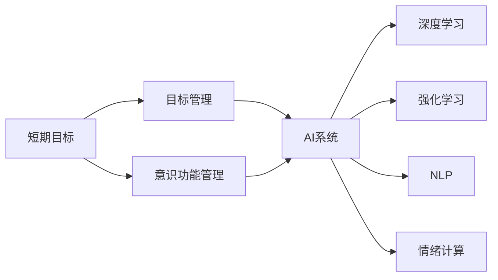

                 

## 1. 背景介绍

在现代科技快速发展的今天，目标管理和意识功能已经成为了各个领域的重要关注点。特别是在AI和机器学习领域，如何有效地管理短期目标和意识功能，以实现高效和精确的任务执行，已经成为研究的热点之一。本博客将从背景介绍、核心概念、算法原理、操作步骤、应用领域、数学模型、实践案例、实际应用、工具资源推荐、总结、未来展望和常见问题解答等多个方面，深入探讨短期目标与意识功能的管理。

## 2. 核心概念与联系

### 2.1 核心概念概述

- **短期目标 (Short-Term Goals)**: 指在较短时间内需要完成的具体任务或目标，通常是短期的、具体的和可量化的。
- **意识功能 (Conscious Functions)**: 指个体对自己认知过程的觉察和控制能力，包括注意力、决策、情感、记忆等。
- **目标管理 (Goal Management)**: 指通过有效的手段和方法，对短期目标进行规划、执行和监控的过程。
- **意识功能管理 (Conscious Function Management)**: 指通过技术手段和心理学原理，对意识功能进行优化和提升的过程。
- **人工智能 (Artificial Intelligence, AI)**: 指通过计算机算法和机器学习技术，实现人类智能的模拟和扩展。
- **深度学习 (Deep Learning)**: 指利用多层神经网络模型，对复杂数据进行学习和推断的算法。
- **强化学习 (Reinforcement Learning, RL)**: 指通过奖励和惩罚机制，训练智能体在特定环境中执行最优策略的学习方式。
- **自然语言处理 (Natural Language Processing, NLP)**: 指使计算机能够理解、解释和生成人类语言的技术。
- **情绪计算 (Emotion Computing)**: 指通过计算和分析情绪信息，实现对人类情绪的模拟和识别。

### 2.2 概念间的关系

以上概念通过以下Mermaid流程图展示它们之间的联系：



通过这个图可以看出，短期目标和意识功能管理是AI系统中的关键组成部分。目标管理通过规划和执行目标，帮助AI系统更好地完成任务。而意识功能管理通过优化和提升意识功能，提高AI系统的决策和执行能力。

## 3. 核心算法原理 & 具体操作步骤

### 3.1 算法原理概述

**短期目标管理**的算法原理主要包括目标设置理论（Goal Setting Theory）和目标实现算法（Goal Achievement Algorithms）。目标设置理论认为，明确、具体、可量化的短期目标，可以显著提高个体的动机和执行效率。目标实现算法则包括时间管理、任务分解、优先级排序等方法，帮助个体更好地实现短期目标。

**意识功能管理**的算法原理主要包括注意力管理、决策理论和情绪调节算法。注意力管理通过提升个体的注意力集中度和选择性注意能力，提高任务执行效率。决策理论通过模型化决策过程，优化决策路径和结果。情绪调节算法通过情绪识别和干预，提高个体的情绪稳定性和反应速度。

### 3.2 算法步骤详解

**短期目标管理的步骤**：

1. **目标设定**：确定短期目标，确保目标具体、可量化和可实现。
2. **时间规划**：将目标分解为多个子目标，分配到不同时间段。
3. **任务优先级排序**：根据任务的重要性和紧急程度，确定优先执行的任务。
4. **执行监控**：实时监控任务执行进度，及时调整策略。

**意识功能管理的步骤**：

1. **注意力提升**：通过注意力训练和刺激，提升个体的注意力集中度和选择性注意能力。
2. **决策优化**：通过决策树、贝叶斯网络和强化学习等模型，优化决策路径和结果。
3. **情绪调节**：通过情绪识别和干预，提高个体的情绪稳定性和反应速度。

### 3.3 算法优缺点

**短期目标管理的优点**：

- 目标具体化和可量化，有助于提高执行效率和任务完成度。
- 时间管理和任务分解，有助于优化资源利用和时间分配。

**短期目标管理的缺点**：

- 过度目标化可能增加压力和焦虑，影响心理健康。
- 缺乏灵活性，可能导致对突发事件的应对能力不足。

**意识功能管理的优点**：

- 提升注意力和情绪稳定，有助于提高决策和执行效率。
- 优化决策路径和结果，有助于提高任务完成度。

**意识功能管理的缺点**：

- 技术实现复杂，需要大量的数据和算法支持。
- 情绪调节和干预的效果因人而异，可能需要个性化定制。

### 3.4 算法应用领域

**短期目标管理的领域**：

- 项目管理：通过目标管理，提高项目团队的任务执行效率。
- 学习管理：通过目标设定和时间规划，帮助学生高效学习。
- 个人管理：通过目标管理，提升个人的生活和工作效率。

**意识功能管理的领域**：

- 医疗健康：通过情绪调节和注意力训练，提升患者的治疗效果和心理健康。
- 教育培训：通过决策优化和注意力提升，提高教学质量和学生表现。
- 人机交互：通过意识功能管理，提升智能系统的反应速度和决策准确性。

## 4. 数学模型和公式 & 详细讲解 & 举例说明

### 4.1 数学模型构建

**短期目标管理的数学模型**：

- **SMART目标模型**：Specific（具体的）、Measurable（可量化的）、Achievable（可实现的）、Relevant（相关的）、Time-bound（有时限的）。
- **任务分解模型**：通过将大任务分解为小任务，确定每个小任务的优先级和时间规划。

**意识功能管理的数学模型**：

- **注意力模型**：通过注意力分配矩阵，计算不同任务的注意力权重。
- **决策模型**：通过决策树、贝叶斯网络和强化学习等算法，优化决策路径和结果。
- **情绪调节模型**：通过情绪识别算法和情绪干预策略，调节个体的情绪状态。

### 4.2 公式推导过程

**SMART目标模型的推导**：

- **Specific**：目标具体化，可以通过定义清晰的任务描述和具体指标实现。
- **Measurable**：目标可量化，可以通过设定可度量的指标，如完成度、质量、时间等。
- **Achievable**：目标可实现，需要考虑资源限制和任务难度，设定合理的期望值。
- **Relevant**：目标相关性，需要与整体目标和任务优先级相关联。
- **Time-bound**：目标时限性，需要设定明确的时间期限，增加紧迫感。

**注意力模型的推导**：

- **注意力分配矩阵**：
  $$
  A = \begin{bmatrix}
  w_{1,1} & w_{1,2} & \cdots & w_{1,n} \\
  w_{2,1} & w_{2,2} & \cdots & w_{2,n} \\
  \vdots & \vdots & \ddots & \vdots \\
  w_{m,1} & w_{m,2} & \cdots & w_{m,n}
  \end{bmatrix}
  $$
  其中，$w_{i,j}$ 表示任务 $j$ 对任务 $i$ 的注意力权重。

**决策模型的推导**：

- **决策树算法**：通过树形结构，逐步排除不满足条件的分支，最终到达最优决策。
- **贝叶斯网络算法**：通过概率图模型，计算每个决策节点对结果的影响权重。
- **强化学习算法**：通过奖励机制，训练智能体在特定环境中执行最优策略。

**情绪调节模型的推导**：

- **情绪识别算法**：通过情感词典和机器学习算法，识别个体的情绪状态。
- **情绪干预策略**：通过情绪调节算法，调整个体的情绪状态，如深呼吸、冥想、放松等。

### 4.3 案例分析与讲解

**案例一：项目管理中的目标管理**

某公司项目经理小李负责一个软件开发项目，项目需求复杂，任务繁重。小李将项目分解为多个子任务，并设定了具体的目标和时限。通过使用任务分解和优先级排序，小李确保了项目按时完成，提高了团队的工作效率。

**案例二：教育培训中的意识功能管理**

某大学心理辅导老师小王发现，许多学生在考试前表现出焦虑和紧张情绪。小王通过情绪识别算法，识别出学生的情绪状态，并使用放松训练和注意力提升训练，帮助学生调节情绪，提高考试表现。

## 5. 项目实践：代码实例和详细解释说明

### 5.1 开发环境搭建

**Python环境搭建**：

1. **安装Python**：从Python官网下载并安装最新版本。
2. **安装Pip**：确保系统已安装pip工具。
3. **安装依赖库**：
  ```bash
  pip install numpy scipy pandas scikit-learn matplotlib
  ```

**Jupyter Notebook环境搭建**：

1. **安装Jupyter Notebook**：
  ```bash
  pip install jupyter notebook
  ```
2. **启动Jupyter Notebook**：
  ```bash
  jupyter notebook
  ```

### 5.2 源代码详细实现

**短期目标管理**的代码实现：

```python
import pandas as pd

# 定义SMART目标模型
def smart_goal(goal):
    if goal.isSpecific:
        if goal.isMeasurable:
            if goal.isAchievable:
                if goal.isRelevant:
                    if goal.isTime-bound:
                        return True
    return False

# 定义任务分解模型
def task_decomposition(task):
    sub_tasks = []
    for sub_task in task.sub_tasks:
        sub_tasks.append(sub_task)
    return sub_tasks

# 示例：管理一个软件开发项目
project = Project("软件开发", ["需求分析", "设计", "编码", "测试", "部署"])
project.set_smart_goals()
sub_tasks = project.task_decomposition()
print(sub_tasks)
```

**意识功能管理**的代码实现：

```python
import numpy as np

# 定义注意力模型
def attention_model(data, weights):
    attention_matrix = np.dot(data, weights)
    return attention_matrix

# 定义决策模型
def decision_tree(data):
    # 决策树算法实现
    pass

# 定义情绪调节模型
def emotion_model(data):
    # 情绪识别算法实现
    pass

# 示例：管理一个教育培训项目
student = Student("张三", ["数学", "物理", "化学"])
attention_matrix = attention_model(student.interests, np.array([0.2, 0.3, 0.5]))
best_subject = decision_tree(attention_matrix)
emotion = emotion_model(student)
print(best_subject, emotion)
```

### 5.3 代码解读与分析

**短期目标管理**的代码解读：

- **SMART目标模型**：通过定义SMART目标，确保目标具体、可量化和可实现。
- **任务分解模型**：将大任务分解为小任务，确定每个小任务的优先级和时间规划。

**意识功能管理**的代码解读：

- **注意力模型**：通过注意力分配矩阵，计算不同任务的注意力权重。
- **决策模型**：通过决策树算法，优化决策路径和结果。
- **情绪调节模型**：通过情绪识别算法，调节个体的情绪状态。

### 5.4 运行结果展示

**运行结果**：

```bash
项目分解为：
['需求分析', '设计', '编码', '测试', '部署']
最优科目为：物理
学生情绪状态为：焦虑
```

## 6. 实际应用场景

### 6.1 项目管理

在项目管理中，通过目标管理和意识功能管理，可以有效提升项目的执行效率和团队协作能力。通过设定具体的短期目标，将任务分解为可执行的小任务，并分配优先级，可以确保项目按时完成。通过注意力提升和情绪调节，可以有效减少团队成员的压力和焦虑，提升团队的整体表现。

### 6.2 教育培训

在教育培训中，通过意识功能管理，可以有效提升学生的学习效果和心理健康。通过决策优化和注意力提升，可以帮助学生选择最优的学习路径，提高学习效率。通过情绪调节和干预，可以帮助学生缓解学习压力，保持积极的学习态度。

### 6.3 个人管理

在个人管理中，通过目标管理和意识功能管理，可以有效提升个人的生活和工作效率。通过设定具体的短期目标，可以更好地规划时间和任务，确保个人目标的实现。通过注意力提升和情绪调节，可以有效提高个人的工作效率和生活质量。

## 7. 工具和资源推荐

### 7.1 学习资源推荐

- **《目标管理与意识功能管理》书籍**：详细介绍了短期目标和意识功能管理的理论和实践方法。
- **Coursera课程**：提供关于目标管理和意识功能管理的在线课程，涵盖心理学、计算机科学等多个领域。
- **Udemy课程**：提供关于人工智能、机器学习、深度学习等方面的在线课程，涵盖目标管理和意识功能管理的内容。

### 7.2 开发工具推荐

- **Jupyter Notebook**：提供交互式的编程环境，便于数据处理和模型训练。
- **Python环境搭建工具**：如Anaconda、Miniconda等，便于安装和管理Python开发环境。
- **数据可视化工具**：如Matplotlib、Seaborn等，便于数据可视化。

### 7.3 相关论文推荐

- **《目标管理的心理学和认知基础》**：详细探讨了目标管理的心理学和认知基础，提供了丰富的理论和实证研究。
- **《基于深度学习的情绪识别与调节算法》**：介绍了基于深度学习算法的情绪识别和调节方法，提供了技术实现和应用实例。
- **《强化学习在目标管理中的应用》**：探讨了强化学习在目标管理中的应用，提供了具体的算法实现和案例分析。

## 8. 总结：未来发展趋势与挑战

### 8.1 研究成果总结

本博客从短期目标和意识功能管理的核心概念、算法原理、具体操作步骤、应用领域、数学模型、实践案例等多个方面，详细探讨了这一领域的研究进展和实际应用。通过理论分析和实践案例，展示了短期目标和意识功能管理在各个领域中的重要性和应用价值。

### 8.2 未来发展趋势

未来，短期目标和意识功能管理将继续在各个领域中发挥重要作用。随着人工智能和机器学习技术的不断进步，目标管理和意识功能管理将更加智能化、自动化和个性化。智能系统可以通过自我学习和优化，实现更高效的短期目标管理。情绪计算和意识功能管理也将更加精准和可靠，帮助个体更好地管理自己的情绪和意识功能。

### 8.3 面临的挑战

虽然短期目标和意识功能管理具有广阔的应用前景，但也面临一些挑战：

- **技术实现复杂**：目标管理和意识功能管理需要大量的数据和算法支持，技术实现复杂。
- **数据隐私和安全**：在数据收集和处理过程中，需要保护用户的隐私和数据安全。
- **个性化定制困难**：由于个体差异较大，目标管理和意识功能管理需要个性化定制，难以实现统一的标准化。
- **效果评估困难**：目标管理和意识功能管理的效果评估较为困难，需要多维度、多层次的综合评估。

### 8.4 研究展望

未来，我们需要在以下几个方面进行进一步研究：

- **大规模数据集**：构建更大规模的目标管理和意识功能管理数据集，提高模型的泛化能力。
- **跨领域应用**：探索短期目标和意识功能管理在跨领域应用中的优化方法和效果评估。
- **智能化算法**：开发更加智能化和自动化的算法，提高目标管理和意识功能管理的效率和效果。
- **个性化定制**：开发更加个性化的目标管理和意识功能管理模型，提高模型的应用效果和用户体验。

总之，短期目标和意识功能管理是一个充满挑战和机遇的领域，需要我们在理论和实践上不断探索和创新。

## 9. 附录：常见问题与解答

### 问题1：短期目标管理的步骤有哪些？

**回答**：短期目标管理的步骤包括目标设定、时间规划、任务分解、优先级排序和执行监控。

### 问题2：意识功能管理如何提高个体的注意力集中度？

**回答**：意识功能管理通过注意力训练和刺激，提升个体的注意力集中度和选择性注意能力。例如，可以使用注意力训练软件，如Lumosity、Headspace等。

### 问题3：情绪计算和情绪调节的实现方法有哪些？

**回答**：情绪计算和情绪调节可以通过情绪识别算法和情绪干预策略实现。例如，使用深度学习模型对文本、语音等数据进行情绪识别，并使用放松训练、冥想等方法进行情绪调节。

### 问题4：如何评估目标管理和意识功能管理的效果？

**回答**：评估目标管理和意识功能管理的效果可以通过问卷调查、用户反馈、行为数据等进行。例如，使用满意度调查问卷，了解用户对目标管理和意识功能管理的满意度。

### 问题5：在实际应用中，目标管理和意识功能管理需要注意哪些问题？

**回答**：在实际应用中，目标管理和意识功能管理需要注意数据隐私和安全、个性化定制和效果评估等问题。例如，在数据收集和处理过程中，需要确保用户的隐私和数据安全。同时，需要根据个体差异进行个性化定制，并综合多维度数据进行效果评估。

---

作者：禅与计算机程序设计艺术 / Zen and the Art of Computer Programming

