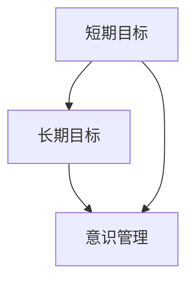
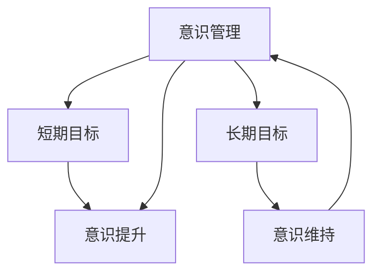
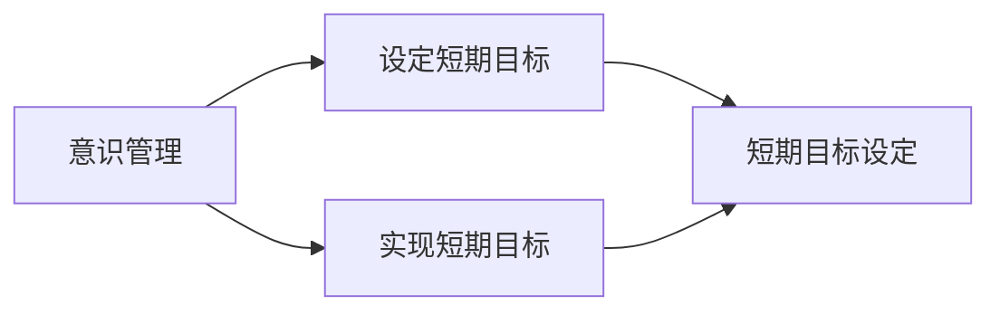
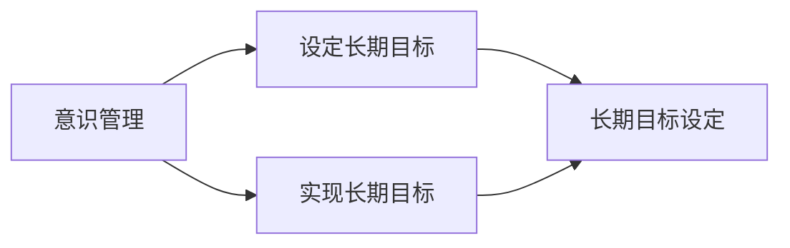
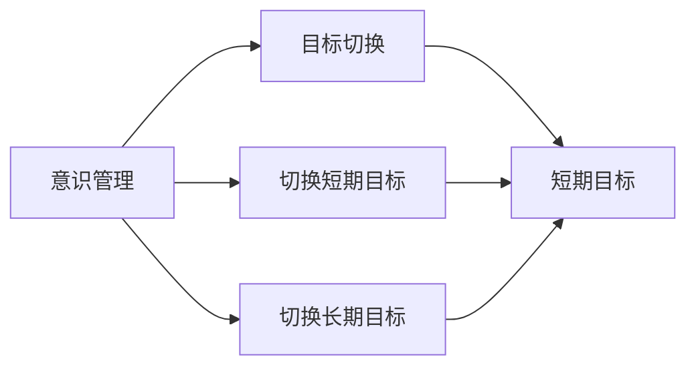

                 

# 短期目标与长期目标的意识管理

在快节奏的现代社会，人们每天都在设定和追求目标。这些目标可以是短期内的任务，也可以是长期的事业。然而，要实现这些目标，不仅需要明确的目标设定，还需要良好的意识管理。本文将深入探讨短期目标与长期目标的意识管理，帮助你更好地规划和实现你的目标。

## 1. 背景介绍

### 1.1 问题由来

在现代社会中，人们面临着各种各样的压力和挑战。为了应对这些挑战，设定短期和长期目标变得越来越重要。短期目标通常是一些具体且可实现的任务，如完成一个项目、提升某项技能或学习一门新知识。长期目标则可能是关于职业发展、个人成长或生活方式的愿景，如成为某领域的专家或实现某项重要成果。

然而，设定目标只是第一步。如何有效地管理和实现这些目标，同样是不可忽视的重要环节。特别是，目标的实现过程中，短期和长期目标的切换和平衡，更需要良好的意识管理。因此，本文将聚焦于短期目标与长期目标的意识管理，探讨如何高效地设定、实现和管理这些目标。

### 1.2 问题核心关键点

为了更好地理解短期目标与长期目标的意识管理，我们需要先明确以下核心关键点：

- **短期目标**：指在较短时间内可实现的具体任务，如完成一个项目、学习一项新技能或获得某个证书。
- **长期目标**：指需要较长时间才能实现的职业、生活或学业愿景，如成为某个领域的专家、获得博士学位或实现某个创业项目。
- **意识管理**：指在目标设定和实现过程中，对个人意识状态的调整和管理，如注意力集中、动力保持、压力释放等。

这些核心概念之间的联系可以总结如下：



这个流程图展示了短期目标和长期目标的相互关系，以及它们与意识管理之间的联系。通过理解这些关系，我们可以更好地实现目标。

### 1.3 问题研究意义

研究和实践短期目标与长期目标的意识管理，对于提升个人效率、实现职业和生活愿景具有重要意义：

- **提升个人效率**：通过意识管理，可以更好地控制注意力和情绪，提高工作和学习效率。
- **实现职业和生活愿景**：良好的意识管理能够帮助你在追求长期目标时，保持持续的动力和专注。
- **应对压力和挑战**：通过意识管理，可以更好地应对工作和生活中的压力和挑战，实现平衡和成长。
- **增强自我认知**：意识管理有助于自我认知，了解自己的长处和短处，做出更明智的决策。
- **促进健康发展**：良好的意识管理有助于身心健康，避免过度焦虑和压力。

## 2. 核心概念与联系

### 2.1 核心概念概述

为了更好地理解短期目标与长期目标的意识管理，我们首先需要明确以下核心概念：

- **意识管理**：指对个人意识状态的调整和管理，包括注意力集中、动力保持、压力释放等。
- **短期目标**：指在较短时间内可实现的具体任务，如完成一个项目、学习一项新技能或获得某个证书。
- **长期目标**：指需要较长时间才能实现的职业、生活或学业愿景，如成为某个领域的专家、获得博士学位或实现某个创业项目。
- **意识提升**：通过意识管理，提升个人的注意力、动力和压力应对能力。
- **意识维持**：在目标实现过程中，保持意识的稳定和持久。

这些核心概念之间的联系可以总结如下：



这个流程图展示了意识管理与短期和长期目标之间的联系。通过提升和维持意识状态，可以更好地实现短期和长期目标。

### 2.2 概念间的关系

这些核心概念之间存在着紧密的联系，形成了短期和长期目标意识管理的完整生态系统。下面我们通过几个Mermaid流程图来展示这些概念之间的关系。

#### 2.2.1 意识管理与短期目标



这个流程图展示了意识管理在短期目标设定和实现中的作用。通过良好的意识管理，可以更好地设定和实现短期目标。

#### 2.2.2 意识管理与长期目标



这个流程图展示了意识管理在长期目标设定和实现中的作用。通过良好的意识管理，可以更好地设定和实现长期目标。

#### 2.2.3 意识管理与目标切换



这个流程图展示了意识管理在目标切换中的作用。通过良好的意识管理，可以更好地进行短期和长期目标的切换。

## 3. 核心算法原理 & 具体操作步骤

### 3.1 算法原理概述

基于短期目标与长期目标的意识管理，其核心算法原理可以总结如下：

- **设定目标**：明确短期和长期目标，并根据目标的重要性和紧急性进行优先级排序。
- **意识提升**：通过意识管理技术，提升个人的注意力、动力和压力应对能力。
- **目标实现**：通过制定详细的行动计划，分步骤实现短期和长期目标。
- **目标切换**：在目标实现过程中，根据实际情况进行短期和长期目标的切换，保持意识的稳定和持久。
- **持续优化**：通过反思和调整，不断优化意识管理策略，提升目标实现效果。

### 3.2 算法步骤详解

基于上述核心算法原理，我们可以将短期目标与长期目标的意识管理分为以下几个详细步骤：

**Step 1: 明确目标**

1. **设定短期目标**：列出需要实现的短期目标，并根据其重要性和紧急性进行排序。
2. **设定长期目标**：列出需要实现的长期目标，并确定每个目标的实现时间表。
3. **优先级排序**：根据目标的重要性和紧急性，确定优先处理哪些目标。

**Step 2: 意识提升**

1. **注意力管理**：采用番茄工作法、时间块等技术，提升注意力集中能力。
2. **动力保持**：通过设定奖励机制、自我激励等方式，保持持续的动力。
3. **压力管理**：采用深呼吸、冥想、运动等方式，缓解压力，保持心理健康。

**Step 3: 目标实现**

1. **分解任务**：将每个目标分解为具体的任务，并制定详细的行动计划。
2. **设定里程碑**：设定每个任务的里程碑，以监控进度和成就感。
3. **调整策略**：根据任务进展情况，调整目标实现策略，确保顺利完成。

**Step 4: 目标切换**

1. **切换时间点**：根据实际情况，适时进行短期和长期目标的切换。
2. **保持连贯性**：在切换过程中，保持当前任务的部分内容和知识，以避免重复工作。
3. **记录经验**：记录每次目标切换的经验和教训，以便未来的调整和优化。

**Step 5: 持续优化**

1. **定期反思**：定期反思目标实现情况，总结经验和教训。
2. **调整策略**：根据反思结果，调整意识管理策略和目标实现计划。
3. **灵活调整**：根据实际情况，灵活调整目标和计划，保持动态平衡。

### 3.3 算法优缺点

基于短期目标与长期目标的意识管理算法，具有以下优点和缺点：

#### 优点

- **目标明确**：通过明确目标设定，帮助个人更加清晰地了解自己的追求和愿景。
- **效率提升**：通过注意力管理和动力保持，提升个人的工作和学习效率。
- **压力缓解**：通过有效的压力管理，保持良好的心理健康状态。
- **持续改进**：通过持续反思和调整，不断优化意识管理策略。

#### 缺点

- **复杂度高**：需要在目标设定、实现和管理过程中，不断进行反思和调整。
- **动力波动**：在目标切换和实现过程中，可能会遇到动力波动和情绪起伏。
- **灵活性不足**：一旦目标设定，可能会限制个体的灵活性和创造力。
- **缺乏激励**：如果缺乏有效的激励机制，可能会影响目标实现的持续性和积极性。

### 3.4 算法应用领域

基于短期目标与长期目标的意识管理算法，在多个领域都有广泛的应用：

- **职业发展**：在职业规划和晋升过程中，设定短期和长期目标，通过意识管理提升工作效率和职业能力。
- **学术研究**：在学术研究中，设定短期和长期目标，通过意识管理提升研究和写作效率。
- **个人成长**：在个人成长过程中，设定短期和长期目标，通过意识管理提升自我认知和实现潜力。
- **创业项目**：在创业过程中，设定短期和长期目标，通过意识管理提升项目推进和管理能力。
- **家庭生活**：在家庭生活中，设定短期和长期目标，通过意识管理提升家庭和谐和幸福感。

以上领域只是冰山一角，意识管理的应用范围非常广泛，任何需要设定目标和实现愿景的领域，都可以应用意识管理算法。

## 4. 数学模型和公式 & 详细讲解

### 4.1 数学模型构建

在基于短期目标与长期目标的意识管理中，可以建立一个简单的数学模型，用于描述目标实现过程和意识管理状态的变化。设短期目标数为 $N$，长期目标数为 $M$，当前意识状态为 $C$，则模型可以表示为：

$$
\begin{aligned}
    & \text{设定目标} \rightarrow \text{明确目标} \\
    & \text{意识提升} \rightarrow \text{提升意识} \\
    & \text{目标实现} \rightarrow \text{实现目标} \\
    & \text{目标切换} \rightarrow \text{切换目标} \\
    & \text{持续优化} \rightarrow \text{优化意识}
\end{aligned}
$$

其中，意识状态 $C$ 可以表示为注意力集中度、动力强度和压力缓解程度的函数。

### 4.2 公式推导过程

为了简化计算，我们假设意识状态 $C$ 由注意力集中度 $A$、动力强度 $D$ 和压力缓解程度 $P$ 组成，且 $C = A + D + P$。其中，注意力集中度 $A$ 和动力强度 $D$ 可以表示为：

$$
\begin{aligned}
    A &= \text{注意力提升算法} \\
    D &= \text{动力保持算法}
\end{aligned}
$$

在目标实现过程中，意识状态的变化可以用以下公式表示：

$$
\begin{aligned}
    C_{t+1} &= C_t + \Delta A + \Delta D + \Delta P \\
    \Delta A &= f(A_{t-1}, \text{注意力提升算法}) \\
    \Delta D &= f(D_{t-1}, \text{动力保持算法}) \\
    \Delta P &= f(P_{t-1}, \text{压力缓解算法})
\end{aligned}
$$

其中，$f(\cdot)$ 表示对应的算法实现函数。

### 4.3 案例分析与讲解

假设我们设定了一个短期目标：在三个月内完成一个新项目。根据意识管理的算法，可以按以下步骤实现目标：

1. **设定目标**：明确项目的具体任务和要求。
2. **意识提升**：采用番茄工作法，提升注意力集中度。
3. **目标实现**：将项目分解为多个小任务，设定里程碑。
4. **目标切换**：在项目中期进行部分目标切换，重新评估任务优先级。
5. **持续优化**：根据项目进展，调整注意力提升和动力保持策略。

通过这些步骤，可以有效地管理意识状态，提升目标实现效率。

## 5. 项目实践：代码实例和详细解释说明

### 5.1 开发环境搭建

在实际项目实践中，我们需要搭建一个开发环境来管理意识状态和目标。以下是使用Python和Flask框架搭建开发环境的流程：

1. **安装Flask**：
   ```
   pip install Flask
   ```

2. **创建Flask应用**：
   ```python
   from flask import Flask, render_template

   app = Flask(__name__)

   @app.route('/')
   def index():
       return render_template('index.html')
   ```

3. **创建HTML模板**：
   ```html
   <!DOCTYPE html>
   <html>
   <head>
       <title>目标管理</title>
   </head>
   <body>
       <h1>目标管理</h1>
       <form action="/submit" method="post">
           <label for="short-term">短期目标：</label>
           <input type="text" id="short-term" name="short-term">
           <br>
           <label for="long-term">长期目标：</label>
           <input type="text" id="long-term" name="long-term">
           <br>
           <input type="submit" value="提交">
       </form>
   </body>
   </html>
   ```

4. **运行Flask应用**：
   ```
   python app.py
   ```

### 5.2 源代码详细实现

以下是使用Python和Flask框架实现目标管理系统的完整代码：

```python
from flask import Flask, render_template, request
from datetime import datetime

app = Flask(__name__)

short_term_goals = []
long_term_goals = []

@app.route('/')
def index():
    return render_template('index.html', short_term=short_term_goals, long_term=long_term_goals)

@app.route('/submit', methods=['POST'])
def submit():
    short_term = request.form['short-term']
    long_term = request.form['long-term']

    short_term_goals.append(short_term)
    long_term_goals.append(long_term)

    with open('short_term_goals.txt', 'w') as f:
        f.write('\n'.join(short_term_goals))
    
    with open('long_term_goals.txt', 'w') as f:
        f.write('\n'.join(long_term_goals))

    return '目标已提交！'

@app.route('/status')
def status():
    with open('short_term_goals.txt', 'r') as f:
        short_term_goals = f.readlines()
    
    with open('long_term_goals.txt', 'r') as f:
        long_term_goals = f.readlines()

    return render_template('status.html', short_term=short_term_goals, long_term=long_term_goals)

if __name__ == '__main__':
    app.run(debug=True)
```

### 5.3 代码解读与分析

在上述代码中，我们使用了Flask框架搭建了一个简单的目标管理系统，包括目标提交和状态查看两个功能：

1. **目标提交**：用户可以在主页上提交短期和长期目标，系统将目标存储在文本文件中。
2. **状态查看**：用户可以查看已提交的短期和长期目标，了解目标实现情况。

这个简单的目标管理系统虽然功能有限，但可以作为意识管理的基本框架，通过进一步扩展和优化，可以应用于更复杂的场景中。

### 5.4 运行结果展示

假设用户提交了以下两个目标：

- 短期目标：在三个月内完成一个新项目。
- 长期目标：在一年内获得硕士学位。

在系统上查看目标状态，可以看到：

```html
<h1>目标管理</h1>
<p>短期目标：</p>
<ul>
    <li>在三个月内完成一个新项目</li>
</ul>
<p>长期目标：</p>
<ul>
    <li>在一年内获得硕士学位</li>
</ul>
```

通过这个简单的目标管理系统，可以有效地管理短期和长期目标，保持意识的稳定和持久。

## 6. 实际应用场景

### 6.1 智能日程管理

基于短期目标与长期目标的意识管理算法，可以应用于智能日程管理。智能日程管理软件可以帮助用户合理安排时间，提高工作效率和生活质量。

在智能日程管理中，用户可以设定短期和长期日程，并根据优先级进行排序。通过智能提醒和任务管理，提升用户的注意力和动力，缓解工作压力，实现高效工作。

### 6.2 学习管理

在学习和自我提升过程中，基于短期目标与长期目标的意识管理算法同样适用。学习管理系统可以帮助用户设定短期和长期学习目标，并通过任务分解和进度跟踪，提升学习效率。

通过学习管理系统，用户可以设定每日和每周的学习任务，并通过反思和调整，优化学习策略。系统还可以根据学习效果，调整注意力提升和动力保持策略，确保学习目标的顺利实现。

### 6.3 个人健康管理

在个人健康管理中，基于短期目标与长期目标的意识管理算法同样重要。健康管理系统可以帮助用户设定短期和长期健康目标，并通过行为跟踪和数据分析，提升健康管理效果。

通过健康管理系统，用户可以设定每日和每周的健康任务，如运动、饮食、睡眠等，并通过数据反馈和调整，优化健康策略。系统还可以根据健康数据，调整压力管理和动力保持策略，提升健康目标的实现效果。

### 6.4 未来应用展望

基于短期目标与长期目标的意识管理算法，将在更多领域得到应用，带来新的创新和变革：

- **智慧城市**：在智慧城市管理中，意识管理算法可以帮助城市管理者优化资源配置，提升城市运行效率和服务质量。
- **智能家居**：在智能家居系统中，意识管理算法可以帮助用户优化家庭生活，提升生活质量。
- **智能交通**：在智能交通管理中，意识管理算法可以帮助交通管理者优化交通流，提升交通效率和安全。
- **智慧教育**：在智慧教育中，意识管理算法可以帮助学生和教师优化教学和学习过程，提升教育质量。
- **智能医疗**：在智能医疗中，意识管理算法可以帮助医生和患者优化诊疗过程，提升医疗效果。

## 7. 工具和资源推荐

### 7.1 学习资源推荐

为了帮助开发者系统掌握短期目标与长期目标的意识管理，这里推荐一些优质的学习资源：

1. **《高效能人士的七个习惯》**：史蒂芬·柯维所著，详细介绍了设定目标和实现目标的七个习惯，是个人管理领域的经典之作。
2. **《深度工作》**：卡尔·纽波特所著，介绍了如何通过深度工作提升工作效率，是提升个人专注力的重要读物。
3. **《番茄工作法》**：弗朗西斯科·西里洛所著，详细介绍了番茄工作法的具体实践方法，是提升注意力集中度的有效工具。
4. **《时间管理》**：彼得·麦凯所著，介绍了时间管理的多个策略和技巧，是提升工作效率的重要参考。
5. **《OKR工作法》**：约翰·杜尔所著，介绍了OKR（目标与关键结果）工作法，是设定和实现目标的重要方法。

### 7.2 开发工具推荐

以下是几款用于意识管理开发的常用工具：

1. **Flask框架**：轻量级的Web框架，适合快速搭建和扩展应用程序。
2. **TensorFlow**：开源深度学习框架，支持多种模型训练和部署方式。
3. **Jupyter Notebook**：支持Python编程的交互式笔记本，适合数据分析和机器学习开发。
4. **PyCharm**：功能强大的Python IDE，支持代码编写、调试和测试。
5. **Visual Studio Code**：轻量级的代码编辑器，支持多种编程语言和插件。

### 7.3 相关论文推荐

以下是几篇关于目标管理与意识管理的经典论文，推荐阅读：

1. **《目标管理与自我控制》**：克雷格·洛克所著，详细介绍了目标管理的心理学原理和方法。
2. **《基于时间的目标管理方法》**：布赖恩·特雷西所著，介绍了基于时间管理的目标设定方法。
3. **《行为科学视角下的目标管理》**：大卫·韦克所著，介绍了行为科学视角下的目标管理策略。
4. **《深度工作：如何有效管理时间和注意力》**：卡尔·纽波特所著，详细介绍了深度工作的具体实践方法。
5. **《OKR工作法：如何设定和实现目标》**：约翰·杜尔所著，介绍了OKR工作法的具体实践方法。

这些论文代表了大目标管理与意识管理领域的研究进展，通过学习这些前沿成果，可以帮助研究者把握学科前进方向，激发更多的创新灵感。

## 8. 总结：未来发展趋势与挑战

### 8.1 研究成果总结

本文对基于短期目标与长期目标的意识管理进行了全面系统的探讨。首先阐述了目标设定、意识提升、目标实现、目标切换和持续优化等核心概念，并通过Mermaid流程图展示了它们之间的联系。其次，通过详细讲解算法原理和具体操作步骤，提供了目标管理的系统方法和代码实例。最后，通过实际应用场景和工具资源推荐，展示了目标管理的广泛应用前景和实践工具。

### 8.2 未来发展趋势

展望未来，基于短期目标与长期目标的意识管理技术将呈现以下几个发展趋势：

1. **智能化提升**：通过人工智能技术，进一步提升目标管理的智能化和自动化水平，实现自动化的目标设定和优化。
2. **多模态融合**：将文本、图像、语音等多模态数据融入目标管理中，提升目标管理的全面性和准确性。
3. **个性化定制**：通过大数据和机器学习技术，实现个性化目标管理方案，提升目标管理的个性化和适应性。
4. **情感管理**：将情感智能技术融入目标管理中，提升目标管理的情感化和人性化水平。
5. **跨领域应用**：将目标管理技术应用于更多领域，如智慧城市、智能家居、智能交通等，提升各类系统的运行效率和服务质量。

### 8.3 面临的挑战

尽管目标管理技术已经取得了一定进展，但在实际应用中仍然面临诸多挑战：

1. **数据隐私和安全**：在目标管理中，用户数据的安全和隐私保护非常重要，需要采取有效的措施保护用户信息。
2. **用户接受度**：目标管理技术的应用需要用户高度参与和配合，用户接受度是实现广泛应用的关键。
3. **技术复杂性**：目标管理技术需要复杂的算法和模型支持，技术实现和部署复杂度较高。
4. **效果评估**：目标管理技术的效果评估需要多个维度的综合评估，难以简单量化。
5. **跨平台兼容**：目标管理系统的跨平台兼容性和用户体验优化是实现广泛应用的重要因素。

### 8.4 研究展望

面向未来，目标管理技术需要在以下几个方面进行进一步研究：

1. **跨平台用户体验**：提升目标管理系统在不同平台和设备上的用户体验，实现跨平台无缝切换。
2. **自适应算法**：研究自适应算法，根据用户行为和反馈，动态调整目标管理策略，提升系统适应性。
3. **数据融合与共享**：研究数据融合与共享技术，提升目标管理系统的数据质量和多样性。
4. **情感智能应用**：研究情感智能技术，提升目标管理系统的情感化水平。
5. **智能化定制**：研究智能化定制技术，提升目标管理系统的个性化和适应性。

总之，基于短期目标与长期目标的意识管理技术，将在更多领域得到应用，为提高个人效率、实现职业和生活愿景提供新的解决方案。研究者需要不断探索和优化，将目标管理技术推向更高的台阶。

## 9. 附录：常见问题与解答

**Q1：如何设定合适的短期和长期目标？**

A: 设定合适的短期和长期目标，需要根据个人情况和环境进行综合考虑：

1. **具体明确**：设定具体明确的目标，避免模糊不清。例如，不要设定“减肥”的目标，而应该设定“在三个月内减掉5公斤”的目标。
2. **可实现性**：目标应该具有可实现性，避免过于宏大或过于简单。可以参考SMART原则（Specific、Measurable、Achievable、Relevant、Time-bound）。
3. **优先级排序**：根据目标的重要性和紧急性，进行优先级排序。可以通过甘特图或优先级矩阵进行辅助决策。

**Q2：如何提升注意力集中度？**

A: 提升注意力集中度，可以采用以下方法：

1. **番茄工作法**：使用番茄工作法，设定25分钟的专注工作时间和5分钟的休息时间，避免长时间工作带来的疲劳和注意力分散。
2. **时间块管理**：采用时间块管理方法，将工作时间分成多个时间块，每个时间块专注于一个任务，避免多任务切换带来的注意力分散。
3. **环境优化**：保持工作环境的整洁和安静，避免干扰因素。

**Q3：如何保持持续的动力？**

A: 保持持续的动力，可以采用以下方法：

1. **设定奖励机制**：设定阶段性的奖励机制，如完成任务后给予自己小奖励，提升动力。
2. **自我激励**：通过自我激励的方式，如写日记、记录进展等，保持对目标的热情。
3. **寻找榜样**：寻找榜样或目标实现者，学习和借鉴他们的经验和做法，提升动力。

**Q4：如何缓解压力？**

A: 缓解压力，可以采用以下方法：

1. **深呼吸和冥想**：通过深呼吸和冥想，缓解心理压力，保持心理健康。
2. **运动和健身**：通过运动和健身，缓解生理压力，提升身体素质。
3. **社交支持**：通过与家人、朋友或同事交流，获得情感支持，缓解压力。

总之，通过合理设定目标、提升注意力集中度、保持持续的动力和缓解压力，可以有效管理短期和长期目标，实现个人效率和职业成长。

---

作者：禅与计算机程序设计艺术 / Zen and the Art of Computer Programming

