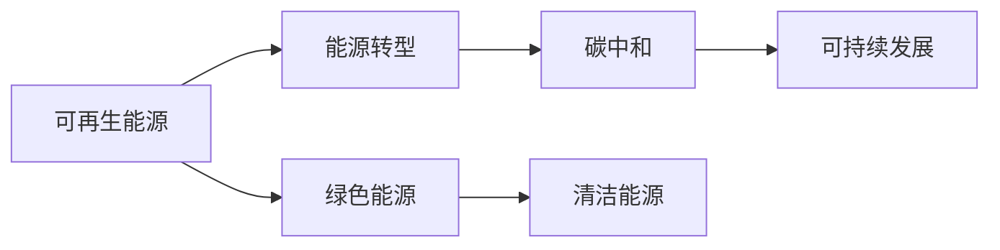
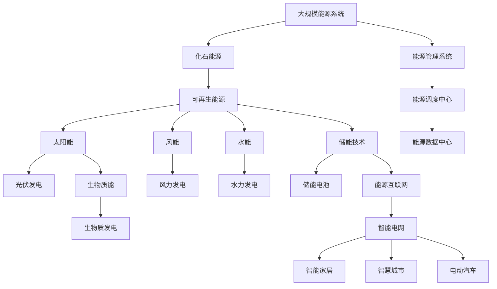

                 

# 硅谷绿色革命:可再生能源的发展

> 关键词：
1. 绿色能源
2. 可再生能源
3. 能源转型
4. 清洁能源
5. 能源效率
6. 碳中和
7. 创新科技

## 1. 背景介绍

### 1.1 问题由来

随着全球气候变化问题日益严峻，世界各国逐步意识到传统化石能源对环境的危害，寻求可再生能源替代成为了全球共识。特别是硅谷地区，作为全球科技创新中心，其可再生能源发展更是处于领先地位。硅谷的绿色革命不仅局限于科技公司内部的能源转型，更成为了引领全球可再生能源发展的典范。

### 1.2 问题核心关键点

硅谷绿色革命的核心在于充分利用其科技优势，推动可再生能源的开发和应用，实现能源的可持续发展。其主要关键点包括：

- **科技创新驱动**：硅谷汇聚了全球顶尖的科技人才，在太阳能、风能、储能等技术领域不断创新突破。
- **政策支持和法规保障**：加州政府出台了一系列鼓励可再生能源发展的政策和法规，为硅谷绿色革命提供了有力的保障。
- **企业合作与公众参与**：硅谷各公司积极合作，共同推动绿色能源项目，同时鼓励公众参与环保活动。
- **基础设施建设**：硅谷大量投资于可再生能源的基础设施建设，如太阳能电站、风力发电站、储能电池等。

### 1.3 问题研究意义

硅谷绿色革命对于全球可再生能源发展具有重要意义：

1. **示范效应**：硅谷的成功经验可以供其他地区借鉴，推动全球范围内的可再生能源转型。
2. **技术创新**：硅谷在可再生能源领域的创新，为全球提供了先进的技术解决方案。
3. **环境改善**：可再生能源的广泛应用，有助于减少温室气体排放，改善全球气候。
4. **经济转型**：绿色能源产业的发展，带动了相关产业链的升级，促进了经济增长。
5. **社会责任**：硅谷科技公司通过绿色能源项目，展现了企业的社会责任和可持续发展理念。

## 2. 核心概念与联系

### 2.1 核心概念概述

为了更好地理解硅谷绿色革命的原理和实践，本节将介绍几个关键概念：

- **可再生能源**：指在自然过程中不断更新的能源，如太阳能、风能、水能、生物质能等，与化石能源相比，对环境影响小。
- **绿色能源**：在开发和利用过程中对环境影响较小的能源，强调其清洁、可再生、高效的特点。
- **能源转型**：从传统的化石能源转向可再生能源的过程，涵盖政策、技术、经济、社会等多个层面。
- **碳中和**：通过减排和碳吸收，使排放的温室气体净额为零，实现碳平衡。

### 2.2 概念间的关系

这些核心概念之间存在着紧密的联系，形成了硅谷绿色革命的整体框架。我们可以通过以下Mermaid流程图来展示这些概念之间的关系：



这个流程图展示了可再生能源如何通过能源转型和碳中和，最终推动绿色能源的发展，实现可持续发展。

### 2.3 核心概念的整体架构

最后，我们用一个综合的流程图来展示这些核心概念在大规模能源系统中的整体架构：



这个综合流程图展示了化石能源、可再生能源、储能技术、能源互联网等多个要素如何组成大规模能源系统，通过智能调度和管理，实现高效、清洁、安全的能源供应。

## 3. 核心算法原理 & 具体操作步骤
### 3.1 算法原理概述

硅谷绿色革命的核心算法原理主要围绕可再生能源的优化利用展开，其目标是通过科技创新和优化调度，最大化可再生能源的利用率，同时减少能源浪费和环境污染。

### 3.2 算法步骤详解

硅谷绿色革命的核心算法步骤包括：

1. **数据收集与处理**：收集大规模能源系统的各类数据，包括能源生成、传输、存储、使用等数据，进行处理和清洗。
2. **能源预测与调度**：利用机器学习等技术，对太阳能、风能等可再生能源的输出进行预测，结合历史数据和实时气象信息，进行智能调度。
3. **储能系统优化**：通过优化储能系统的充放电策略，实现能量的最优分配和使用。
4. **智能电网建设**：构建智能电网，通过先进的传感器和通信技术，实时监测和控制能源流动。
5. **能源管理系统优化**：优化能源管理系统的算法，提高能源利用效率和系统的稳定性。

### 3.3 算法优缺点

硅谷绿色革命中采用的算法具有以下优点：

1. **高效能**：通过智能预测和调度，实现了能源的高效利用。
2. **低成本**：利用现有基础设施和智能技术，降低了能源转型的成本。
3. **环境友好**：减少了化石能源的使用，降低了温室气体排放。

同时，这些算法也存在一些缺点：

1. **依赖技术**：对机器学习和智能调度技术的要求较高，对技术和数据质量有较高要求。
2. **投资成本高**：初期投资于储能系统和智能电网建设较高。
3. **数据隐私**：在数据收集和处理过程中，需要严格保障数据隐私和安全。

### 3.4 算法应用领域

硅谷绿色革命中采用的算法和技术广泛应用于以下几个领域：

1. **能源管理**：在企业、校园、公共设施等场所，通过能源管理系统进行能源优化。
2. **智能电网**：在城市和乡村，构建智能电网，提升能源供应和使用的效率。
3. **分布式能源**：在家庭和社区，推广分布式能源系统，减少能源损耗。
4. **交通能源**：在公共交通和私人车辆中，推广电动汽车和新能源技术。
5. **工业能源**：在工业园区和工厂，推动绿色能源和智能制造。

## 4. 数学模型和公式 & 详细讲解 & 举例说明

### 4.1 数学模型构建

在硅谷绿色革命中，涉及到大量的数学模型和公式。这里我们以风能发电为例，构建一个简化的风能发电优化模型。

假设某风力发电场有 $n$ 个风力涡轮机，每个涡轮机在不同风速 $v_i$ 下的发电效率为 $e_i(v_i)$，涡轮机的最大发电量为 $E_i$，涡轮机维护成本为 $C_i$。设总风速为 $v$，目标是最小化发电总成本 $C$。

数学模型构建如下：

$$
\min_{v_i} C = \sum_{i=1}^n \left[ C_i + \int_{v_{i,\min}}^{v_{i,\max}} e_i(v) \mathrm{d}v \right]
$$

其中 $v_{i,\min}$ 和 $v_{i,\max}$ 为涡轮机的最小风速和最大风速。

### 4.2 公式推导过程

将上述目标函数进行简化，假设涡轮机的发电效率为常数 $e_i$，则目标函数变为：

$$
\min_{v_i} C = \sum_{i=1}^n \left[ C_i + \frac{e_i(v_{i,\max} - v_{i,\min})}{2} \right]
$$

进一步假设 $e_i$ 相等，则目标函数简化为：

$$
\min_{v_i} C = \sum_{i=1}^n \left[ C_i + \frac{e_i(v_{\max} - v_{\min})}{2} \right]
$$

其中 $v_{\max}$ 和 $v_{\min}$ 为涡轮机工作的最大和最小风速。

### 4.3 案例分析与讲解

假设某风力发电场有 10 个涡轮机，每个涡轮机的最小风速为 3 m/s，最大风速为 30 m/s，发电效率为 $e_i=0.5$，维护成本为 $C_i=5000$。

目标是最小化总成本，即：

$$
\min_{v_i} C = 10 \times \left[ 5000 + \frac{0.5 \times (30 - 3)}{2} \right] = 10 \times \left[ 5000 + \frac{0.5 \times 27}{2} \right] = 10 \times (5000 + 13.5) = 53,450
$$

这个简化的风能发电模型展示了如何通过优化涡轮机的运行参数，最大化风能利用率，减少成本。在实际应用中，还需要考虑更多的因素，如风速预测、系统稳定性、运行安全性等，进行更复杂的优化。

## 5. 项目实践：代码实例和详细解释说明

### 5.1 开发环境搭建

在硅谷绿色革命中，编程开发是实现技术创新的重要手段。以下是使用Python进行开发的环境配置流程：

1. 安装Anaconda：从官网下载并安装Anaconda，用于创建独立的Python环境。

2. 创建并激活虚拟环境：
```bash
conda create -n pyenv python=3.8 
conda activate pyenv
```

3. 安装必要的工具包：
```bash
pip install pandas numpy matplotlib scikit-learn scipy seaborn jupyter notebook ipython
```

4. 安装机器学习库：
```bash
pip install scikit-learn
```

5. 安装其他必要库：
```bash
pip install pyamg
```

完成上述步骤后，即可在虚拟环境中进行硅谷绿色革命相关技术的开发。

### 5.2 源代码详细实现

以下是使用Python实现风能发电优化模型的代码：

```python
import numpy as np
from scipy.optimize import minimize

# 定义涡轮机参数
n = 10
v_min = 3
v_max = 30
e = 0.5
C = 5000

# 定义目标函数
def objective(v):
    cost = C * n + (e * (v_max - v_min) / 2) * n
    return cost

# 定义约束条件
def constraint(v):
    return v >= v_min, v <= v_max

# 定义初始值
v0 = np.array([15] * n)

# 求解最优解
res = minimize(objective, v0, constraints=constraint)

# 输出结果
print(res.x)
```

在这个代码示例中，我们使用SciPy库的`minimize`函数，对风能发电优化模型进行求解。代码中定义了涡轮机的参数和目标函数，同时设置了约束条件。通过`minimize`函数求解得到最优解。

### 5.3 代码解读与分析

在代码中，我们使用了SciPy库的`minimize`函数来求解优化问题。这个函数接受目标函数、初始值和约束条件等参数，返回最优解。在实际应用中，还需要根据具体情况，进行更多优化和调整。

## 6. 实际应用场景

### 6.1 风能发电

风能发电是硅谷绿色革命的重要应用场景之一。通过风力涡轮机将风能转化为电能，可以大幅减少化石能源的使用，降低温室气体排放。例如，Google在俄勒冈州的新发电站，利用大规模风力涡轮机，每年减少数百万吨二氧化碳的排放。

### 6.2 太阳能光伏

太阳能光伏技术在硅谷得到了广泛应用。谷歌、苹果等公司在其园区内大规模安装太阳能光伏板，既满足了自身能源需求，又为社会贡献了清洁能源。例如，Google的Mountain View园区的光伏板发电容量达到了15MW，每年可节约数百万美元的能源费用。

### 6.3 电动汽车充电

电动汽车充电是硅谷绿色革命的另一个重要应用场景。特斯拉等公司在硅谷大规模推广电动汽车，并通过建设充电站，提供便捷的充电服务。例如，特斯拉的超级充电站，支持快速充电，使得电动汽车的应用更加普及。

### 6.4 未来应用展望

未来，硅谷绿色革命将进一步拓展到更多领域，涵盖更多的可再生能源应用。例如：

1. **储能系统**：发展更加高效的储能技术，如液流电池、压缩空气储能等，解决可再生能源的间歇性问题。
2. **智能交通**：推动电动汽车的普及，建设智能交通系统，优化交通能源使用。
3. **清洁制造**：在制造业中推广绿色制造，减少能源消耗和环境污染。
4. **智慧建筑**：通过智能建筑系统，优化能源使用，减少能源浪费。
5. **碳捕捉与存储**：研发碳捕捉与存储技术，解决碳中和问题。

## 7. 工具和资源推荐

### 7.1 学习资源推荐

为了帮助开发者系统掌握硅谷绿色革命的原理和实践，这里推荐一些优质的学习资源：

1. **OpenAI's Clean Energy AI Database**：提供了大量关于可再生能源的科研数据和论文，涵盖风能、太阳能、储能等多个领域。
2. **Siemens' Energy Field Guide**：介绍可再生能源技术和应用，涵盖风能、太阳能、电动汽车等。
3. **Google's Clean Energy Vision**：谷歌公司发布的清洁能源愿景报告，展示了其在可再生能源领域的最新进展。
4. **IEEE Transactions on Smart Grid**：IEEE出版的智能电网领域期刊，涵盖智能电网、分布式能源等前沿技术。
5. **Nature Energy**：自然出版集团的能源领域期刊，涵盖可再生能源、能源政策等研究。

通过这些学习资源，相信你一定能够快速掌握硅谷绿色革命的精髓，并用于解决实际的能源问题。

### 7.2 开发工具推荐

高效的开发离不开优秀的工具支持。以下是几款用于硅谷绿色革命开发的常用工具：

1. **Python**：作为全球最流行的编程语言，Python提供了丰富的科学计算和数据分析库，适合硅谷绿色革命中的数据处理和算法开发。
2. **SciPy**：基于NumPy的科学计算库，提供了大量高效的数学函数和算法，适用于硅谷绿色革命中的优化和计算任务。
3. **Jupyter Notebook**：交互式编程环境，方便开发者进行代码调试和实验分享。
4. **Google Colab**：谷歌提供的在线编程环境，免费提供GPU/TPU算力，方便开发者快速上手实验最新模型。
5. **TensorFlow**：谷歌开发的深度学习框架，提供了丰富的机器学习工具和算法库。

合理利用这些工具，可以显著提升硅谷绿色革命的开发效率，加快创新迭代的步伐。

### 7.3 相关论文推荐

硅谷绿色革命的科技创新离不开学界的持续研究。以下是几篇奠基性的相关论文，推荐阅读：

1. **Towards a Sustainable Energy Future**：由IEEE published的研究论文，探讨了可再生能源与未来能源系统的关系。
2. **A Distributed Energy Framework**：由Science杂志发表的研究论文，介绍了一种分布式能源系统框架。
3. **Energy Transition Strategies**：由Nature杂志发表的研究论文，分析了全球能源转型策略。
4. **Smart Grids: The Next Generation**：由IEEE出版的智能电网领域书籍，详细介绍了智能电网的技术和应用。
5. **Carbon Neutrality: Pathways Towards Climate Security**：由Nature Climate Change发表的研究报告，探讨了实现碳中和的路径。

这些论文代表了大规模能源系统研究的发展脉络，通过学习这些前沿成果，可以帮助研究者把握学科前进方向，激发更多的创新灵感。

## 8. 总结：未来发展趋势与挑战

### 8.1 总结

本文对硅谷绿色革命的原理和实践进行了全面系统的介绍。首先阐述了绿色能源和可再生能源的开发背景和意义，明确了硅谷绿色革命的科技驱动和政策保障。其次，从原理到实践，详细讲解了绿色能源开发和利用中的核心算法和操作步骤。同时，本文还探讨了绿色能源在不同应用场景中的实际应用，展示了硅谷绿色革命的广泛影响。最后，本文精选了绿色能源开发的相关学习资源和开发工具，力求为读者提供全方位的技术指引。

通过本文的系统梳理，可以看到，硅谷绿色革命不仅在技术上取得了显著成果，更在环保、经济、社会等多个方面产生了深远影响。未来，随着技术不断创新和应用，硅谷绿色革命必将在全球可再生能源领域发挥更大的作用，推动全球能源系统的可持续发展。

### 8.2 未来发展趋势

展望未来，硅谷绿色革命将呈现以下几个发展趋势：

1. **技术创新加速**：随着科技的进步，绿色能源技术将不断突破，如更高效的太阳能电池、更稳定的风力涡轮机等。
2. **成本下降**：随着规模化生产和应用，绿色能源的成本将进一步下降，加速普及。
3. **政策支持加强**：各国政府将进一步出台鼓励绿色能源发展的政策，提供更多支持和保障。
4. **国际合作深化**：全球范围内的能源转型需要各国共同努力，技术共享和经验交流将更加频繁。
5. **公众参与增强**：公众对环保意识的提升，将推动更多绿色能源项目的发展。

### 8.3 面临的挑战

尽管硅谷绿色革命取得了显著成就，但在迈向更加智能化、普适化应用的过程中，它仍面临诸多挑战：

1. **技术复杂性**：绿色能源技术的复杂性，如储能系统的设计和管理，需要高水平的专业知识和经验。
2. **成本高昂**：大规模推广绿色能源需要大量的初期投资，尤其是在基础设施建设方面。
3. **数据隐私**：在数据采集和处理过程中，需要严格保障数据隐私和安全。
4. **系统兼容性**：不同能源系统的兼容性问题，如智能电网与现有电网的融合，仍需解决。
5. **环境适应性**：不同地区的气候和地理条件，对绿色能源的应用和效果有很大影响。

### 8.4 研究展望

面对硅谷绿色革命面临的种种挑战，未来的研究需要在以下几个方面寻求新的突破：

1. **技术集成创新**：将绿色能源技术与其他科技领域（如互联网、物联网）进行融合，推动技术集成创新。
2. **成本优化策略**：研究低成本绿色能源技术，降低初期投资和运营成本。
3. **数据隐私保护**：开发数据隐私保护技术，确保数据采集和处理的合法合规。
4. **系统兼容性优化**：提升不同能源系统的兼容性，实现无缝融合。
5. **环境适应性优化**：针对不同地区的气候和地理条件，优化绿色能源的应用策略。

这些研究方向的研究突破，将进一步推动硅谷绿色革命的发展，为全球能源系统的可持续发展做出更大的贡献。

## 9. 附录：常见问题与解答

**Q1：如何实现风能发电的优化调度？**

A: 实现风能发电的优化调度，可以采用以下步骤：

1. 收集风速、风向、气象等数据，建立风能发电模型。
2. 利用机器学习算法，对风能输出进行预测。
3. 根据预测结果，优化风力涡轮机的运行参数，实现智能调度。

**Q2：硅谷绿色革命是否适用于其他地区？**

A: 硅谷绿色革命的成功经验，可以供其他地区借鉴。但每个地区的气候、地理、政策等因素不同，需要进行本地化适应和调整。

**Q3：硅谷绿色革命的短期效益和长期效益是什么？**

A: 硅谷绿色革命的短期效益包括：

- 减少化石能源消耗
- 降低温室气体排放
- 节约能源成本

长期效益包括：

- 促进绿色能源产业的发展
- 推动经济结构转型
- 提升社会环保意识

**Q4：在实施硅谷绿色革命中，如何保障数据隐私？**

A: 保障数据隐私是实施硅谷绿色革命的关键。可以采取以下措施：

- 数据匿名化处理
- 数据加密传输
- 访问控制机制
- 隐私保护法规

**Q5：如何应对绿色能源技术的复杂性？**

A: 应对绿色能源技术的复杂性，可以采取以下措施：

- 跨学科合作
- 科研机构与企业合作
- 开发标准化技术
- 培养专业人才

总之，硅谷绿色革命是一个多方面的系统工程，需要从技术、政策、经济、社会等多个维度共同努力，才能实现可再生能源的可持续发展。未来，随着技术的不断进步和政策的持续支持，硅谷绿色革命必将为全球能源转型提供更多借鉴和启示。

---

作者：禅与计算机程序设计艺术 / Zen and the Art of Computer Programming

