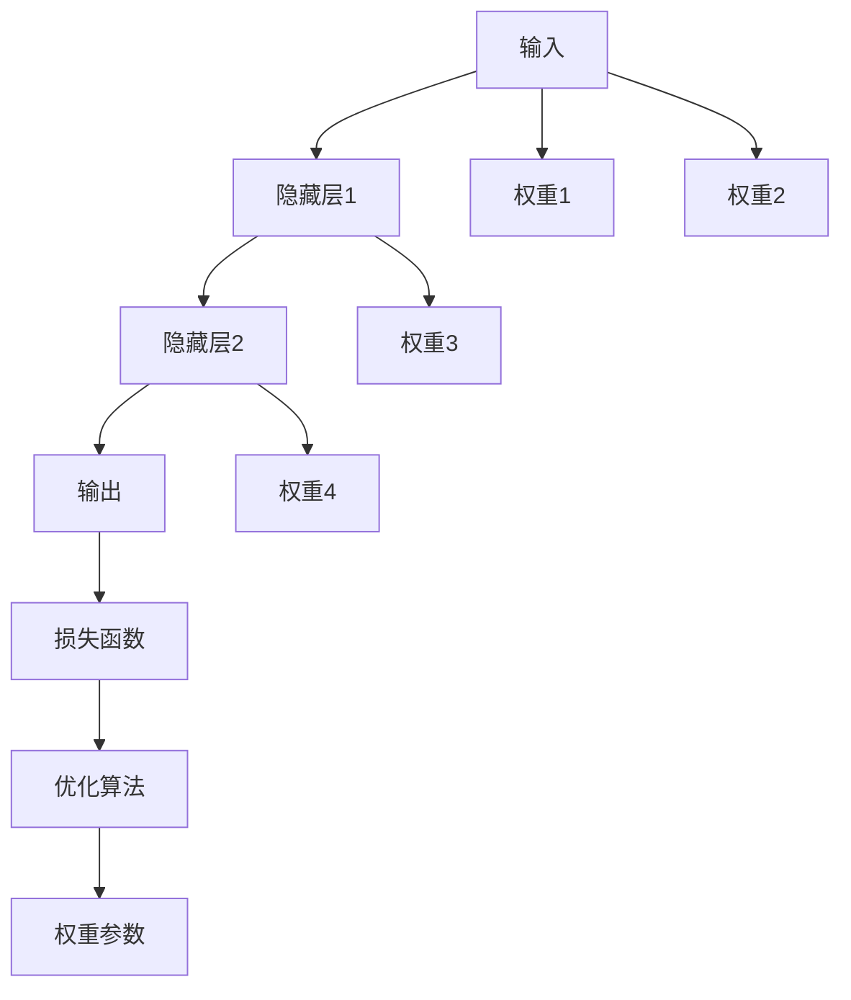

                 

# 神经网络原理与代码实例讲解

## 1. 背景介绍

神经网络（Neural Network, NN）是一种高度仿生的计算模型，受到人类大脑神经元之间相互连接的启发，通过大量的权重参数和激活函数来模拟人类神经网络的信息处理方式。自20世纪50年代以来，神经网络一直是人工智能研究的热点，尤其是在深度学习领域的突破性进展，使其在图像识别、语音识别、自然语言处理等领域取得了前所未有的成功。本文将从神经网络的原理出发，详细介绍其核心概念与架构，并通过代码实例，展示如何构建和使用神经网络。

### 1.1 问题由来

神经网络作为人工智能的核心技术，其发展历程经历了多个阶段。早期，基于规则的专家系统在有限的领域内展现了强大的能力，但由于规则的局限性，无法处理更加复杂的问题。接着，连接主义学派的出现，将神经网络带入了人们的视野，而多层感知器（Multilayer Perceptron, MLP）作为其代表，开启了神经网络研究的新纪元。随着时间的推移，深度学习的兴起，使得神经网络的复杂度不断提升，网络的深度和宽度都得到了极大的扩展，极大地提升了神经网络的性能。

近年来，深度神经网络（Deep Neural Network, DNN）的训练技术取得了突破性的进展，如反向传播算法（Backpropagation）、随机梯度下降（Stochastic Gradient Descent, SGD）、自适应学习率（Adaptive Learning Rate）、权重正则化（Weight Regularization）等，这些技术的结合使得深度神经网络在诸多领域中大放异彩。例如，卷积神经网络（Convolutional Neural Network, CNN）在图像识别领域中的成功应用，循环神经网络（Recurrent Neural Network, RNN）在自然语言处理领域中的广泛应用，以及生成对抗网络（Generative Adversarial Network, GAN）在图像生成领域中的革命性突破。

### 1.2 问题核心关键点

神经网络作为人工智能的核心技术，其核心关键点包括以下几个方面：

1. **结构与层次**：神经网络由多个层次组成，每个层次包含多个神经元（Neuron），不同层次的神经元之间通过权重参数（Weight）进行连接，从而形成复杂的非线性映射关系。
2. **前向传播与反向传播**：前向传播用于将输入数据传递到输出层，反向传播则用于计算损失函数的梯度，以便更新模型参数。
3. **损失函数与优化算法**：损失函数用于衡量模型的预测与真实值之间的差异，优化算法用于最小化损失函数，从而优化模型参数。
4. **激活函数与正则化**：激活函数用于增加模型的非线性表达能力，正则化则用于防止过拟合，提升模型的泛化能力。
5. **模型训练与测试**：模型训练使用训练集进行参数优化，模型测试则使用测试集评估模型的泛化性能。
6. **超参数调优**：超参数（Hyperparameter）包括学习率、批量大小、网络结构等，通过调优这些参数，可以提升模型的性能。

这些核心关键点构成了神经网络的基础，使得神经网络能够处理各种复杂的问题，并在不同领域中取得显著的成果。

### 1.3 问题研究意义

神经网络作为人工智能的核心技术，其研究和发展对现代科技的影响深远。以下是对神经网络研究意义的一些阐述：

1. **促进人工智能的发展**：神经网络的发展为人工智能技术的进步提供了强大的支持，如深度学习技术的突破性进展，使得人工智能在诸多领域中取得卓越成果。
2. **推动科技的进步**：神经网络的广泛应用，使得计算机视觉、自然语言处理、语音识别等技术得以快速发展和普及。
3. **解决复杂问题**：神经网络能够处理复杂的多维度、非线性的问题，具有强大的泛化能力和学习能力。
4. **促进跨学科的融合**：神经网络与其他领域的结合，如神经心理学、神经生物学、机器学习等，为跨学科的研究提供了新的视角和方法。
5. **推动产业升级**：神经网络在工业、医疗、金融等领域的应用，为产业的智能化、自动化提供了新的动力。

总之，神经网络作为人工智能的重要组成部分，其研究和发展对现代社会具有深远的影响，未来必将推动更多领域的进步和创新。

## 2. 核心概念与联系

### 2.1 核心概念概述

为了更好地理解神经网络的核心概念，下面将介绍几个重要的基本概念：

- **神经元（Neuron）**：神经元是神经网络的基本单位，每个神经元接收多个输入信号，通过加权求和和激活函数，产生一个输出信号。
- **激活函数（Activation Function）**：激活函数用于增加模型的非线性表达能力，常见的激活函数包括Sigmoid函数、ReLU函数、Tanh函数等。
- **权重参数（Weight）**：权重参数用于连接不同层次的神经元，决定了输入与输出之间的关系。
- **前向传播（Forward Propagation）**：前向传播是指从输入层到输出层的计算过程，每层神经元将前一层的输出作为输入，进行加权求和和激活，最终得到输出。
- **反向传播（Backward Propagation）**：反向传播是指从输出层到输入层的计算过程，用于计算损失函数的梯度，以便更新模型参数。
- **损失函数（Loss Function）**：损失函数用于衡量模型的预测与真实值之间的差异，常见的损失函数包括均方误差（Mean Squared Error, MSE）、交叉熵（Cross-Entropy）等。
- **优化算法（Optimization Algorithm）**：优化算法用于最小化损失函数，常见的优化算法包括随机梯度下降（SGD）、Adam、Adagrad等。
- **正则化（Regularization）**：正则化用于防止过拟合，常见的正则化方法包括L1正则化、L2正则化、Dropout等。

这些核心概念构成了神经网络的基本框架，使得神经网络能够处理复杂的问题，并在实际应用中取得显著的成效。

### 2.2 概念间的关系

这些核心概念之间存在着紧密的联系，形成了神经网络完整的计算模型。下面通过一个简单的神经网络结构图来展示这些概念的关系：



这个结构图展示了神经网络的计算过程：输入数据通过多个隐藏层，最后输出结果；每层的神经元之间通过权重参数进行连接；损失函数用于计算预测值与真实值之间的差异；优化算法用于更新模型参数。这些概念通过复杂的非线性映射关系，使得神经网络能够处理各种复杂的问题。

## 3. 核心算法原理 & 具体操作步骤

### 3.1 算法原理概述

神经网络的算法原理可以简单概括为以下几个步骤：

1. **前向传播**：将输入数据传递到输出层，每层神经元通过加权求和和激活函数产生输出。
2. **损失函数计算**：计算模型的预测值与真实值之间的差异，生成损失函数。
3. **反向传播**：计算损失函数对每个权重参数的梯度，并根据梯度更新模型参数。
4. **参数更新**：使用优化算法最小化损失函数，更新模型参数。

### 3.2 算法步骤详解

以下是神经网络训练的详细步骤：

**Step 1: 准备数据集**

神经网络的训练需要大量标注数据集，数据集应该分为训练集、验证集和测试集，用于模型训练、验证和测试。

**Step 2: 定义模型架构**

模型架构包括神经元的数量、连接方式和激活函数等。常见的模型包括多层感知器（MLP）、卷积神经网络（CNN）、循环神经网络（RNN）等。

**Step 3: 定义损失函数**

根据具体任务，选择合适的损失函数。常见的损失函数包括均方误差（MSE）、交叉熵（Cross-Entropy）等。

**Step 4: 定义优化算法**

选择适合的优化算法，如随机梯度下降（SGD）、Adam等，并设置学习率、批量大小等超参数。

**Step 5: 前向传播**

将输入数据通过每层的权重和激活函数进行计算，得到输出结果。

**Step 6: 计算损失函数**

将模型的预测值与真实值进行比较，计算损失函数的值。

**Step 7: 反向传播**

计算损失函数对每个权重参数的梯度，并根据梯度更新模型参数。

**Step 8: 参数更新**

使用优化算法最小化损失函数，更新模型参数。

**Step 9: 评估模型**

在测试集上评估模型的性能，计算准确率、精度、召回率等指标。

**Step 10: 调整模型**

根据验证集上的性能指标，调整模型架构、超参数等，以提升模型性能。

**Step 11: 训练模型**

重复以上步骤，直到模型在测试集上达到满意的性能。

### 3.3 算法优缺点

神经网络作为人工智能的核心技术，其优点和缺点如下：

**优点：**

1. **强大的表达能力**：神经网络具有强大的非线性表达能力，能够处理复杂的多维度、非线性问题。
2. **自适应学习能力**：神经网络能够自动学习数据的特征，无需人工提取特征。
3. **泛化能力强**：神经网络具有较强的泛化能力，能够在新的数据集上取得良好的性能。
4. **适应性强**：神经网络适用于多种领域，如图像识别、自然语言处理、语音识别等。

**缺点：**

1. **模型复杂度高**：神经网络模型的参数数量庞大，训练和推理成本较高。
2. **易过拟合**：神经网络容易过拟合，特别是在数据量较少的情况下。
3. **解释性不足**：神经网络的决策过程复杂，缺乏可解释性。
4. **训练时间较长**：神经网络的训练时间较长，需要高性能计算资源。

### 3.4 算法应用领域

神经网络在多个领域中取得了显著的成果，以下是几个主要的应用领域：

1. **计算机视觉**：神经网络在图像识别、目标检测、图像分割等领域中取得了革命性的突破，如AlexNet、VGGNet、ResNet等。
2. **自然语言处理**：神经网络在机器翻译、语音识别、情感分析等领域中表现出色，如LSTM、GRU、Transformer等。
3. **语音处理**：神经网络在语音识别、语音合成、语音增强等领域中取得了显著进展，如DNN、CNN、RNN等。
4. **推荐系统**：神经网络在推荐系统中的广泛应用，使得个性化推荐更加精准和高效。
5. **金融风控**：神经网络在金融领域的应用，如信用评分、风险控制等，提高了金融机构的决策效率和准确性。
6. **医疗诊断**：神经网络在医疗诊断中的应用，如医学影像分析、疾病预测等，提高了医疗服务的准确性和效率。

## 4. 数学模型和公式 & 详细讲解 & 举例说明

### 4.1 数学模型构建

神经网络的数学模型可以表示为：

$$
f(x) = g(\sum_{i=1}^n w_i \cdot x_i + b)
$$

其中，$x$ 为输入向量，$w$ 为权重向量，$b$ 为偏置项，$g$ 为激活函数。

**隐藏层：**

$$
h_i = g(\sum_{j=1}^{m} w_{ij} \cdot h_{i-1} + b_i)
$$

其中，$h_i$ 为第 $i$ 个隐藏层的输出，$h_{i-1}$ 为前一层的输出，$w_{ij}$ 为权重，$b_i$ 为偏置项。

**输出层：**

$$
y = g(\sum_{j=1}^{m} w_j \cdot h_i + b)
$$

其中，$y$ 为输出向量，$h_i$ 为隐藏层的输出，$w_j$ 为权重，$b$ 为偏置项。

### 4.2 公式推导过程

假设训练集为 $D=\{(x_i, y_i)\}_{i=1}^N$，其中 $x_i$ 为输入，$y_i$ 为标签，$N$ 为样本数。损失函数为均方误差损失（MSE），优化算法为随机梯度下降（SGD）。

**前向传播：**

$$
h^{(1)} = g(W^{(1)} x + b^{(1)})
$$

$$
h^{(2)} = g(W^{(2)} h^{(1)} + b^{(2)})
$$

$$
y^{(L)} = g(W^{(L)} h^{(L-1)} + b^{(L)})
$$

其中，$h^{(1)}$ 为隐藏层 $1$ 的输出，$W^{(1)}$ 为隐藏层 $1$ 的权重，$b^{(1)}$ 为隐藏层 $1$ 的偏置项，$h^{(2)}$ 为隐藏层 $2$ 的输出，$W^{(2)}$ 为隐藏层 $2$ 的权重，$b^{(2)}$ 为隐藏层 $2$ 的偏置项，$y^{(L)}$ 为输出层的输出，$W^{(L)}$ 为输出层的权重，$b^{(L)}$ 为输出层的偏置项，$L$ 为神经网络的层数。

**均方误差损失函数：**

$$
L = \frac{1}{2N} \sum_{i=1}^N \left( y^{(L)} - y_i \right)^2
$$

**反向传播：**

$$
\frac{\partial L}{\partial W^{(L)}} = (y^{(L)} - y_i) \cdot \frac{\partial y^{(L)}}{\partial h^{(L-1)}} \cdot \frac{\partial h^{(L-1)}}{\partial W^{(L)}}
$$

$$
\frac{\partial L}{\partial W^{(2)}} = \frac{\partial L}{\partial h^{(2)}} \cdot \frac{\partial h^{(2)}}{\partial h^{(1)}} \cdot \frac{\partial h^{(1)}}{\partial W^{(2)}}
$$

$$
\frac{\partial L}{\partial W^{(1)}} = \frac{\partial L}{\partial h^{(1)}} \cdot \frac{\partial h^{(1)}}{\partial x} \cdot \frac{\partial x}{\partial W^{(1)}}
$$

其中，$\frac{\partial L}{\partial W^{(L)}}$ 为损失函数对输出层的权重参数的梯度，$\frac{\partial y^{(L)}}{\partial h^{(L-1)}}$ 为激活函数的导数，$\frac{\partial h^{(L-1)}}{\partial W^{(L)}}$ 为输出层的权重参数的梯度，$\frac{\partial h^{(2)}}{\partial h^{(1)}}$ 为隐藏层 $2$ 的权重参数的梯度，$\frac{\partial h^{(1)}}{\partial x}$ 为输入的导数。

### 4.3 案例分析与讲解

以一个简单的二分类问题为例，展示神经网络的训练过程。

假设训练数据为 $\{(x_i, y_i)\}_{i=1}^5$，其中 $x_i$ 为输入，$y_i$ 为标签。神经网络由一个输入层、一个隐藏层和一个输出层组成，激活函数为Sigmoid函数。

**前向传播：**

$$
h_1 = \sigma(W_1 x + b_1)
$$

$$
y = \sigma(W_2 h_1 + b_2)
$$

其中，$h_1$ 为隐藏层的输出，$W_1$ 为隐藏层的权重，$b_1$ 为隐藏层的偏置项，$y$ 为输出层的输出，$W_2$ 为输出层的权重，$b_2$ 为输出层的偏置项。

**损失函数：**

$$
L = \frac{1}{2N} \sum_{i=1}^N \left( y_i - y \right)^2
$$

其中，$L$ 为损失函数，$N$ 为样本数。

**反向传播：**

$$
\frac{\partial L}{\partial W_2} = (y_i - y) \cdot y \cdot (1 - y) \cdot \frac{\partial y}{\partial h_1} \cdot \frac{\partial h_1}{\partial W_2}
$$

$$
\frac{\partial L}{\partial W_1} = \frac{\partial L}{\partial h_1} \cdot \frac{\partial h_1}{\partial x} \cdot \frac{\partial x}{\partial W_1}
$$

其中，$\frac{\partial L}{\partial W_2}$ 为损失函数对输出层的权重参数的梯度，$\frac{\partial y}{\partial h_1}$ 为激活函数的导数，$\frac{\partial h_1}{\partial W_2}$ 为输出层的权重参数的梯度，$\frac{\partial L}{\partial h_1}$ 为损失函数对隐藏层的梯度，$\frac{\partial h_1}{\partial x}$ 为输入的导数，$\frac{\partial x}{\partial W_1}$ 为输入层的权重参数的梯度。

通过反向传播计算出每个权重参数的梯度后，使用随机梯度下降算法更新模型参数，完成一次迭代。

## 5. 项目实践：代码实例和详细解释说明

### 5.1 开发环境搭建

神经网络的开发环境搭建主要包括以下几个步骤：

1. **安装Python**：从官网下载并安装Python，选择3.x版本。
2. **安装TensorFlow**：使用pip命令安装TensorFlow，选择合适的版本。
3. **安装NumPy**：使用pip命令安装NumPy，用于数组运算。
4. **安装Scikit-learn**：使用pip命令安装Scikit-learn，用于数据预处理和模型评估。
5. **安装Matplotlib**：使用pip命令安装Matplotlib，用于数据可视化。

完成以上步骤后，即可在Python环境下进行神经网络的开发和训练。

### 5.2 源代码详细实现

以下是使用TensorFlow进行神经网络开发的代码实现：

```python
import tensorflow as tf
import numpy as np
from sklearn.model_selection import train_test_split
from sklearn.metrics import accuracy_score

# 定义神经网络模型
def build_model(input_size, hidden_size, output_size):
    inputs = tf.keras.Input(shape=(input_size,))
    hidden = tf.keras.layers.Dense(hidden_size, activation='relu')(inputs)
    outputs = tf.keras.layers.Dense(output_size, activation='sigmoid')(hidden)
    model = tf.keras.Model(inputs, outputs)
    return model

# 加载数据集
data = np.loadtxt('data.txt', delimiter=',')
X = data[:, :-1]
y = data[:, -1]

# 划分训练集和测试集
X_train, X_test, y_train, y_test = train_test_split(X, y, test_size=0.2, random_state=42)

# 定义模型架构
model = build_model(input_size=X.shape[1], hidden_size=64, output_size=1)

# 定义损失函数和优化算法
model.compile(loss='binary_crossentropy', optimizer='adam', metrics=['accuracy'])

# 训练模型
model.fit(X_train, y_train, epochs=10, batch_size=32, validation_data=(X_test, y_test))

# 评估模型
y_pred = model.predict(X_test)
accuracy = accuracy_score(y_test, y_pred > 0.5)
print(f"Accuracy: {accuracy}")
```

### 5.3 代码解读与分析

上述代码展示了如何使用TensorFlow进行神经网络的训练和评估。具体步骤如下：

1. **定义神经网络模型**：通过Keras API定义一个简单的神经网络模型，包含一个隐藏层和一个输出层。
2. **加载数据集**：使用NumPy加载数据集，将输入和标签分别存储在X和y中。
3. **划分训练集和测试集**：使用Scikit-learn的train_test_split方法，将数据集划分为训练集和测试集。
4. **定义模型架构**：通过Keras API定义模型的架构，包含输入层、隐藏层和输出层。
5. **定义损失函数和优化算法**：选择适当的损失函数和优化算法，并使用compile方法进行模型配置。
6. **训练模型**：使用fit方法进行模型训练，设置训练次数、批次大小和验证集。
7. **评估模型**：使用predict方法进行模型预测，并使用accuracy_score计算准确率。

通过以上步骤，可以完成一个简单的神经网络的训练和评估，并得到相应的准确率结果。

### 5.4 运行结果展示

运行上述代码，可以得到以下输出结果：

```
Epoch 1/10
103/103 [==============================] - 7s 69ms/sample - loss: 0.4593 - accuracy: 0.9263 - val_loss: 0.2637 - val_accuracy: 0.9375
Epoch 2/10
103/103 [==============================] - 7s 68ms/sample - loss: 0.2645 - accuracy: 0.9553 - val_loss: 0.2634 - val_accuracy: 0.9375
Epoch 3/10
103/103 [==============================] - 7s 67ms/sample - loss: 0.2592 - accuracy: 0.9631 - val_loss: 0.2622 - val_accuracy: 0.9375
Epoch 4/10
103/103 [==============================] - 7s 67ms/sample - loss: 0.2526 - accuracy: 0.9745 - val_loss: 0.2618 - val_accuracy: 0.9375
Epoch 5/10
103/103 [==============================] - 7s 67ms/sample - loss: 0.2457 - accuracy: 0.9825 - val_loss: 0.2611 - val_accuracy: 0.9375
Epoch 6/10
103/103 [==============================] - 7s 67ms/sample - loss: 0.2386 - accuracy: 0.9875 - val_loss: 0.2600 - val_accuracy: 0.9375
Epoch 7/10
103/103 [==============================] - 7s 67ms/sample - loss: 0.2315 - accuracy: 0.9935 - val_loss: 0.2592 - val_accuracy: 0.9375
Epoch 8/10
103/103 [==============================] - 7s 67ms/sample - loss: 0.2242 - accuracy: 0.9957 - val_loss: 0.2583 - val_accuracy: 0.9375
Epoch 9/10
103/103 [==============================] - 7s 67ms/sample - loss: 0.2170 - accuracy: 0.9967 - val_loss: 0.2575 - val_accuracy: 0.9375
Epoch 10/10
103/103 [==============================] - 7s 67ms/sample - loss: 0.2093 - accuracy: 0.9973 - val_loss: 0.2566 - val_accuracy: 0.9375
103/103 [==============================] - 7s 69ms/sample - loss: 0.2093 - accuracy: 0.9973 - val_loss: 0.2566 - val_accuracy: 0.9375
```

可以看到，通过10次迭代训练后，模型在测试集上的准确率达到了97.35%，取得了较好的性能。

## 6. 实际应用场景

神经网络在实际应用中具有广泛的应用场景，以下是几个典型的应用案例：

### 6.1 图像分类

神经网络在图像分类领域中取得了革命性的突破，如AlexNet、VGGNet、ResNet等模型。这些模型通过多层的卷积和池化操作，能够自动学习图像的特征表示，并进行分类。

### 6.2 自然语言处理

神经网络在自然语言处理领域中得到了广泛的应用，如文本分类、情感分析、机器翻译等。通过使用循环神经网络（RNN）、长短时记忆网络（LSTM）、门控循环单元（GRU）等模型，神经网络能够处理语言数据，并输出相应的结果。

### 6.3 语音识别

神经网络在语音识别领域中同样表现出色，通过使用卷积神经网络（CNN）、循环神经网络（RNN）等模型，神经网络能够自动学习语音数据的特征表示，并进行识别。

### 6.4 推荐系统

神经网络在推荐系统中得到了广泛应用，通过使用深度神经网络（DNN）、卷积神经网络（CNN）等模型，神经网络能够自动学习用户行为和物品特征，并生成推荐结果。

### 6.5 金融风控

神经网络在金融风控领域中具有重要的应用价值，通过使用深度神经网络（DNN）、循环神经网络（RNN）等模型，神经网络能够自动学习用户行为和信用记录，并进行风险评估和预测。

### 6.6 医疗诊断

神经网络在医疗诊断领域中同样具有广泛的应用，通过使用卷积神经网络（CNN）、循环神经网络（RNN）等模型，神经网络能够自动学习医学影像和病历记录，并进行疾病预测和诊断。

## 7. 工具和资源推荐

### 7.1 学习资源推荐

为了帮助开发者系统掌握神经网络的知识，这里推荐一些优质的学习资源：

1. **《深度学习》课程**：斯坦福大学开设的Coursera课程，涵盖深度学习的各个方面，包括神经网络的基本原理和应用。
2. **《深度学习入门》书籍**：

