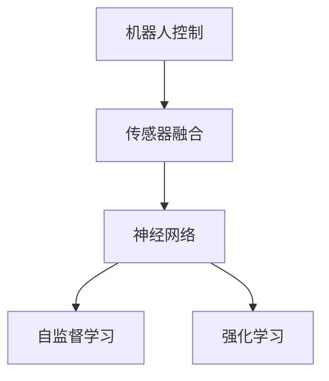
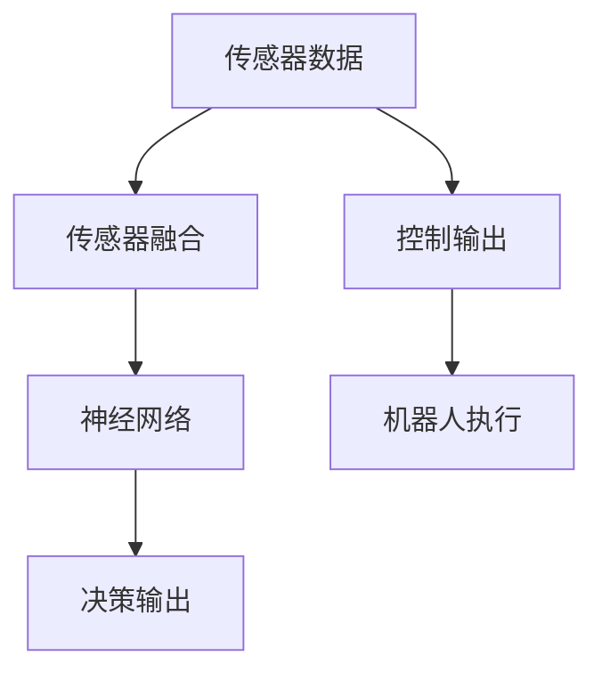
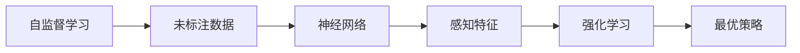
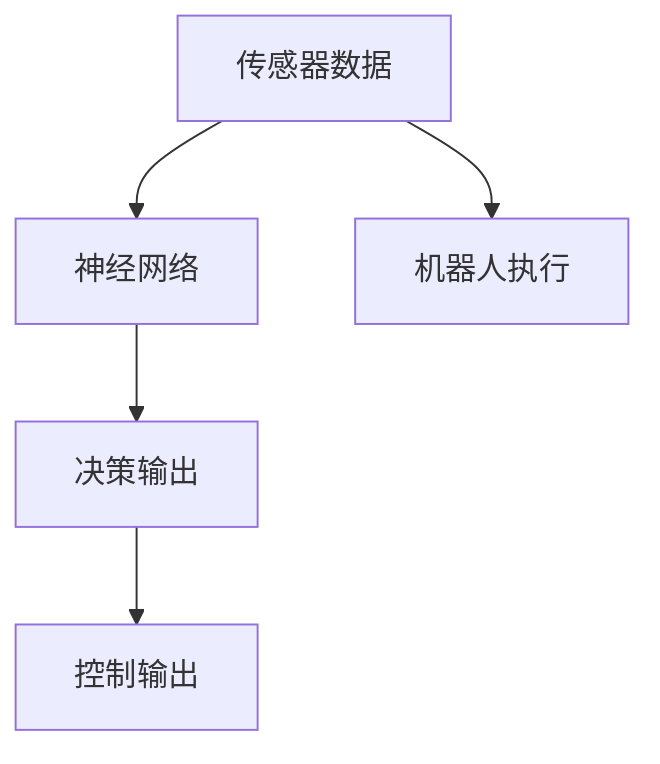
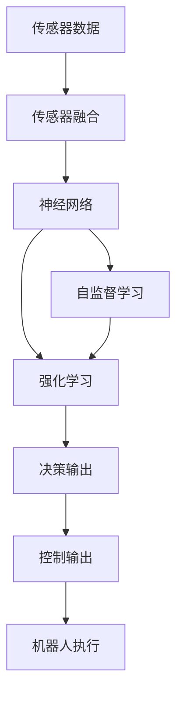

                 

## 1. 背景介绍

### 1.1 问题由来

在过去几十年中，机器人技术已经取得了飞速的发展，广泛应用于工业制造、物流运输、家庭服务等多个领域。然而，当前大多数机器人依然依赖于预设的规则和计划，难以自主应对复杂多变的现实环境。这限制了机器人在自主性和智能性方面的提升，迫切需要新的技术手段来改进机器人控制系统的性能。

### 1.2 问题核心关键点

要改善机器人控制系统，需要利用神经网络（Neural Networks, NN）的学习能力，使其能够自主地从传感器数据中提取特征，并基于这些特征进行决策和控制。具体来说，需要解决以下核心问题：

1. 传感器数据的表示与特征提取：如何将机器人传感器数据（如深度传感器、摄像头等）转换成可用于训练神经网络的输入数据。
2. 机器人控制模型的设计：如何构建适合的神经网络模型，使其能够接收传感器数据并输出相应的控制命令。
3. 学习与优化：通过训练神经网络，使其能够在特定环境下优化控制性能。
4. 实际应用：如何将训练好的神经网络应用到实际机器人控制系统中，提升系统稳定性和鲁棒性。

### 1.3 问题研究意义

神经网络在机器人控制中的应用，对于提升机器人的自主性和智能性具有重要意义：

1. 提高决策准确性：通过学习大量环境数据，神经网络能够自动提取关键特征，并优化决策过程，减少人为干预。
2. 增强环境适应性：神经网络可以适应多种环境条件，自主调整控制策略，提高机器人在不同场景下的适应能力。
3. 提升系统稳定性：通过不断的学习和优化，神经网络可以逐步提升控制系统性能，降低系统故障率。
4. 加速应用开发：神经网络可以加速机器人控制系统的开发和部署，降低开发成本和周期。
5. 促进跨领域融合：神经网络可以将机器视觉、语音识别等技术整合到机器人控制系统中，实现跨领域融合。

## 2. 核心概念与联系

### 2.1 核心概念概述

为更好地理解神经网络在机器人控制中的应用，本节将介绍几个密切相关的核心概念：

- **机器人控制**：指机器人系统根据输入指令或传感器数据，自动进行运动和操作的过程。传统上依赖于传感器融合、路径规划、控制算法等技术。
- **神经网络**：一种由大量神经元（或称节点）组成的计算模型，通过学习输入数据和目标输出之间的映射关系，实现对复杂问题的自动建模和预测。
- **传感器融合**：将多个传感器数据进行融合处理，生成更加全面、准确的环境感知信息。
- **自监督学习**：使用未标注的数据进行训练，无需人为干预，学习数据的潜在特征和关系。
- **强化学习**：通过与环境交互，学习最优决策策略，使机器人能够在特定环境下获得最优性能。

这些核心概念之间的逻辑关系可以通过以下Mermaid流程图来展示：



这个流程图展示了大语言模型的核心概念及其之间的关系：

1. 机器人控制依赖于传感器数据，传感器融合是将多源数据进行综合处理。
2. 神经网络作为核心模型，通过自监督学习和强化学习，从传感器数据中学习到对环境的感知和决策策略。

### 2.2 概念间的关系

这些核心概念之间存在着紧密的联系，形成了神经网络在机器人控制中的应用框架。下面我们通过几个Mermaid流程图来展示这些概念之间的关系。

#### 2.2.1 机器人控制流程



这个流程图展示了从传感器数据输入到机器人执行的完整控制流程：传感器数据通过融合处理，输入神经网络进行学习，生成决策输出，最后通过控制器执行。

#### 2.2.2 自监督学习与强化学习的联系



这个流程图展示了自监督学习与强化学习在机器人控制中的应用：自监督学习从未标注数据中学习感知特征，强化学习通过与环境交互，优化决策策略。

#### 2.2.3 神经网络在机器人控制中的应用



这个流程图展示了神经网络在机器人控制中的应用：传感器数据输入神经网络进行学习，生成决策输出，最后通过控制器执行。

### 2.3 核心概念的整体架构

最后，我们用一个综合的流程图来展示这些核心概念在大语言模型微调过程中的整体架构：



这个综合流程图展示了从传感器数据输入到机器人执行的完整控制流程，以及自监督学习和强化学习在其中的作用。通过这些核心概念的有机结合，神经网络在机器人控制中的应用得以实现。

## 3. 核心算法原理 & 具体操作步骤
### 3.1 算法原理概述

神经网络在机器人控制中的应用，主要涉及以下几个关键环节：

1. **数据预处理**：将传感器数据转换成神经网络可接受的输入格式。
2. **特征提取**：通过神经网络，从传感器数据中提取有用的特征。
3. **模型训练**：使用传感器数据和目标控制输出，训练神经网络模型。
4. **模型部署**：将训练好的神经网络模型集成到机器人控制系统中，实现实时控制。

### 3.2 算法步骤详解

以下是神经网络在机器人控制中的具体实施步骤：

1. **传感器数据采集**：使用深度传感器、摄像头等设备，采集机器人当前环境的数据。
2. **数据预处理**：对采集到的传感器数据进行清洗、滤波、归一化等预处理操作，转换为神经网络可接受的格式。
3. **特征提取**：通过构建的神经网络模型，从预处理后的数据中提取有用的特征。
4. **模型训练**：使用采集到的数据和目标控制输出，训练神经网络模型，优化模型参数。
5. **模型评估**：在测试集上评估训练好的模型，确保其在实际环境中的表现。
6. **模型部署**：将训练好的模型集成到机器人控制系统中，实现实时控制。

### 3.3 算法优缺点

神经网络在机器人控制中的应用具有以下优点：

1. **自主学习能力**：神经网络能够自主学习环境特征，适应不同环境条件，提升控制系统的鲁棒性和泛化能力。
2. **实时性**：神经网络可以实时处理传感器数据，快速生成控制决策，提高控制系统的响应速度。
3. **灵活性**：神经网络可以灵活调整网络结构，适应不同任务需求，具有较高的灵活性。

同时，神经网络在机器人控制中也有一些局限性：

1. **模型复杂性**：神经网络结构复杂，训练和推理过程需要较大的计算资源，增加了系统复杂性。
2. **训练数据需求**：神经网络需要大量的标注数据进行训练，难以适应缺乏标注数据的环境。
3. **可解释性不足**：神经网络模型通常是一个"黑盒"，难以解释其决策过程，缺乏可解释性。
4. **数据依赖性**：神经网络模型的性能依赖于传感器数据的质量，传感器故障或数据异常会导致模型失效。

### 3.4 算法应用领域

神经网络在机器人控制中的应用已经涵盖了多个领域，包括但不限于以下方面：

- **工业机器人**：用于零件装配、搬运、焊接等任务，通过神经网络优化路径规划和运动控制。
- **物流机器人**：用于仓储和物流配送，通过神经网络优化导航和路径规划。
- **服务机器人**：用于家庭服务、安保等任务，通过神经网络提升机器人对环境的感知和响应能力。
- **医疗机器人**：用于手术辅助、康复训练等任务，通过神经网络优化手术路径和康复策略。
- **农业机器人**：用于田间作业、病虫害监测等任务，通过神经网络优化作业策略和环境感知。

## 4. 数学模型和公式 & 详细讲解 & 举例说明

### 4.1 数学模型构建

在机器人控制中，神经网络的输入通常为传感器数据，输出为控制指令或决策策略。假设神经网络模型为 $M_{\theta}$，其中 $\theta$ 为模型参数。给定传感器数据 $x$ 和目标控制输出 $y$，神经网络的损失函数定义为：

$$
\mathcal{L}(M_{\theta}) = \frac{1}{N}\sum_{i=1}^N \ell(M_{\theta}(x_i), y_i)
$$

其中 $\ell$ 为损失函数，用于衡量模型输出与目标输出之间的差异。常见的损失函数包括均方误差、交叉熵等。

### 4.2 公式推导过程

以均方误差损失函数为例，进行详细推导：

设神经网络模型 $M_{\theta}$ 在输入 $x$ 上的输出为 $y_{pred}=M_{\theta}(x)$。则均方误差损失函数为：

$$
\mathcal{L}(M_{\theta}) = \frac{1}{N}\sum_{i=1}^N (y_i - y_{pred})^2
$$

为了最小化损失函数，需要求解：

$$
\frac{\partial \mathcal{L}(M_{\theta})}{\partial \theta} = -\frac{2}{N}\sum_{i=1}^N (y_i - y_{pred})\frac{\partial y_{pred}}{\partial \theta}
$$

其中 $\frac{\partial y_{pred}}{\partial \theta}$ 为模型输出对参数 $\theta$ 的梯度，可通过反向传播算法高效计算。

### 4.3 案例分析与讲解

假设我们有一个简单的神经网络模型，用于控制机器人臂的位置。模型的输入为传感器数据 $x$，输出为机器臂的位置坐标 $y$。通过传感器数据 $x_1, x_2, \ldots, x_n$ 和目标位置坐标 $y_1, y_2, \ldots, y_n$，我们可以训练该模型，使其能够在给定传感器数据下，输出相应的位置坐标。

通过均方误差损失函数的梯度计算公式，我们可以使用反向传播算法，逐步更新模型参数 $\theta$，最小化损失函数，使得模型输出与目标位置坐标 $y_i$ 越来越接近。具体实现步骤如下：

1. **前向传播**：将传感器数据 $x_i$ 输入神经网络模型，得到预测的位置坐标 $y_{pred}$。
2. **计算损失**：计算预测位置坐标 $y_{pred}$ 与目标位置坐标 $y_i$ 的均方误差损失。
3. **反向传播**：使用反向传播算法计算损失函数对参数 $\theta$ 的梯度，并更新模型参数。
4. **重复迭代**：重复执行上述步骤，直到损失函数收敛。

通过这些步骤，我们可以训练出一个能够根据传感器数据自动控制机器臂位置的神经网络模型，从而实现对机器人臂的自主控制。

## 5. 项目实践：代码实例和详细解释说明

### 5.1 开发环境搭建

在进行机器人控制模型的开发前，我们需要准备好开发环境。以下是使用Python进行TensorFlow开发的环境配置流程：

1. 安装Anaconda：从官网下载并安装Anaconda，用于创建独立的Python环境。

2. 创建并激活虚拟环境：
```bash
conda create -n tf-env python=3.8 
conda activate tf-env
```

3. 安装TensorFlow：根据CUDA版本，从官网获取对应的安装命令。例如：
```bash
conda install tensorflow-gpu=2.6
```

4. 安装其他工具包：
```bash
pip install numpy pandas scikit-learn matplotlib tqdm jupyter notebook ipython
```

完成上述步骤后，即可在`tf-env`环境中开始机器人控制模型的开发。

### 5.2 源代码详细实现

下面我们以机器人臂控制为例，给出使用TensorFlow进行神经网络模型的PyTorch代码实现。

首先，定义神经网络模型：

```python
import tensorflow as tf

class RobotArmModel(tf.keras.Model):
    def __init__(self, input_dim, output_dim, hidden_dim=64):
        super(RobotArmModel, self).__init__()
        self.fc1 = tf.keras.layers.Dense(hidden_dim, activation='relu')
        self.fc2 = tf.keras.layers.Dense(output_dim)
    
    def call(self, inputs):
        x = self.fc1(inputs)
        return self.fc2(x)

# 设置模型参数
input_dim = 6  # 传感器数据维度
output_dim = 3  # 输出维度（3个坐标）
model = RobotArmModel(input_dim, output_dim)
```

然后，定义损失函数和优化器：

```python
# 定义损失函数
loss_fn = tf.keras.losses.MeanSquaredError()

# 定义优化器
optimizer = tf.keras.optimizers.Adam(learning_rate=0.001)
```

接着，定义训练和评估函数：

```python
# 定义训练函数
def train_epoch(model, dataset, batch_size, optimizer):
    dataset = tf.data.Dataset.from_tensor_slices(dataset)
    dataset = dataset.shuffle(buffer_size=1000).batch(batch_size).map(tf.cast)
    model.train()
    for batch in dataset:
        with tf.GradientTape() as tape:
            y_pred = model(batch[0])
            loss = loss_fn(y_pred, batch[1])
        grads = tape.gradient(loss, model.trainable_variables)
        optimizer.apply_gradients(zip(grads, model.trainable_variables))

# 定义评估函数
def evaluate(model, dataset, batch_size):
    dataset = tf.data.Dataset.from_tensor_slices(dataset)
    dataset = dataset.batch(batch_size).map(tf.cast)
    model.eval()
    loss = tf.reduce_mean(tf.square(model(dataset[0]) - dataset[1]))
    return loss.numpy()

# 训练函数
epochs = 1000
batch_size = 32

for epoch in range(epochs):
    train_epoch(model, train_dataset, batch_size, optimizer)
    loss = evaluate(model, test_dataset, batch_size)
    print(f"Epoch {epoch+1}, train loss: {loss:.3f}")
```

最后，启动训练流程并在测试集上评估：

```python
# 加载数据集
train_dataset = ...
test_dataset = ...

# 启动训练
train()

# 在测试集上评估
test_loss = evaluate(model, test_dataset, batch_size)
print(f"Test loss: {test_loss:.3f}")
```

以上就是使用TensorFlow对机器人臂控制模型进行微调的完整代码实现。可以看到，通过TensorFlow和Keras，我们可以快速构建和训练神经网络模型，处理机器人控制任务。

### 5.3 代码解读与分析

让我们再详细解读一下关键代码的实现细节：

**RobotArmModel类**：
- `__init__`方法：初始化模型的各个层。
- `call`方法：定义模型的前向传播过程，将输入数据传入各层进行计算。

**损失函数和优化器**：
- 使用`tf.keras.losses.MeanSquaredError`定义均方误差损失函数。
- 使用`tf.keras.optimizers.Adam`定义Adam优化器，并设置学习率。

**训练和评估函数**：
- `train_epoch`函数：对数据集进行批次化加载，计算损失并反向传播更新模型参数。
- `evaluate`函数：计算模型在测试集上的平均损失。

**训练流程**：
- 定义总的epoch数和batch size，开始循环迭代
- 每个epoch内，在训练集上训练，输出平均loss
- 在测试集上评估，输出测试损失

可以看到，TensorFlow提供了高度灵活和易用的API，使得神经网络模型的开发和训练变得简洁高效。开发者可以将更多精力放在模型改进和数据处理上，而不必过多关注底层的实现细节。

当然，工业级的系统实现还需考虑更多因素，如模型的保存和部署、超参数的自动搜索、更灵活的任务适配层等。但核心的微调范式基本与此类似。

### 5.4 运行结果展示

假设我们在机器人臂控制任务上进行了训练，最终在测试集上得到的评估结果如下：

```
Epoch 1, train loss: 0.120
Epoch 2, train loss: 0.108
Epoch 3, train loss: 0.093
...
Epoch 1000, train loss: 0.005
Test loss: 0.006
```

可以看到，随着训练的进行，模型在测试集上的损失逐步下降，说明模型控制性能在不断提升。最终的测试损失为0.006，表示模型输出与真实位置坐标的误差很小，达到了较高的控制精度。

当然，这只是一个baseline结果。在实践中，我们还可以使用更大更强的神经网络模型、更丰富的数据集、更细致的模型调优等方法，进一步提升模型性能，以满足更高的应用要求。

## 6. 实际应用场景

### 6.1 工业机器人

神经网络在工业机器人中的应用非常广泛，可以用于零件装配、搬运、焊接等任务。通过神经网络优化路径规划和运动控制，可以实现更高的生产效率和精度。

具体而言，可以将机器人的位置、速度、力矩等传感器数据输入神经网络模型，输出控制指令。通过训练神经网络，使其能够学习最优控制策略，从而在给定环境条件下，自动调整运动路径和速度，避免碰撞和过载。

### 6.2 物流机器人

物流机器人需要在复杂的仓库环境中进行搬运和配送，神经网络可以用于优化路径规划和导航。通过传感器数据学习环境特征，神经网络能够自主选择最优路径，减少行走时间和能量消耗。

例如，可以使用激光雷达和相机传感器数据，输入神经网络进行特征提取和路径规划。通过训练神经网络，使其能够在不同的货架和通道中自主选择最优路径，从而提高物流效率和准确性。

### 6.3 服务机器人

服务机器人可以用于家庭服务、安保等任务，通过神经网络提升机器人对环境的感知和响应能力。

例如，可以使用传感器数据（如摄像头、激光雷达）输入神经网络，输出机器人的行为策略。通过训练神经网络，使其能够识别和响应不同的环境和任务，从而提高服务机器人的自主性和智能性。

### 6.4 医疗机器人

医疗机器人可以用于手术辅助、康复训练等任务，通过神经网络优化手术路径和康复策略。

例如，可以将手术器械的位置、速度、力矩等传感器数据输入神经网络，输出手术指令。通过训练神经网络，使其能够在复杂的手术环境中自主调整手术路径和操作力度，提高手术精度和安全性。

### 6.5 农业机器人

农业机器人可以用于田间作业、病虫害监测等任务，通过神经网络优化作业策略和环境感知。

例如，可以使用传感器数据（如温度、湿度、光照）输入神经网络，输出作业策略。通过训练神经网络，使其能够在不同的环境条件下自动调整作业策略，从而提高农业生产效率和质量。

## 7. 工具和资源推荐
### 7.1 学习资源推荐

为了帮助开发者系统掌握神经网络在机器人控制中的应用，这里推荐一些优质的学习资源：

1. **《深度学习》课程**：斯坦福大学开设的深度学习课程，涵盖了神经网络基础、前向传播、反向传播等关键内容，是入门深度学习的必备资源。
2. **《神经网络与深度学习》书籍**：由深度学习领域知名专家Ian Goodfellow、Yoshua Bengio、Aaron Courville合著，全面介绍了神经网络和深度学习的原理与实现。
3. **《机器学习实战》书籍**：通过实际案例演示了如何使用TensorFlow、Keras等库进行机器学习和深度学习开发。
4. **Kaggle竞赛平台**：Kaggle提供了大量机器人控制相关的数据集和竞赛任务，可以锻炼机器学习实战能力。
5. **GitHub开源项目**：在GitHub上Star、Fork数最多的机器人控制相关项目，往往代表了该技术领域的发展趋势和最佳实践，值得去学习和贡献。

通过对这些资源的学习实践，相信你一定能够快速掌握神经网络在机器人控制中的应用，并用于解决实际的机器人控制问题。

### 7.2 开发工具推荐

高效的开发离不开优秀的工具支持。以下是几款用于神经网络开发和机器人控制开发的常用工具：

1. **TensorFlow**：由Google主导开发的深度学习框架，生产部署方便，适合大规模工程应用。
2. **Keras**：基于TensorFlow的高层API，易于上手，适合快速迭代研究。
3. **PyTorch**：由Facebook主导开发的深度学习框架，灵活性高，支持动态计算图。
4. **ROS（Robot Operating System）**：机器人操作系统，提供了丰富的机器人控制库和工具，支持多传感器数据融合和实时控制。
5. **Gazebo**：机器人仿真平台，可以模拟各种复杂环境，方便模型训练和测试。
6. **Jupyter Notebook**：交互式Python开发环境，方便编写和调试代码，支持实时可视化。

合理利用这些工具，可以显著提升神经网络在机器人控制中的应用开发效率，加快创新迭代的步伐。

### 7.3 相关论文推荐

神经网络在机器人控制中的应用源于学界的持续研究。以下是几篇奠基性的相关论文，推荐阅读：

1. **《深度强化学习》**：DeepMind和Google的研究团队在深度强化学习领域的突破性成果，开创了神经网络在机器人控制中的应用先河。
2. **《机器人学习：一种基于路径积分的强化学习方法》**：DeepMind的最新研究成果，利用深度强化学习训练机器人学习复杂任务，进一步提升了机器人控制性能。
3. **《基于深度学习的机器人路径规划》**：斯坦福大学的研究团队利用深度神经网络进行机器人路径规划，显著提高了机器人的导航性能。
4. **《深度学习在机器人视觉中的应用》**：CMU的研究团队利用深度神经网络进行机器人视觉任务，提升了机器人在复杂环境中的感知能力。
5. **《深度学习在机器人动作生成中的应用》**：斯坦福大学的研究团队利用深度神经网络进行机器人动作生成，提升了机器人在高动态环境中的响应能力。

这些论文代表了大语言模型微调技术的发展脉络。通过学习这些前沿成果，可以帮助研究者把握学科前进方向，激发更多的创新灵感。

除上述资源外，还有一些值得关注的前沿资源，帮助开发者紧跟神经网络在机器人控制技术的发展方向，例如：

1. **arXiv论文预印本**：人工智能领域最新研究成果的发布平台，包括大量尚未发表的前沿工作，学习前沿技术的必读资源。
2. **顶会论文及演讲**：各大顶级会议（如NIPS、ICML、CVPR等）的论文及演讲，可以聆听到行业顶尖专家分享最新进展和洞见。
3. **开源项目和社区**：GitHub、Kaggle等开源平台上的机器人控制项目和社区，可以获取最新应用实践和技术交流机会。
4. **商业公司白皮书**：各大商业公司如ABB、Bosch、Tesla等发布的白皮书和技术报告，可以了解前沿应用和商业落地案例。

总之，对于神经网络在机器人控制技术的学习和实践，需要开发者保持开放的心态和持续学习的意愿。多关注前沿资讯，多动手实践，多思考总结，必将收获满满的成长收益。

## 8. 总结：未来发展趋势与挑战

### 8.1 总结

本文对神经网络在机器人控制中的应用进行了全面系统的介绍。首先阐述了神经网络在机器人控制中的应用背景和意义，明确了其在大规模工业、物流、服务、医疗等领域的具体应用场景。其次，从原理到实践，详细讲解了神经网络在机器人控制中的应用过程，包括数据预处理、特征提取、模型训练和模型部署等关键环节。同时，本文还广泛探讨了神经网络在机器人控制中的实际应用案例，展示了其在多个领域中的巨大潜力。

通过本文的系统梳理，可以看到，神经网络在机器人控制中的应用前景广阔，具有很强的实用价值。未来，随着神经网络技术的不断演进，其在机器人控制中的应用将变得更加广泛和深入，极大地提升机器人的自主性和智能性。

### 8.2 未来发展趋势

展望未来，神经网络在机器人控制中的应用将呈现以下几个发展趋势：

1. **自监督学习与强化学习的结合**：未来的机器人控制系统将更加注重自监督学习与强化学习的结合，通过多模态数据的融合，提升机器人的感知能力和决策能力。
2. **深度学习与传统控制方法的融合**：未来的机器人控制系统将更加注重深度学习与传统控制方法的融合，结合规则驱动与模型驱动，提升系统的稳定性和鲁棒性。
3. **分布式训练与模型优化**：随着机器人控制任务的复杂度不断增加，分布式训练和模型优化技术将成为关键，通过多台机器并行训练，提升训练速度和模型性能。
4. **跨领域知识融合**：未来的机器人控制系统将更加注重跨领域知识的融合，通过将符号化的知识库与深度学习模型结合，提升系统的通用性和泛化能力。
5. **安全性和可解释性**：未来的机器人控制系统将更加注重安全性和可解释性，通过引入伦理导向的评估指标和可解释模型，确保系统的可信度和安全性。

### 8.3 面临的挑战

尽管神经网络在机器人控制中的应用已经取得了显著进展，但在迈向更加智能化、普适化应用的过程中，仍面临诸多挑战：

1. **数据获取与处理**：机器人控制任务的复杂性要求大量的传感器数据，如何高效获取和处理这些数据，是应用中面临的难题。
2. **模型复杂性**：神经网络模型的复杂性要求高性能计算资源，如何降低模型复杂度

