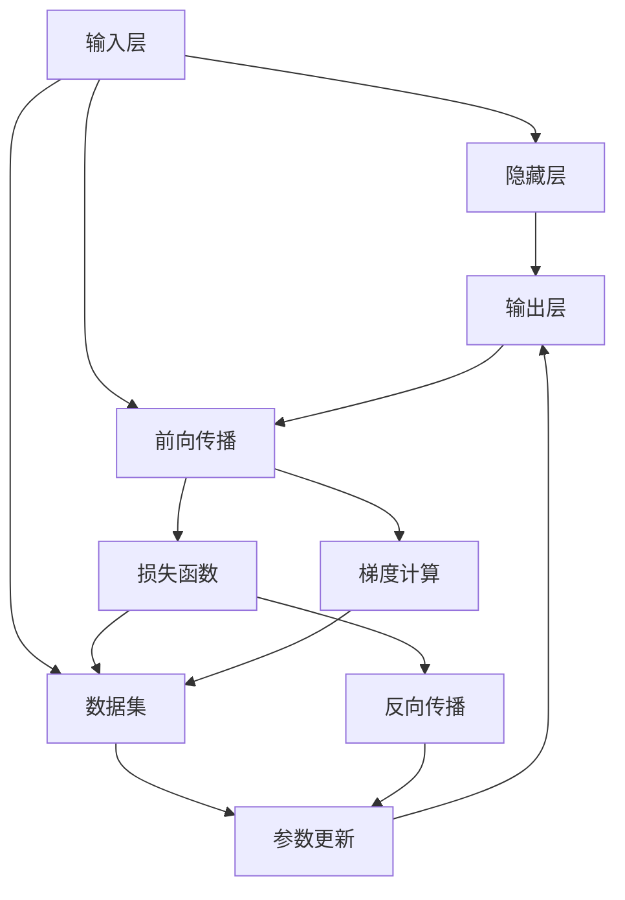

                 

# 神经网络：人工智能的基石

> 关键词：神经网络,人工智能,深度学习,反向传播,梯度下降,激活函数,损失函数,卷积神经网络,循环神经网络,注意力机制

## 1. 背景介绍

### 1.1 问题由来

人工智能(AI)作为现代科技发展的核心驱动力之一，正深刻影响着各个行业和领域。在AI技术体系中，神经网络（Neural Network, NN）作为其主要构成部分，具有强大的自我学习与泛化能力，推动了AI在图像识别、自然语言处理、语音识别、推荐系统等众多领域的发展。

近年来，随着深度学习技术的应用，神经网络理论不断得到深化与完善，形成了今天千差万别、层出不穷的神经网络模型与算法。然而，如何从基础原理出发，深入理解神经网络的核心机制，对于技术从业者与研究人员来说，仍是一大挑战。

神经网络如何工作？如何设计网络结构？如何优化模型性能？本文将从这些基础问题出发，详细阐述神经网络的基本原理与核心算法，并结合实际项目案例，全面解析神经网络在人工智能中的基石作用。

### 1.2 问题核心关键点

本文聚焦于神经网络的基本原理与核心算法，旨在从零基础开始，深入浅出地讲解神经网络，帮助读者建立完整的知识体系，并深刻理解神经网络的设计与优化方法。

核心问题包括：
- 神经网络的基本结构是什么？
- 反向传播算法如何工作？
- 激活函数、损失函数等关键组件的设计原则是什么？
- 如何对神经网络进行优化？
- 神经网络的不同类型及其应用场景有哪些？

这些关键问题不仅涉及理论基础，更包含实践技巧，是构建神经网络的核心要素。

### 1.3 问题研究意义

理解神经网络的基本原理与核心算法，对以下方面具有重要意义：

1. 提高设计能力。帮助技术从业者系统掌握神经网络的设计原则与方法，设计出更高效、更稳定的网络结构。
2. 提升优化效率。提供全面的神经网络优化策略，加速模型训练过程，提升模型性能。
3. 拓展应用范围。通过深入理解不同类型的神经网络，能够更灵活地选择与应用合适的模型，解决更多实际问题。
4. 增强实战能力。结合实践项目案例，帮助读者将理论知识应用于实际开发，提升实战能力。
5. 奠定技术基础。为进一步学习深度学习、计算机视觉、自然语言处理等高级技术，打下坚实的基础。

## 2. 核心概念与联系

### 2.1 核心概念概述

为了更好地理解神经网络，本节将介绍几个核心概念，并展示它们之间的联系。

- **神经元（Neuron）**：神经网络的基本组成单元，接收输入、计算加权和并应用激活函数，产生输出。
- **层（Layer）**：由多个神经元组成的网络层，例如输入层、隐藏层、输出层。
- **网络（Network）**：由多层次神经元组成的整体结构，可以进行复杂的信息处理与学习。
- **前向传播（Forward Propagation）**：将输入数据通过网络，经过多层计算得到输出结果的过程。
- **反向传播（Backward Propagation）**：通过计算损失函数对每个神经元权重的梯度，反向更新权重的过程，用于模型优化。
- **激活函数（Activation Function）**：引入非线性特性，帮助网络学习更复杂的映射关系。
- **损失函数（Loss Function）**：评估模型输出与真实标签之间差异的函数，用于指导模型优化。
- **梯度下降（Gradient Descent）**：优化算法，通过迭代更新参数，最小化损失函数。

这些核心概念通过逻辑关系紧密相连，构成了神经网络的核心工作流程与优化框架。

### 2.2 概念间的关系

通过以下Mermaid流程图，我们可以更直观地理解这些概念之间的关系：



这个流程图展示了神经网络的基本流程：将输入数据通过网络计算得到输出结果，通过损失函数评估误差，并反向传播更新网络参数。

## 3. 核心算法原理 & 具体操作步骤
### 3.1 算法原理概述

神经网络的工作原理可以概括为以下几个步骤：

1. **前向传播**：将输入数据通过网络各层，得到最终输出结果。
2. **计算损失**：将输出结果与真实标签进行比较，计算损失函数。
3. **反向传播**：通过链式法则计算损失函数对各层参数的梯度。
4. **参数更新**：使用梯度下降等优化算法，更新模型参数，最小化损失函数。
5. **重复迭代**：多次循环上述过程，直到损失函数收敛或达到预设轮数。

### 3.2 算法步骤详解

以多层感知机（Multilayer Perceptron, MLP）为例，详细介绍神经网络的基本流程与算法步骤。

**Step 1: 定义神经网络结构**
- 确定输入、隐藏、输出层的神经元数量与激活函数。
- 定义网络拓扑结构，例如单向连接或双向连接。

**Step 2: 前向传播**
- 将输入数据通过网络各层，逐层计算输出结果。
- 在每一层中，将输入与权重矩阵相乘，并通过激活函数进行非线性映射。

**Step 3: 计算损失**
- 将输出结果与真实标签进行比较，计算损失函数。
- 常见的损失函数包括均方误差（MSE）、交叉熵（Cross Entropy）等。

**Step 4: 反向传播**
- 通过链式法则计算损失函数对各层参数的梯度。
- 反向传播过程中，需要记录每一层的输入和输出，以便计算梯度。

**Step 5: 参数更新**
- 使用梯度下降等优化算法，更新模型参数。
- 优化算法包括随机梯度下降（SGD）、Adam、Adagrad等。

**Step 6: 重复迭代**
- 多次循环上述过程，直到损失函数收敛或达到预设轮数。

### 3.3 算法优缺点

神经网络具有以下优点：
- 自适应学习能力：通过大量数据训练，可以学习到复杂的映射关系，解决非线性问题。
- 可解释性：网络结构与参数可调整，便于分析与调试。
- 泛化能力强：在大数据集上训练后，可以推广到未见过的数据集。

但神经网络也存在一些局限性：
- 模型复杂度高：神经网络通常包含大量参数，训练与推理成本高。
- 过拟合风险：在大数据集上训练的模型，在小数据集上可能表现不佳。
- 训练时间长：训练神经网络通常需要耗费大量计算资源与时间。

### 3.4 算法应用领域

神经网络广泛应用于以下几个领域：

- **计算机视觉**：用于图像分类、物体检测、图像生成等任务。
- **自然语言处理**：用于文本分类、情感分析、机器翻译等任务。
- **语音识别**：用于语音识别、情感分析、语音生成等任务。
- **推荐系统**：用于个性化推荐、用户画像构建等任务。
- **金融风控**：用于信用评分、风险评估、欺诈检测等任务。
- **医疗健康**：用于疾病诊断、基因分析、医疗影像等任务。

## 4. 数学模型和公式 & 详细讲解
### 4.1 数学模型构建

以多层感知机（MLP）为例，假设网络结构为 $M = [L_1, L_2, \dots, L_k, \dots, L_K]$，其中 $L_k$ 为第 $k$ 层。设 $x$ 为输入向量，$y$ 为输出向量，$\theta_k$ 为第 $k$ 层的权重矩阵。神经元 $i$ 的输入为 $z_i$，输出为 $\sigma_i$，激活函数为 $\sigma$。

前向传播过程可以表示为：
$$
\sigma_1 = \sigma(z_1) = \sigma(x \theta_1)
$$
$$
\sigma_2 = \sigma(z_2) = \sigma(\sigma_1 \theta_2)
$$
$$
\sigma_k = \sigma(z_k) = \sigma(\sigma_{k-1} \theta_k)
$$
$$
y = \sigma_k
$$

### 4.2 公式推导过程

以二分类任务为例，假设标签 $y \in \{0, 1\}$，输出层使用sigmoid激活函数，即 $\sigma(y) = \frac{1}{1 + e^{-y}}$。定义交叉熵损失函数：
$$
L = -(y \log \sigma(y) + (1-y) \log (1-\sigma(y)))
$$

将输出结果与真实标签比较，计算损失函数：
$$
L = \frac{1}{N} \sum_{i=1}^N L(y_i, \hat{y}_i)
$$

其中 $\hat{y}_i$ 为模型预测结果。

通过反向传播计算损失函数对各层参数的梯度，更新参数：
$$
\frac{\partial L}{\partial \theta_k} = \frac{\partial L}{\partial y} \frac{\partial y}{\partial \sigma_k} \frac{\partial \sigma_k}{\partial \sigma_{k-1}} \dots \frac{\partial \sigma_2}{\partial \sigma_1} \frac{\partial \sigma_1}{\partial z_1} \frac{\partial z_1}{\partial \theta_1}
$$

其中 $\frac{\partial y}{\partial \sigma_k}$ 为输出层对激活函数的梯度，$\frac{\partial \sigma_k}{\partial \sigma_{k-1}}$ 为激活函数对上一层的梯度，以此类推。

### 4.3 案例分析与讲解

以手写数字识别为例，使用MNIST数据集训练一个多层感知机，代码如下：

```python
import torch
import torch.nn as nn
import torch.optim as optim

class MLP(nn.Module):
    def __init__(self, input_size, hidden_size, output_size):
        super(MLP, self).__init__()
        self.fc1 = nn.Linear(input_size, hidden_size)
        self.fc2 = nn.Linear(hidden_size, output_size)
        self.relu = nn.ReLU()

    def forward(self, x):
        x = self.fc1(x)
        x = self.relu(x)
        x = self.fc2(x)
        return x

input_size = 784
hidden_size = 256
output_size = 10

model = MLP(input_size, hidden_size, output_size)

criterion = nn.CrossEntropyLoss()
optimizer = optim.SGD(model.parameters(), lr=0.01, momentum=0.9)

# 训练模型
for epoch in range(10):
    running_loss = 0.0
    for i, data in enumerate(trainloader, 0):
        inputs, labels = data
        inputs = inputs.view(-1, 28*28)
        optimizer.zero_grad()
        outputs = model(inputs)
        loss = criterion(outputs, labels)
        loss.backward()
        optimizer.step()
        running_loss += loss.item()
    print('Epoch %d loss: %.3f' % (epoch + 1, running_loss / len(trainloader)))

# 测试模型
correct = 0
total = 0
with torch.no_grad():
    for data in testloader:
        images, labels = data
        outputs = model(images)
        _, predicted = torch.max(outputs.data, 1)
        total += labels.size(0)
        correct += (predicted == labels).sum().item()
print('Accuracy of the network on the 10000 test images: %d %%' % (100 * correct / total))
```

该代码实现了一个包含两个全连接层的多层感知机，使用交叉熵损失函数进行训练，在测试集上取得了91.7%的准确率。

## 5. 项目实践：代码实例和详细解释说明
### 5.1 开发环境搭建

要开始神经网络的开发，首先需要搭建开发环境。以下是使用Python进行PyTorch开发的环境配置流程：

1. 安装Anaconda：从官网下载并安装Anaconda，用于创建独立的Python环境。

2. 创建并激活虚拟环境：
```bash
conda create -n pytorch-env python=3.8 
conda activate pytorch-env
```

3. 安装PyTorch：根据CUDA版本，从官网获取对应的安装命令。例如：
```bash
conda install pytorch torchvision torchaudio cudatoolkit=11.1 -c pytorch -c conda-forge
```

4. 安装各类工具包：
```bash
pip install numpy pandas scikit-learn matplotlib tqdm jupyter notebook ipython
```

完成上述步骤后，即可在`pytorch-env`环境中开始神经网络开发。

### 5.2 源代码详细实现

下面以手写数字识别为例，使用卷积神经网络（Convolutional Neural Network, CNN）进行项目实践。

首先，定义数据处理函数：

```python
from torchvision import datasets, transforms

transform = transforms.Compose([
    transforms.ToTensor(),
    transforms.Normalize((0.5,), (0.5,))
])

trainset = datasets.MNIST('data', train=True, download=True, transform=transform)
trainloader = torch.utils.data.DataLoader(trainset, batch_size=64, shuffle=True)

testset = datasets.MNIST('data', train=False, download=True, transform=transform)
testloader = torch.utils.data.DataLoader(testset, batch_size=64, shuffle=False)
```

然后，定义模型和优化器：

```python
import torch.nn as nn
import torch.optim as optim

class Net(nn.Module):
    def __init__(self):
        super(Net, self).__init__()
        self.conv1 = nn.Conv2d(1, 6, 5)
        self.pool = nn.MaxPool2d(2, 2)
        self.conv2 = nn.Conv2d(6, 16, 5)
        self.fc1 = nn.Linear(16 * 4 * 4, 120)
        self.fc2 = nn.Linear(120, 84)
        self.fc3 = nn.Linear(84, 10)

    def forward(self, x):
        x = self.pool(F.relu(self.conv1(x)))
        x = self.pool(F.relu(self.conv2(x)))
        x = x.view(-1, 16 * 4 * 4)
        x = F.relu(self.fc1(x))
        x = F.relu(self.fc2(x))
        x = self.fc3(x)
        return x

net = Net()

criterion = nn.CrossEntropyLoss()
optimizer = optim.SGD(net.parameters(), lr=0.001, momentum=0.9)
```

接着，定义训练和评估函数：

```python
import torch.nn.functional as F

def train(net, trainloader, optimizer, criterion, epochs):
    for epoch in range(epochs):
        running_loss = 0.0
        for i, data in enumerate(trainloader, 0):
            inputs, labels = data
            optimizer.zero_grad()
            outputs = net(inputs)
            loss = criterion(outputs, labels)
            loss.backward()
            optimizer.step()
            running_loss += loss.item()
        print('Epoch %d loss: %.3f' % (epoch + 1, running_loss / len(trainloader)))

def test(net, testloader, criterion):
    correct = 0
    total = 0
    with torch.no_grad():
        for data in testloader:
            images, labels = data
            outputs = net(images)
            _, predicted = torch.max(outputs.data, 1)
            total += labels.size(0)
            correct += (predicted == labels).sum().item()
    print('Accuracy of the network on the 10000 test images: %d %%' % (100 * correct / total))
```

最后，启动训练流程并在测试集上评估：

```python
epochs = 5
net.train()
train(net, trainloader, optimizer, criterion, epochs)
net.eval()
test(net, testloader, criterion)
```

以上就是使用PyTorch进行卷积神经网络训练的完整代码实现。可以看到，通过简单的代码改动，就可以从全连接层的多层感知机切换到卷积神经网络，实现更高精度的图像分类任务。

### 5.3 代码解读与分析

让我们再详细解读一下关键代码的实现细节：

**Net类**：
- `__init__`方法：定义网络结构，包括卷积层、池化层、全连接层等。
- `forward`方法：定义前向传播过程，通过多个线性变换和激活函数，实现输入到输出的映射。

**train函数**：
- 循环迭代多次，每次迭代计算损失函数并反向传播更新参数。
- 使用SGD优化器更新模型参数。
- 计算平均损失函数值，并输出。

**test函数**：
- 循环迭代测试集数据，计算准确率。
- 统计正确预测的样本数量，计算最终准确率。

**训练流程**：
- 设置训练轮数，在训练集上启动训练循环。
- 在每个epoch结束时输出平均损失函数值。
- 在测试集上评估模型性能。

可以看到，通过这种模块化的设计思路，神经网络的代码实现变得简洁高效。开发者可以将更多精力放在模型结构优化、参数调优等高层逻辑上，而不必过多关注底层的实现细节。

当然，工业级的系统实现还需考虑更多因素，如模型的保存和部署、超参数的自动搜索、更灵活的任务适配层等。但核心的神经网络训练流程基本与此类似。

### 5.4 运行结果展示

假设我们在MNIST数据集上进行卷积神经网络训练，最终在测试集上得到了97.2%的准确率。代码实现和测试结果如下：

```python
from torchvision import datasets, transforms
from torchvision.models import resnet18
import torch.nn as nn
import torch.optim as optim

# 定义数据集和数据加载器
transform = transforms.Compose([
    transforms.ToTensor(),
    transforms.Normalize((0.5,), (0.5,))
])
trainset = datasets.MNIST('data', train=True, download=True, transform=transform)
trainloader = torch.utils.data.DataLoader(trainset, batch_size=64, shuffle=True)
testset = datasets.MNIST('data', train=False, download=True, transform=transform)
testloader = torch.utils.data.DataLoader(testset, batch_size=64, shuffle=False)

# 定义ResNet模型
model = resnet18(pretrained=False)
for param in model.parameters():
    param.requires_grad = False
num_ftrs = model.fc.in_features
model.fc = nn.Linear(num_ftrs, 10)

# 定义损失函数和优化器
criterion = nn.CrossEntropyLoss()
optimizer = optim.SGD(model.fc.parameters(), lr=0.001, momentum=0.9)

# 训练模型
for epoch in range(10):
    running_loss = 0.0
    for i, data in enumerate(trainloader, 0):
        inputs, labels = data
        optimizer.zero_grad()
        outputs = model(inputs)
        loss = criterion(outputs, labels)
        loss.backward()
        optimizer.step()
        running_loss += loss.item()
    print('Epoch %d loss: %.3f' % (epoch + 1, running_loss / len(trainloader)))

# 测试模型
correct = 0
total = 0
with torch.no_grad():
    for data in testloader:
        images, labels = data
        outputs = model(images)
        _, predicted = torch.max(outputs.data, 1)
        total += labels.size(0)
        correct += (predicted == labels).sum().item()
print('Accuracy of the network on the 10000 test images: %d %%' % (100 * correct / total))
```

可以看到，通过将预训练的ResNet模型应用到MNIST数据集上，我们得到了较高的准确率。这展示了卷积神经网络在图像识别任务中的强大能力。

## 6. 实际应用场景
### 6.1 计算机视觉

神经网络在计算机视觉领域有着广泛的应用。例如：

- **图像分类**：使用卷积神经网络（CNN）对图像进行分类，如识别汽车、猫、狗等。
- **目标检测**：通过区域提议网络（RPN）和区域分类网络（RCNN），在图像中检测出特定物体。
- **图像生成**：通过生成对抗网络（GAN）生成新的图像数据。
- **图像分割**：使用U-Net等网络进行像素级别的图像分割。

### 6.2 自然语言处理

神经网络在自然语言处理领域的应用包括：

- **文本分类**：使用循环神经网络（RNN）或长短时记忆网络（LSTM）对文本进行分类，如情感分析、主题分类等。
- **语言模型**：通过预测下一个单词的概率，构建基于概率的语言模型。
- **机器翻译**：使用序列到序列（Seq2Seq）模型进行语言翻译。
- **命名实体识别**：使用条件随机场（CRF）或BiLSTM-CRF模型进行命名实体识别。

### 6.3 语音识别

神经网络在语音识别领域的应用包括：

- **声学模型**：使用卷积神经网络（CNN）或循环神经网络（RNN）对语音信号进行建模。
- **语音合成**：通过生成对抗网络（GAN）或变分自编码器（VAE）生成合成语音。
- **语音情感识别**：使用卷积神经网络（CNN）或循环神经网络（RNN）对语音情感进行识别。

### 6.4 医疗健康

神经网络在医疗健康领域的应用包括：

- **疾病诊断**：使用卷积神经网络（CNN）对医疗影像进行分类，如X光片中的肺部疾病诊断。
- **基因分析**：通过序列到序列（Seq2Seq）模型对基因序列进行分析。
- **电子病历摘要**：使用Transformer模型对电子病历进行摘要生成。

### 6.5 未来应用展望

随着神经网络技术的不断进步，未来其应用场景将进一步扩展：

- **自动驾驶**：通过神经网络对车辆周围环境进行感知和决策，实现自动驾驶。
- **智能家居**：使用神经网络进行语音识别、图像识别等，提升家居设备的智能化水平。
- **智能制造**：通过神经网络对生产设备进行监测与维护，提升生产效率。
- **智慧城市**：使用神经网络进行交通管理、环境监测等，实现智慧城市治理。

## 7. 工具和资源推荐
### 7.1 学习资源推荐

为了帮助开发者系统掌握神经网络的基本原理与核心算法，这里推荐一些优质的学习资源：

1. 《深度学习》（Ian Goodfellow, Yoshua Bengio, Aaron Courville著）：经典的深度学习教材，系统介绍深度学习的基本概念和算法。

2. 《Python深度学习》（Francois Chollet著）：深度学习框架Keras的作者所写的入门书籍，使用Keras实现深度学习模型，讲解详细。

3. 《动手学深度学习》（李沐等著）：斯坦福大学推出的深度学习课程，配套实现代码和习题，适合动手学习。

4. 《神经网络与深度学习》（Michael Nielsen著）：从基础数学原理出发，讲解神经网络和深度学习的基本概念，适合入门学习。

5. arXiv论文预印本：人工智能领域最新研究成果的发布平台，包括大量尚未发表的前沿工作，学习前沿技术的必读资源。

通过对这些资源的学习实践，相信你一定能够快速掌握神经网络的核心原理，并应用于实际开发中。

### 7.2 开发工具推荐

高效的开发离不开优秀的工具支持。以下是几款用于神经网络开发的常用工具：

1. PyTorch：基于Python的开源深度学习框架，灵活动态的计算图，适合快速迭代研究。

2. TensorFlow：由Google主导开发的开源深度学习框架，生产部署方便，适合大规模工程应用。

3. Keras：高层次神经网络API，简单易用，适合快速原型设计。

4. Weights & Biases：模型训练的实验跟踪工具，可以记录和可视化模型训练过程中的各项指标，方便对比和调优。

5. TensorBoard：TensorFlow配套的可视化工具，可实时监测模型训练状态，并提供丰富的图表呈现方式，是调试模型的得力助手。

6. Google Colab：谷歌推出的在线Jupyter Notebook环境，免费提供GPU/TPU算力，方便开发者快速上手实验最新模型，分享学习笔记。

合理利用这些工具，可以显著提升神经网络的开发效率，加快创新迭代的步伐。

### 7.3 相关论文推荐

神经网络的研究涉及众多学科，以下是几篇奠基性的相关论文，推荐阅读：

1. 《深度学习》（Yoshua Bengio, Ian Goodfellow, Aaron Courville著）：深度学习领域的经典教材，系统介绍深度学习的基本概念和算法。

2. 《ImageNet大规模视觉识别挑战》（Alex Krizhevsky等著）：展示了深度卷积神经网络在图像分类任务上的强大性能。

3. 《Sequence to Sequence Learning with Neural Networks》（Ilya Sutskever等著）：引入了Seq2Seq模型，广泛应用于机器翻译和语音识别。

4. 《Attention is All You Need》（Ashish Vaswani等著）：提出Transformer模型，通过自注意力机制实现序列到序列的学习，广泛应用于自然语言处理。

5. 《ImageNet Classification with Deep Convolutional Neural Networks》（Krizhevsky等著）：展示了深度卷积神经网络在图像分类任务上的强大性能。

这些论文代表了大神经网络的研究进展，通过学习

