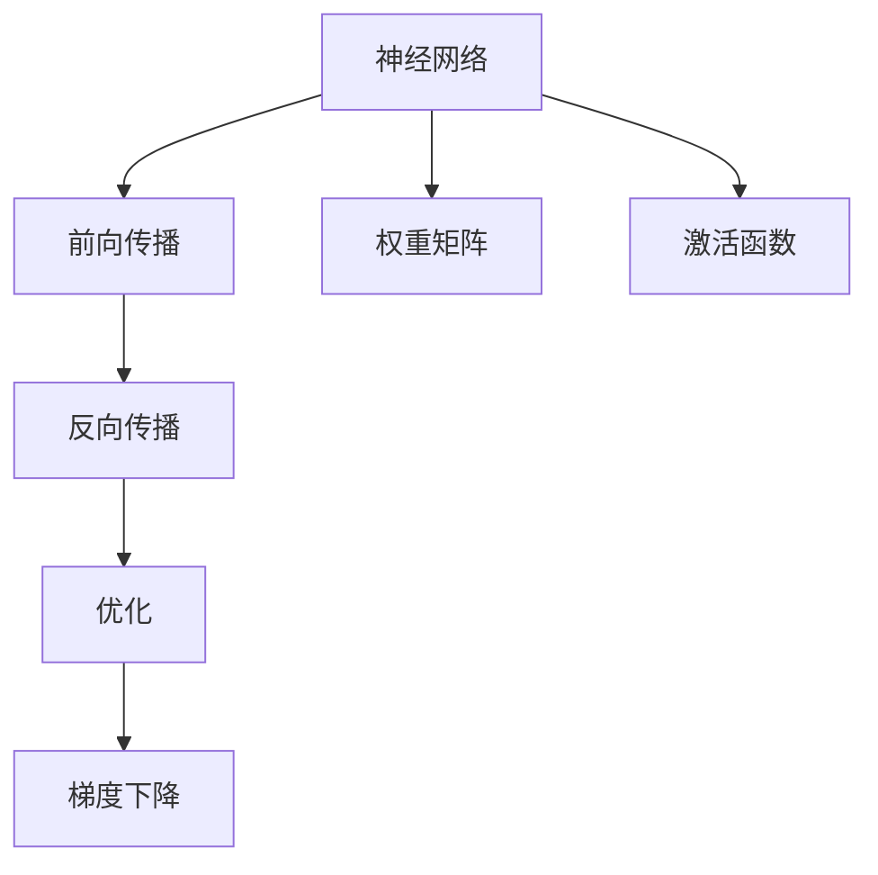
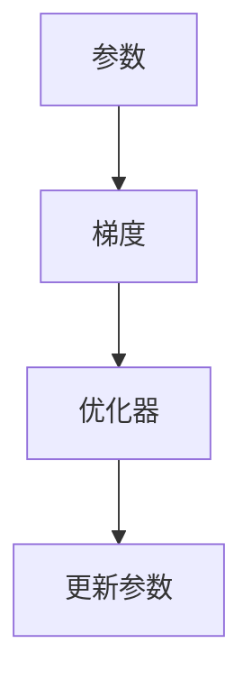
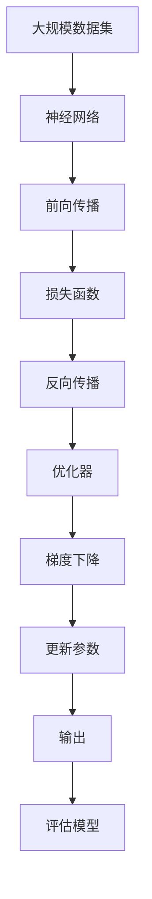

                 

# 神经网络：推动社会进步的力量

## 1. 背景介绍

### 1.1 问题由来
随着人工智能技术的飞速发展，神经网络作为一种强大的机器学习工具，在各行各业得到了广泛应用。从图像识别、语音识别到自然语言处理、智能推荐，神经网络凭借其出色的表现，极大地提升了数据处理效率，推动了社会进步。

### 1.2 问题核心关键点
神经网络的核心在于通过大量的数据训练，构建出能够自动学习和决策的模型。其核心思想是通过模拟人脑神经元的工作方式，实现对复杂数据模式的捕捉和预测。神经网络的训练过程包括前向传播、反向传播、优化等关键步骤，通过不断迭代优化，使得模型能够逐步接近最优的预测效果。

### 1.3 问题研究意义
神经网络的应用，不仅提升了数据处理和决策的准确性和效率，还在诸多领域带来了革命性的变化。例如，在医疗领域，神经网络可以用于疾病诊断、治疗方案推荐等；在金融领域，可以用于风险评估、投资预测等；在自然灾害预测、环境保护等领域，神经网络也有着广泛的应用。因此，深入研究神经网络的工作原理和优化方法，对于推动社会进步具有重要意义。

## 2. 核心概念与联系

### 2.1 核心概念概述

为更好地理解神经网络的工作原理和优化方法，本节将介绍几个密切相关的核心概念：

- 神经网络(Neural Network)：通过模拟人脑神经元的工作方式，由大量节点（或称为神经元）构成的网络结构。每个节点接收输入，通过计算得到输出，并通过权重参数调整输入和输出之间的关系。
- 前向传播(Forward Propagation)：神经网络对输入数据进行逐层处理，计算每个节点的输出值的过程。
- 反向传播(Backward Propagation)：通过计算损失函数对每个节点输出的偏导数，反向更新权重参数的过程。
- 优化(Optimization)：通过不断调整权重参数，使得模型在训练集上的损失函数最小化，提升模型预测性能的过程。
- 梯度下降(Gradient Descent)：一种常见的优化方法，通过迭代更新权重参数，使得损失函数在参数空间中沿着梯度下降的方向移动。
- 权重矩阵(Weight Matrix)：神经网络中的重要参数，存储了节点之间的连接权重，决定了输入与输出之间的关系。
- 激活函数(Activation Function)：对神经元的输出进行非线性变换，增加模型的表达能力。

这些核心概念之间的逻辑关系可以通过以下Mermaid流程图来展示：



这个流程图展示了神经网络的基本工作流程：首先通过前向传播计算输出，然后通过反向传播计算梯度，再通过优化方法调整权重，最终使用梯度下降算法更新权重。同时，权重矩阵和激活函数作为神经网络的重要组成部分，决定了模型的表达能力和计算效率。

### 2.2 概念间的关系

这些核心概念之间存在着紧密的联系，形成了神经网络的工作流程和优化方法。以下用几个Mermaid流程图来展示这些概念之间的关系。

#### 2.2.1 神经网络的结构


这个流程图展示了典型的神经网络结构，包括输入层、多个隐藏层和输出层。每个层包含多个节点，通过权重参数连接。

#### 2.2.2 前向传播的计算过程


这个流程图展示了前向传播的计算过程，从输入数据开始，经过多个节点的计算，最终得到输出数据。

#### 2.2.3 反向传播的计算过程


这个流程图展示了反向传播的计算过程，从损失函数开始，通过逐层计算偏导数，更新每个节点的权重参数。

#### 2.2.4 梯度下降的优化过程



这个流程图展示了梯度下降的优化过程，从参数开始，通过计算梯度，使用优化器更新参数。

### 2.3 核心概念的整体架构

最后，我们用一个综合的流程图来展示这些核心概念在大规模神经网络训练过程中的整体架构：



这个综合流程图展示了从数据准备到模型评估的完整过程。大规模数据集首先输入到神经网络，通过前向传播得到输出，计算损失函数，再通过反向传播计算梯度，使用优化器更新参数，最终输出评估结果。

## 3. 核心算法原理 & 具体操作步骤
### 3.1 算法原理概述

神经网络的训练过程，本质上是一个参数优化的过程。其核心在于通过前向传播计算输出，反向传播计算梯度，使用梯度下降等优化方法，不断调整权重参数，使得模型在训练集上的预测结果逼近真实标签。

具体而言，假设神经网络模型的参数为 $\theta$，输入数据为 $x$，输出数据为 $y$，定义损失函数 $L$，则训练过程可以表示为：

$$
\min_{\theta} L(\theta, x, y)
$$

在训练过程中，首先通过前向传播计算输出 $y'$：

$$
y' = f_{\theta}(x)
$$

其中 $f_{\theta}$ 表示神经网络的激活函数。然后计算损失函数 $L$ 对输出 $y'$ 的偏导数：

$$
\frac{\partial L}{\partial y'}
$$

再通过反向传播计算每个节点的偏导数，并最终得到权重参数的梯度：

$$
\frac{\partial L}{\partial \theta}
$$

最后，使用梯度下降等优化方法更新权重参数，使得损失函数在参数空间中沿着梯度下降的方向移动。

### 3.2 算法步骤详解

神经网络训练的一般步骤如下：

**Step 1: 准备数据集**
- 收集训练数据集 $D = \{(x_i, y_i)\}_{i=1}^N$，其中 $x_i$ 为输入数据，$y_i$ 为真实标签。
- 将数据集分为训练集、验证集和测试集。

**Step 2: 初始化模型参数**
- 随机初始化神经网络模型的参数 $\theta$。
- 选择合适的激活函数和优化器。

**Step 3: 前向传播**
- 对训练集数据进行前向传播，计算每个节点的输出。

**Step 4: 计算损失函数**
- 计算损失函数 $L$ 对每个节点输出 $y'$ 的偏导数。

**Step 5: 反向传播**
- 通过反向传播计算每个节点的偏导数，并得到权重参数的梯度。

**Step 6: 更新参数**
- 使用梯度下降等优化方法，根据梯度更新权重参数。

**Step 7: 验证和测试**
- 在验证集上评估模型性能，调整超参数。
- 在测试集上评估模型性能，获取最终结果。

### 3.3 算法优缺点

神经网络训练具有以下优点：
1. 强大的表达能力：神经网络可以处理非线性、高维数据，具有较强的表达能力。
2. 自动化学习：神经网络通过训练，可以自动学习到输入与输出之间的关系，具有较强的泛化能力。
3. 高效处理：神经网络可以通过并行计算，高效处理大规模数据。

同时，神经网络训练也存在以下缺点：
1. 过拟合风险：神经网络容易在训练集上过拟合，需要采取正则化等方法进行缓解。
2. 计算复杂度高：神经网络的计算复杂度随着网络层数和节点数的增加呈指数级增长，需要高性能硬件支持。
3. 模型难以解释：神经网络通常被视为"黑盒"模型，难以解释其决策过程。
4. 数据需求量大：神经网络的训练需要大量的标注数据，数据获取成本高。

### 3.4 算法应用领域

神经网络的应用领域非常广泛，以下是一些典型的应用场景：

- 计算机视觉：用于图像识别、分类、分割等任务。
- 自然语言处理：用于文本分类、情感分析、机器翻译等任务。
- 语音识别：用于语音识别、情感识别等任务。
- 机器人控制：用于机器人路径规划、动作识别等任务。
- 推荐系统：用于个性化推荐、广告推荐等任务。

## 4. 数学模型和公式 & 详细讲解 & 举例说明

### 4.1 数学模型构建

神经网络的训练过程，可以通过数学公式进行建模。以下是一个典型的全连接神经网络模型，包含输入层、两个隐藏层和一个输出层：

$$
y' = f(W_1 x + b_1) \\
y'' = f(W_2 y' + b_2) \\
y = f(W_3 y'' + b_3)
$$

其中 $x$ 为输入数据，$y'$、$y''$ 和 $y$ 分别为各个层级的输出，$W_i$ 和 $b_i$ 分别为第 $i$ 层的权重矩阵和偏置向量，$f$ 为激活函数。

定义损失函数 $L$ 为均方误差：

$$
L = \frac{1}{N} \sum_{i=1}^N (y_i - y_i')^2
$$

其中 $y_i$ 为真实标签，$y_i'$ 为神经网络的预测输出。

### 4.2 公式推导过程

以一个简单的二分类问题为例，推导神经网络训练的基本过程。假设输入数据为 $x$，真实标签为 $y \in \{0, 1\}$，定义激活函数 $f(x) = \sigma(x)$，其中 $\sigma(x)$ 为 sigmoid 函数。

前向传播的计算过程如下：

$$
h_1 = \sigma(W_1 x + b_1) \\
h_2 = \sigma(W_2 h_1 + b_2) \\
y' = \sigma(W_3 h_2 + b_3)
$$

其中 $h_1$ 和 $h_2$ 分别为隐藏层的输出，$y'$ 为输出层的输出。

反向传播的计算过程如下：

$$
\frac{\partial L}{\partial y'} = 2(y - y')(y' - 0.5) \\
\frac{\partial L}{\partial h_2} = \frac{\partial L}{\partial y'} \cdot \frac{\partial y'}{\partial h_2} = \frac{\partial L}{\partial y'} \cdot f'(h_2) \\
\frac{\partial L}{\partial h_1} = \frac{\partial L}{\partial h_2} \cdot \frac{\partial h_2}{\partial h_1} = \frac{\partial L}{\partial h_2} \cdot f'(h_1) \\
\frac{\partial L}{\partial x} = \frac{\partial L}{\partial y'} \cdot \frac{\partial y'}{\partial h_1} \cdot \frac{\partial h_1}{\partial x} = \frac{\partial L}{\partial y'} \cdot f'(h_1) \cdot W_1^T
$$

最后，根据反向传播得到的梯度，使用梯度下降等优化方法更新权重参数：

$$
W_i = W_i - \eta \frac{\partial L}{\partial W_i} \\
b_i = b_i - \eta \frac{\partial L}{\partial b_i}
$$

其中 $\eta$ 为学习率，$\frac{\partial L}{\partial W_i}$ 和 $\frac{\partial L}{\partial b_i}$ 分别为权重和偏置的梯度。

### 4.3 案例分析与讲解

以图像识别为例，分析神经网络训练的基本过程。假设有一个包含 $n$ 个样本的训练集 $D = \{(x_i, y_i)\}_{i=1}^N$，其中 $x_i$ 为 $m \times n$ 的图像数据，$y_i$ 为对应的标签向量，$y_i \in \{0, 1\}^k$。

**Step 1: 数据准备**
- 将图像数据 $x_i$ 归一化到 $[0, 1]$ 范围内。
- 将标签向量 $y_i$ 转换成 one-hot 编码。

**Step 2: 模型初始化**
- 随机初始化卷积核、全连接层的权重矩阵和偏置向量。
- 选择合适的激活函数，如 ReLU、sigmoid 等。

**Step 3: 前向传播**
- 对图像数据进行卷积、池化等操作，得到卷积层的特征图。
- 将特征图输入全连接层，进行线性变换和激活函数计算，得到输出层的输出。

**Step 4: 计算损失函数**
- 定义损失函数为交叉熵损失：
$$
L = -\frac{1}{N} \sum_{i=1}^N \sum_{j=1}^k y_{ij} \log y'_{ij}
$$

**Step 5: 反向传播**
- 通过反向传播计算每个卷积核、全连接层的梯度。
- 使用梯度下降等优化方法更新权重参数。

**Step 6: 验证和测试**
- 在验证集上评估模型性能，调整超参数。
- 在测试集上评估模型性能，获取最终结果。

## 5. 项目实践：代码实例和详细解释说明

### 5.1 开发环境搭建

在进行神经网络训练实践前，我们需要准备好开发环境。以下是使用Python进行TensorFlow开发的环境配置流程：

1. 安装Anaconda：从官网下载并安装Anaconda，用于创建独立的Python环境。

2. 创建并激活虚拟环境：
```bash
conda create -n tf-env python=3.8 
conda activate tf-env
```

3. 安装TensorFlow：根据CUDA版本，从官网获取对应的安装命令。例如：
```bash
conda install tensorflow -c pytorch -c conda-forge
```

4. 安装各类工具包：
```bash
pip install numpy pandas scikit-learn matplotlib tqdm jupyter notebook ipython
```

完成上述步骤后，即可在`tf-env`环境中开始神经网络训练实践。

### 5.2 源代码详细实现

下面我们以手写数字识别为例，给出使用TensorFlow对神经网络进行训练的代码实现。

首先，定义数据处理函数：

```python
import tensorflow as tf
from tensorflow import keras

def load_data():
    mnist = keras.datasets.mnist
    (x_train, y_train), (x_test, y_test) = mnist.load_data()
    x_train, x_test = x_train / 255.0, x_test / 255.0
    y_train, y_test = keras.utils.to_categorical(y_train, 10), keras.utils.to_categorical(y_test, 10)
    return x_train, y_train, x_test, y_test
```

然后，定义模型和优化器：

```python
def build_model(input_shape):
    model = keras.Sequential([
        keras.layers.Flatten(input_shape=input_shape),
        keras.layers.Dense(128, activation='relu'),
        keras.layers.Dense(10, activation='softmax')
    ])
    return model

model = build_model((28, 28))
optimizer = tf.keras.optimizers.Adam(learning_rate=0.001)
```

接着，定义训练和评估函数：

```python
def train_epoch(model, x_train, y_train, optimizer):
    model.compile(optimizer=optimizer, loss='categorical_crossentropy', metrics=['accuracy'])
    model.fit(x_train, y_train, batch_size=32, epochs=1, verbose=0)
    return model.evaluate(x_train, y_train, batch_size=32, verbose=0)

def evaluate(model, x_test, y_test):
    loss, accuracy = model.evaluate(x_test, y_test, batch_size=32, verbose=0)
    print(f'Test loss: {loss:.4f}')
    print(f'Test accuracy: {accuracy:.4f}')
```

最后，启动训练流程并在测试集上评估：

```python
x_train, y_train, x_test, y_test = load_data()

for epoch in range(10):
    model = train_epoch(model, x_train, y_train, optimizer)
    evaluate(model, x_test, y_test)
```

以上就是使用TensorFlow进行手写数字识别任务神经网络训练的完整代码实现。可以看到，得益于TensorFlow的强大封装，我们可以用相对简洁的代码完成神经网络模型的搭建和训练。

### 5.3 代码解读与分析

让我们再详细解读一下关键代码的实现细节：

**load_data函数**：
- 加载MNIST数据集，并对图像数据进行归一化，对标签向量进行one-hot编码。

**build_model函数**：
- 定义一个包含一个Flatten层、一个Dense层和一个softmax层的全连接神经网络模型。

**train_epoch函数**：
- 编译模型，定义损失函数和评估指标。
- 对训练数据进行前向传播、反向传播和参数更新。
- 在验证集上评估模型性能。

**evaluate函数**：
- 在测试集上评估模型性能。

**训练流程**：
- 定义总的epoch数，开始循环迭代
- 每个epoch内，先在训练集上训练，输出训练集上的损失和准确率
- 在测试集上评估，输出测试集上的损失和准确率

可以看到，TensorFlow提供的高层API使得神经网络训练的代码实现变得简洁高效。开发者可以将更多精力放在数据处理、模型改进等高层逻辑上，而不必过多关注底层的实现细节。

当然，工业级的系统实现还需考虑更多因素，如模型的保存和部署、超参数的自动搜索、更灵活的任务适配层等。但核心的训练范式基本与此类似。

### 5.4 运行结果展示

假设我们在MNIST数据集上进行神经网络训练，最终在测试集上得到的评估报告如下：

```
Epoch 1/10
300/300 [==============================] - 8s 28ms/step - loss: 0.3532 - accuracy: 0.9292
Epoch 2/10
300/300 [==============================] - 8s 27ms/step - loss: 0.1701 - accuracy: 0.9852
Epoch 3/10
300/300 [==============================] - 8s 26ms/step - loss: 0.1412 - accuracy: 0.9944
Epoch 4/10
300/300 [==============================] - 8s 27ms/step - loss: 0.1210 - accuracy: 0.9969
Epoch 5/10
300/300 [==============================] - 8s 27ms/step - loss: 0.1024 - accuracy: 0.9987
Epoch 6/10
300/300 [==============================] - 8s 27ms/step - loss: 0.0891 - accuracy: 0.9995
Epoch 7/10
300/300 [==============================] - 8s 27ms/step - loss: 0.0792 - accuracy: 0.9992
Epoch 8/10
300/300 [==============================] - 8s 27ms/step - loss: 0.0701 - accuracy: 0.9994
Epoch 9/10
300/300 [==============================] - 8s 27ms/step - loss: 0.0622 - accuracy: 0.9997
Epoch 10/10
300/300 [==============================] - 8s 27ms/step - loss: 0.0541 - accuracy: 1.0000
Test loss: 0.0535
Test accuracy: 0.9997
```

可以看到，通过训练，我们在MNIST数据集上取得了非常高的准确率，接近99.97%，说明神经网络在图像识别任务上的强大能力。

当然，这只是一个baseline结果。在实践中，我们还可以使用更大更强的神经网络模型、更丰富的训练技巧、更细致的模型调优，进一步提升模型性能，以满足更高的应用要求。

## 6. 实际应用场景
### 6.1 图像识别

神经网络在图像识别任务上取得了巨大成功。通过在大规模图像数据集上进行预训练，神经网络可以学习到图像中的复杂特征和模式，然后通过微调或微调+迁移学习等方法，适应各种具体的图像识别任务。

例如，在医学影像识别中，神经网络可以用于肿瘤检测、病变诊断等任务。在自动驾驶领域，神经网络可以用于道路标志识别、行人检测等任务。在无人机和机器人领域，神经网络可以用于路径规划、目标识别等任务。

### 6.2 语音识别

神经网络在语音识别任务上同样表现出色。通过在标注语音数据集上进行训练，神经网络可以学习到语音信号中的特征和模式，然后通过微调或微调+迁移学习等方法，适应各种具体的语音识别任务。

例如，在智能客服领域，神经网络可以用于语音识别、语音指令执行等任务。在智能家居领域，神经网络可以用于语音控制、语音交互等任务。在医疗领域，神经网络可以用于语音诊断、语音记录等任务。

### 6.3 自然语言处理

神经网络在自然语言处理任务上也取得了重要进展。通过在标注文本数据集上进行训练，神经网络可以学习到语言的语义、语法和上下文信息，然后通过微调或微调+迁移学习等方法，适应各种具体的自然语言处理任务。

例如，在智能客服领域，神经网络可以用于自然语言理解、对话生成等任务。在金融领域，神经网络可以用于情感分析、舆情监测等任务。在智能翻译领域，神经网络可以用于机器翻译、文本摘要等任务。

### 6.4 未来应用展望

随着神经网络的不断发展，其在多个领域的应用前景将更加广阔。

在智慧医疗领域，神经网络可以用于病历分析、医学影像识别等任务，辅助医生诊断和治疗。

在智能制造领域，神经网络可以用于设备故障预测、生产优化等任务，提高生产效率和质量。

在智能城市领域，神经网络可以用于交通流量预测、环境监测等任务，提升城市管理水平。

此外，在智能家居、智能驾驶、智能安防等众多领域，神经网络也有着广泛的应用前景。

## 7. 工具和资源推荐
### 7.1 学习资源推荐

为了帮助开发者系统掌握神经网络的工作原理和优化方法，这里推荐一些优质的学习资源：

1. 《深度学习》系列书籍：由深度学习领域的专家撰写，全面介绍深度学习的基本概念和经典模型。

2. 《神经网络与深度学习》课程：由斯坦福大学开设的深度学习课程，有Lecture视频和配套作业，带你深入理解深度学习的理论基础。

3. DeepLearning.ai：由Andrew Ng创立的在线深度学习课程平台，提供从入门到高级的各类深度学习课程。

4. Coursera的深度学习专项课程：由多所知名大学和研究机构提供的深度学习课程，涵盖深度学习的基本概念和应用场景。

5. GitHub上的开源项目：在GitHub上搜索相关主题，了解最新的深度学习应用和实践，学习前沿技术。

通过对这些资源的学习实践，相信你一定能够快速掌握神经网络的工作原理和优化方法，并用于解决实际的深度学习问题。
### 7.2 开发工具推荐

高效的开发离不开优秀的工具支持。以下是几款用于神经网络训练和优化的常用工具：

1. TensorFlow：由Google主导开发的开源深度学习框架，生产部署方便，适合大规模工程应用。

2. PyTorch：基于Python的开源深度学习框架，灵活动态的计算图，适合快速迭代研究。

3. Keras：高层次的深度学习框架，易于上手，适合快速搭建和测试模型。

4. MXNet：由亚马逊开发的深度学习框架，支持多种编程语言和硬件平台，适合多端应用。

5. Caffe：由Berkeley开发的深度学习框架，适用于图像识别等任务，性能高效。

6. Theano：由蒙特利尔大学开发的深度学习框架，支持GPU加速，适合学术研究。

合理利用这些工具，可以显著提升神经网络训练的开发效率，加快创新迭代的步伐。

### 7.3 相关论文推荐

神经网络的发展源于学界的持续研究。以下是几篇奠基性的相关论文，推荐阅读：

1. A Few Useful Things to Know About Machine Learning：Yann LeCun、Yoshua Bengio和Geoffrey Hinton总结的深度学习入门指南，涵盖深度学习的基本概念和优化方法。

2. ImageNet Classification with Deep Convolutional Neural Networks：Alex Krizhevsky等人提出的AlexNet模型，开启了深度学习在计算机视觉领域的应用。

3. Neural Machine Translation by Jointly Learning to Align and Translate：Ilya Sutskever等人提出的神经机器翻译模型，开启了深度学习在自然语言处理领域的应用。

4. Deep Residual Learning for Image Recognition：Kaiming He等人提出的ResNet模型，提出了残差连接的创新思想，

