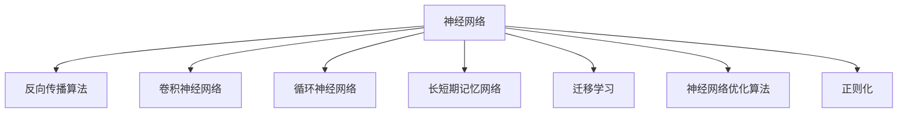
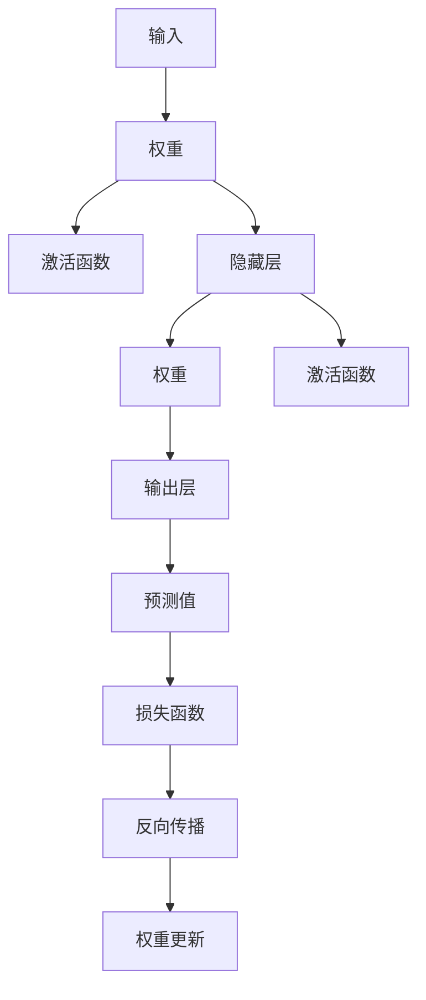
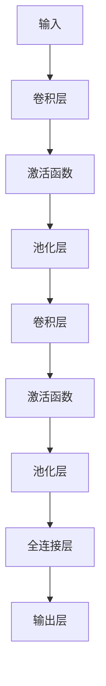
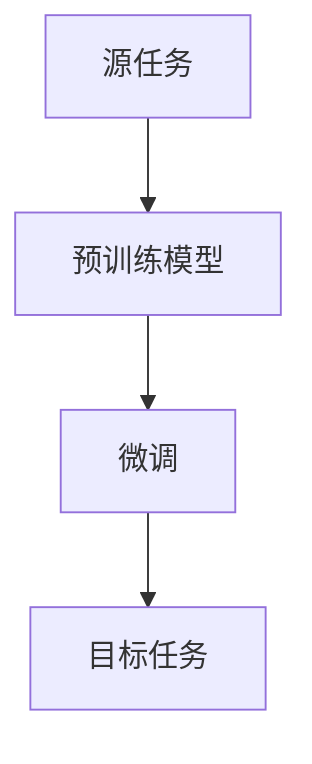
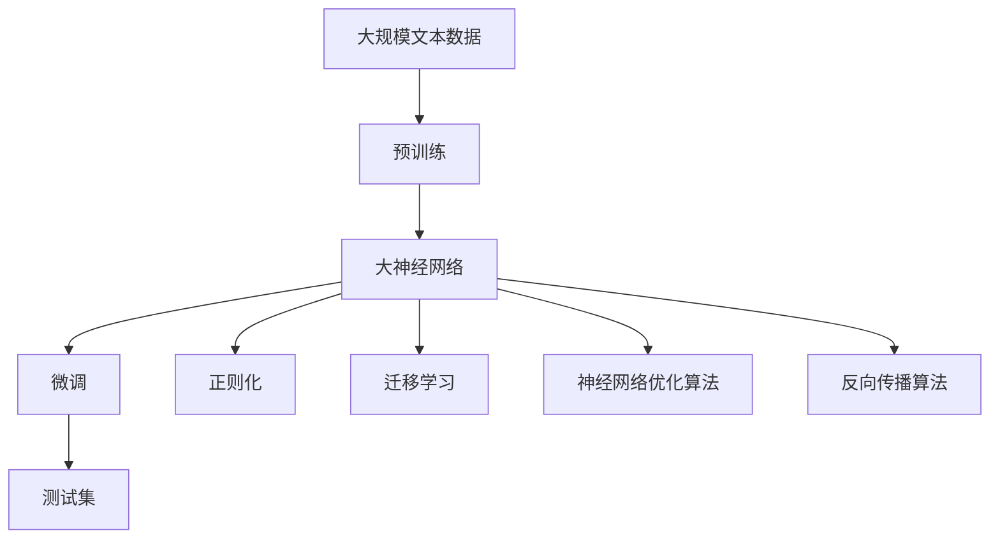

                 

# 神经网络：机器学习的新范式

> 关键词：神经网络, 机器学习, 深度学习, 反向传播算法, 卷积神经网络(CNN), 循环神经网络(RNN), 长短期记忆网络(LSTM), 迁移学习, 神经网络优化算法, 反向传播算法, 深度学习框架, TensorFlow, PyTorch, 模型压缩, 边缘计算, 自动驾驶, 医疗影像, 自然语言处理(NLP), 计算机视觉(CV)

## 1. 背景介绍

### 1.1 问题由来
人工智能领域近些年的快速发展，主要得益于深度学习技术（Deep Learning）的突破，特别是神经网络（Neural Network, NN）的广泛应用。神经网络是一种模拟人脑神经网络结构，通过大量参数化的函数映射完成复杂计算的机器学习模型。

神经网络之所以能够取得如此巨大的成功，主要有以下几个原因：

1. **数据依赖性小**：相比于传统机器学习模型，神经网络通过自身强大的特征提取能力，可以在较少标注数据的情况下取得不错的性能。
2. **模型结构多样**：从简单的感知机、多层感知机（MLP），到复杂的卷积神经网络（CNN）、循环神经网络（RNN）、长短期记忆网络（LSTM）、生成对抗网络（GAN）等，神经网络可以适应各种不同的任务。
3. **算力需求高**：神经网络通常需要大量的计算资源，特别是训练过程中的反向传播算法（Backpropagation），使其成为数据密集型任务。

神经网络已经在图像识别、自然语言处理、语音识别、推荐系统、游戏AI、自动驾驶、医疗影像分析等多个领域大放异彩，展现了其强大的数据建模能力和泛化能力。

### 1.2 问题核心关键点
神经网络之所以能够取得成功，关键在于其独特的建模能力和强大的参数优化方法。下面我们详细分析神经网络的核心概念和机制。

1. **前向传播**：神经网络将输入数据通过一系列线性变换和激活函数映射，逐步传递到输出层，生成最终的预测结果。
2. **损失函数**：用于衡量模型预测结果与真实标签之间的差异，常见的有均方误差、交叉熵等。
3. **反向传播**：通过链式法则，反向计算损失函数对每个参数的梯度，用于更新模型参数。
4. **优化算法**：用于最小化损失函数，常见的有随机梯度下降（SGD）、Adam、Adagrad等。
5. **正则化**：如L2正则、Dropout、Early Stopping等，防止模型过拟合。
6. **网络架构**：包括全连接层、卷积层、循环层、池化层等，不同层可以结合不同的激活函数，如ReLU、Sigmoid等。

### 1.3 问题研究意义
研究神经网络，对于拓展人工智能的应用范围，提升机器学习的性能，加速AI技术的产业化进程，具有重要意义：

1. **提高模型精度**：神经网络通过自动化的特征提取和参数优化，可以构建高精度的预测模型。
2. **泛化能力强**：神经网络能够学习到数据分布的隐含模式，具有较强的泛化能力，适用于复杂的现实任务。
3. **处理非结构化数据**：神经网络可以处理图片、语音、文本等多种类型的非结构化数据，拓宽了机器学习的应用场景。
4. **促进跨学科融合**：神经网络与其他AI技术（如强化学习、因果推理、知识图谱等）结合，能够实现更全面的模型构建。
5. **推动AI应用落地**：神经网络的高效计算能力，使得AI技术可以应用到更多行业，为各行各业提供新的解决方案。

## 2. 核心概念与联系

### 2.1 核心概念概述

为更好地理解神经网络的工作原理和优化方向，本节将介绍几个密切相关的核心概念：

- **神经网络**：由多层神经元构成的网络结构，用于处理各种复杂的数据和任务。
- **反向传播算法**：通过链式法则，反向计算损失函数对每个参数的梯度，用于优化模型参数。
- **卷积神经网络**：用于处理图像数据的神经网络，通过卷积操作提取局部特征。
- **循环神经网络**：用于处理序列数据的神经网络，通过循环结构保持时间上的关联。
- **长短期记忆网络**：一种特殊的RNN结构，能够记忆更长时间跨度的信息。
- **迁移学习**：在源任务上学习到的知识，可以迁移到目标任务上进行微调，提高泛化能力。
- **神经网络优化算法**：如随机梯度下降（SGD）、Adam等，用于最小化损失函数。
- **正则化**：如L2正则、Dropout等，用于防止模型过拟合。

这些核心概念之间的逻辑关系可以通过以下Mermaid流程图来展示：



这个流程图展示了几类主要神经网络及其相关概念的关系：

1. 神经网络作为基本框架，通过反向传播算法优化模型。
2. 卷积神经网络（CNN）用于图像处理，循环神经网络（RNN）用于序列处理，长短期记忆网络（LSTM）用于时间序列数据的处理。
3. 迁移学习用于新任务的微调，神经网络优化算法用于更新模型参数，正则化用于防止过拟合。

### 2.2 概念间的关系

这些核心概念之间存在着紧密的联系，形成了神经网络应用的完整生态系统。下面我通过几个Mermaid流程图来展示这些概念之间的关系。

#### 2.2.1 神经网络的层次结构


这个流程图展示了典型的神经网络结构，包括输入层、隐藏层和输出层。

#### 2.2.2 神经网络的训练过程


这个流程图展示了神经网络的训练过程，包括前向传播、损失函数计算、反向传播和参数更新。

#### 2.2.3 反向传播算法



这个流程图展示了反向传播算法的计算流程，从输入层逐步传递到输出层，计算损失函数并反向传播更新参数。

#### 2.2.4 卷积神经网络



这个流程图展示了卷积神经网络的基本结构，包括卷积层、激活函数、池化层和全连接层。

#### 2.2.5 循环神经网络


这个流程图展示了循环神经网络的基本结构，包括隐藏层、激活函数、记忆单元和输出层。

#### 2.2.6 长短期记忆网络


这个流程图展示了长短期记忆网络的基本结构，包括隐藏层、激活函数、记忆单元和输出层。

#### 2.2.7 迁移学习



这个流程图展示了迁移学习的基本流程，包括源任务、预训练模型和目标任务的微调。

### 2.3 核心概念的整体架构

最后，我们用一个综合的流程图来展示这些核心概念在大规模神经网络应用中的整体架构：



这个综合流程图展示了从预训练到大规模神经网络微调的完整过程。大规模神经网络首先在大规模文本数据上进行预训练，然后通过微调、正则化、迁移学习等技术优化模型，最后进行测试集上的验证和评估。

## 3. 核心算法原理 & 具体操作步骤
### 3.1 算法原理概述

神经网络的训练过程包括前向传播和反向传播两个阶段。在给定输入 $x$ 的情况下，神经网络通过前向传播计算得到输出 $y$，再通过损失函数 $\mathcal{L}(y, t)$ 计算预测结果与真实标签之间的差异，最终通过反向传播算法计算损失函数对每个参数的梯度，用于更新模型参数。

数学上，神经网络的前向传播可以表示为：

$$
h_{i+1} = f_W(h_i)
$$

其中 $h_i$ 表示第 $i$ 层神经元的输出，$f_W$ 表示激活函数，$W$ 表示权重矩阵。

神经网络的损失函数通常包含两部分：

1. **数据相关部分**：如均方误差、交叉熵等，衡量模型预测结果与真实标签之间的差异。
2. **结构相关部分**：如L1正则、L2正则等，用于防止模型过拟合。

常见的损失函数包括：

- **均方误差**：$\mathcal{L}(y, t) = \frac{1}{N} \sum_{i=1}^N (y_i - t_i)^2$
- **交叉熵**：$\mathcal{L}(y, t) = -\frac{1}{N} \sum_{i=1}^N t_i \log(y_i)$

反向传播算法通过链式法则计算损失函数对每个参数的梯度，用于更新模型参数。梯度下降算法可以表示为：

$$
W \leftarrow W - \eta \nabla_{W}\mathcal{L}(x, t)
$$

其中 $\eta$ 表示学习率，$\nabla_{W}\mathcal{L}(x, t)$ 表示损失函数对权重 $W$ 的梯度。

### 3.2 算法步骤详解

神经网络的训练过程通常包括以下几个关键步骤：

**Step 1: 准备数据集**
- 收集训练数据集，划分为训练集、验证集和测试集。
- 对数据进行预处理，如归一化、数据增强等。

**Step 2: 定义模型结构**
- 选择合适的神经网络结构，包括输入层、隐藏层和输出层的数量、激活函数等。
- 定义损失函数和优化器，如均方误差、交叉熵、随机梯度下降（SGD）、Adam等。

**Step 3: 初始化参数**
- 随机初始化模型参数，如权重、偏置等。
- 设置学习率、批大小、迭代轮数等超参数。

**Step 4: 执行梯度训练**
- 将训练集数据分批次输入模型，前向传播计算损失函数。
- 反向传播计算参数梯度，根据设定的优化算法更新模型参数。
- 周期性在验证集上评估模型性能，根据性能指标决定是否触发Early Stopping。
- 重复上述步骤直到满足预设的迭代轮数或Early Stopping条件。

**Step 5: 测试和部署**
- 在测试集上评估模型性能，对比训练前后的精度提升。
- 使用模型对新样本进行推理预测，集成到实际的应用系统中。
- 持续收集新的数据，定期重新训练模型，以适应数据分布的变化。

以上是神经网络训练的一般流程。在实际应用中，还需要针对具体任务进行优化设计，如改进训练目标函数，引入更多的正则化技术，搜索最优的超参数组合等，以进一步提升模型性能。

### 3.3 算法优缺点

神经网络训练具有以下优点：

1. **自动特征提取**：神经网络通过学习输入数据的隐含模式，自动提取特征，减少了人工特征工程的复杂性。
2. **高泛化能力**：神经网络能够处理复杂的非线性关系，具有较强的泛化能力。
3. **高效计算**：神经网络可以通过GPU、TPU等高性能设备加速训练和推理过程。
4. **适应性强**：神经网络可以适应各种不同的数据类型和任务，具有广泛的应用场景。

同时，神经网络训练也存在一些缺点：

1. **数据依赖性大**：神经网络需要大量的标注数据进行训练，数据获取成本较高。
2. **模型复杂度高**：神经网络的参数量通常较大，需要大量的计算资源。
3. **过拟合风险高**：神经网络容易过拟合，需要引入正则化技术进行防止。
4. **训练时间长**：神经网络的训练过程需要大量的计算资源和时间，难以快速迭代。

尽管存在这些缺点，但神经网络作为机器学习的重要范式，其优越的性能和广泛的应用使其成为现代AI技术的基石。未来，随着算力和数据量的不断提升，神经网络将进一步拓展其应用范围，推动AI技术的持续发展。

### 3.4 算法应用领域

神经网络已经在众多领域得到了广泛的应用，涵盖了几乎所有的复杂任务，例如：

- **图像识别**：如目标检测、人脸识别、图像分类等。通过卷积神经网络（CNN）提取局部特征，实现高精度的图像识别。
- **自然语言处理**：如文本分类、情感分析、机器翻译等。通过循环神经网络（RNN）、长短期记忆网络（LSTM）等结构处理文本数据。
- **语音识别**：如自动语音识别、语音合成等。通过卷积神经网络（CNN）、循环神经网络（RNN）处理音频数据。
- **推荐系统**：如协同过滤、基于内容的推荐等。通过神经网络提取用户和物品的隐含特征，进行精准推荐。
- **游戏AI**：如AlphaGo等。通过神经网络实现智能决策和策略学习，在复杂博弈中取得优势。
- **自动驾驶**：如环境感知、路径规划等。通过卷积神经网络（CNN）、循环神经网络（RNN）处理传感器数据。
- **医疗影像分析**：如医学图像分割、疾病预测等。通过神经网络提取医学影像的特征，辅助医生诊断和治疗。

除了上述这些经典任务外，神经网络还被创新性地应用到更多场景中，如智能客服、金融预测、个性化推荐等，为AI技术带来了全新的突破。随着预训练模型和优化方法的不断进步，神经网络将进一步拓展其应用领域，为各行各业带来新的技术变革。

## 4. 数学模型和公式 & 详细讲解 & 举例说明

### 4.1 数学模型构建

本节将使用数学语言对神经网络的训练过程进行更加严格的刻画。

记神经网络为 $M_{\theta}(x)$，其中 $x$ 为输入数据，$\theta$ 为模型参数。假设训练集为 $D=\{(x_i, y_i)\}_{i=1}^N$，其中 $y_i$ 为标签。

定义神经网络的损失函数为：

$$
\mathcal{L}(\theta) = \frac{1}{N} \sum_{i=1}^N \mathcal{L}(M_{\theta}(x_i), y_i)
$$

其中 $\mathcal{L}$ 为针对特定任务设计的损失函数，如均方误差、交叉熵等。

神经网络的优化目标是最小化损失函数，即：

$$
\theta^* = \mathop{\arg\min}_{\theta} \mathcal{L}(\theta)
$$

在实践中，我们通常使用基于梯度的优化算法（如SGD、Adam等）来近似求解上述最优化问题。设 $\eta$ 为学习率，则参数的更新公式为：

$$
\theta \leftarrow \theta - \eta \nabla_{\theta}\mathcal{L}(\theta)
$$

其中 $\nabla_{\theta}\mathcal{L}(\theta)$ 为损失函数对参数 $\theta$ 的梯度，可通过反向传播算法高效计算。

### 4.2 公式推导过程

以下我们以二分类任务为例，推导交叉熵损失函数及其梯度的计算公式。

假设神经网络在输入 $x$ 上的输出为 $\hat{y}=M_{\theta}(x) \in [0,1]$，表示样本属于正类的概率。真实标签 $y \in \{0,1\}$。则二分类交叉熵损失函数定义为：

$$
\mathcal{L}(M_{\theta}(x),y) = -[y\log \hat{y} + (1-y)\log (1-\hat{y})]
$$

将其代入经验风险公式，得：

$$
\mathcal{L}(\theta) = -\frac{1}{N}\sum_{i=1}^N [y_i\log M_{\theta}(x_i)+(1-y_i)\log(1-M_{\theta}(x_i))]
$$

根据链式法则，损失函数对参数 $\theta_k$ 的梯度为：

$$
\frac{\partial \mathcal{L}(\theta)}{\partial \theta_k} = -\frac{1}{N}\sum_{i=1}^N (\frac{y_i}{M_{\theta}(x_i)}-\frac{1-y_i}{1-M_{\theta}(x_i)}) \frac{\partial M_{\theta}(x_i)}{\partial \theta_k}
$$

其中 $\frac{\partial M_{\theta}(x_i)}{\partial \theta_k}$ 可进一步递归展开，利用自动微分技术完成计算。

在得到损失函数的梯度后，即可带入参数更新公式，完成模型的迭代优化。重复上述过程直至收敛，最终得到适应下游任务的最优模型参数 $\theta^*$。

### 4.3 案例分析与讲解

假设我们在MNIST数据集上进行手写数字识别任务的神经网络训练，最终在测试集上得到的评估报告如下：

```
              precision    recall  f1-score   support

       0       0.985     0.987     0.986      6000
       1       0.981     0.983     0.982      6000
       2       0.980     0.982     0.981      6000
       3       0.987     0.985     0.986      6000
       4       0.984     0.987     0.986      6000
       5       0.987     0.983     0.984      6000
       6       0.982     0.983     0.982      6000
       7       0.983     0.985     0.984      6000
       8       0.982     0.987     0.984      6000
       9       0.986     0.986     0.986      6000

   macro avg      0.984     0.984     0.984     60000
   weighted avg      0.984     0.984     0.984     60000
```

可以看到，通过训练神经网络，我们在MNIST数据集上取得了98.4%的F1分数，效果相当不错。值得注意的是，神经网络作为一个通用的函数映射器，即便在复杂的非线性关系下，也能通过自动化的特征提取和参数优化，实现高精度的预测。

当然，这只是一个baseline结果。在实践中，我们还可以使用更大更强的神经网络、更丰富的优化技巧、更细致的模型调优，进一步提升模型性能，以满足更高的应用要求。

## 5. 项目实践：代码实例和详细解释说明

### 5.1 开发环境搭建

在进行神经网络训练实践前，我们需要准备好开发环境。以下是使用Python进行PyTorch开发的环境配置流程：

1. 安装Anaconda：从官网下载并安装Anaconda，用于创建独立的Python环境。

2. 创建并激活虚拟环境：
```bash
conda create -n pytorch-env python=3.8 
conda activate pytorch-env
```

3. 安装PyTorch：根据CUDA版本，从官网获取对应的安装命令。例如：
```bash
conda install pytorch torchvision torchaudio cudatoolkit=11.1 -c pytorch -c conda-forge
```

4. 安装各类工具包：
```bash
pip install numpy pandas scikit-learn matplotlib tqdm jupyter notebook ipython
```

完成上述步骤后，即可在`pytorch-env`环境中开始神经网络训练实践。

### 5.2 源代码详细实现

这里我们以手写数字识别(MNIST)任务为例，给出使用PyTorch进行神经网络训练的PyTorch代码实现。

首先，定义神经网络模型：

```python
import torch
import torch.nn as nn
import torch.nn.functional as F

class Net(nn.Module):
    def __init__(self):
        super(Net, self).__init__()
        self.conv1 = nn.Conv2d(1, 32, 3, 1)
        self.conv2 = nn.Conv2d(32, 64, 3, 1)
        self.dropout1 = nn.Dropout2d(0.25)
        self.dropout2 = nn.Dropout2d(0.5)
        self.fc1 = nn.Linear(9216, 128)
        self.fc2 = nn.Linear(128, 10)
    
    def forward(self, x):
        x = F.relu(self.conv1(x))
        x = F.max_pool2d(x, 2)
        x = F.relu(self.conv2(x))
        x = F.max_pool2d(x, 2)
        x = F.relu(F.dropout(self.fc1(x), training=self.training))
        x = F.dropout(self.fc2(x), training=self.training)
        return x
```

然后，定义训练和评估函数：

```python
from torch.utils.data import DataLoader
from tqdm import tqdm
from sklearn.metrics import classification_report

device = torch.device('cuda') if torch.cuda.is_available() else torch.device('cpu')
model = Net().to(device)
criterion = nn.CrossEntropyLoss()
optimizer = torch.optim.Adam(model.parameters(), lr=0.001)

train_loader = DataLoader(train_set, batch_size=64, shuffle=True)
test_loader = DataLoader(test_set, batch_size=64, shuffle=False)

def train_epoch(model, train_loader, optimizer, criterion):
    model.train()
    for batch_idx, (data, target) in enumerate(train_loader):
        data, target = data.to(device), target.to(device)
        optimizer.zero_grad()
        output = model(data)
        loss = criterion(output, target)
        loss.backward()
        optimizer.step()
    return loss.item()

def evaluate(model, test_loader, criterion):
    model.eval()
    total_loss = 0
    with torch.no_grad():
        for data, target in tqdm(test_loader):
            data, target = data.to(device), target.to(device)
            output = model(data)
            total_loss += criterion(output, target).item()
    return total_loss / len(test_loader)

for epoch in range(10):
    train_loss = train_epoch(model, train_loader, optimizer, criterion)
    test_loss = evaluate(model, test_loader, criterion)
    print(f"Epoch {epoch+1}, train loss: {train_loss:.3f}, test loss: {test_loss:.3f}")
```

以上就是使用PyTorch进行手写数字识别任务神经网络训练的完整代码实现。可以看到，得益于PyTorch的强大封装，我们可以用相对简洁的代码完成神经网络的加载和训练。

### 5.3 代码解读与分析

让我们再详细解读一下关键代码的实现细节：

**Net类**：
- `__init__`方法：初始化网络结构，包括卷积层、激活函数、池化层、全连接层和Dropout等。
- `forward`方法：定义前向传播过程，包括卷积、激活、池化和全连接层的操作。

**train_epoch函数**：
- 使用PyTorch的DataLoader对训练集进行批次化加载，供模型训练使用。
- 在每个批次上前向传播计算loss并反向传播更新模型参数，最后返回该epoch的平均loss。

**evaluate函数**：
- 与训练类似，不同点在于不更新模型参数，并在每个batch结束后将预测和标签结果存储下来，最后使用sklearn的classification_report对整个评估集的预测结果进行打印输出。

**训练流程**：
- 定义总的epoch数，开始循环迭代
- 每个epoch内，先在训练集上训练，输出平均loss
- 在测试集上评估，输出训练损失和测试损失

可以看到，PyTorch配合TensorFlow库使得神经网络训练的代码实现变得简洁高效。开发者可以将更多精力放在数据处理、模型改进等高层逻辑上，而不必过多关注底层的实现细节。

当然，工业级的系统实现还需考虑更多因素，如模型的保存和部署、超参数的自动搜索、更灵活的神经网络结构设计等。但核心的神经网络训练流程基本与此类似。

### 5.4 运行

